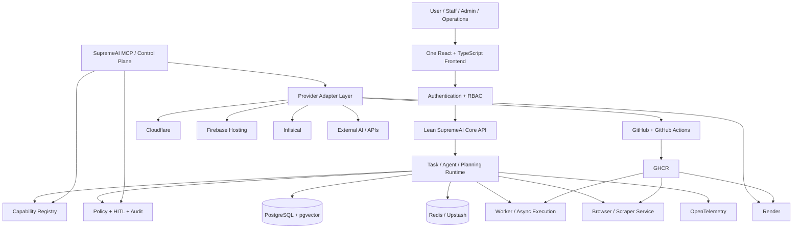
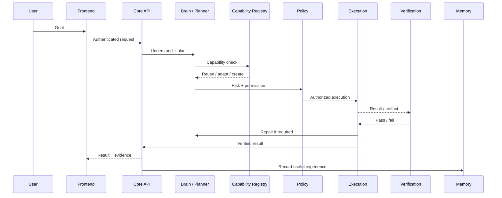
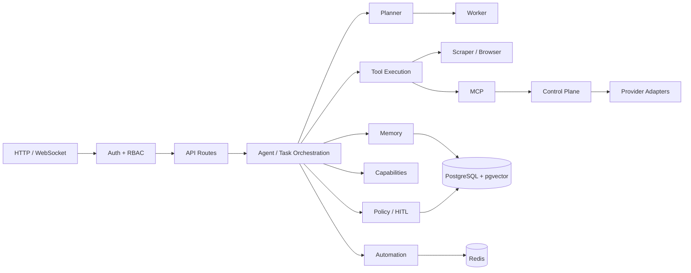
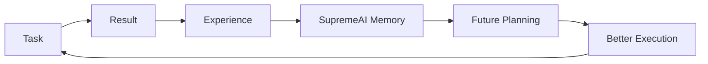
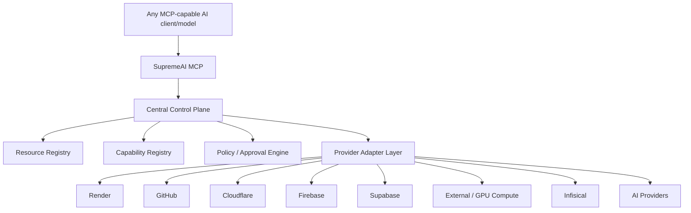
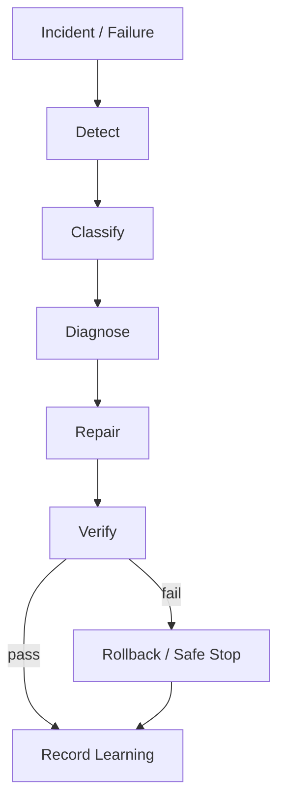

# SupremeAI 🚀

<p align="center"><strong>Autonomous AI Task-Execution Platform with Human-in-the-Loop Security</strong></p>

<p align="center">
  
  
  
  
  
</p>

> **SupremeAI is not just a chatbot with many tools.** The long-term objective is a governed, model-agnostic autonomous system that can understand a goal, discover what it requires, reuse or create capabilities, execute work, verify results, repair failures, learn from execution, and use the same machinery to operate and improve itself.

---

## Table of Contents

1. [SupremeAI Constitution](#1-supremeai-constitution)
2. [What SupremeAI Is](#2-what-supremeai-is)
3. [North-Star Architecture](#3-north-star-architecture)
4. [Task Execution Loop](#4-task-execution-loop)
5. [Technology & Service Map](#5-technology--service-map)
6. [Free-Tier / Low-Cost Distribution](#6-free-tier--low-cost-distribution)
7. [Service Responsibilities](#7-service-responsibilities)
8. [Frontend Architecture](#8-frontend-architecture)
9. [Backend Architecture](#9-backend-architecture)
10. [Autonomy & Capability Lifecycle](#10-autonomy--capability-lifecycle)
11. [Security & Governance](#11-security--governance)
12. [Memory & Learning](#12-memory--learning)
13. [Automation & Integrations](#13-automation--integrations)
14. [MCP & Central Control Plane](#14-mcp--central-control-plane)
15. [CI/CD & Deployment](#15-cicd--deployment)
16. [Database Strategy](#16-database-strategy)
17. [Configuration & Secrets](#17-configuration--secrets)
18. [Repository Map](#18-repository-map)
19. [Local Development](#19-local-development)
20. [Production Deployment](#20-production-deployment)
21. [Testing & Quality](#21-testing--quality)
22. [Observability & Recovery](#22-observability--recovery)
23. [Master Roadmap](#23-master-roadmap)
24. [Rules for AI Coding Agents](#24-rules-for-ai-coding-agents)
25. [Current-State Caveats](#25-current-state-caveats)
26. [License](#26-license)

---

# 1. SupremeAI Constitution

These principles define how SupremeAI should be designed, extended and operated.

## 1.1 The Eternal Brain Principle

SupremeAI's durable intelligence must accumulate inside SupremeAI's own memory and learning systems, including `ai_memory` / pgvector and future durable learning structures.

Third-party AI providers are **replaceable processing muscle**, not the permanent identity of SupremeAI.

**Implementation:** provider adapters, configuration-driven model selection, durable experience/memory, and provider-independent core interfaces.

## 1.2 Capability Sovereignty

SupremeAI must not become permanently dependent on one external capability provider.

```text
External Provider
      ↓
Provider Adapter
      ↓
SupremeAI Capability
```

Capabilities should remain replaceable, composable, testable and reusable.

## 1.3 Out-of-the-Box Meta Thinking

Do not blindly follow framework defaults when the actual objective requires a better abstraction or a simpler architecture.

Novel solutions are encouraged, but **security, correctness, reversibility, reliability and maintainability are non-negotiable**.

## 1.4 Dynamic Discovery Over Hardcoded Knowledge

Do not hardcode inventories of files, providers, services, agents or architecture that is expected to evolve.

Prefer:

```text
git-grep
AST / static analysis
repository inspection
configuration discovery
runtime metadata
memory queries
provider registries
```

Hardcoded values are acceptable when they are explicit configuration or policy rather than disguised dynamic inventories.

## 1.5 Reuse Before Creation

Always prefer:

```text
Search → Reuse → Adapt → Extend → Create
```

Before creating a service, capability, dependency or subsystem, inspect existing equivalents.

## 1.6 Verification Before Trust

No answer, diagnosis, code change, deployment or capability should be considered successful without appropriate evidence-based verification.

```text
Generate → Execute → Verify → Trust
```

## 1.7 Evidence Over Assumption

Observed evidence outranks model guesses.

Preferred evidence order:

```text
Runtime evidence
> repository evidence
> database evidence
> telemetry / logs
> documented knowledge
> assumptions
```

## 1.8 Policy Before Power

Powerful actions require policy evaluation before execution.

```text
Observe → Analyze → Risk → Permission → Approval → Act → Verify → Audit
```

Approval is required where policy says it is required.

## 1.9 Reversible Evolution

Autonomous changes should be versioned, auditable, tested and reversible whenever practical.

A significant autonomous change should preserve its reason, evidence, tests, risk and rollback path.

## 1.10 Graceful Degradation

A provider outage should not unnecessarily destroy the entire platform.

SupremeAI should prefer safe alternatives, reduced functionality or bounded retries over silent failure.

## 1.11 Provider Agnostic, User Loyal

The user interacts with **SupremeAI**, not with the vendor stack underneath it.

Underlying providers may change without changing the user's core mental model.

## 1.12 Thin Client / Thick Intelligence

Web, mobile, desktop, VS Code and Electron/Tauri clients should remain thin interfaces.

They must not contain provider secrets, privileged provider orchestration or duplicated intelligence/business logic.

## 1.13 Zero-Lock-In

No model, provider, framework, database, automation platform or hosting platform should become a permanent architectural dependency unless explicitly accepted as strategic.

## 1.14 Zero-Waste Resource Principle

The practical objective is **minimum sustainable infrastructure cost**, not a brittle promise that every service will remain free forever.

Achieve this with lightweight runtimes, on-demand execution, capability reuse, caching and workload-aware placement.

## 1.15 One System, Many Execution Surfaces

User tasks, system maintenance, self-healing, deployments, research and self-evolution should increasingly share the same task/capability machinery with different scopes and permissions.

```text
User Task
System Task
Incident Repair
Capability Creation
Deployment
Research
       ↓
SupremeAI Task Engine
```

## 1.16 Memory Must Compound

Useful execution experience should become reusable knowledge.

```text
Task → Result → Experience → Memory → Better Future Planning
```

## 1.17 Least Privilege, Maximum Capability

Maximum capability does not mean maximum permission.

```text
Capability ≠ Permission
```

## 1.18 No Silent Failure

SupremeAI must not intentionally report success when the system did not verify success.

```text
Failure → Detect → Explain → Repair/Retry → Verify → Report honestly
```

---

# 2. What SupremeAI Is

SupremeAI is being built as an **autonomous task-execution platform** for both user work and system operations.

Its core benchmark is:

> **Can SupremeAI reliably finish the user's real task?**

The system should continuously improve capability reuse, verification, recovery and learning rather than optimizing for a single model benchmark.

---

# 3. North-Star Architecture



### Core principle

> **Distributed execution, centralized control.**

Different platforms may execute different workloads, but SupremeAI should present one coherent control, policy, capability and audit model.

---

# 4. Task Execution Loop



---

# 5. Technology & Service Map

| Layer | Technology / Service | Purpose | Policy |
|---|---|---|---|
| Frontend | React + TypeScript + Vite | Unified user/admin UI | One application; role/permission routing |
| Backend | Python 3.11 + FastAPI | API, auth, orchestration, policy boundary | Keep Core lean |
| Database | PostgreSQL + pgvector | Durable state + semantic memory | Primary source of truth |
| Cache/Coordination | Redis / Upstash Redis | Cache, locks, short-lived state, queue support where configured | Transient, not durable business truth |
| AI | OpenAI-compatible / configured providers | Replaceable reasoning/processing engines | Adapter-based, provider-agnostic |
| Automation | n8n | External workflow automation | Optional |
| Browser | Playwright + Chromium | Browser automation/scraping | Dedicated service, not Core |
| Edge | Cloudflare | Edge/routing/edge execution | Adapter/control-plane layer |
| Frontend hosting | Firebase Hosting | Static UI delivery where used | No browser secrets |
| Runtime | Render | Managed production compute | Core / Worker / Scraper by workload |
| Container registry | GHCR | Immutable build artifacts | Build once; deploy exact artifact |
| Heavy compute | External compute such as Kaggle when justified | GPU/burst work | On demand |
| Secrets | Infisical + environment injection | Secret lifecycle | Never commit or expose secrets |
| Observability | OpenTelemetry | Cross-service telemetry | Correlation-first |
| Source/CI | GitHub + GitHub Actions | Source, testing, security, build, deployment | Engineering control plane |
| MCP | SupremeAI MCP / Control Plane | Resource/capability/provider control | Read-only first; actions are governed |

**Important:** source-code presence does not automatically mean a platform is an always-on production dependency. Runtime activation is workload-driven.

---

# 6. Free-Tier / Low-Cost Distribution

SupremeAI is designed around a **free-tier-friendly / low-maintenance** architecture. Vendor quotas can change, therefore quotas must not become hard-coded architectural assumptions.

```text
                         INTERNET
                            │
                            ▼
                     Cloudflare / Edge
                            │
                            ▼
                    Frontend Hosting
                            │
                            ▼
                   Render — Core API
                            │
              ┌─────────────┼─────────────┐
              ▼             ▼             ▼
        PostgreSQL      Redis/Upstash   External AI
        + pgvector       transient      providers
              │
       ┌──────┴──────┐
       ▼             ▼
     Worker        Scraper
   when needed   when needed
       │             │
       └──────┬──────┘
              ▼
       MCP / Control Plane
```

### Cost philosophy

- Keep Core small.
- Keep Chromium and heavy runtimes outside Core.
- Do not run duplicate full API services without a real workload reason.
- Use one PostgreSQL source of truth unless evidence justifies otherwise.
- Keep n8n optional.
- Use burst/external compute only when needed.
- Build affected images only.
- Reuse immutable artifacts.
- Keep provider/account counts configuration-driven.

The objective is **minimum sustainable cost**, not an unconditional promise of permanent $0 infrastructure.

---

# 7. Service Responsibilities

## Core API

Owns authentication, authorization, validation, task creation/status, lightweight orchestration, capability lookup, policy decisions, persistence and API/WebSocket interfaces.

Do not permanently load Chromium, large ML runtimes, heavy scraping or unnecessary long-running jobs into Core.

## Worker

Exists only for real asynchronous/background workloads. It must run real registered tasks through a canonical queue and have bounded retries, idempotency, health checks and observability.

> A second FastAPI server is not automatically a Worker.

## Scraper / Browser

Owns Playwright/Chromium, browser sessions and heavy browser-based interaction.

## PostgreSQL + pgvector

Durable system of record for users/tenants, agents, tasks, executions, approvals, audit, configuration and vector memory.

## Redis / Upstash

Transient cache/coordination/rate-limiting/locking/queue support where configured. Durable business truth remains in PostgreSQL.

## n8n

Optional workflow automation. Core AI remains operational without it.

## Render

Managed compute runtime. Service count follows workload needs rather than folder count.

## Cloudflare / Firebase

Edge and frontend delivery layers as configured.

## GitHub / Actions / GHCR

Source control, tests, audits, image build/sign/SBOM, immutable artifact distribution and deployment automation.

## Infisical

Secret lifecycle and environment-driven secret injection.

---

# 8. Frontend Architecture

SupremeAI should use **one frontend application**, not separate duplicate user/admin applications.

```text
/app
├── /workspace       USER
├── /admin           ADMIN
├── /staff           STAFF
├── /operations      OPERATOR
└── /settings        ROLE/PERMISSION aware
```

### User Workspace

```text
Workspace
├── Home
├── AI Studio
├── Projects
├── Agents
├── Files
├── Memory
├── Activity
├── Automation
├── Usage
├── Integrations
├── Team / Access
└── Settings
```

### Admin Command Center

```text
Command Center
├── Overview
├── Topology
├── Services
├── Agents / Swarm
├── Security
├── Audit
├── Incidents
├── Deployments
├── Reliability
├── Recovery
├── Tenants / RBAC
├── FinOps
├── RCA / Intelligence
├── Configuration
└── Evolution
```

### Security

> **UI visibility is not authorization.**

Backend RBAC/permission checks remain the source of truth.

---

# 9. Backend Architecture



Backend is the final authority for identity, tenant context, permissions, tool risk, execution authorization and auditability.

---

# 10. Autonomy & Capability Lifecycle


### Universal capability rule

```text
Search
 ↓
Reuse
 ↓
Adapt
 ↓
Extend
 ↓
Create
```

### Self-creation

```text
Gap
 ↓
Research
 ↓
Design
 ↓
Implement
 ↓
Test
 ↓
Security Scan
 ↓
Sandbox Validation
 ↓
Register
 ↓
Approval when required
 ↓
Activate
 ↓
Monitor
```

Generated capabilities must be versioned, permission-scoped, observable and reversible.

---

# 11. Security & Governance

```text
Request
 ↓
Authenticate
 ↓
Authorize
 ↓
Risk Classify
 ↓
Policy Check
 ↓
Approval if required
 ↓
Execute
 ↓
Verify
 ↓
Audit
```

### Security layers

- JWT/session lifecycle
- RBAC and permission scopes
- tenant isolation
- tool risk classification
- SSRF protections
- parameter validation
- sandboxing for risky execution
- HITL approvals
- signed container artifacts
- SBOM and vulnerability scanning
- environment-based secrets
- audit and correlation IDs

### Audit record

```text
actor
tenant
action
resource
risk
policy_decision
timestamp
correlation_id
result
```

---

# 12. Memory & Learning

### Working memory

Current task context and short-lived intermediate state.

### Episodic / Semantic memory

Durable useful experience, embeddings and semantic retrieval.

### Procedural memory

Skills, SOPs, capability metadata and reusable procedures.

### Compounding loop



Durable business truth belongs in PostgreSQL. Redis remains transient.

---

# 13. Automation & Integrations

```text
Application Event
      ↓
Automation Dispatcher
      ↓
Workflow Registry
      ↓
Provider Adapter
      ↓
n8n / Messaging / External Service
```

Automation should provide:

- centralized configuration
- workflow metadata
- retry/backoff
- idempotency
- execution recording
- provider abstraction

### n8n hardening

- fail closed when enabled without webhook secret
- receiver-side HMAC verification
- replay protection
- persistent retry-attempt history
- real health checks
- OpenTelemetry correlation
- admin failure/retry visibility

n8n is optional.

---

# 14. MCP & Central Control Plane



### MCP rollout

**Stage A — Read-only**

- resources
- health
- logs
- metrics
- deployments
- capabilities

**Stage B — Controlled actions**

- restart
- deploy
- rollback
- approved configuration actions

**Stage C — Approval-gated autonomy**

```text
Observe → Analyze → Policy → Risk → Approval → Act → Verify → Audit
```

MCP must never bypass authentication, RBAC, policy or HITL controls.

> “Any AI model” means any MCP-capable model/client or compatible adapter, not a promise that every raw model API is automatically interchangeable.

---

# 15. CI/CD & Deployment

```mermaid
flowchart LR
    PUSH[Push / PR] --> CHANGE[Change Detection]
    CHANGE --> TEST[Relevant Tests]
    TEST --> SEC[Security + Advanced Audit]
    SEC --> BUILD[Build Affected Images]
    BUILD --> CACHE[Build Cache]
    CACHE --> GHCR[Immutable GHCR Artifact]
    GHCR --> DEPLOY[Deploy Exact Artifact]
    DEPLOY --> HEALTH[Health + Smoke Tests]
    HEALTH --> SUM[Smart Summary]
```



### Rules

> **Every push must not rebuild everything.**

Use path-aware builds, parallel builds where safe, BuildKit/GHA caching, immutable SHA/digest artifacts, signing/SBOM, affected-service deployment and post-deploy verification.

### Engineering targets

```text
Optimized normal CI: ~5–7 min
Small frontend/docs/config change: ~1–3 min
```

Targets are measured engineering goals, not guarantees.

---

# 16. Database Strategy

> **PostgreSQL + pgvector is the primary persistent system.**

Rules:

- Alembic owns schema evolution.
- No production runtime table creation.
- DDL/migrations use the correct writer/direct connection.
- Runtime queries use the intended application/pooler path.
- SQLite is limited to explicitly justified local/test use.
- Do not introduce another primary database without measured architectural justification.

---

# 17. Configuration & Secrets

Configuration belongs outside source code whenever practical.

Typical dynamic configuration includes:

```text
DATABASE_URL
REDIS_URL
AI provider credentials
Render service identifiers
Cloudflare configuration
Firebase configuration
Infisical configuration
n8n webhook secrets
MCP endpoints
feature flags
runtime limits
```

### Never

- hardcode production credentials
- expose secrets in frontend bundles
- hardcode provider/account inventories that can evolve
- commit real secret values

### Desired flow

```text
Environment / Secret Manager
          ↓
Application Configuration
          ↓
Provider Adapter
          ↓
Execution
```

---

# 18. Repository Map

```text
supremeai/
├── backend/
│   ├── api/routes/               # HTTP/API routes
│   ├── core/                     # Core domain/runtime
│   │   ├── automation/           # Automation abstraction
│   │   ├── memory/               # Memory systems
│   │   ├── queue/                # Queue/async abstractions
│   │   ├── security/             # Security/policy
│   │   ├── mcp/                  # MCP-related logic
│   │   └── ...
│   ├── services/scraper/         # Browser/scraper boundary
│   ├── workers/                  # Worker entrypoints
│   ├── migrations/               # Alembic migrations
│   └── ...
├── frontend/src/                 # React/TypeScript application
├── infrastructure/cloudflare/   # Edge infrastructure
├── .github/workflows/            # CI/CD workflows
├── .github/actions/              # Reusable actions
├── .github/scripts/              # CI/deployment helpers
├── docs/                         # Architecture/security/UX docs
├── scripts/                      # Audit/test/maintenance tools
├── docker-compose*.yml           # Local support
└── README.md
```

Read the current source before adding a subsystem. Repository presence alone does not prove production activation.

---

# 19. Local Development

## Backend

```bash
cd backend
pip install poetry
poetry install
cp .env.example .env
alembic upgrade head
python main.py
```

API:

```text
http://localhost:8000
http://localhost:8000/docs
```

## Frontend

```bash
cd frontend
npm install
cp .env.example .env.local
npm run dev
```

Frontend:

```text
http://localhost:5173
```

## Local PostgreSQL example

```bash
docker run --name supremeai-db \
  -e POSTGRES_USER=postgres \
  -e POSTGRES_PASSWORD=postgres \
  -e POSTGRES_DB=supremeai \
  -p 5432:5432 \
  -d pgvector/pgvector:pg16
```

---

# 20. Production Deployment

Production should be separated by **workload role**, not by blindly deploying multiple copies of the same API.

```text
Production Runtime
       │
 ┌─────┼─────────────┐
 ▼     ▼             ▼
Core  Worker       Scraper
API   if needed    Browser
 │       │           │
 └───────┼───────────┘
         ▼
 PostgreSQL / Redis
```

### Core

Primary request-serving runtime.

### Worker

Only when real asynchronous workloads justify it.

### Scraper

Dedicated browser/Chromium runtime.

### Heavy compute

External/burst compute only when the workload justifies it.

### Production rule

> **Workload first, service count second.**

---

# 21. Testing & Quality

### Backend

- unit tests
- integration tests
- database tests
- security tests
- contract tests
- coverage

### Frontend

- type checks
- lint
- unit/component tests
- build
- permission tests
- responsive/visual verification

### System

- health checks
- smoke tests
- schema contract checks
- deployment verification
- security/audit checks

### Coverage philosophy

```text
Critical paths       → highest threshold
Core modules         → high threshold
Important modules    → medium threshold
Supporting code      → lower threshold
Overall              → baseline gate
```

Do not delete failing tests merely to make CI green.

---

# 22. Observability & Recovery

SupremeAI should appear as one logical system even while execution is distributed.

Track:

- service health
- task lifecycle
- agent behavior
- latency
- resource usage
- failures
- provider health
- deployments

Prefer shared correlation identifiers:

```text
request_id
correlation_id
task_id
execution_id
provider_execution_id
```

### Recovery loop



Retries must be bounded.

---

# 23. Master Roadmap

## P0 — Stabilize

1. DB/session lifecycle
2. schema/migration correctness
3. Redis/runtime correctness
4. startup/shutdown correctness
5. critical security findings
6. CI reliability and failure visibility
7. deployment verification
8. resource optimization

## P1 — Lean Foundation

9. lean Core API
10. actual background workload inventory
11. Worker/Scraper separation where justified
12. unified frontend
13. shared UI shell
14. RBAC/permission matrix

## P2 — Autonomous Platform

15. Capability Registry
16. User Task Engine
17. execution/verification/repair
18. Unified Control Plane
19. provider adapters
20. MCP read-only
21. controlled MCP actions

## P3 — Governed Autonomy

22. self-healing integration
23. capability self-creation
24. approval workflow
25. proactive learning
26. governed self-evolution

## P4 — Scale

27. multi-tenancy
28. customer MCP
29. provider/account expansion
30. intelligent resource placement
31. continuous optimization
32. future capability ecosystem / marketplace

---

# 24. Rules for AI Coding Agents

This section is mandatory reading for coding agents.

## MUST

- inspect current code before implementation
- search for existing functionality before creating new functionality
- reuse existing abstractions
- preserve authentication and backend authorization
- preserve tenant boundaries
- use environment-driven configuration
- keep heavy workloads outside Core when possible
- validate migrations
- add tests for behavioral changes
- verify deployment impact
- document architectural changes
- distinguish existing implementation from new implementation

## MUST NOT

- rewrite the backend without evidence
- invent API contracts
- invent response shapes
- create fake telemetry
- create fake successful execution
- duplicate memory/file/workspace/billing/audit/security systems
- create a service for every directory
- add dependencies without a measured need
- hardcode credentials
- bypass policy or HITL
- make frontend checks the only security boundary
- allow unlimited retries/self-modification/background tasks
- delete legacy code without reference analysis
- declare a provider/service production-active without evidence

## Required change report

```text
1. Current state inspected
2. Existing implementation reused
3. Files changed
4. API impact
5. DB impact
6. Security impact
7. Tests + results
8. Deployment impact
9. Remaining gaps
10. Rollback plan
```

---

# 25. Current-State Caveats

This README is the **high-level orientation layer**. Detailed contracts remain in source code and specialized docs.

Important rules:

- Vendor free-tier quotas and policies can change.
- Historical/transitional repository material may exist; verify before using it as architecture authority.
- A source module existing does not prove that it is a live production service.
- The Worker is not a real async platform until actual background tasks/queue execution are verified.
- Playwright/Chromium should remain outside Core unless measured evidence proves otherwise.
- Alembic is the schema authority; production runtime DDL is not the target architecture.
- Frontend route hiding is not authorization.
- n8n is optional.
- External compute is workload-driven.
- Autonomous means **governed autonomy**: policy, verification, audit, bounded retries and rollback remain part of the system.

---

# 26. License

MIT License.

See [`LICENSE`](LICENSE) for the full license text.

---

## One-Minute Mental Model for AI Agents

```text
SUPREMEAI
│
├── ONE FRONTEND
│   ├── User Workspace
│   ├── Admin Command Center
│   └── Role-based access
│
├── ONE CORE API
│   ├── Auth / RBAC
│   ├── Agents
│   ├── Tasks
│   ├── Tools
│   ├── Memory
│   ├── Policy / HITL
│   └── Persistence
│
├── EXECUTION
│   ├── Worker (only when needed)
│   ├── Scraper / Browser
│   └── External Heavy Compute
│
├── PERSISTENCE
│   ├── PostgreSQL
│   └── pgvector
│
├── TRANSIENT
│   └── Redis
│
├── AUTOMATION
│   └── n8n (optional)
│
├── CONTROL
│   ├── MCP
│   ├── Resource Registry
│   ├── Capability Registry
│   ├── Provider Adapters
│   └── Policy / Approval
│
├── OPERATIONS
│   ├── GitHub
│   ├── GitHub Actions
│   ├── GHCR
│   ├── Render
│   ├── Cloudflare
│   ├── Firebase
│   └── Infisical
│
└── EVOLUTION
    ├── Task completion
    ├── Verification
    ├── Repair
    ├── Capability creation
    ├── Proactive learning
    └── Continuous optimization
```

> **If a new feature cannot clearly explain which existing SupremeAI layer owns it, stop and inspect the architecture before coding.**
