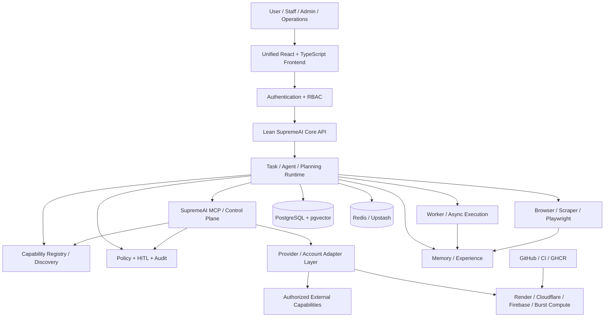

# SupremeAI 🚀

<p align="center"><strong>Autonomously Orchestrated AI Task-Execution Platform</strong></p>

<p align="center">
  
  
  
  
  
</p>

> **SupremeAI is not a chatbot that happens to have many tools.** It is being built as a governed, model-agnostic task-execution system whose long-term purpose is to solve real user problems by discovering, composing, reusing and—when genuinely necessary—creating capabilities. The same machinery is intended to operate, test, repair, learn from and safely improve SupremeAI itself.

## The Core Idea — Capability Before Construction

The most important architectural rule is simple:

> **When a new problem arrives, SupremeAI should first ask what it already has before deciding what it needs to build.**

A new user request is therefore not automatically a new engineering project. SupremeAI should inspect its existing capability surface—agents, MCP tools, browser automation, provider adapters, account/resource pools, memory, workflows, execution workers, validation, failover, and previously planned capabilities—and compose the smallest safe solution from what is already available.

```text
                         NEW USER GOAL
                               │
                               ▼
                     Understand the problem
                               │
                               ▼
                  Discover required capabilities
                               │
                ┌──────────────┼──────────────┐
                │              │              │
                ▼              ▼              ▼
             Existing       Planned /       External
             capability     near-ready      capability
                │              │              │
                └──────────────┼──────────────┘
                               ▼
                         Compose a plan
                               │
                               ▼
                       Policy / permissions
                               │
                               ▼
                            Execute
                               │
                    ┌──────────┴──────────┐
                    ▼                     ▼
                 Verify                Failure
                    │                     │
                    │              Retry / repair /
                    │                 failover
                    └──────────┬──────────┘
                               ▼
                         Deliver honestly
                               │
                               ▼
                  Capture reusable experience
```

This is why SupremeAI's capability coverage can be much larger than the number of polished user-facing features. A capability may already exist in code, be exposed through MCP, be available through a provider adapter, be implemented in a dedicated service, or already be specified in the project's planning corpus and need only final wiring.

---

## Table of Contents

1. [SupremeAI Constitution](#supremeai-constitution)
2. [What SupremeAI Is](#what-supremeai-is)
3. [The Capability-Composition Model](#the-capability-composition-model)
4. [How a User Problem Is Solved](#how-a-user-problem-is-solved)
5. [Self-Evolution Loop](#self-evolution-loop)
6. [External Capability Delegation](#external-capability-delegation)
7. [North-Star Architecture](#north-star-architecture)
8. [Existing Capability Surface](#existing-capability-surface)
9. [Planning Is Part of the Capability Surface](#planning-is-part-of-the-capability-surface)
10. [Technology & Service Map](#technology--service-map)
11. [MCP & Central Control Plane](#mcp--central-control-plane)
12. [Memory & Learning](#memory--learning)
13. [Security & Governance](#security--governance)
14. [Reliability, Failover & Degradation](#reliability-failover--degradation)
15. [Low-Cost / Zero-Waste Philosophy](#low-cost--zero-waste-philosophy)
16. [CI/CD & Deployment](#cicd--deployment)
17. [Repository & Planning Map](#repository--planning-map)
18. [Testing & Quality](#testing--quality)
19. [Current-State Caveats](#current-state-caveats)
20. [License](#license)

---

# SupremeAI Constitution

These principles govern how the system should be designed and extended.

### 1. Eternal Brain

SupremeAI's durable identity and useful experience should accumulate in its own memory and learning systems. External models are replaceable processing engines, not the permanent identity of SupremeAI.

### 2. Capability Sovereignty

Capabilities should be replaceable, composable, testable and reusable. Provider-specific details belong behind adapters or governed execution surfaces.

### 3. Reuse Before Creation

```text
Discover → Reuse → Compose → Adapt → Extend → Create
```

Never build a new subsystem merely because a similar capability already exists somewhere in the repository or planning corpus.

### 4. Dynamic Discovery

Prefer repository inspection, registries, runtime metadata, configuration discovery, MCP discovery and memory queries over brittle hard-coded inventories.

### 5. Verification Before Trust

```text
Generate → Execute → Verify → Trust
```

An unverified answer, artifact, deployment or autonomous change is not considered successfully completed.

### 6. Policy Before Power

```text
Observe → Analyze → Risk → Permission → Approval → Act → Verify → Audit
```

High-impact actions remain governed even when the system is autonomous.

### 7. Reversible Evolution

Autonomous improvements should preserve their reason, evidence, tests, risk and rollback path whenever practical.

### 8. Graceful Degradation

A single provider, account, runtime or service failure should not unnecessarily destroy the whole task. Prefer safe alternatives, reduced functionality and bounded recovery.

### 9. Provider Agnostic, User Loyal

The user asks SupremeAI for an outcome. The underlying provider stack may change without changing the user's mental model.

### 10. One System, Many Execution Surfaces

User work, research, browser automation, system maintenance, incident repair, deployment and self-evolution should increasingly share the same task/capability machinery with different scopes and permissions.

### 11. Memory Must Compound

```text
Task → Result → Experience → Memory → Better Future Planning
```

### 12. Least Privilege, Maximum Capability

```text
Capability ≠ Permission
```

The system may know how to do something without automatically being authorized to do it.

### 13. No Silent Failure

```text
Failure → Detect → Explain → Repair/Retry → Verify → Report honestly
```

### 14. Sustainable Cost

The objective is minimum sustainable infrastructure cost, not an unconditional promise that every vendor will remain free forever. Workload placement, reuse, caching, on-demand execution and replaceable providers are preferred over fragile quota assumptions.

---

# What SupremeAI Is

SupremeAI is an autonomous task-execution platform for both **user work** and **system operations**.

Its real benchmark is not how many features are listed in the UI. The benchmark is:

> **Can SupremeAI reliably finish a real user's task, using the capabilities it already has, while safely discovering or acquiring only what is actually missing?**

This changes the engineering strategy.

A traditional product might do this:

```text
New requirement → Build new feature → Deploy → Maintain
```

SupremeAI aims for:

```text
New requirement
      ↓
Capability inventory
      ↓
Reuse existing capability
      ↓
Compose existing capabilities
      ↓
Use a planned/near-ready capability if appropriate
      ↓
Delegate to an authorized external capability if appropriate
      ↓
Only then build the smallest missing capability
      ↓
Test → Verify → Register → Reuse later
```

---

# The Capability-Composition Model

SupremeAI should maintain a mental model of **what it can do**, not merely a list of software packages.

A capability can come from several sources:

```text
┌─────────────────────────────────────────────────────┐
│              SUPREMEAI CAPABILITY SURFACE           │
├─────────────────────────────────────────────────────┤
│ Native code / services                               │
│ Agents and dynamic agents                            │
│ MCP tools and resources                              │
│ Browser / Playwright automation                      │
│ LLM/provider adapters                                │
│ Multi-account / resource pools                      │
│ Workers and asynchronous execution                   │
│ Memory / RAG / experience                            │
│ CI/CD and repository automation                      │
│ Existing workflows and integrations                  │
│ Planned / near-complete architecture                 │
│ User-authorized external capabilities                │
└─────────────────────────────────────────────────────┘
```

The system should therefore distinguish three useful states:

| State | Meaning | Preferred action |
|---|---|---|
| **Available** | Capability is implemented and usable | Reuse/compose it |
| **Near-ready** | Capability is already designed/partially implemented and mainly needs wiring, hardening or activation | Finish it |
| **Missing** | No suitable capability exists | Discover, delegate, or create the minimum required capability |

This is the foundation for the project's long-term **problem coverage** strategy.

### Problem Coverage

For a new task, a useful internal metric is:

```text
Problem Coverage =
    reusable existing capabilities
  + near-ready planned capabilities
  + safe external capabilities
  ───────────────────────────────────
    capabilities required by the task
```

This is **not** a promise that every task is already solved. It is a planning metric that prevents the team and the AI from rebuilding infrastructure unnecessarily.

---

# How a User Problem Is Solved

Consider a user asking for something SupremeAI does not natively specialize in—for example, producing a video, interacting with a third-party web application, researching a niche subject, repairing a repository, or operating a business workflow.

SupremeAI should not immediately answer “I cannot do that.”

It should reason approximately as follows:

```text
1. What exactly is the user asking for?
2. What capabilities does the task require?
3. Which required capabilities already exist?
4. Which can be composed through MCP/tools/agents?
5. Which existing account/provider/resource can perform the work?
6. Can browser automation operate an authorized web capability?
7. Is there a near-ready capability already documented in the plans?
8. What is the safest and cheapest execution route?
9. How can the result be independently verified?
10. What experience should be retained for future tasks?
```

The result should be a **task plan**, not a provider-specific script.

```text
User Intent
   ↓
Task Decomposition
   ↓
Capability Discovery
   ↓
Resource / Provider Selection
   ↓
Policy & Permission
   ↓
Execution
   ↓
Verification
   ↓
Repair / Retry / Failover if necessary
   ↓
Delivery + Evidence
   ↓
Experience / Memory
```

---

# Self-Evolution Loop

One of SupremeAI's long-term goals is to turn real user problems into a continuous capability-improvement loop.

**The critical safety rule:** learning does not mean blindly changing production.

```text
                 REAL USER PROBLEM
                         │
                         ▼
                Identify capability gap
                         │
              ┌──────────┴──────────┐
              │                     │
        Capability exists      Capability missing
              │                     │
              ▼                     ▼
           Reuse            Research / discover
                                    │
                         ┌──────────┴──────────┐
                         │                     │
                    Learn from AI        Learn from web
                    / memory             / user / docs
                         └──────────┬──────────┘
                                    ▼
                           Candidate capability
                                    │
                                    ▼
                              Sandbox / test
                                    │
                                    ▼
                       Evaluation + security checks
                                    │
                         ┌──────────┴──────────┐
                         ▼                     ▼
                       FAIL                  PASS
                         │                     │
                      Iterate            Governed promotion
                                               │
                                               ▼
                                      Capability Registry
                                               │
                                               ▼
                                      Future task reuse
```

Therefore:

> **Every solved problem should have the opportunity to make the next similar problem cheaper, faster and more reliable.**

The system is not trying to become omniscient. It is trying to make its **reusable problem-solving surface compound over time**.

---

# External Capability Delegation

SupremeAI does not need to personally host every specialized capability.

If an external service can perform a specialized task and the user has authorized access where required, SupremeAI may act as an intelligent orchestrator/operator.

For example:

```text
User: “Create a marketing video.”

SupremeAI:
  Native video generator? → No
  Existing authorized provider? → Yes
  API available? → Use API
  Browser-only capability? → Use governed browser automation
  Result retrieved? → Validate
  Result valid? → Present to user
```

This makes **browser automation an execution surface for authorized capabilities**, not merely a scraper.

```text
SupremeAI
   │
   ├── Native capability
   ├── MCP capability
   ├── API capability
   └── Browser-accessible capability
             │
             ▼
      User-authorized account
             │
             ▼
         Execute → Verify
```

Credentials and sessions must remain protected. SupremeAI must not bypass authentication controls, security challenges or provider restrictions. External execution is subordinate to permission, policy, safety and verification.

---

# North-Star Architecture



### Core principle

> **Distributed execution, centralized intelligence and governance.**

The user should see one SupremeAI even when a task crosses multiple agents, providers, accounts, browser sessions, workers or external capabilities.

---

# Existing Capability Surface

The current repository already contains many of the ingredients required by the North Star. The purpose of this section is to make that reality visible in the README rather than making future work look like a collection of unrelated greenfield projects.

### MCP / capability discovery

MCP is intended to be a central discovery and execution/control surface. The repository contains MCP tooling, configuration and deployment paths. The architecture should use MCP to expose reusable capabilities rather than creating a new bespoke integration for every task.

### Dynamic planning and agents

The repository contains a dynamic planning engine and dynamic agent/tool machinery. New tasks should therefore be mapped onto existing capabilities before new agents are created.

### LLM/provider abstraction

The repository uses gateway/adapter concepts for model/provider selection and failover. Providers are replaceable processing resources rather than SupremeAI's identity.

### Browser automation

Playwright/Chromium-based browser execution is already a dedicated capability. It can support scraping, multi-step interaction and authorized browser-accessible external capabilities.

### Multi-account / resource pools

The architecture contains multi-account/resource-rotation concepts. These should be treated as a configurable resource pool behind orchestration—not as assumptions that a particular vendor will provide unlimited quota.

### Failover and self-healing

Retry, failover, circuit adaptation, health monitoring, automated healing and deployment health checks are already represented in the codebase and planning.

### Workers and asynchronous execution

Background execution exists as a separate workload surface so heavy or long-running work does not have to be loaded into the lean Core API.

### Memory / RAG

PostgreSQL + pgvector and memory abstractions provide durable state and semantic/experience storage. Useful execution experience should become reusable knowledge rather than disappearing after a single request.

### CI/CD and immutable artifacts

GitHub Actions/GHCR and deployment automation provide an engineering control plane for testing, building and delivering services.

### Governance

RBAC, policy, audit, HITL and sandbox/evaluation concepts provide the foundation for safely promoting powerful autonomous changes.

---

# Planning Is Part of the Capability Surface

SupremeAI's design history matters.

The repository contains a substantial planning corpus covering architecture consolidation, production readiness, browser automation, missing-service integrations, storage, configuration hardening, testing and other capabilities. These plans should not be treated as disconnected documentation.

They are **architectural intent** and, where implementation already exists, evidence of capabilities that are already partially realized.

Important examples include:

- `docs/architecture/SUPREMEAI_CONSOLIDATION_AND_CLEANUP_PLAN.md` — consolidation and structural cleanup direction.
- `docs/browser/SUPREME_BROWSER_MASTER_PLAN.md` — the unified browser automation direction.
- `docs/PRODUCTION_READINESS_PLAN_V3.md` — production hardening/readiness roadmap.
- `docs/plans/PRODUCTION_UPGRADE_PLAN.md` — production upgrade and orchestration planning.
- `docs/plans/MISSING_SERVICES_INTEGRATION_PLAN_V4.1.md` — planned integration of missing/optional services.
- `docs/FREE_TIER_STORAGE_PLAN.md` — low-cost/free-tier storage strategy.
- `docs/ADMIN_TASKS.md` — operational/admin tasks and known limitations.
- `backend/COVERAGE_90_PLAN.md` — explicit quality/coverage completion work.
- `specs/*/plan.md` — feature-specific implementation plans following the repository's specification workflow.

The repository also contains tooling that treats an admin-plan corpus as an input to plan organization. That means the planning system itself is part of the project's execution model, not merely a collection of old notes.

### Rule for future AI agents

Before proposing a new subsystem:

```text
1. Inspect the current implementation.
2. Search the repository for an existing capability.
3. Search the relevant planning corpus.
4. Determine whether the capability is available, near-ready, or genuinely missing.
5. Reuse or finish the existing path when possible.
6. Only create new infrastructure when the evidence says it is necessary.
```

This rule is one of the most important ways SupremeAI avoids architectural duplication.

---

# Technology & Service Map

| Layer | Technology / Service | Role |
|---|---|---|
| Frontend | React + TypeScript + Vite | Unified user/admin interface |
| Core | Python 3.11 + FastAPI | API, orchestration, policy boundary |
| Database | PostgreSQL + pgvector | Durable state and semantic memory |
| Cache/coordination | Redis / Upstash | Transient cache, locks, coordination and configured queue support |
| AI | Configured/provider-compatible models | Replaceable reasoning/processing |
| Browser | Playwright + Chromium | Browser automation and scraping |
| MCP | SupremeAI MCP / control plane | Capability/resource/provider discovery and governed control |
| Worker | Async execution service | Long-running/background work |
| Edge | Cloudflare | Edge/routing/edge execution where configured |
| Runtime | Render | Managed production compute |
| Frontend hosting | Firebase Hosting | Static UI delivery where configured |
| Registry | GHCR | Immutable container artifacts |
| Source/CI | GitHub + GitHub Actions | Source, tests, audits, builds and deployment |
| Secrets | Infisical + environment injection | Secret lifecycle |
| Observability | OpenTelemetry | Cross-service telemetry |
| Automation | n8n | Optional workflow automation |
| Burst compute | External compute when justified | On-demand heavy workloads |

---

# MCP & Central Control Plane

MCP is strategically important because it can turn a collection of independent capabilities into a discoverable execution fabric.

Instead of teaching every agent every integration:

```text
Agent
  ↓
Capability Discovery
  ↓
MCP
  ↓
Available tools/resources/providers
  ↓
Choose the smallest useful combination
```

The same control plane can increasingly serve:

- user tasks
- research
- browser operations
- repository work
- deployments
- incident response
- system maintenance
- capability discovery
- capability testing
- self-evolution

MCP should not bypass policy. Powerful actions remain permissioned and auditable.

---

# Memory & Learning

Memory should make SupremeAI better at future tasks without turning the database into an unbounded event dump.

```text
Task
 ↓
Plan
 ↓
Execution
 ↓
Result / failure
 ↓
Useful experience
 ↓
Memory
 ↓
Future capability selection
```

Memory should preferentially retain reusable information such as:

- successful execution strategies
- validated tool combinations
- failure causes and remedies
- user-approved preferences
- provider reliability observations
- reusable domain knowledge
- capability metadata

Raw transient execution state belongs in the appropriate short-lived store.

---

# Security & Governance

Autonomy must not mean unrestricted authority.

```text
Capability
   ≠
Permission
   ≠
Approval
```

A safe autonomous action path is:

```text
Discover
  ↓
Classify risk
  ↓
Check permission
  ↓
Request approval when required
  ↓
Execute in the correct scope
  ↓
Verify
  ↓
Audit
```

Generated code, new capabilities and production-impacting changes should be versioned, tested and reversible where practical. Sandbox/evaluation and HITL mechanisms are preferred before promoting powerful changes.

For user-provided credentials or browser sessions:

- credentials must be handled as secrets;
- users must explicitly authorize access;
- sessions must be scoped to the intended task;
- SupremeAI must not attempt to bypass authentication or security controls;
- third-party policies and permissions remain constraints on execution.

---

# Reliability, Failover & Degradation

Free-tier and distributed execution makes failure normal. The architecture therefore prefers **resource abstraction over resource certainty**.

```text
Primary resource
      ↓
Health / capacity check
      ↓
Execute
      ↓
Failure?
 ┌────┴────┐
 No       Yes
 │          │
 ▼          ▼
Verify   Retry / alternate resource
             ↓
         Verify again
             ↓
      Reduced/deferred mode
             ↓
         Honest report
```

Multi-account and multi-provider mechanisms should be hidden behind resource pools and schedulers. A vendor quota should never be treated as a permanent architectural guarantee.

---

# Low-Cost / Zero-Waste Philosophy

The goal is **minimum sustainable cost**, with zero-cost operation where practical—not a fragile promise that every provider will remain free forever.

Preferred techniques:

- reuse existing capabilities;
- cache repeatable results;
- avoid duplicate services;
- keep heavy runtimes outside Core;
- execute heavy work on demand;
- use provider/account pools through adapters;
- use browser delegation when an authorized external capability is more economical than hosting a specialized stack;
- build only affected artifacts;
- retain immutable artifacts;
- make provider counts/configuration dynamic.

The most important cost optimization is not another quota trick. It is **not doing work that an existing capability can already do**.

---

# CI/CD & Deployment

The repository uses GitHub/GitHub Actions/GHCR and managed runtime surfaces as its engineering control plane.

The preferred lifecycle is:

```text
Change
 ↓
Lint / Type / Unit tests
 ↓
Security / audit checks
 ↓
Build immutable artifact
 ↓
Deploy the exact artifact
 ↓
Health / smoke verification
 ↓
Observe
 ↓
Rollback or repair if necessary
```

Autonomous evolution must use the same discipline. A generated improvement is a candidate until it has evidence.

---

# Repository & Planning Map

Useful entry points include:

```text
README.md                         ← this architecture contract
AGENTS.md                         ← AI-agent engineering guidance
CHECKPOINT.md                     ← session continuity
STATUS.md                         ← current project state
LESSONS_LEARNED.md                ← accumulated engineering lessons

backend/                          ← Core Python implementation
backend/services/                 ← orchestration/runtime services
backend/tools/                    ← reusable tools and planning helpers
backend/COVERAGE_90_PLAN.md       ← coverage completion plan

frontend/                         ← unified React application

mcp/                              ← MCP/control-plane implementation where present

docs/architecture/               ← architecture plans
docs/browser/                    ← browser master plan
docs/plans/                      ← major implementation plans
docs/                            ← operational/readiness/storage plans
specs/                            ← feature specifications and plans
```

When a plan says something is missing, verify the current `main` before implementing it. Plans are historical/architectural inputs; current code and runtime evidence remain the final authority for what is actually available.

---

# Testing & Quality

SupremeAI's quality strategy should test both individual capabilities and the composition layer.

Important categories include:

- unit and integration tests;
- agent/tool discovery;
- task planning and routing;
- browser automation;
- provider/account selection;
- failover and retry;
- worker execution;
- memory persistence/retrieval;
- policy/RBAC/HITL;
- generated capability evaluation;
- deployment smoke tests;
- end-to-end user missions.

The most valuable future tests are **mission tests**:

> Given a realistic user problem, can SupremeAI discover and compose the required existing capabilities and finish the task with verified evidence?

That measures the actual product, rather than only measuring whether individual modules exist.

---

# Current-State Caveats

This README describes the **North-Star architecture and the capability-composition philosophy**, while acknowledging that implementation maturity varies.

A capability being:

- documented,
- partially implemented,
- registered,
- tested in isolation, or
- present behind a feature flag

does not automatically mean the complete end-to-end user mission is production-ready.

For current truth, prefer:

```text
Runtime evidence
  > current source code
  > current tests / CI
  > telemetry and logs
  > current planning documents
  > assumptions
```

The project's goal is not to claim that SupremeAI can already solve every problem. The goal is to build a system where **most new problems can be solved by discovering, composing, activating, or safely extending capabilities that are already part of the SupremeAI ecosystem**.

---

# The Long-Term North Star

SupremeAI should evolve from:

```text
“An AI with many features”
```

toward:

```text
“An AI that knows what it can do,
knows what it needs,
knows where to get what it lacks,
knows how to verify the result,
and becomes more capable after every validated problem.”
```

In its strongest form:

```text
                USER PROBLEM
                     ↓
              SUPREMEAI BRAIN
                     ↓
          Discover existing capability
                     ↓
              Compose / delegate
                     ↓
                Execute safely
                     ↓
              Verify the outcome
                     ↓
             Repair when needed
                     ↓
             Learn from evidence
                     ↓
          Promote reusable capability
                     ↓
             Larger capability graph
                     ↓
          Better next-user experience
```

**That compounding capability graph—not the number of individual services—is the real product.**

---

# License

MIT — see [`LICENSE`](LICENSE).
