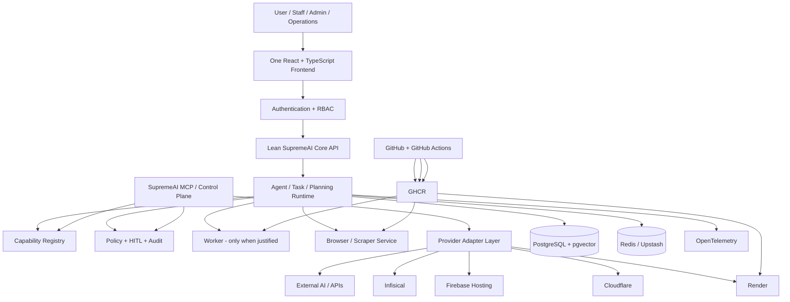
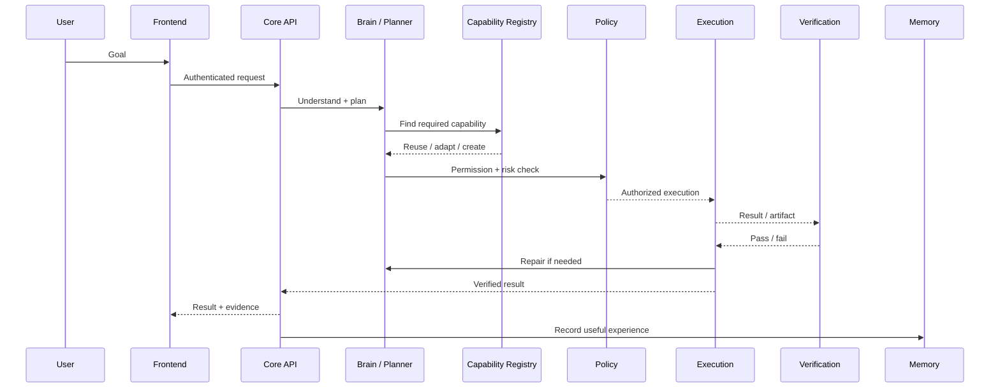
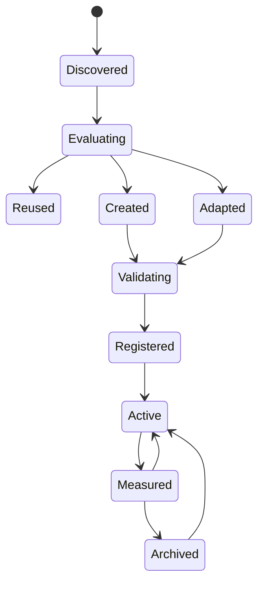
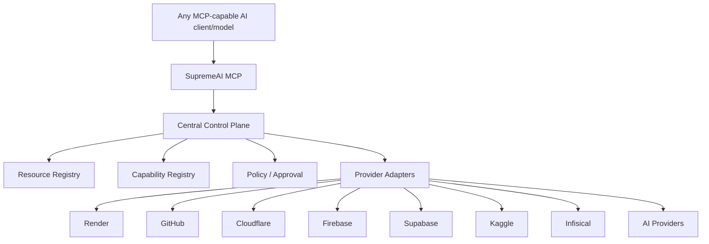
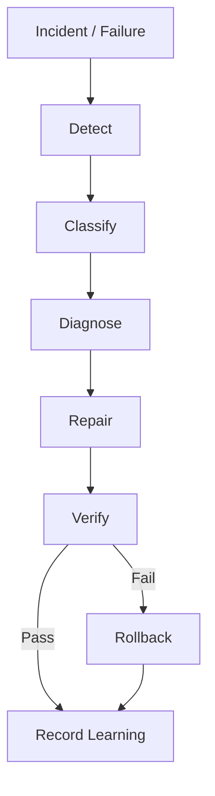

# SupremeAI 🚀

<p align="center"><strong>Autonomous AI Task-Execution Platform with Human-in-the-Loop Security</strong></p>

<p align="center">
  
  
  
  
  
</p>

> **SupremeAI is not just a chatbot with many tools.** The long-term goal is a governed autonomous platform that can understand a goal, plan it, find or create the required capability, execute the work, verify the result, repair failures, learn from execution, and use the same machinery to operate and improve itself.

---

## 1. What SupremeAI Is

SupremeAI is being built as an **autonomous task-execution platform** for user work and system operations.

Core loop:

```text
Goal
 ↓
Understand
 ↓
Plan
 ↓
Capability Check
 ↓
Resource Check
 ↓
Reuse / Adapt / Extend / Create
 ↓
Validate
 ↓
Execute
 ↓
Verify
 ↓
Repair / Retry when necessary
 ↓
Deliver
 ↓
Measure
 ↓
Learn / Promote / Archive
```

The primary benchmark is:

> **Can SupremeAI reliably finish the user's real task?**

not whether it is already equal to a frontier general-purpose model.

---

## 2. Architecture at a Glance



### Core principle

> **Distributed execution, centralized control.**

Different providers and runtimes may be used underneath, but SupremeAI should expose one coherent control, policy, execution and audit model.

---

## 3. How a User Task Flows



---

## 4. Current Technology & Service Map

| Layer | Technology / Service | Role | Runtime status / policy |
|---|---|---|---|
| Frontend | React + TypeScript + Vite | User + admin UI | **One application**, role/permission based |
| Backend | Python 3.11 + FastAPI | Auth, API, orchestration, policy boundary | **Core runtime** |
| Database | PostgreSQL + pgvector | Durable application state + vector memory | **Primary source of truth** |
| Cache / coordination | Redis / Upstash Redis | Cache, short-lived coordination, rate limiting where configured | **Transient state** |
| Automation | n8n | External workflow automation | **Optional; Core AI must not depend on it** |
| Browser | Playwright + Chromium | Browser automation / scraping | **Dedicated scraper service** |
| Edge | Cloudflare | Edge worker / routing / edge capabilities | **Provider/edge layer** |
| Frontend hosting | Firebase Hosting | Static frontend delivery where used | **Frontend delivery layer** |
| Container registry | GitHub Container Registry | Immutable build artifacts | **Build once, deploy exact artifact** |
| Runtime | Render | Primary managed compute | **Core / optional Worker / Scraper roles** |
| Heavy compute | External compute such as Kaggle when justified | GPU / burst workloads | **On demand, not always-on** |
| Secrets | Infisical + deployment env injection | Secret lifecycle | **No secrets in source or browser bundles** |
| Observability | OpenTelemetry | Trace/telemetry foundation | **Cross-service observability** |
| Source + CI | GitHub + GitHub Actions | Source, tests, audits, build, deploy | **Engineering control plane** |
| Control | SupremeAI MCP / Control Plane | Resource/capability/provider control | **Read-only first, then controlled actions** |
| AI | OpenAI-compatible / configured providers | Model intelligence | **Provider abstraction** |

**Important:** a technology appearing in this table does not mean it must be an always-on production service. SupremeAI prefers the lightest runtime that satisfies the workload.

---

## 5. Free-Tier / Low-Cost Distribution

The project is designed for a **free-tier-friendly / low-maintenance deployment model**. Exact vendor quotas can change, so application logic must never depend on a fixed quota or hard-coded provider limit.

```text
                         INTERNET
                            │
                            ▼
                    Cloudflare / Edge
                            │
                            ▼
                     Frontend Hosting
                            │
                            ▼
                   Render — Core API
                            │
             ┌──────────────┼──────────────┐
             ▼              ▼              ▼
        PostgreSQL      Redis/Upstash   External AI
        + pgvector       transient      providers
             │
             ├───────────────┐
             ▼               ▼
          Worker        Scraper/Browser
        when needed       when needed
             │               │
             └───────┬───────┘
                     ▼
              MCP / Control Plane
                     │
       ┌─────────────┼─────────────┐
       ▼             ▼             ▼
    GitHub         Render      Cloudflare
    Supabase       Firebase    Infisical
```

### Cost rules

- Keep Core small.
- Keep Chromium/Playwright out of Core.
- Do not run duplicate full API services without a real workload reason.
- Use one PostgreSQL system of record unless measured requirements prove otherwise.
- Keep n8n optional.
- Use burst/external compute only for workloads that actually need it.
- Build affected images only and reuse immutable artifacts.
- Keep provider/account counts configuration-driven.

---

## 6. Service Responsibilities

### Core API

Owns authentication, authorization, request validation, task creation/status, lightweight orchestration, capability lookup, policy decisions, persistence and API/WebSocket interfaces.

It should **not** permanently own Chromium, browser sessions, large ML runtimes, heavy scraping or unnecessary long-running jobs.

### Worker

A Worker exists only when real background workloads justify a separate runtime. It must execute real registered tasks through a canonical queue and have retries, idempotency, health checks and observability.

**Do not mistake a second FastAPI instance for a worker.**

### Scraper / Browser

Owns Playwright/Chromium, browser sessions and heavy browser-based scraping or interaction.

### PostgreSQL + pgvector

Durable system of record for application state, tasks, executions, users/tenants, approvals, audit and semantic/vector memory.

### Redis / Upstash

Transient state: cache, rate limiting, short-lived locks and queue coordination where configured. Redis is not the durable business-data source of truth.

### n8n

Optional workflow automation. It can orchestrate webhooks, notifications and third-party workflows, but SupremeAI core functionality must not depend on n8n being available.

### GitHub / Actions / GHCR

Engineering control surface for tests, security scans, audits, image build/sign/SBOM, deployment and post-deploy verification.

### Render

Managed runtime for the Core API and, where justified, separate Worker/Scraper workloads.

### Cloudflare

Edge/control layer for routing and edge execution where useful.

### Firebase Hosting

Static frontend delivery where used. No browser secrets.

### Infisical

Secret storage and environment-driven secret delivery. Provider credentials stay out of source control.

---

## 7. Frontend Architecture — One App, Multiple Experiences

SupremeAI should use **one frontend application**, not duplicate user/admin builds.

```text
/app
├── /workspace       USER
├── /admin           ADMIN
├── /staff           STAFF
├── /operations      OPERATOR
└── /settings        ROLE/PERMISSION aware
```

### User Workspace

- Home
- AI Studio
- Projects
- Agents
- Files
- Memory
- Activity
- Automation
- Usage
- Integrations
- Team / Access
- Settings

### Admin Command Center

- Overview
- Topology
- Services
- Agents / Swarm
- Security
- Audit
- Incidents
- Deployments
- Reliability
- Recovery
- Tenants / RBAC
- FinOps
- RCA / Intelligence
- Configuration
- Evolution

### Security

> **Frontend visibility is not authorization.**

All privileged actions remain protected by backend role/permission checks.

---

## 8. Autonomous Capability Model

The target capability lifecycle is:



Core rule:

> **Reuse > Adapt > Extend > Create**

Capabilities should be versioned, permission-scoped, health-tracked and measurable. Rare/expensive capabilities should be archivable/unloaded rather than permanently consuming runtime resources.

---

## 9. Unified Task Engine

The long-term shared execution abstraction is:

```text
Task
Plan
Step
CapabilityRequirement
Execution
Verification
Repair
Artifact
```

This engine should eventually power both user work and system work:

```text
User Tasks
System Maintenance
Self-Healing
Capability Creation
Deployment Workflows
Research Workflows
```

That is how SupremeAI avoids building separate “automation”, “self-healing”, “self-evolution” and “agent task” systems that cannot learn from each other.

---

## 10. Unified Control Plane + MCP



### MCP rollout

**Stage A — Read only**

- resources
- health
- deployments
- logs
- metrics
- capabilities

**Stage B — Controlled actions**

- restart
- deploy
- rollback
- approved configuration operations

**Stage C — Approval-gated autonomy**

```text
Observe → Analyze → Policy → Risk → Approval → Act → Verify → Audit
```

MCP must never bypass authentication, RBAC, policy, HITL or audit controls.

---

## 11. Security Model

```text
Request
 ↓
Authenticate
 ↓
Authorize
 ↓
Risk classify
 ↓
Policy check
 ↓
Approval when required
 ↓
Execute
 ↓
Verify
 ↓
Audit
```

Security layers include:

- JWT/session lifecycle
- RBAC and permission scopes
- tenant isolation
- tool-risk classification
- SSRF allowlists
- parameter validation
- sandboxing for risky execution
- HITL approval for sensitive actions
- signed container artifacts
- SBOM and vulnerability scanning
- environment-based secrets
- audit and correlation IDs

A privileged audit record should preserve:

```text
actor
tenant
action
resource
risk
policy decision
timestamp
correlation_id
result
```

---

## 12. Memory & Knowledge

SupremeAI uses layered memory concepts:

```text
Working Memory
  → current task/context

Episodic / Semantic Memory
  → durable useful experience + vector retrieval

Procedural Memory
  → skills, SOPs, reusable capabilities
```

Storage rule:

> Durable business truth → PostgreSQL.  
> Transient coordination/cache → Redis.

Do not create parallel memory systems without a demonstrated need.

---

## 13. Automation / n8n Hardening

The automation abstraction should support:

- centralized workflow metadata
- retry/backoff
- execution recording
- idempotency
- provider adapters

Remaining hardening requirements include:

- fail closed when n8n is enabled but the webhook secret is missing
- receiver-side HMAC verification
- replay protection
- persistent retry-attempt history
- real health checks
- OpenTelemetry correlation
- admin execution/failure visibility

n8n remains **optional**.

---

## 14. CI/CD & Deployment

Preferred pipeline:

```mermaid
flowchart LR
    PUSH[Push / PR]
    CHANGE[Change Detection]
    TEST[Relevant Tests]
    SEC[Security + Advanced Audit]
    BUILD[Build Affected Images]
    CACHE[Build Cache]
    GHCR[Immutable GHCR Artifact]
    DEPLOY[Deploy Exact Artifact]
    HEALTH[Health + Smoke Test]
    SUM[Smart Summary]

    PUSH --> CHANGE --> TEST --> SEC --> BUILD --> CACHE --> GHCR --> DEPLOY --> HEALTH --> SUM
```



### Key rule

> **Every push must not rebuild everything.**

Use:

- path/impact detection
- parallel builds
- BuildKit/GHA cache
- immutable Git SHA/digest
- build once / deploy exact artifact
- affected-service deployment
- post-deploy verification

### Current engineering targets

```text
Optimized normal CI target: ~5–7 min
Small frontend/docs/config change: ~1–3 min
```

These are engineering targets, not guarantees.

---

## 15. Database Strategy

PostgreSQL + pgvector is the primary persistent system.

Rules:

- Alembic owns schema evolution.
- Production runtime must not create tables.
- DDL/migrations use the correct writer/direct connection path.
- Runtime queries use the intended runtime connection path.
- SQLite is limited to explicitly justified local/test use.
- Do not introduce another primary database without measurable architectural justification.

Mental model:

```text
PostgreSQL
├── Users / Tenants
├── Agents
├── Tasks / Executions
├── Approvals
├── Audit
├── Configuration
├── Memory
└── pgvector
```

---

## 16. Configuration & Secrets

SupremeAI is designed to keep deployment configuration outside application source whenever practical.

Examples include:

```text
DATABASE_URL
REDIS_URL
AI provider credentials
Render service IDs
Cloudflare configuration
Firebase configuration
Infisical credentials
n8n secrets
MCP endpoints
Feature flags
Runtime limits
```

Never:

- commit credentials
- hard-code provider/account counts
- put secrets in frontend bundles
- bypass the environment/config contract for convenience

---

## 17. Repository Map

```text
supremeai/
├── backend/
│   ├── api/routes/                # HTTP API, auth, admin, domain routes
│   ├── core/                      # core runtime, security, memory, automation, MCP, queue
│   ├── services/scraper/          # browser / scraping boundary
│   ├── workers/                   # worker entrypoints
│   └── migrations/                # Alembic schema evolution
│
├── frontend/
│   └── src/                       # React/TypeScript application
│       ├── components/
│       ├── pages/
│       ├── hooks/
│       └── store/
│
├── infrastructure/
│   └── cloudflare/                # edge infrastructure
│
├── .github/
│   ├── workflows/                 # CI/CD
│   ├── actions/                   # reusable actions
│   └── scripts/                   # audit/deployment helpers
│
├── docs/                          # architecture, security, UX, audits
├── scripts/                       # test/audit/maintenance tooling
└── README.md
```

This is a conceptual map. Always inspect current source before assuming an exact file exists.

---

## 18. Local Development

### Prerequisites

- Python 3.11+
- Node.js
- Git
- Docker (recommended for local infrastructure)

### Backend

```bash
cd backend
pip install poetry
poetry install
cp .env.example .env
alembic upgrade head
python main.py
```

Backend:

```text
http://localhost:8000
http://localhost:8000/docs
```

### Frontend

```bash
cd frontend
npm install
cp .env.example .env.local
npm run dev
```

Frontend:

```text
http://localhost:5173
```

### Local PostgreSQL + pgvector

```bash
docker run --name supremeai-db \
  -e POSTGRES_USER=postgres \
  -e POSTGRES_PASSWORD=postgres \
  -e POSTGRES_DB=supremeai \
  -p 5432:5432 \
  -d pgvector/pgvector:pg16
```

---

## 19. Testing & Quality

CI should protect behavior, security and critical paths rather than only chase a global percentage.

### Backend

- unit tests
- integration tests
- database tests
- contract tests
- security tests
- coverage

### Frontend

- type checking
- lint
- component/unit tests
- build
- permission checks
- responsive/visual verification

### System

- health checks
- smoke tests
- schema-contract validation
- migration safety checks
- deployment verification
- advanced audit checks

Never delete a failing test merely to make CI green.

---

## 20. Observability & Recovery

Track a shared execution identity across the system when possible:

```text
request_id
correlation_id
task_id
execution_id
provider_execution_id
```

Recovery loop:



No unlimited retries.

---

## 21. Development Roadmap

### P0 — Stabilize

- DB/session lifecycle
- schema/migration correctness
- Redis/runtime correctness
- startup/shutdown correctness
- critical security findings
- CI reliability
- health verification
- memory/resource optimization

### P1 — Lean Core

- remove unnecessary runtime responsibilities
- inventory actual async workloads
- keep browser/heavy workloads outside Core
- define service boundaries from real workloads

### P2 — Unified Product

- one frontend application
- role-aware routing
- shared shell/design system
- User Workspace
- Admin Command Center
- strong permission matrix

### P3 — Autonomous Platform

- Capability Registry
- User Task Engine
- execution/verification/repair
- Unified Control Plane
- provider adapters
- MCP read-only
- MCP controlled actions

### P4 — Governed Autonomy

- self-healing integration
- capability self-creation
- approval workflow
- proactive learning
- proactive capability proposals
- continuous optimization

### P5 — Scale / Ecosystem

- multi-tenancy
- customer-owned integrations/MCP
- provider/account expansion
- intelligent resource placement
- capability marketplace/ecosystem

---

## 22. Non-Negotiable Engineering Rules

### Do

- inspect before implementing
- reuse existing components
- preserve backend behavior
- keep configuration dynamic
- add tests with behavior changes
- validate migrations
- measure performance/resource use
- document architecture changes
- verify deployment results

### Do not

- rewrite the backend without evidence
- invent APIs or response contracts
- build duplicate memory/file/billing/audit/security systems
- create a service for every folder
- add dependencies without measured need
- make frontend hiding the only security boundary
- bypass HITL/policy for convenience
- allow unbounded self-modification
- allow unbounded retries/background work
- hard-code provider/account counts
- deploy generated code without validation
- use fake telemetry or fake success
- delete legacy infrastructure before reference analysis

---

## 23. Guidance for AI Coding Agents

An AI coding agent should treat this README as a **high-level architecture map**, then inspect the actual code and specialized documents before changing anything.

Every significant change should report:

```text
1. What was inspected
2. What already existed
3. What was reused
4. What changed
5. API impact
6. DB impact
7. Security impact
8. Tests run + results
9. Deployment impact
10. Remaining gaps / rollback plan
```

If a new feature cannot clearly identify **which existing layer owns it**, stop and inspect the architecture before coding.

---

## 24. Current-State Caveats

- Vendor free-tier quotas can change; do not encode them as architecture.
- Source code presence does not automatically mean a component is active in production.
- The Worker must not be assumed to be a real queue worker until real background tasks are registered and executed through a canonical queue.
- Chromium/Playwright belongs outside Core.
- n8n is optional.
- PostgreSQL is the primary persistence boundary.
- Runtime schema creation is not the production model; Alembic is.
- Frontend route hiding is not authorization.
- Autonomous behavior is governed autonomy: policy, verification, rollback and audit are mandatory.

---

## 25. One-Screen Mental Model

```text
SUPREMEAI
│
├── ONE FRONTEND
│   ├── User Workspace
│   ├── Admin Command Center
│   ├── Staff / Operations
│   └── RBAC-aware navigation
│
├── CORE API
│   ├── Auth / RBAC
│   ├── Agents
│   ├── Tasks
│   ├── Tools
│   ├── Memory
│   ├── Policy / HITL
│   └── Persistence
│
├── EXECUTION
│   ├── Worker (when justified)
│   ├── Scraper / Browser
│   └── External heavy compute (on demand)
│
├── DATA
│   ├── PostgreSQL + pgvector
│   └── Redis / Upstash
│
├── AUTOMATION
│   └── n8n (optional)
│
├── CONTROL
│   ├── MCP
│   ├── Resource Registry
│   ├── Capability Registry
│   ├── Provider Adapters
│   └── Policy / Approval / Audit
│
├── OPERATIONS
│   ├── GitHub
│   ├── GitHub Actions
│   ├── GHCR
│   ├── Render
│   ├── Cloudflare
│   ├── Firebase Hosting
│   └── Infisical
│
└── LONG-TERM EVOLUTION
    ├── Task completion
    ├── Verification
    ├── Repair
    ├── Capability creation
    ├── Proactive learning
    └── Continuous optimization
```

> **Stabilize first. Simplify second. Unify third. Extract only where justified. Govern every powerful action. Measure everything important. Then enable autonomy.**

---

## License

MIT License. See `LICENSE` for the full text.
