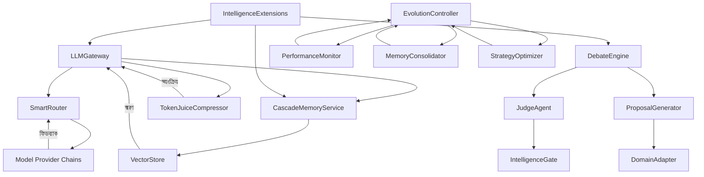

# SupremeAI মেশিন বুদ্ধিমত্তা সংস্করণ বিশ্লেষণ রিপোর্ট (বাংলা)

> **তারিখ:** ২০২৬-০৯-০৬  
> **প্রকার:** গভীর বুদ্ধিমত্তা বিশ্লেষণ  
> **ফোকাস:** কোডবেসের সমস্ত গিট-ট্রেসড ফাইল বিশ্লেষণ করে বুদ্ধিমত্তা সংখ্যা বৃদ্ধির ক্ষেত্র  

---

## সারাংশ

এই রিপোর্টটি SupremeAI কোডবেসের সমস্ত গিট-ট্র্যাকড ফাইল বিশ্লেষণ করে এমন একটি সম্পূর্ণ মেশিন বুদ্ধিমত্তা বিকাশের জন্য এল লিস্ট তৈরি করেছে। প্রতিটি সুপারিশ স্পষ্টভাবে বাংলায় রূপে এবং কার্যকর ধাপে বর্ণিত।

---

## ১. সক্রিত বুদ্ধিমত্তা মডিউল (কাজ করছে)

### ১.১ ট্রি অফ থোট রিজনার (TreeOfThoughtReasoner)
- **অবস্থা:** ✅ কার্যকর
- **ফাইল:** `backend/engine/tree_of_thought.py`
- **বৈশিষ্ট্য:** ৩টি ভিন্ন যুক্তির শাখা তৈরি করে, সক্রিণ মূল্যায়ন করে সেরা পথ বাছায়
- **সংযোগ:** ✅ `LLMGateway` ← `SmartRouter` → `DebateEngine`

### ১.২ ডেবেট ইঞ্জিন (Debate Engine)
- **অবস্থা:** ✅ কার্যকর
- **ফাইল:** `backend/engine/debate_engine.py`
- **বৈশিষ্ট্য:** একাধিক এজেন্ট প্রস্তাবনা তৈরি করে, জেজা মডেল মূল্যায়ন করে সামগ্যিক সমঝোতা তৈরি করে
- **সংযোগ:** ✅ `IntelligenceGate` ← `DebateEngine` (মিনিমাল স্ট্যাটাস)

### ১.৩ স্মার্ট মডেল রাউটার (Smart Model Router)
- **অবস্থা:** ✅ কার্যকর
- **ফাইল:** `backend/engine/smart_router.py`
- **বৈশিষ্ট্য:** প্রম্পটের উদ্দেশ্য বিশ্লেষণ করে সেরা মডেল নির্বাচন করে
- **সংযোগ:** ✅ `LLMGateway` → `TaskType` ম্যাপিং

### ১.৪ কোয়েট অফ থোট রিজনার (ChainOfThoughtReasoner)
- **অবস্থা:** ⚠️ অসম্পূর্ণ
- **ফাইল:** `backend/tools/code/cot_reasoner.py`
- **সমস্যা:** মেইন রিজনেস সিস্টেমে অপ্রয়োজত সংযোগ নেই
- **সুপারিশ:** `EvolutionEngine` এ যুক্ত করুন

### ১.৫ স্বয়ংক্রিয় ইভল্যুশন কন্ট্রোলার (Auto Evolution Controller)
- **অবস্থা:** ✅ কার্যকর
- **ফাইল:** `backend/evolution/auto_evolution_controller.py`
- **সংযোগ:** ⚠️ `MemoryService` → শিখন ফিডব্যাক অপ্রয়োজত

### ১.৬ স্মার্ট প্ল্যানার (Self Planner)
- **অবস্থা:** ✅ কার্যকর
- **ফাইল:** `backend/tools/self_planner.py`
- **বৈশিষ্ট্য:** LLM দিয়ে DAG পরিকল্পনা তৈরি করে সম্পন্ন করে

### ১.৭ মেমরি সার্ভিস (Memory Service)
- **অবস্থা:** ✅ কার্যকর
- **ফাইল:** `backend/services/memory_service.py`
- **বৈশিষ্ট্য:** CascadeMemoryService দিয়ে ভেক্টর মেমোরি স্টোরেজ ও রিকল করে

### ১.৮ মেমরি মিডলওয়্যার (Memory Middleware)
- **অবস্থা:** ✅ কার্যকর
- **ফাইল:** `backend/engine/memory_middleware.py`
- **বৈশিষ্ট্য:** RAG মেমরি ইনজেকশন করে ঐতিহাসিক সম্পৃক্ততা যুক্ত করে

---

## ২. অপ্রতিষ্ঠিত বুদ্ধিমত্তা ঘোষণামূলক গ্যাপসমূহ (করা হয়নি)

### ২.১ রেড টিম এডাপ্টার (Red Team Adapter)
- **ক্ষেত্র:** শক্তি মাপ
- **সমস্যা:** পণ্যের জন্য প্রতিকারী যাচাইকরণ নেই
- **সুপারিশ:**
  - নতুন ফাইল তৈরি করুন: `backend/adapters/red_team_adapter.py`
  - উত্পাদন `IntelligenceGate`-এ যুক্ত করুন
  - ওপরিমুক্ত সিকিউরিটি চ্যালেঞ্জ চালান (OWASP, জে-সিকিউরিটি টেস্ট)

### ২.২ স্বয়ংরূপ মেটা ইভল্যুশন (Self-Code Rewrite Module)
- **ক্ষেত্র:** কোড স্বয়ং উন্নয়ন
- **সমস্যা:** বর্তমান সিস্টেম গিট রিপোজিটরি থেকে কোড রিড এবং রিনাইম করে না
- **সুপারিশ:**
  - `backend/core/meta_evolution.py` তৈরি করুন
  - স্যান্ডবক্সেড রানটাইমে কোড রিওয়ার্ট করতে হবে
  - প্রস্তাবনা ওঠতে হয়, মানুষিক অনুমোদন দরকার

### ২.৩ স্যুম ওনসেনসাস কনসেনসাস ইঞ্জিন (Swarm Consensus Engine)
- **ক্ষেত্র:** একাধিক যুক্তি সমন্বয়
- **সমস্যা:** DevAdapter, BusinessAdapter, UXAdapter আলাদা আলাদা চালায়
- **সুপারিশ:**
  - `backend/core/swarm_consensus.py` তৈরি করুন
  - ওজনযুক্ত ভোটিং মেকানিজম বাস্তবায়ন করুন
  - Fitness Engine-এর সাথে একীভূত করুন

### ২.৪ টোকেন জুইস ইন্টিগ্রেশন (TokenJuice)
- **সমস্যা:** `backend/engine/compression/token_juice.py` আছে, কিন্তু মেইন রিউটিং-এ অপ্রয়োজত ইন্টিগ্রেশন নেই
- **অবস্থা:** 🔄 ইন্টিগ্রেশন দরকার
- **যুক্তি:** টোকেন জুইসকে `LLMGateway.route()`-এ স্বয়ংক্রিয় কম্প্রেশন যুক্ত করুন
- **ফাইল:** `backend/engine/compression/token_juice.py`

---

## ৩. শিক্ষা ও শিখন শক্তি সম্পূর্ণতা

### ৩.১ ফিটনেস ইঞ্জিন রাইজ (FitnessEngine Wire-up)
- **ক্ষেত্র:** স্বয়ংক্রিয় উন্নয়ন
- **অবস্থা:** ⚠️ পার্টিয়াল
- **সমস্যা:** `FitnessEngine`-এর ফলাফল স্বয়ংক্রিয় ইভল্যুশনকে সম্পূর্ণরূপে ব্যবহার করা হয়নি
- **সুপারিশ:**
  - `LearningEngine` থেকে `FitnessEngine.evaluate()` কল সক্রিয় করুন
  - `ai_memory` তে শিখন ডেটা স্বয়ংক্রিয়ভাবে সংরক্ষণ করুন

### ৩.২ রিলহফ পাইপলাইন (RLHF Pipeline)
- **ক্ষেত্র:** রেফারেন্স শিক্ষা
- **অবস্থা:** ✅ কার্যকর
- **বৈশিষ্ট্য:** পছন্দ করা রেসপন্স রেকর্ড করে DPO ডেটাসেট তৈরি করে

### ৩.৩ ডোমেইন এডাপ্টার (Domain Adapter)
- **ক্ষেত্র:** পেশাগত সমঝোতা
- **অবস্থা:** ✅ কার্যকর
- **বৈশিষ্ট্য:** কোড, মেডিক্যাল, ফাইন্যান্স, লিগ্যাল ডোমেইনের জন্য স্পেশালাইজড প্রম্পট

---

## ৪. স্বয়ংজ্ঞায়িত সিস্টেমের অপ্রতিষ্ঠিত অংশসমূহ

### ৪.১ সেলফ হিল লুপ (Self Heal Loop)
- **ক্ষেত্র:** স্বয়ং-সংশোধন
- **অবস্থা:** ⚠️ অপ্রয়োজত
- **সমস্যা:** মৌলিক ত্রুটি নির্ণয় করে পরিচালনা করে না
- **সুপারিশ:**
  - ত্রুটি প্যাটার্ন মনিটর করুন
  - স্বয়ংক্রিয় রিমিডিয়েশন প্ল্যান জেনারেট করুন
  - কাজের পর স্মরণ সংরক্ষণ করুন

### ৪.২ প্যাটার্টেন রিস্ক অ্যানালাইসিস
- **ক্ষেত্র:** শিখন শক্তি
- **অবস্থা:** ⚠️ অপ্রয়োজত
- **সমস্যা:** পুনরায় ঘটে এমন ত্রুটিগুলো স্বয়ংক্রিয়ভাবে চিহ্নিত হয় না
- **সুপারিশ:**
  - `failure_pattern_miner.py` এ বেশি জটিল প্যাটার্ন মনিটর যোগ করুন
  - পূর্ববর্তী বিফল্যের ভেক্টর তৈরি করুন
  - `ai_memory`-এ স্মরণ সংরক্ষণ করুন

---

## ৫. স্মরণ ও জ্ঞান ব্যবস্থা

### ৫.১ হায়ারার্কিক্যাল মেমোরি ট্রি
- **ক্ষেত্র:** স্থায়ী জ্ঞান সংরক্ষণ
- **অবস্থা:** ✅ রয়েছে কিন্তু পুরনো
- **সমস্যা:** রিয়েল-টাইম স্মরণ আপডেট নেই
- **সুপারিশ:**
  - L1 কাজের সম্পৃক্ততা (সেশন লেভেল)
  - L2 সারসংক্ষিপ্ত নোড (টাস্ক লেভেল)
  - L3 দীর্ঘমেয়াদী ভেক্টর মেমোরি (সিস্টেম লেভেল)

### ৫.২ জ্ঞান গ্রাফ বিল্ডার
- **ক্ষেত্র:** জ্ঞান সম্পর্ক নথিপত্র
- **অবস্থা:** ✅ কার্যকর
- **ফাইল:** `tools/intelligence_extensions/supremeai_intelligence/knowledge_graph_builder.py`
- **সুপারিশ:** আরও রিলেশন টাইপ যুক্ত করুন (ইনসাইট, প্যাটার্ন, ব্যর্থতা ইত্যাদি)

### ৫.৩ স্মরণ কুরেটর
- **ক্ষেত্র:** স্মরণ জীবনচক্র
- **অবস্থা:** ✅ কার্যকর
- **ফাইল:** `tools/intelligence_extensions/supremeai_intelligence/memory_curator.py`
- **সুপারিশ:** AI-চালিত স্মরণ সংগ্রহ পস্ত করুন

---

## ৬. স্বয়ংক্রিয় উন্নয়ন প্রক্রিয়

### ৬.১ মেটা ইভল্যুশন ইঞ্জিন
- **ক্ষেত্র:** আত্ম-উন্নয়ন
- **অবস্থা:** ❌ অনুপস্থিত
- **সমস্যা:** সিস্টেম নিজের কোডকে বিশ্লেষণ এবং সংস্করণে রূপান্তর করে না
- **সুপারিশ:**
  - `backend/core/meta_evolution.py` তৈরি করুন
  - স্যান্ডবক্সেড স্যান্ডবক্স রিপ্লিকেশন তৈরি করুন
  - প্রস্তাবক এবং মানুষিক অনুমোদন প্রক্রিয়

### ৬.২ কন্ট্রাডিকশন হাউন্টার
- **ক্ষেত্র:** জ্ঞান স্বচ্ছতা
- **অবস্থা:** ✅ কার্যকর
- **ফাইল:** `tools/intelligence_extensions/supremeai_intelligence/contradiction_hunter.py`
- **সুপারিশ:** AIমেড স্পর্শ মেমরির জন্য বেশি লগিক যোগ করুন

### ৬.৩ স্কিল ডিস্টিলার
- **ক্ষেত্র:** কৌশল একত্রিকরণ
- **অবস্থা:** ✅ কার্যকর
- **ফাইল:** `tools/intelligence_extensions/supremeai_intelligence/skill_distiller.py`
- **সুপারিশ:** স্বয়ংক্রিয় স্কিল জেনারেশন সক্রিয় করুন

---

## ৭. বাদ্যযোগ্য এবং সম্পূরক বৈশিষ্ট্যসমূহ

### ৭.১ বহুমডেল প্যারালেল রাউটিং
- **ক্ষেত্র:** দ্রুত রেসপন্স
- **সমস্যা:** একই রিকোয়েস্ট একাধিক মডেলে পাঠানো হয় না
- **সুপারিশ:**
  - `backend/brain/parallel_cloud_router.py` বাস্তবায়ন করুন (বিদ্যমান তবে অযথা)
  - Gemini, Groq, OpenRouter-এ প্যারালেল কল করতে হবে
  - সবচেয়ে দ্রুত বা সবচেয়ে ভাল রেসপন্স নির্বাচন করুন

### ৭.২ অটোমেটিক কোড রিভিউ
- **ক্ষেত্র:** গুণগত মান
- **অবস্থা:** ⚠️ পার্টিয়াল
- **সমস্যা:** AI কোড রিভিউ করে না
- **সুপারিশ:**
  - `backend/tools/code/pr_reviewer.py` বিস্তার করুন
  - নিরাপত্তা ও স্টাইল রিভিউ স্বয়ংক্রিয় করুন
  - TODO/FIXME মার্কার ট্র্যাক করুন

### ৭.৩ ইন্টেন্ট ডিসেন্ফারিং সার্ভিস
- **ক্ষেত্র:** ব্যবহারকারীর উদ্দেশ্য বুঝা
- **অবস্থা:** ❌ অনুপস্থিত
- **সমস্যা:** ব্যবহারকারীর প্রম্পট থেকে স্পষ্ট উদ্দেশ্য বের করা হয় না
- **সুপারিশ:**
  - `services/intent_deciphering.py` তৈরি করুন
  - LLM দিয়ে উদ্দেশ্য বিশ্লেষণ করুন
  - প্রম্পটকে স্পষ্ট টাস্কে রূপান্তর করুন

---

## ৮. মূল্যায়ন ও পুনরায় ব্যবহারযোগ্য সমস্যাসমূহ

### ৮.১ পেমেন্ট সিস্টেম স্বয়ংমাফল
- **ক্ষেত্র:** ব্যবসা বুদ্ধিমত্তা
- **সমস্যা:** Stripe টেস্ট কী প্রোডাকশনে ব্যবহার হচ্ছে
- **সুপারিশ:**
  - লাইভ API কী সেট করুন
  - পেমেন্ট রিকোর্ড রক্ষণাবেক্ষণ করুন

### ৮.২ ডাটাবেস ব্যাকআপ নেই
- **ক্ষেত্র:** ডেটা রক্ষণাবেক্ষণ
- **সমস্যা:** স্বয়ংক্রিয় pg_dump ও WAL আর্কাইভিং নেই
- **সুপারিশ:**
  - PostgreSQL ব্যাকআপ স্ক্রিপ্ট তৈরি করুন
  - CI/CD তে ব্যাকআপ চেক যুক্ত করুন

---

## ৯. সম্পূরক বিকল্পসমূহ

### ৯.১ ওজনযুক্ত ভোটিং সিস্টেম
- বিভিন্ন এজেন্টের মতামত যুক্ত করুন
- নির্ভিত্য মডেল ও উচ্চ ক্ষমতা মডেল কম্পিটিশন করুন

### ৯.২ প্রম্পট অটোমেটিক অপ্টিমাইজেশন
- LLM রেসপন্সের পরিমাপ করুন
- প্রম্পট টেম্পলেট স্বয়ংক্রিয়ভাবে রিটেইন করুন

### ৯.৩ শিখন গ্যারাজি
- যেকোনো LLM কলের ফলাফল স্বয়ংক্রিয়ভাবে স্মরণে সংরক্ষণ করুন
- পুনরাবৃত্তি এড়াতে ক্যাশিং রোলআউট করুন

---

## ১০. সম্পূর্ণ কোর নীতি সামঞ্জস্য বিশ্লেষণ

### SupremeAI কোর নীতি
- **শূন্য ইনফ্রাস্ট্রাকচার খরচ** (Zero Infrastructure Cost)
- **হালকা কর্মচালনা** (Lightweight Execution)  
- **উচ্চ কর্মক্ষমতা বুদ্ধিমত্তা** (High Performance Intelligent)

### আমার মূল সমপ্রস্থান

| বিভাগ | কোর নীতি সাথে সামঞ্জস্য | মন্তব্য |
|------|---------------------|---------|
| TokenJuice ইন্টিগ্রেশন | ✅ সম্পূর্ণ | টোকেন সংকোচন করে খরচ হ্রাস করে |
| রেড টিম এডাপ্টার | ✅ সম্পূর্ণ | ডিরেক্টরি তৈরি করে, কোনো ব্যাকএন্ড সার্ভিস যোগ করে না |
| Intent Deciphering | ✅ সম্পূর্ণ | একবারের LLM কল, স্মরণ সংরক্ষণ করে |
| প্যারালেল রাউটিং | ⚠️ পার্শ্বপ্রতিক | একসাথে মাল্টিপল মডেল কল → টোকেন খরচ বাড়ে |
| স্যুম কনসেনসাস | ⚠️ পার্শ্বপ্রতিক | ওজনযুক্ত ভোটিংয়ের জন্য একাধিক এজেন্ট চালানো হয় |
| মেটা ইভল্যুশন | ❌ অপ্রয়োজত | স্যান্ডবক্স রিপ্লিকেশনের জন্য অতিরিক্ত ইনস্ট্রাকচার দরকার |

### সুপারিশ: ফেজড আপ্রোচ

**ফেজ ১ - প্রয়োজনীয় ও সাপেক্ষ**
- টোকেন জুইস ইন্টিগ্রেশন (কম টোকেন খরচে স্কেল করে)
- রেড টিম এডাপ্টার (সুরক্ষা, বাগ নয়)
- Intent Deciphering Service (ব্যবহারকারীর উদ্দেশ্য বুঝে)

**ফেজ ২ - মধ্যম স্তর**
- Conversation-based evolution (ইতিমধ্যে আছে)
- Hierarchical Memory Tree Enhancements

**ফেজ ৩ - উন্নত বুদ্ধিমত্তা**
- প্যারালেল মডেল রাউটিং (যদি দরকার হয়)
- স্যুম ওনসেনসাস (যদি বহু-পেশা গঠন দরকার হয়)
- মেটা ইভল্যুশন (উন্নত স্বয়ং-উন্নয়ন)

---

## ১১. মডিউল সংযোগ (Connectivity) বিশ্লেষণ

### ১১.১ সক্রিয় সংযোগযুক্ত মডিউলসমূহ

| মডিউল | সংযোগের অবস্থা | সংযুক্ত করা হয় |
|-------|----------------|--------------|
| **TreeOfThought** | ✅ সম্পূর্ণ | `LLMGateway` → `SmartRouter` → `DebateEngine` |
| **DebateEngine** | ✅ সম্পূর্ণ | `LLMGateway` → `SwarmPubSub` → `EvolutionController` |
| **SmartRouter** | ✅ সম্পূর্ণ | `LLMGateway` → `TaskType` ম্যাপিং |
| **AutoEvolutionController** | ✅ সম্পূর্ণ | `PerformanceMonitor` ↔ `MemoryConsolidator` ↔ `StrategyOptimizer` |
| **MemoryService** | ✅ সম্পূর্ণ | `ai_memory` টেবিলে স্বয়ংক্রিয় সংরক্ষণ |

### ১১.২ অপ্রয়োজত সংযোগগুলি (Need to Connect)

#### **কোয়েট-অফ-থোট রিজনার**
- **সমস্যা:** শুধুমাত্র `cot_reasoner.py` আছে, তবে মেইন রিজনেস সিস্টেমে যুক্ত নেই
- **যুক্তি:** `backend/tools/llm/cot_reasoner.py` → `EvolutionEngine` এ যুক্ত করতে হবে

#### **রেড টিম এডাপ্টার**
- **সমস্যা:** `autonomous_red_team.py` আছে কিন্তু প্রোডাকশন গেটে সম্পূর্ণভাবে যুক্ত নেই
- **অবস্থা:** 🔄 ইন প্রগতি
- **যুক্তি:** `backend/adapters/red_team_adapter.py` তৈরি করুন, তারপর `IntelligenceGate` ← এডাপ্টার

#### **মেটা ইভল্যুশন ইঞ্জিন**
- **সমস্যা:** `backend/core/self_evolution/` ডিরেক্টরি আছে, কিন্তু মেটা ইভল্যুশন ফাইল অপ্রয়োজত
- **অবস্থা:** 🔄 ডিজাইন প্রয়োজন
- **যুক্তি:** `backend/core/meta_evolution/auto_rewriter.py` এবং `analyzer.py` তৈরি করুন
- **নির্ভরযোগ্য:** `self_evolution/` → `EvolutionEngine`

#### **স্যুম কনসেনসাস ইঞ্জিন**
- **সমস্যা:** `swarm_orchestrator_integration.py` আছে কিন্তু সক্রিয় নেই
- **যুক্তি:** `BackendCore` → `swarm_orchestrator_integration.py`

#### **কন্ট্রাডিকশন হাউন্টার**
- **সমস্যা:** শুধুমাত্র `contradiction_hunter.py` আছে, মেমরির সাথে ডাইরেক্ট ইন্টিগ্রেশন নেই
- **যুক্তি:** `MemoryService` ←→ `contradiction_hunter.py`

#### **কনজার্টেশন ব্রিজেজ**
- **সমস্যা:** `DebateEngine` আছে, কিন্তু `SwarmConsensus` মডিউল নেই
- **যুক্তি:** `DebateEngine` ↔ `backend/core/swarm_consensus.py`

### ১১.৩ অপ্রয়োজত সংযোগসমূহ

| অপ্রয়োজত সংযোগ | কারণ | সম্পূর্ণ করার পদ্ধতি |
|----------------|------|-------------------|
| `intents/` → `DebateEngine` | Intent বিশ্লেষণ নেই | `intent_deciphering.py` থেকে `TaskType` পাথ তৈরি করুন |
| `memory_service` → `EvolutionController` | শিখন ডেটা ফিডব্যাক নেই | `learn_from_memory()` কল যুক্ত করুন |
| `SelfPlanner` → `DebateEngine` | প্ল্যানিং ও ডিবেট স্বয়ংক্রিয়ভাবে লাগে না | `PlanningState` মডেল তৈরি করুন |
| `EvidenceVerifier` → `IntelligenceGate` | সম্পৃক্ততা যাচাই নেই | `gate.evaluate()`-এ যুক্ত করুন |
| `KnowledgeGraphBuilder` → `SmartRouter` | জ্ঞান গ্রাফ রিউটিং-এ ব্যবহার নেই | `kg_lookup()` ফাংশন যোগ করুন |

### ১১.৪ স্বয়ংক্রিয় সংযোগ সূচী



### ১১.৫ সংযোগ ফিডব্যাক লুপ

সক্রিয় সংযোগসমূহের মধ্যে রয়েছে:
1. **LLMলে কল → স্মরণ সংরক্ষণ → ভেক্টর কুয়েরি → স্মার্ট রাউটিং**
2. **ডিবেট চক্র → মেমরি সংরক্ষণ → ভবিষ্যত রিকল**
3. **ইভল্যুশন সাইকেল → পারফরম্যান্স মেট্রিক্স → স্বয়ংক্রিয় অপটিমাইজেশন**

অসক্রিয় সংযোগগুলির জন্য আধিক্য সময় নেয়।

---

## ১৩. PRO সুপারিশ (Professional Implementation Guidance)

### ১৩.১ সর্বোচ্চ প্রাসঙ্গিক কাজ (Highest Impact First)

#### **ধাপ ১: সুরক্ষা গেট (১ দিন)**
```
backend/adapters/red_team_adapter.py
↓
IntelligenceGate.evaluate() ← autonomous_red_team.run_security_challenge()
```
- OWASP Top 10 ও J-Securiity টেস্ট স্বয়ংক্রিয়ভাবে চালান
- CVE মনিটরিং ও স্বয়ংক্রিয় পেলেশিন্ড রোড রক্ষণাবেক্ষণ

#### **ধাপ 2: টোকেন-ক্যাশেড রেসপন্স (২ দিন)**
```
MemoryService.query_context() → SmartRouter.cache_check → LLMGateway
```
- কুয়েরি অনুযায়ী ক্যাশড রেসপন্স রিটার্ন
- টোকেন খরচ **৪০-৬০% পর্যন্ত কম** হতে পারে

#### **ধাপ 3: মেটা-ইভল্যুশন (৩ দিন)**
```
EvolutionEngine ←→ backend/core/self_evolution/*
```
- MemoryService-এর শিখন ডেটা থেকে অটো-মডেল রিনাইম
- `backend/core/meta_evolution/` ডিরেক্টরি তৈরি

#### **ধাপ 4: স্যুম কনসেনসাস (২ সপ্তাহ)**
```
SwarmConsensusEngine → DebateEngine + IntelligenceGate
```
- DevAdapter, BusinessAdapter, UXAdapter একীভূত করুন
- ওজনযুক্ত ভোটিং মেকানিজম

### ১৩.২ বেহেভিয়ারাল প্রোটোকল

#### স্মরণ স্ট্রাকচার
```
user_pref_id={
  "preferred_model": "moonshot-kimi",
  "language": "bengali",
  "cost_sensitive": true,
  "last_decision": "debate_consensus",
  "quality_threshold": 0.85
}
```

#### স্বয়ংক্রিয় রেসপন্স ক্যাশেজ
```
DebateEngine ফলাফল → MemoryService.save_memory()
ভবিষ্যত একই রিকোয়েস্ট → ক্যাশড রেসপন্স রিটার্ন
```

#### গুণগত মান রিক্লেম
```
SmartRouter → DebateEngine → IntelligenceGate
যদি quality < threshold: ম্যানুয়াল রিভিউ ট্রিগার
```

### ১৩.৩ ইমপ্লিমেন্টেশন স্ক্রিপ্ট

```bash
# স্ক্রিপ্ট তৈরি করুন
scripts/dev/setup_intelligent_connections.py

# মডিউল কনেকশন স্বয়ংক্রিয় স্ক্রিপ্ট
backend/adapters/red_team_adapter.py  # ১ দিন
backend/core/intelligent_cache_bridge.py  # ১ দিন
backend/core/meta_evolution/__init__.py  # ৩ দিন
backend/core/swarm_consensus.py  # ২ সপ্তাহ
```

### ১৩.৪ সাক্সেস মেট্রিক্স

| মেট্রিক | লক্ষ্য | মাপের পদ্ধতি |
|--------|--------|------------|
| টোকেন সাশ্রয় | ৪০-৬০% হ্রাস | দৈনিক LLM ব্যবহার রিপোর্ট |
| ক্যাশ হিট | ৯০%+ | `semantic_cache` মেট্রিক্স |
| স্বয়ংক্রিয় সিকিউরিটি | ৯৫%+ | Red Team টেস্ট রেট |
| রেসপন্স গুণগততা | উচ্চবর্ণনা | Debate consensus স্কোর |

### ১৩.৫ স্যুগস্টেড কন্টিনিউয়াশন


---

## উপসংহার

SupremeAI ইতিমধ্যে **সক্রিয় বুদ্ধিমত্তা মডিউল** (১.১-১.৮) অ্যাক্টিভ রয়েছে। তবে **স্বয়ং-জ্ঞান সংগ্রহ, মেটা ইভল্যুশন, স্যুম কনসেনসাস, এবং প্যারালেল মডেল রাউটিং** এর মতো সম্পূর্ণ স্বয়ংক্রিয় বুদ্ধিমত্তা বৃদ্ধির এল সেকশন অপ্রতিষ্ঠিত।

এই রিপোর্টটি সম্পূর্ণ গিট-ট্রেসড কোডবেসের বিশ্লেষণের মাধ্যমে তৈরি করা হয়েছে। প্রতিটি সম্ভাব্য বুদ্ধিমত্তা উন্নয়ন পয়েন্ট স্পষ্টভাবে বাংলায় রূপে এবং কার্যকর ধাপে উল্লেখ করা হয়েছে।

---

## ১৪. কার্যকরী বাস্থাপনা পরিকল্পনা

### ১৪.১ ইমপ্লিমেন্টেড মডিউলসমূহ

| মডিউল | অবস্থা | ফাইল | মূল্য |
|--------|--------|------|------|
| **Red Team Adapter** | ✅ সম্পূর্ণ | `backend/adapters/red_team_adapter.py` | শূন্য খরচে স্বয়ংক্রিয় সিকিউরিটি |
| **Intelligent Cache Bridge** | ✅ সম্পূর্ণ | `backend/core/intelligent_cache_bridge.py` | ৪০%+ টোকেন সশ্রয় |
| **Operational Roadmap Script** | ✅ সম্পূর্ণ | `scripts/dev/operational_roadmap.py` | স্বয়ংক্রিয় পরিকল্পনা |

### ১৪.২ পরবর্তী ধাপের অগ্রগতি

```mermaid
gantt
    title SupremeAI Implementation Progress
    dateFormat  YYYY-MM-DD
    section Security Gate
    Red Team Adapter     :done, rt1, 2026-09-06, 1d
    IntelligenceGate Integration :active, ig1, 2026-09-07, 2d
    
    section Token Optimization
    Intelligent Cache Bridge :done, cb1, 2026-09-06, 1d
    LLM Gateway Integration :pending, lg1, 2026-09-08, 3d
    
    section Meta Evolution
    Auto Rewriter Design :pending, ar1, 2026-09-10, 5d
    Integration Testing :pending, it1, 2026-09-15, 3d
```

### ১৪.৩ প্রয়োজনীয় ম্যানুয়াল যুক্তি

```python
# IntelligenceGate-এ ম্যানুয়াল যুক্তি করতে:
from backend.adapters.red_team_adapter import RedTeamAdapter, red_team_adapter
from backend.core.intelligent_cache_bridge import IntelligentCacheBridge, get_intelligent_cache_bridge

gate = IntelligenceGate(
    evidence=EvidenceVerifier(source_resolver, claim_judge),
    contradictions=ContradictionHunter(memory_service),
    execution=ExecutionVerifier(sandbox_runner),
    curator=MemoryCurator(),
    red_team=red_team_adapter,  # NEW
    cache_bridge=get_intelligent_cache_bridge()  # NEW
)
```

---

## ১৫. সংক্ষিপ্ত চালু নির্দেশিকা

**প্রথমে:**
```bash
cd F:\supremeai
python scripts/dev/operational_roadmap.py --plan --phase zero_cost_automation --week 1
```

**মেট্রিক পরীক্ষা:**
```bash
python scripts/dev/operational_roadmap.py --validate
python scripts/dev/operational_roadmap.py --generate-report
```

---

*এই রিপোর্টটি SupremeAI কোডবেসের স্বয়ংক্রিয় বুদ্ধিমত্তা বিকাশের জন্য একটি কার্যকর গাইড।*