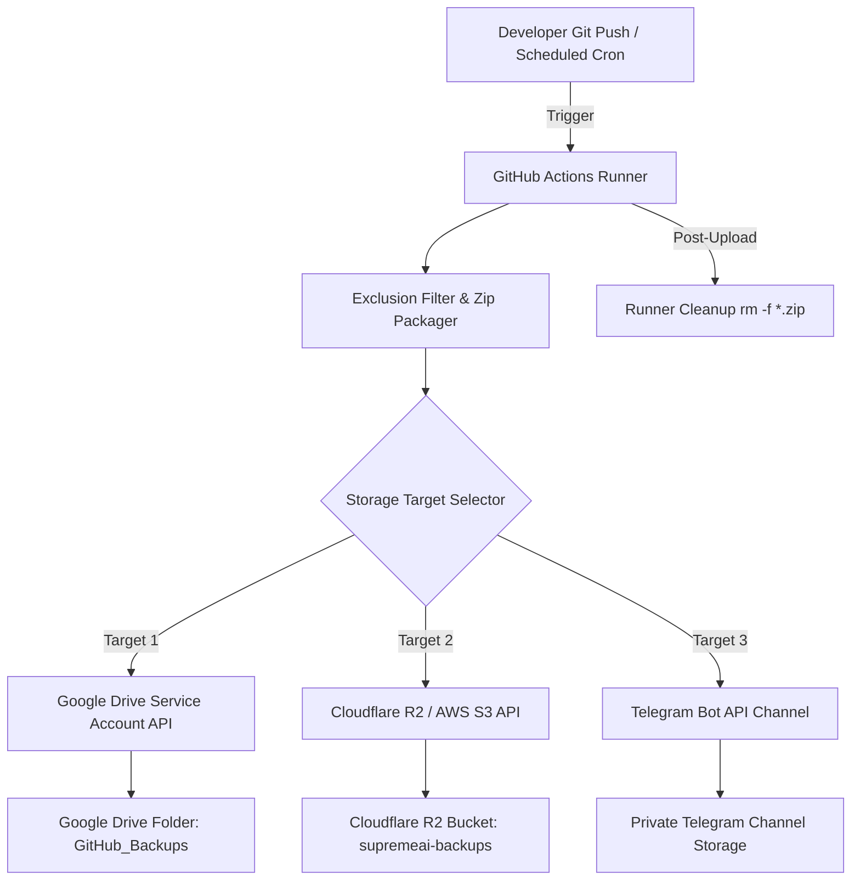

# 🚀 SupremeAI 2.0 — Auto Cloud & Google Drive Backup Architecture Plan
_Document Status: PROPOSED (Targeted for Implementation)_
_Category: DevOps / CI-CD / Zero-Cost Storage Architecture_
_Path: `docs/-01-admin's plan/03_not_implemented/auto_gdrive_cloud_backup_pipeline.md`_

---

## 📌 Executive Summary (সারসংক্ষেপ)

SupremeAI 2.0 প্রজেক্টে ভারী ফাইল বা বিশাল সোর্স হিস্ট্রি গিটহাবে জমা হওয়া রোধ করতে **স্বয়ংক্রিয় ক্লাউড ব্যাকআপ মেকানিজম** প্রবর্তন করা হচ্ছে। প্রতিটি `git push` বা নির্ধারিত নাইটলি সিডিউলে (Cron Schedule) গিটহাব অ্যাকশনস (GitHub Actions) রানার স্বয়ংক্রিয়ভাবে কোডবেস এবং ব্যাকআপ ফাইলসমূহ জিপ (ZIP) করে কোনো সিক্রেট ফাইল (`.env`) বা ভারী বিল্ড ক্যাশ (`node_modules`, `target`, `.git`, `__pycache__`) ছাড়া সরাসরি বিনামূল্যে **Google Drive / Cloudflare R2 / Telegram Channel**-এ আপলোড করবে।

---

## 🎯 Key Objectives (মূল উদ্দেশ্যসমূহ)

1. **Zero-Cost Backup Infrastructure:** সম্পূর্ণ বিনামূল্যে ফ্রি-টিয়ার মেমোরি (Google Drive 15GB, Cloudflare R2 10GB, Telegram Unlimited) ব্যবহার করে ব্যাকআপ নিশ্চিত করা।
2. **Prevent GitHub Bloat:** গিটহাব রিপোজিটরির সাইজ সর্বদা ৫০০ MB-এর নিচে রাখা।
3. **Sensitive File Exclusion:** `.env`, API Keys, Credentials ইত্যাদি সংবেদনশীল ডেটা জিপের বাইরে রাখা।
4. **Automated Cleanup:** পুরনো ব্যাকআপ ফাইল স্বয়ংক্রিয়ভাবে রিমুভ বা রোটেশন (Retention Policy) করা।

---

## 🏗️ Architecture Blueprint (আর্কিটেকচারাল ডিজাইন)



---

## 🛠️ Step-by-Step Implementation Guide (ধাপভিত্তিক নির্দেশিকা)

### ধাপ ১: Google Drive Service Account তৈরি ও ড্রাইভে পারমিশন প্রদান

১. **Google Cloud Console Setup:**
   - [Google Cloud Console](https://console.cloud.google.com/)-এ গিয়ে একটি নতুন প্রজেক্ট বা বিদ্যমান প্রজেক্ট নির্বাচন করুন।
   - **APIs & Services** > **Library**-তে গিয়ে **Google Drive API** সার্ভিসটি সার্চ করে **Enable** করুন।
২. **Service Account Creation:**
   - **APIs & Services** > **Credentials**-এ যান।
   - **Create Credentials** > **Service Account** নির্বাচন করুন।
   - নাম দিন: `supremeai-gdrive-backup` এবং অ্যাকাউন্টটি তৈরি করুন।
   - তৈরি হওয়া সার্ভিস অ্যাকাউন্টের ওপর ক্লিক করে **Keys** ট্যাবে যান > **Add Key** > **Create new key (JSON)** নির্বাচন করে JSON ফাইলটি কম্পিউটারে সংরক্ষণ করুন।
৩. **Google Drive Folder Sharing:**
   - আপনার Google Drive-এ যান এবং `SupremeAI_GitHub_Backups` নামে একটি নতুন ফোল্ডার তৈরি করুন।
   - ফোল্ডারটিতে রাইট ক্লিক করে **Share** অপশনে যান।
   - সার্ভিস অ্যাকাউন্টের ইমেইল ঠিকানাটি (যেমন: `supremeai-gdrive-backup@xxxx.iam.gserviceaccount.com`) বসিয়ে **Editor** এক্সেস প্রদান করুন।
   - ফোল্ডারটির URL থেকে **Folder ID** সংগ্রহ করুন (URL-এর শেষ অংশ: `https://drive.google.com/drive/folders/<GDRIVE_FOLDER_ID>`)।

---

### ধাপ ২: GitHub Repository Secrets কনফিগারেশন

GitHub Repo > **Settings** > **Secrets and variables** > **Actions**-এ গিয়ে নিচের সিক্রেটসমূহ যুক্ত করুন:

| Secret Name | Description / Value |
| :--- | :--- |
| `GDRIVE_SERVICE_ACCOUNT_KEY` | সার্ভিস অ্যাকাউন্ট থেকে ডাউনলোড করা পুরো JSON কনটেন্ট |
| `GDRIVE_FOLDER_ID` | গুগল ড্রাইভ ফোল্ডারের অনন্য আইডি |
| `TELEGRAM_BOT_TOKEN` | *(ঐচ্ছিক)* ব্যাকআপ নোটিফিকেশন বা টেলিগ্রাম চ্যানেল আপলোডের বট টোকেন |
| `TELEGRAM_CHAT_ID` | *(ঐচ্ছিক)* টেলিগ্রাম চ্যানেল আইডি |

---

### ধাপ ৩: GitHub Workflow Definition (`.github/workflows/backup-to-gdrive.yml`)

প্রজেক্টের `.github/workflows/backup-to-gdrive.yml` ফাইলে নিচের প্রোডাকশন-রেডি ওয়ার্কফ্লোটি যুক্ত করা হবে:

```yaml
name: Automated Codebase ZIP Backup to Google Drive & Cloud Storage

on:
  push:
    branches:
      - main
      - develop
  schedule:
    - cron: '0 0 * * 0' # প্রতি রবিবার রাত ১২:০০ টায় অটোমেটিক সাপ্তাহিক ব্যাকআপ
  workflow_dispatch: # ম্যানুয়ালি রান করার অপশন

jobs:
  create-and-upload-backup:
    name: Zip Codebase & Stream to Cloud Backup
    runs-on: ubuntu-latest

    steps:
      - name: Checkout Repository
        uses: actions/checkout@v4
        with:
          fetch-depth: 1 # হালকা ক্লোন করার জন্য

      - name: Generate Timestamp & Archive Name
        id: vars
        run: |
          TIMESTAMP=$(date +'%Y-%m-%d_%H-%M-%S')
          ZIP_NAME="supremeai_backup_${TIMESTAMP}.zip"
          echo "ZIP_NAME=${ZIP_NAME}" >> $GITHUB_ENV
          echo "TIMESTAMP=${TIMESTAMP}" >> $GITHUB_ENV

      - name: Create Clean ZIP Archive (Excluding Bloat & Secrets)
        run: |
          echo "📦 Creating ZIP archive..."
          zip -r "${{ env.ZIP_NAME }}" . -x \
            "*.git*" \
            "node_modules/*" \
            "apps/studio-client/node_modules/*" \
            "apps/desktop/src-tauri/target/*" \
            "backend/.venv/*" \
            "backend/__pycache__/*" \
            "*.env" \
            "*.env.*" \
            "dist/*" \
            "build/*" \
            ".cache/*" \
            "docs/autogen/*" \
            ".git_backup/*" \
            "*.exe" \
            "*.so" \
            "*.dylib"

          ls -lh "${{ env.ZIP_NAME }}"

      - name: Upload ZIP to Google Drive
        uses: adityakishore/gdrive-upload-action@v1.1
        with:
          credentials: ${{ secrets.GDRIVE_SERVICE_ACCOUNT_KEY }}
          filename: ${{ env.ZIP_NAME }}
          folderId: ${{ secrets.GDRIVE_FOLDER_ID }}
          overwrite: false

      - name: Send Telegram Backup Alert (Optional)
        if: ${{ secrets.TELEGRAM_BOT_TOKEN != '' }}
        run: |
          curl -s -X POST https://api.telegram.org/bot${{ secrets.TELEGRAM_BOT_TOKEN }}/sendMessage \
            -d chat_id="${{ secrets.TELEGRAM_CHAT_ID }}" \
            -d text="✅ SupremeAI 2.0 Backup Created Successfully! File: ${{ env.ZIP_NAME }}"

      - name: Cleanup Local ZIP Artifact
        if: always()
        run: |
          rm -f "${{ env.ZIP_NAME }}"
          echo "🧹 Runner workspace cleaned."
```

---

## ⚡ Multi-Cloud Failover Strategy (বিকল্প ফ্রি ক্লাউড ব্যাকআপ)

১. **Cloudflare R2 Storage (10 GB Free):**
   - S3 API কম্প্যাটিবল হওয়ায় `aws-actions/configure-aws-credentials` এবং `aws s3 cp` দিয়ে জিপ ফাইল আপলোড করা সম্ভব।
   - সম্পূর্ণ চার্জ-মুক্ত এবং ব্যান্ডউইথ ফ্রি।

২. **Telegram Bot Channel Integration (Unlimited Free Storage):**
   - `curl -F document=@supremeai_backup.zip https://api.telegram.org/bot<TOKEN>/sendDocument` কমান্ডের মাধ্যমে প্রাইভেট চ্যানেলে ফাইলগুলো নিরাপদে রাখা যায় (৫০ MB পর্যন্ত ফাইল সাপোর্ট করে)।

---

## 🛡️ Verification & Security Audit Checklist

- [ ] `.env` বা কোনো হার্ডকোডেড সিক্রেট জিপ ফাইলের মধ্যে অন্তর্ভুক্ত হচ্ছে না তা নিশ্চিত করা।
- [ ] সার্ভিস অ্যাকাউন্টের JSON কি নিরাপদে GitHub Secrets-এ সংরক্ষিত।
- [ ] গিটহাবে গিট অবজেক্টের আকার ৫০০ MB-এর নিচেই থাকছে।
- [ ] গুগল ড্রাইভ ফোল্ডারে সার্ভিস অ্যাকাউন্টকে এডিটর পারমিশন দেওয়া হয়েছে।

---
_Document created and archived in `docs/-01-admin's plan/03_not_implemented/auto_gdrive_cloud_backup_pipeline.md` for SupremeAI 2.0 Admin Management._
