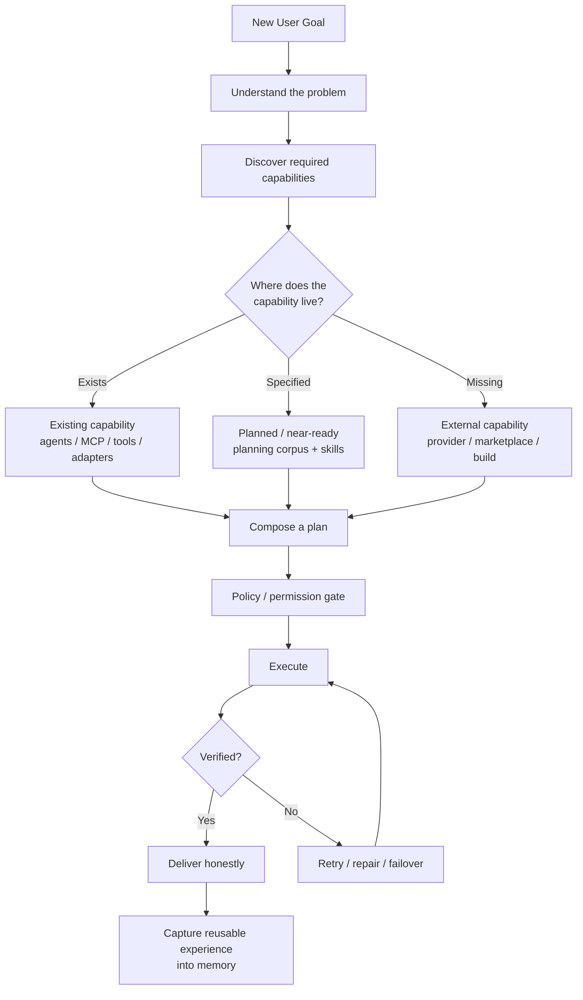

# 01 — Overview

## What SupremeAI Is

SupremeAI is an **autonomously orchestrated AI task-execution platform**. The repository describes itself as "SupremeAI 2.0 — Universal Self-Learning AI Agent": a governed, model-agnostic system designed to solve real user problems by discovering, composing, reusing and — only when genuinely necessary — creating capabilities. The same machinery that serves users is intended to operate, test, repair, learn from and safely improve SupremeAI itself.

The platform consists of a FastAPI backend (`backend/`, Poetry package `supremeai-backend` v2.0.0), a React 19 single-page application (`frontend/`, package `supremeai-studio-client` v2.0.0), five shared TypeScript packages (`packages/`), a VS Code extension (`tools/vscode-extension/`), an MCP Control Tower (`infrastructure/mcp-control-plane/`), a Docusaurus documentation site (`apps/docs/`), and an extensive operational toolbelt (`scripts/`, `tools/`).

Three ideas define the product:

1. **Capability before construction.** A new user request is not automatically a new engineering project. The system inspects its existing capability surface first.
2. **Provider sovereignty.** External LLM providers (Gemini, OpenAI, Groq, DeepSeek, OpenRouter, Ollama, Moonshot, Together, Hugging Face, NVIDIA) are replaceable processing engines behind adapters — never the identity of the system.
3. **Zero-cost posture.** The entire deployment strategy is engineered around free tiers (Render free instances, Supabase, Firebase Hosting, Cloudflare Workers, Upstash) with explicit quota guards and keep-alive automation.

## The Constitution

The root README codifies eleven governing principles. They are worth knowing because they explain *why* the code is structured the way it is:

| # | Principle | Meaning in code |
|---|-----------|-----------------|
| 1 | Eternal Brain | Durable identity accumulates in memory/learning systems (`backend/memory/`, `backend/learning/`), not in any single LLM provider |
| 2 | Capability Sovereignty | Capabilities are composable and replaceable; provider details live behind adapters (`backend/services/llm/providers.py`) |
| 3 | Reuse Before Creation | Discover → Reuse → Compose → Adapt → Extend → Create; enforced by `core.orchestration.Orchestrator` and the capability registry |
| 4 | Dynamic Discovery | Prefer registries and runtime metadata over hard-coded inventories (`core/agent_registry.json`, ecosystem `capability_registry`) |
| 5 | Verification Before Trust | Generate → Execute → Verify → Trust; unverified results are not "done" (`backend/verification/`, health checks, self-healer) |
| 6 | Policy Before Power | Observe → Analyze → Risk → Permission → Approval → Act → Verify → Audit (`ecosystem/governance`, `ecosystem/approval_workflow`, HITL WebSocket) |
| 7 | Reversible Evolution | Autonomous changes preserve evidence, tests, risk assessment and rollback (`tools/autonomy/tools/deploy_guard.py`, `agent_change_budget.py`) |
| 8 | Graceful Degradation | A single provider/account failure must not destroy the task (circuit breakers, fallback chains, `SUPABASE_ALLOW_DB_DEGRADATION`) |
| 9 | Provider Agnostic, User Loyal | Users ask for outcomes; the provider stack may change invisibly (litellm gateway with per-task model maps) |
| 10 | One System, Many Execution Surfaces | Web app, VS Code extension, MCP servers, workers and microservices share one task/capability machinery with different scopes (`SUPREMEAI_SERVICE_ROLE`) |
| 11 | Memory Must Compound | Task → Result → Experience → Memory → Better Future Planning (`memory/unified_db_manager.py`, `learning/experience.py`) |

## The Capability-Composition Model

When a goal arrives, the orchestrator resolves it through a decision sequence rather than a hard-coded pipeline:

This is why SupremeAI's capability coverage is much larger than its count of polished user-facing features: a capability may exist in code, be exposed through one of the seven+ MCP servers, be reachable through a provider adapter, run in a dedicated microservice, or already be specified in the planning corpus and only need final wiring.

## How a User Problem Is Solved (Runtime Path)

A concrete request — say a chat message — travels this path in the current code:

1. **Ingress.** The React app (`frontend/src/services/chatService.ts`) POSTs to `/api/chat/stream`. The backend `create_app()` factory (`backend/core/app_builder.py`) passes the request through its 16-layer middleware chain (request context, security headers, validation, tenant extraction, auth, rate limiting, …).
2. **Routing.** The chat router hands the prompt to the **Brain** (`backend/brain/`): `ModelRouter` selects the best available provider; `core/llm/llm_gateway.py` executes through litellm with a semantic cache, fallback chain, `CostGuard` budget enforcement and per-task model maps (e.g. coding → `groq/llama-3.3-70b-versatile`, general chat → `gemini/gemini-2.0-flash`).
3. **Capability resolution.** `core/orchestration/orchestrator.py` decomposes intent (`decompose_intent()`) and executes a skill chain over the `EvolutionSkillGraph`, composing existing tools (`backend/tools/` — code, media, browser, MCP, knowledge, security, …) instead of inventing new ones.
4. **Verification & governance.** Results pass health/verification layers; high-impact actions require HITL approval over `/ws/hitl` or the approval workflow. The **Budget Guardian** subprocess (`scripts/orchestrator/auto_budget_guardian.py`) halts execution fail-closed if cost limits are breached.
5. **Delivery & learning.** Streams return via SSE (with WebSocket fallback shims), and outcomes are written to memory (`memory/episodic_memory.py`, `long_term_memory.py`) and analyzed by the learning loop (`learning/outcome_analyzer.py`) so future planning improves.

## The Self-Evolution Loop

SupremeAI treats its own codebase and operations as a target for the same governed execution machinery:

- **Observation:** `agents/SentinelAgent` (heartbeat monitor, anomaly detector, alert router), `agents/InternetMonitorAgent`, performance metrics tables (`models/` `performance_metrics`, `system_alerts`).
- **Diagnosis:** `tools/gap_miner/` (read-only project intelligence), `scripts/advanced_analysis/` (21 static analyzers run in CI), `pyerrorfix/` (error detection/auto-fix engine).
- **Planning & patching:** `tools/autonomy/` (self-heal loop, deploy guard, change budget — read-only/plan-first by default), `tools/solution_synthesizer/` (diagnosis → sandbox → verified patch, dry-run by default, `--apply` required).
- **Verification:** regression scanners, mutation testing, test synthesizer, coverage gates (`scripts/ci/coverage_quality_gate.py` with tiered policy).
- **Deployment safety:** blue-green/canary deploy scripts, `pre_deploy_check.sh` nine-step gate, rollback paths.
- **Knowledge compounding:** `tools/knowledge/` (tool knowledge cards injected into `ai_memory`), `tools/knowledge_squeezer/` (multi-model distillation with adversarial audit), `evolution/` (fitness evaluator, canary manager, benchmark runner).

## Product Surfaces

| Surface | Entry point | Audience |
|---------|-------------|----------|
| **Studio web app** | `frontend/src/App.tsx` — user workspace (`/workspace/*`), IDE, AI Studio, swarm map, evolution forge | End users |
| **Admin console** | `/admin/*` — OTP/TOTP step-up, ~30 panels (model router, security, CI/CD visualizer, cost auditor) | Administrators |
| **AETHEL Command Center** | `frontend/src/commandcenter/` — module-grouped ops cockpit (DECK/OPERATE/BUILD/OBSERVE/SECURE/MONEY/SYSTEM) with WebSocket realtime | Administrators |
| **VS Code extension** | `tools/vscode-extension/` v6.0.0 — 31 commands, chat, swarm/trio pipelines, admin & customer dashboards | Developers |
| **MCP servers** | `backend/tools/mcp/mcp_server.py` + 6 siblings, plus `infrastructure/mcp-control-plane/` | AI clients / ops |
| **REST + WebSocket API** | 398 paths (checked-in `backend/openapi.json`), 10 WS endpoints with SSE fallbacks | Integrators |
| **Docs site** | `apps/docs/` (Docusaurus, English + Bengali) | Everyone |

## Design Values Worth Knowing Before You Contribute

- **Free tier is a first-class constraint.** Render free instances have ~512 MB RAM and sleep after ~15 minutes idle; the backend hard-enforces a single uvicorn worker in production, `LOW_MEMORY_MODE` exists, and four keep-alive mechanisms ping services on schedules. PRs are checked by `scripts/ci/check_free_tier_limits.py`.
- **Cost is governed, not assumed.** `CostGuard` runs inside the LLM gateway; `MAX_COST_PER_TASK` is enforced; the orchestrator halts on budget-guardian failure.
- **Plan-first autonomy.** Autonomous tools (`tools/autonomy`, `tools/solution_synthesizer`) are read-only/dry-run by default; applying changes requires explicit flags and approvals.
- **Bilingual codebase.** Bengali comments, i18n locales (`en|bn|es|zh` in `frontend/src/i18n/`) and Bengali docs (`README_BANGLA.md`, `apps/docs/docs/bangla-guide.md`, admin token strings `packages/design-tokens/src/admin.bn.json`) are intentional; CI runs a Bengali i18n completeness checker.
- **Honesty over polish.** Degraded modes must report degraded status (e.g. `worker_service.py` reports degraded when Celery/Redis are absent rather than pretending health).
