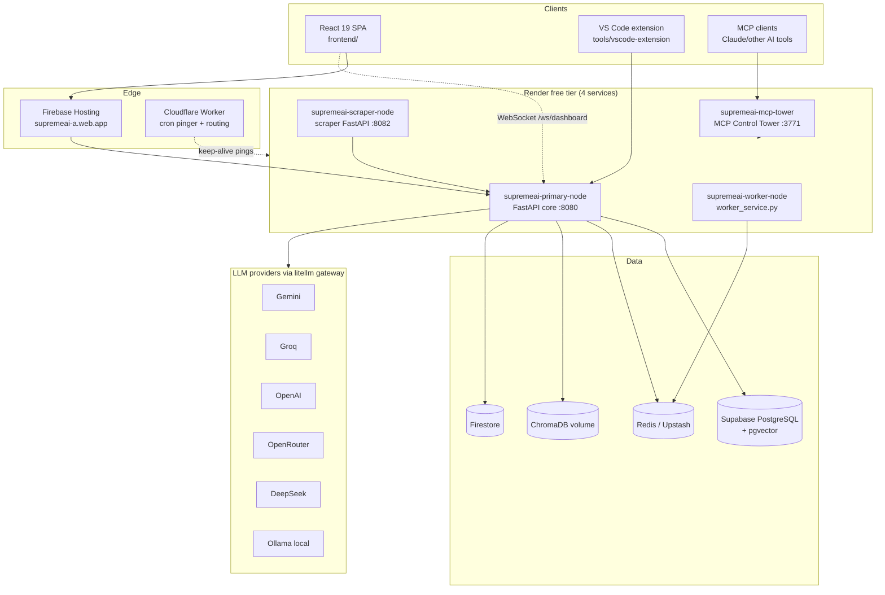
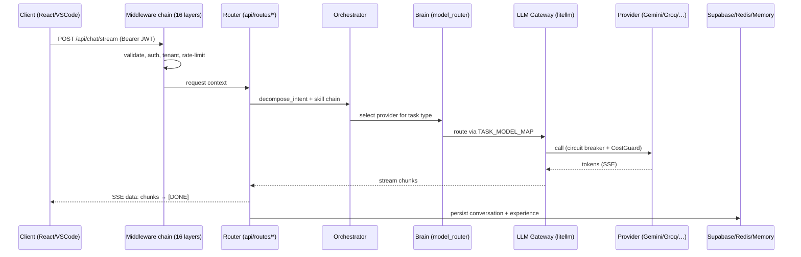

# 02 — Architecture

## System Overview

SupremeAI is a pnpm + Turborepo monorepo (`packageManager: pnpm@10.15.0`, Node 24 per `.nvmrc`) containing a Python FastAPI backend, a React 19 frontend, five shared TypeScript packages, a VS Code extension, an MCP control tower, and a large operational toolbelt. The backend is the single authority for AI orchestration; clients (web app, extension, MCP) are thin surfaces over it.



## Monorepo Layout

```
supremeai/
├── backend/                  # FastAPI monolith + role-based services (Python 3.11, Poetry)
│   ├── main.py               # Entry point (uvicorn boot, SIGTERM handling)
│   ├── core/                 # App assembly, config, security, orchestration, LLM gateway (352 files)
│   ├── api/                  # ~115 route modules + central registry api/routers.py
│   ├── brain/                # Model routing & cognition (model_router, registry, reasoning)
│   ├── agents/               # Sentinel, InsightMage, autonomous agents (47 files)
│   ├── tools/                # Agent tool library: code, media, MCP, browser, devops… (123 files)
│   ├── services/             # Domain services + scraper/browser/worker microservices
│   ├── models/               # SQLAlchemy 2.0 async models (35 files)
│   ├── database/             # Supabase client, PgBouncer-safe session, SQL migrations
│   ├── memory/ learning/     # Memory stack + continual learning
│   ├── engine/ evolution/    # Reasoning engines, self-evolution
│   ├── alembic_migrations/   # Alembic env + versions
│   ├── tests/                # 376 pytest files
│   └── worker_service.py     # HTTP wrapper supervising Celery on free tier
├── frontend/                 # React 19 + Vite 7 + TS 5.9 SPA
│   └── src/
│       ├── App.tsx           # Router: /login /workspace/* /admin/* /share/:id
│       ├── commandcenter/    # AETHEL Command Center (admin cockpit)
│       ├── components/       # chat, editor, admin, dashboard, swarm, graph…
│       ├── store/            # 15 zustand stores + slices
│       ├── services/         # apiClient, chatService, adminService, realtime
│       ├── i18n/             # Custom i18n: en | bn | es | zh
│       └── pages/            # admin/, auth/, user/ workspaces
├── packages/
│   ├── shared-types/         # Zod schemas + generated TS .d.ts and Dart classes
│   ├── shared-services/      # Platform-agnostic services (VS Code/Electron adapters)
│   ├── ui-components/        # SupremeCard, DashboardShell, SharedProviders…
│   ├── design-tokens/        # style-dictionary: CSS/JSON/Flutter/VSCode outputs
│   ├── core-infrastructure/  # Circuit breaker / error handler stubs (tsup)
│   └── scripts/              # Python security guard + validators
├── tools/
│   ├── vscode-extension/     # supremeai-vscode v6.0.0 (31 commands)
│   ├── autonomy/ gap_miner/  # Self-improvement & project intelligence toolkits
│   ├── knowledge/ knowledge_squeezer/ solution_synthesizer/ discovery_fabric/
│   └── master_orchestrator.py
├── infrastructure/           # Cloudflare workers, MCP control plane, monitoring configs
├── apps/docs/                # Docusaurus 3.6 site (EN + BN)
├── scripts/                  # 25+ operational script categories (see 15-operations)
├── shared/protos/            # supreme_engine.proto (gRPC WorkerService)
└── .github/                  # 5 workflows + composite actions + dependabot
```

Workspace membership (`pnpm-workspace.yaml`): `packages/*`, `frontend`, `tools/vscode-extension`. The Turborepo pipeline (`turbo.json`) wires build dependencies: `ui-components#build` depends on shared-types + design-tokens; `supremeai-vscode#build` depends on shared-services + design-tokens; `frontend#build` depends on shared-services + design-tokens.

## Backend Assembly: Request Lifecycle

The app is built entirely in code — no decorators spread across files. `backend/core/app.py` calls `create_app()` from `core/app_builder.py`, then layers on memory-aware middleware, welcome/aggregated-health routes, the admin router, `register_all_routers(app)` (central registry in `api/routers.py`) and the Tier-S feature routes.

**Middleware chain (16 layers, outermost last):** `CORSMiddleware` → `ResponseStandardizationMiddleware` → `RateLimitMiddleware` → `IdempotencyMiddleware` → `ChaosInjectorMiddleware` → `HoneypotMiddleware` → `AutonoGuardMiddleware` → `APIKeyAuthMiddleware` → `AuthMiddleware` → `ObservabilityMiddleware` → `TenantExtractionMiddleware` → `SupremeContextMiddleware` → `TrustedOriginMiddleware` → `RequestValidationMiddleware` (SQLi/XSS) → `SecurityHeadersMiddleware` → `RequestIdMiddleware` → `GZipMiddleware` → `RequestContextMiddleware`.



**Lifespan startup sequence** (`core/lifespan.py`): `StartupValidator.validate()` → `ReliabilityController.initialize()` → global `httpx.AsyncClient` (200 max connections) → independent services (DB pool, config cache, Redis, tracing, CostGuard) → `Orchestrator()` mounted on `app.state.orchestrator` → Supabase schema bootstrap (non-fatal, `DB_BOOTSTRAP_TIMEOUT` 30 s) → background agents (Sentinel, maintenance pipeline). Fail-fast config validation (`core.config_validator.validate_config()`) exits the process with code 1 on missing production-critical secrets.

## Service Roles (One Image, Many Personalities)

`SUPREMEAI_SERVICE_ROLE` selects which routers load — this is how one Docker image serves multiple Render services:

| Role | Loads | Deployed as |
|------|-------|-------------|
| `monolith` (default) | Everything | Local dev / docker compose `core` |
| `core` | All except scraper/browser microservice routes | `supremeai-primary-node` |
| `scraper` | Scraper + browser + health routes only | `supremeai-scraper-node` (runs `services.scraper.main:app`) |
| `worker` | Health routes only (Celery via `worker_service.py`) | `supremeai-worker-node` |

Admin routers automatically receive `Depends(get_current_user_token)`; the BYOC router only loads when `ENCRYPTION_KEY` is set.

## Realtime Architecture

The platform runs **10 WebSocket endpoints** (chat, dashboard, CI dashboard, HITL, voice, session takeover, agent terminal stream, realtime dashboard, health stream) plus SSE fallback shims (`stream_chat_sse`, `stream_hitl_sse`, `stream_voice_sse`) for environments where WebSockets are unavailable. On the frontend, two WebSocket managers subclass the shared `BaseWebSocketManager` from `@supremeai/shared-services` (30 s heartbeat, max 5 reconnects, exponential backoff), while SSE flows use `@microsoft/fetch-event-source` via `frontend/src/lib/secureSse.ts`.

## Cross-Cutting Design Decisions

- **Single frontend.** One build serves both user portal and admin console; role is resolved at runtime from the JWT (`frontend/src/auth/identity.ts`), guarded by `RoleGuard`/`PermissionGuard`. Legacy multi-frontend env vars (`VITE_PORTAL_TYPE`) are removed.
- **PgBouncer-safe database access.** Sessions use UUID-random prepared-statement names, `statement_cache_size=0`, `NullPool`, and `pool_pre_ping` (`backend/database/session.py`) — required for Supabase transaction-pool mode.
- **Fail-closed production posture.** CORS empty in production derives from `ALLOWED_HOSTS` and fails closed; wildcard + credentials is rejected; test bypasses (`ALLOW_TEST_AUTH_BYPASS`) are hard-disabled in production.
- **Local-first frontend.** Dexie/IndexedDB (`frontend/src/store/localFirstDb.ts`) stores chat messages, conversations and a sync queue with Supabase background sync, so the UI survives cold starts of free-tier backends.
- **Shared types across languages.** `scripts/generate_types.py` scans backend Pydantic models under `backend/schemas/` and emits TypeScript `.d.ts` and Dart classes into `packages/shared-types/src/{typescript,dart}/` — one contract for web, extension and (future) Flutter clients.
- **gRPC for heavy background work.** `shared/protos/supreme_engine.proto` defines `WorkerService` (SubmitTask / GetTaskStatus / LogAuditEvent) reserved for security auditing and heavy tasks off the HTTP path.
