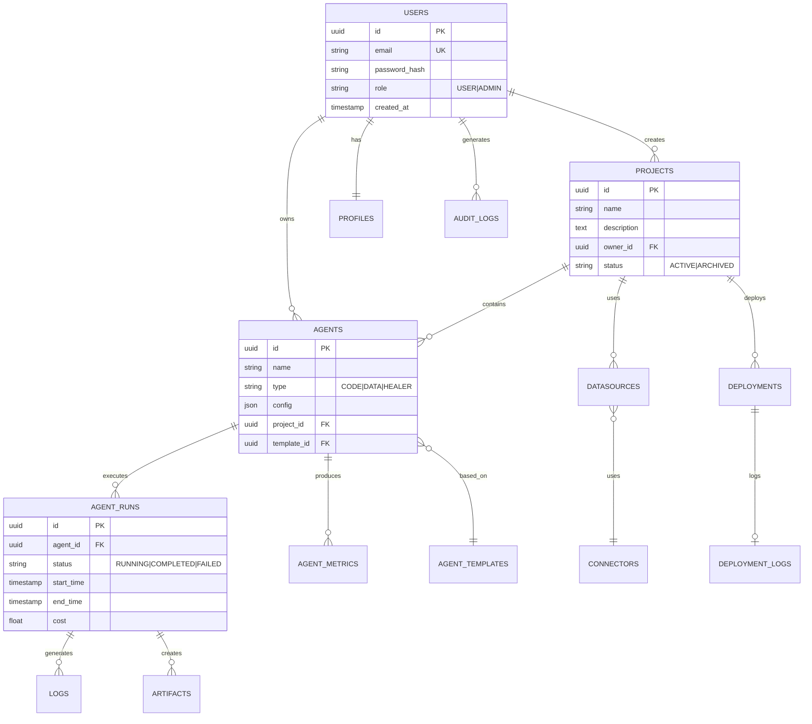
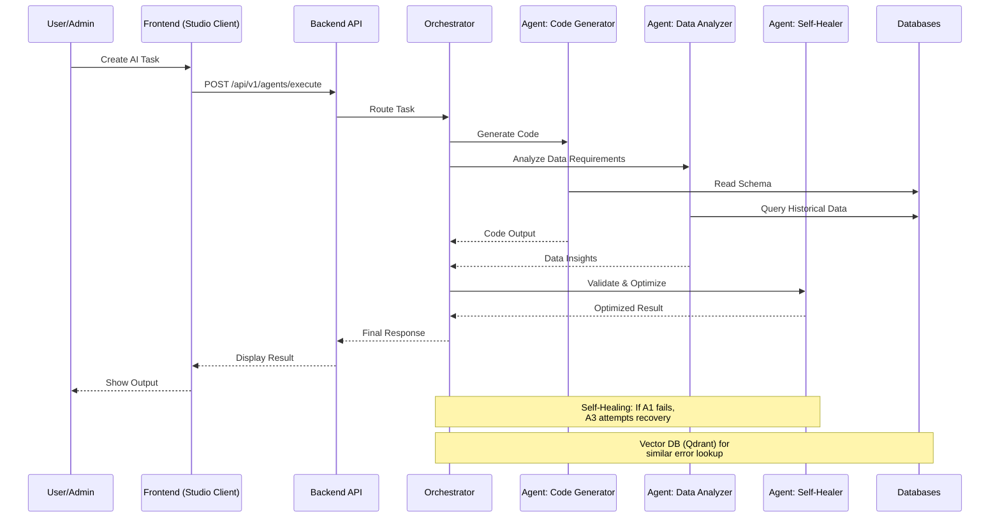
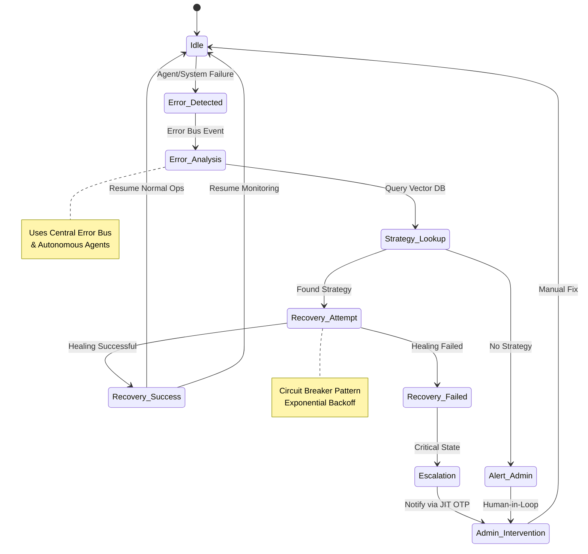
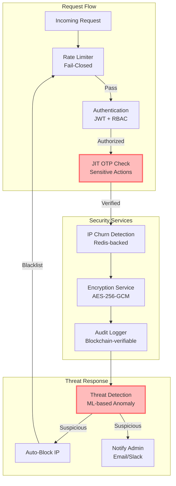
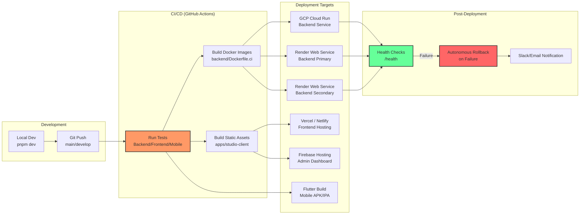

# 📐 SupremeAI 2.0 System Diagrams & Visual Architecture

> **নথি সংক্ষেপ (Summary):** এই নথিতে SupremeAI 2.0-এর হাই-লেভেল সিস্টেম আর্কিটেকচার, ডেটাবেস স্কিমা (ERD), এজেন্ট অর্কেস্ট্রেশন, সিকিউরিটি সিকোয়েন্স, সেলফ-হিলিং স্টেট এবং সিআই/সিডি ডিপ্লয়মেন্ট ফ্লো-এর ভিজ্যুয়াল Mermaid ডায়াগ্রামগুলো সংরক্ষিত হয়েছে।

---

## 🏗️ 1. High-Level Architecture (উচ্চ-স্তরের সিস্টেম আর্কিটেকচার)

```mermaid
graph TB
    subgraph "Frontend Layer"
        A[React/Vite Web App] 
        B[Electron Desktop App]
        C[Flutter Mobile App]
    end

    subgraph "API Gateway & Load Balancing"
        D[FastAPI Backend<br>(User/Admin Mode)]
        E[Render Primary Service]
        F[Render Secondary Service<br>(Auto-failover)]
    end

    subgraph "Core Services"
        G[Authentication & RBAC]
        H[JIT OTP Service]
        I[AI Agent Orchestrator]
        J[Self-Healing Engine]
        K[Central Error Bus]
    end

    subgraph "Data Layer (Polyglot Persistence)"
        L[(PostgreSQL<br>Relational DB)]
        M[(Redis<br>Cache & Queue)]
        N[(Neo4j<br>Graph DB)]
        O[(Qdrant<br>Vector DB)]
        P[(MongoDB<br>Document DB)]
    end

    subgraph "External Integrations"
        Q[OpenAI / Anthropic APIs]
        R[LangChain / MLflow]
        S[Firebase / Supabase]
    end

    subgraph "Monitoring & Observability"
        T[Autonomous Agents]
        U[Prometheus / Grafana]
        V[Alert Service<br>(Email/Slack)]
    end

    A --> D
    B --> D
    C --> D
    D --> E & F
    E & F --> G & H & I & J & K
    G & H & I --> L & M & N & O & P
    I --> Q & R & S
    J --> T
    K --> U & V
    T --> M & N

    style D fill:#f9f,stroke:#333,stroke-width:4px
    style I fill:#bbf,stroke:#333,stroke-width:4px
    style J fill:#bfb,stroke:#333,stroke-width:4px
```

---

## 🗄️ 2. Database Schema & ERD (ডেটাবেস সত্তা-সম্পর্ক চিত্র)



---

## 🤖 3. Agent Orchestration & Execution Flow (এজেন্ট সঞ্চালনা সিকোয়েন্স)



---

## 🩺 4. Self-Healing Engine State Machine (সেলফ-হিলিং ইঞ্জিন স্টেট ডায়াগ্রাম)



---

## 🔐 5. Request Security & Threat Response (সিকিউরিটি ও অন-স্পট ট্র্যাকিং)



---

## 🚀 6. CI/CD Multi-Cloud Deployment Pipeline (ডিপ্লয়মেন্ট পাইপলাইন)


