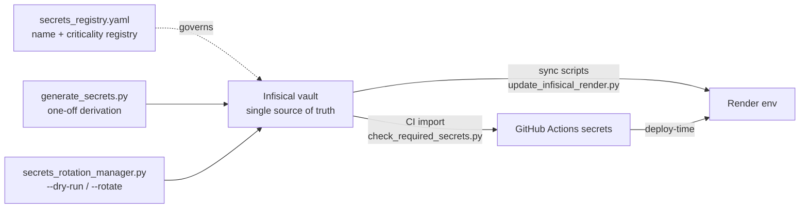

# 04 — Configuration

## How Configuration Loads

All backend settings flow through a single Pydantic BaseSettings class: `backend/core/config.py` → `Settings(BaseSettings, SettingsFieldsMixin, SettingsSecretsMixin, SettingsValidationMixin)`, exposed as the `settings` singleton. Env files are read in order: `../.env`, `.env`, `/etc/secrets/.env`, `/etc/secrets/render.env` (skipped under pytest). Two protections matter:

- **Fail-fast validation**: `core/config_validator.validate_config()` runs inside the FastAPI lifespan and calls `sys.exit(1)` on production-critical errors (e.g. missing `JWT_SECRET`, `ENCRYPTION_KEY`, `SUPREMEAI_ADMIN_PASSWORD_HASH`, invalid CORS in prod).
- **Production hardening**: production forces `RATE_LIMIT_USE_SIMPLIFIED=False`, hard-disables test bypasses (`is_bypass_allowed` → False), and CORS must be explicit TLS origins (empty CORS in prod is derived from `ALLOWED_HOSTS`, fail-closed).

The canonical inventory of *secret names* (not values) is **`secrets_registry.yaml`** (1,171 lines) — every secret is tracked with criticality per target (`infisical-vault`, `render-backend`, `render-admin`, `github-actions`, `firebase-gcp`). `.env.example` (514 lines) is the documented template.

## Environment Variables by Category

### Runtime & HTTP

| Variable | Purpose |
|----------|---------|
| `ENV` | `local` \| `production` (auto-set to production when `RENDER` is detected) |
| `PORT` / `HOST` | Bind address — default port **8080** |
| `SUPREMEAI_SERVICE_ROLE` | `monolith` \| `core` \| `scraper` \| `worker` — controls router registration |
| `LOW_MEMORY_MODE`, `WEB_CONCURRENCY`, `UVICORN_WORKERS` | Free-tier memory guards (workers forced to 1 in prod) |
| `BACKEND_URL`, `ALLOWED_HOSTS`, `FRONTEND_URL`, `ADMIN_URL`, `APP_BASE_URL` | URL fabric |
| `USER_CORS_ORIGINS`, `ADMIN_CORS_ORIGINS`, `CORS_ORIGINS` | CORS allowlists (empty in local → `localhost:3000/5173` fallback) |
| `SUPREMEAI_PUBLIC_PATHS` | Unauthenticated path allowlist |

### LLM Providers (the router uses whichever keys exist)

| Variable | Notes |
|----------|-------|
| `GEMINI_API_KEY` | Default general/chat model `gemini/gemini-2.0-flash` (`GEMINI_MODEL_NAME` overrides) |
| `GROQ_API_KEY` | Coding model `groq/llama-3.3-70b-versatile` |
| `OPENAI_API_KEY`, `OPENAI_BASE_URL` | OpenAI + compatible endpoints |
| `OPENROUTER_API_KEY`, `CLAUDE_OPENROUTER_MODEL` | Default `anthropic/claude-3.5-haiku:free` |
| `DEEPSEEK_API_KEY`, `NVIDIA_API_KEY`, `MOONSHOT_API_KEY`, `TOGETHER_API_KEY`, `HF_API_KEY` | Additional providers |
| `OLLAMA_URL` | Local models — **fail-fast, no localhost fallback** |
| `LLM_PROVIDER_KEYS` | Vault JSON of per-call keys (gateway never injects into `os.environ`) |
| `GEMINI_RPM_LIMIT` (=9), `GROQ_RPM_LIMIT` (=28), … | Free-tier rate limits per provider |
| `LLM_CONNECT/READ/WRITE/POOL_TIMEOUT`, `LLM_MAX_CONNECTIONS` | Gateway HTTP tuning |
| `MAX_AGENT_ITERATIONS`, `MAX_AGENT_TOKENS`, `MAX_COST_PER_TASK`, `MAX_PROMPT_TOKENS`, `MAX_RESPONSE_TOKENS` | Agent + cost guards |

### Database & Storage

| Variable | Purpose |
|----------|---------|
| `DATABASE_URL` / `SUPABASE_DATABASE_URL` | PostgreSQL (rewritten to `postgresql+asyncpg://`); `SUPABASE_DATABASE_URL_POOLER` for PgBouncer path |
| `SUPABASE_URL`, `SUPABASE_KEY`, `SUPABASE_SERVICE_ROLE_KEY`, `SUPABASE_ANON_KEY` | Supabase client + schema bootstrap |
| `SUPABASE_DB_CA_CERT`, `SUPABASE_ACCESS_TOKEN` | SSL context; Management API (retention pruning) |
| `DATABASE_CONFIG` | Vault JSON alternative to individual DB vars |
| `SUPABASE_ALLOW_DB_DEGRADED`* / `SUPABASE_ALLOW_DB_DEGRADATION` | Documented P0 escape hatch — SQLite fallback when Supabase is unreachable (free tier) |
| `REDIS_URL` (`rediss://`), `REDIS_PASSWORD`, `UPSTASH_REDIS_REST_URL`, `UPSTASH_REDIS_REST_TOKEN` | Cache/queue/messaging |
| `QUEUE_BACKEND_PRIORITY` | Default `asyncio,redis,celery,pubsub` |
| `MESSAGING_PROVIDER`, `STORAGE_PROVIDER` (=cloudflare_r2), `R2_ACCESS_KEY`, `R2_SECRET_KEY` | Adapters |
| `CHROMADB_PATH`, `QDRANT_API_KEY`, `NEO4J_URI/USER/PASSWORD` | Vector/graph stores |
| `DB_SLOW_QUERY_THRESHOLD` | Slow-query listener (default 0.2 s) |

### Security & Auth

| Variable | Purpose |
|----------|---------|
| `JWT_SECRET` / `SUPREMEAI_JWT_SECRET` | ≥64 chars; boot-crash if missing in production |
| `ENCRYPTION_KEY` | Fernet 44-char; gates the BYOC router; boot-crash if missing |
| `SUPREMEAI_ADMIN_PASSWORD_HASH` | bcrypt hash for admin login |
| `SUPREMEAI_ADMIN_TOTP_SECRET`, `AUTHORIZED_ADMINS` | Admin step-up (OTP/TOTP) |
| `SUPREMEAI_API_KEY`, `AUTH_KEYS`, `API_KEY_SIGNING_SECRET` | API-key auth middleware |
| `ALLOW_TEST_AUTH_BYPASS`, `ALLOW_TEST_ORIGIN_BYPASS` | Test-only; **hard-disabled in production** |
| `WS_AUTH_WINDOW_SECONDS`, `WS_MAX_AUTH_ATTEMPTS` | WebSocket auth hardening |
| `GVISOR_PATH`, `FIRECRACKER_PATH`, `ALLOW_SANDBOX_FALLBACK` | Sandbox isolation |
| `ENFORCE_ANTI_HACKING`, `OTP_COOLDOWN_SECONDS` | Honeypot/anti-abuse |

### Integrations & Feature Flags

| Variable | Purpose |
|----------|---------|
| `FIREBASE_SERVICE_ACCOUNT_JSON`, `GCP_PROJECT_ID`, `GCP_REGION` | Firebase/GCP |
| `STRIPE_API_KEY`, `STRIPE_WEBHOOK_SECRET`, `CHECKOUT_BASE_URL` | Billing webhooks |
| `TELEGRAM_BOT_TOKEN`, `ADMIN_TELEGRAM_CHAT_ID`, `DISCORD_WEBHOOK_URL`, `SLACK_WEBHOOK_URL`, `RESEND_API_KEY` | Notifications |
| `SENTRY_DSN`, `LANGFUSE_PUBLIC_KEY/SECRET_KEY`, `POSTHOG_API_KEY` | Observability |
| `INFISICAL_CLIENT_ID/CLIENT_SECRET/PROJECT_ID` | Secrets vault (required by CI `check_required_secrets.py`) |
| `SUPREMEAI_MEM0_ENABLED`, `SUPREMEAI_GRAPHITI_ENABLED`, `SUPREMEAI_BROWSER_USE_ENABLED`, `SUPREMEAI_E2B_ENABLED`, `SUPREMEAI_OPENHANDS_ENABLED` | Optional integrations (flag + `find_spec` guarded, zero-cost fallback) |
| `AUTO_HEALING_ENABLED`, `SELF_HEALING_ENABLED`, `AUTOMATION_ENABLED`, `ENABLE_EVOLUTION_LEARNING`, `TOKEN_JUICE_ENABLED`, `MONITORING_DETAILED` | Runtime behaviour toggles |

### Frontend (`VITE_*`, resolved at build time by Vite)

| Variable | Purpose |
|----------|---------|
| `VITE_API_URL` → `VITE_BACKEND_URL` → `VITE_USER_BACKEND` → `RENDER_SERVICE_URL` | Backend URL precedence chain |
| `VITE_ADMIN_BACKEND` | Admin backend override (defaults to unified backend) |
| `VITE_USE_RELATIVE_PATH` | `'true'` → relative API base for same-origin deployments (e.g. Firebase rewrites) |
| `VITE_WS_BASE_URL` | Explicit WebSocket base (else derived by https→wss swap) |
| `VITE_API_CONCURRENCY` (3), `VITE_API_TIMEOUT_MS` (60000), `VITE_MAX_RETRIES` (3) | Client request queue tuning |
| `VITE_CIRCUIT_FAILURE_THRESHOLD` (5), `VITE_CIRCUIT_RECOVERY_MS` (30000) | Frontend circuit breaker |
| `VITE_FIREBASE_*` (API_KEY, AUTH_DOMAIN, PROJECT_ID, STORAGE_BUCKET, MESSAGING_SENDER_ID, APP_ID) | Firebase web config |
| `VITE_SUPABASE_URL`, `VITE_SUPABASE_ANON_KEY` | Direct Supabase (local-first sync) |
| `VITE_UNIFIED_STORE`, `VITE_SWARM_HEALTH_POLL_MS`, `VITE_SELF_HEALING`, `VITE_COST_GUARD` | Feature flags |

> Note: `NEXT_PUBLIC_*` is also accepted as an env prefix (`vite.config.ts` `envPrefix`) for migration compatibility, but the codebase is pure Vite/React — not Next.js.

## Secrets Management Workflow



Practical commands:

```bash
# Generate dev secrets (Fernet key etc.) — prints instructions for SUPREMEAI_CREDENTIAL_ENC_KEY
bash scripts/setup_kms.sh

# Audit which env vars the code actually reads vs what the registry claims
python scripts/audit_env_usage.py

# Rotate secrets through Infisical with zero-downtime rollout (dry-run first)
python scripts/security/secrets_rotation_manager.py --dry-run
python scripts/security/secrets_rotation_manager.py --rotate

# Push secrets from a local .env into Infisical
python scripts/deploy/add_secrets_to_infisical.py
python scripts/devops/upload_infisical.py
```

Rules enforced by CI and pre-commit: secrets never appear in code (gitleaks with custom `render-api-key` / `supremeai-key` rules), `check_required_secrets.py pre_check` verifies the deploy-time set (Infisical, Firebase, GCP, Render, Cloudflare tokens) before advanced checks run, and the canonical **config registry** (`scripts/ci/validate_config_registry.py`, `check_config_control_plane.py`) validates that configuration has a single source of truth with no hardcoded deployment values.

## Precedence Cheat Sheet

1. Real environment variables (Render dashboard / GitHub Actions secrets) — highest
2. `/etc/secrets/render.env` / `/etc/secrets/.env` (Render secret files)
3. Repo-root `.env` (local development)
4. Built-in defaults in `core/config_fields.py` (e.g. `port=8080`, task model maps)

For the frontend, precedence is resolved at **build time** (vite `import.meta.env`) with a documented fallback chain, plus runtime detection for admin paths (`frontend/src/utils/api.ts`). Nothing is hardcoded — production builds fail fast if no backend URL is available.
