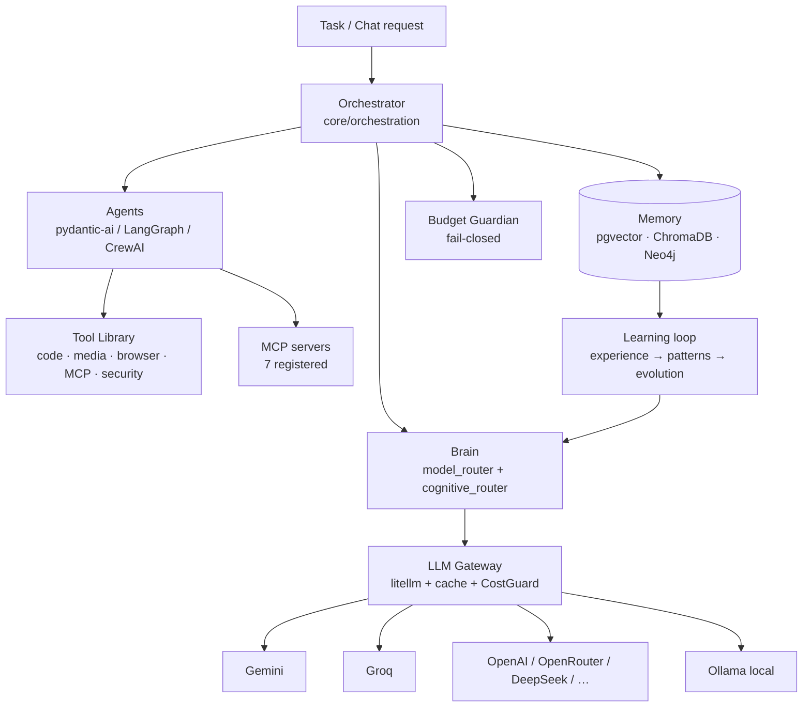

# 09 — AI Brain & Agents

## Overview

The intelligence layer spans four cooperating areas of the backend: the **Brain** (`backend/brain/`) for model routing and cognition, the **LLM Gateway** (`backend/core/llm/`) for governed provider access, the **Agent framework** (`backend/agents/`, `backend/core/agents/`) for execution units, and **Memory & Learning** (`backend/memory/`, `backend/learning/`) for compounding experience.

## Brain (`backend/brain/`)

- **`model_router.py` — `ModelRouter`**: checks provider availability across gemini/openrouter/groq/deepseek/openai keys, picks the best provider using a latency tracker, and exposes monkeypatch hooks (`_call_openrouter`, `_call_huggingface`, `_call_ollama`) for tests.
- **`model_registry.py` — `ModelRegistry`**: tiered catalog from TIER 1 frontier models to free-tier options with OpenRouter IDs (e.g. `anthropic/claude-3-opus`, `openai/gpt-4o`, `deepseek/deepseek-chat`, `google/gemini-2.5-pro-preview`).
- **Cognition modules**: `cognitive_router.py`, `expert_router.py`, `gcp_router.py`, `parallel_cloud_router.py`, `performance_aware_router.py`, `reasoning_orchestrator.py`, `task_execution_engine.py`, `supreme_learning_engine.py`, `user_digital_twin.py`, `agent_departments.py`.

## LLM Gateway (`core/llm/llm_gateway.py`)

The single choke point for provider calls. Design properties:

- **litellm**, lazily imported (deferred to protect boot memory ~240 MB RSS).
- **Per-call API keys** — keys travel with the call, never injected into `os.environ`; `LLM_PROVIDER_KEYS` vault JSON supported; `_MODEL_KEY_MAP` covers groq/gemini/openai/deepseek/openrouter/hf/nvidia/moonshot/together/ollama.
- **Semantic cache** + **fallback chain** + shared **circuit-breaker** manager (reset via `/llm-gateway/admin/circuit-breaker/reset/{name}`).
- **`CostGuard`** enforces `MAX_COST_PER_TASK` and token budgets; orchestration halts fail-closed if the budget guardian dies.
- **Task-based routing** (`TASK_MODEL_MAP`): coding → `groq/llama-3.3-70b-versatile`; reasoning → `openrouter/meta-llama/llama-3.3-70b-instruct`; vision/chat/general → `gemini/gemini-2.0-flash` (override via `GEMINI_MODEL_NAME`).
- **Observability**: Langfuse adapter on calls; policy file `backend/config/routing_policy.json`; provider classes in `services/llm/providers.py` (`Provider` StrEnum: MOONSHOT, DEEPSEEK, TOGETHER, OLLAMA, GEMINI, HF_SPACE, OPENAI, GROQ) built on `BaseOpenAICompatibleProvider` with SSE parsing, `@circuit_breaker`, `@timed` metrics.
- **Free-tier rate limits**: `GEMINI_RPM_LIMIT=9`, `GROQ_RPM_LIMIT=28`, etc.
- **Ollama**: local-only adapter (`core/llm/providers/ollama_adapter.py`, default model `qwen2.5:0.5b`); `OLLAMA_URL` is fail-fast — no silent localhost fallback.

## Agent Framework

**Pydantic-AI integration** — `agents/base_pydantic_agent.py::BasePydanticAgent` wraps a pydantic-ai `Agent` (default `openai:gpt-4o`) wired to the gateway and `MCPRegistryClient`, with dynamic MCP tool registration.

**Frameworks inside `core/agents/framework/`:**
- `SupremeOrchestrator` (LangGraph-style, `langgraph_agent.py`)
- `SupremeCrew` / `CrewAgent` / `CrewTask` (CrewAI pattern, `crewai_agents.py`)
- `AgentDepartment` — `CodingAgent`, `ReviewAgent`, `QAAgent`
- `AutonomousAgent` (`task_runner_agent.py`)

**Declarative registry** — `core/agent_registry.json` defines agents (`guardian_expert`, `research_assistant`) with `system_prompt`, `tools[]`, `permissions[]`, `model_temp`, and resource constraints (`max_tokens_per_task`, `max_api_calls_per_hour`). `core/agent_factory.py` builds them; `core/agent_supervisor.py` supervises.

**Specialist agents** (`backend/agents/`): `SentinelAgent` (heartbeat monitor + anomaly detector + alert router), `InsightMage`, `VulnerabilityProphet`, `PerformanceGuardian`, `SkillLibrarian`/`SkillIngestor`/`SkillGarbageCollector`, `InternetMonitorAgent`, `MorphicAdapter`, `ephemeral_executor.py`, `headless_terminal_agent.py` — plus subpackages for domain, devops, governance, IDE, monitoring, infrastructure, evolution and SyncGuard.

**Live agents** (`core/agents/live/`): `benchmark_agent`, `vision_agent`, `browser_agent`, `computer_agent`.

## Orchestration (`core/orchestration/`)

`orchestrator.py::Orchestrator` runs a periodic `tick()` via `asyncio.TaskGroup`:

1. `_run_fitness_scoring` — `FitnessEngine` singleton scores skills
2. `SelfEvolutionAgent._tick` — self-evolution cycle
3. **Budget guardian subprocess** — `scripts/orchestrator/auto_budget_guardian.py`; failure halts the orchestrator (cost is fail-closed)

Task execution uses `decompose_intent()` → `execute_skill_chain()` over the `EvolutionSkillGraph` (edge-weight feedback, compensation fallbacks). HTTP surface: `GET /orchestrator/status`, `POST /orchestrator/tick` (Cloud Scheduler target). Siblings: `agent_orchestrator.py`, `master_cognitive_orchestrator.py` (CLI: `tools/master_orchestrator.py --intent repair|synthesis|audit|evolution`), `swarm_orchestrator.py`, `trio_pipeline.py` (Gemini → Kilo → Cline), `crew_departments.py`, `cloud_sandbox_orchestrator.py`.

## Tool Library (`backend/tools/` — 123 files)

`code/`, `media/`, `mcp/`, `browser/`, `devops/`, `knowledge/`, `learning/`, `social/`, `security_tools/`, `localization/`, `billing/`, `analytics/`, `creative/`, `ai_agents/`. Tools are composed by the skill chain, not hard-wired to agents.

## MCP Integration

- **Official server**: `tools/mcp/mcp_server.py` ("supremeai-knowledge-graph", stdio) exposing `get_skill_dependencies` and `find_optimal_learning_path` over Neo4j.
- **Sibling servers**: `mcp_supabase.py`, `mcp_workspace.py`, `mcp_cloud_deploy.py`, `mcp_github_cicd.py`, `mcp_observability.py`, `mcp_ide_trio.py`, `memory/mcp_server.py`.
- **Clients**: `core/mcp_client.py` (`MCPRegistryClient`, `ControlTowerClient`), `brain/mcp_client.py`.
- **Security**: `core/mcp_allowlist.py`, `core/plugins/mcp_security.py`.
- **Control Tower**: `infrastructure/mcp-control-plane/` — TypeScript MCP server deployed as `supremeai-mcp-tower` with adapters for render, firebase, supabase, redis, infisical, cloudflare, github/actions and an AI key pool.

## Memory & Learning

**Memory stack** (`backend/memory/`): `unified_db_manager.py` (single entry point, `write_via_unified_memory()` consumed by tools), `episodic_memory.py`, `long_term_memory.py`, `chromadb_store.py`, `supabase_store.py` (pgvector), `rag_pipeline.py`, `sliding_window.py`. Vector writes use `core/embeddings.embed_for_pgvector()` (dim 1536) into the `ai_memory` table.

**Learning loop** (`backend/learning/`): `experience.py` (task→experience records), `pattern_recognizer.py`, `hypothesis_engine.py`, `outcome_analyzer.py`, `evolution_bridge.py`. Outcomes feed the evolution engine (`backend/evolution/`: `advanced_evolution_engine.py`, `fitness_evaluator.py`, `canary_manager.py`, `benchmark_runner.py`).

**Knowledge tools** (repo-level): `tools/knowledge/` injects Tool Knowledge Cards (categories RADAR/SHIELD/ENGINE/ORCHESTRATOR/MEMORY/EVOLUTION) into `ai_memory` with content-hash dedup; `tools/knowledge_squeezer/` runs multi-model brainstorm → adversarial audit → Socratic gap mining → confidence-gated synthesis → optional long-term memory promotion.

## Reasoning Engines (`backend/engine/`)

`smart_router.py`, `tree_of_thought.py`, `debate_engine.py`, `self_reflection.py`, `vector_db.py`, `worker_node.py`, and `compression/token_juice.py` (token-compression pass, toggled by `TOKEN_JUICE_ENABLED`). The `ecosystem/` package hosts the phase 2–14 orchestration modules (task engine, capability registry, governance, approval workflow) on a shared SQLite store for fast local operation.

## Optional External Integrations

`backend/integrations/` — each flag-gated *and* guarded by `importlib.util.find_spec`, zero-cost fallback when absent: **mem0** (`SUPREMEAI_MEM0_ENABLED`), **Graphiti** (`SUPREMEAI_GRAPHITI_ENABLED`), **browser-use** (`SUPREMEAI_BROWSER_USE_ENABLED`), **E2B** (`SUPREMEAI_E2B_ENABLED`), **OpenHands** (`SUPREMEAI_OPENHANDS_ENABLED`).
