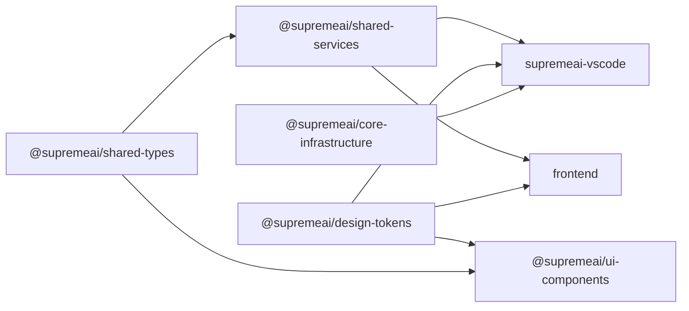

# 10 — Monorepo Packages

`packages/` holds five shared TypeScript packages consumed by the frontend, the VS Code extension and (for tokens) any Flutter client. Workspace deps use `workspace:*` protocol; Turborepo enforces build order (`turbo.json`).

Dependency graph:

## @supremeai/shared-types (v1.0.0)

Single source of truth for cross-client contracts, built on **zod ^3.25.76**; consumed as raw TypeScript (`main`/`types` = `./src/index.ts` — no build step).

- `message.ts` — `ToolCallSchema` (id, name, arguments, result?, status `pending|success|error`), `MessageSchema` (id, role `user|assistant|system`, content, timestamp, toolCalls?).
- `conversation.ts` — `SkillSchema`, `ConversationSchema`, generic `ApiResponse<T>` (`success`, `data?`, `error{code,message,details?}`, `requestId?`), OpenAI-style `ToolCall`.
- `agent.types.ts` — `AgentAction` union (`READ_FILE | WRITE_FILE | RUN_COMMAND | SEARCH_CODEBASE | ANALYZE_ERROR | RUN_SANDBOX | IDLE`), `AgentReasoning` (chainOfThought, confidenceScore 0–1), unified `AgentResponse<T>` envelope.
- `auth.types.ts` — `AuthStateEnum`, `AuthTransitionEventEnum` (AUTH_INIT … WORKSPACE_SWITCH), `WorkspaceStateEnum`, `AuthStateSchema`.

**Cross-language generation**: `scripts/generate_types.py` scans Pydantic models under `backend/schemas/` and emits TS `.d.ts` → `src/typescript/` and Dart classes → `src/dart/` (barrels `index.d.ts` / `index.dart`; `SkillGovernance`, `SkillManifest`, `SkillPermissions`). Supports `--watch` and `--validate`, checksum ledger at `.type_checksums.json`. *Caveat:* generated field types are currently `null`/`any` placeholders — treat the generated Dart as scaffolding, not a contract.

## @supremeai/shared-services (v1.0.0)

"Shared AI services between VS Code extension and Electron desktop app — platform-agnostic logic with injectable platform adapters." Peer dep axios; depends on shared-types. Root barrel exports types, platform interfaces (`PlatformLogger/Notification/Prompt/SecretStorage/Workspace/TextDocument`), services and realtime; subpath `./vscode` exports the VS Code adapter (kept out of the browser-safe barrel); `platform/electron.ts` maps `window.supremeDesktopAPI` IPC.

| Service | Purpose |
|---------|---------|
| `SupremeAIService` | Axios backend core (baseURL from config, 10 s timeout, token provider injection, session id); chat/analysis/error endpoints; `get/setSupremeAIService` singletons |
| `SupremeExtensionBridge` (apiBridge) | Resilient bridge with injectable token source + unauthorized handler; `EvolveCodeResult` |
| `ScopeGuardService` | Dynamic permission scope `READ_ONLY | READ_WRITE | ADMIN`; main repos default READ_ONLY; JIT-OTP-gated `elevateScope` |
| `SelfHealingService` + `HealingStateManager` | Error analysis → patch proposal state machine; `SelfHealingFix {fixedCode, explanation}` |
| `CrossAiObserverService` | Detects neighbouring AI agents (copilot, gemini, kilo, cline, aider, continue, cursor, windsurf keywords) and reports to `/api/evolution/learn` |
| `PerformanceMonitor` | AI performance analysis → `PerformanceInsight` (bottlenecks, complexity_score, estimated_impact) |
| `TelemetryTracker` | Patch-acceptance tracking (ACCEPTED/REJECTED/MODIFIED) with Levenshtein similarity |
| `SecurityScanner` | AI security scan → `SecurityIssueV2` (severity, type, line, recommendation) |
| `BaseWebSocketManager` | Abstract WS manager: reconnect (max 5, 1 s base delay), 30 s heartbeat, status events |
| `promptForOtp` / `isValidOtp` | Platform-agnostic JIT-OTP prompt (reason ≥ 5 chars) |

## @supremeai/ui-components (v0.1.0)

React component library (peer deps: react 18||19, react-query 5, monaco-react 4). Exports: `ChatBubble` (role-aware bubble), `SupremeCard` (glassmorphism card with `glow`/`blur` props driven by design-token CSS vars), `SupremeHeader`, `DashboardShell` (sidebar + main layout), `LiveSujonBackground` (animated gradient), `ErrorBoundary` (self-healing `attemptAutonomousRecovery` with attempt count + render-prop fallback), `SharedProviders` (module-scope QueryClientProvider: retry 1, no refetchOnWindowFocus), and `getApiBaseUrl()` (env → window.origin → localhost fallback; throws in production when unset). Styling = Tailwind utilities + CSS custom properties from design-tokens.

## @supremeai/design-tokens (v1.0.0)

"Single source of truth for SupremeAI 2.0 design tokens" — **style-dictionary ^5.5.2** pipeline (`node build.js`):

- **Sources** (`tokens/`): `primitives.json` (brand indigo #6366F1/#4F46E5, cyan #00F3FF, purple #A855F7, neutral 0–950, status), `semantic.json` (aliases like `{color.brand.500}`), `vscode.json` (editor background/foreground, button).
- **Extras**: `design-tokens.json` (unified v2.0.0 file), `src/admin.json` (admin palette), `src/admin.bn.json` (Bengali admin strings — ড্যাশবোর্ড etc.).
- **Outputs** (`outputs/`): `css/variables.css` (`:root { --color-brand-500: #6366F1 … }`), `json/tokens.json`, `flutter/colors.dart` (custom format → `Color(0xFF…)`), `vscode/supremeai-theme.json` (dark theme consumed by the extension's `themes` contribution), plus `tokens.css/.dart/.js/.d.ts`.
- **`scripts/copy-to-flutter.js`** copies `tokens.dart` → `apps/mobile/lib/theme/tokens.dart` (target dir not present yet — Flutter app is planned, not committed).

## @supremeai/core-infrastructure (v1.0.0)

"Shared infrastructure utilities (circuit-breakers, error handling, self-healing)" — built with **tsup** (ESM + dts). Currently a scaffolded API: `CircuitBreaker.create()` (pass-through execute), `ErrorHandler.handle()`, `Telemetry.track()` (no-op). Vitest tests + eslint are wired. The VS Code extension depends on it as a stability layer for future logic.

## apps/docs — Docusaurus Site

`supremeai-docs` v1.0.0 — Docusaurus **3.6** with `docusaurus-plugin-openapi-docs`, i18n locales **en + bn**, url `https://docs.supremeai.dev`, GitHub org `paykaribazaronline`. Sidebar currently hosts Getting Started (`intro.md`), `api-reference.md`, `bangla-guide.md` (full Bengali guide) and the eLai Code extension references (EN + BN). Build: `pnpm build` (turbo target `supremeai-docs#build`) or `cd apps/docs && pnpm build`.

## Shared Protocol

`shared/protos/supreme_engine.proto` — proto3, package `supremeai`, one gRPC service **`WorkerService`** ("handles heavy background tasks and security auditing"): `SubmitTask(TaskRequest) returns (TaskResponse)`, `GetTaskStatus`, `LogAuditEvent`. Messages cover task_type/payload_json/result_json and audit events (event_type, user_id, resource, details_json).

## Known Gaps (documented for maintainers)

1. `turbo.json` declares `@supremeai/shared-services#build`, `@supremeai/shared-types#build` and `@supremeai/desktop-app#build` — the first two packages define **no build script** (source-consumed), and no `desktop-app` workspace exists (desktop targets the `frontend` package).
2. Root `package.json` `deploy:gcp` references `infrastructure/terraform` (absent) and `docker:build`/`docker:up` reference `infrastructure/docker/docker-compose.yml` (absent) — use the root `docker-compose*.yml` files instead.
3. Generated Dart/TS types from `scripts/generate_types.py` emit placeholder field types (see above).
