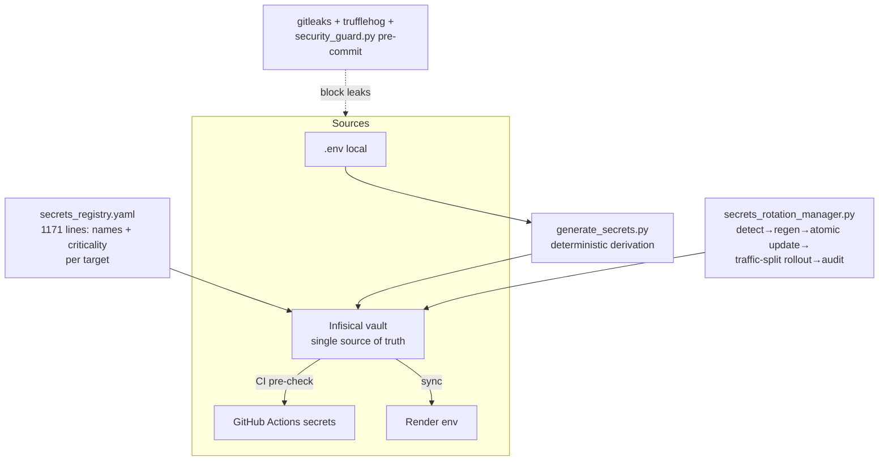

# 14 — Security

Security in SupremeAI is layered: edge middleware, authentication flows, secrets governance, static scanning, sandboxing, and CI gates. This page maps each layer to its implementation.

## Authentication & Authorization

**User auth (JWT)** — `/api/v1/auth/*` issues JWTs (`pyjwt[crypto] ^2.10.1`); secrets: `JWT_SECRET` / `SUPREMEAI_JWT_SECRET` (≥64 chars, boot-crash enforced). Frontend stores the token in `localStorage` (`supremeai_auth_token`) and sends Bearer + CSRF (`X-CSRF-Token`) + device-fingerprint headers; the backend derives role — the client never self-assigns it.

**Admin auth (step-up)** — `POST /api/admin/firebase-login` → OTP/TOTP verification (`supremeai.adminStore` flows, 7-digit TOTP via `firebaseTotpSetup/Verify`) → admin JWT. Server-side requirements: `SUPREMEAI_ADMIN_PASSWORD_HASH` (bcrypt), `SUPREMEAI_ADMIN_TOTP_SECRET`, `AUTHORIZED_ADMINS`. Admin routers all receive `Depends(get_current_user_token)` in `api/routers.py`. Recent hardening commit sanitized approval errors and fixed TOTP-related logout loops (branch `fix/auto-logout-after-totp`).

**API keys** — `APIKeyAuthMiddleware` + `core/security/api_key_limiter.py`; keys via `SUPREMEAI_API_KEY` / `AUTH_KEYS` / `API_KEY_SIGNING_SECRET`.

**RBAC** — `core/security/authentication/rbac.py`; frontend mirrors with `RoleGuard`/`PermissionGuard` (`frontend/src/components/core/guards/RoleGuard.tsx`, permissions contract in `src/config/permissions.ts`).

**Test bypasses** — `ALLOW_TEST_AUTH_BYPASS` / `ALLOW_TEST_ORIGIN_BYPASS` exist for pytest but `is_bypass_allowed` is **hard-False in production**.

**WebSocket auth** — `core/security/ws_auth.py`: strict auth window (`WS_AUTH_WINDOW_SECONDS`), attempt caps (`WS_MAX_AUTH_ATTEMPTS`), per-endpoint token query auth for dashboards.

## Middleware Defense Stack

Layered in `create_app()` (outermost→innermost): CORS (fail-closed in prod; wildcard+credentials rejected) → response standardization → **rate limiting** (Redis-backed, `middleware/rate_limiter.py`, tenant-aware `tenant_rate_limiter.py`) → idempotency → **chaos injection** (resilience testing) → **honeypot** (`HoneypotMiddleware`) → AutonoGuard → API-key auth → JWT auth → observability → **tenant extraction** → Supreme context → **trusted-origin** validation → **request validation** (SQLi/XSS scrubbing, `RequestValidationMiddleware`) → security headers → request IDs → gzip. `middleware/anti_hacking.py` adds abuse detection. WS DoS caps were added in a recent hardening commit.

Additional `core/security/` assets: SSRF protection, prompt firewall, AST + secret scanners, `secure_credential_store.py`, `cryptographic_ledger.py`, `tool_gateway.py`, `audit/` (security_auditor, compliance_bot), `intelligence/` (guardian_ai, behavioral_analyzer).

## Secrets Governance

- **Registry**: `secrets_registry.yaml` is canonical — every secret *name* with criticality (`optional|important`) across targets `infisical-vault`, `render-backend`, `render-admin`, `github-actions`, `firebase-gcp`, with code-scan provenance notes.
- **Rotation**: `scripts/security/secrets_rotation_manager.py` (`--dry-run/--rotate/--schedule/--audit`) detects expiring secrets (JWT, Firebase SA, Stripe), regenerates with crypto RNG, updates Infisical atomically, rolls out with traffic splitting, writes a Firestore audit trail, alerts Discord/Slack. `scripts/security/auto_secret_rotate.py` complements it.
- **Encryption at rest**: Fernet `ENCRYPTION_KEY` (44-char, boot-crash) + `SUPREMEAI_CREDENTIAL_ENC_KEY`; `setup_kms.sh` generates dev keys; per-call LLM keys never enter `os.environ`.
- **KMS hook**: `KMS_KEY_NAME` for cloud KMS integration.

## Static & CI Scanning

| Layer | Tooling |
|-------|---------|
| Secrets | gitleaks 8.x (`.gitleaks.toml` with custom `render-api-key` `rnd_…` and `sk-sup-…` rules + allowlists) · Trufflehog (CI build-mcp + advanced-checks) · `detect-private-key` pre-commit · `packages/scripts/security_guard.py` ("secret-hunter" pre-commit — added after a real `RENDER_API_KEY` once slipped in) |
| SAST | Bandit (advanced-checks) · CodeQL config `.github/codeql/codeql-config.yml` (default-setup consumption) |
| Dependencies | pip-audit (nightly, blocking) · `scripts/security/check_dependencies.py` · `dependency_freshness_radar.py` · Dependabot (pip/npm/actions, weekly) |
| Containers | Trivy (security job) |
| Workflow lint | actionlint + yamllint (`check_actions.py`) |
| Pre-deploy | `pre_deploy_check.sh` (9-step gate incl. frontend secret scan, required secrets, free-tier limits) |
| Nightly vuln scan | `scripts/security/auto_vulnerability_scanner.py` → SARIF + CycloneDX SBOM to `reports/security/` |
| Blindspots | `scripts/security/auto_find_blindspots.py` (pre-commit) · `auto_find_blindspots` · `scripts/quality/self_audit_scan.py` |

Secrets never live in code: `check_frontend_secrets.py` gates frontend builds; `check_required_secrets.py pre_check` verifies the deploy-time secret set before advanced CI checks run.

## Sandboxing & Isolation

- **Code execution**: `backend/sandbox/docker_sandbox.py` + `file_isolation_gate.py`; gVisor / Firecracker hooks via `GVISOR_PATH` / `FIRECRACKER_PATH`; fallback policy flags `ALLOW_SANDBOX_FALLBACK`, `ALLOW_LOCAL_SANDBOX_FALLBACK`.
- **Scraper isolation**: Playwright/Chromium runs in a separate container (`services/scraper`), never in the core image.
- **ScopeGuard** (shared-services): dynamic `READ_ONLY | READ_WRITE | ADMIN` scopes with JIT-OTP elevation; main repos default READ_ONLY.
- **BYOC credentials**: encrypted, router gated on `ENCRYPTION_KEY`, limits in `config/byoc_limits.json`.
- **MCP security**: `core/mcp_allowlist.py`, `core/plugins/mcp_security.py` — tool allowlists for MCP servers.

## Audit & Governance

- `ecosystem/governance` + `ecosystem/approval_workflow` — policy gates before high-impact actions (Constitution #6: Policy Before Power).
- HITL approvals over `/ws/hitl` for autonomous operations.
- `cryptographic_ledger.py` — tamper-evident records; `audit_log_analyzer.py` analyzes audit logs; `AuditLogsPanel` + `ConsentMatrixModal` in the admin console surface them.
- `PATCH_TELEMETRY` table + `TelemetryTracker` track accepted/rejected/modified autonomous patches.
- `tools/autonomy/tools/agent_change_budget.py` — change-risk budgets with approval tiers; `deploy_guard.py` — pre-deploy risk gate (secrets, missing tests, rollback, blast radius).
- Frontend CSP: strict Content-Security-Policy meta tag in `index.html`; security headers middleware server-side.

## Known Gaps / Watch Items

- Frontend stores JWT in `localStorage` (XSS surface mitigated by CSP + input scrubbing, but token theft on extension/host compromise remains possible — consider HttpOnly cookies if threat model grows).
- Two pre-commit YAML workflow files sit outside `.github/workflows/` (inert) — either activate or remove to avoid confusion.
- gitleaks rule file declares v8.30.1 while CI pins 8.18.2 — keep versions aligned.
- `supabase-ca.crt` at repo root is unreferenced; the live SSL path is `SUPABASE_DB_CA_CERT`.
