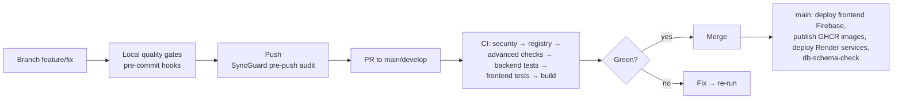

# 16 — Contributing

## Toolchain Requirements

- **Node 24+** and **pnpm 10.15+** (Corepack: `corepack enable` — `packageManager` field pins it)
- **Python 3.11+** and **Poetry 2.x** (CI pins 2.4.1 and fails on lockfile drift)
- Pre-commit: `pip install pre-commit && pre-commit install` (or `bash scripts/setup-git-hooks.sh`, which also installs the SyncGuard pre-push hook)

## Repository Workflow

1. Branch from `main` using the naming conventions CI filters recognize: `feature/*`, `fix/*` (plus `docs/*`, `chore/*`, `refactor/*`, `test/*` seen in history).
2. PRs target `main` or `develop`; CI path-filters jobs (backend/frontend/infra) — use `workflow_dispatch` force inputs only when necessary.
3. Force pushes to `main`/`master` are **rejected client-side** by the SyncGuard pre-push hook (defense-in-depth where branch protection is unavailable). Bypass locally with `SKIP_CI_PARITY=1`; run the full suite before push with `RUN_FULL_TESTS=1`.
4. The pre-push hook also runs the **SyncGuard agent audit** (`backend/src/agents/syncguard/…` via `python -m`) — pushes abort on failure.

## Pre-commit Hooks (`.pre-commit-config.yaml`)

Standard: check-yaml, check-json, check-toml, check-merge-conflict, debug-statements, end-of-file-fixer, trailing-whitespace, detect-private-key, check-ast.

Custom (the interesting ones):

| Hook | Script | Catches |
|------|--------|---------|
| `secret-hunter` | `packages/scripts/security_guard.py` | Secrets in code (born after a real RENDER_API_KEY slip) |
| `api-contract-check` (pre-push) | `scripts/ci/verify_api_contract.py` | API contract drift |
| `ruff` + `ruff-format` | backend config | Lint + format |
| `mypy` | scoped to `core/security/secret_hunter.py` | Type safety (backend mypy is `strict = true`) |
| `eslint-frontend` | frontend flat config | JS/TS lint |
| `supremeai-blindspot-scan` | `scripts/security/auto_find_blindspots.py` | Logic blind spots |
| `stub-data-check` | `scripts/find_stub_data.py --fail-on HIGH` | Stub/placeholder data in prod paths |
| `router-smoke-test` | `scripts/ci/validate_router_imports.py` | Dead router imports |
| `free-tier-size-guard` | `scripts/ci/check_free_tier_limits.py` | Repo size vs free-tier caps |
| `admin-auth-lint-guard` | `.github/scripts/verify_admin_auth.py` | Admin routes missing auth |
| `httpx-timeout-audit` | grep | `httpx.AsyncClient()` without timeout |
| `observability-audit` | `scripts/audit_observability.py` | Silent excepts / stray prints |

## Code Style

**Backend (Python)**
- Format/lint: **ruff** (pinned 0.16.4 in dev deps) — `ruff check` + `ruff format` must pass in CI.
- Types: **mypy strict** (`backend/pyproject.toml [tool.mypy]`: `strict = true`, `disallow_untyped_defs`, `warn_return_any`, pydantic plugin) — helper `scripts/devops/fix_mypy.py`.
- Tests colocated under `backend/tests/<topic>/`; mark new tests (`critical`/`important`/…) — the merge gate runs `-m "(critical or important) and not requires_network and not e2e and not chaos"`.
- Async-first: SQLAlchemy 2.0 async, httpx async clients (with timeouts — enforced), pytest-asyncio auto mode.
- Comments may be bilingual (English + Bengali) — that is house style, not an accident.

**Frontend (TypeScript)**
- ESLint 9 flat config (`frontend/eslint.config.js`), `tsc --noEmit --strict` (note: `src/commandcenter` is excluded from typecheck), knip for dead code.
- State: zustand (prefer extending existing stores; the unified-store migration R13 is in flight — see `src/store/_legacy_stores.md` and `slices/migration_map.ts`).
- Server data via React Query; realtime via `BaseWebSocketManager` subclasses or `secureSse`.
- Styling: Tailwind utilities + design-token CSS variables (`@supremeai/design-tokens`); SupremeAI palette lives in `tailwind.config.js` (user primary #A855F7, admin primary #00F3FF).
- i18n: add strings to **all four locales** in `src/i18n/translations.ts` (en/bn/es/zh) — CI runs `bengali_i18n_completeness_checker.py`.
- Tests colocated `*.test.ts(x)`; coverage thresholds apply in CI.

**Shared packages**
- Types changed in `backend/schemas/` → regenerate cross-language types: `python scripts/generate_types.py` (or `--watch`).
- Design tokens: edit `packages/design-tokens/tokens/*.json` → `pnpm build` in that package → outputs regenerate for CSS/JSON/Flutter/VSCode.

## CI Gates You Must Pass (PR)

1. `security` — Trivy + secret scan
2. `registry` — canonical config registry structure + runtime contract + no hardcoded deployment config
3. `advanced-checks` — required secrets pre-check, ~14 analyzers, `ci-full-audit.sh`, pip-audit, bandit, trufflehog, gitleaks, actionlint
4. `backend-tests` — ruff, tiered pytest, OpenAPI validation, coverage gate (`coverage_quality_gate.py`)
5. `integration-test`
6. `frontend-tests` — single-frontend gate, strict tsc, eslint, vitest + coverage, knip
7. `build` — pnpm build succeeds (backend URL fail-fast must be satisfied via env)

## PR Etiquette & Review

- `CODEOWNERS` and `secrets_registry.yaml` governance apply to secret-adjacent changes — update the registry whenever you add/remove a secret name.
- New routers: register in `api/routers.py` (role + admin flags), keep OpenAPI current (CI validates schema), and run `scripts/advanced_analysis/orphan_route_finder.py` if adding endpoints that no client calls yet.
- New env vars: add to `.env.example` with a comment, add to `secrets_registry.yaml` if secret-shaped, and verify with `python scripts/audit_env_usage.py`.
- Autonomous/AI-generated changes follow the autonomy pack rules: plan-first, dry-run default, evidence + tests + rollback path (`tools/autonomy/tools/deploy_guard.py` checks).
- Docs: `scripts/quality/docs_drift_check.py` exists because docs rot — if your change invalidates a documented command, path, or env var, update the doc in the same PR.

## Where Historical Context Lives

Deliberately excluded from the clean doc set but useful when archaeology is needed: `PATCH_NOTES_v2/v3.md`, `TIER_S_PATCH_GUIDE.md`, `AUDIT_MASTER_CHECKLIST.md`, `SILENT_ERRORS_AUDIT.md`, `SUPREMEAI_COMMITS_NEGATIVE_FINDINGS_TRACKER.md`, `LESSONS_LEARNED.md`, `MANUAL_STEPS.md`, `docs/DECISION_LOG.md`, `docs/ARCHITECTURE.md`, `docs/KNOWN_ISSUES.md`, and per-directory `_INDEX.md` files (`backend/_INDEX.md`, `scripts/_INDEX.md`, `tools/vscode-extension/_INDEX.md`).
