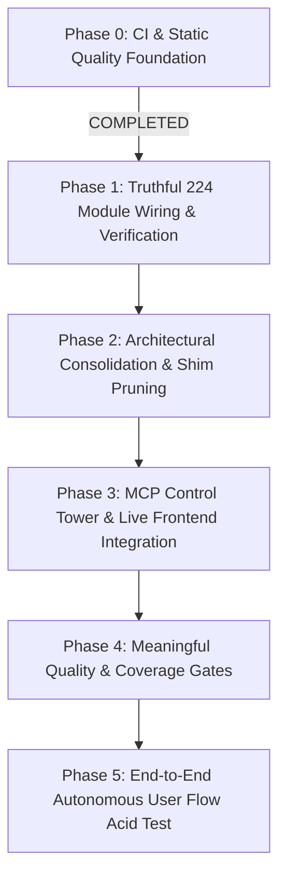

# SupremeAI Consolidation & Quality Roadmap
> **Companion doc:** `docs/SUPREMEAI_CONNECT_VERIFY_SIMPLIFY_PROVE_ROADMAP.md` (v2.0, 2026-09-11) is the detailed, codebase-verified execution roadmap for the current phase — task-level breakdown (C/V/S/P workstreams), milestones M1–M4, risks and evidence gates.
**Current Phase:** Connect, Verify, Simplify, Prove  
**North Star:** Stop feature inflation. Unify fragmented implementations, truthfully verify all 224 functional modules, eliminate wrappers/shims, and prove real end-to-end user workflows.

---

---

## 📌 Milestone Breakdown

### Phase 0: CI & Static Quality Foundation `[COMPLETED ✅]`
- **Goal:** Eliminate repository-wide syntax, undefined names, and critical bug risks in non-core directories (`tools/`, `scripts/`, `packages/`, `.github/`).
- **Completed Deliverables:**
  - [x] Zero undefined names (`F821`, `F822`, `F823`) across entire repository.
  - [x] Zero wildcard star-imports (`F403`, `F405`) in tools and scripts.
  - [x] Fixed bare `except:` statements and duplicate exception traps (`B025`, `E722`).
  - [x] Verified and pushed to `origin/main` (`faa0627fde`).

---

### Phase 1: Truthful 224 Module Wiring & Verification `[NEXT UP 🎯]`
- **Goal:** Transform our module status from *"It imports without crash"* to *"It is wired, called, and verified in the live system"*.
- **Target Deliverables:**
  1. **Automated Wiring Detector (`scripts/audit_module_wiring.py`):**
     - Traverse AST and call graphs to verify if each of the 224 modules has active inbound callers (from API routers, Orchestrator, Swarm, MCP, or UI).
  2. **Truthful 5-Tier Classification:**
     - 🟢 **Operational:** Fully wired, imported, covered by tests, and has active production caller.
     - 🟡 **Environment-Dependent:** Requires external host services (Docker daemon, Telegram bot token).
     - 🟠 **Partially Wired / Dormant:** Functions in isolation but has zero inbound calls from the main application flow.
     - 🔴 **Broken:** Crashes on execution or missing required dependencies.
     - ⚪ **Planned / Experimental:** Future architectural slot.
  3. **Update `MODULES_LIST.md`:**
     - Replace generic "Working" badges with genuine operational evidence.

---

### Phase 2: Architectural Consolidation & Shim/Wrapper Pruning
- **Goal:** Stop nested complexity (`shim -> adapter -> wrapper -> wrapper`) and enforce single canonical systems.
- **Target Deliverables:**
  1. **Routing Consolidation:**
     - Deprecate isolated routers (`ensemble_router.py`, `unified_router.py`) in favor of the canonical `backend/services/llm/llm_router.py` (`ModelRouter`).
  2. **Agent Architecture Consolidation:**
     - Unify multi-directory agent sprawl (`backend/agents/`, `backend/core/agents/live/`, `backend/core/agents/framework/`) into one canonical agent framework.
  3. **Memory Bridge Simplification:**
     - Ensure all memory queries flow strictly through `MemorySubAdapter` inside MCP Control Tower, avoiding fragmented memory wrappers.

---

### Phase 3: MCP Control Tower & Live Frontend Integration
- **Goal:** Prove that the single unified `supremeai-control-tower` operates seamlessly across all clients.
- **Target Deliverables:**
  1. **Single Entry Point Verification:**
     - Antigravity IDE, Claude Desktop, and Cursor connect via `node infrastructure/mcp-control-plane/dist/index.js` (Port 3772 / stdio).
  2. **Frontend `MCPConnector.tsx` as Pure Viewer:**
     - Verify live discovery of tools and resources over SSE/HTTP without mutation side-effects.
  3. **Live Health & Capability Discovery:**
     - Ensure dynamic tool discovery returns all available tools (Docker, Git, Supabase, Render, Memory).

---

### Phase 4: Meaningful Quality & Coverage Gates
- **Goal:** Protect the codebase against silent regression by raising the bar on automated CI gates.
- **Target Deliverables:**
  1. **Raise Test Coverage Thresholds:**
     - Backend: Incremental raise from 35% to 50%+ in `pyproject.toml` / CI workflow.
     - Frontend: Incremental raise from 9% to 25%+ in Vitest configs.
  2. **Nightly vs PR CI Separation:**
     - Fast PR checks (< 3 mins): Lint, typecheck, critical unit tests.
     - Nightly Deep Scans: Advisory security scanners, mutation tests, full integration sweeps.

---

### Phase 5: End-to-End Autonomous User Flow Acid Test
- **Goal:** Prove the system works for a real human user executing a complex real-world goal.
- **Target Deliverables:**
  1. **Autonomous Mission Execution:**
     - User inputs a high-level task: *"Scan local repo for unused database queries, generate migration plan, and run tests"*.
  2. **Execution Path Validation:**
     - Discover tools via MCP Control Tower -> Orchestrate via ModelRouter -> Execute safely in sandbox -> Verify output -> Save knowledge to vector memory -> Report to user.
  3. **Zero Console Errors & Zero Flakiness:**
     - 100% clean browser console and zero silent failures.

---

## 🚦 Execution Rule
At each phase:
`Audit Reality` ➔ `Consolidate & Fix` ➔ `Automated Test & Prove` ➔ `Commit & Push`
