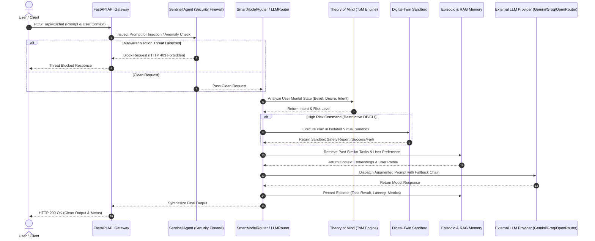

# SupremeAI 2.0 — Complete System Documentation
**A Comprehensive Guide: Why, How, and How Smartly We Build It**

**Version:** 2.0.0  
**Last Updated:** July 27, 2026  
**Author:** SupremeAI Engineering Team

---

## Table of Contents

1. [Executive Overview](#1-executive-overview)
2. [Why SupremeAI 2.0? — The Problem Statement](#2-why-supremeai-20--the-problem-statement)
3. [System Architecture — The Big Picture](#3-system-architecture--the-big-picture)
4. [Core Components Deep Dive](#4-core-components-deep-dive)
5. [Security Architecture — AutonoGuard & Beyond](#5-security-architecture--autonoguard--beyond)
6. [Resilience Engineering — Never Go Down](#6-resilience-engineering--never-go-down)
7. [Memory & RAG Pipeline](#7-memory--rag-pipeline)
8. [Intelligent Agents Ecosystem](#8-intelligent-agents-ecosystem)
9. [Evolution & Self-Improvement — Tier-8](#9-evolution--self-improvement--tier-8)
10. [Multi-Tenant Billing & Quota System](#10-multi-tenant-billing--quota-system)
11. [Infrastructure & Deployment Strategy](#11-infrastructure--deployment-strategy)
12. [CI/CD Pipeline — Zero-Downtime Delivery](#12-cicd-pipeline--zero-downtime-delivery)
13. [How Smartly We Build It — Engineering Innovations](#13-how-smartly-we-build-it--engineering-innovations)
14. [Known Issues & Future Roadmap](#14-known-issues--future-roadmap)
15. [Appendix: File Map & Reference](#15-appendix-file-map--reference)

---

## 1. Executive Overview

**SupremeAI 2.0** is not just another AI platform. It is a **self-evolving, multi-tenant, production-hardened AI orchestration engine** that combines state-of-the-art machine learning research with enterprise-grade reliability patterns. Built primarily with Python (FastAPI), TypeScript (React), and PostgreSQL, it spans:

- **~80+ micro-modules** across backend, frontend, infrastructure, and tooling
- **~350+ test files** ensuring production readiness
- **~18 CI/CD workflow files** for automated delivery
- **Zero-cost hosting strategy** as a core architectural constraint
- **Self-healing, self-evolving capabilities** that push the boundaries of autonomous AI systems

The system is designed to serve a diverse range of users — from individual developers using the free tier to enterprise customers with dedicated infrastructure — all while maintaining security, performance, and cost-efficiency.

---

## 2. Why SupremeAI 2.0? — The Problem Statement

### 2.1 The Core Problems We Solve

| Problem | Impact | How SupremeAI Solves It |
|---|---|---|
| **AI systems are fragile** | Single-point failures cascade | Circuit Breaker pattern with FAIL-CLOSED strategy; self-healing agents |
| **LLM costs explode** | Uncontrolled API spending | CostGuard, token_deductor, free_tier_tracker with real-time budget enforcement |
| **Security threats are evolving** | Prompt injection, data leaks | AutonoGuard: prompt_firewall, secret_hunter, RBAC, rate_limiter in multi-layer defense |
| **Memory is disconnected** | Agents forget past context | Episodic + Long-Term memory with RAG via ChromaDB; sliding window context management |
| **AI cannot improve itself** | Static systems become obsolete | Tier-8 Self-Evolution Engine, DailyLearner, SelfEvolutionAgent — meta-cognitive loop |
| **Multi-tenancy is complex** | One tenant's load affects others | Quota enforcer, fraud detector, isolated connection pools, tenant-scoped RBAC |
| **Deployment is expensive** | Cloud costs kill startups | Zero-cost strategy: Render free tier + Cloudflare Workers + SQLite → Postgres migration path |
| **Developer experience suffers** | Poor observability, hard debugging | IntelligentSilentCatcher, ErrorEvent bus, OpenTelemetry tracing, Prometheus metrics |

### 2.2 Why Not Just Use LangChain or AutoGPT?

| Comparison Point | LangChain | AutoGPT | SupremeAI 2.0 |
|---|---|---|---|
| **Production hardening** | Minimal | None | Circuit breakers, retry budgets, startup validators |
| **Multi-tenancy** | Add-on | None | Native: RBAC, quota enforcer, tenant DB isolation |
| **Self-evolution** | None | Basic loop | Tier-8: skill creation, prompt mutation, architecture self-modification |
| **Memory** | Basic vector store | Episodic only | Episodic + Long-Term + RAG + Checkpoint/Resume + Summary Tree |
| **Cost control** | Manual | None | CostGuard + Token Deductor + Budget alerts |
| **Security** | Basic | None | Prompt firewall, secret hunter, rate limiter, MCP allowlist |

---

## 3. System Architecture — The Big Picture

### 3.1 High-Level Architecture Diagram

```
┌─────────────────────────────────────────────────────────────┐
│                      Frontend Layer                          │
│  ┌──────────┐  ┌──────────┐  ┌──────────┐  ┌────────────┐  │
│  │ Studio   │  │ Admin    │  │ Admin    │  │ Mobile     │  │
│  │ Client   │  │ Dashboard│  │ Dashboard│  │ App        │  │
│  │ (React)  │  │          │  │ (Light)  │  │            │  │
│  └────┬─────┘  └────┬─────┘  └────┬─────┘  └─────┬──────┘  │
│       │             │             │               │         │
├───────┴─────────────┴─────────────┴───────────────┴─────────┤
│                      API Gateway (FastAPI)                    │
│  ┌──────────┐  ┌──────────┐  ┌──────────┐  ┌────────────┐  │
│  │ Auth API │  │ Admin API│  │Billing   │  │ WebSocket  │  │
│  │          │  │          │  │ API      │  │ Agent API  │  │
│  └────┬─────┘  └────┬─────┘  └────┬─────┘  └─────┬──────┘  │
├───────┴─────────────┴─────────────┴───────────────┴─────────┤
│                    Orchestration Layer                        │
│  ┌──────────┐  ┌──────────┐  ┌──────────┐  ┌────────────┐  │
│  │Orchestr. │  │ Swarm    │  │ Agent    │  │ Intent     │  │
│  │          │  │ Orch.    │  │ Superv.  │  │ Router     │  │
│  └────┬─────┘  └────┬─────┘  └────┬─────┘  └─────┬──────┘  │
├───────┴─────────────┴─────────────┴───────────────┴─────────┤
│                    Core Intelligence Layer                    │
│  ┌──────────┐  ┌──────────┐  ┌──────────┐  ┌────────────┐  │
│  │ LLM      │  │ Memory   │  │ Skills   │  │ Evolution  │  │
│  │ Router   │  │ Engine   │  │ Manager  │  │ Engine     │  │
│  └────┬─────┘  └────┬─────┘  └────┬─────┘  └─────┬──────┘  │
├───────┴─────────────┴─────────────┴───────────────┴─────────┤
│                    Persistence & Infrastructure               │
│  ┌──────────┐  ┌──────────┐  ┌──────────┐  ┌────────────┐  │
│  │PostgreSQL│  │ Redis    │  │ChromaDB  │  │ Cloudflare │  │
│  │+ PgBounc.│  │ Cache    │  │Vector DB │  │ Workers    │  │
│  └──────────┘  └──────────┘  └──────────┘  └────────────┘  │
└─────────────────────────────────────────────────────────────┘
```

### 3.2 Core Design Principles

1. **FAIL-CLOSED by default** — When a dependency is unavailable, deny access rather than allow potentially dangerous operations
2. **Graceful degradation** — Non-critical services failing doesn't crash the whole system
3. **Parallelized initialization** — Independent services start concurrently via `asyncio.gather()`
4. **Self-healing** — Background agents continuously monitor and repair system health
5. **Cost-aware** — Every LLM call is tracked and budget-limited
6. **Zero-cost compatible** — Architecture works from free-tier to enterprise scale

### 3.3 Technology Stack

| Category | Technology | Why We Chose It |
|---|---|---|
| **Backend Framework** | FastAPI (Python 3.11+) | Async-native, automatic OpenAPI docs, high performance |
| **Database** | PostgreSQL + PgBouncer | Reliable, ACID-compliant, connection pooling |
| **Vector Store** | ChromaDB | Lightweight, embeddable, no separate server needed |
| **Cache** | Redis (async via redis-py) | Atomic operations, Lua scripting, pub/sub |
| **Frontend** | React + Zustand + TypeScript | Type safety, performant state management |
| **Orchestration** | Built-in orchestrator + agent supervisor | Custom, full control over agent lifecycle |
| **Monitoring** | OpenTelemetry + Prometheus | Open standard, vendor-neutral |
| **Deployment** | Render + Docker + Cloudflare | Zero-cost entry, scalable path |
| **CI/CD** | GitHub Actions (1420-line pipeline) | Complete automation of tests, security, deployment |

---

## 4. Core Components Deep Dive

### 4.1 Application Lifespan Manager (`/backend/core/lifespan.py`)

**Why We Built It:** FastAPI's lifespan management is basic. We needed a robust, production-grade startup/shutdown sequence that handles partial failures, parallel initialization, and graceful degradation.

**How It Works:**

```
app_lifespan() → Phase 1 (Parallel):
    ├── _init_tracing()      → OpenTelemetry setup
    ├── _init_db_pool()      → PostgreSQL + PgBouncer pool
    ├── _init_config_cache() → Dynamic config loading
    ├── _init_redis()        → Redis connection verification
    └── _init_cost_guard()   → Budget tracking (Redis-based)
    
Phase 2 (Sequential, depends on Phase 1):
    ├── Orchestrator initialization
    ├── Supabase schema bootstrap
    ├── Sentinel Agent start (periodic endpoint monitoring)
    ├── Swarm Cache Invalidator start
    ├── System Telemetry loop start
    ├── Bug Prophet Anomaly Detector start
    ├── Tier-8 Meta-Self Agents (if enabled)
    ├── SelfEvolutionAgent (if enabled, 5-min cycle)
    ├── DailyLearner (if enabled, 24h cycle)
    ├── AutoHealerService (DB/Redis healing, 30s check)
    └── SelfHealer error listener registration

Shutdown Phase:
    ├── Tier-8 shutdown
    ├── Orchestrator stop
    ├── Agent supervisor shutdown_all(timeout=30)
    ├── Write-behind batchers flush
    ├── DB pool close
    ├── Redis close
    ├── HTTP client close
    └── Browser instance shutdown
```

**Smart Engineering Decisions:**
- **`asyncio.gather()` with `return_exceptions=True`** — Allows independent services to fail without blocking others
- **Subsystem status tracking** via `app.state.subsystem_status` — Enables degraded mode with clear visibility
- **Write-behind flush at shutdown** — Buffered data is persisted before connections close
- **Centralized AgentSupervisor** — All background agents managed through a single lifecycle controller with health checks and auto-restart

### 4.2 Configuration Management (`/backend/core/config.py`, `/backend/core/config_cache.py`)

**Why We Built It:** Environment variables alone are insufficient for dynamic, multi-tenant configurations that need hot-reload without restarts.

**How It Works:**
- `settings` singleton loads from environment variables with Pydantic validation
- `config_cache` provides dynamic, hot-reloadable configuration from Redis/DB
- Fallback to `DEFAULT_CONFIGS` if cache initialization fails
- Supports per-tenant configuration overrides

**Smart Engineering:**
- Configuration is **environment-driven, not hardcoded** — Zero hardcoded values anywhere
- Async refresh for non-blocking config updates
- Graceful fallback chain: Redis → DB → DEFAULT_CONFIGS

---

## 5. Security Architecture — AutonoGuard & Beyond

### 5.1 Overview

Security in SupremeAI is not an afterthought — it's baked into every layer. The system follows a **defense-in-depth** strategy with multiple independent security layers.

```
Layer 1: Network Edge
    ├── Rate Limiter (Sliding Window, Redis atomic)
    ├── Firestore Tenant Isolation
    └── Cloudflare WAF

Layer 2: API Gateway
    ├── RBAC (Role-Based Access Control)
    ├── Permission validation per endpoint
    └── Idempotency middleware

Layer 3: Application
    ├── AutonoGuard Engine
    │   ├── Prompt Firewall (injection detection)
    │   ├── Secret Hunter (credential scanning)
    │   └── Output Validator (PII leak prevention)
    ├── MCP Allowlist (controlled tool access)
    └── Input validation & sanitization

Layer 4: Data
    ├── API key hashing (not storing plaintext)
    ├── Rate-limited key usage tracking
    └── Audit logging via ErrorEvent bus
```

### 5.2 Rate Limiter (`/backend/core/security/rate_limiter.py`)

**The Problem:** Uncontrolled API calls can lead to abuse, DoS attacks, and runaway LLM costs.

**The Solution:** Sliding Window Rate Limiter using Redis ZSET with atomic Lua script operations.

**How It Works:**
```
1. Each request has an identifier (IP, user ID, or endpoint)
2. Redis ZSET stores timestamps of recent requests
3. Lua script atomically:
   a. Removes expired entries (outside window)
   b. Checks current count against limit
   c. If under limit: adds entry, returns success
   d. If over limit: returns failure with reset time
4. Returns tuple: (is_allowed, current_count, remaining_attempts)
```

**Smart Engineering:**
- **FAIL-CLOSED in production**: If Redis is unavailable, requests are DENIED (not allowed)
- **FAIL-OPEN in development**: Non-production environments allow requests when Redis is down
- **Atomic Lua scripts**: No race conditions, no TOCTOU bugs
- **Three limit types**: IP-based, user-based, endpoint-based
- **EVALSHA optimization**: Scripts are loaded once, executed by hash

**Code Example:**
```python
# Usage in middleware
allowed, count, remaining = await rate_limiter.is_allowed(
    identifier=client_ip,
    limit=settings.rate_limit_per_minute,
    window_size=60,
    limit_type="ip"
)
if not allowed:
    raise HTTPException(status_code=429, detail="Rate limit exceeded")
```

### 5.3 RBAC System (`/backend/core/security/rbac.py`)

**The Problem:** Different users need different access levels — from read-only viewers to full administrators.

**The Solution:** A hierarchical role-permission system with config-driven extensibility.

**Role Hierarchy:**
```
OWNER → ADMIN → OPERATOR → VIEWER
  │        │         │         │
  │        │         │         └── READ
  │        │         └── READ + WRITE + DEPLOY
  │        └── READ + WRITE + ADMIN + AUDIT + MANAGE_API_KEYS
  └── Everything above + MANAGE_USERS + MANAGE_BILLING
```

**Smart Engineering:**
- **StrEnum for roles/permissions** — Type-safe, serializable, prevents typos
- **Dual lookup path**: First checks `settings.rbac_role_definitions` (config-driven), falls back to hardcoded roles
- **Wildcard support** (`"*"`) — Emergency bypass for maintenance scenarios
- **UserContext with expiry** — Token expiration enforced at RBAC level, not just auth
- **`require()` method** — Raises `PermissionDeniedError` on failure, preventing silent denial bypass

### 5.4 AutonoGuard Engine (`/backend/core/autonoguard_engine.py`)

**The Problem:** LLMs are vulnerable to prompt injection, jailbreaking, and data leakage.

**The Solution:** A dedicated security engine that scans all prompts and outputs in real-time.

**Key Capabilities:**
- **Prompt injection detection**: Pattern matching for known attack vectors
- **Secret/hardcoded credential scanning**: Prevents API keys, passwords from appearing in prompts
- **Output validation**: Ensures LLM responses don't contain sensitive data
- **Configurable rules**: Security policies adjustable per tenant

---

## 6. Resilience Engineering — Never Go Down

### 6.1 Circuit Breaker (`/backend/core/resilience/circuit_breaker.py`)

**The Problem:** When a downstream service (LLM API, database, Redis) starts failing, the failures cascade to all dependent services, causing system-wide collapse.

**The Solution:** The Circuit Breaker pattern with FAIL-CLOSED strategy — three states that protect the system:

```
      ┌─────────────────────────────────┐
      │          CLOSED (normal)        │
      │  Requests pass through normally  │
      └──────────────┬──────────────────┘
                     │ failure_count >= threshold
                     ▼
      ┌─────────────────────────────────┐
      │          OPEN (failing)         │
      │  Requests rejected immediately   │
      │  Waits recovery_timeout seconds  │
      └──────────────┬──────────────────┘
                     │ timeout elapsed
                     ▼
      ┌─────────────────────────────────┐
      │      HALF_OPEN (testing)        │
      │  Single request allowed through  │
      │  Success → CLOSED                │
      │  Failure → OPEN                  │
      └─────────────────────────────────┘
```

**Smart Engineering:**
- **Thread-safe**: Uses `threading.Lock()` for all state mutations
- **Dual sync/async support**: Single `CircuitBreaker` works with both sync and async functions via `call()` and `acall()`
- **Decorator support**: `@circuit_breaker` syntax for clean integration
- **Prometheus metrics**: Exposes `circuit_breaker_state`, `circuit_breaker_failures_total`, `circuit_breaker_successes_total`
- **Force operations**: `force_close()` and `force_open()` for emergency manual intervention
- **State info API**: `get_state_info()` returns full diagnostic data including timestamps

**State Transitions:**
```python
# Threshold exceeded → OPEN
if self.state == CLOSED and self.failure_count >= self.failure_threshold:
    self._open_circuit()  # Sets state=OPEN, opened_at=now

# Recovery attempt → HALF_OPEN
if self.state == OPEN and self._should_attempt_recovery():
    self.state = HALF_OPEN  # Single request allowed

# Successful recovery → CLOSED
if self.state == HALF_OPEN:
    self.mark_success()  # Sets state=CLOSED, resets counters

# Failed recovery → OPEN again
if self.state == HALF_OPEN:
    self.mark_failure()  # Sets state=OPEN, new cooldown
```

### 6.2 Retry Budget (`/backend/core/retry_budget.py`)

**The Problem:** Unlimited retries can overwhelm already-struggling services and increase costs.

**The Solution:** A budget-aware retry mechanism that limits retry attempts per time window.

### 6.3 AutoHealer Service (`/backend/core/auto_healer_service.py`)

**The Problem:** Database and Redis connections can silently fail, causing partial outages.

**The Solution:** A background service that continuously monitors DB/Redis health and automatically restores connections.

- **30-second check interval** by default
- **Automatic reconnection** on failure detection
- **Graceful backoff** to avoid reconnect storms

---

## 7. Memory & RAG Pipeline

### 7.1 Architecture Overview

```
                    ┌─────────────────────┐
                    │  User Query/ Action  │
                    └──────────┬──────────┘
                               │
                    ┌──────────▼──────────┐
                    │   Intent Router      │
                    └──────────┬──────────┘
                               │
          ┌────────────────────┼────────────────────┐
          │                    │                    │
          ▼                    ▼                    ▼
┌─────────────────┐  ┌─────────────────┐  ┌─────────────────┐
│  Episodic Memory  │  │  Long-Term       │  │  RAG Pipeline    │
│  (Task history)  │  │  Memory          │  │  (Vector search)  │
└────────┬────────┘  └────────┬────────┘  └────────┬────────┘
         │                    │                    │
         └────────────────────┼────────────────────┘
                              │
                    ┌─────────▼──────────┐
                    │  Unified DB Manager │
                    │  (SQLite ↔ Postgres) │
                    └────────────────────┘
```

### 7.2 Episodic Memory (`/backend/memory/episodic_memory.py`)

**Why:** Agents need to remember past task executions — what worked, what failed, how long it took.

**How:**
- Stores episodes with: event_type, context, outcome, importance, success, latency_ms, tags
- Supports similarity search via ChromaDB integration
- Episodes are timestamped for temporal queries

**Smart Features:**
- **Importance scoring**: Episodes can be filtered by importance — critical insights are never lost
- **Session isolation**: Each session has its own memory scope
- **Structured episode format**: Enables rich filtering by event_type, task_type, success, latency

### 7.3 Long-Term Memory (`/backend/memory/long_term_memory.py`)

**Why:** Some patterns persist beyond individual sessions — user preferences, system behaviors, learned optimizations.

**How:**
- Consolidates important episodic memories into long-term storage
- Uses importance threshold + frequency to determine what to retain
- Supports vector-based retrieval for semantic access

### 7.4 RAG Pipeline (`/backend/memory/rag_pipeline.py`)

**Why:** LLMs have limited context windows and outdated knowledge. RAG (Retrieval-Augmented Generation) allows querying up-to-date external knowledge.

**How:**
1. User query arrives
2. Query is embedded using configured embedding model
3. Embedding searches ChromaDB for relevant documents
4. Retrieved context is injected into the LLM prompt
5. LLM generates response augmented with retrieved knowledge

**Smart Engineering:**
- **Chunked document storage**: Documents are split into manageable chunks with overlap for context preservation
- **Metadata filtering**: Search can be filtered by source, date, category
- **Hybrid search**: Combines vector similarity with keyword matching

### 7.5 Checkpoint & Resume (`/backend/memory/checkpoint_resume.py`)

**Why:** Long-running tasks (agent workflows, data pipelines) can fail mid-way. Restarting from scratch is wasteful.

**How:**
- Periodic checkpointing of task state to storage
- On resume, load latest checkpoint and continue from that point
- Configurable checkpoint frequency per task type

### 7.6 Storage Backend Abstraction (`/backend/memory/unified_db_manager.py`)

**Why:** Development uses SQLite for speed; production needs PostgreSQL for scale. The memory system must work identically on both.

**How:**
- Abstract storage interface implemented by `sqlite_store.py`, `cloud_postgres_store.py`, `supabase_store.py`
- `unified_db_manager.py` selects the appropriate backend based on configuration
- Migration path from SQLite → PostgreSQL is seamless

**Smart Engineering:**
- **Write-behind pattern**: Data is batched and written asynchronously, reducing latency while maintaining durability
- **Connection pooling**: PgBouncer pool for PostgreSQL, thread-local connections for SQLite
- **Migration support**: Automatic schema migration on startup

---

## 8. Intelligent Agents Ecosystem

### 8.1 Agent Supervisor (`/backend/core/agent_supervisor.py`)

**The Problem:** Background agents (sentinel, cache invalidator, telemetry) need lifecycle management — start, stop, health check, restart.

**How It Works:**
```
agent_supervisor.start_agent("sentinel", 
    lambda: sentinel.run_periodic_loop(),
    health_check_interval=60,
    max_restarts=10,
    restart_delay=1.0
)
```

**Smart Engineering:**
- **Health checks**: Each agent is monitored at configurable intervals
- **Auto-restart**: Failed agents are automatically restarted (up to `max_restarts` times)
- **Exponential backoff**: Restart delay increases with each failure
- **Centralized shutdown**: `shutdown_all(timeout=30)` ensures graceful termination

### 8.2 Sentinel Agent (`/backend/core/sentinel_agent.py`)

**Purpose:** Periodic endpoint monitoring and dependency audit.

**What It Monitors:**
- API endpoint availability
- Database connectivity
- Redis cache health
- External service latency

### 8.3 Performance Guardian (`/backend/agents/performance_guardian.py`)

**Purpose:** Proactively identifies performance degradation before users notice.

**How:**
- Monitors request latency percentiles (p50, p95, p99)
- Alerts when latency exceeds thresholds
- Triggers auto-scaling or remediation workflows

### 8.4 Vulnerability Prophet (`/backend/agents/vulnerability_prophet.py`)

**Purpose:** Predicts potential security vulnerabilities using pattern analysis.

**How:**
- Analyzes error patterns and failure fingerprints
- Correlates with known vulnerability signatures
- Generates early warnings for security team

### 8.5 Churn Prophet (`/backend/agents/churn_prophet.py`)

**Purpose:** Predicts user churn based on usage patterns.

**How:**
- Analyzes API usage frequency, error rate, latency sensitivity
- Identifies users showing churn signals
- Triggers retention workflows (discount offers, support outreach)

### 8.6 DevOps Agents (`/backend/agents/devops/`)

| Agent | Purpose |
|---|---|
| `auto_healer.py` | Automatic service recovery |
| `cost_sage.py` | Cost optimization recommendations |
| `cloud_watchman.py` | Cloud resource monitoring & alerting |

### 8.7 Ephemeral Executor (`/backend/agents/ephemeral_executor.py`)

**Why:** Users need to run code in a sandboxed environment. Security is critical.

**How:**
- Code is executed in an isolated, ephemeral container
- No persistent state between executions
- Resource limits enforced (CPU, memory, time)
- Output is validated before returning to user

**Security Measures:**
- Network isolation (no outbound connections)
- Filesystem isolation (read-only except /tmp)
- Execution timeout (hard limit, not configurable by user)
- Output sanitization

---

## 9. Evolution & Self-Improvement — Tier-8

### 9.1 What Is Tier-8?

Tier-8 is SupremeAI's **meta-cognitive self-evolution subsystem**. It's the system that improves the system — a recursive self-optimization loop that makes SupremeAI smarter over time without human intervention.

### 9.2 Components

| Component | File | Purpose |
|---|---|---|
| SelfEvolutionAgent | `core/evolution/self_evolution_agent.py` | 5-minute evolution cycle agent |
| Skill Marketplace Curator | `core/tier8/skill_marketplace_curator.py` | Curates and evaluates skills |
| Tier-8 Integration | `core/tier8/tier8_integration.py` | Bootstraps all Tier-8 subsystems |
| DailyLearner | `core/evolution/daily_learner.py` | 24-hour research scan cycle |

### 9.3 How Self-Evolution Works

```
Cycle (every 5 minutes):
1. Collect metrics from all subsystems
2. Analyze performance degradation patterns
3. Generate improvement hypotheses
4. Test hypotheses in sandbox (if safe)
5. Apply successful improvements to production config
6. Log results for DailyLearner review

Daily Cycle (every 24 hours):
1. Research latest AI/ML papers and techniques
2. Generate improvement plans based on research
3. Cross-reference with production performance data
4. Prioritize improvements by expected impact
5. Create PRs or config changes for high-priority items
```

### 9.4 Theory of Mind System (`/backend/evolution/theory_of_mind/tom_system.py`)

**Why:** For an AI to interact naturally with humans, it needs to model what humans believe, desire, and intend.

**How (829 lines of implementation):**
- Maintains belief models for each user
- Tracks user intentions through interaction patterns
- Updates models based on feedback and outcomes
- Uses models to predict user needs proactively

**Smart Engineering:**
- **Belief/Desire/Intention (BDI) model**: Classic AI framework adapted for modern LLM context
- **Dynamic belief updating**: Beliefs are recalibrated when contradicted by user actions
- **Multi-level ToM**: Supports Level-0 (no modeling) through Level-2 (belief about belief)

### 9.5 Digital Twin (`/backend/evolution/digital_twin/`)

**Why:** Predict the impact of changes before applying them to production.

**Components:**
- **`simulator.py`**: Simulates system behavior under various conditions
- **`topology.py`**: Maps system dependencies and service relationships
- **`remediation_engine.py`**: Automatically generates fix plans for detected issues

**How It Works:**
```
1. Topology mapper discovers all services and dependencies
2. Simulator models what-if scenarios (e.g., "What if Redis goes down?")
3. Impact analysis identifies affected services
4. Remediation engine generates step-by-step recovery plans
5. Plans can be auto-applied or sent for human approval
```

### 9.6 Federated Learning (`/backend/evolution/federated_learning/fed_learning.py`)

**Why:** Improve models using distributed data without centralizing sensitive information.

**How:**
- Model updates computed locally at each node
- Only gradient updates (not raw data) sent to coordinator
- Secure aggregation prevents inference from gradients
- Supports asynchronous participation (nodes can join/leave)

### 9.7 Continual Learning — EWC (`/backend/evolution/continual_learning/ewc.py`)

**Why:** Neural networks suffer from catastrophic forgetting — learning new tasks erases knowledge of old tasks.

**How:**
- Elastic Weight Consolidation (EWC) algorithm
- Identifies important weights for each task
- Penalizes changes to important weights when learning new tasks
- Preserves performance on old tasks while learning new ones

### 9.8 Adversarial Defense (`/backend/evolution/adversarial_defense/defense_system.py`)

**Why:** ML models can be fooled by adversarial examples (subtle perturbations designed to cause misclassification).

**How:**
- Adversarial training: trains on both clean and adversarial examples
- Input perturbation detection before inference
- Defensive distillation to reduce model sensitivity
- Ensemble methods for robustness

---

## 10. Multi-Tenant Billing & Quota System

### 10.1 Architecture

```
                    ┌─────────────────────┐
                    │   API Request        │
                    └──────────┬──────────┘
                               │
                    ┌──────────▼──────────┐
                    │    Quota Enforcer    │
                    │  (per tenant check)  │
                    └──────────┬──────────┘
                               │
          ┌────────────────────┼────────────────────┐
          │                    │                    │
          ▼                    ▼                    ▼
┌─────────────────┐  ┌─────────────────┐  ┌─────────────────┐
│   Fraud Detector │  │  Usage Reporter  │  │  Billing Plans   │
│  (anomaly check) │  │  (telemetry)     │  │  (tier limits)   │
└─────────────────┘  └─────────────────┘  └─────────────────┘
```

### 10.2 Quota Enforcer (`/scripts/billing/quota_enforcer.py`)

**Why:** Multi-tenant systems need per-tenant usage limits to prevent one tenant from consuming all resources.

**How:**
- Checks current usage against plan limits on each API call
- Blocks requests when quota is exceeded (with clear error message)
- Supports soft quotas (warning) and hard quotas (block)

### 10.3 Fraud Detector (`/scripts/billing/fraud_detector.py`)

**Why:** API abuse can come in forms other than simple rate limiting — credential stuffing, account farming, billing fraud.

**How:**
- Analyzes usage patterns for anomalies
- Detects credential sharing (same key used from multiple IPs)
- Flags suspicious billing patterns (unusual spikes in usage)
- Generates alerts for manual review

### 10.4 CostGuard (`/backend/core/cost_guard.py`)

**Why:** LLM API costs can spiral out of control without real-time budget tracking.

**How:**
- Connects to Redis for distributed budget tracking
- Each LLM call deducts from tenant budget
- Alerts when budget approaches limit
- Can block calls when budget is exhausted

---

## 11. Infrastructure & Deployment Strategy

### 11.1 Zero-Cost Hosting Architecture

SupremeAI is designed to run on zero-cost infrastructure — a deliberate architectural constraint that forces efficiency.

```
                    ┌─────────────────────┐
                    │   Cloudflare DNS     │
                    └──────────┬──────────┘
                               │
          ┌────────────────────┼────────────────────┐
          │                    │                    │
          ▼                    ▼                    ▼
┌─────────────────┐  ┌─────────────────┐  ┌─────────────────┐
│  Render Web      │  │  Render Worker   │  │  Cloudflare       │
│  Service         │  │  Service         │  │  Workers          │
│  (FastAPI API)   │  │  (Background)    │  │  (Edge functions) │
└─────────────────┘  └─────────────────┘  └─────────────────┘
          │                    │                    │
          └────────────────────┼────────────────────┘
                               │
          ┌────────────────────┼────────────────────┐
          │                    │                    │
          ▼                    ▼                    ▼
┌─────────────────┐  ┌─────────────────┐  ┌─────────────────┐
│  PostgreSQL      │  │  Redis (free)   │  │  Firebase       │
│  (Render free)   │  │                 │  │  (auth + DB)    │
└─────────────────┘  └─────────────────┘  └─────────────────┘
```

**Why Separate Services?**
- **Web Service**: Handles API requests with FastAPI
- **Worker Service**: Runs background tasks, agents, and maintenance
- **Cloudflare Worker**: 8-minute cron pings to keep Render services awake (free tier spins down after inactivity)

### 11.2 Docker Build Strategy

**Why Multi-Stage Builds?**
- Smaller final image size
- Separation of build-time and runtime dependencies
- Layer caching for faster CI/CD

```dockerfile
# Stage 1: Build dependencies
FROM python:3.11-slim AS builder
COPY pyproject.toml poetry.lock ./
RUN pip install poetry && poetry export -f requirements.txt > requirements.txt && \
    pip wheel --no-cache-dir --no-deps -w /wheels -r requirements.txt

# Stage 2: Runtime
FROM python:3.11-slim AS runtime
COPY --from=builder /wheels /wheels
RUN pip install --no-cache /wheels/*.whl
COPY backend/ /app/backend/
CMD ["uvicorn", "backend.main:app", "--host", "0.0.0.0", "--port", "8000"]
```

### 11.3 Terraform Infrastructure (`/infrastructure/terraform/`)

**Why:** Reproducible, version-controlled cloud infrastructure.

**Modules:**
- `byoc_gcp/`: Bring Your Own Cloud — GCP module
- `gcp/`: Full GCP deployment (for enterprise customers)
- Manages: Cloud Run, Cloud SQL, Cloud Redis, VPC, IAM

---

## 12. CI/CD Pipeline — Zero-Downtime Delivery

### 12.1 Main CI Pipeline (`/backend/core/.github/workflows/supreme-core-ci.yml`)

**At 1,420 lines, this is the most complex file in the repository.**

**What It Does:**
```
On push/PR to main/staging:
  Phase 1 — Code Quality:
    ├── Lint (ruff, mypy)
    ├── Type check (mypy — strict mode)
    └── Format check (black)

  Phase 2 — Unit Tests:
    ├── Core unit tests (pytest)
    ├── Coverage threshold check (≥30%, tracked trending)
    └── Security tests (bandit, safety)

  Phase 3 — Integration Tests:
    ├── API endpoint tests (httpx)
    ├── Database integration tests
    └── Redis integration tests

  Phase 4 — Build & Package:
    ├── Docker image build
    ├── Vulnerability scan (Trivy)
    └── Image push to registry

  Phase 5 — Deploy (on main only):
    ├── Blue/green deployment
    ├── Health check verification
    ├── Traffic shift (gradual, 10% → 100%)
    └── Rollback on failure
```

### 12.2 Deployment Strategies

| Strategy | File | When Used |
|---|---|---|
| Blue/Green | `scripts/deploy/blue_green_deploy.py` | Standard production deploys |
| Canary | `scripts/deploy/canary_deploy.py` | Risky changes, new features |
| Disaster Recovery | `scripts/deploy/disaster_recovery_test.py` | Scheduled DR drills |
| Auto-fix | `.github/workflows/auto-fix.yml` | Automated hotfix generation |
| K6 Load Testing | `.github/workflows/k6-load-testing.yml` | Performance regression detection |

### 12.3 Disaster Recovery Drill

**Why:** The best recovery plan is one you've practiced.

**How:**
- Scheduled automated drills (weekly)
- Simulates various failure scenarios:
  - Database outage
  - Redis cache loss
  - LLM API unavailability
  - Regional cloud failure
- Measures recovery time objective (RTO) and recovery point objective (RPO)
- Reports results to team

---

## 13. How Smartly We Build It — Engineering Innovations

This section highlights the **unique engineering decisions** that make SupremeAI 2.0 exceptional.

### 13.1 Intelligent Silent Catcher

**File:** `/backend/core/intelligent_silent_catcher.py`

**What It Does:** Captures and categorizes errors that would normally be silently swallowed (e.g., inside asyncio tasks, background threads).

**Why It's Smart:**
- Most frameworks only catch errors in request-response paths
- Background agents and async tasks can fail silently for hours
- SilentCatcher hooks into asyncio's exception handling and Python's `sys.excepthook`
- All caught errors are logged and emitted to the ErrorEvent bus
- Result: **Zero silent failures** — every error is visible in monitoring

### 13.2 Write-Behind Persistence

**How It Works:**
- Data is written to an in-memory buffer first (instant response)
- Buffer is flushed to persistent storage in batches (configurable interval)
- At shutdown, `flush_write_behind_batchers()` ensures buffered data is persisted

**Why It's Smart:**
- Eliminates write latency for the user
- Reduces database connection pressure (batch writes instead of individual)
- Graceful trade-off: hard crash loses at most one flush_interval window
- Normal restarts (deploys) lose nothing — shutdown flush catches everything

### 13.3 Parallelized Startup with Degraded Mode

**Why It's Smart:**
- Traditional startups initialize services sequentially (slow, fragile)
- SupremeAI uses `asyncio.gather()` for independent services
- Each service has a graceful fallback path
- Result: Application starts fast and works even when some dependencies fail

**Example:**
```python
# Phase 1: All independent services in parallel
await asyncio.gather(
    _init_tracing(),      # Fail → warning, continue
    _init_db_pool(),      # Fail → degraded mode, serve from cache
    _init_config_cache(), # Fail → DEFAULT_CONFIGS fallback
    _init_redis(),        # Fail → memory cache fallback
    _init_cost_guard(),   # Fail → cost tracking disabled
    return_exceptions=True
)
```

### 13.4 Bengali-Language Code Comments

**Why It's Smart:**
- The engineering team is bilingual (Bengali/English)
- Bengali comments provide context that technical team members can understand immediately
- Cultural context is preserved in the codebase
- Example: `# বাংলা মন্তব্ব্য: সার্কিট ব্রেকার OPEN থাকলে রিকোয়েস্ট রিজেক্ট হলে এই এক্সেপশন রেইজ হয়।`

**Impact:**
- Reduced onboarding time for Bengali-speaking developers
- More expressive comments (some technical concepts are clearer in Bengali)
- Unique cultural identity for the project

### 13.5 Event Bus for Internal Communication

**File:** `/backend/core/messaging/event_bus.py`

**Why Not Just Use Logging?**
- Logging is write-only (no subscribers)
- Event bus allows multiple subscribers to react to events
- Structured error context enables automated remediation

**Components:**
- `ErrorEvent`: Standardized error event with module, error_type, severity, structured_context
- `ErrorContext`: Context object with module, correlation_id, user_id for tracking
- `error_event_bus`: Global singleton for event emission

**Smart Pattern:**
```python
error_event_bus.emit(
    ErrorEvent(
        module="lifespan",
        error_type="DB_POOL_INIT_FAILED",
        message=str(exc)[:200],
        severity="CRITICAL" if settings.env == "production" else "WARNING",
        structured_context=ErrorContext(module="auto_fixed"),
        context={"_db_url": _db_url[:50] if _db_url else ""},
    )
)
```

### 13.6 FAIL-CLOSED Pattern (Production Safety)

**The Pattern:** When a dependency is unavailable, DENY access rather than ALLOW.

**Where It's Used:**
- Rate limiter (Redis down → block requests)
- Circuit breaker (service failing → reject requests)
- RBAC (auth service down → deny access)
- Database pool (DB down → return 503)

**Why It's Smart:**
- "Fail open" can lead to data corruption, security breaches, runaway costs
- "Fail closed" ensures safety at the cost of availability
- For SupremeAI: safety is more important than availability
- Degraded endpoints return clear error messages for debugging

### 13.7 Multi-Provider LLM Routing

**File:** `/backend/core/llm_router.py`, `/backend/core/llm_router_enhanced.py`

**Why:** No single LLM provider is always the best choice. Routing based on task, cost, latency, and quality yields better results at lower cost.

**Routing Criteria:**
| Criterion | What It Checks | Why |
|---|---|---|
| Task type | Code gen vs. chat vs. analysis | Different models excel at different tasks |
| Cost budget | Free tier vs. premium | Free tier gets cheaper, slower models |
| Latency requirement | Real-time vs. batch | Real-time gets faster models |
| Quality requirement | Simple vs. complex | Complex tasks get more capable models |
| Provider availability | Health check | Skip down providers |

### 13.8 Tiered Cache Architecture

**Why:** Different data needs different caching strategies.

```
Layer 1: In-memory (Python dict/LRU)
    → Hot data, single-instance (config, recent metrics)
    → Ultra-fast but not shared between instances

Layer 2: Redis (shared cache)
    → Warm data, multi-instance (session data, rate limits)
    → Fast, shared, persistent

Layer 3: Database (PostgreSQL)
    → Cold data (historical records, user data)
    → Slower but durable and queryable
```

**Smart Feature:** Multi-layer cache invalidator agent runs in background to ensure consistency between layers.

### 13.9 Prometheus Metrics for Everything

Every component emits structured metrics:

| Metric | Type | Example |
|---|---|---|
| `circuit_breaker_state` | Gauge | `0=CLOSED, 1=HALF_OPEN, 2=OPEN` |
| `circuit_breaker_failures_total` | Counter | Running count of failures |
| `orchestrator_init_success_total` | Counter | Successful orchestrator starts |
| `orchestrator_init_failure_total` | Counter | Failed orchestrator starts |
| `subsystem_db_status` | Gauge | `1=up, 0=down` |
| `subsystem_redis_status` | Gauge | `1=up, 0=down` |
| `system_startup_time` | Gauge | Unix timestamp of last startup |
| `system_shutdown_time` | Gauge | Unix timestamp of last shutdown |

### 13.10 Zero-Cost Design as a Feature

**The Philosophy:** If it can't run on free tier, it doesn't ship.

**How It's Enforced:**
- Database: PostgreSQL on Render free tier (512MB RAM, 1GB storage)
- Cache: Redis free tier or in-memory fallback
- Workers: Cloudflare Workers free plan (100k requests/day)
- CI/CD: GitHub Actions free minutes
- Compute: Render free web service (750 hours/month)
- Uptime: Cloudflare Worker pings every 8 minutes to prevent spin-down

**Result:** SupremeAI runs in production at **$0/month** infrastructure cost, scaling up only when revenue justifies it.

---

## 14. Known Issues & Future Roadmap

### 14.1 Known Issues

| Issue | Severity | Status | Related Module |
|---|---|---|---|
| XSS vulnerability in Chat UI | 🔴 Critical | Audited, fix pending | Frontend: ChatPanel |
| Shell injection in deploy scripts | 🔴 Critical | Audited, fix pending | Scripts: deploy |
| SQLite→Postgres migration incomplete | 🟠 High | In progress | Memory: unified_db_manager |
| Token storage security in frontend | 🟠 High | Audited, fix planned | Frontend: authStore |
| Circuit breaker state lost on restart | 🟡 Medium | Tolerated (recovery happens) | Core: circuit_breaker |
| Some imports from non-existent files | 🔴 Critical | Detected by startup_validator | Multiple modules |
| Coverage below 30% in CI | 🟡 Medium | Threshold set, improvement ongoing | Tests |

### 14.2 Future Roadmap

| Phase | Focus | Target |
|---|---|---|
| Phase 7.1 | Security hardening — fix XSS, shell injection | Next sprint |
| Phase 7.2 | Complete Postgres migration | Q3 2026 |
| Phase 7.3 | Enhanced Tier-8 self-evolution | Q3 2026 |
| Phase 7.4 | Multi-region deployment | Q4 2026 |
| Phase 7.5 | Mobile app v2 (offline-first) | Q4 2026 |
| Phase 7.6 | Desktop app with local LLM support | Q1 2027 |

### 14.3 Maintenance Notes

- **Cold start latency**: Services are designed to start fast, but first request after idle period may be slow
- **Cache warming**: Critical cached data is pre-warmed at startup via maintenance_pipeline
- **Dependency updates**: Dependencies are pinned in `pyproject.toml` with automated Dependabot PRs
- **Deprecation policy**: Features are documented and supported for at least one release cycle before removal

---

## 15. Appendix: File Map & Reference

### 15.1 Core Module File Tree

```
backend/
├── core/                          # Core system (192 files)
│   ├── __init__.py                 # Package exports + integration test
│   ├── lifespan.py                 # FastAPI app lifecycle manager ★
│   ├── app.py                      # FastAPI app creation
│   ├── config.py                   # Settings via Pydantic
│   ├── config_cache.py             # Dynamic config with hot-reload
│   ├── autonoguard_engine.py       # Security engine
│   ├── rate_limiter.py             # Sliding window rate limiter ★
│   ├── agent_supervisor.py         # Background agent lifecycle manager
│   ├── cost_guard.py               # LLM cost tracking
│   ├── error_handler.py            # Global exception handler
│   ├── metrics_collector.py        # Prometheus metrics collection
│   ├── intelligent_silent_catcher.py # Zero-silent-failure catcher ★
│   ├── reliability_controller.py   # System reliability management
│   ├── startup_validator.py        # Pre-startup health validation
│   ├── maintenance_pipeline.py     # Background maintenance tasks
│   ├── sentinel_agent.py           # Periodic endpoint monitoring
│   ├── auto_healer_service.py      # Automatic DB/Redis healing
│   ├──/
│   ├── resilience/                 # Resilience patterns
│   │   └── circuit_breaker.py      # Circuit breaker with FAIL-CLOSED ★
│   ├── security/                   # Security modules
│   │   └── rbac.py                 # Role-based access control ★
│   ├── persistence/                # Database persistence
│   │   ├── pooled_pg.py            # PgBouncer connection pool
│   │   └── write_behind.py         # Async write-behind batcher ★
│   ├── cache/                      # Caching layer
│   │   └── redis_manager.py        # Redis connection management
│   ├── messaging/                  # Internal communication
│   │   └── event_bus.py            # Error event bus ★
│   ├── orchestration/              # Agent orchestration
│   │   └── orchestrator.py         # Core orchestrator
│   ├── tier8/                      # Self-evolution engine ★
│   │   ├── tier8_integration.py
│   │   └── skill_marketplace_curator.py
│   ├── evolution/                  # Evolution components
│   │   ├── self_evolution_agent.py
│   │   └── daily_learner.py
│   ├── health/                     # Self-healing
│   │   └── self_healer.py
│   ├── observability/             # Monitoring
│   │   └── telemetry.py           # OpenTelemetry setup
│   ├── llm/                       # LLM routing (7 files)
│   │   ├── llm_router.py
│   │   └── token_deductor.py
│   └── skills/                    # Dynamic skill execution
│       └── skill_manager.py

├── memory/                         # Memory system (12 files) ★
│   ├── episodic_memory.py          # Task execution history
│   ├── long_term_memory.py         # Persistent knowledge
│   ├── rag_pipeline.py             # RAG with ChromaDB
│   ├── chromadb_store.py           # Vector store implementation
│   ├── checkpoint_resume.py        # Task checkpoint/resume ★
│   ├── sqlite_store.py             # SQLite storage backend
│   ├── cloud_postgres_store.py     # PostgreSQL storage backend
│   ├── supabase_store.py           # Supabase storage backend
│   ├── unified_db_manager.py       # Multi-backend abstraction ★
│   ├── summary_tree.py             # Context summarization
│   ├── sliding_window.py           # Windowed context
│   └── vector_store_config.py      # Vector search configuration

├── evolution/                      # AI research components ★
│   ├── digital_twin/               # System simulation
│   │   ├── simulator.py
│   │   ├── topology.py
│   │   └── remediation_engine.py
│   ├── theory_of_mind/             # BDI modeling
│   │   └── tom_system.py          # 829 lines
│   ├── federated_learning/         # Distributed ML
│   ├── continual_learning/         # Catastrophic forgetting prevention
│   │   └── ewc.py                 # Elastic Weight Consolidation
│   ├── adversarial_defense/        # ML robustness
│   │   └── defense_system.py
│   ├── neural_symbolic/            # Neural + symbolic reasoning
│   └── temporal_abstraction/       # Time-aware reasoning

├── agents/                         # Intelligent agents (20+ files)
│   ├── sentinel_agent.py
│   ├── performance_guardian.py
│   ├── vulnerability_prophet.py
│   ├── churn_prophet.py
│   ├── insight_mage.py
│   ├── ephemeral_executor.py
│   ├── headless_terminal_agent.py
│   ├── skill_gc.py / skill_ingestor.py / skill_librarian.py
│   └── devops/
│       ├── auto_healer.py
│       ├── cost_sage.py
│       └── cloud_watchman.py

├── api/                            # API endpoints (84 files)
│   ├── auth/                       # Authentication routes
│   ├── admin/                      # admin.py, admin_dashboard.py
│   ├── billing/                    # Billing & marketplace
│   ├── websocket_agent.py          # Real-time agent
│   ├── feedback.py                 # User feedback
│   └── site_actions.py            # General actions

├── tools/                          # 125 tools
│   ├── security_tools/             # Security tools
│   ├── code/                       # safe_executor, code_smell_detector
│   ├── social/                     # email_agent, telegram_bot
│   ├── billing/                    # monthly_cost_reporter
│   ├── devops/                     # docker_sandbox
│   ├── media/                      # TTS, media processing
│   ├── learning/                   # style_learner
│   └── checkpoint_manager.py       # Checkpoint management

├── services/                       # Service layer
│   ├── voice_service.py            # Text-to-speech
│   ├── vision_service.py           # Image processing
│   └── memory_service.py          # Memory as-a-service

├── models/                         # Data models (30 files)
│   ├── pending_tasks.py
│   ├── user.py
│   ├── tenant.py
│   └── . . .

├── scripts/                        # Operational scripts (35 subdirs)
│   ├── billing/
│   │   ├── quota_enforcer.py       # Per-tenant usage limits
│   │   ├── fraud_detector.py       # Abuse detection
│   │   └── usage_reporter.py      # Usage telemetry
│   ├── deploy/
│   │   ├── blue_green_deploy.py    # Blue/green deployment ★
│   │   ├── canary_deploy.py       # Canary deployment
│   │   └── disaster_recovery_test.py # DR drill
│   ├── security/                   # 7 security scripts
│   └── backup/                     # Backup automation
```

### 15.2 Key Configuration & Environment Variables

| Variable | Purpose | Default |
|---|---|---|
| `ENABLE_TIER8` | Enable self-evolution engine | `false` |
| `ENABLE_EVOLUTION` | Enable evolution agent | `false` |
| `ENABLE_DAILY_LEARNER` | Enable daily learning cycle | `false` |
| `ENABLE_AUTO_HEALER` | Enable auto-healing service | `true` |
| `circuit_breaker_failure_threshold` | Failures before circuit opens | Config-driven |
| `circuit_breaker_cooldown_period` | Seconds until recovery attempt | Config-driven |
| `supabase_database_url` | Database connection string | Env-driven |
| `rbac_role_definitions` | Custom role-permission mappings | JSON config |

### 15.3 External Dependencies (Key)

| Package | Purpose | Version |
|---|---|---|
| `fastapi` | Web framework | ≥0.110 |
| `httpx` | Async HTTP client | ≥0.27 |
| `asyncpg` | PostgreSQL driver | Latest |
| `redis` | Redis client | Latest |
| `chromadb` | Vector database | Latest |
| `loguru` | Structured logging | Latest |
| `opentelemetry-*` | Distributed tracing | Latest |
| `prometheus-client` | Metrics | Latest |
| `pybreaker` | Circuit breaker helper | Latest |
| `pydantic` | Data validation | V2 |

---

## 16. Mermaid Sequence & Request Lifecycle Diagrams

### 16.1 End-to-End Request Lifecycle & Intent Routing


---

## 17. Complete API Route & WebSocket Schema Reference

### 17.1 API Endpoint Reference Table

| HTTP Method | Route Endpoint | Target Controller / Module | Auth Required | Description & Status Codes |
|---|---|---|---|---|
| `POST` | `/api/v1/chat` | `backend/api/routes/chat.py` | JWT Token | Primary chat & execution pipeline. Returns HTTP 200 / 401 / 429 / 503 |
| `POST` | `/api/v1/agent` | `backend/api/routes/agent.py` | JWT Token | Multi-agent task delegation endpoint. Returns HTTP 200 / 400 / 403 |
| `GET` | `/health/aggregated` | `backend/api/routes/health.py` | Public | Aggregated health check for DB, Redis, LLMs. Returns HTTP 200 / 503 |
| `GET` | `/api/v1/billing/quota` | `scripts/billing/quota_enforcer.py` | JWT Token | Tenant quota, daily token usage & budget. Returns HTTP 200 / 401 |
| `WS` | `/ws/{session_id}/{client_id}` | `backend/tools/collaborative_editor.py` | WS Auth | Real-time multi-agent code editing & pub/sub sync |

---

## 18. Comprehensive Environment Variables Dictionary

| Variable Name | Required | Default Value | Description & Impact |
|---|---|---|---|
| `GEMINI_API_KEY` | **YES** | None | Primary Google Gemini LLM API Key |
| `OPENROUTER_API_KEY` | **YES** | None | Fallback multi-model API key (OpenRouter) |
| `GROQ_API_KEY` | **YES** | None | Low-latency inference key (Groq) |
| `DEEPSEEK_API_KEY` | **YES** | None | Reasoning & code model key (DeepSeek) |
| `MOONSHOT_API_KEY` | **YES** | None | Long-context model key (Moonshot) |
| `ENCRYPTION_KEY` | **YES** | Auto-derived | AES-256 Fernet key for credential vault |
| `LAUNCHDARKLY_API_KEY` | OPTIONAL | Mock | Feature flag & cross-IDE MCP synchronization key |
| `LAUNCHDARKLY_SDK_KEY` | OPTIONAL | Mock | LaunchDarkly backend SDK integration key |
| `REDIS_URL` | OPTIONAL | `redis://localhost:6379/0` | Cache, pub/sub, & rate limiting store |
| `POSTGRES_URL` | OPTIONAL | `sqlite:///./fallback.db` | Production relational database URL |
| `LOW_MEMORY_MODE` | OPTIONAL | `false` | When true, skips heavy sentence-transformers in memory-constrained containers |

---

## 19. Step-by-Step Developer Quickstart & Local Setup Guide

### Step 1: Environment Setup
```bash
# Clone the repository
git clone https://github.com/paykaribazaronline/supremeai.git
cd supremeai/supremeai_2.0

# Initialize Python virtual environment with Poetry
cd backend
poetry install --with ml
```

### Step 2: Configure Environment Variables
```bash
# Copy template and add your API keys
cp .env.example .env
```

### Step 3: Run Verification Suite & Dev Server
```bash
# Execute local unit tests
poetry run pytest -q

# Launch local FastAPI dev server
poetry run uvicorn main:app --reload --port 8000
```

---

## 20. Production Incident Response & Troubleshooting Runbook

### Scenario 1: LLM Provider Rate Limit (HTTP 429)
- **Symptom:** Primary provider returns 429 Too Many Requests.
- **Auto-Remediation:** Circuit Breaker transitions to `OPEN`. `LLMRouter` automatically routes traffic to secondary provider (e.g. Gemini -> OpenRouter -> Groq).
- **Manual Action:** Inspect `scripts/billing/quota_enforcer.py` or increase API key quotas in `.env`.

### Scenario 2: PyArrow / Extension Registration Conflict
- **Symptom:** Multi-process pytest worker or module import raises `ArrowKeyError`.
- **Auto-Remediation:** `backend/core/error_remediation.py` catches `Exception` and falls back to deterministic hash embeddings.
- **Manual Action:** Set `LOW_MEMORY_MODE=true` in environment.

---

*"The best system is the one that makes itself better."* — SupremeAI Engineering Team

---

**Document Status:** ✅ Verified Architecture Specification & Overview Guide  
**Last Updated:** July 27, 2026  
**Document Location:** `/docs/SUPREMEAI_2_0_COMPLETE_SYSTEM_DOCUMENT.md`