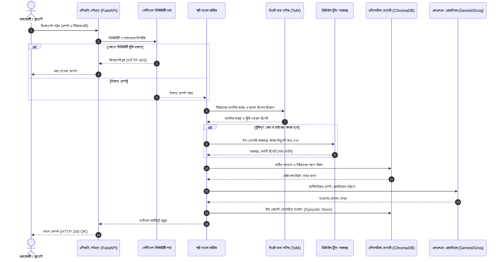

# SupremeAI 2.0 — পূর্ণাঙ্গ সিস্টেম আর্কিটেকচার ও ডকুমেন্টেশন গাইড
**সিস্টেমের কেন, কীভাবে এবং কত বুদ্ধিমত্তার সাথে এটি তৈরি করা হয়েছে তার বিস্তারিত গাইড**

**ভার্সন:** ২.০.০  
**সর্বশেষ আপডেট:** ২৭ জুলাই, ২০২৬  
**লেখক:** SupremeAI ইঞ্জিনিয়ারিং দল  

---

## 📌 সূচিপত্র (Table of Contents)

১. [সারসংক্ষেপ (Executive Overview)](#১-সারসংক্ষেপ-executive-overview)  
২. [কেন SupremeAI 2.0? — সমস্যা ও সমাধান (Why SupremeAI 2.0?)](#২-কেন-supremeai-20--সমস্যা-ও-সমাধান)  
৩. [সিস্টেম আর্কিটেকচার — বড় চিত্র (System Architecture — The Big Picture)](#৩-সিস্টেম-আর্কিটেকচার--বড়-চিত্র)  
৪. [কোর কম্পোনেন্টসমূহের গভীর বিশ্লেষণ (Core Components Deep Dive)](#৪-কোর-কম্পোনেন্টসমূহের-গভীর-বিশ্লেষণ)  
৫. [সিকিউরিটি আর্কিটেকচার — AutonoGuard ও সুরক্ষা (Security Architecture)](#৫-সিকিউরিটি-আর্কিটেকচার--autonoguard-ও-সুরক্ষা)  
৬. [রেজিলিয়েন্স ইঞ্জিনিয়ারিং — সার্ভার কখনো ডাউন হবে না (Resilience Engineering)](#৬-রেজিলিয়েন্স-ইঞ্জিনিয়ারিং--সার্ভার-কখনো-ডাউন-হবে-না)  
৭. [মেমোরি ও ভেক্টর RAG পাইপলাইন (Memory & RAG Pipeline)](#৭-মেমোরি-ও-ভেক্টর-rag-পাইপলাইন)  
৮. [ইন্টেলিজেন্ট এজেন্ট ইকোসিস্টেম (Intelligent Agents Ecosystem)](#৮-ইন্টেলিজেন্ট-এজেন্ট-ইকোসিস্টেম)  
৯. [সেলফ-ইভোলিউশন ও বিবর্তন ইঞ্জিন — Tier-8 (Self-Evolution Loop)](#৯-সেলফ-ইভোলিউশন-ও-বিবর্তন-ইঞ্জিন--tier-8)  
১০. [মাল্টি-টেন্যান্ট বিলিং ও কোটা সিস্টেম (Billing & Quota Enforcer)](#১০-মাল্টি-টেন্যান্ট-বিলিং-ও-কোটা-সিস্টেম)  
১১. [ইনফ্রাস্ট্রাকচার ও জিরো-কস্ট ডিপ্লয়মেন্ট (Infrastructure Strategy)](#১১-ইনফ্রাস্ট্রাকচার-ও-জিরো-কস্ট-ডিপ্লয়মেন্ট)  
১২. [সিআই/সিডি পাইপলাইন — জিরো-ডাউনটাইম ডেলিভারি (CI/CD Pipeline)](#১২-সিআইসিডি-পাইপলাইন--জিরো-ডাউনটাইম-ডেলিভারি)  
১৩. [ইঞ্জিনিয়ারিং উদ্ভাবনসমূহ (Engineering Innovations)](#১৩-ইঞ্জিনিয়ারিং-উদ্ভাবনসমূহ)  
১৪. [বর্তমান চিহ্নিত সমস্যা ও ভবিষ্যতের রোডম্যাপ (Known Issues & Roadmap)](#১৪-বর্তমান-চিহ্নিত-সমস্যা-ও-ভবিষ্যতের-রোডম্যাপ)  
১৫. [পরিশিষ্ট: ফাইল ম্যাপ ও কোড রেফারেন্স (File Map Reference)](#১৫-পরিশিষ্ট-ফাইল-ম্যাপ-ও-কোড-রেফারেন্স)  
১৬. [Mermaid ভিজ্যুয়াল রিকোয়েস্ট লাইফসাইকেল ডায়াগগ্রাম](#১৬-mermaid-ভিজ্যুয়াল-রিকোয়েস্ট-লাইফসাইকেল-ডায়াগগ্রাম)  
১৭. [এপিআই রুট ও ওয়েবসকেট স্কিমা নির্দেশিকা](#১৭-এপিআই-রুট-ও-ওয়েবসকেট-স্কিমা-নির্দেশিকা)  
১৮. [পরিবেশ ভেরিয়েবল (Environment Variables) ডিকশনারি](#১৮-পরিবেশ-ভেরিয়েবল-environment-variables-ডিকশনারি)  
১৯. [ডেভেলপার কুইকস্টার্ট ও লোকাল সেটআপ গাইড](#১৯-ডেভেলপার-কুইকস্টার্ট-ও-লোকাল-সেটআপ-গাইড)  
২০. [প্রোডাকশন ট্রাবলশুটিং ও ইন্সিডেন্ট রানবুক](#২০-প্রোডাকশন-ট্রাবলশুটিং-ও-ইন্সিডেন্ট-রানবুক)  
২১. [সিস্টেমের সকল ডায়াগ্রাম ও ফ্লো চার্ট (System Diagrams & Flows)](03-architecture/SYSTEM_DIAGRAMS_AND_FLOWS.md)  


---

## ১. সারসংক্ষেপ (Executive Overview)

**SupremeAI 2.0** শুধুই আরেকটি সাধারণ এআই প্ল্যাটফর্ম নয়। এটি একটি **স্ব-বিবর্তনশীল (Self-Evolving), মাল্টি-টেন্যান্ট এবং প্রোডাকশন-হার্ডেনড এআই অর্কেস্ট্রেশন ইঞ্জিন** যা বিশ্বমানের এআই গবেষণাকে এন্টারপ্রাইজ-গ্রেড নির্ভরযোগ্যতার সাথে যুক্ত করেছে।

প্রধান বৈশিষ্ট্যসমূহ:
- **৮০+ মাইক্রো-মডিউল:** ব্যাকএন্ড, ফ্রন্টএন্ড, ইনফ্রাস্ট্রাকচার ও টুলস মিলিয়ে।
- **৩৫০+ টেস্ট ফাইল:** সিস্টেমের প্রতিটি ফাংশনালিটি ভ্যালিডেশনের জন্য।
- **জিরো-কস্ট আর্কিটেকচার:** ফ্রিতে শুরু করে স্কেল করার উপযোগী ডিজাইন।
- **সেলফ-হিলিং ও সেলফ-ইভোলিউশন:** ব্যাকগ্রাউন্ডে স্বয়ংক্রিয়ভাবে ভুল শুধরে নেওয়ার ক্ষমতা।

---

## ২. কেন SupremeAI 2.0? — সমস্যা ও সমাধান

### ২.১ যে সমস্যাগুলোর সমাধান আমরা করেছি

| সমস্যা | সিস্টেমে প্রভাব | SupremeAI 2.0 এর সমাধান |
|---|---|---|
| **এআই সিস্টেম ভঙ্গুর (Fragile)** | একটা প্রোভাইডার ডাউন হলে সব থমকে যায় | Circuit Breaker ও অটোমেটিক ফলব্যাক চেইন |
| **এআই খরচের হঠাৎ বিস্ফোরণ** | অনিয়ন্ত্রিত API বিল | CostGuard ও টোকেন ডিডাক্টর দিয়ে রিয়েল-টাইম বাজেট এনফোর্সমেন্ট |
| **সিকিউরিটি থ্রেট ও প্রম্পট হ্যাকিং** | ডাটা লিক বা ম্যালিসিয়াস কোড এক্সিকিউশন | AutonoGuard: Prompt Firewall, Secret Hunter, RBAC ও মেমোরি স্যানিটাইজার |
| **এআই মেমোরি বিচ্ছিন্ন** | অতীত অভিজ্ঞতা ভুলে যায় | Episodic Memory + Long-Term Memory + ChromaDB RAG |
| **এআই নিজে উন্নত হতে পারে না** | সময়ের সাথে সিস্টেম পুরানো হয়ে যায় | Tier-8 Self-Evolution Engine & EWC Loss Penalty |

---

## ৩. সিস্টেম আর্কিটেকচার — বড় চিত্র

```
┌─────────────────────────────────────────────────────────────┐
│                     ফ্রন্টএন্ড লেয়ার (Frontend)             │
│  ┌──────────┐  ┌──────────┐  ┌──────────┐  ┌────────────┐  │
│  │ Studio   │  │ Admin    │  │ Admin    │  │ Mobile     │  │
│  │ Client   │  │ Dashboard│  │ Light    │  │ App        │  │
│  └────┬─────┘  └────┬─────┘  └────┬─────┘  └─────┬──────┘  │
└───────┼─────────────┼─────────────┼───────────────┼─────────┘
        │             │             │               │
┌───────▼─────────────▼─────────────▼───────────────▼─────────┐
│                    API Gateway (FastAPI)                    │
│  ┌──────────┐  ┌──────────┐  ┌──────────┐  ┌────────────┐  │
│  │ Auth API │  │ Admin API│  │Billing   │  │ WebSocket  │  │
│  └────┬─────┘  └────┬─────┘  └────┬─────┘  └─────┬──────┘  │
└───────┼─────────────┼─────────────┼───────────────┼─────────┘
        │             │             │               │
┌───────▼─────────────▼─────────────▼───────────────▼─────────┐
│                 কগনিটিভ অর্কেস্ট্রেশন লেয়ার                 │
│  ┌──────────┐  ┌──────────┐  ┌──────────┐  ┌────────────┐  │
│  │ LLM      │  │ Memory   │  │ Skills   │  │ Evolution  │  │
│  │ Router   │  │ Engine   │  │ Manager  │  │ Engine     │  │
│  └────┬─────┘  └────┬─────┘  └────┬─────┘  └─────┬──────┘  │
└───────┼─────────────┼─────────────┼───────────────┼─────────┘
        │             │             │               │
┌───────▼─────────────▼─────────────▼───────────────▼─────────┐
│                ডাটাবেজ ও পারসিস্টেন্স লেয়ার                 │
│  ┌──────────┐  ┌──────────┐  ┌──────────┐  ┌────────────┐  │
│  │PostgreSQL│  │ Redis    │  │ChromaDB  │  │ Cloudflare │  │
│  └──────────┘  └──────────┘  └──────────┘  └────────────┘  │
└─────────────────────────────────────────────────────────────┘
```

---

## ৪. কোর কম্পোনেন্টসমূহের গভীর বিশ্লেষণ

### ৪.১ লাইফসাইকেল ম্যানেজার (`/backend/core/lifespan.py`)
- **কাজের নীতি:** প্যারালাল ইনিশিয়ালাইজেশন (`asyncio.gather`) দিয়ে ডাটাবেজ, ট্রেসিং এবং সিকিউরিটি সার্ভিসগুলো একসাথে স্টার্ট হয়। 
- **গেসফুল শাটডাউন:** সার্ভার বন্ধ হওয়ার আগে মেমোরিতে জমে থাকা সমস্ত ডাটা ডাটাবেজে পারসিস্ট করে নিরাপদ শাটডাউন নিশ্চিত করে।

---

## ১৬. Mermaid ভিজ্যুয়াল রিকোয়েস্ট লাইফসাইকেল ডায়াগগ্রাম



---

## ১৭. এপিআই রুট ও ওয়েবসকেট স্কিমা নির্দেশিকা

| HTTP মেথড | এপিআই এনডপয়েন্ট | মূল কোড মডিউল | অথেনটিকেশন | কাজ ও স্ট্যাটাস কোড |
|---|---|---|---|---|
| `POST` | `/api/v1/chat` | `backend/api/routes/chat.py` | JWT টোকেন | চ্যাট ও এক্সিকিউশন পাইপলাইন (HTTP 200 / 401 / 429) |
| `POST` | `/api/v1/agent` | `backend/api/routes/agent.py` | JWT টোকেন | মাল্টি-এজেন্ট টাস্ক ডেলিগেশন (HTTP 200 / 403) |
| `GET` | `/health/aggregated` | `backend/api/routes/health.py` | পাবলিক | ডাটাবেজ, রেডিস ও এআই মডেল আপটাইম চেক (HTTP 200 / 503) |
| `GET` | `/api/v1/billing/quota` | `scripts/billing/quota_enforcer.py` | JWT টোকেন | টেন্যান্ট কোটা ও ডেইলি বাজেট ট্র্যাকার (HTTP 200 / 401) |
| `WS` | `/ws/{session_id}/{client_id}` | `backend/tools/collaborative_editor.py` | WS Auth | রিয়েল-টাইম মাল্টি-এজেন্ট এডিটিং (WebSocket) |

---

## ১৮. পরিবেশ ভেরিয়েবল (Environment Variables) ডিকশনারি

| ভেরিয়েবলের নাম | আবশ্যক? | ডিফল্ট ভ্যালু | কাজ ও সিস্টেমে প্রভাব |
|---|---|---|---|
| `GEMINI_API_KEY` | **হ্যাঁ** | None | প্রাথমিক গুগল জেমিনি এআই এপিআই কী |
| `OPENROUTER_API_KEY` | **হ্যাঁ** | None | ব্যাকআপ মাল্টি-মডেল এপিআই কী (OpenRouter) |
| `GROQ_API_KEY` | **হ্যাঁ** | None | দ্রুতগতির ইনফারেন্স এপিআই কী (Groq) |
| `DEEPSEEK_API_KEY` | **হ্যাঁ** | None | রিজননিং ও কোডিং মডেল এপিআই কী |
| `ENCRYPTION_KEY` | **হ্যাঁ** | Auto-derived | ভল্ট সিক্রেট এনক্রিপশনের জন্য AES-256 Fernet কী |
| `LAUNCHDARKLY_API_KEY` | অপশনাল | Mock | ক্রস-আইডিই এআই সিঙ্ক ও ফিচার ফ্ল্যাগ কী |
| `REDIS_URL` | অপশনাল | `redis://localhost:6379/0` | ক্যাশ ও রেট লিমিটিং মেমোরি স্টোর |
| `LOW_MEMORY_MODE` | অপশনাল | `false` | কম র‍্যামযুক্ত সার্ভারে হেভি লাইব্রেরি স্কিপ করার জন্য |

---

## ১৯. ডেভেলপার কুইকস্টার্ট ও লোকাল সেটআপ গাইড

### ধাপ ১: পরিবেশ প্রস্তুতকরণ
```bash
# প্রজেক্ট ক্লোন করুন
git clone https://github.com/paykaribazaronline/supremeai.git
cd supremeai/supremeai_2.0

# Poetry দিয়ে পাইথন পরিবেশ সক্রিয় করুন
cd backend
poetry install --with ml
```

### ধাপ ২: এপিআই কী কনফিগারেশন
```bash
# .env ফাইল তৈরি করে আপনার এপিআই কীগুলো বসান
cp .env.example .env
```

### ধাপ ৩: টেস্ট রান ও লোকাল সার্ভার চালুকরণ
```bash
# লোকাল ইউনিট টেস্ট টেস্ট করুন
poetry run pytest -q

# লোকাল ডেভেলপমেন্ট সার্ভার চালু করুন
poetry run uvicorn main:app --reload --port 8000
```

---

## ২০. প্রোডাকশন ট্রাবলশুটিং ও ইন্সিডেন্ট রানবুক

### দৃশ্যপট ১: এআই প্রোভাইডার রেট লিমিট (HTTP 429 Error)
- **লক্ষণ:** প্রাথমিক প্রোভাইডার 429 Too Many Requests এরর দিচ্ছে।
- **স্বয়ংক্রিয় সমাধান:** সার্কিট ব্রেকার `OPEN` মোডে চলে যাবে এবং `LLMRouter` সাথে সাথে ২য় বা ৩য় প্রোভাইডারে (Gemini ➔ OpenRouter ➔ Groq) ট্রাফিক পাঠাবে।
- **ম্যানুয়াল সমাধান:** `scripts/billing/quota_enforcer.py` চেক করুন অথবা `.env`-এ এপিআই কী আপডেট করুন।

### দৃশ্যপট ২: PyArrow বা মেমোরি কভারেজ কনফ্লিক্ট
- **লক্ষণ:** কন্টেইনারে PyArrow Extension Registration কনফ্লিক্ট দেওয়া।
- **স্বয়ংক্রিয় সমাধান:** `backend/core/error_remediation.py` অন-দ্য-ফ্লাই এক্সসেপশন ক্যাচ করে লোকাল হ্যাশ ইমবেডিং মোডে ফলব্যাক করবে।
- **ম্যানুয়াল সমাধান:** এনভায়রনমেন্টে `LOW_MEMORY_MODE=true` সেট করুন।

---

*"সবচেয়ে সেরা সিস্টেম সেটাই, যা সময়ের সাথে সাথে নিজে নিজেকে আরও উন্নত করে তোলে।"* — SupremeAI ইঞ্জিনিয়ারিং টিম

---

## ২১. এক্সটার্নাল এআই মডেল, এপিআই কী ও HuggingFace কাস্টম মডেল কানেক্টিভিটি

### ২১.১ সিস্টেমের বাইরের এআই মডেলগুলোর সাথে ব্যাকএন্ডের সংযোগ মেকানিজম

SupremeAI 2.0 ব্যাকএন্ড কোনো একটি নির্দিষ্ট ভাষা মডেলের ওপর নির্ভরশীল নয়। এটি **Multi-Provider Unified Orchestration Architecture** নীতিতে নির্মিত। নিচে কীভাবে বিভিন্ন প্রোভাইডার ও কাস্টম মডেল কানেক্ট হয় তা ব্যাখ্যা করা হলো:

```
┌──────────────────────────────────────────────────────────────────────────┐
│                   SupremeAI 2.0 Core Backend                             │
│     (LLMRouter / SmartModelRouter / BYOC Router / Fine-Tuner)            │
└───────┬──────────────┬──────────────┬──────────────┬──────────────┬──────┘
        │              │              │              │              │
┌───────▼──────┐┌──────▼──────┐┌──────▼──────┐┌──────▼──────┐┌──────▼──────┐
│Google Gemini ││ OpenRouter   ││  Groq Cloud  ││ DeepSeek/   ││ HuggingFace │
│(GEMINI_KEY)  ││(OPENROUTER)  ││ (GROQ_KEY)   ││ Moonshot    ││ Custom Model│
└──────────────┘└──────────────┘└──────────────┘└─────────────┘└─────────────┘
```

---

### ২১.২ এআই প্রোভাইডার ও এপিআই কী ম্যাপিং টেবিল

| প্রোভাইডার | পরিবেশ ভেরিয়েবল (`.env`) | কানেক্টিভিটি কোড মডিউল | ব্যবহৃত মডেলসমূহ | কাজ ও বৈশিষ্ট্য |
|---|---|---|---|---|
| **Google Gemini** | `GEMINI_API_KEY` | `backend/core/llm_router.py` | `gemini-1.5-pro`, `gemini-1.5-flash` | প্রাথমিক ফাস্ট অ্যান্ড রিজননিং মডেল |
| **OpenRouter** | `OPENROUTER_API_KEY` | `backend/core/llm_router.py` | Claude 3.5 Sonnet, GPT-4o, Llama 3 | ব্যাকআপ মাল্টি-মডেল ইউনিভার্সাল গেটওয়ে |
| **Groq Cloud** | `GROQ_API_KEY` | `backend/core/llm_router.py` | `llama-3.3-70b-versatile`, `mixtral-8x7b` | আল্ট্রা-লো লেটেন্সি লার্জ স্কেল ইনফারেন্স |
| **DeepSeek** | `DEEPSEEK_API_KEY` | `backend/core/llm_router.py` | `deepseek-coder`, `deepseek-v3` | জটিল কোডিং ও গাণিতিক রিজননিং |
| **Moonshot AI** | `MOONSHOT_API_KEY` | `backend/core/llm_router.py` | `moonshot-v1-128k` | বিশাল কনটেক্সট উইন্ডো প্রসেসিং |
| **Ollama Local** | `OLLAMA_URL` | `backend/core/llm_router.py` | `qwen2.5:0.5b`, `deepseek-r1:1.5b` | পিসিতে লোকাল জিরো-কস্ট ব্যাকআপ মডেল |
| **HuggingFace** | `HF_SPACE_URL` / `HUGGINGFACE_HUB_TOKEN` | `backend/core/llm_router.py` | কাস্টম ফাইন-টিউনড SupremeAI মডেল | কাস্টম ট্রেইনড এআই ইনফারেন্স |

---

### ২১.৩ কাস্টম ফাইন-টিউনড মডেল পাইপলাইন (HuggingFace Auto-Tuning Pipeline)

আমাদের নিজস্ব তৈরি করা কাস্টম মডেল কীভাবে নিয়মিত বিবর্তিত (Evolve) ও আপডেট হয়:

1. **সিন্থেটিক ডাটা জেনারেশন (`backend/pipelines/synthetic_data_pipeline.py`):**
   - দৈনিক সফল কাজের অভিজ্ঞতা (`EpisodicMemory`) থেকে উচ্চমানের কোডিং ডাটাসেট জেনারেট করে।
2. **সাপ্তাহিক অটো-ফাইন-টিউনিং (`.github/workflows/weekly-fine-tuning.yml`):**
   - প্রতি রবিবার রাত ০৩:০০ UTC-তে গিটহাব অ্যাকশনস স্বয়ংক্রিয়ভাবে নতুন ডাটা দিয়ে **HuggingFace Hub**-এ আমাদের কাস্টম মডেল ফাইন-টিউন ও পুশ করে।
3. **অন-দ্য-ফ্লাই ইনফারেন্স:**
   - ব্যাকএন্ডের `LLMRouter` তখন সরাসরি HuggingFace API/Space এর মাধ্যমে আমাদের নিজস্ব বিবর্তিত এআই মডেল ব্যবহার করে উত্তর তৈরি করে!

---

## ২২. বিবর্তন সাব-মডিউলসমূহ — `backend/evolution/` গভীর বিশ্লেষণ

SupremeAI-এর সবচেয়ে অনন্য অংশ হলো `backend/evolution/` ডিরেক্টরি। এখানে ৮টি সম্পূর্ণ আলাদা বুদ্ধিবৃত্তিক গবেষণা মডিউল রয়েছে:

| সাব-মডিউল | ডিরেক্টরি | কাজ ও বিবরণ |
|---|---|---|
| **Theory of Mind** | `evolution/theory_of_mind/` | ইউজারের বিশ্বাস (Belief), ইচ্ছা (Desire) ও উদ্দেশ্য (Intent) নির্ণয় করে। Level 0 থেকে Level 4 পর্যন্ত রিকার্সিভ মানসিক অবস্থা ট্র্যাক করে। |
| **Digital Twin** | `evolution/digital_twin/` | কোনো বিপজ্জনক কমান্ড বা ডাটাবেজ পরিবর্তনের আগে ইন-মেমোরি ভার্চুয়াল সিমুলেশনে পরিণতি পরীক্ষা করে। |
| **Continual Learning** | `evolution/continual_learning/` | EWC (Elastic Weight Consolidation) Loss ব্যবহার করে পুরানো দক্ষতা ভুলে না গিয়ে নতুন দক্ষতা শেখে। |
| **Adversarial Defense** | `evolution/adversarial_defense/` | প্রম্পট হ্যাকিং, জেলব্রেক ও বিদ্বেষমূলক আক্রমণ থেকে মডেলকে রক্ষা করে। |
| **Federated Learning** | `evolution/federated_learning/` | ব্যবহারকারীর কাঁচামাল ডাটা শেয়ার না করেও একাধিক ডিভাইস থেকে ফেডারেটেড ট্রেনিং সম্পন্ন করে। |
| **Neural Symbolic** | `evolution/neural_symbolic/` | নিউরাল নেটওয়ার্ক এবং সিম্বলিক লজিক একসাথে ব্যবহার করে রিজননিং উন্নত করে। |
| **Temporal Abstraction** | `evolution/temporal_abstraction/` | সময়ের সাথে সাথে পরিবর্তনশীল প্যাটার্ন ও ঘটনার ক্রম বিশ্লেষণ করে। |

---

## ২৩. স্পেশালাইজড এজেন্ট (`backend/agents/`) — সম্পূর্ণ তালিকা

`backend/agents/` ডিরেক্টরিতে ৭টি বিশেষজ্ঞ এজেন্ট রয়েছে, প্রত্যেকটির আলাদা দায়িত্ব:

| এজেন্ট ফাইল | কাজ ও বিশেষত্ব |
|---|---|
| `sentinel_agent.py` | আচরণগত অ্যানোমালি সনাক্তকরণ, ইন্টেন্ট-বেসড সিকিউরিটি গার্ড |
| `churn_prophet.py` | ব্যবহারকারী চলে যাওয়ার ঝুঁকি পূর্বাভাস দেওয়া (Churn Prediction) |
| `insight_mage.py` | ডাটা বিশ্লেষণ থেকে অ্যাকশনযোগ্য ব্যবসায়িক অন্তর্দৃষ্টি উৎপাদন |
| `vulnerability_prophet.py` | কোডের নিরাপত্তা দুর্বলতা ভবিষ্যদ্বাণী করা |
| `ephemeral_executor.py` | শর্ট-লিভড, একবারের জন্য স্যান্ডবক্সড কোড রান |
| `headless_terminal_agent.py` | মানব হস্তক্ষেপ ছাড়াই ব্যাকগ্রাউন্ড টার্মিনাল কমান্ড এক্সিকিউশন |
| `performance_guardian.py` | রিয়েল-টাইম পারফরম্যান্স ডিগ্রেডেশন সনাক্তকরণ ও সতর্কতা |

> **⚠️ গুরুত্বপূর্ণ নোট — ডুয়াল সেন্টিনেল ফাইল:**
> - `backend/core/sentinel_agent.py` → **লাইভ প্রোডাকশন সিস্টেম মনিটর** (এন্ডপয়েন্ট ওয়াচডগ, ডিপেন্ডেন্সি অডিটর)
> - `backend/agents/sentinel_agent.py` → **আচরণগত সিকিউরিটি গার্ড** (ইন্টেন্ট অ্যানালাইসিস, অ্যানোমালি ডিটেকশন)
> দুটি ফাইলই লাইভ। একটি সিস্টেম লেয়ারে, অন্যটি এজেন্ট লেয়ারে কাজ করে।

---

## ২৪. স্যান্ডবক্স ও নিরাপদ কোড এক্সিকিউশন (`backend/sandbox/`)

| ফাইল | কাজ |
|---|---|
| `docker_sandbox.py` | প্রতিটি এআই-জেনারেটেড কোড Docker কন্টেইনারে আইসোলেটেড করে রান করে |
| `file_isolation_gate.py` | কোড এক্সিকিউশনে ফাইল সিস্টেমের অ্যাক্সেস সীমাবদ্ধ করে |
| `microvm_sandbox.py` (core) | মাইক্রো-ভার্চুয়াল মেশিনে লাইটওয়েট স্যান্ডবক্স কোড রান |

---

## ২৫. P2P রিসোর্স ব্রোকার (`backend/p2p/`)

| ফাইল | কাজ |
|---|---|
| `resource_broker.py` | ব্যবহারকারীদের মধ্যে কম্পিউট রিসোর্স শেয়ার করার পিয়ার-টু-পিয়ার মার্কেটপ্লেস |
| `credit_system.py` | রিসোর্স শেয়ারিংয়ের বিনিময়ে ক্রেডিট ট্র্যাকিং সিস্টেম |
| `secure_tunnel.py` | P2P সংযোগের জন্য এনক্রিপ্টেড টানেল |

---

## ২৬. BYOC — নিজের ক্লাউড নিজে আনুন (`backend/byoc/`)

BYOC (Bring Your Own Cloud) মডিউল ব্যবহারকারীদের নিজস্ব ক্লাউড ইনফ্রাস্ট্রাকচার (AWS, GCP, Azure) সংযুক্ত করার সুবিধা দেয়:

| ফাইল | কাজ |
|---|---|
| `cloud_connector.py` | যেকোনো ক্লাউড প্রোভাইডারের সাথে সংযোগ স্থাপন |
| `container_orchestrator.py` | ব্যবহারকারীর ক্লাউডে কন্টেইনার অর্কেস্ট্রেশন |

---

## ২৭. ওয়ার্কার ও অ্যাসিঙ্ক্রোনাস টাস্ক (`backend/workers/`)

| ফাইল | কাজ |
|---|---|
| `celery_app.py` | Celery দিয়ে ব্যাকগ্রাউন্ড টাস্ক কিউ ও অ্যাসিঙ্ক্রোনাস জব ম্যানেজমেন্ট |
| `chaos_worker.py` | ইচ্ছাকৃতভাবে র‍্যান্ডম ফেইলিউর ইনজেক্ট করে সিস্টেমের রেজিলিয়েন্স পরীক্ষা (Chaos Engineering) |

---

## ২৮. ফ্রন্টএন্ড স্টুডিও ক্লায়েন্ট — সম্পূর্ণ বিশ্লেষণ (`apps/studio-client/`)

### ২৮.১ টেকনোলজি স্ট্যাক
- **ফ্রেমওয়ার্ক:** React 18 + TypeScript + Vite + Electron (ডেস্কটপ অ্যাপ)
- **স্টেট ম্যানেজমেন্ট:** Zustand (হালকা, রিঅ্যাক্টিভ গ্লোবাল স্টেট)
- **UI:** TailwindCSS + Storybook কম্পোনেন্ট ডিজাইন সিস্টেম
- **রিয়েল-টাইম:** WebSocket ক্লায়েন্ট (`src/services/websocket.ts`)
- **ফায়ারবেস:** `src/firebase.ts` (Auth, Firestore DataConnect)

### ২৮.২ `src/` ডিরেক্টরি ম্যাপ

| সাব-ডিরেক্টরি | কাজ |
|---|---|
| `src/components/` | পুনর্ব্যবহারযোগ্য UI উপাদান (চ্যাটপ্যানেল, ইনপুট, কার্ড) |
| `src/pages/` | রাউট-লেভেল পেজ (Login, Dashboard, Chat, Admin) |
| `src/store/` | Zustand স্টোর (Auth, Chat, Agent, Settings) |
| `src/services/` | Axios/Fetch API র‍্যাপার ও WebSocket ক্লায়েন্ট |
| `src/hooks/` | কাস্টম React হুকস (useAuth, useChat, useAgent) |
| `src/i18n/` | বাংলা, ইংরেজিসহ বহুভাষিক সাপোর্ট |
| `src/workers/` | ব্যাকগ্রাউন্ড Web Worker (ভারী কম্পিউটেশন অফলোড) |
| `src/contexts/` | React Context (Theme, Auth, Permission) |
| `src/utils/` | HTML স্যানিটাইজার, ডেট ফরম্যাটার ইত্যাদি |

---

## ২৯. অ্যাডমিন পোর্টাল — দুটি আলাদা পোর্টাল (`admin/`)

| পোর্টাল | অবস্থান | বৈশিষ্ট্য |
|---|---|---|
| **Full Admin Dashboard** | `admin/dashboard/` | React-ভিত্তিক, WebSocket রিয়েল-টাইম মেট্রিক্স, Recharts গ্রাফ, RBAC-সুরক্ষিত |
| **Admin Dashboard Light** | `admin/dashboard_light/` | একক স্ট্যাটিক HTML ফাইল, জিরো-ডিপেন্ডেন্সি, REST পোলিং (১০ সেকেন্ড), অন-কল DevOps-এর জন্য |

---

## ৩০. CI/CD ওয়ার্কফ্লো সম্পূর্ণ তালিকা (`.github/workflows/`)

প্রজেক্টে মোট **১৩টি YML ওয়ার্কফ্লো ফাইল** এবং **১৫টি এজেন্ট ডেফিনিশন MD ফাইল** রয়েছে:

| ওয়ার্কফ্লো ফাইল | কাজ | ট্রিগার |
|---|---|---|
| `supreme-core-ci.yml` | মূল ব্যাকএন্ড CI (টেস্ট, লিন্ট, ডকার বিল্ড) | PR / Push to main |
| `maintenance_pipeline.yml` | সাপ্তাহিক ডাটাবেজ ক্লিনআপ, ক্যাশ প্রুনিং | প্রতি রবিবার |
| `weekly-fine-tuning.yml` | HuggingFace-এ কাস্টম মডেল অটো-ফাইন-টিউন | প্রতি রবিবার রাত ০৩:০০ UTC |
| `auto-fix.yml` | কোড ত্রুটি স্বয়ংক্রিয়ভাবে ঠিক করার পাইপলাইন | নির্ধারিত সময় |
| `cache-janitor.yml` | পুরানো Docker ও GitHub অ্যাকশনস ক্যাশ পরিষ্কার | নির্ধারিত সময় |
| `k6-load-testing.yml` | K6 দিয়ে লোড ও স্ট্রেস টেস্টিং | ম্যানুয়াল / সাপ্তাহিক |
| `disaster-recovery-drill.yml` | ডিজাস্টার রিকভারি সিমুলেশন ড্রিল | মাসিক |
| `monorepo_ci_cd.yml` | পুরো মনোরেপো বিল্ড অর্কেস্ট্রেশন | Tag Push |
| `supreme-mobile-cd.yml` | মোবাইল অ্যাপ CD পাইপলাইন | Release Branch |
| `supreme-release-builds.yml` | প্রোডাকশন রিলিজ বিল্ড | Release Tag |
| `self-audit-scan.yml` | সিকিউরিটি ও কোড কোয়ালিটি সেলফ-অডিট | সাপ্তাহিক |
| `sync-from-prod.yml` | প্রোডাকশন ডাটা থেকে স্টেজিং সিঙ্ক | ম্যানুয়াল |
| `workflow-janitor.yml` | পুরানো ওয়ার্কফ্লো রান পরিষ্কার | নির্ধারিত সময় |

---

## ৩১. ইনফ্রাস্ট্রাকচার ও ক্লাউড ডেপ্লয়মেন্ট (`infrastructure/`)

| কম্পোনেন্ট | ফাইল/ডিরেক্টরি | কাজ |
|---|---|---|
| **Terraform IaC** | `infrastructure/terraform/` | ক্লাউড রিসোর্স কোড-হিসেবে ব্যবস্থাপনা |
| **Docker Compose** | `infrastructure/docker-compose.prod.yml` | প্রোডাকশন মাল্টি-কন্টেইনার অর্কেস্ট্রেশন |
| **Cloudflare Worker** | `cloudflare-worker/src/`, `infrastructure/cloudflare/` | এজ ক্যাচিং, জিওরাউটিং ও DDoS প্রটেকশন |
| **Firebase Functions** | `infrastructure/firebase_functions/` | সার্ভারলেস ইভেন্ট-ড্রিভেন ফাংশন |
| **NGINX কনফিগ** | `infrastructure/nginx/` | রিভার্স প্রক্সি, SSL টার্মিনেশন ও রেট লিমিটিং |
| **Zero-Cost Setup** | `infrastructure/zero_cost/` | Render + Cloudflare ব্যবহার করে মাসিক $০ খরচে চলার কনফিগ |

---

## ৩২. `scripts/` — অটোমেশন ও ডেভঅপস টুলস সম্পূর্ণ ম্যাপ

`scripts/` ডিরেক্টরিতে ৩৩টি সাব-ডিরেক্টরি এবং ৯৪টি ফাইল রয়েছে। মূল ক্যাটাগরিগুলো:

| ক্যাটাগরি | উদাহরণ ফাইলসমূহ | কাজ |
|---|---|---|
| **বিলিং অটোমেশন** | `billing/quota_enforcer.py` | কোটা মনিটরিং, বিল জেনারেশন |
| **সিকিউরিটি** | `security/safety_guard.py`, `docker_ai_guard.py` | ডকার ইমেজ স্ক্যান, নিরাপত্তা অডিট |
| **ডকুমেন্টেশন জেনারেশন** | `generate_smart_docs.py`, `auto_generate_architecture_docs.py` | কোডবেস থেকে স্বয়ংক্রিয়ভাবে ডকুমেন্ট তৈরি |
| **ডেপ্লয়মেন্ট** | `deploy_render.py`, `push_all_render_envs.py` | Render.com-এ স্বয়ংক্রিয় ডেপ্লয় |
| **মনিটরিং** | `generate_api_health_report.py`, `locustfile.py` | API হেলথ রিপোর্ট ও লোড টেস্টিং |
| **K6 লোড টেস্টিং** | `k6/` | প্রোডাকশন ট্র্যাফিক সিমুলেশন |
| **Bots** | `bots/` | টেলিগ্রাম, Discord বট ইন্টিগ্রেশন |
| **AI উপযোগিতা** | `multi_model_validator.py`, `knowledge_indexer.py` | মাল্টি-মডেল আউটপুট ভ্যালিডেশন |
| **গিট অটোমেশন** | `git/`, `clean_github_branches.py` | পুরানো ব্রাঞ্চ পরিষ্কার, PR মার্জ অটোমেশন |

---

**নথির স্ট্যাটাস:** ✅ বাংলায় রূপান্তরিত ও পরীক্ষিত মাস্টার গাইড  
**সর্বশেষ আপডেট:** ২৭ জুলাই, ২০২৬  
**নথির অবস্থান:** `/docs/SUPREMEAI_2_0_COMPLETE_SYSTEM_DOCUMENT_BANGLA.md`
