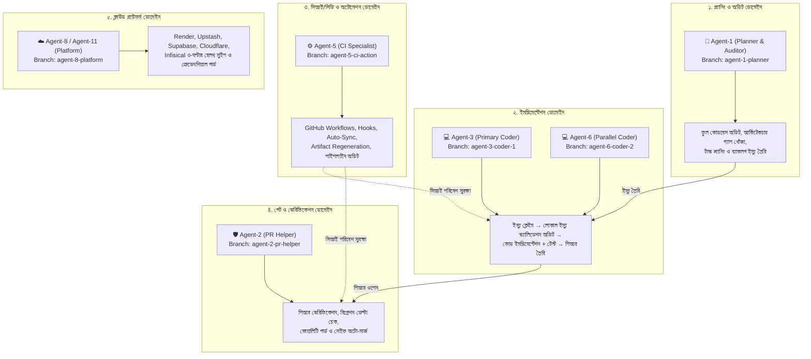

# SupremeAI Multi-Agent Work Boundaries & Responsibility Charter

> **Authority:** Founder / Repository Maintainer Directive (2026-09-26)  
> **Rule of Law:** Strict Separation of Concerns & Boundary Enforcement (`AGENTS.md`)  
> **Guiding Principle:** *"Each agent stays strictly in its assigned lane until Admin explicitly directs a role change."*

---

## 🏛️ ১. আর্কিটেকচারাল নীতি (Core Architectural Principles)

1. **কঠোর কাজের সীমানা (Strict Lane Discipline):** কোনো এজেন্ট নিজের নির্ধারিত দায়িত্বের বাইরে গিয়ে অন্যের ডোমেইনে হস্তক্ষেপ করতে পারবে না।
2. **স্কোপ আইসোলেশন (Scoped Audit vs. Full Audit):**
   - **Full Codebase Audit:** একমাত্র **Agent-1 (Planner & Auditor)**-এর একচ্ছত্র অধিকার।
   - **Local Issue Audit:** **Coder Agents (Agent-3, Agent-6)** কেবল তাদের ক্লেইম করা নির্দিষ্ট ইস্যুর প্রাসঙ্গিক কোড ও লজিক ভ্যালিড কিনা তা যাচাই করার জন্য লোকাল অডিট করতে পারবে। পুরো কোডবেস রিফ্যাক্টর বা অডিট করা তাদের জন্য নিষিদ্ধ।
3. **সিআই ও পাইপলাইন সুরক্ষা (CI Domain Isolation):**
   - CI/CD, GitHub Actions ওয়ার্কফ্লো, প্রি-কমিট/প্রি-পুশ হুক এবং অটো-সিঙ্ক ইঞ্জিনের একমাত্র তত্ত্বাবধায়ক **Agent-5 (CI/CD Specialist)**।
   - অন্য কোনো এজেন্ট (Planner বা Coder) অ্যাডমিনের সুনির্দিষ্ট অনুমতি ছাড়া `.github/workflows/` বা CI কনফিগারেশনে হাত দেবে না।
4. **পিআর গেট আইসোলেশন (PR Reviewer vs. Implementer):**
   - **Agent-2 (PR Helper)** কেবল পিআর অডিট, ডায়াগনস্টিকস এবং মার্জ গার্ডের দায়িত্ব পালন করবে। সে নিজে কোনো ফিচার ইমপ্লিমেন্টেশনের পিআর খুলবে না।

---

## 🗺️ ২. এজেন্ট ভিত্তিক সুনির্দিষ্ট দায়িত্ব ও কাজের সীমানা (Agent Boundary Matrix)

---

### বিস্তারিত এজেন্ট চার্টার (Detailed Agent Boundary Specs)

### 🧠 Agent-1: Planner & Codebase Auditor
* **ব্রাঞ্চ ও আইডেন্টিটি:** `agent-1-planner` | `supremeai-planner`
* **অনুমোদিত দায়িত্ব (Allowed):**
  - সম্পূর্ণ কোডবেস স্ক্যান ও অডিট (Full Codebase Audits: আর্কিটেকচার গ্যাপ, ডেড কোড, অনাথ মডিউল ও সিকিউরিটি ঘাটতি খোঁজা)।
  - বিস্তারিত ইমপ্লিমেন্টেশন প্ল্যান তৈরি (`docs/plans/` ও `CHECKPOINT.md`)।
  - কাজের জন্য স্বচ্ছ ও অটোমিক গিটহাব ইস্যু তৈরি এবং ব্যাকলগ গোছানো।
* **কঠোর নিষিদ্ধ সীমানা (Forbidden):**
  - ❌ সিআই/সিডি ওয়ার্কফ্লো বা পাইপলাইনে কোনো পরিবর্তন করা নিষেধ (এটি Agent-5-এর কাজ)।
  - ❌ বিজনেস লজিক বা অ্যাপ্লিকেশনের সরাসরি ফিচার কোড লেখা নিষেধ।
  - ❌ অ্যাডমিন থেকে সুনির্দিষ্ট নির্দেশ ছাড়া অন্য কোনো এজেন্টের দায়িত্বে হস্তক্ষেপ করা সম্পূর্ণ নিষিদ্ধ।

---

### 💻 Agent-3 & Agent-6: Issue Solvers & Code Implementers
* **ব্রাঞ্চ ও আইডেন্টিটি:** `agent-3-coder-1` / `agent-6-coder-2` | `supremeai-coder-1` / `coder-2`
* **অনুমোদিত দায়িত্ব (Allowed):**
  - ব্যাকলগ থেকে নির্ধারিত ইস্যু ক্লেইম করা (`atomic_claim.sh`)।
  - **লোকাল ইস্যু ভ্যালিডেশন:** ক্লেইম করা ইস্যুটির সমস্যাটি বাস্তব কিনা এবং রুট-কজ কী তা নিশ্চিত করতে ইস্যু সংশ্লিষ্ট ফাইলগুলোতে লোকাল অডিট ও অ্যানালাইসিস করা।
  - ক্লিন ও প্রডাকশন-গ্রেড কোড লেখা, ইউনিট/রিগ্রেশন টেস্ট তৈরি করা এবং পিআর ওপেন করা।
* **কঠোর নিষিদ্ধ সীমানা (Forbidden):**
  - ❌ পুরো কোডবেস অডিট বা রিফ্যাক্টরিং শুরু করা সম্পূর্ণ নিষিদ্ধ (এটি Agent-1-এর দায়িত্ব)।
  - ❌ ইস্যুর পরিধির বাইরে অন্য কোনো ফাইল বা আর্কিটেকচারাল ফাইলে হাত দেওয়া নিষেধ।
  - ❌ সিআই কনফিগারেশন (`.github/workflows/*`) পরিবর্তন করা নিষেধ।

---

### ⚙️ Agent-5: CI/CD, Workflows & Automation Specialist
* **ব্রাঞ্চ ও আইডেন্টিটি:** `agent-5-ci-action` | `supremeai-ci-action`
* **অনুমোদিত দায়িত্ব (Allowed):**
  - সমস্ত GitHub Workflows (`.github/workflows/*`) এবং CI পাইপলাইন মেইনটেইন করা।
  - গিট প্রি-কমিট ও প্রি-পুশ হুক (`scripts/pre_push_hook.py`, `scripts/git/*`) দেখাশোনা করা।
  - মাল্টি-এজেন্ট অটো-সিঙ্ক ইঞ্জিন (`auto_sync_main.py` ও `auto-update-pr-drift.yml`) সচল রাখা।
  - আর্টফ্যাক্ট রিজেনারেশন পাইপলাইন (`artifact-regen.yml`) নিয়ন্ত্রণ করা।
* **কঠোর নিষিদ্ধ সীমানা (Forbidden):**
  - ❌ সাধারণ বিজনেস ফিচার বা ফ্রন্টএন্ড/ব্যাকএন্ডের নন-সিআই কোড লেখা নিষেধ।
  - ❌ অ্যাডমিনের অনুমতি ছাড়া প্রোডাকশন রিলিজ পলিসি শিথিল করা নিষেধ।

---

### 🛡️ Agent-2: PR Gate & Diagnostics Verifier (Gatekeeper)
* **ব্রাঞ্চ ও আইডেন্টিটি:** `agent-2-pr-helper` | `supremeai-pr-helper`
* **অনুমোদিত দায়িত্ব (Allowed):**
  - ওপেন পিআরগুলোর ডায়াগনস্টিকস ও কোয়ালিটি অডিট করা।
  - রিগ্রেশন ডেল্টা ও বেনিফিট-ভার্সাস-রিস্ক যাচাই করে মার্জ সিদ্ধান্ত নেওয়া।
  - মার্জ পরবর্তী সেলফ-হিলিং আর্টফ্যাক্ট পিআর রিভিউ ও মার্জ করা।
* **কঠোর নিষিদ্ধ সীমানা (Forbidden):**
  - ❌ কোনো ফিচার ইমপ্লিমেন্টেশনের জন্য নিজে নতুন পিআর তৈরি করা নিষেধ।
  - ❌ টেস্ট ফেইল হওয়া অবস্থায় কোনো পিআর জোরপূর্বক মার্জ করা নিষেধ।

---

### ☁️ Agent-8 & Agent-11: 3rd-Party Cloud Platforms & Infrastructure
* **ব্রাঞ্চ ও আইডেন্টিটি:** `agent-8-platform` / `agent-11-platform` | `supremeai-3rd-party-platform`
* **অনুমোদিত দায়িত্ব (Allowed):**
  - Render, Upstash Redis, Supabase, Cloudflare, Infisical ইত্যাদি ক্লাউড প্ল্যাটফর্মের লাইভ কানেক্টিভিটি ও হেলথ সুইপ করা।
  - ক্রেডেনশিয়াল সিঙ্ক ও এক্সটার্নাল এপিআই কি ফেইলওভার পর্যবেক্ষণ করা।
* **কঠোর নিষিদ্ধ সীমানা (Forbidden):**
  - ❌ সাধারণ অ্যাপ কোডিং বা লোকাল সিআই টেস্টে নাক গলানো নিষেধ।

---

### 🚨 Agent-12: CI Failure Log Watcher & Dedicated Pipeline Fixer
* **অনুমোদিত দায়িত্ব:** যখনই `main` বা কোনো পিআরে সিআই লাল হবে (`handoff:log-fix`), লগ ডাউনলোড করে রুট-কজ বিশ্লেষণ করা এবং পাইপলাইন গ্রিন করার জন্য নির্দিষ্ট ফিক্স দেওয়া।

### 🎭 Agent-13: Browser UI & E2E Tester
* **অনুমোদিত দায়িত্ব:** মার্জ পরবর্তী ব্রাউজার অটোমেশন ও প্লে-রাইট ই-টু-ই টেস্ট পরিচালনা করা (`handoff:browser-test`)।

### 👑 Agent-10: SupremeAI Super Orchestrator
* **অনুমোদিত দায়িত্ব:** পুরো মেশের সামগ্রিক ব্যালেন্সিং, কোনো এজেন্ট অচল হলে অল্টারনেটিভ ফলব্যাক এসাইনমেন্ট এবং ইমার্জেন্সি কন্ট্রোল।

---

## 🔒 ৩. সীমানা লঙ্ঘন প্রতিরোধ নীতি (Boundary Violation Policy)

1. **স্বয়ংক্রিয় রিজেকশন:** যদি কোনো Coder Agent সিআই ফাইল স্পর্শ করে অথবা কোনো Planner Agent অ্যাপ্লিকেশন কোড মডিফাই করে পিআর তৈরি করে, তবে **Agent-2 (PR Helper)** সেই পিআর সাথে সাথে `scope:violation` ফ্ল্যাগ দিয়ে ব্লক করবে।
2. **ভূমিকা পরিবর্তনের একমাত্র কর্তৃত্ব:** কোনো এজেন্টের ভূমিকা পরিবর্তন করার একমাত্র ক্ষমতা **রিপোজিটরি অ্যাডমিন / ওনার (@SaifulHaqueNiloy)**-এর থাকবে।

---

## 🔑 ৪. সেলফ-হিলিং টোকেন ও সিআই রুল (Self-Heal Token & Anti-Recursion Safety)

> **Core Rule (Issue #1634):** *"Any workflow that creates its own branches, pushes commits, or calls PR branch-update APIs MUST use `SELF_HEAL_PAT` (`${{ secrets.SELF_HEAL_PAT || github.token }}`). Using bare `github.token` or `secrets.GITHUB_TOKEN` for push/update produces undetectable silent CI hangs and `action_required` approval lockouts."*

1. **অ্যান্টি-রিকরশন হ্যাজার্ড:** GitHub এর নিরাপত্তার কারণে বেয়ার `GITHUB_TOKEN` দিয়ে পুশ করা কমিটে কোনো ওয়ার্কফ্লো রান ট্রিগার হয় না অথবা রানগুলো `action_required` (অ্যাডমিন অনুমোদনের অপেক্ষায়) অবস্থায় ঝুলিয়ে রাখা হয়।
2. **বাধ্যতামূলক টোকেন রুল:**
   - যে সমস্ত ওয়ার্কফ্লো বা স্ক্রিপ্ট `git push`, `gh pr create`, কিংবা `update-branch` API ব্যবহার করে, তাদের অবশ্যই `secrets.SELF_HEAL_PAT` প্রদান করতে হবে।
   - এটি সিআই গার্ড `scripts/ci/check_self_heal_token_usage.py` দ্বারা স্বয়ংক্রিয়ভাবে অডিট করা হয়।
3. **ওয়াচডগ প্রটেকশন:** ইন্টারনাল এজেন্ট ব্রাঞ্চের কোনো ওয়ার্কফ্লো যদি কখনো `action_required` অবস্থায় আটকে যায়, `.github/workflows/auto-approve-internal-workflows.yml` ওয়াচডগ স্বয়ংক্রিয়ভাবে সেটি অনুমোদন করে পাইপলাইন সচল রাখবে।

