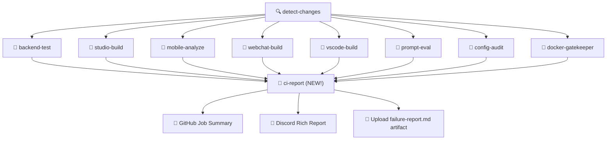

# 🧠 Smart CI Failure Auto-Report System

## সমস্যা কী?

আপনার `supreme-ci.yml`-এ ১৩টি job আছে। যখন multiple job fail হয়, তখন:
- ❌ প্রতিটা failed job-এ click করে log দেখতে হয়
- ❌ কোন step-এ fail হয়েছে তা manually খুঁজতে হয়
- ❌ error message extract করতে সময় নষ্ট হয়
- ❌ Discord notification-এ শুধু "CI failed" বলে, কিন্তু **কী fail হয়েছে** বলে না

## সমাধান: 3-Layer Smart Report System

### 🏗️ Architecture



### Layer 1: GitHub Job Summary (GITHUB_STEP_SUMMARY)
- Run tab-এ সরাসরি summary দেখা যাবে
- প্রতিটা failed job-এর নাম, কারণ, ও link থাকবে
- কোনো extra click ছাড়াই পুরো picture

### Layer 2: Discord Rich Embed
- আপনার existing Discord notification upgrade করা হবে
- শুধু "CI failed" না বলে, **কোন কোন job fail হয়েছে** সেটা বলবে
- Color-coded embed: 🔴 failed, 🟢 passed, ⚪ skipped

### Layer 3: Failure Report Artifact
- `failure-report.md` file আপনার run-এর artifacts-এ download করা যাবে
- ভবিষ্যতে তুলনা করার জন্য useful

---

## Proposed Changes

### [MODIFY] [supreme-ci.yml](file:///c:/Users/n/supremeai/supremeai_2.0/.github/workflows/supreme-ci.yml)

বর্তমান `notify` job (line 875-917) কে সম্পূর্ণ rewrite করা হবে `ci-report` job হিসেবে:

#### পরিবর্তন ১: notify job → ci-report job (Enhanced)

```yaml
  ci-report:
    name: 📊 CI Report & Notify
    runs-on: ubuntu-latest
    needs: [backend-test, setup-js, studio-build, mobile-analyze, 
            webchat-build, vscode-build, prompt-eval, deploy-backend,
            deploy-studio, deploy-webchat, staging-dispatch, 
            config-audit, docker-gatekeeper]
    if: always()
    steps:
      - name: 📊 Generate Smart CI Report
        id: report
        run: |
          # ── Collect all job results ──
          declare -A JOBS=(
            ["🐍 Backend Tests"]="${{ needs.backend-test.result }}"
            ["🏗️ JS Setup"]="${{ needs.setup-js.result }}"
            ["🎨 Studio Build"]="${{ needs.studio-build.result }}"
            ["📱 Mobile Analysis"]="${{ needs.mobile-analyze.result }}"
            ["💬 WebChat Build"]="${{ needs.webchat-build.result }}"
            ["🧩 VS Code Build"]="${{ needs.vscode-build.result }}"
            ["🧪 Prompt Eval"]="${{ needs.prompt-eval.result }}"
            ["🚀 Deploy Backend"]="${{ needs.deploy-backend.result }}"
            ["🌐 Deploy Studio"]="${{ needs.deploy-studio.result }}"
            ["💬 Deploy WebChat"]="${{ needs.deploy-webchat.result }}"
            ["📡 Staging Dispatch"]="${{ needs.staging-dispatch.result }}"
            ["🔐 Config Audit"]="${{ needs.config-audit.result }}"
            ["🐳 Docker Gatekeeper"]="${{ needs.docker-gatekeeper.result }}"
          )

          FAILED_JOBS=""
          PASSED_JOBS=""
          SKIPPED_JOBS=""
          FAILED_COUNT=0
          PASSED_COUNT=0
          SKIPPED_COUNT=0

          for job_name in "${!JOBS[@]}"; do
            result="${JOBS[$job_name]}"
            case "$result" in
              failure)
                FAILED_JOBS+="| ❌ | **${job_name}** | \`failure\` |"$'\n'
                FAILED_COUNT=$((FAILED_COUNT + 1))
                ;;
              success)
                PASSED_JOBS+="| ✅ | ${job_name} | \`success\` |"$'\n'
                PASSED_COUNT=$((PASSED_COUNT + 1))
                ;;
              *)
                SKIPPED_JOBS+="| ⏭️ | ${job_name} | \`${result:-skipped}\` |"$'\n'
                SKIPPED_COUNT=$((SKIPPED_COUNT + 1))
                ;;
            esac
          done

          # ── Determine overall status ──
          if [ "$FAILED_COUNT" -gt 0 ]; then
            OVERALL="❌ FAILED"
            OVERALL_EMOJI="🔴"
          else
            OVERALL="✅ ALL PASSED"
            OVERALL_EMOJI="🟢"
          fi

          # ── Write to GitHub Step Summary ──
          RUN_URL="${{ github.server_url }}/${{ github.repository }}/actions/runs/${{ github.run_id }}"
          {
            echo "# ${OVERALL_EMOJI} SupremeAI CI/CD Report"
            echo ""
            echo "**Branch:** \`${{ github.ref_name }}\` | **Commit:** \`${{ github.sha | truncate: 7 }}\` | **Triggered by:** \`${{ github.actor }}\`"
            echo ""
            echo "## 📊 Summary: ${OVERALL}"
            echo "| ✅ Passed | ❌ Failed | ⏭️ Skipped |"
            echo "|-----------|-----------|------------|"
            echo "| ${PASSED_COUNT} | ${FAILED_COUNT} | ${SKIPPED_COUNT} |"
            echo ""
            
            if [ "$FAILED_COUNT" -gt 0 ]; then
              echo "## 🔴 Failed Jobs (Action Required!)"
              echo "| Status | Job | Result |"
              echo "|--------|-----|--------|"
              echo "$FAILED_JOBS"
              echo ""
              echo "> [!CAUTION]"
              echo "> **${FAILED_COUNT} job(s) failed!** Click the job names in the sidebar for detailed logs."
              echo ""
            fi

            if [ "$PASSED_COUNT" -gt 0 ]; then
              echo "<details><summary>✅ Passed Jobs (${PASSED_COUNT})</summary>"
              echo ""
              echo "| Status | Job | Result |"
              echo "|--------|-----|--------|"
              echo "$PASSED_JOBS"
              echo "</details>"
              echo ""
            fi

            if [ "$SKIPPED_COUNT" -gt 0 ]; then
              echo "<details><summary>⏭️ Skipped Jobs (${SKIPPED_COUNT})</summary>"
              echo ""
              echo "| Status | Job | Result |"
              echo "|--------|-----|--------|"
              echo "$SKIPPED_JOBS"
              echo "</details>"
            fi

            echo ""
            echo "---"
            echo "🔗 [Full Run Log](${RUN_URL})"
          } >> "$GITHUB_STEP_SUMMARY"

          # ── Save failure report as artifact ──
          cp "$GITHUB_STEP_SUMMARY" failure-report.md

          # ── Export for Discord step ──
          echo "failed_count=${FAILED_COUNT}" >> "$GITHUB_OUTPUT"
          echo "passed_count=${PASSED_COUNT}" >> "$GITHUB_OUTPUT"
          echo "skipped_count=${SKIPPED_COUNT}" >> "$GITHUB_OUTPUT"
          echo "overall=${OVERALL}" >> "$GITHUB_OUTPUT"

          # Build failed job names list for Discord
          FAILED_LIST=""
          for job_name in "${!JOBS[@]}"; do
            if [ "${JOBS[$job_name]}" = "failure" ]; then
              FAILED_LIST+="• ${job_name}\n"
            fi
          done
          echo "failed_list<<EOF" >> "$GITHUB_OUTPUT"
          echo -e "$FAILED_LIST" >> "$GITHUB_OUTPUT"
          echo "EOF" >> "$GITHUB_OUTPUT"

      - name: 📎 Upload Failure Report
        if: steps.report.outputs.failed_count != '0'
        uses: actions/upload-artifact@v4
        with:
          name: ci-failure-report
          path: failure-report.md
          retention-days: 30

      - name: 💬 Discord Notification (Rich Embed)
        env:
          DISCORD_WEBHOOK_URL: ${{ secrets.DISCORD_WEBHOOK_URL }}
        if: always() && env.DISCORD_WEBHOOK_URL != ''
        run: |
          RUN_URL="${{ github.server_url }}/${{ github.repository }}/actions/runs/${{ github.run_id }}"
          FAILED="${{ steps.report.outputs.failed_count }}"
          PASSED="${{ steps.report.outputs.passed_count }}"
          SKIPPED="${{ steps.report.outputs.skipped_count }}"
          
          if [ "$FAILED" -gt 0 ]; then
            COLOR=16711680  # Red
            TITLE="❌ CI/CD Failed — ${FAILED} job(s) need attention"
            DESC="**Failed Jobs:**\n${{ steps.report.outputs.failed_list }}\n✅ Passed: ${PASSED} | ⏭️ Skipped: ${SKIPPED}"
          else
            COLOR=65280  # Green  
            TITLE="✅ CI/CD Passed — All ${PASSED} jobs green"
            DESC="All checks passed successfully!"
          fi

          PAYLOAD=$(cat <<DISCORD_EOF
          {
            "embeds": [{
              "title": "${TITLE}",
              "description": "${DESC}",
              "color": ${COLOR},
              "fields": [
                {"name": "Branch", "value": "\`${{ github.ref_name }}\`", "inline": true},
                {"name": "Commit", "value": "\`$(echo '${{ github.sha }}' | cut -c1-7)\`", "inline": true},
                {"name": "Actor", "value": "${{ github.actor }}", "inline": true}
              ],
              "url": "${RUN_URL}",
              "footer": {"text": "SupremeAI Smart CI"},
              "timestamp": "$(date -u +%Y-%m-%dT%H:%M:%SZ)"
            }]
          }
          DISCORD_EOF
          )

          curl -s -H "Content-Type: application/json" \
            -d "$PAYLOAD" \
            "$DISCORD_WEBHOOK_URL"
```

---

## কীভাবে কাজ করবে — Step by Step

### এখন যা হয়:
```
CI Fail → "❌ CI failed" Discord message → 
  → ম্যানুয়ালি GitHub-এ যান → 
  → প্রতিটা job click করুন → 
  → log scroll করুন → 
  → error খুঁজুন 😩
```

### পরিবর্তনের পরে:
```
CI Fail → GitHub Run page-এর Summary tab-এ:
  📊 SupremeAI CI/CD Report
  ┌───────────────────────────────┐
  │ ❌ FAILED                      │
  │ ✅ Passed: 10 │ ❌ Failed: 2    │
  ├───────────────────────────────┤
  │ 🔴 Failed Jobs:               │
  │  ❌ 🐍 Backend Tests           │
  │  ❌ 🎨 Studio Build            │
  ├───────────────────────────────┤
  │ ✅ Passed Jobs (click to open) │
  │ ⏭️ Skipped Jobs (click)        │
  └───────────────────────────────┘

  + Discord-এ Rich Embed:
  ┌─── 🔴 ────────────────────────┐
  │ ❌ CI/CD Failed — 2 jobs       │
  │ • 🐍 Backend Tests            │
  │ • 🎨 Studio Build             │
  │ Branch: main | Commit: abc123 │
  └───────────────────────────────┘
  
  + failure-report.md artifact download
```

---

## Open Questions

> [!IMPORTANT]
> 1. **Discord Webhook সেটআপ আছে?** — আপনার `DISCORD_WEBHOOK_URL` secret কি GitHub-এ set করা আছে? না থাকলে Discord notification skip হবে, তবে GitHub Summary ঠিকই কাজ করবে।
> 2. **Artifact retention** — আমি `30 days` রেখেছি failure report-এর জন্য। এটা ঠিক আছে নাকি কম/বেশি করতে চান?

## Verification Plan

### Automated
- Push করার পরে CI trigger হবে
- GitHub Actions Summary tab-এ report দেখা যাবে
- YAML syntax validation: `actionlint` দিয়ে check

### Manual
- Run page-এর Summary tab-এ table format verify করা
- Discord-এ rich embed আসছে কিনা check করা
