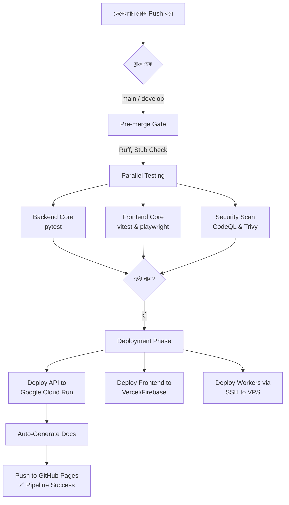

# 🧠 সুপ্রিমএআই ২.০ - বর্তমান আর্কিটেকচার ও ওয়ার্কফ্লো (Current Architecture)

এই ডকুমেন্টে সুপ্রিমএআই ২.০ (SupremeAI 2.0) প্রজেক্টের বর্তমান কোডবেস এবং ইনফ্রাস্ট্রাকচার কীভাবে কাজ করছে, তার একটি পূর্ণাঙ্গ চিত্র (Workflow) দেওয়া হলো।

---

## 🏗️ ১. হাই-লেভেল আর্কিটেকচার

আপনার বর্তমান সিস্টেমটি মূলত একটি **ডিস্ট্রিবিউটেড মাইক্রোসার্ভিস এবং সার্ভারলেস আর্কিটেকচার** অনুসরণ করছে। এর প্রধান অংশগুলো হলো:

### 🌐 ফ্রন্টএন্ড (Frontend)
* **টেকনোলজি:** React, Vite (Monorepo স্ট্রাকচারে Turbo ব্যবহার করা হয়েছে)।
* **ফোল্ডার:** `apps/studio-client`
* **হোস্টিং:** **Vercel** (পাশাপাশি `Firebase Hosting`-এর কনফিগারেশনও আছে)।
* **ওয়ার্কফ্লো:** ইউজারের ব্রাউজার থেকে যখন কোনো রিকোয়েস্ট আসে, Vercel-এর `vercel.json` ফাইলে থাকা *rewrites* রুল অনুযায়ী API রিকোয়েস্টগুলো সরাসরি ব্যাকএন্ডের Cloud Run লিংকে (`supremeai-api-lhlwyikwlq-uc.a.run.app`) রিডাইরেক্ট হয়ে যায়।

### ⚙️ ব্যাকএন্ড API (Backend)
* **টেকনোলজি:** Python (3.11+), FastAPI, Poetry।
* **ফোল্ডার:** `backend/`
* **হোস্টিং:** **Google Cloud Run (GCP)**।
* **ওয়ার্কফ্লো:** এটি একটি সার্ভারলেস কন্টেইনার সার্ভিস। অর্থাৎ এটি সবসময় জেগে থাকে না; যখনই Vercel থেকে কোনো API রিকোয়েস্ট আসে, Cloud Run অটোমেটিকভাবে কন্টেইনার স্পিন করে রিকোয়েস্ট প্রসেস করে।

### 🗄️ ডেটাবেস এবং স্টোরেজ (Database & Infrastructure)
আপনার ইনফ্রাস্ট্রাকচারগুলো `infrastructure/terraform` ফোল্ডার থেকে কোড (IaC) দ্বারা পরিচালিত হয়:
* **প্রাইমারি ডেটাবেস:** **Supabase** (PostgreSQL) ব্যবহার করা হচ্ছে রিলেশনাল ডেটা ও ইউজার ম্যানেজমেন্টের জন্য।
* **ভেক্টর ডেটাবেস:** AI এবং RAG (Retrieval-Augmented Generation) সার্চের জন্য **Pinecone** এবং **Qdrant** ব্যবহার করা হচ্ছে।
* **NoSQL ও রিয়েলটাইম:** **Firebase** (Firestore) ব্যবহার করা হচ্ছে।

### 🤖 স্বর্ম ওয়ার্কার (Swarm Workers - Heavy Tasks)
* **টেকনোলজি:** Docker, Python।
* **হোস্টিং:** একটি ডেডিকেটেড রিমোট সার্ভার বা **VPS (Virtual Private Server)**।
* **ওয়ার্কফ্লো:** যেসব কাজ অনেক সময়সাপেক্ষ (যেমন AI মডেল প্রসেসিং, ডেটা স্ক্র্যাপিং), সেগুলো Cloud Run-এ না করে ওয়ার্কার দিয়ে করানো হয়। বর্তমানে `docker-compose.prod.yml` ফাইলের মাধ্যমে এই কন্টেইনারগুলো সার্ভারে ২৪/৭ রানিং থাকে।

---

## 🔄 ২. CI/CD পাইপলাইন ওয়ার্কফ্লো (GitHub Actions)

আপনার প্রজেক্টের ডেভেলপমেন্ট থেকে প্রডাকশন পর্যন্ত যাওয়ার পুরো প্রক্রিয়াটি স্বয়ংক্রিয়ভাবে `.github/workflows/supreme-core-ci.yml` ফাইলের মাধ্যমে নিয়ন্ত্রিত হয়। 

নিচে এর স্টেপ-বাই-স্টেপ ফ্লো দেওয়া হলো:

### পাইপলাইনের ধাপসমূহ বিস্তারিত:

1. **Pre-merge Gate (Iron Curtain):** কোড পুশ করার সাথে সাথেই প্রথমে `ruff` দিয়ে পাইথন কোডের স্ট্যাটিক অ্যানালাইসিস হয়। কোনো বেসিক কোডিং এরর বা স্টাব ডেটা থাকলে পাইপলাইন এখানেই ফেইল করে।
2. **Parallel Testing:** ব্যাকএন্ডের জন্য `pytest` এবং ফ্রন্টএন্ডের জন্য `vitest` সমান্তরালভাবে রান হয়। একইসাথে `CodeQL` দিয়ে সিকিউরিটি স্ক্যান চলে।
3. **Build & Push:** সব টেস্ট পাস করলে ব্যাকএন্ড এবং ওয়ার্কারের জন্য ডকার ইমেজ (Docker Image) বিল্ড করে GitHub Container Registry (ghcr.io)-তে পুশ করা হয়।
4. **Deploy Backend:** Cloud Run-এ নতুন ডকার ইমেজটি আপডেট করে দেওয়া হয়।
5. **Deploy Workers (VPS):** পাইপলাইন `appleboy/ssh-action` ব্যবহার করে আপনার সেট করা `SSH_HOST`-এ (VPS) লগইন করে এবং `docker-compose pull` ও `up -d` কমান্ড চালিয়ে নতুন ওয়ার্কার চালু করে দেয়।
6. **Auto Docs Generation:** সবশেষে `generate_smart_docs.py` ও `generate_openapi.py` স্ক্রিপ্ট রান করে কোডবেসের ডকুমেন্টেশন এবং OpenAPI স্পেসিফিকেশন জেনারেট করে GitHub Pages-এ লাইভ করে দেয়।

---

## 🎯 ৩. সারাংশ (Summary)

বর্তমানে আপনার সিস্টেমটি বেশ অ্যাডভান্সড। ফ্রন্টএন্ড এবং API পুরোপুরি **সার্ভারলেস (Serverless)** মডেলে চলছে (Vercel ও Cloud Run), যার ফলে ট্রাফিক না থাকলে খরচ প্রায় শূন্য থাকে। 

কিন্তু, **ওয়ার্কারগুলো একটি রিমোট সার্ভারে (VPS) ২৪/৭ চলছে**। আপনি যদি খরচ সম্পূর্ণ শূন্য (Zero-Cost) করতে চান, তবে এই ওয়ার্কারগুলোকে VPS-এর বদলে ইউজারের রিকোয়েস্ট আসা মাত্রই GitHub Actions-এর মাধ্যমে অন-ডিমান্ড রান করানোর মডেলে শিফট করতে পারেন।
