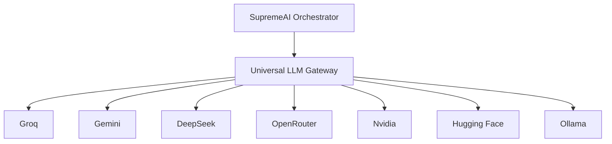

# SupremeAI 2.0 — Supporting AI & Hugging Face Usage

This document details where and how Hugging Face (HF) and other AI services are utilized in production within the SupremeAI 2.0 monorepo.

---

## 1. Is Hugging Face (HF) API Key Really Used in Production?

**Yes.** Hugging Face's serverless inference API key is actively used in production for critical audio/visual and fallback LLM services. 

### Hugging Face Key Usages in Production:

| Component | File Path | Usage & Purpose | Model |
| :--- | :--- | :--- | :--- |
| **Voice / STT** | [voice.py](file:///c:/Users/n/supremeai/supremeai_2.0/backend/tools/voice.py) | Transcribes audio to text (Speech-to-Text) | `openai/whisper-large-v3` via serverless API |
| **Image Generator** | [image_generator.py](file:///c:/Users/n/supremeai/supremeai_2.0/backend/tools/image_generator.py) | Generates images from text queries | Open-source text-to-image models (e.g. Stable Diffusion) |
| **Universal LLM Gateway** | [llm_gateway.py](file:///c:/Users/n/supremeai/supremeai_2.0/backend/core/llm_gateway.py) | Acts as a fallback routing engine | Various lightweight LLMs hosted on HF |
| **Model RLHF Training** | [rlhf_pipeline.py](file:///c:/Users/n/supremeai/supremeai_2.0/backend/tools/rlhf_pipeline.py) | Fine-tuning/alignment via HF TRL DPOTrainer | Local/cloud training pipelines |

---

## 2. Complete Supporting AI List in SupremeAI 2.0

SupremeAI 2.0 implements a multi-cloud AI orchestration gateway that coordinates multiple AI backends to achieve zero-cost operation and high availability.

### Supported AI Backends & Orchestration Roles:

| AI Provider | Primary Orchestration Role | Models Used | Production Usage File(s) |
| :--- | :--- | :--- | :--- |
| **Groq** | Fast, easy-difficulty reasoning and streaming | `llama-3.3-70b-versatile` | [llm_gateway.py](file:///c:/Users/n/supremeai/supremeai_2.0/backend/core/llm_gateway.py) |
| **Gemini (Google AI Studio)** | Core model gateway for medium and hard difficulty tasks | `gemini-1.5-flash`, `gemini-3.5-flash`, `gemini-1.5-pro` | [llm_gateway.py](file:///c:/Users/n/supremeai/supremeai_2.0/backend/core/llm_gateway.py) |
| **DeepSeek** | Primary code intelligence and complex reasoning | `deepseek-chat` (DeepSeek-V3), `deepseek-coder` | [llm_gateway.py](file:///c:/Users/n/supremeai/supremeai_2.0/backend/core/llm_gateway.py) |
| **OpenRouter** | Fallback routing and custom model queries | `anthropic/claude-3.5-haiku:free` | [config.py](file:///c:/Users/n/supremeai/supremeai_2.0/backend/core/config.py) |
| **Nvidia NIM** | Specialized accelerated inference | Various NIM models | [llm_gateway.py](file:///c:/Users/n/supremeai/supremeai_2.0/backend/core/llm_gateway.py) |
| **Ollama (Cloud Node)** | Offline, zero-cost edge execution | `qwen2.5-coder:1.5b`, `llama3.2` | [routing_policy.json](file:///c:/Users/n/supremeai/supremeai_2.0/backend/config/routing_policy.json) |
| **Firecrawl** | AI-driven web scraping and crawling | Scraper agent API | [llm_gateway.py](file:///c:/Users/n/supremeai/supremeai_2.0/backend/core/llm_gateway.py) |
