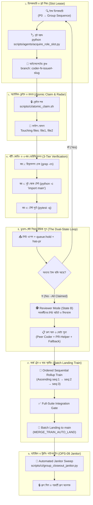

# SupremeAI — Living Prompt Autonomous Pipeline Architecture
## (প্রোটোকল-চালিত অটোনোমাস এক্সিকিউশন ও মার্জ পাইপলাইন ব্লুপ্রিন্ট)

> **ডকুমেন্ট আইডি:** ARCH-LIVING-PIPELINE-01  
> **তারিখ:** ২০২৬-০৯-২৮ · **স্ট্যাটাস:** সক্রিয় আর্কিটেকচারাল স্পেসিফিকেশন (Active Standard)  
> **উৎস ও রেফারেন্স:** [`LIVING_PROMPT_SIMPLIFICATION_PLAN.md`](./LIVING_PROMPT_SIMPLIFICATION_PLAN.md) · [`AGENTS.md`](../../AGENTS.md) · [`OPS-09`](../master_docs/OPS-09-POST-GROUP-JANITOR-AND-HYGIENE-PROTOCOL.md)  
> **মূল দর্শন:** *"Code is a liability; Clear Protocol is leverage — জটিল কোড নয়, ৪–৫টি জীবন্ত প্রোটোকল দিয়ে সিস্টেম হবে রেস-কন্ডিশন মুক্ত, স্বয়ংসম্পূর্ণ ও বুলেটপ্রুফ।"*

---

## ১. ভূমিকা ও কার্যনির্বাহী দর্শন (Executive Philosophy)

সুপ্রিমএআই-এর অতীতে যখনই মাল্টি-এজেন্ট রেসিং, টাস্ক ডেলিগেশন, ফাইল সংঘাত বা মার্জের জটিলতা দেখা দিয়েছে, ডেভেলপাররা জটিল কোড লিখে সমাধান করার চেষ্টা করেছে:
* মেমোরিতে ডিস্ট্রিবিউটেড মিউটেক্স ও লকিং মেকানিজম
* ইন-মেমোরি সোয়ার্ম থ্রেড লুপ এবং জটিল স্টেট সিঙ্ক্রোনাইজার
* হাজার লাইনের ফ্র্যাজাইল রোলব্যাক ও হ্যান্ডঅফ পাইপলাইন (`handoff_schema.py`, `handoff_event.py`)

### 💡 মূল উপলব্ধি
কোড যত বড় হয়, বাগ এবং ব্যর্থতার সম্ভাবনা তত বৃদ্ধি পায়। কিন্তু কাজের সীমানায় যদি **প্রোটোকল-চালিত পাইপলাইন (Living Prompt Pipeline)** বসানো যায়, তবে শত শত লাইনের ভঙ্গুর কোড ছাড়াই সিস্টেম ১০০% নির্ভরযোগ্যভাবে কাজ করে।

---

## ২. এন্ড-টু-এন্ড অটোনোমাস এক্সিকিউশন পাইপলাইন (End-to-End Pipeline Workflow)



---

## ৩. পাইপলাইনের ৫টি প্রধান স্তর (The 5 Pipeline Stages)

### স্তর ১: স্লট আইসোলেশন ও ব্রাঞ্চ-অ্যাজ-লিজ (`Slot-as-Lease`)
* **টার্গেট:** কোনো সেন্ট্রাল প্রসেস সুপারভাইজার বা থ্রেড ম্যানেজমেন্ট কোড থাকবে না।
* **পাইপলাইন লজিক:** প্রতিটি এজেন্ট নিজস্ব ডেডিকেটেড স্লটে (`coder-1` থেকে `coder-9`) এবং নির্দিষ্ট ব্রাঞ্চে কাজ করবে।
* **এনফোর্সমেন্ট:** `python scripts/agents/acquire_role_slot.py --role coder`

### স্তর ২: অ্যাটমিক ক্লেইম ও ব্লাস্ট রেডিয়াস ঘোষণা (`Atomic Claim & Radar`)
* **টার্গেট:** ৪০০+ লাইনের ডিস্ট্রিবিউটেড ফাইল লকার ও ডেডলক ডিটেক্টর ছাঁটাই।
* **পাইপলাইন লজিক:** কাজ শুরুর পূর্বে গিটহাব ইস্যুতে ক্লেইম লক নিশ্চিত করতে হবে এবং কমেন্টে ফাইল সীমানা ঘোষণা করতে হবে:
  ```text
  Touching files: backend/core/llm/gateway.py, backend/tests/core/test_llm_gateway.py
  ```
* **এনফোর্সমেন্ট:** `./scripts/ci/atomic_claim.sh <issue#> <agent_slot>`

### স্তর ৩: ৩-স্তর ভেরিফিকেশন পাইপলাইন (`3-Tier Verification Discipline`)
* **টার্গেট:** কোনো টেস্ট ডিলিট বা স্কিপ না করে পরিবর্তনকে ১০০% খাঁটি রাখা।
* **পাইপলাইন ধাপসমূহ:**
  1. **Dynamic Reflection Check:** মডিউলের কোনো ড্যাংলার বা ভাঙা রেফারেন্স আছে কিনা পরীক্ষা (`grep -rn "target_symbol"`).
  2. **Boot Smoke Test:** অ্যাপ্লিকেশন বুট নিশ্চিতকরণ (`python -c "import backend.main"`).
  3. **Targeted Pytest:** নির্দিষ্ট টেস্ট স্যুটের ১০০% গ্রিন ফলাফল (`pytest <targeted-test-path>`).

### স্তর ৪: ডুয়াল-স্টেট গেম ও পিয়ার-রিভিউ কোটা (`The Dual-State Game`)
* **টার্গেট:** কোনো এজেন্ট অলস বসে থাকবে না বা কোনো PR রিভিউ ছাড়া থাকবে না।
* **ডুয়াল-স্টেট ট্রানজিশন:**
  * **State A (Solver Mode):** সক্রিয় আনক্লেইমড ইস্যু থাকলে এজেন্ট কোড লিখবে ও PR জমা দেবে।
  * **State B (Reviewer Mode):** সব ইস্যু ক্লেইম হয়ে গেলে এজেন্ট স্বয়ংক্রিয়ভাবে পিয়ার রিভিউয়ারে রূপান্তরিত হয়ে সহকর্মীদের PR-এ গঠনমূলক ফিডব্যাক দেবে।
* **The Rule of 3 Review Quota:**
  1. **রিভিউ ১ (অল্টারনেটিভ কোডার):** Rule 12 অনুযায়ী নো সেলফ-রিভিউ।
  2. **রিভিউ ২ (PR-Helper):** ট্রাফিক্স ও রুল কনসেনসাস অডিট।
  3. **রিভিউ ৩ (২য় পিয়ার কোডার অথবা ৩০-মিনিট ফলব্যাক):** দ্বিতীয় কোডার রিভিউ; অন্যথায় ৩০ মিনিট পর SupremeAI Engine নিজে ৩য় রিভিউ সম্পন্ন করবে।

### স্তর ৫: অর্ডারড সিকোয়েন্সিয়াল মার্জ ট্রেন (`Sequential Rollup Train`)
* **টার্গেট:** বিচ্ছিন্ন মার্জের ফলে তৈরি হওয়া মার্জ-কনফ্লিক্ট ও ক্র্যাশ প্রতিরোধ।
* **পাইপলাইন নীতি:**
  * প্রতিটি PR প্রথমে `queue:hold` লেবেলে সুরক্ষিত থাকবে।
  * **Ascending Order:** `seq:1` মার্জ হওয়ার পর তার ওপর `seq:2` বিল্ড হবে (`Train Base + PR-1` এর ওপর PR-2)।
  * **Contiguous Rollup:** যদি `[PR-1, PR-2, PR-4]` তৈরি থাকে, তবে দীর্ঘতম ধারাবাহিক ক্রম `[PR-1, PR-2]` ট্রেনে চলে যাবে; `PR-4` স্টেশনে অপেক্ষা করবে যতক্ষণ না `PR-3` চেইন সম্পূর্ণ করে।

---

## ৪. পাইপলাইন ডেলিগেশন ও হ্যান্ডঅফ সরলীকরণ (Handoff Retirement)

অতীতে এজেন্টদের মধ্যে দায়িত্ব স্থানান্তরের জন্য ব্যাকএন্ডে যে ভারী কোডগুলো রাখা হয়েছিল, তা এই প্রোটোকলে রিটায়ার করা হয়েছে:

| পুরোনো কোডভিত্তিক উপাদান | আকার | নতুন প্রোটোকলভিত্তিক সমাধান | সুফল |
| :--- | :---: | :--- | :--- |
| `backend/core/orchestration/handoff_schema.py` | ১৮৯ লাইন | GitHub Issue Labels (`handoff:coder`, `handoff:planner`) | স্কিমা পার্সিং জটিলতা শূন্য |
| `backend/models/handoff_event.py` | ২৮ লাইন | গিটহাব ইস্যু কমেন্টস ও ট্র্যাকিং হিস্ট্রি | অতিরিক্ত DB মাইগ্রেশন ও টেবিল ছাঁটাই |
| `backend/core/orchestration/master_cognitive_orchestrator.py` | ১৯ লাইন | রুট-লেভেল ডিসপ্যাচার ও স্লট ম্যানেজার | রাউটার ওভারহেড অবসান |
| `In-Memory Rollback Pipeline` | ~৩০০ লাইন | `queue:hold` + Git Batch Rollup Landing | ভুল মার্জ এবং স্বয়ংক্রিয় রিভার্ট লুপ বন্ধ |

---

## ৫. হাইজিন ও পোস্ট-গ্রুপ জানিটর পাইপলাইন (`OPS-09 Integration`)

একটি গ্রুপ সিকোয়েন্স সফলভাবে মার্জ ট্রেন সম্পন্ন করার পর সিস্টেমকে পরিষ্কার রাখতে স্বয়ংক্রিয় জানিটর পাইপলাইন এক্সিকিউট হয়:

```bash
python scripts/ci/group_closeout_janitor.py --group step-2
```

### ৫-স্তরের ক্লিনিং অ্যাকশন (The 5-Tier Janitor Purge):
1. **Remote Branch Sweep:** মার্জ হওয়া `coder-*` এবং `agent-*` ব্রাঞ্চগুলো রিমোট থেকে ডিলিট করে `git fetch origin --prune` চালানো।
2. **Draft PR Reconcile:** পরিত্যক্ত বা অপ্রয়োজনীয় ড্রাফট PR চিহ্নিত করে বন্ধ করা।
3. **Label Sanitization:** ক্লোজ হওয়া ইস্যু থেকে `queue:hold`, `queue:pending-rollup`, এবং `has-pr` সরানো।
4. **Local Scratch Purge:** ডেভেলপমেন্ট চলাকালীন তৈরি হওয়া লোকাল স্ক্র্যাচ স্ক্রিপ্ট পরিষ্কার করা।
5. **Fleet Lease Reset:** সেন্ট্রাল কন্ট্রোল টাওয়ারে এজেন্ট স্লটের স্ট্যাটাস `available` হিসেবে রিসেট করা।

---

## ৬. আর্কিটেকচারাল সারসংক্ষেপ ও লাভ মেট্রিক্স (Benefit Matrix)

| মাপকাঠি | পুরোনো জটিল পাইপলাইন | নতুন লিভিং প্রম্পট পাইপলাইন | মোট বাস্তব লাভ (১০১% নীতি) |
| :--- | :--- | :--- | :--- |
| **রেস কন্ডিশন** | ইন-মেমোরি লক ও ব্যাকঅফ লুপ | গিটহাব ইস্যু ক্লেইম ও Touching files | শূন্য ডেডলক, শতভাগ দৃশ্যমানতা |
| **কোড ভলিউম** | ~৭,০৮০+ লাইন ভঙ্গুর কোড ও টেস্ট | মাত্র ৪–৫টি নির্দেশিকা প্রোটোকল | ৭,০৮০+ লাইন কোডবেস থেকে ছাঁটাই |
| **মার্জ স্থায়িত্ব** | বিচ্ছিন্ন মার্জ ও ড্রাইভ-বাই রিফ্যাক্টরিং | অর্ডারড মার্জ ট্রেন + ব্যাচ ল্যান্ডিং | কোনো রিগ্রেশন বা ব্রেকিং চেঞ্জ ছাড়া রোলআপ |
| **অটোনমি ব্যালান্স**| সম্পূর্ণ অন্ধ অটোমেশন অথবা হিউম্যান জ্যাম | স্বয়ংক্রিয় কাজ + পেরিমিটারে কঠোর গেট | **"ঘুড়ি উড়ুক আকাশে, নাটাই অ্যাডমিনের হাতে"** |

---
*ডকুমেন্ট সমাপ্ত — ক্যানোনিকাল পাইপলাইন স্থাপত্য দলিলের রেফারেন্স হিসেবে সংরক্ষিত।*

> **বাস্তবায়ন রোডম্যাপ:** এই স্পেকের evidence-ভিত্তিক বাস্তবায়ন পরিকল্পনা (reality-check, gap register, ফেজড অ্যাটমিক PR সহ) দেখুন → [`docs/plans/ARCH-LIVING-PIPELINE-01-IMPL.md`](../plans/ARCH-LIVING-PIPELINE-01-IMPL.md)
