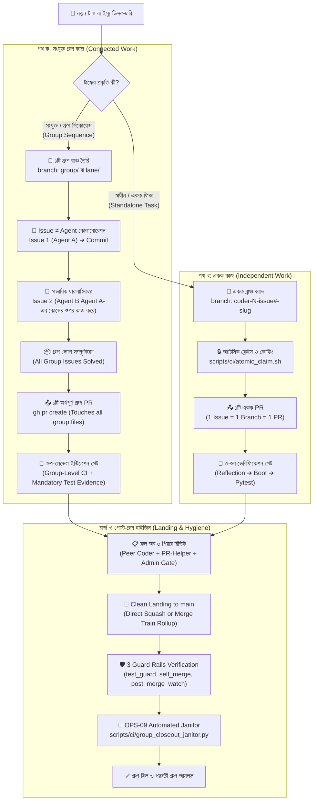

# SupremeAI — Living Prompt Autonomous Pipeline Architecture
## (প্রোটোকল-চালিত অটোনোমাস এক্সিকিউশন ও মার্জ পাইপলাইন ব্লুপ্রিন্ট)

> **ডকুমেন্ট আইডি:** ARCH-LIVING-PIPELINE-01  
> **তারিখ:** ২০২৬-০৯-২৮ · **স্ট্যাটাস:** সক্রিয় আর্কিটেকচারাল স্পেসিফিকেশন (Active Standard)  
> **উৎস ও রেফারেন্স:** [`LIVING_PROMPT_SIMPLIFICATION_PLAN.md`](./LIVING_PROMPT_SIMPLIFICATION_PLAN.md) · [`ACTIVE_ISSUES_AND_PRIORITY_ROADMAP.md`](../operations/ACTIVE_ISSUES_AND_PRIORITY_ROADMAP.md) · [`AGENTS.md`](../../AGENTS.md) · [`ARCH-10`](../master_docs/ARCH-10-UNIVERSAL-ENGINE-MASTER-PLAN-GROUP-STAGING-RULE-ENGINE-BATCH-TRAIN-RED-TEAM.md) · [`OPS-09`](../master_docs/OPS-09-POST-GROUP-JANITOR-AND-HYGIENE-PROTOCOL.md)  
> **মূল দর্শন:** *"Code is a liability; Clear Protocol is leverage — অপ্রয়োজনীয় রিজিড নিয়ম বা জটিল কোড নয়; সবকিছু interconnected, কিন্তু unnecessary complexity ছাড়া। সংযুক্ত কাজে ১ গ্রুপ ব্রাঞ্চ, একক কাজে ১ ইস্যু ব্রাঞ্চ।"*

---

## ১. ভূমিকা ও কার্যনির্বাহী দর্শন (Executive Philosophy)

সুপ্রিমএআই-এর অতীতে যখনই মাল্টি-এজেন্ট রেসিং, টাস্ক ডেলিগেশন, ফাইল সংঘাত বা মার্জের জটিলতা দেখা দিয়েছে, ডেভেলপাররা জটিল কোড ও অতি-কঠোর (rigid) নিয়ম লিখে সমাধান করার চেষ্টা করেছে:
* মেমোরিতে ডিস্ট্রিবিউটেড মিউটেক্স ও লকিং মেকানিজম
* ইন-মেমোরি সোয়ার্ম থ্রেড লুপ এবং জটিল স্টেট সিঙ্ক্রোনাইজার
* রিজিড `১ Issue = ১ Agent = ১ Branch = ১ PR` রুল — যার কারণে একটি ৪-ইস্যুর গ্রুপে ৪টি আলাদা মাইক্রো-ব্রাঞ্চ ও ৪টি আলাদা পিআর খুলে সবগুলো `queue:hold`-এ আটকে রাখতে হতো। ফলে এজেন্ট ২ এজেন্ট ১-এর কোড দেখতে পেত না এবং আংশিক রোলআপের কারণে সিআই গেটগুলো ফেইল করত।

### 💡 মূল উপলব্ধি ও সমাধান: Flexible Dual-Track Architecture
কোড ও রিজিড নিয়মের বেড়াজাল যত বাড়ে, সিস্টেমে সমন্বয়হীনতা ও ঘর্ষণ তত বৃদ্ধি পায়। 
অতএব, সুপ্রিমএআই পাইপলাইন পরিচালিত হবে দুটি বাস্তবসম্মত ট্র্যাকে:
1. **Connected Work (সংযুক্ত গ্রুপ কাজ):** `1 Issue Group → 1 Isolated Branch → Multiple Issues/Agents → 1 PR → Group-level Verification`
2. **Independent Work (একক স্বাধীন কাজ):** `1 Issue → 1 Isolated Branch → 1 PR → Atomic Verification`

---

## ২. ডুয়াল-ট্র্যাক অটোনোমাস এক্সিকিউশন পাইপলাইন (Dual-Track Workflow)



---

## ৩. পাইপলাইনের ৫টি প্রধান স্তর (The 5 Pipeline Stages)

### স্তর ১: ফ্লেক্সিবল ব্রাঞ্চিং ও লিজ মডেল (`Flexible Group Branching Protocol`)
* **টার্গেট:** কৃত্রিম মাইক্রো-ব্রাঞ্চিং ও আন্তঃ-এজেন্ট ডেটা সমন্বয়ের অন্ধত্ব দূর করা।
* **মূল নীতি (Issue ≠ Agent):**
  * একটি ব্রাঞ্চ মানেই একজন এজেন্ট নয়।
  * **সংযুক্ত কাজের ক্ষেত্রে (`Connected Work`):** পুরো গ্রুপের জন্য থাকবে একটিমাত্র ব্রাঞ্চ (e.g. `group/step-3-consolidation` বা `lane/pipeline-core`)। এজেন্ট A কাজ শেষ করে পুশ করলে, এজেন্ট B স্বাভাবিকভাবেই সেই কোড পুল করে তার ওপর পরবর্তী কাজ শুরু করবে। কোনো জটিল হ্যান্ডঅফ ফাইল বা মেমোরি বাফার লাগবে না।
  * **স্বাধীন কাজের ক্ষেত্রে (`Independent Work`):** একক বাগ বা স্বাধীন ফিচারের জন্য থাকবে ক্লাসিক স্লট ব্রাঞ্চ (`coder-N-issue#-slug`)।

### স্তর ২: অ্যাটমিক ক্লেইম ও ব্লাস্ট রেডিয়াস ঘোষণা (`Atomic Claim & Radar`)
* **টার্গেট:** কোড ওভারল্যাপ ও আন-ট্র্যাকড পরিবর্তন প্রতিহত করা।
* **পাইপলাইন লজিক:** কাজ শুরুর পূর্বে গিটহাব ইস্যুতে ক্লেইম লক নিশ্চিত করতে হবে এবং কমেন্টে ফাইল সীমানা ঘোষণা করতে হবে:
  ```text
  Touching files: backend/core/llm/gateway.py, backend/tests/core/test_llm_gateway.py
  ```
* **এনফোর্সমেন্ট:** `./scripts/ci/atomic_claim.sh <issue#> <agent_slot>`

### স্তর ৩: ৩-স্তর ভেরিফিকেশন পাইপলাইন (`3-Tier Verification Discipline`)
* **টার্গেট:** কোনো টেস্ট ডিলিট বা স্কিপ না করে পরিবর্তনকে ১০০% খাঁটি রাখা।
* **পাইপলাইন ধাপসমূহ:**
  1. **Dynamic Reflection Check:** মডিউলের কোনো ড্যাংলার বা ভাঙা রেফারেন্স আছে কিনা পরীক্ষা (`grep -rn "target_symbol"`).
  2. **Boot Smoke Test:** অ্যাপ্লিকেশন বুট নিশ্চিতকরণ (`python -c "import backend.main"`).
  3. **Targeted Pytest:** নির্দিষ্ট টেস্ট স্যুটের ১০০% গ্রিন ফলাফল (`pytest <targeted-test-path>`).

### স্তর ৪: ডুয়াল-স্টেট গেম ও পিয়ার-রিভিউ কোটা (`The Dual-State Game`)
* **টার্গেট:** কোনো এজেন্ট অলস বসে থাকবে না বা কোনো PR রিভিউ ছাড়া থাকবে না।
* **ডুয়াল-স্টেট ট্রানজিশন:**
  * **State A (Solver Mode):** সক্রিয় আনক্লেইমড কাজ থাকলে এজেন্ট কোড লিখবে ও ব্রাঞ্চে পুশ করবে।
  * **State B (Reviewer Mode):** সব কাজ ক্লেইম হয়ে গেলে এজেন্ট স্বয়ংক্রিয়ভাবে পিয়ার রিভিউয়ারে রূপান্তরিত হয়ে সহকর্মীদের PR-এ গঠনমূলক ফিডব্যাক দেবে।
* **The Rule of 3 Review Quota:**
  1. **রিভিউ ১ (অল্টারনেটিভ কোডার):** Rule 12 অনুযায়ী নো সেলফ-রিভিউ।
  2. **রিভিউ ২ (PR-Helper):** ট্রাফিক্স ও রুল কনসেনসাস অডিট।
  3. **রিভিউ ৩ (২য় পিয়ার কোডার অথবা ৩০-মিনিট ফলব্যাক):** দ্বিতীয় কোডার রিভিউ; অন্যথায় ৩০ মিনিট পর SupremeAI Engine নিজে ৩য় রিভিউ সম্পন্ন করবে।

### স্তর ৫: গ্রুপ-লেভেল ব্যাচ ল্যান্ডিং ও মার্জ প্রটেকশন (`Group Batch Landing & Gates`)
* **টার্গেট:** বিচ্ছিন্ন মার্জের ফলে তৈরি হওয়া মার্জ-কনফ্লিক্ট ও সিআই ফল্ট প্রতিরোধ।
* **বাস্তব অভিজ্ঞতাভিত্তিক নিয়মাবলী (Field-Tested Invariants):**
  1. **One Meaningful PR:** একটি গ্রুপ সম্পন্ন হলে একটি সমন্বিত PR খোলা হবে। এতে ৪টি আলাদা পিআরের `queue:hold` ডেডলক সম্পূর্ণ নির্মূল হয়।
  2. **Mandatory Test Evidence:** পিআর ডেসক্রিপশনে অবশ্যই আসল টেস্ট রানার আউটপুট সহ `## Test Evidence` সেকশন থাকতে হবে। এটি ছাড়া সিস্টেম গেটের `Verification Gate` পিআর ব্লক করবে।
  3. **Repo-Wide Gate Awareness:** সুপ্রিমএআই-এর সেন্টিনেল, রূফ এবং কনস্টিটিউশন গেট পুরো রিপো জুড়ে চলে। তাই ডিপেন্ডেন্ট গেটগুলো একই সাথে সমন্বিত অবস্থায় ভেরিফাই করতে হবে।
  4. **The 3 Guard Rails (ARCH-10 Synergy):**
     * `test_guard`: কোনো টেস্ট ডিলিট বা স্কিপ বা অ্যাসারশন দুর্বল করা হলে সাথে সাথে BLOCK।
     * `self_merge`: নিজের পিআর নিজে অনুমোদন দিয়ে মার্জ করা নিষিদ্ধ।
     * `post_merge_watch`: মার্জ হওয়ার পরবর্তী ১৫ মিনিটের মধ্যে মেইন ব্রাঞ্চ লাল হলে স্বয়ংক্রিয় রিভার্ট বা অ্যালার্ট ট্রিগার।

### স্তর ৬: ডিপ্লয় ট্রেন ও অটোমেটেড রোলব্যাক (`Deploy Train & Rollback`, #2421 seq:3)

* **টার্গেট:** main-এ মার্জ ≠ প্রোডাকশনে ল্যান্ডিং। main থেকে প্রোডাকশনে যাওয়ার পথে কোটা-সুরক্ষা, লাইভ ক্যানারি ও ব্যর্থতায় instant rollback — রেন্ডার কোটা রক্ষা ও ক্লাউড থ্র্যাশিং প্রতিরোধ।
* **বাস্তবায়ন:** `.github/workflows/deploy-train.yml` — ৫-স্টেশন ট্রেন, সব বিদ্যমান reusable workflow-এর রচনা (কোনো ডুপ্লিকেট রান নয় — 3-Pipeline DRY):
  1. **Station 1 Preflight:** `08-production-preflight.yml` — কোটা প্রিফ্লাইট + @smoke গেট; লাল হলে deploy-ই হয় না।
  2. **Station 2 Deploy:** `ci-deploy-production.yml` — Render backend (+ optional scraper/mcp/cloudflare)।
  3. **Station 3 Canary:** `09-post-deploy-smoke.yml` — Playwright + backend health লাইভ ক্যানারি।
  4. **Station 4 Rollback:** `scripts/deploy/render_rollback.py` — ক্যানারি লাল হলে পূর্বসূরি স্থিতিশীল commit-এ re-deploy (SSOT `scripts/lib/render_client.py`); **fail-closed চুক্তি:** স্থিতিশীল পূর্বসূরি নেই বা commitId অজানা হলে অন্ধ revert নয় — স্পষ্ট লাল + অ্যাডমিন অ্যালার্ট (নাটাই অ্যাডমিনের)।
  5. **Station 5 Release:** ক্যানারি সবুজ হলে ক্যানোনিকাল সংস্করণে release ট্যাগ (idempotent)।
* **ট্রিগার চুক্তি:** dispatch-only (অ্যাডমিন/অপারেটর নিয়ন্ত্রিত); প্রতি main-পুশে auto-rollout Render কোটা/কোল্ড-স্টার্ট থ্র্যাশিং তৈরি করে (#2454-প্রমাণিত)। Group-Closeout ট্রিগার ভবিষ্যতে কনস্টিটিউশন sync-এর সাথে।
* **কনকারেন্সি:** `supremeai-deploy-train`, `cancel-in-progress: false` — চলমান রোলআউট কখনো মাঝপথে বাতিল হয় না।

---

## ৪. পাইপলাইন ডেলিগেশন ও হ্যান্ডঅফ সরলীকরণ (Handoff Retirement)

অতীতে এজেন্টদের মধ্যে দায়িত্ব স্থানান্তরের জন্য ব্যাকএন্ডে যে ভারী কোডগুলো রাখা হয়েছিল, তা এই প্রোটোকলে রিটায়ার করা হয়েছে:

| পুরোনো কোডভিত্তিক উপাদান | আকার | নতুন প্রোটোকলভিত্তিক সমাধান | সুফল |
| :--- | :---: | :--- | :--- |
| `backend/core/orchestration/handoff_schema.py` | ১৮৯ লাইন | Git Branch Commits + GitHub Issue Labels | স্কিমা পার্সিং জটিলতা শূন্য |
| `backend/models/handoff_event.py` | ২৮ লাইন | গিটহাব ইস্যু কমেন্টস ও ট্র্যাকিং হিস্ট্রি | অতিরিক্ত DB মাইগ্রেশন ও টেবিল ছাঁটাই |
| `backend/core/orchestration/master_cognitive_orchestrator.py` | ১৯ লাইন | রুট-লেভেল ডিসপ্যাচার ও স্লট ম্যানেজার | রাউটার ওভারহেড অবসান |
| `In-Memory Rollback Pipeline` | ~৩০০ লাইন | Git Batch Rollup / Group Branch Landing | ভুল মার্জ এবং স্বয়ংক্রিয় রিভার্ট লুপ বন্ধ |

---

## ৫. হাইজিন ও পোস্ট-গ্রুপ জানিটর পাইপলাইন (`OPS-09 Integration`)

একটি গ্রুপ বা টাস্ক সফলভাবে মেইনে মার্জ হওয়ার পর সিস্টেমকে পরিষ্কার রাখতে স্বয়ংক্রিয় জানিটর পাইপলাইন এক্সিকিউট হয়:

```bash
python scripts/ci/group_closeout_janitor.py --group <group-name>
```

### ৫-স্তরের ক্লিনিং অ্যাকশন (The 5-Tier Janitor Purge):
1. **Remote Branch Sweep:** মার্জ হওয়া `group/*` বা `coder-*` ব্রাঞ্চগুলো রিমোট থেকে ডিলিট করে `git fetch origin --prune` চালানো।
2. **Draft PR Reconcile:** পরিত্যক্ত বা অপ্রয়োজনীয় ড্রাফট PR চিহ্নিত করে বন্ধ করা।
3. **Label Sanitization:** ক্লোজ হওয়া ইস্যু থেকে `queue:hold`, `queue:pending-rollup`, এবং `has-pr` সরানো।
4. **Local Scratch Purge:** ডেভেলপমেন্ট চলাকালীন তৈরি হওয়া লোকাল স্ক্র্যাচ স্ক্রিপ্ট পরিষ্কার করা।
5. **Fleet Lease Reset:** সেন্ট্রাল কন্ট্রোল টাওয়ারে এজেন্ট স্লটের স্ট্যাটাস `available` হিসেবে রিসেট করা।

---

## ৬. আর্কিটেকচারাল সারসংক্ষেপ ও বাস্তব লাভ (Benefit Matrix)

| মাপকাঠি | পুরোনো রিজিড মাইক্রো-পিআর পাইপলাইন | নতুন ফ্লেক্সিবল ডুয়াল-ট্র্যাক পাইপলাইন | মোট বাস্তব লাভ (১০১% নীতি) |
| :--- | :--- | :--- | :--- |
| **ব্রাঞ্চিং ও পিআর ভলিউম** | প্রতি ইস্যুতে ১টি ব্রাঞ্চ + ১টি পিআর (৪ ইস্যুতে ৪ পিআর) | সংযুক্ত কাজে ১ গ্রুপ ব্রাঞ্চ + ১টি গ্রুপ পিআর | ৭৫% পিআর ট্র্যাফিক ও রিভিউ ওভারহেড হ্রাস |
| **আন্তঃ-এজেন্ট সমন্বয়** | এজেন্ট ২ এজেন্ট ১-এর কোড দেখতে পায় না (অন্ধত্ব) | একই গ্রুপ ব্রাঞ্চে সরাসরি পূর্ববর্তী কোডের ওপর কাজ | শূন্য মার্জ কনফ্লিক্ট, শতভাগ ধারাবাহিকতা |
| **সিআই ওভারহেড ও গেট** | প্রতিটি মাইক্রো-পিআরে পৃথক সিআই ও আংশিক ফেইল | সম্পূর্ণ গ্রুপে একবার সমন্বিত সিআই রান | সিআই মিনিট সাশ্রয় ও গেট স্ট্যাবিলিটি |
| **কোড ও নিয়মের বোঝা** | ইন-মেমোরি লক ও ভারী হ্যান্ডঅফ কোড | মাত্র ৪–৫টি পরিষ্কার লিভিং প্রোটোকল | ৭,০০০+ লাইন অপ্রয়োজনীয় কোড ছাঁটাই |
| **অটোনমি ব্যালান্স** | সম্পূর্ণ অন্ধ অটোমেশন অথবা হিউম্যান জ্যাম | স্বয়ংক্রিয় কাজ + ৩টি সুদৃঢ় গার্ড রেল | **"ঘুড়ি উড়ুক আকাশে, নাটাই অ্যাডমিনের হাতে"** |

---
*ডকুমেন্ট সমাপ্ত — সুপ্রিমএআই ক্যানোনিকাল পাইপলাইন স্থাপত্য দলিলের রেফারেন্স হিসেবে সংরক্ষিত।*

> **বাস্তবায়ন রোডম্যাপ:** এই স্পেকের evidence-ভিত্তিক বাস্তবায়ন পরিকল্পনা (reality-check, gap register, ফেজড অ্যাটমিক PR সহ) দেখুন → [`docs/plans/ARCH-LIVING-PIPELINE-01-IMPL.md`](../plans/ARCH-LIVING-PIPELINE-01-IMPL.md)

