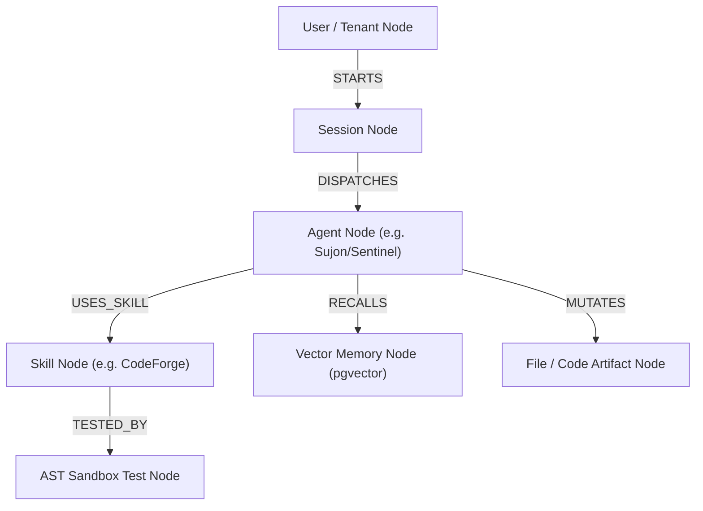

# SupremeAI 2.0 Architectural Blueprint: Context Graph Engine & Brain Visualizer Bridge
> **Document ID:** `BLUEPRINT-GRAPH-002`  
> **Status:** Approved Blueprint for AI Evolution Sprint (Phase 5)  
> **Infrastructure Cost:** $0 (SQLAlchemy Relational Graph + SVG/Canvas Frontend)  
> **Language:** Bangla / Banglish (Simple Language) with standard technical specs.

---

## ১. ভূমিকা ও উদ্দেশ্য (Overview & Objective)

SupremeAI-এর বিভিন্ন স্বয়ংক্রিয় কাজের উপাদান যেমন — **User Sessions**, **Dynamic Agents**, **Skills**, **File Mutated**, এবং **Vector Memories** — বিচ্ছিন্ন অবস্থায় থাকে। 

**Context Graph Engine (GraphRAG Matrix)** এই সমস্ত এন্টিটির মধ্যে একটি ইন্টারকানেক্টেড নলেজ গ্রাফ তৈরি করে যা:
1. **Multi-Hop Context Reasoning:** AI এজেন্টকে ২ বা ৩ ধাপ দূরের সম্পর্ক (যেমন: "এই সেশনে যে স্কিলটি ব্যবহার হয়েছিল সেটি কোন ফাইলে পরিবর্তন করেছে?") দ্রুত রিট্রিভ করতে দেয়।
2. **Visual Brain Telemetry:** অ্যাডমিন কমান্ড সেন্টারে `BrainVisualizer.tsx`-এর মাধ্যমে লাইভ ফিজিক্স-বেসড গ্রাফে এজেন্টের চিন্তা ও কাজের সম্পর্ক ভিজ্যুয়ালাইজ করে।
3. **Audit & Traceability:** প্রতিটি কোড জেনারেশন বা ডিসিশনের পেছনে কোন মেমোরি নোড এবং কোন স্কিল কাজ করেছে তার লাইভ গ্রাফ ট্রেস সংরক্ষণ করে।

---

## ২. কোর গ্রাফ স্কিমা ও ডায়াগ্রাম (Graph Schema & Topology)



---

## ৩. কম্পোনেন্ট স্পেসিফিকেশন (Component Specifications)

### ৩.১. `backend/memory/context_graph_service.py`
হালকা ওজনের গ্রাফ ইঞ্জিন যা এক্সটার্নাল কোনো পেইড গ্রাফ ডাটাবেস (Neo4j ইত্যাদি) ছাড়াই স্ট্যান্ডার্ড PostgreSQL/SQLite-এর ওপর ইন-মেমোরি ও রিলেশনাল গ্রাফ কুয়েরি পরিচালনা করে ($0 Cost Principle)।

```python
class ContextGraphService:
    def __init__(self, session_factory):
        self.session_factory = session_factory

    async def add_entity_node(self, node_id: str, node_type: str, label: str, metadata: dict) -> GraphNode:
        """গ্রাফে নতুন নোড যোগ করে (Agent, Skill, File, Memory, etc.)"""
        ...

    async def create_relationship(self, source_id: str, target_id: str, relation_type: str, weight: float = 1.0) -> GraphEdge:
        """দুটি নোডের মধ্যে সম্পর্ক (Edge) তৈরি করে।"""
        ...

    async def get_multi_hop_context(self, entity_id: str, max_depth: int = 2) -> MultiHopSubgraph:
        """একটি নির্দিষ্ট এন্টিটির আশেপাশের সব সম্পর্ক ও কনটেক্সট এক্সট্র্যাক্ট করে।"""
        ...

    async def export_for_visualizer(self, tenant_id: str, limit: int = 150) -> VisualizerGraphPayload:
        """BrainVisualizer.tsx-এর জন্য ফিজিক্স নোড ও লিংক ফরম্যাটে ডাটা রিটার্ন করে।"""
        ...
```

### ৩.২. ব্যাকএন্ড রুটস (`backend/api/routes/admin_brain.py`)
- `GET /api/admin/brain/graph` — সম্পুর্ণ গ্রাফ টপোলজি এক্সপোর্ট।
- `GET /api/admin/brain/nodes/{node_id}/neighbors` — নির্দিষ্ট নোডের সাব-গ্রাফ এক্সট্র্যাক্ট।
- `POST /api/admin/brain/traverse` — মাল্টি-হপ পাথ ফাইন্ডিং।

### ৩.৩. ফ্রন্টএন্ড ইন্টিগ্রেশন (`frontend/src/components/admin/BrainVisualizer.tsx`)
- Canvas / SVG-বেসড Force-directed গ্রাফ ইঞ্জিন।
- নোড ক্লিক করলে ড্রিল-ডাউন প্যানেলে সংশ্লিষ্ট সেশন/ফাইল/মেমোরির ডিটেইলস লাইভ প্রদর্শন।
- WebSocket/SSE-এর মাধ্যমে রিয়েল-টাইমে নোড হাইলাইটিং (যখন কোনো এজেন্ট নতুন মেমোরি রিড বা ফাইল রাইট করে)।

---

## ৪. এক্সিকিউশন ও ভেরিফিকেশন প্ল্যান (Execution & Test Strategy)

1. **Phase 5 Milestone M5.2:** `backend/memory/context_graph_service.py` এবং `admin_brain.py` রাউটস সম্পূর্ণ করা।
2. **Frontend Wiring:** `BrainVisualizer.tsx` কে লাইভ `/api/admin/brain/graph` এর সাথে ডাইনামিক ফিল্টারিং দিয়ে কানেক্ট করা।
3. **Hard Testing:** টেস্টে সেশন তৈরি → এজেন্ট ডিসপ্যাচ → স্কিল ব্যবহার → গ্রাফে নোড ও সম্পর্কের অস্তিত্ব যাচাই করা।
