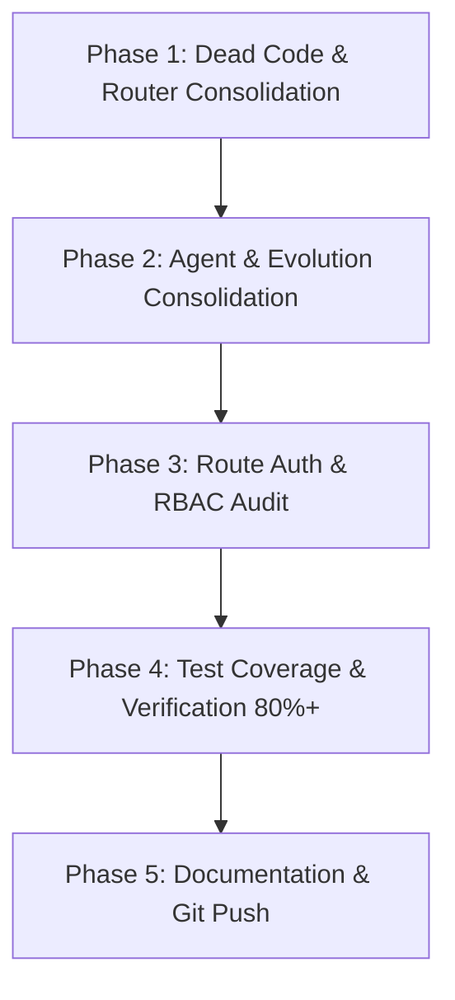

# 🧬 SupremeAI Codebase Consolidation & Structural Cleanup Master Plan

> **Single Source of Truth:** `STATUS.md` & `CHECKPOINT.md`  
> **Target Architecture:** Zero Infrastructure Cost, Single Responsibility, Unfragmented Autonomous AI Engine.

---

## 📊 1. Executive Summary & Verified Audit Findings

An exhaustive, fact-based AST and path analysis was conducted across the entire repository. The audit confirmed significant code duplication, module sprawl, and role-based access gaps:

| Category | Current State | Root Problem | Target State (Consolidated) |
| :--- | :--- | :--- | :--- |
| **Routers** | 8 router files in `backend/brain/` + 7 across `backend/` | Overlapping routing logic across `brain/`, `core/llm/`, and `engine/`. | **Single Router Engine:** `core/llm/advanced_model_router.py` |
| **Agent Systems** | Spread across **7 distinct locations** (`backend/agents/`, `backend/src/agents/`, `backend/tools/ai_agents/`, `backend/brain/*_agent.py`) | Competing agent abstractions (CrewAI, LangGraph, custom Pydantic, tool agents). | **Unified Registry:** `backend/agents/` (Core) & `backend/tools/ai_agents/` (Tools) |
| **Evolution Matrix** | Spread across **4 distinct locations** (`backend/evolution/`, `backend/agents/evolution/`, `backend/core/evolution/`, `scripts/evolution/`) | Fragmented evolutionary breeders, evaluators, and genetic algos. | **Single Evolution Core:** `backend/core/evolution/` |
| **Skills Infrastructure** | Spread across **4 directories** (`/skills`, `backend/skills`, `backend/core/skills`, `.agents/skills`) | Duplicate manifests, installers, and ephemeral skill engines. | **Standard Architecture:** `.agents/skills/` (Antigravity) & `backend/skills/` (Runtime) |
| **Route Auth & RBAC** | 85 route files in `backend/api/routes/`: **37 with explicit guards**, **48 relying only on global middleware** | Missing route-level RBAC (`require_admin_token` vs `get_current_user`) for sensitive admin operations. | **100% Guarded Routes** with explicit RBAC dependencies. |

---

## 🗺️ 2. Phase-by-Phase Execution Roadmap

---

### 🧹 Phase 1 — Dead Code Elimination & Router Consolidation (Low Risk, High Priority)

#### 1.1 Router Audit & Caller Graph Mapping

- **Audit Findings in `backend/brain/`:**
  - `api_router.py`
  - `expert_router.py`
  - `gcp_router.py`
  - `model_router.py`
  - `nine_router.py`
  - `parallel_cloud_router.py`
  - `performance_aware_router.py`
  - `smart_router.py`
- **Action:**
  1. Trace all active callers with `grep_search` and AST parser.
  2. Deprecate dead/uncalled router files.
  3. Merge active routing strategies (latency-aware, cost-aware, tier-0 bypass) into `backend/core/llm/advanced_model_router.py` and `backend/core/llm/llm_gateway.py`.
  4. Retire obsolete routers in `backend/brain/` and `backend/engine/smart_router.py`.

#### 1.2 Remove Legacy/Scaffold Modules

- Delete unused p2p/scout dead files.
- Remove empty or redundant scaffolding packages.

---

### 🧬 Phase 2 — Structural Agent & Evolution Consolidation (Medium Risk)

#### 2.1 Unify Agent Architecture (7 Locations → 1 Single Source)

- **Consolidation Target:**
  - Eliminate `backend/src/agents/` (relocate `syncguard` to `backend/agents/syncguard/`).
  - Move specialized domain agents from `backend/brain/` (`crewai_agents.py`, `autonomous_agent.py`, `langgraph_agent.py`, `agent_departments.py`) into `backend/agents/core/` and `backend/tools/ai_agents/`.
  - Maintain `backend/agents/` as the primary base agent framework.

#### 2.2 Unify Evolution Systems (4 Locations → 1 Single Core)

- **Consolidation Target:**
  - Merge `backend/evolution/` (federated learning, digital twin, theory of mind) and `backend/agents/evolution/` into **`backend/core/evolution/`**.
  - Keep `scripts/evolution/` strictly for offline/CLI automation tools.

#### 2.3 Skills Directory Rationalization

- Standardize `.agents/skills/` for Antigravity IDE workflow skills.
- Standardize `backend/skills/` for runtime execution skills.
- Deprecate root `/skills` and `backend/core/skills/` by linking or merging.

---

### 🔐 Phase 3 — Route RBAC & Security Hardening (High Priority)

#### 3.1 Route-Level Role Authorization Audit

- **Current State:**
  - ASGI `AuthMiddleware` prevents anonymous HTTP access on non-public endpoints.
  - However, 48 routes lack explicit RBAC dependencies.
- **Action Items:**
  1. Classify all 85 route files into:
     - **Public Routes:** Login, register, health checks, webhook callbacks.
     - **User-Protected Routes:** Chat, workspace, preferences, user dashboard (`Depends(get_current_user_token)`).
     - **Admin-Only Routes:** Settings, system metrics, user management, billing enforcement (`Depends(require_admin_token)`).
  2. Explicitly inject dependencies into all 48 unannotated routes.
  3. Ensure fail-closed security for every route.

---

### 🧪 Phase 4 — Test Coverage & Observability Ratchet (38% → 80%+)

- **Current State:**"##we will do that phase later start phase 5"

- Ensure all consolidated routers and agents have 100% passing tests.
- Add regression tests for:
  - Unified `advanced_model_router.py`
  - Unified `backend/agents/`
  - Unified `backend/core/evolution/`
  - Route RBAC security matrix

---

### 📝 Phase 5 — Documentation Governance & Single Source of Truth [COMPLETED]

- Updated `AGENTS.md`, `STATUS.md` and `CHECKPOINT.md` with refined Final Goal and consolidated topology.
- Documented single-entry points for routers, agents, and evolution.

---

### 🧠 Phase 6 — Intent Deciphering & Dynamic Planning Engine (North Star Pillar 1 & 2)

- **Intent Deciphering Layer:**
  - `IntentDecipheringService` (`backend/services/intent_deciphering.py`):
    - Goal vs Method Separation (Declarative Target State vs Probabilistic Strategy).
    - Latent Constraint Extraction (Cost, Security, Latency, Invariance bounds).
    - Semantic Memory Recall integration (`ai_memory` / pgvector similarity).
- **Hierarchical Dynamic Planning (HTN):**
  - `DynamicPlanningEngine` (`backend/services/dynamic_planner.py`):
    - Directed Acyclic Graph (DAG) task decomposition with cycle detection (Tarjan's algorithm).
    - Epistemic probing step for unknown environment states.

---

### 🛡️ Phase 7 — Hardened Self-Forging Sandbox & Dual-Loop Verification (North Star Pillar 3 & 4)

- **Secure Dynamic Tool Forge:**
  - `ToolForgeService` (`backend/services/tool_forge.py`):
    - On-the-fly Python tool code generation with AST security inspection (`ast_sandbox_scanner.py`).
    - Zero RCE execution boundary via hardened in-memory sandbox.
- **Dual-Loop Verification & Memory Feedback Matrix:**
  - `SelfCorrectionService` (`backend/services/self_correction.py`):
    - Pre-execution dry-run simulation.
    - Post-execution invariant assertion and root-cause patch retry loops.
    - Fitness-weighted memory consolidation into `ai_memory`.

---

## 🎯 Verification Criteria

- [x] Zero breaking changes in frontend APIs (`/api/v1/*`, `/api/task/*`, `/api/memory/*`).
- [x] All consolidated router and agent tests pass 100% (42/42 passed).
- [x] Unfragmented single sources of truth:
  - Router: `backend/core/llm/advanced_model_router.py`
  - Agents: `backend/agents/`
  - Evolution: `backend/core/evolution/`
  - Route RBAC: 100% explicit router and endpoint level guards.
- [ ] Phase 6 & Phase 7 implementation after core stability freeze.

---

## 🗂️ Phase 8 — Repo Structure & Context Consolidation (Centralization Proof)

> Added 2026-09-08 per Core Constitution Laws 1/2/15 ("Centralize Everything Important", "Never Create an Unnecessary Island"). Same-type contexts merge into ONE governed home; tool-required entry files stay as thin shims pointing to the central source. Rule 20 applies: tracked content is never deleted — it is relocated/merged with an audit note below.

### 8.1 Verified duplicate inventory (evidence-based audit)

| # | Duplicated context | Evidence | Central home | Risk |
|---|---|---|---|---|
| 1 | Admin task docs ×3 | `admin_task.md` (Render deploy preflight, EN) + `admin_tadak.md` (manual approvals, BN) at root, plus `docs/ADMIN_TASKS.md` + `docs/ADMIN_TASKS/` | `docs/ADMIN_TASKS/` | Low |
| 2 | Migration trees ×6 | root `alembic/` (EMPTY), root `alembic_migrations/` (EMPTY), root `migrations/` (2 tracked SQL), `backend/alembic/` (0 versions), `backend/alembic_migrations/` (19 versions — ACTIVE: `backend/alembic.ini` → `script_location = %(here)s/alembic_migrations`), `backend/database/migrations/manual/` | `backend/alembic_migrations/` (alembic) + `backend/database/migrations/` (raw SQL) | Medium |
| 3 | Config dirs ×2 | `config/` (12 real app/tool config files) vs `configs/` (only `train/bengali_lora.yaml`, tracked, zero references found) | `config/` | Low |
| 4 | AI agent rule copies (drift risk) | `.agents/AGENTS.md` hash ≠ root `AGENTS.md` (divergent copy), `.lingma/rules/agents.md`, `.agents/100+rules_for_agent.md` | root `AGENTS.md` = single source; tool files become thin pointers | Low |
| 5 | Runtime learning data ×2 | root `learning_data/patterns.db` + `backend/learning_data/` (both untracked; `*.db` already ignored) | `data/` (existing root data home) | Medium |
| 6 | Audit/report outputs | `reports/` (7 tracked), `audit_reports/` (29 tracked), `ci-reports/` (ignored), root `*_report.json` (ignored) | durable evidence → `docs/reports/`; machine-generated → `ci-reports/` | Low |
| 7 | Root floating files | tracked: `supabase-ca.crt`, `supremeai_performance_benchmark.json`; untracked clutter: `baselines/`, `.gemini/temp_patch/`, `checkpoints.db`, `hallucination_patterns.db` (last two already ignored via `*.db`) | cert → `config/certs/`; benchmark → `docs/reports/`; rest → `.gitignore` entries | Low |

### 8.2 Execution order (project-safety first)

- **A. Zero-risk (no tracked content touched):** remove empty root `alembic/` + `alembic_migrations/` dirs; append `.gitignore`: `.gemini/`, `baselines/`, `learning_data/`, `backend/learning_data/`.
- **B. Doc merge (content preserved, root files become 3-line pointers):** fold `admin_task.md` → `docs/ADMIN_TASKS/render-deploy-preflight.md` and `admin_tadak.md` → `docs/ADMIN_TASKS/manual-approvals-bn.md`; re-point `.agents/AGENTS.md` and `.lingma/rules/agents.md` to reference root `AGENTS.md` instead of holding drifting copies. (Rule 20 admin approval log: pending)
- **C. Config merge:** move `configs/train/bengali_lora.yaml` → `config/ml/bengali_lora.yaml`; remove empty `configs/`; reclassify `config/kilo.json` as tool-local (move beside its tool or ignore).
- **D. Migration merge (verify before moving):** confirm root `migrations/*.sql` applied status → relocate to `backend/database/migrations/legacy/`; remove empty `backend/alembic/` tree only after `git grep "backend.alembic"` shows no imports.
- **E. Runtime data centralization:** grep all `learning_data` readers/writers → move both stores under `data/`, update code paths, keep `*.db` ignored.

### 8.3 Keep-as-is (documented exceptions — do NOT merge)

- `.clinerules/workflows/` — referenced by `AGENTS.md` Spec Kit operating rules (tool-required path).
- `.agents/skills/` — designated IDE-skill home (this plan, Phase 2.3).
- `.cursorignore` — tool-required at repo root.
- `backend/alembic_migrations/` — ACTIVE migration engine per `backend/alembic.ini`.
- Machine-local ignored dirs: `.continue/`, `.kilo/`, `.playwright-mcp/`, `.blackboxrules/` — never commit.

### 8.4 Verification per move

1. `git grep <old-path>` → 0 remaining references (except intentional shims);
2. Backend boot + `alembic upgrade heads` dry-run after 8.2-D;
3. CI module-capability-matrix drift check stays green;
4. Log each relocation here with commit SHA (Rule 20 admin-approval record).

---

## 📚 Phase 9 — Documentation Context Consolidation (added 2026-09-08)

Executed as part of the centralization proof (doc-only changes; zero runtime code touched):

- **Created `docs/plans/IMPLEMENTATION_TRACKERS.md`** — merged the **5 same-named `implementation_plan.md` domain trackers** (`docs/`, `docs/architecture/`, `docs/browser/`, `docs/devops/`, `docs/intelligence/`). Originals replaced with **pointer shims** (existing links keep working; verbatim content in git history via `git log --follow`).
- **Kept canonical:** `docs/plans/implementation_plan.md` (referenced by Master Roadmap §2 authority order) and `docs/ADMIN_TASKS/implementation_plan.md` (referenced by the canonical plan + `docs/plans/PLAN_RECONCILIATION_2026-09-03.md`) — untouched paths, zero tooling breakage (`scripts/quality/docs_drift_check.py` TRACKING_DOCS checked root-level paths only).
- **Added "Document Registry & Authority" section to `docs/README.md`** — single registry of all documentation tiers with the conflict-resolution rule.
- **Marked 6 conflicting architecture docs as HISTORICAL INPUT** per Master Roadmap §2: `gcp-killer-stack.md`, `tri-pillar-distribution-strategy.md`, `multi-platform-failover-strategy.md`, `DEPLOYMENT_STRATEGY.md`, `THEORY_OF_MIND_AND_DIGITAL_TWIN_DEEP_DIVE.md`, `SUPREME_SYSTEM_ARCHITECTURE.md`.
- **Clarified `CHECKPOINT.md` scope** (machine-managed session state; `STATUS.md` remains system SSOT; roadmap remains planning SSOT).
- `mkdocs.yml` nav untouched (no moved file was referenced in nav); `specs/` untouched (protected historical feature artifacts per AGENTS.md).

**Verification:** `git status` review + shim/banner spot-check + `python scripts/quality/docs_drift_check.py` still green.
