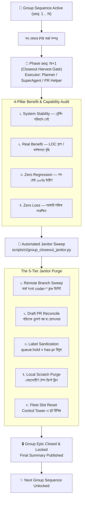

# OPS-09 — Post-Group Repository Hygiene & Autonomous Janitor Protocol (Zero-Debris Standard)

> **ডকুমেন্ট আইডি:** OPS-09 · **স্ট্যাটাস:** সক্রিয় (ACTIVE) · **ভার্সন:** ১.০ (২০২৬-০৯)  
> **প্রযোজ্য:** সুপ্রিমএআই প্ল্যাটফর্মের মাল্টি-এজেন্ট ফ্লিট, প্ল্যানার/সুপার-এজেন্ট, PR Helper এবং CI/CD কনস্টিটিউশন।  
> **মূল রেফারেন্স:** [`ARCH-01`](ARCH-01-MASTER_CONSTITUTION.md) · [`OPS-05`](OPS-05-PR-HELPER-LIFECYCLE.md) · [`OPS-06`](OPS-06-MULTI-AGENT-BRANCHING-LIFECYCLE.md) · [`OPS-07`](OPS-07-DEVELOPER-AGENT-LIFECYCLE.md) · [`AGENTS.md`](../../AGENTS.md) (Protocol 9)

---

## 🎯 ১. উদ্দেশ্য ও দর্শন (Core Philosophy)

সুপ্রিমএআই প্ল্যাটফর্মে যখন মাল্টি-এজেন্ট ফ্লিট (Coder, Planner, Guardian, PR-Helper) কোনো নির্দিষ্ট গ্রুপ সিকোয়েন্স (যেমন `group:step-1`, `group:step-2`) সম্পন্ন করে, তখন ব্যাকগ্রাউন্ডে প্রচুর ট্রানজিশনাল বা সাময়িক অবশিষ্টাংশ (debris/clutter) তৈরি হয়। যদিও এগুলো প্ল্যাটফর্ম রানটাইম নষ্ট করে না, কিন্তু এটি রিপোজিটরিকে নোংরা করে, স্লট অ্যালোকেশন বিভ্রান্ত করে, CI বিলিং কোটা নষ্ট করে এবং প্রজেক্টের শৃঙ্খলা নষ্ট করে।

> 🛡️ **Zero-Debris Invariant (শূন্য-আবর্জনা নীতি):**  
> একটি গ্রুপ তখনই আনুষ্ঠানিকভাবে "Closed" ঘোষিত হবে, যখন তার কোডের ১০১% লাভ অডিট সম্পন্ন হবে **এবং** রিপোজিটরি থেকে সব ধরনের ট্রানজিশনাল ব্রাঞ্চ, ড্রাফট ও সাময়িক লেবেল আয়নার মতো পরিষ্কার করা হবে।

---

## 🗺️ ২. গ্রুপ সমাপ্তি ও ক্লিনিং লাইফসাইকেল (Execution Pipeline)



---

## 📋 ৩. গ্রুপ শেষে তৈরি হওয়া ৭টি প্রধান আবর্জনা ও তাদের সমাধান (The 7 Clutter Vectors)

| নং | আবর্জনার ধরন (Vector) | কেন তৈরি হয়? (Root Cause) | রিপোজিটরিতে ক্ষতিকর প্রভাব | Janitor স্বয়ংক্রিয় সমাধান |
| :--- | :--- | :--- | :--- | :--- |
| **১** | **Stale Remote Branches** (`coder-*`, `agent-*`) | PR মার্জ হলেও remote `origin`-এ ব্রাঞ্চ স্বয়ংক্রিয়ভাবে প্রুন না হওয়া। | শত শত শাখা জমে ব্রাঞ্চ তালিকা ভারী হয়; `acquire_role_slot.py` ফ্রি স্লট বের করতে কনফিউজ হয়। | মার্জড PR-এর remote tracking branch মুছে দিয়ে `git fetch origin --prune` চালানো। |
| **২** | **Dangling / Abandoned Draft PRs** | ভবিষ্যতের সিকোয়েন্সের জন্য আগেভাগে খোলা ড্রাফট PR বা বাতিল বিকল্প PR খোলা থাকা। | ওপেন PR লিস্ট বড় হয় এবং কোডাররা ভুল ব্র্যাঞ্চের ওপর ডিপেন্ডেন্সি তৈরি করে। | সংশ্লিষ্ট গ্রুপের সব ড্রাফট অডিট করে সুপারসিডেড হলে উপযুক্ত কমেন্টসহ ক্লোজ করা। |
| **৩** | **Temporary Lifecycle Labels** (`queue:hold`, `has-pr`) | সারির শৃঙ্খলা ও মার্জ ট্রেনের ট্রাফিকের জন্য সাময়িক লেবেল দেওয়া হয়েছিল। | ইস্যু ক্লোজ হওয়ার পরও মেট্রিক্স ও ফিল্টারিংয়ে stale ডেটা শো করে। | ক্লোজ হওয়া ইস্যু/PR থেকে `queue:hold`, `queue:pending-rollup`, `has-pr` মুছে ফেলা। |
| **৪** | **Bot Noise / Comment Spam** | প্রতিটি ইস্যুতে বটের বহুবিধ লগ (heartbeat, file claims, collision warnings)। | আসল প্রযুক্তিগত সিদ্ধান্ত ও আলোচনার কনটেক্সট বটের লগে হারিয়ে যায়। | মূল গ্রুপ এপিক ইস্যুতে একটি সুবিন্যস্ত সারসংক্ষেপ রেখে অপ্রয়োজনীয় ডুপ্লিকেট বট স্ট্যাটাস মিনিমাইজ করা। |
| **৫** | **Accumulated CI Storage Artifacts** | প্রতিটি পিআর রানে তৈরি টেস্ট এভিডেন্স, ট্রিভি স্ক্যান ও ডায়াগনস্টিকস। | GitHub Actions-এর ফ্রি স্টোরেজ কোটা ও বিলিং নষ্ট করে। | রিটেনশন পলিসি প্রয়োগ এবং ক্লোজড পিআর-এর ভারী আর্টফ্যাক্ট ডিলিট করা। |
| **৬** | **Orphaned Fleet Leases** | এজেন্ট সেশন শেষ করলেও কন্ট্রোল প্লেনে স্লট লিজের স্ট্যাটাস `online` থেকে যাওয়া। | পরবর্তী সেশনের এজেন্টরা মনে করে স্লটটি এখনো কেউ দখল করে রেখেছে। | Control Tower ও Redis-এ গ্রুপের এজেন্টের স্ট্যাটাস `idle/available` রিসেট করা। |
| **৭** | **Local Scratch & Untracked Residue** | ডেভেলপমেন্টের সময় লোকাল মেশিনে `scratch/*.py`, `temp_*.json` ফাইল তৈরি হওয়া। | `git status` নোংরা থাকে এবং নতুন ব্রাঞ্চ কাটার সময় সংঘর্ষ তৈরি করে। | লোকাল স্ক্র্যাচ স্ক্রিপ্টগুলোকে আর্কাইভ করা বা মুছে দিয়ে লোকাল গিট ক্লিন রাখা। |

---

## 🛠️ ৪. স্বয়ংক্রিয় ক্লিনার ইঞ্জিন স্পেসিফিকেশন (`group_closeout_janitor.py`)

গ্রুপ ক্লোজআউটের সময় SuperAgent বা PR Helper সরাসরি এই স্ক্রিপ্টটি রান করবে:

```bash
python scripts/ci/group_closeout_janitor.py --group step-2
```

### প্রধান কমান্ড ফ্ল্যাগসমূহ (CLI Parameters):
* `--group <name>`: নির্দিষ্ট গ্রুপের নাম (যেমন `step-2`, `step-3`)।
* `--dry-run`: কোনো পরিবর্তন না করে শুধু কী কী ক্লিন করা হবে তার অডিট রিপোর্ট প্রিন্ট করে।
* `--purge-branches`: শুধুমাত্র মার্জড remote ব্রাঞ্চ ডিলিট করে।
* `--clean-labels`: ক্লোজড ইস্যুতে থাকা ট্রানজিশনাল লেবেল পরিষ্কার করে।
* `--reconcile-drafts`: গ্রুপের আনমার্জড ড্রাফট PR চিহ্নিত ও ক্লোজ করে।
* `--clean-scratch`: লোকাল `scratch/` ডিরেক্টরি পরিষ্কার করে।

---

## 🔒 ৫. সেফটি ও প্রটেকশন রুলস (Safety Invariants)

ক্লিন করার সময় ক্লিনার স্ক্রিপ্টকে অবশ্যই নিম্নলিখিত সেফগার্ডগুলো মেনে চলতে হবে:
1. **Protected Branch Immunity:** `main`, `master`, `production`, `staging` কখনো ডিলিট করা যাবে না।
2. **Active PR Protection:** কোনো ব্রাঞ্চের যদি ওপেন নন-ড্রাফট PR থাকে, তবে সেই ব্রাঞ্চ কোনো অবস্থাতেই ডিলিট করা নিষিদ্ধ।
3. **Audit Evidence Preservation:** পিআর বা ইস্যুর আসল টেস্ট এভিডেন্স ও কনস্টিটিউশনাল ডিসিশন কোনো কমেন্ট ক্লিনারের মাধ্যমে ডিলিট করা যাবে না।
4. **Local Main Sync:** Janitor সফলভাবে সম্পন্ন হওয়ার পর লোকাল রিপোজিটরিতে `git fetch origin --prune` নিশ্চিত করতে হবে।

---

## 📈 ৬. কনস্টিটিউশন ও AGENTS.md-এর সাথে সংযোগ

Protocol 9 (Group Closeout Harvest & Benefit Gate)-এর সাথে এই প্রোটোকল সরাসরি যুক্ত। যখন কোনো গ্রুপের `seq: N+1` কাজ শুরু হবে:
1. প্রথমে ৪-পিলার রুব্রিক অনুযায়ী সক্ষমতা ও কোড যাচাই।
2. তারপর Janitor Protocol অনুযায়ী রিপোজিটরি সম্পূর্ণ ক্লিন করা।
3. উভয় পদক্ষেপ সফল হলেই কেবল পরবর্তী গ্রুপের কাজ আনব্লক হবে।
