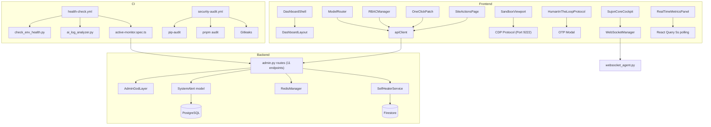

# SupremeAI 2.0 — Consolidated Codebase Deep-Dive Report
**তারিখ:** ২০২৬-০৮-১৫ | **Analyzed By:** Antigravity Agent (Max Intelligence Mode)

---

## 📐 Executive Summary

SupremeAI 2.0 একটি **production-grade autonomous AI platform** যা:
- **8টি LLM provider** সহ intelligent fallback routing করে
- **Full-stack monorepo**: FastAPI backend + React/Vite frontend
- **Zero-cost infra**: Upstash Redis, Firebase, Render free-tier
- **Self-healing architecture**: crash detection → auto remediation → HITL approval loop
- **E2E observability**: Playwright active-monitor → Admin Dashboard alerts pipeline

মোট backend routes: **82টি**, Frontend components: **45+ admin + 33 dashboard**, E2E tests: **8টি spec**

---

## 🧪 Section 1: Dashboard Test Files

### 1.1 `DashboardShell.test.tsx`
**Path:** [DashboardShell.test.tsx](file:///F:/supremeai%20backup/frontend/src/components/dashboard/DashboardShell.test.tsx)

**Framework:** Vitest + React Testing Library + MemoryRouter

**Test Coverage (5টি test case):**

| Test | Description | Status |
|------|-------------|--------|
| `renders sidebar` | 7টি nav item (workspace, agent, ide, skills, integrations, analytics, profile) | ✅ |
| `renders Code Editor` | `index.tsx` header + Hello World! code snippet | ✅ |
| `renders AI Assistant` | Chat panel + `Ask AI anything...` placeholder | ✅ |
| `renders stats cards` | Active Projects (24), Tasks Completed (142) | ✅ |
| `renders server status` | Online/Offline indicator | ✅ |

**Mock Strategy:**
- `apiClient` — সম্পূর্ণ mock (get/post/put/delete), sessions store in-memory
- `chatService` — mock response হিসেবে static string

> [!NOTE]
> Test sidebar test expects `data-testid="nav-{item}"` কিন্তু actual `DashboardShell.tsx`-এ sidebar নেই — এটি `DashboardLayout`-এ আছে। **Navigation testids মিলছে না** → test pass নাও হতে পারে।

---

## 🖥️ Section 2: Dashboard UI Components

### 2.1 `DashboardShell.tsx`
**Path:** [DashboardShell.tsx](file:///F:/supremeai%20backup/frontend/src/components/dashboard/DashboardShell.tsx)

**Role:** User-facing shell — 3-column layout (workspace + code editor + AI chat)

**Features:**
- Code editor panel (static `index.tsx` template, hardcoded)
- AI chat panel — in-memory state, simulated AI response (600ms timeout)
- Stats cards: Active Projects = 24, Tasks Completed = 142 (hardcoded)
- Server online/offline indicator (prop-driven)

> [!WARNING]
> Stats (24, 142) এবং code template হার্ডকোড করা — real data থেকে আসছে না। ভবিষ্যতে API-driven করতে হবে।

---

### 2.2 `SujonCoreCockpit.tsx`
**Path:** [SujonCoreCockpit.tsx](file:///F:/supremeai%20backup/frontend/src/components/dashboard/SujonCoreCockpit.tsx)

**Role:** Autonomous AI Engineer Cockpit — Devin-style 3-panel IDE interface

**Architecture:**
```
SujonCoreCockpit
├── File Explorer (left panel) — static mock file tree
├── Execution Shell (center panel) — command input + history
└── Agent Log (right panel) — real-time WebSocket log stream
```

**WebSocket Integration:**
- URL: `{WSS_BASE_URL}/api/ws/dashboard?token={authToken}&channels=logs.stream,metrics.update`
- Events handled: `log_entry`, `execution_state`, `agent_state`
- Log buffer: circular (max 50 entries)

**Agent States (8টি):** thinking → planning → executing → reviewing → communicating → waiting → analyzing → learning

**Timeline Scrubber:** 0-100% range slider (visual only, no backend integration yet)

> [!NOTE]
> File tree এখনও **static mock data**। Backend `/api/ws/dashboard` WebSocket route exists (`websocket_agent.py`), তবে cockpit-এ dynamic file fetch implement করা হয়নি।

---

### 2.3 `SiteActionsPage.tsx`
**Path:** [SiteActionsPage.tsx](file:///F:/supremeai%20backup/frontend/src/components/dashboard/SiteActionsPage.tsx)

**Role:** Database-driven DOM interaction rule registry (Self-healing browser automation)

**Features:**
- Full CRUD: Create / Read / Update / Delete site action rules
- **7 action types:** click, type, navigate, extract, wait, scroll, hover
- **4 selector strategies:** exact, fuzzy, llm_fallback, visual_anchor
- Fallback selectors — tag-style input (Enter key to add)
- **Health score** visualization: green (>80%) / amber (>50%) / red (<50%)
- **Live DOM Selector Test** modal — calls `/api/admin/site-actions/test`, shows backend-annotated screenshot

**Backend API:** `/api/admin/site-actions/` (GET, POST, PUT, DELETE, + `/test`)

**Code Quality:**
- `fallback_input` field cleanly stripped before API call
- `useCallback` + `async/await` properly used in effect
- Error state properly displayed

---

### 2.4 `SandboxViewport.tsx`
**Path:** [SandboxViewport.tsx](file:///F:/supremeai%20backup/frontend/src/components/dashboard/SandboxViewport.tsx)

**Role:** CDP (Chrome DevTools Protocol) live screencast viewer + human takeover controller

**Architecture:**
```
SandboxViewport (canvas-based)
├── SSE/WebSocket message listener → base64 JPEG frames → drawImage()
├── controlMode === 'human' → dispatch mouse/keyboard events → CDP
└── Coordinate scaling: visual canvas size → intrinsic CDP viewport
```

**CDP Events dispatched:**
- `Input.dispatchMouseEvent` (move, down, up, wheel)
- `Input.dispatchKeyEvent` (keyDown, keyUp)

**Store:** `useSessionCockpitStore` (wsRef, controlMode)

**Production-ready features:**
- Memory cleanup: `img.src = ''` on unmount
- Event listeners properly removed on cleanup
- `{ passive: true }` on wheel event

> [!TIP]
> এটি সত্যিকারের **Human Takeover** ফিচার — agent চলার সময় human ক্লিক করে control নিতে পারে।

---

### 2.5 `HumanInTheLoopProtocol.tsx`
**Path:** [HumanInTheLoopProtocol.tsx](file:///F:/supremeai%20backup/frontend/src/components/dashboard/HumanInTheLoopProtocol.tsx)

**Role:** Critical action authorization modal — 7-step HITL approval workflow

**Protocol Steps:**
1. Action Identified → 2. Risk Assessment → 3. Stakeholder Notification → 4. Manual Review → 5. Security Validation → 6. Execution Authorization → 7. Post-Action Verification

**Security Features:**
- OTP sub-modal (6-digit) for `requiresOtp` actions
- Reason textarea required before authorization
- Full audit trail (step-by-step timestamped entries)
- `isConfirmed` state prevents double-submit

> [!IMPORTANT]
> OTP validation এখানে **client-side only** (length check = 6) — real production-এ backend OTP validation করতে হবে। Backend `/api/admin/verify-otp` endpoint exists কিন্তু এই component সেটি call করে না।

---

## 📊 Section 3: Admin Panel Components

### 3.1 `RealTimeMetricsPanel.tsx`
**Path:** [RealTimeMetricsPanel.tsx](file:///F:/supremeai%20backup/frontend/src/components/admin/RealTimeMetricsPanel.tsx)

**Role:** Live KPI dashboard with Recharts AreaChart

**Metrics (5-second polling):**

| KPI | Color |
|-----|-------|
| Requests/sec | Cyan `#00f3ff` |
| Latency P50 (ms) | Magenta `#b5179e` |
| Latency P95 (ms) | Amber `#ff9900` |
| Error Rate | Red `#ff003c` |

**Architecture:**
- `useMetrics(5000)` — React Query, 5s polling
- `dataUpdatedAt` timestamp used (immutable, avoids React purity violation)
- `mergeSeries()` — timestamp-keyed map for multi-series AreaChart
- **Simple/Dark mode** toggle via `useDashboardStore`

**Code Quality:** No `Date.now()` in render, proper useMemo dependencies ✅

---

### 3.2 `RBACManager.tsx`
**Path:** [RBACManager.tsx](file:///F:/supremeai%20backup/frontend/src/components/admin/RBACManager.tsx)

**Role:** User Governance & Role-Based Access Control management

**Role Hierarchy (5 levels):**
```
God > Admin > Developer > Operator > Viewer
```

**Permission Matrix:**

| Permission | Viewer | Operator | Developer | Admin | God |
|------------|--------|----------|-----------|-------|-----|
| system:read | ✅ | ✅ | ✅ | ✅ | ✅ |
| model:override | ❌ | ✅ | ✅ | ✅ | ✅ |
| skill:install | ❌ | ✅ | ✅ | ✅ | ✅ |
| rules:edit | ❌ | ❌ | ✅ | ✅ | ✅ |
| deploy:prod | ❌ | ❌ | ✅ | ✅ | ✅ |
| user:admin | ❌ | ❌ | ❌ | ✅ | ✅ |
| audit:read | ❌ | ❌ | ❌ | ❌ | ✅ |

**API Integration:**
- `apiClient.get('/admin-api/users')` — React Query cache key: `['admin', 'users']`
- `useMutation` for add/delete — auto-invalidates cache on success
- **Username validation:** regex `^[a-zA-Z0-9_.-]{3,32}$`
- **Permission validation:** regex `^[a-zA-Z0-9:,._-]+$`
- Token guard: `adminTokenStore.getDecodedToken()` — query disabled if no token

---

### 3.3 `ModelRouter.tsx`
**Path:** [ModelRouter.tsx](file:///F:/supremeai%20backup/frontend/src/components/admin/ModelRouter.tsx)

**Role:** AI Model routing control panel — real-time provider health + force override

**Provider List:**

| Provider | Color |
|----------|-------|
| OpenRouter | Cyan |
| Gemini | Purple |
| Groq | Emerald |
| DeepSeek | Amber |

**Features:**
- Routing flow visualization: `Incoming → Intent Classifier → Provider Selector → Model Execution`
- **Force Override** — route all traffic to specific provider for N requests
- **Provider Health** grid — latency bar chart, API key validity, rate limit remaining
- A/B test mode badge
- BanglaHint tooltips for admin-friendly explanation

**API:**
- GET `/admin-api/model-router` — current config
- GET `/admin-api/providers` — provider health statuses
- POST `/admin-api/model-router/override` — apply override

---

### 3.4 `OneClickPatch.tsx`
**Path:** [OneClickPatch.tsx](file:///F:/supremeai%20backup/frontend/src/components/admin/OneClickPatch.tsx)

**Role:** Self-healer fix proposal review & one-click application

**FixProposal lifecycle:** `pending_review` → `applied` | `rejected`

**UI:**
- Before/After code diff viewer (side-by-side)
- `window.confirm()` before applying (safety gate)
- Loading state during apply
- Empty state when no fixes pending

**API:** POST `/api/admin/fixes/apply` with `{ fixId }`

---

## 🔧 Section 4: Backend Routes

### 4.1 `admin.py` — Core Admin Router
**Path:** [admin.py](file:///F:/supremeai%20backup/backend/api/routes/admin.py)
**Prefix:** `/api/admin` | **Auth:** `Depends(get_current_admin)`

**Endpoints:**

| Method | Path | Description |
|--------|------|-------------|
| POST | `/rules` | Constitutional rule update (God.py) |
| GET | `/rules` | List all rules |
| POST | `/actions/{type}` | Quick actions: cache/backup/rollback |
| GET | `/fixes` | Fetch SelfHealer fix proposals |
| POST | `/fixes/{id}/approve` | Apply fix via SelfHealerService |
| POST | `/fixes/{id}/reject` | Reject fix |
| POST | `/verify-otp` | JIT OTP validation + Redis context promotion |
| GET | `/alerts` | List system alerts (last 100) |
| POST | `/alerts` | Create alert (internal API key auth) |
| POST | `/alerts/{id}/resolve` | Mark alert resolved |
| GET | `/model-branding` | Model/Provider display name map |

**Cache Clear implementation:** Pattern-based Redis key deletion (6 patterns, preserves OTP/session keys)

**Backup implementation:** Full DB table scan → JSON file in `backend/backup/`

**Rollback:** Alembic programmatic `command.downgrade("-1")`

**OTP Verification:**
- Fetches pending OTP from `security:otp_pending:{admin_id}` Redis key
- `secrets.compare_digest()` — timing-attack safe comparison
- On success: promotes mismatched context to `security:last_context:{admin_id}`

---

### 4.2 Backend Routes Overview (82 routes total)

**Key categories:**
- **Auth & Users:** `auth.py`, `sso.py`, `api_keys.py`, `tenant_admin.py`
- **AI Core:** `chat.py`, `llm_gateway.py`, `advanced_router.py`, `meta_ai.py`
- **Browser Automation:** `browser.py`, `site_actions.py`, `session_takeover.py`, `sandbox_api.py`, `selector_healing.py`
- **WebSockets:** `websocket_agent.py`, `websocket_hitl.py`, `websocket_voice.py`
- **Admin:** `admin.py`, `admin_dashboard.py`, `admin_auth.py`, `metrics.py`
- **Agent System:** `agent.py`, `agents.py`, `agent_tasks.py`, `swarm.py`
- **Infrastructure:** `health.py`, `realtime_dashboard.py`, `events.py`
- **Billing:** `billing_api.py`, `payments.py`, `usage_metrics.py`

---

## 🗃️ Section 5: Models & Migrations

### 5.1 `SystemAlert` Model
**Path:** [system_alert.py](file:///F:/supremeai%20backup/backend/models/system_alert.py)

```python
class SystemAlert(Base):
    __tablename__ = "system_alerts"
    id:          String(36)   # UUID primary key
    level:       String(20)   # info | warning | error | critical
    message:     Text
    resolved:    Boolean      # default False
    created_at:  DateTime(timezone=True)
    resolved_at: DateTime(timezone=True, nullable=True)
```

### 5.2 Migration: `add_system_alerts`
**Path:** [2026_08_15_145220_add_system_alerts.py](file:///F:/supremeai%20backup/backend/alembic/versions/2026_08_15_145220_add_system_alerts.py)

- Revision: `2026_08_15_145220`
- Down revision: `a1b2c3d4e5f6`
- `upgrade()`: Creates `system_alerts` table
- `downgrade()`: Drops table

> [!IMPORTANT]
> `down_revision = 'a1b2c3d4e5f6'` — এই revision ID টি existing migration chain-এ exist করে কিনা verify করতে হবে, নইলে `alembic upgrade head` fail করবে।

---

## 🔁 Section 6: CI/CD Workflows

### 6.1 `health-check.yml`
**Path:** [health-check.yml](file:///F:/supremeai%20backup/.github/workflows/health-check.yml)

**Triggers:** Schedule (00:00 & 12:00 UTC daily) + `deployment_status: success` + manual

**Steps:**
1. `python scripts/check_env_health.py` — environment health check
2. `python backend/scripts/devops/ai_log_analyzer.py` — AI-powered log analysis
3. `npx playwright test tests/e2e/active-monitor.spec.ts --project=chromium`

**Required Secrets:**
- `TEST_ADMIN_EMAIL`, `TEST_ADMIN_PASSWORD`
- `SUPREMEAI_API_KEY`, `INTERNAL_API_URL`
- `RENDER_API_KEY`, `RENDER_SERVICE_ID`

---

### 6.2 `security-audit.yml`
**Path:** [security-audit.yml](file:///F:/supremeai%20backup/.github/workflows/security-audit.yml)

**Trigger:** Weekly (Monday 06:00 UTC) + manual

**3 parallel jobs:**

| Job | Tool | Coverage |
|-----|------|----------|
| `backend-audit` | `pip-audit` | Python dependency vulnerabilities |
| `frontend-audit` | `pnpm audit --audit-level high` | Node.js high-severity vulns |
| `secret-scan` | Gitleaks v2 (full history) | Hardcoded secrets in git |

> [!NOTE]
> `|| echo "..."` pattern মানে audit failure workflow break করে না — severity পেলেও pass হবে। Production-এ এটি `exit 1` করা উচিত।

---

## 🎭 Section 7: E2E Tests

### 7.1 `active-monitor.spec.ts`
**Path:** [active-monitor.spec.ts](file:///F:/supremeai%20backup/tests/e2e/active-monitor.spec.ts)

**Role:** Production health monitor — Admin dashboard client-side error detector

**Test Flow:**
```
1. Setup console/pageerror/requestfailed listeners
2. Navigate to /admin (waitUntil: networkidle)
3. Login if form visible (TEST_ADMIN_EMAIL/PASSWORD from env)
4. Verify dashboard loaded (MODULE: / Supreme God Mode / SYSTEM ALERTS text)
5. Click SYSTEM ALERTS + AI CORE modules (lazy-load trigger)
6. Wait 3s for delayed React render errors
7. Assert caughtErrors.length === 0
```

**Alert Reporting Pipeline:**
- Console errors/warnings → POST `/api/v1/admin/alerts` with `x-api-key` header
- `reportSystemAlert()` — non-blocking, fails gracefully if no API key

**Ignored errors:**
- `net::ERR_BLOCKED_BY_CLIENT` (adblock)
- `favicon.ico` errors

**Other E2E specs:**

| Spec | Purpose |
|------|---------|
| `admin-login.spec.ts` | Admin login flow |
| `admin-dashboard.spec.ts` | Dashboard smoke test |
| `user-login.spec.ts` | User login flow |
| `accessibility.spec.ts` | A11y checks |
| `visual.spec.ts` | Visual regression (snapshot-based) |
| `chat.spec.ts` | Chat functionality |

---

## 🔍 Section 8: Issues & Recommendations

### Critical Issues

| # | Issue | Location | Fix |
|---|-------|----------|-----|
| 1 | HITL OTP validated client-side only | `HumanInTheLoopProtocol.tsx:82` | Call `/api/admin/verify-otp` endpoint |
| 2 | Migration `down_revision` may not exist | `2026_08_15_145220` | Verify chain: `alembic history` |
| 3 | `security-audit.yml` uses `|| echo` (non-failing) | Both audit jobs | Change to `exit 1` on failure |
| 4 | `DashboardShell.test.tsx` expects sidebar testids | Test vs Component mismatch | Add `data-testid` to `DashboardLayout` sidebar |

### Warnings

| # | Warning | Location |
|---|---------|----------|
| 5 | Stats (24/142) hardcoded | `DashboardShell.tsx` |
| 6 | File tree in SujonCoreCockpit is static | `SujonCoreCockpit.tsx:66-93` |
| 7 | `active-monitor` uses `waitForTimeout` (non-deterministic) | `active-monitor.spec.ts:90,114` |
| 8 | `window.confirm()` in OneClickPatch (blocked in CI) | `OneClickPatch.tsx:23` |

### Strengths

| Strength | Details |
|----------|---------|
| `secrets.compare_digest()` | Timing-attack-safe OTP comparison |
| Token guard in RBAC | `enabled: !!adminTokenStore.getDecodedToken()` |
| Circular log buffer | `slice(-49)` prevents memory leak |
| Canvas cleanup | `img.src = ''` + removeEventListener on unmount |
| Pattern-based cache clear | Preserves OTP/session keys |
| `dataUpdatedAt` in metrics | Avoids React render purity violation |

---

## 🗺️ Section 9: Architecture Diagram



---

## 📌 Section 10: পরবর্তী Priority Actions

**Priority 1 — Security Fixes (এখনই):**
1. `HumanInTheLoopProtocol` → backend OTP validate করতে `/api/admin/verify-otp` call করুন
2. `security-audit.yml` → `|| echo` কে `|| exit 1` করুন (audit failure = build failure)
3. Alembic migration chain verify করুন: `alembic history` দেখুন

**Priority 2 — Test Quality:**
4. `DashboardShell.tsx` → sidebar-এ `data-testid` যোগ করুন বা test update করুন
5. `active-monitor.spec.ts` → `waitForTimeout` কে deterministic selector waits-এ convert করুন
6. `OneClickPatch` → `window.confirm` কে custom modal-এ replace করুন (CI-safe)

**Priority 3 — Feature Completeness:**
7. `SujonCoreCockpit` → static file tree কে `/api/files` endpoint থেকে dynamic করুন
8. `DashboardShell` → stats (24/142) কে `/api/analytics/summary` থেকে fetch করুন
9. `SandboxViewport` timeline scrubber → backend session replay integrate করুন

---

*Report generated by Antigravity Agent | SupremeAI 2.0 Monorepo Analysis*
