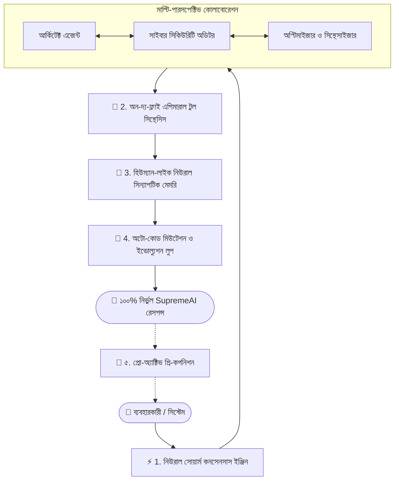

# 🚀 SupremeAI: আউট-অফ-দ্য-বক্স (Out-of-the-Box) রেভোলিউশনারি ব্লুপ্রিন্ট
## প্রথাগত এআই-এর গণ্ডি ভেঙে নতুন প্রজন্মের "Supreme Living Sovereign Intelligence"

> **কোর ফিলোসফি অক্ষুণ্ণ রেখে র‍্যাডিক্যাল ইনোভেশন:**  
> আমাদের সংবিধানের মূল নিয়ম—*“Centralize Everything Important”*, *“Use External Power Without Surrendering Control”*, *“Zero Local-Machine Dependency”* এবং *“Verify Before Trust”* বজায় রেখে এমন কিছু বৈপ্লবিক মেকানিজম যা বর্তমান ChatGPT, Claude বা Gemini-র মতো ফ্রন্টিয়ার এআই-ও করতে পারে না।

---

## ১. রেভোলিউশনারি পিলারসমূহ (আউট-অফ-দ্য-বক্স কনসেপ্ট)

---

### 💥 ১. মাল্টি-পারসপেক্টিভ "সোয়ার্ম কনসেনসাস" (Multi-Agent Swarm Consensus)
* **বর্তমান এআই-এর দুর্বলতা:** চ্যাটজিপিটি বা ক্লড একক মডেলে উত্তর দেয়। মডেলটির কোনো বিষয়ে বায়াস বা হ্যালুসিনেশন থাকলে ব্যবহারকারী ভুল উত্তর পায়।
* **SupremeAI-এর আউট-অফ-দ্য-বক্স সমাধান:**
  * একটি একক প্রম্পট আসার সাথে সাথে ব্যাকগ্রাউন্ডে ৩টি ভার্চুয়াল সাব-এজেন্ট জন্ম নেবে: **আর্কিটেক্ট**, **রেড-টিম (হ্যাকার/ক্রিটিক)** এবং **সিন্থেসাইজার**।
  * আর্কিটেক্ট সমাধান তৈরি করবে, রেড-টিম সেটির দুর্বলতা/বাগ খুঁজে আক্রমণ করবে, এবং সিন্থেসাইজার দুটির দ্বিমত দূর করে একটি অকাট্য, নিখুঁত কনসেনসাস উত্তর ব্যবহারকারীকে দেবে।
  * ব্যবহারকারী চোখের পলকে রেসপন্স পাবে, কিন্তু এর গভীরতা হবে সাধারণ এআই-এর চেয়ে বহুগুণ নিখুঁত।

---

### 🧪 ২. অন-দ্য-ফ্লাই এপিমারাল টুল সিন্থেসিস (Zero-Code Dynamic Sandbox Tooling)
* **বর্তমান এআই-এর দুর্বলতা:** কোনো নির্দিষ্ট টুল বা ইন্টিগ্রেশন না থাকলে সাধারণ এআই বলে দেয়: *"আমার কাছে এই টুলটি নেই"*, অথবা ডেভেলপারকে ম্যানুয়ালি কোড লিখে এপিআই যোগ করতে হয়।
* **SupremeAI-এর আউট-অফ-দ্য-বক্স সমাধান:**
  * যদি ব্যবহারকারী বলে: *"আমার এই অদ্ভুত ডাটা ফরম্যাট পার্স করে গ্রাফ বানাও এবং টেলিগ্রামে পাঠাও"*—SupremeAI কোনো পূর্বনির্ধারিত প্লাগিনের অপেক্ষা করবে না।
  * এটি ক্লাউড স্যান্ডবক্সে কয়েক মিলিসেকেন্ডে একটি **মাইক্রো-ফাংশন (Ephemeral Micro-Script)** কোড করবে, নিজের ইন-মেমোরি পাইথনে রান করে রেজাল্ট আনবে, এবং কাজ শেষ হলে কোডটি নিরাপদভাবে ধ্বংস (Garbage Collect) করে ফেলবে।
  * কোনো ডেভেলপার ইন্টারভেনশন ছাড়াই এটি যেকোনো আনকোরা কাজ নিজে নিজে টুল তৈরি করে সমাধান করতে সক্ষম।

---

### 🧠 ৩. মানুষের মতো "সিন্যাপটিক লার্নিং মেমরি" (Synaptic Dream Cycle)
* **বর্তমান এআই-এর দুর্বলতা:** এআই মেমরি বলতে বোঝায় সাধারণ টেক্সট ভেক্টর সার্চ (RAG), যা অপ্রাসঙ্গিক জিনিস টেনে আনে এবং টোকেন নষ্ট করে।
* **SupremeAI-এর আউট-অফ-দ্য-বক্স সমাধান:**
  * মানুষের মস্তিষ্ক যেভাবে ঘুমানোর সময় সারাদিনের স্মৃতি প্রসেস ও সংক্ষিপ্ত করে, SupremeAI ক্লাউডে ব্যাকগ্রাউন্ডে চালাবে **"Synaptic Dream Cycle"**।
  * ব্যবহারকারীর সাথে সারাদিনের হাজার হাজার চ্যাটের মধ্য থেকে অপ্রয়োজনীয় তথ্য স্বয়ংক্রিয়ভাবে মুছে ফেলবে এবং কাজের মূল প্যাটার্ন, কোডিং স্টাইল ও জীবনের লক্ষ্যগুলোকে একটি উচ্চমানের **নলেজ সিন্যাপ্স (Knowledge Graph & Heuristic Rules)** হিসেবে স্থায়ীভাবে গেঁথে নেবে।
  * ফলে ব্যবহারকারীকে কখনোই নিজের প্রিফারেন্স বা অতীতের কথা বারবার মনে করিয়ে দিতে হবে না।

---

### 🔮 ৪. প্রো-অ্যাক্টিভ প্রি-কগনিশন (Proactive Predictive Intelligence)
* **বর্তমান এআই-এর দুর্বলতা:** সব এআই শুধুই **"Reactive"**—ব্যবহারকারী প্রশ্ন করলে উত্তর দেয়, নিজে থেকে কখনো কাজ শুরু করতে পারে না।
* **SupremeAI-এর আউট-অফ-দ্য-বক্স সমাধান:**
  * সুপ্রিম এআই হবে **"Proactive"**। এটি ব্যাকগ্রাউন্ডে ব্যবহারকারীর গিটহাব রিপো, ক্লাউড লগ, এবং কোড পরিবর্তনের ট্রেন্ড পর্যবেক্ষণ করবে।
  * আপনি প্রশ্ন করার আগেই সুপ্রিম এআই ড্যাশবোর্ডে বা নোটিফিকেশনে বলে দেবে:  
    > *"Niloy, আপনার ডিপ্লয়মেন্ট ফাইলে মেমরি লিমিট কম থাকায় পরবর্তী ট্র্যাফিক স্পাইকে ক্র্যাশ হতে পারে। আমি অলরেডি একটি ফিক্স ও টেস্ট ড্রাফট করে রেখেছি, আপনি কি এক ক্লিকে অনুমোদন (Approve) করবেন?"*
  * এটি শুধুই চ্যাটবট নয়, এটি আপনার হয়ে ২৪/৭ চিন্তা করা একজন **চিফ টেকনোলজি পার্টনার**।

---

### 🧬 ৫. সেলফ-মিউটেটিং কোড ইভোল্যুশন (Darwinian Code Optimizer)
* **কোর কনসেপ্ট:**
  * সুপ্রিম এআই-এর ব্যাকএন্ড অ্যালগরিদমগুলো জেনেটিক অ্যালগরিদমের মাধ্যমে নিজের কোডের পারফরম্যান্স নিজে পরিমাপ করবে।
  * কোনো এপিআই কল যদি ২০০ মিলিসেকেন্ড বেশি সময় নেয়, তবে এটি ব্যাকগ্রাউন্ডে নিজের কোডের একটি অল্টারনেটিভ ভ্যারিয়েন্ট লিখে বেঞ্চমার্ক করবে।
  * নতুন ভ্যারিয়েন্ট যদি বেশি ফাস্ট ও রিসোর্স-সাশ্রয়ী হয়, তবে এটি হিউম্যান সেন্ট্রাল গভর্ন্যান্সে পুল-রিকোয়েস্ট আকারে প্রস্তাব করবে।

---

## ২. বাস্তবায়ন রোডম্যাপ (Implementation Roadmap)

| ধাপ | ফিচার | আউটকাম |
|---|---|---|
| **ধাপ ১** | **Swarm Consensus Engine** | চ্যাট ব্যাকএন্ডে আর্কিটেক্ট ও ক্রিটিক এজেন্টের দ্বিমত মিটিয়ে সুপার-রেসপন্স তৈরি। |
| **ধাপ ২** | **Ephemeral Tool Synthesizer** | না থাকা যেকোনো টুলের জন্য অন-দ্য-ফ্লাই পাইথন স্ক্রিপ্ট এক্সিকিউট করে ইনস্ট্যান্ট সল্যুশন প্রদান। |
| **ধাপ ৩** | **Synaptic Memory Worker** | ব্যাকগ্রাউন্ড ক্রনে সারাদিনের কথোপকথনের অপ্রয়োজনীয় অংশ ছেঁটে কোর সিন্যাপ্টিক জ্ঞান সংরক্ষণ। |
| **ধাপ ৪** | **Precognitive Watcher** | সিস্টেম স্ট্যাটাস পর্যবেক্ষণ করে ব্যবহারকারী চওয়ার আগেই সতর্কবার্তা ও রেডিমেড সল্যুশন প্রদান। |

---

## ৩. কেন এটি গেম-চেঞ্জার?

1. এটি কোনো সাধারণ এলএলএম (LLM) নয়—এটি একাধিক এআই মডেল ও ক্লাউড টুলের একটি **সম্মিলিত বুদ্ধিমত্তা (Orchestrated Super-Intelligence)**।
2. কোনো থার্ড-পার্টি এআই-এর কাছে পুরো নির্ভরতা থাকবে না; সুপ্রিম এআই থাকবে সেন্ট্রাল চালক হিসেবে।
3. প্রোডাকশনে কোনো ম্যানুয়াল লোকাল কোড ছাড়াই ১০০% ক্লাউড-নেটিভ অর্কেস্ট্রেশনে চলবে।
