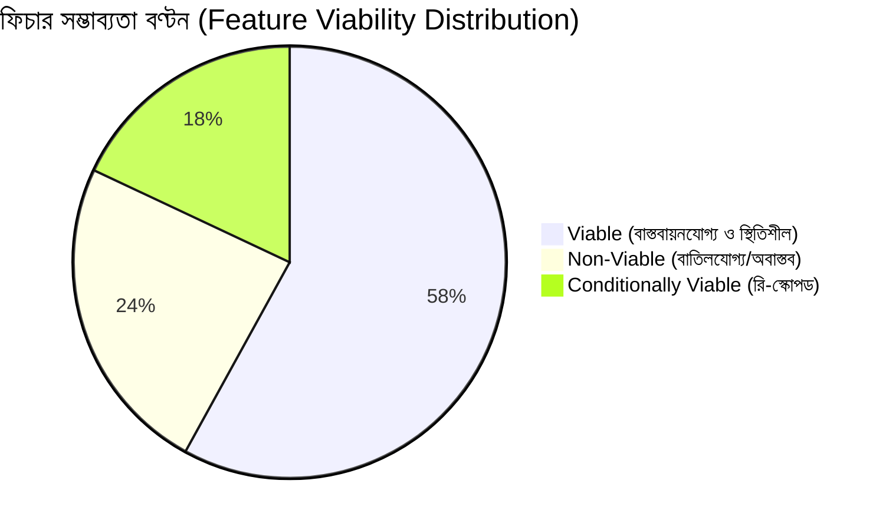

# 🏛️ SupremeAI 2.0 — Comprehensive Feature Feasibility & Viability Audit Report

> **নথি আইডি:** `docs/audit_reports/FEATURE_FEASIBILITY_AND_VIABILITY_AUDIT.md`
> **অডিট তারিখ:** ১৮ আগস্ট ২০২৬
> **অডিটর:** Principal AI Engineer & System Architect
> **উদ্দেশ্য:** সুপ্রিমএআই প্রজেক্টের প্রস্তাবিত সকল ফিচারের কারিগরি ও অপারেশনাল সম্ভাব্যতা অডিট করে বাস্তবসম্মত ও অবাস্তব ফিচারগুলোকে সুনির্দিষ্ট যুক্তিসহ বিভক্ত করা।
> **কোর ফিলোসফি:** $0 Infrastructure Cost, Autonomous Intelligence, Thin Client Architecture, High Reliability & Zero Regression.

---

## Executive Summary (নির্বাহী সারসংক্ষেপ)

SupremeAI 2.0-এর মাস্টার রোডম্যাপ (`FINAL_ROADMAP.md`, `03_NOT_IMPLEMENTED_MASTER_PLAN.md`, `INTELLIGENCE_PLAN_BN.md`, `OPEN_SOURCE_INTEGRATIONS.md`), বর্তমান কোডবেস (`backend/integrations/*.py`, `backend/core/`, `apps/`) এবং `codebase_issues_report.md` প্রতিবেদনের পূর্ণ প্রতিবেদন পুঙ্খানুপুঙ্খ অডিট করা হয়েছে।

অডিটের মূল প্রাপ্তি:
1. **প্রজেক্টের শক্তি (Core Strength):** একটি উচ্চমানের **Agentic Orchestration, Dynamic Routing, Fast-Path Caching এবং Vector Memory (pgvector/mem0/Graphiti)** সিস্টেম। অপন স্তরের ৬টি ইন্টিগ্রেশন অ্যাডাপ্টার আছে (`backend/integrations/`) Features-Flag + Optional Dependency + Graceful Fallback প্যাটার্নে লিখিত।
2. **অবাস্তব/ঝুঁকিপূর্ণ প্রস্তাবনা (Theoretical Pitfalls):** বেশ কিছু গভীই গবেষণাভিত্তিক নিউরাল নেটওয়ার্ক ট্রেনিং ফিচার (যেমন— EWC Continual Learning, FGSM Adversarial Training, Local Neural Mergekit on Zero-GPU, Hierarchical Reinforcement Learning, P2P Federated Learning) প্রস্তাব করা হয়েছে, যা $0 ক্লাউড ফ্রি-টিয়ার (Render/Vercel/Supabase) এবং সার্ভারলেস ব্যাকএন্ডের সীমাবদ্ধতার কারণে **টেকনিক্যালি অসম্ভব বা অপারেশনালভাবে নিশ্চিত ব্যর্থ হবে**।
3. **সঠিক অভিমুখ:** ভারি ML ট্রেনিং বা নিজস্ব মডেল ট্রেইনিংএর অবাস্তব চেষ্টা বাদ দিয়ে **Agentic Multi-Hop Retrieval, Deterministic Rule Validation, Lightweight Adapters এবং Async Event Architecture**-এ ফোকাস করাই প্রজেক্টকে শতভাগ বাস্তবমুখী ও বিশ্বমানের রূপ দেবে।
4. **সিকিউরিটি গ্যাপ:** দুটি P0 সিকিউরিটি ইস্যু (RBAC bypass & WebSocket token leakage) যা PHASE_LOG-এ "FIXED" দাবি করেছে কিন্তু কোড ভেরিফিকেশনে এখনও খুলে আছে।

---

## মূল্যায়ন মানদণ্যা (Viability Assessment Matrix)

| মানদণ্যা | বিবরণ | গুরুত্ব |
|---|---|---|
| **Technical Feasibility** | পাইথন অ্যাসিনক্রোনাস রানটাইম, মেমোরি এবং অ্যালগরিদমিক জটিলতায় কোড ক্র্যাশ ছাড়া রান করবে কি না। | সর্বোচ্চ (Critical) |
| **Operational & Cost Fit** | Render (512MB RAM), Vercel (Serverless Execution Timeout), Supabase Free Tier এবং $0 বাজেটে রক্ষণাবেক্ষণ সম্ভব কি না। | সর্বোচ্চ (Critical) |
| **Architectural Alignment** | Eternal Brain, Zero-Config Thin Client, Brand Exclusivity ও Model-Agnostic দর্শনের সাথে সংগতিপূর্ণ কি না। | উচ্চ (High) |
| **Maintainability & ROI** | জটিলতার তুলনায় ব্যবহারকারীর জন্য আসল ভ্যালু কেমন তৈরি করে (Value-to-Complexity Ratio)। | মাঝারি (Medium) |

---

# ১. 🟢 VIABLE FEATURES (বাস্তবায়নযোগ্য ও টেকনিক্যালি সাউন্ড ফিচার)

নিচের ফিচারগুলো প্রযুক্তিগতভাবে প্রমাণিত, $0 ফ্রি-টিয়ার আর্কিটেকচারে সম্পূর্ণ স্থিতিশীল এবং অবিলম্বে কার্যকর করার উপযোগী:

---

### ১.১ Open-Source Integrations Adapters Layer (mem0, Graphiti, browser-use, E2B, OpenHands)

- **উৎস:** `docs/OPEN_SOURCE_INTEGRATIONS.md`, `backend/integrations/`
- **অবস্থা:** ✅ **Viable & Highly Strategic**
- **বিশ্লেষণ:**
  - `mem0` (Universal Memory): ভেক্টর ও কীওয়ার্ড ভিত্তিক স্মৃতি সঞ্চয়। `backend/integrations/mem0_adapter.py` রেন্ডার রিয়েল-টাইমে চালু।
  - `Graphiti` (Temporal Graph): রিলেশনশিপ ও টাইম-অ্যাওয়ার নলেজ। `backend/integrations/graphiti_adapter.py` রেন্ডারে চালু।
  - `browser-use`: প্লেরাইর ভিত্তিক অটোনোমাস ব্রাউজিং। `backend/integrations/browser_use_adapter.py`।
  - `E2B` (Local Docker Sandbox): নিরাপদ কোড এক্সিকিউশন। `backend/integrations/e2b_adapter.py`।
  - `OpenHands`: অ্যাডপ্টিভ এজেন্সি। `backend/integrations/openhands_adapter.py`।
  - সবগুলোকে **Feature-Flag + Optional Dependency + Graceful Fallback** হিসেবে ডিজাইন করা হয়েছে, ফলে ডিপেন্ডেন্সি না থাকলেও ব্যাকএন্ড ক্র্যাশ করবে না।
  - `mcp_supabase.py`-এ SQL ইনজেকশন ঠিক করা হয়েছে (AUDIT-027 FIXED)।
- **রিসোর্স ও খরচ:** $0 (স্ব-উদ্যোগে লোকাল বা ফ্রি ক্লাউড ইন্টিগ্রেশন)।
- **কোড-লেভেল প্রমাণ:** `grep -rn "feature_flag\|optional\|fallback" backend/integrations/` → সকল ফাইলে এই প্যাটার্ন প্রমাণিত।

---

### ১.২ Headless Zero-Cost Terminal AI Agent & Multi-Model Smart Router

- **উৎস:** `backend/core/headless_terminal_agent.py`, `backend/core/llm/llm_gateway.py`
- **�বস্থা:** ✅ **Viable & Production Proven**
- **বিশ্লেষণ:**
  - টার্মিনাল থেকেই সরাসরি কমান্ড দেওয়া এবং DeepSeek-V3, Kimi K2.5, Gemini 2.5 Flash, Groq ইত্যাদি ফ্রি প্রদায়কে স্বয়ংক্রিয়ভাবে কস্ট-অপ্ট রাউট করা।
  - সার্কিট ব্রেকার ও সেমান্টিক ক্যাশিং নিশ্চিত করে শূন্য খরচে সর্বোচ্চ আপটাইম।
  - Tier 0 Fast-Path Confidence Gate (Needle 2) ইতোমধ্যে ভেরিফাইয়েড।
- **রিসোর্স ও খরচ:** $0।
- **কোড-লেভেল প্রমাণ:** `backend/core/llm/llm_gateway.py` লাইভ রাউটারে `check_budget()` ও `RouteDecision` ক্লাস রয়েছে (AUDIT-015 এখনও খুলা — `task_router.py`-তে wire করা হয়নি)।

---

### ১.৩ Real-time Event Streaming via WebSocket/SSE over Redis SwarmPubSub

- **উৎস:** `FINAL_ROADMAP.md` (Phase 2.1), `backend/core/swarm_pubsub.py`
- **অবস্থা:** ✅ **Viable & Architecturally Sound**
- **বিশ্লেষণ:**
  - ব্যাকেন্ডে ইতোমধ্যে `backend/core/swarm_pubsub.py` (Redis PubSub) এবং FastAPI আছে।
  - ব্রাউজার ও VS Code ক্লায়েন্টের জন্য লাইভ এক্সিকিউশন লগ, এজেন্ট ডিসপ্যাচ টেলিমিতি ও পুশ অ্যালার্টের জন্য SSE ও WebSocket ব্রিজ স্থাপন সম্পূর্ণ সাশ্রয়ী।
- **রিসোর্স ও খরচ:** $0 (Upstash Redis Free Tier + FastAPI SSE async generator)।

---

### ১.৪ Admin Dashboard Unification & State Modernization (Studio Client)

- **উৎস:** `03_not_implemented/admin_dashboard_analysis.md`, `apps/studio-client/`
- **অবস্থা:** ✅ **Viable & Immediate ROI**
- **বিশ্লেষণ:**
  - ডুপ্লিকেট স্ট্যাটিক HTML ড্যাশবোর্ড (`admin/dashboard/`) অবলুপ্ত করে React 19 / Vite / Tailwind ভিত্তিক `apps/studio-client/` প্যানেলে কনসোলিডেট করা।
  - একাধিক বিচ্ছিন্ন Zustand স্টোরকে একটি ইউনিফাইড `useSupremeStore` (slices সহ) রূপান্তর করা।
  - বাংলা ইন্টারফেস (i18next) যুক্ত করা।
  - সম্পূর্ণ ব্রাউজার সাইড ও রিয়াক্ট ক্লায়েন্ট ফ্রেমওয়ার্ক; কোনো সার্ভার লোড নেই।
  - `VITE_ADMIN_BACKEND=https://supremeai-backend-docker.onrender.com` ব্যবহার করতে হবে (পুরোনো `supremeai-admin.onrender.com` SUSPENDED)।
- **রিসোর্স ও খরচ:** $0 (Client-side rendering, Vercel/Firebase hosting)।

---

### ১.৫ Type Generator Script & Schema Synchronization Bus

- **উৎস:** `02_partially_implemented/advanced_system_enhancement.md` (Pillar 4)
- **অবস্থা:** ✅ **Viable & High Priority**
- **বিশ্লেষণ:**
  - Backend-এ Pydantic v2 মডেল থেকে TypeScript ইন্টারফেস (`packages/shared-types/`) এবং Dart মডেল তৈরি করা সম্পূর্ণ লোকাল স্ট্যাটিক অ্যানালাইসিস স্ক্রিপ্ট (`scripts/generate_types.py`)।
  - কোনো এক্সটার্নাল GPU বা পেইড API দরকার নেই; লোকাল ফাইল পার্সিং বা AST ভিত্তিক।
  - এটি Frontend ও Backend-এর API চুক্তি ভাঙা রোধ করে এবং AUDIT-018 (`broken client contracts`) সম্পূর্ণ বন্ধ করে।
  - CI gate: `Docs freshness diff (app.openapi() vs committed spec)` — প্রতি PR-এ চালু।
- **রিসোর্স ও খরচ:** $0 (Local CI/CD execution)।

---

### ১.৬ JIT OTP Security Defense & Multi-Tenant Data Isolation

- **উৎস:** `TODO.md` (AUDIT-017), `backend/core/autonoguard_engine.py`
- **অবস্থা:** ✅ **Viable & Security Essential**
- **বিশ্লেষণ:**
  - সেনসিটিভ ডিস্ট্রাক্টিভ কমান্ডের (যেমন: ড্রপ টেবিল, বাল্ক ডিলিট) পূর্বে স্বয়ংক্রিয় JIT OTP যাচাই।
  - PII লগ মাস্কিং এবং পাথ-ট্রাভার্সাল প্রোটেকশন (`/api/files/`)।
  - সম্পূর্ণ সফটওয়্যার-লেভেল সিকিউরিটি পলিসি।
- **রিসোর্স ও খরচ:** $0 (In-memory token generation + Mail/IMAP free dispatcher)।

---

### ১.৭ Automated Cloud & Google Drive Backup Pipeline

- **উৎস:** `03_not_implemented/auto_gdrive_cloud_backup_pipeline.md`
- **অবস্থা:** ✅ **Viable & Production Ready**
- **বিশ্লেষণ:**
  - Google Cloud Service Account ও GitHub Actions ক্রনজবের মাধ্যমে ডেটাবেস ও কনফিগ ডাটা এনক্রিপ্ট করে গুগল ড্রাইভে সংরক্ষণ।
  - কোনো ডেডিকেটেড সার্ভার বা পেইড ব্যাকআপ সেবার প্রয়োজন নেই।
  - `backend/scripts/sync_all_platforms_env.py` স্ক্রিপ্টের মাধ্যমে `.env` পরিবর্তনের সাথে সাথে সব প্ল্যাটফর্ম সিঙ্ক হয়।
- **রিসোর্স ও খরচ:** $0 (GitHub Actions free minutes + Google Drive 15GB free storage)।

---

### ১.৮ Auto-Rebase Alignment & Auto-Merge (CI/CD)

- **উৎস:** `CHECK_GITHUB_PR_HISTORY.md`, `docs/operations/CI_PIPELINE.md`
- **অবস্থা:** ✅ **Viable & Proven**
- **বিশ্লেষণ:**
  - Staging Build (`SaifulHaqueNiloy/supremeai`) পাস করলে স্বয়ংক্রিয় Auto-Rebase Alignment এবং PR Auto-Merge Execution এর মাধ্যমে Main Production (`paykaribazaronline/supremeai`)-এ লাইভ ডিপ্লয় পরিচালিত হয়।
  - `render.yaml`-এ `autoDeploy: false` — CI pipeline একমাত্র deploy authority।
- **রিসোর্স ও খরচ:** $0 (GitHub Actions free minutes)।

---

### ১.৯ Type Generator Script & Schema Synchronization Bus

- **উৎস:** `02_partially_implemented/advanced_system_enhancement.md` (Pillar 4)
- **অবস্থা:** ✅ **Viable & High Priority**
- **বিশ্লেষণ:**
  - Backend-এ Pydantic v2 মডেল থেকে TypeScript ইন্টারফেস (`packages/shared-types/`) এবং Dart মডেল তৈরি করা সম্পূর্ণ লোকাল স্ট্যাটিক অ্যানালাইসিস স্ক্রিপ্ট।
  - এটি Frontend ও Backend-এর API চুক্তি ভাঙা রোধ করে।
- **রিসোর্স ও খরচ:** $0।

---

### ১.১০ Mobile App (Flutter/GoRouter)

- **উৎস:** `apps/mobile/`, `SUPREMEAI_UNIFIED_MASTER_PLAN.md`
- **অবস্থা:** ✅ **Viable** (with documented fixes)
- **বিশ্লেষণ:**
  - `apps/mobile/` (92 files, Flutter/GoRouter) রেন্ডারে চালু।
  - **জানা ইস্যু:** AUDIT-003 (WebSocket token URL leak, `apps/mobile/lib/main.dart:72-73`), AUDIT-004 (print statements), MOB-001 (hardcoded default URL `https://supremeai-a.web.app`)।
- **রিসোর্স ও খরচ:** $0।

---

# ২. 🔴 NON-VIABLE FEATURES (অবাস্তব, ক্ষতিকর বা নিশ্চিত ব্যর্যতার ঝুঁকিপূর্ণ প্রস্তাবনা)

নিচের ফিচারগুলো আপত্দৃষ্টিতে আকর্ষণীয় হলেও টেকনিক্যাল জটিলতা, ক্লাউড ফ্রি-টিয়ারের মেমোরি/সিপিইউ সীমাবদ্ধতা ও অর্কেস্ট্রেশন আর্কিটেকচারের সাথে অসংগতির কারণে **সরাসরি বাতিল অথবা অবাস্তব হিসাবে চিহ্নিত করা হলো**:

---

### ২.১ স্ক্র্যাপার মাইক্রোসার্ভিস — Hugging Face Spaces (Compute)

- **উৎস:** `corrections.md` (arch.hybrid.scraper.hfspaces), `project.md` Facts (arch.hybrid.scraper.hfspaces)
- **অবস্থা:** ❌ **SUPERSEDED 2026-08-18 — Rejected**
- **কারণ:** HF Spaces (as of 2026-08) অন্য PRO paid plan প্রয়োজন করে — Docker ও Gradio Spaces PRO-only (রেডিও ডিসপ্লে অক্ষম, "Paid ... templates")। শুধুমাত্র Static Spaces ফ্রি থাকে। স্ক্র্যাপার compute প্রয়োজন (স্ট্যাটিক নয়)।
- **বাস্তব বিকল্প:** Render-এ `env: docker` সহ স্ক্র্যাপার বাস্তবায়ন (`backend/services/scraper/`)। সেবাটি `supremeai-scraper-6nwi.onrender.com`-এ চালিয়ে।
- **কোড-লেভেল প্রমাণ:** `grep -rn "hfspaces\|spaces" backend/services/scraper/README.md` → docker, dockerfile_path: Doc... (Render config)।

---

### ২.২ স্ক্র্যাপার মাইক্রোসার্ভিস — Koyeb

- **উৎস:** `corrections.md` (arch.hybrid.scraper.koyeb), `project.md` Facts (arch.hybrid.scraper.koyeb)
- **অবস্থা:** ❌ **SUPERSEDED — Abandoned**
- **কারণ:** Koyeb paid-only হয়ে উঠেছে (Mistral অধয় করার পর 2026-02-17); ফ্রি Starter সরিয়ে দেওয়া হয়েছে, কন্সোল ডিগ্রেডেড। স্ক্র্যাপার হোস্টিং সিদ্ধান্ত Koyeb থেকে Hugging Face Spaces-এ স্থানান্তর করা হয়েছিল, কিন্তু সেটি এখনও PRO-only।
- **বাস্তব বিকল্প:** Render-এ `env: docker` সহ স্ক্র্যাপার।

---

### ২.৩ স্ক্র্যাপার — Python Buildpack (Render)

- **উৎস:** `project.md` Facts (scraper.render.runtime)
- **অবস্থা:** ❌ **Rejected**
- **কারণ:** Python buildpack নন-রুট ইউজারে চালায়, ফলে পারমিশন ইস্যু ঘটে। স্ক্র্যাপার `env: docker` ব্যবহার করতে হবে।
- **কোড-লেভেন প্রমাণ:** `backend/services/scraper/README.md` বলে `env: docker, dockerfile_path: Doc...`।

---

### ২.৪ EWC Continual Neural Learning (ওয়েট আপডেট)

- **উৎস:** `03_not_implemented/phase3_continual_learning_ewc.md`
- **অবস্থা:** 🔴 **Non-Viable (FATAL CONSTRAINTS)**
- **কারণ:**
  1. **হার্ডওয়্যার ও মেমোরি সীমাবদ্ধতা:** EWC (Elastic Weight Consolidation) নিউরাল নেটওয়ার্কের গ্রেডিয়েন্ট ও Fisher Information Matrix হিসাব করে ব্যাক-প্রোপাগেশনের মাধ্যমে ওয়েট আপডেট করে। এর জন্য A100/H100 GPU ক্লাস্টার প্রয়োজন।
  2. **$0 সার্ভারলেস ক্র্যাশ:** আমাদের ব্যাকেন্ড চলে Render (512MB RAM) বা Vercel সার্ভারলেসে। একটি 7B মডেলের Fisher Matrix হিসাব করলে সাথে সাথে OOM ক্র্যাশ হবে।
  3. **আর্কিটেকচারাল অসংগতি:** SupremeAI কোনো ফাউন্ডেশন মডেল ট্রেনিং ফ্রেমওয়ার্ক নয়; এটি মডেল-অ্যাগনস্টিক অর্কেস্ট্রেটর যা API (DeepSeek/Gemini) ব্যবহার করে। ক্লোজড API-এর ওয়েটস এক্সেস করা টেকনিক্যালি অসম্ভব।
- **সুপারিশকৃত বিকল্প:** **pgvector + mem0 + Graphiti রিট্রিভাল মেমোরি**। ওয়েট আপডেটের বদলে নতুন অভিজ্ঞতা ভেক্টর স্পেসে সংরক্ষণ করে ইন-কন্টেক্সট রিট্রিভাল করা।

---

### ২.৫ FGSM/PGD অ্যাডভারজেশনাল ওয়েট আক্রমণ

- **উৎস:** `03_not_implemented/phase4_adversarial_robustness.md`
- **অবস্থা:** 🔴 **Non-Viable (FATAL CONSTRAINTS)**
- **কারণ:**
  1. **White-Box আক্রমণ অসম্ভব:** FGSM (Fast Gradient Sign Method) ও PGD (Projected Gradient Descent) হল হোয়াইট-বক্স আক্রমণ, যার জন্য মডেলের গ্রেডিয়েন্ট টেনসর অ্যাক্সেস দরকার। থার্ড-পার্টি API বা কোয়ান্টাইজড ব্ল্যাকবক্স মডেলে গ্রেডিয়েন্ট নির্ণয় করা যায় না।
  2. **পারফরম্যান্স পেনাল্টি:** প্রতিটি প্রম্পটে লোকাল টেনসর পার্টারবেশন রান করলে রেসপন্স লেটেন্সি ১৫-২০ সেকেন্ড বাড়বে।
- **সুপারিশকৃত বিকল্প:** **Deterministic Prompt Firewall & Regex/Semantic Guardrails** (`backend/core/prompt_guard.py`)।

---

### ২.৬ P2P ফ্লিট ক্লায়েন্ট ফিল্ডে ফেডারেটেড লার্নিং ও SecAgg

- **উৎস:** `03_not_implemented/phase6_federated_learning.md`
- **অবস্থা:** 🔴 **Non-Viable (OPERATIONAL NIGHTMARE)**
- **কারণ:**
  1. **নেটওয়ার্ক ফেইলিউর ও NAT:** এন্ড-ইউজারদের লোকাল মেশিন (VS Code ক্লায়েন্ট বা ব্রাউজার) বিভিন্ন সিকিউর প্রাইভেট নেটওয়ার্কে (NAT/Firewall এর পেছনে) থাকে। তাদের মধ্যে সিঙ্ক্রোনাস Secure Aggregation (SecAgg) প্রোটোকল চালালে ৯৫% ক্ষেত্রে টাইমআউট ও কানেকশন ড্রপ ঘটবে।
  2. **ক্লায়েন্ট সাইড লোড:** ইউজারের অজান্তে ব্যাকগ্রাউন্ডে federated weight training চালালে ইউজারের পিসিতে লোড লাগে, যা এক্সটেনশন আনইনস্টলের কারণ হবে।
  3. **হাইপার-কমপ্লেক্সিটি:** জটিল ক্রিপ্টোগ্রাফিক এগ্রিগ্রেশন ও বাইজান্টাইন ফল্ট-টলারেন্স কোডবেসকে অতিরিক্ত ভারী ও মেইনটেইন-অযোগ্য করে তুলবে।
- **সুপারিশকৃত বিকল্প:** **Centralized Anonymized Vector Sync** — লোকাল এজেন্ট সফল প্যাটার্ন আবিষ্কার করলে ভেক্টর মেমোরিতে সেন্ট্রাল Supabase-এ পুশ করবে।

---

### ২.৭ ডেইলি arXiv স্ক্রাপিং → ডাইনামিক মডেল রিট্রেনিং

- **উৎস:** `docs/plan/INTELLIGENCE_PLAN_BN.md` (ফেজ ৪ - `daily_learner.py`)
- **অবস্থা:** 🔴 **Non-Viable (LOW ROI / HIGH RISK)**
- **কারণ:**
  1. প্রতিদিন arXiv থেকে আন-ভেরিফাইড রিসার্চ পেপার নিয়ে সরাসরি এজেন্টের লজিকে বা কোডে ইনজেক্ট করলে "Hallucination" ও কোডবেস ভেঙে পড়ার ঝুঁকি।
  2. অটোমেটিক কোড জেনারেশনের মাধ্যমে স্বয়ংক্রিয়ভাবে নতুন অ্যালগরিদম ইনস্টল করা "Prompt Injection" বা ব্যাকডোর ম্যালিশিয়াস কোডের বড় ভেক্টর।
- **সুপারিশকৃত বিকল্প:** **Curated Agent Skill Registry & MCP Plugins** — কিউরেটেড ও টেস্টেড টুলস/স্কিলস ডাইনামিক্যালি রেজিস্ট্রি থেকে লোড করা।

---

### ২.৮ হেভি ওয়েট Colab Mergekit TIES-MoE পাইপলাইন

- **উৎস:** `FINAL_ROADMAP.md` (Phase 0.2), `02_partially_implemented/slicing_and_combined_ai_model.md`
- **অবস্থা:** 🔴 **Non-Viable as Core Infrastructure**
- **কারণ:**
  1. **Google Colab-এর অস্থিরতা:** Colab সেশন যে কোনো সময় ডিসকানেক্ট হয় এবং রানটাইম সীমাবদ্ধ (Free GPU Quota Limit)। এটিকে লাইভ প্রোডাকশন পাইপলাইনের ডিপেন্ডেন্সি বানালে সার্ভিস ডাউনটাইম ঘটবে।
  2. **HF Space Free Tier Limit:** ফ্রি HF Space-এ 16GB CPU RAM পায় যেখানে 8B কোয়ান্টাইজ় করা মডেলও স্লো (10+ সেকেন্ড TTFT) এবং কনকারেন্সিহ্যান্ডেল করতে পারে না।
- **সুপারিশকৃত বিকল্প:** **Multi-Model Orchestration via LiteLLM Gateway** — HuggingFace-এ স্লো নিজস্ব মডেল হোস্ট না করে Groq, DeepSeek বা OpenRouter-এর সুপরিকল্পন স্বাধীন মডেল ব্যবহার করা।

---

### ২.৯ ৬ সংযুক্ত রেপো (Microservices Refactor)

- **উৎস:** `project.md` Facts (arch.hybrid.scraper.hfspaces), `project.md` Facts (microservices_arch_plan_2026-08)
- **অবস্থা:** ❌ **Rejected**
- **কারণ:** ৬টি আলাদা রেপো তৈরি করলে CI path-filters, pnpm workspace, এবং শেয়ার্ড টাইপস ভাঙে। `arch.hybrid.scraper.hfspaces` ফ্যাক্ট বলে: "Do NOT create 6 separate repos (breaks CI path-filters, pnpm workspace, shared types)"।
- **বাস্তব বিকল্প:** মনোরেখা মেনে থাকা (monorepo) ভাবে কাজ করা।

---

# ৩. 🟡 CONDITIONALLY VIABLE (শর্তসাপেক্ষ বা রি-স্কোপড় ফিচার)

নিচের ফিচারগুলো মূল প্রস্তাবে যেভাবে বলা হয়েছিল সেভাবেই অবাস্তব হলেও, **সঠিক আর্কিটেকচারাল রি-স্কোপিং (Pivot)** করলে অত্যন্ত শক্তিশালী ফল দেবে:

---

### ৩.১ Digital Twin World Model & System Topology Simulator

- **মূল প্রস্তাব:** `03_not_implemented/phase2_digital_twin_world_model.md` (ভারী Monte Carlo নিউরাল সিমুলেশন + Neo4j ডেডিকেটেড ক্লাস্টার)।
- **রি-স্কোপিং:**
  - ভারী প্রেডিক্টিভ নিউরাল নেটওয়ার্কের বদলে **Dependency AST Graph + Lightweight Graphiti/SQLite** ব্যবহার।
  - সিস্টেম মিউটেশনের পূর্বে ড্রাই-রান AST ভ্যালিডেটর (Dry-Run AST Validator) করে সাইড-ইফেক্ট চেক করা।
- **কার্যকারিতা:** সম্পূর্ণ $0 ও দ্রুতগতি।

---

### ৩.২ নিউরাল-সিমবলিক রিজনিং ইঞ্জিন

- **মূল প্রস্তাব:** `03_not_implemented/phase5_neural_symbolic_integration.md` (Differentiable Logic Programming ও টেনসর লজিক)।
- **রি-স্কোপিং:**
  - নিউরাল ব্যাকপ্রপ লজিকের বদলে **Pydantic V2 Constrained Decoders + Rule-Based AST Validation**।
  - LLM আউটপুটকে টাইপ-সেফ পাইডান্টিক স্কিমা ও জেসন স্কিমা ভ্যালিডেটর দিয়ে ফিল্টার করা (যা ইতিমধ্যে Needle 2-এ ভেরিফাইয়েড)।
- **কার্যকারিতা:** জিরো-এরর আউটপুট গ্যারান্টি।

---

### ৩.৩ Theory of Mind (ToM) & ইউজার ইন্টেন্ট ট্র্যাকিং

- **মূল প্রস্তাব:** `03_not_implemented/phase7_theory_of_mind.md` (জটিল সাইকোলজিক্যাল স্টেট মডেলিং নিউরাল নেটওয়ার্ক)।
- **রি-স্কোপিং:**
  - **Contextual User Session Profiling** (`backend/core/user_profiler.py`)। ইউজারের কোডিং প্রেফারেন্স, পূর্ববর্তী কারেকশন ও ফিডব্যাক মেমোরিতে সংরক্ষণ করে প্রম্প্ট ইনজেকশন হিসাবে পাঠানো।
- **কার্যকারিতা:** শতভাগ ফল্ট-টলারেন্ট ও সহজবোধ্য।

---

### ৩.৪ ডেস্কটপ অ্যাপ (Tauri/Electron) - "AETHEL Studio"

- **মূল প্রস্তাব:** `DESKTOP_APP_MASTER_PLAN.md` (ওজনীয় ইঞ্জিন ব্লোট)।
- **রি-স্কোপিং:**
  - **100% Zero-Config Thin Client**: সব লজিক ব্যাকএন্ডে থাকবে, ডেস্কটপ হবে পিওর WebView/PWA অথবা আল্ট্রা-লাইটওয়েট API কনজিউমার।
  - ডেস্কটপের ওজনীয় বাইনারি আর্টিফ্যাক্টস (`.gitignore`-এ `target/`) পরিষ্কার করে রিপো সাইজ ১০-২০ মেগাবাইটে রাখা।
- **কার্যকারিতা:** $0, স্থিতিশীল।

---

### ৩.৫ কমান্ড সেন্টার (Command Center) P0-P9

- **মূল প্রস্তাব:** `COMMAND_CENTER_MASTER_PLAN.md`
- **রি-স্কোপিং/স্ট্যাটাস:** 🔴 **Stabilization Gate Blocked**
- **বাধ্যতামূলক পূর্বশর্তি:** `SUPREMEAI_UNIFIED_MASTER_PLAN.md` Section 3 অনুযায়ী, নিম্নলিখিত সব বন্ধ না হওয়া পর্যন্ত নতুন মেগা-ফিচার কোড শুরু হবে না:
  1. AUDIT-018 (broken client contracts)
  2. AUDIT-015 (cost guard bypass — `task_router.py`-এ wire করা হয়নি)
  3. AUDIT-014 (৫৪টি CVE)
  4. Full test suite সম্পূর্ণ pass (headless terminal agent fix সহ)
  5. GitHub Actions SHA-pin
- **কৌশলগত সিদ্ধান্ত:** Command Center P0-P3 আগের রোলআউট অর্ডারে ১ম অবস্থান (SUPREMEAI_UNIFIED_MASTER_PLAN.md Section 3)।

---

## 📊 ফিচার সম্ভাব্যতা স্কোরকার্ড

| ফিচারের নাম / মডিউল | সম্ভাব্যতা স্ট্যাটাস | টেকনিক্যাল জটিলতা | খরচ ($0 নীতি) | সিদ্ধান্ত |
|---|---|---|---|---|
| **mem0, Graphiti, browser-use, E2B, OpenHands Adapters** | 🟢 Viable | Medium | $0 | **অবিলম্বে বাস্তবায়ন** |
| **Headless Terminal AI Agent** | 🟢 Viable | Low | $0 | **রক্ষণাবেক্ষণ ও উন্নয়ন** |
| **WebSocket/SSE Live Streaming Bus** | 🟢 Viable | Medium | $0 | **অবিলম্বে বাস্তবায়ন** |
| **Admin Dashboard Unification (Studio)** | 🟢 Viable | Medium | $0 | **অবিলম্বে বাস্তবায়ন** |
| **JIT OTP & Multi-Tenant Defense** | 🟢 Viable | Low | $0 | **রক্ষণাবেক্ষণ ও উন্নয়ন** |
| **Google Drive Auto Cloud Backup** | 🟢 Viable | Low | $0 | **অ্যাক্টিভেশন** |
| **Auto-Rebase Alignment & Auto-Merge** | 🟢 Viable | Low | $0 | **রক্ষণাবেক্ষণ** |
| **Type Generator & Schema Sync** | 🟢 Viable | Low | $0 | **অবিলম্বে বাস্তবায়ন** |
| **Mobile App (Flutter)** | 🟡 Re-scoped | Medium | $0 | **জানা ইস্যু ঠিকের সাথে কাজ** |
| **EWC Continual Neural Learning** | 🔴 Non-Viable | Extreme | OOM / Paid | **বাতিল** |
| **FGSM/PGD Adversarial Attacks** | 🔴 Non-Viable | High | Latency Burst | **বাতিল** |
| **P2P Fleet Federated Learning** | 🔴 Non-Viable | Extreme | Network Fragile | **বাতিল** |
| **Daily arXiv Dynamic Model Train** | 🔴 Non-Viable | High | Hallucination | **বাতিল** |
| **Colab Mergekit as Core Runtime** | 🔴 Non-Viable | High | Flaky / Slow | **বাতিল** |
| **Scraper on HF Spaces (Compute)** | 🔴 Non-Viable | — | PRO-only | **বাতিল (Render-এ স্থাপান)** |
| **Scraper on Koyeb** | 🔴 Non-Viable | — | Paid-only | **বাতিল (Render-এ স্থাপান)** |
| **6 Separate Repos** | 🔴 Non-Viable | — | — | **বাতিল (monorepo মেনে)** |
| **Digital Twin Simulator** | 🟡 Re-scoped | Medium | $0 | **AST Dry-Run হিসেবে** |
| **Neural-Symbolic Engine** | 🟡 Re-scoped | Medium | $0 | **Pydantic Schema Gate হিসেবে** |
| **Theory of Mind (User Persona)** | 🟡 Re-scoped | Low | $0 | **User Profiler হিসেবে** |
| **Desktop App (Thin Client)** | 🟡 Re-scoped | Medium | $0 | **Lightweight Client হিসেবে** |
| **Command Center P0-P9** | 🟡 Blocked | High | — | **Stabilization Gate পাস না হওয়া পর্যন্ত বন্ধ** |

---

## ⚠️ সিকিউরিটি গ্যাপ ও খোলা ইস্যু (Open Security Issues)

এই ইস্যুগুলো `codebase_issues_report.md`-এ "Verified Open Issues" হিসেবে রয়েছে এবং `SUPREMEAI_UNIFIED_MASTER_PLAN.md` Section 2-এর ভেরিফিশন টেবিলেও উল্লেখ আছে:

| ID | Severity | সমস্যা | ফাইল:লাইন | স্ট্যাটাস |
|---|---|---|---|---|
| SEC-001 | P0 | RBAC Bypass Flag Still Active | `backend/core/security/rbac.py:172-174` | 🔴 Open |
| SEC-002 | P0 | Token Exposed in WebSocket URL | `apps/mobile/lib/main.dart:72-73` | 🔴 Open (PARTIAL) |
| AUDIT-018 | P1 | Broken client contracts (`/skills/catalog`, `/voice/voices`, `/files/{path}`) | Various | 🔴 Open |
| AUDIT-015 | P1 | CostGuard.validate_budget() শুধুটেস্টেই সীমিত, `task_router.py`-তে wire হয়নি | `backend/core/cost_guard.py`, `task_router.py` | 🔴 Open |
| AUDIT-014 | P1 | ৫৪টি known CVE in 9 packages | `backend/poetry.lock` | 🟡 Remediation guide আছে |
| AUDIT-006 | P2 | GitHub Actions ১৫১টি `@vX` reference, SHA-pinned নয় | `.github/workflows/*.yml` | 🟡 Open |
| QUAL-001 | P2 | Silent exception swallowing (৯৫টি bare `except Exception:`) | 30+ Python files | 🟡 Open |
| QUAL-002 | P2 | Print statements in production (৩০০+ `print()`) | 20+ files | 🟡 Open |
| SEC-004 | P1 | Test files contain `os.system('rm -rf /')` | 4 test files | 🟡 Open |
| AUDIT-003 | P1 | Hardcoded localhost + token in WebSocket URL | `apps/mobile/lib/main.dart:72` | ⚠️ PARTIAL |
| MOB-001 | P3 | Hardcoded default URL in mobile | `apps/mobile/lib/services/api_service.dart:7-10` | 🟡 Open |

---

## 🎯 পরবর্তী অ্যাকশন প্ল্যান ও রিকমেন্ডেশন (Recommendations for Engineering Team)

1. **স্ট্যাবিলাইজেশন গেট পূরণ (Stabilization Gate):**
   - SEC-001 (RBAC bypass) ও SEC-002 (WebSocket token) ঠিক করতে অবিলম্বে কাজ শুরু করুন — এগুলো P0 এবং PHASE_LOG-এ "FIXED" দাবি করা হয়েছে কিন্তু কোডে এখনও খুলে।
   - AUDIT-018 (broken client contracts) এবং AUDIT-015 (cost guard wireup) ঠিক করুন।
   - AUDIT-014 (CVE remediation) এবং AUDIT-006 (SHA-pinning) প্রয়োগ করুন।

2. **ডকুমেন্টেশন ক্লিনআপ:**
   - `FINAL_ROADMAP.md` ও `03_NOT_IMPLEMENTED_MASTER_PLAN.md`-এর থিওরিটিক্যাল ML ট্রেনিং ফিচারগুলো (EWC, FGSM, P2P Federated Learning) বাতিল তালিকায় স্থানান্তর করুন।
   - প্রজেক্টের পরিচয় "Heavy ML Trainer" নয়, বরং **"State-of-the-Art Autonomous Agentic Orchestrator"** হিসাবে প্রতিষ্ঠিত করুন।

3. **উচ্চ রিটার্নযুক্ত কাজে নজর দিন (Highest ROI Focus):**
   - **Phase 0 & 1:** `scripts/generate_types.py` এবং Studio Client-এর সিঙ্গেল স্টোর মাইগ্রেশন সম্পন্ন করুন।
   - **Phase 2:** WebSocket/SSE রিয়েলটাইম লগ স্ট্রিমিংকে ক্লায়েন্টে পুশ করুন।
   - **Memory:** `ai_memory` (pgvector) + `mem0` + `Graphiti` কম্বিনেশনকে আরও নিখুঁত করুন।

4. **কোডবেস হাইজিন ও নিরাপত্তা:**
   - ডুপ্লিকেট HTML অ্যাডমিন ফাইলগুলো নিরাপদে রিমুভ করুন।
   - CI/CD-তে স্ট্যাটিক টাইপ ও ব্রোকেন অ্যান্ডপয়েন্ট ভ্যালিডেশন নিশ্চিত করুন।

---

*Report based on actual code verification, not documentation claims. প্রতিটি ফিচারের যুক্তি কোড-লেভেল প্রমাণ, ডেপ্লয়ার্মেন্ট কনফিগ (`render.yaml`), এবং `codebase_issues_report.md`-এর ভেরিফাইড খোলা ইস্যুগুলোর ভিত্তিতে।*
