# 📄 SupremeAI 2.0 — Master Documentation Plan & Strategic Benefits

> **Status:** ACTIVE & APPROVED  
> **Project:** SupremeAI 2.0  
> **Mission:** Establish an immutable, 10-year AI-Native Engineering Knowledge Base (`docs/kb/`) serving as the Single Source of Truth for human engineers and autonomous AI agents.

---

## 🎯 1. Vision & Core Goals

SupremeAI 2.0 is a highly resilient multi-cloud AI orchestration platform. Unlike standard software projects relying on basic `README.md` files, this Master Documentation Architecture converts the entire project's **architecture, memory, rules, security, dataflows, and blast radiuses** into a structured **AI-Native Engineering Knowledge Base (`docs/kb/`)**.

---

## 🏛️ 2. The 12 Pillars of Knowledge Base Architecture

```mermaid
graph TD
    KB["🧠 SupremeAI 2.0 Knowledge Base (docs/kb/)"]
    
    KB --> P1["01-overview (Project Constitution & Philosophy)"]
    KB --> P2["02-architecture (System Genome & AutonoGuard Mesh)"]
    KB --> P3["03-modules (FastAPI & React/Vite Deep Dives)"]
    KB --> P4["04-dependencies-and-configs (Environment & Secret Sync)"]
    KB --> P5["05-database-and-storage (Firestore & Redis Spec)"]
    KB --> P6["06-api-and-protocols (REST, SSE & WS Contracts)"]
    KB --> P7["07-auth-and-security (JIT OTP & Auth Guards)"]
    KB --> P8["08-ai-and-tools (LLM Router & PSI Intelligence)"]
    KB --> P9["09-dataflow-and-request-lifecycle (Sequence & Flow)"]
    KB --> P10["10-devops-and-infrastructure (2-Repo Sync & CI/CD)"]
    KB --> P11["11-playbooks-and-troubleshooting (Disaster Recovery & RCA)"]
    KB --> P12["12-genome-and-impact-graphs (Living Impact Graph)"]
```

---

## 🌟 3. Strategic Business & Technical Benefits

### 1. 🤖 AI-Native Interoperability
- Autonomous AI agents (e.g. Antigravity, Kilo, Cursor) can ingest `docs/kb/INDEX.md` and `PROJECT_CONSTITUTION.md` to immediately comprehend full context without breaking existing production contracts.

### 2. 🛡️ Blast Radius & Living Impact Analysis
- With `LIVING_IMPACT_ANALYSIS_GRAPH.md`, any code modification is pre-evaluated to pinpoint exactly which services, secrets, or deployment pipelines are impacted.

### 3. 💰 Zero-Cost Enforcement
- Explicitly documented Provider Selection Intelligence (PSI-001 ~ PSI-005) guarantees zero risk of accidental invocations of paid third-party API gateways.

### 4. 🔄 Multi-Repo Synchronization & Security Governance
- Clear specifications for 2-token repo sync (`MIRROR_REPO_TOKEN` & `MAIN_REPO_TOKEN`) and On-spot JIT OTP ensure high-security compliance.

---

## 📋 4. Execution Plan & Status Matrix

| Phase | Description | Key Deliverable Files | Status |
|---|---|---|---|
| **Phase 1** | Root documentation reorganization | `docs/bangla/`, `docs/english/` | ✅ Complete |
| **Phase 2** | Master Knowledge Base Index & Constitution | `docs/kb/INDEX.md`, `PROJECT_CONSTITUTION.md` | ✅ Complete |
| **Phase 3** | System Genome & Blueprint | `docs/kb/02-architecture/SYSTEM_GENOME_AND_BLUEPRINT.md` | ✅ Complete |
| **Phase 4** | Provider Intelligence & Routing Matrix | `docs/kb/08-ai-and-tools/LLM_ROUTER_AND_PROVIDER_INTELLIGENCE.md` | ✅ Complete |
| **Phase 5** | Living Impact Analysis Graph | `docs/kb/12-genome-and-impact-graphs/LIVING_IMPACT_ANALYSIS_GRAPH.md` | ✅ Complete |
