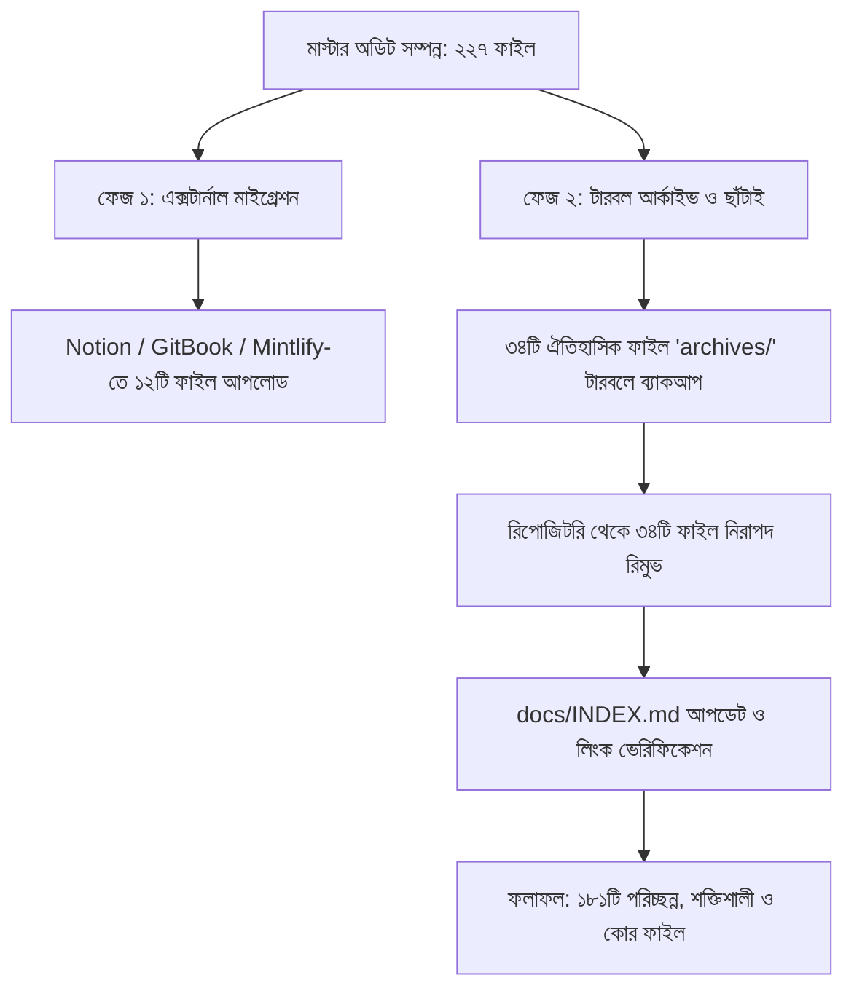

# SupremeAI — মাস্টার ডকুমেন্টেশন অডিট ও মাইগ্রেশন প্ল্যান (Master Documentation Audit & Migration Plan)

> **দর্শন (Core Philosophy):** "GitHub Issues as Live Operational Truth (Static Docs as Minimal Archival Backup)"  
> সচল সত্য থাকবে GitHub Issues ও কোডবেস কন্ট্রাক্টে; `docs/`-এ শুধু অপরিবর্তনীয় ক্যানোনিকাল স্পেক ও সক্রিয় রানবুক থাকবে।  
> **নিয়ন্ত্রক গেট:** `gates.py docs_garbage` (Constitution Policy: `.github/constitution/rules.yml` → `docs_garbage_policy`)  
> **সর্বশেষ অডিট তারিখ:** ২০২৬-০৯-২৯  
> **ট্র্যাক করা মোট ডকুমেন্টেশন ফাইল:** ২২৭টি  

---

## ১. নির্বাহী সারাংশ (Executive Summary)

SupremeAI রিপোজিটরিতে জমা হওয়া বিপুল ডকুমেন্টেশন যাচাই করে দেখা গেছে যে, বহু ফাইল অতীতের কোনো নির্দিষ্ট রাউন্ডের অডিট, ক্ষণস্থায়ী লগ বা প্রোডাক্ট/মার্কেটিং গাইড। এগুলো কোডবেসে থাকার ফলে:
1. কোডবেসের সাইজ অপ্রয়োজনীয়ভাবে বৃদ্ধি পাচ্ছে।
2. AI এজেন্টদের কনটেক্সট উইন্ডো নষ্ট হচ্ছে এবং বিভ্রান্তিকর/পুরনো তথ্য রেফারেন্স হচ্ছে।
3. কোড সার্চ এবং গ্রেপ রেজাল্ট বিশৃঙ্খল হয়ে পড়ছে।

অতএব, পুরো রিপোজিটরির ২২৭টি ডকুমেন্টেশন ফাইলকে ৩টি সুনির্দিষ্ট ভাগে ভাগ করা হয়েছে:
- **ক্যাটাগরি ১: GitHub রিপোজিটরিতে থাকবে (Keep in GitHub — ১৮১টি ফাইল):** কোর ইঞ্জিনিয়ারিং, CI/CD গেটস, এজেন্ট মেশ প্রোটোকল, ক্যানোনিকাল মাস্টার স্পেক্স এবং প্রোডাকশন রানবুক।
- **ক্যাটাগরি ২: এক্সটার্নাল প্ল্যাটফর্মে মাইগ্রেট হবে (Migrate to External Docs — ১২টি ফাইল):** ইউজার-ফেসিং প্রোডাক্ট গাইড, মার্কেটিং স্ট্র্যাটেজি এবং তাত্ত্বিক রিসার্চ পেপার (Notion / GitBook / Public Docs)।
- **ক্যাটাগরি ৩: আর্কাইভ বা ক্লিনআপ হবে (Archive / Prune to Tarball — ৩৪টি ফাইল):** অতীতের ফিক্স লগ, ওয়ান-অফ অডিট রিপোর্ট, পুরানো টেস্ট প্ল্যান এবং সিআই রান লগ।

---

## ২. শ্রেণিবিভাগ ও সিদ্ধান্তের মানদণ্ড (Categorization Criteria)

| ক্যাটাগরি | মানদণ্ড | গন্তব্য প্ল্যাটফর্ম |
| :--- | :--- | :--- |
| **GitHub Essential (Keep)** | কোড রানটাইম, CI/CD পাইপলাইন, অটোনোমাস এজেন্ট ডিসিশন মেকিং, সিকিউরিটি পলিসি বা সার্ভিসের সক্রিয় আর্কিটেকচার নির্দেশ করে। | GitHub Repository (`main` ব্রাঞ্চ) |
| **External Migration** | ব্যবহারকারী (End-user), ক্লায়েন্ট, অথবা নন-টেকনিক্যাল স্টেকহোল্ডারদের জন্য তৈরি গাইড, মার্কেটিং প্ল্যান বা দীর্ঘ রিসার্চ এসে। | Notion / GitBook / Mintlify / Public Docs Portal |
| **Archived / Pruned** | অতীতের নির্দিষ্ট সেশনের ফিক্স লগ, সমাধানকৃত অডিট রিপোর্ট, ক্লোজড গ্রুপের ক্লোজআউট ম্যানিফেস্ট, বা সাময়িক সিআই ত্রুটি লগ। | `archives/legacy-docs-*.tar.gz` (Git History-তে সুরক্ষিত) |

---

## ৩. ক্যাটাগরি ১: GitHub রিপোজিটরিতে যা থাকবে (Keep in GitHub — ১৮১টি)

### ৩.১ রুট ও কোর কনস্টিটিউশন (৮টি)
- `AGENTS.md` — ইউনিভার্সাল অপারেটিং কনস্টিটিউশন ও বুটস্ট্র্যাপ নির্দেশিকা (রুল ইঞ্জিন)
- `README.md` — মূল রিপোজিটরি পরিচিতি ও কুইক-স্টার্ট
- `CONTRIBUTING.md` — ইঞ্জিনিয়ারিং ও কন্ট্রিবিউশন গাইডলাইন
- `SECURITY.md` — সিকিউরিটি রিপোর্টিং ও ডিসক্লোজার পলিসি
- `STATUS.md` — মেশিন-ভেরিফায়েড সিস্টেম স্ট্যাটাস (Single Source of Truth)
- `CHECKPOINT.md` — এজেন্ট সেশন ট্র্যাকিং চেকপয়েন্ট
- `LESSONS_LEARNED.md` — সিস্টেমের ভুল থেকে শেখা ও রুল প্রিভেনশন মেমোরি
- `MODULES_LIST.md` — কোডবেস মডিউল ইনভেন্টরি ও ওয়্যারিং স্টেট

### ৩.২ এজেন্ট মেশ ও স্কিলস (`.agents/` — ৯টি)
- `.agents/ACTIVE_WORK.md` — মাল্টি-এজেন্ট ডিস্ট্রিবিউটেড শেয়ার্ড ব্ল্যাকবোর্ড
- `.agents/DEVELOPER_GUIDELINES.md` — ডেভেলপার ম্যানিফেস্টো ও ফেইল-ফাস্ট প্রিন্সিপাল
- `.agents/prompts/MASTER_KICKOFF_PROMPT.md` — ইউনিভার্সাল এজেন্ট কিকঅফ ডিরেক্টিভ
- `.agents/skills/browser-automation/SKILL.md` — ব্রাউজার অটোমেশন স্কিল
- `.agents/skills/concise-planning/SKILL.md` — প্ল্যানিং ও টাস্ক চেকলিস্ট স্কিল
- `.agents/skills/environment-health/SKILL.md` — ক্লাউড ডিপেনডেন্সি ও হেলথ স্কিল
- `.agents/skills/fastapi-pro/SKILL.md` — ফাস্টএপিআই ও ব্যাকএন্ড অপ্টিমাইজেশন স্কিল
- `.agents/skills/github-actions-debugger/SKILL.md` — সিআই/সিডি ওয়ার্কফ্লো ডিবাগার স্কিল
- `.agents/skills/mcp-tool-developer/SKILL.md` — এমসিপি টুল তৈরি ও টেস্টিং স্কিল

### ৩.৩ সিআই ও টেমপ্লেট (`.github/` — ৫টি)
- `.github/PULL_REQUEST_TEMPLATE.md` — পিআর টেমপ্লেট ও টেস্ট এভিডেন্স চেকলিস্ট
- `.github/scripts/maintenance-pipeline-documentation-bn.md` — মেইনটেন্যান্স পাইপলাইন গাইড
- `.github/scripts/supreme-ci-auto-fix-documentation-bn.md` — অটো-ফিক্স ওয়ার্কফ্লো গাইড
- `.github/scripts/supreme-ci-documentation-bn.md` — প্রধান সিআই/সিডি পাইপলাইন গাইড
- `.github/scripts/supreme-release-builds-documentation-bn.md` — রিলিজ বিল্ড পাইপলাইন গাইড

### ৩.৪ স্পেক-ড্রিভেন ডেভেলপমেন্ট (`.specify/` ও `specs/` — ২২টি)
- `.specify/memory/constitution.md` — এসডিডি কনস্টিটিউশন
- `.specify/templates/` (৫টি টেমপ্লেট: checklist, constitution, plan, spec, tasks)
- `specs/001-dynamic-production-configuration/` (৯টি ফাইল: spec, plan, tasks, contracts, checklists, verification)
- `specs/002-policy-driven-web-crawler/` (৭টি ফাইল: spec, plan, tasks, data-model, python-interface, research, quickstart)

### ৩.৫ ক্যানোনিকাল মাস্টার স্পেক্স (`docs/master_docs/` — ২৩টি)
- `ARCH-01-MASTER_CONSTITUTION.md` — সিস্টেম কোর কনস্টিটিউশন (AGENTS.md-তে কনসোলিডেটেড)
- `ARCH-02-SYSTEM_OVERVIEW_AND_FLOWS.md` — সিস্টেম আর্কিটেকচার ও ডাটা ফ্লো
- `ARCH-03-DATA_AND_STORAGE_PLAN.md` — ডাটাবেস ও স্টোরেজ আর্কিটেকচার
- `ARCH-05-MASTER_ROADMAP_AND_DECISIONS.md` — ইঞ্জিনিয়ারিং ডিসিশন ও রোডম্যাপ
- `ARCH-06-MODULES_AND_PROVIDERS_MAP.md` — মডিউল ও এআই প্রোভাইডার ম্যাপিং
- `ARCH-10-UNIVERSAL-ENGINE-MASTER-PLAN...` — ইউনিভার্সাল ইঞ্জিন মাস্টার প্ল্যান
- `ARCH-GAP-01-DECISION-GAP-ANALYSIS.md` — আর্কিটেকচারাল গ্যাপ অ্যানালাইসিস
- `AIBRAIN-01-MASTER_AGENT_SPECIFICATION.md` — মাস্টার এজেন্ট স্পেসিফিকেশন
- `AIBRAIN-02-AGENT-SYSTEM-2.0-MASTER-PLAN.md` — এজেন্ট সিস্টেম ২.০ প্ল্যান
- `BACKEND-01-API_REFERENCE_AND_CONTRACTS.md` — ব্যাকএন্ড এপিআই কন্ট্রাক্ট
- `BACKEND-07-MICROSERVICES_AND_PLUGINS.md` — মাইক্রোসার্ভিস আর্কিটেকচার
- `DEVOPS-01-PURE_CLOUD_INFRASTRUCTURE.md` — ক্লাউড ইনফ্রাস্ট্রাকচার আর্কিটেকচার
- `FRONTEND-01-DESIGN_SYSTEM_AND_TOKENS.md` — ফ্রন্টএন্ড ডিজাইন সিস্টেম ও টোকেন
- `INTEG-01-MCP_INTEGRATION_HANDBOOK.md` — এমসিপি ইন্টিগ্রেশন হ্যান্ডবুক
- `INTEG-06-VSCODE_EXTENSION_AND_IDE.md` — ভিএসকোড এক্সটেনশন ইঞ্জিনিয়ারিং
- `OPS-01-TESTING_STRATEGY_AND_TIERS.md` — ৩-স্তর টেস্টিং স্ট্র্যাটেজি
- `OPS-04-OPERATIONAL_RUNBOOKS_AND_TASKS.md` — অপারেশনাল রানবুক গাইড
- `OPS-05-PR-HELPER-LIFECYCLE.md` — পিআর হেল্পার অটোমেশন লাইফসাইকেল
- `OPS-06-MULTI-AGENT-BRANCHING-LIFECYCLE.md` — ব্রাঞ্চ ও লিজ ম্যানেজমেন্ট
- `OPS-07-DEVELOPER-AGENT-LIFECYCLE.md` — ডেভেলপার এজেন্ট লাইফসাইকেল
- `OPS-08-SUPREMEAI-RUNTIME-WORK-PROCESS.md` — রানটাইম ওয়ার্ক প্রসেস
- `OPS-09-POST-GROUP-JANITOR-AND-HYGIENE-PROTOCOL.md` — পোস্ট-গ্রুপ জানিটর প্রোটোকল
- `SEC-01-30_CATEGORY_SECURITY_MATRIX.md` — ৩০ ক্যাটাগরি সিকিউরিটি ডিফেন্স

### ৩.৬ লিভিং আর্কিটেকচার ও এজেন্ট রোলস (`docs/architecture/`, `docs/agents/`, `docs/plans/` — ২৮টি)
- `docs/architecture/ARCH-LIVING-PIPELINE-01.md` — লিভিং পাইপলাইন ক্যানন (Rule 12)
- `docs/plans/ARCH-LIVING-PIPELINE-01-IMPL.md` — বাস্তবায়ন রোডম্যাপ
- `docs/architecture/CAPABILITY_LEDGER.md` — সক্ষমতা লেজার
- `docs/architecture/DATABASE_OPERATIONAL_TRUTH.md` — ডাটাবেস সত্যতা ও স্কিমা কন্ট্রাক্ট
- `docs/architecture/FCC_ARCHITECTURE.md` — ফেডারেটেড ক্যাপাবিলিটি সার্কেল আর্কিটেকচার
- `docs/architecture/GOVERNED_MULTI_AGENT_DECISION_ARCHITECTURE.md` — মাল্টি-এজেন্ট ডিসিশন আর্কিটেকচার
- `docs/architecture/MODULAR_MONOLITH_TARGET.md` — মডুলার মনোলিথ টার্গেট আর্কিটেকচার
- `docs/architecture/MULTI_AGENT_OPERATING_MODEL.md` — অপারেটিং মডেল
- `docs/architecture/MULTI_PLATFORM_AGENT_WORKSPACE_PLAN.md` — মাল্টি-প্ল্যাটফর্ম ওয়ার্কস্পেস প্ল্যান
- `docs/architecture/MULTI_PLATFORM_WORKSPACE_IMPLEMENTATION_ROADMAP.md` — বাস্তবায়ন মাইলস্টোন
- `docs/architecture/RISK_TIERED_AUTONOMOUS_SAFETY_PIPELINE.md` — সেফটি পাইপলাইন
- `AGENTS.md` — কোর কনস্টিটিউশন ও সার্বজনীন অপারেটিং গাইড (কনসোলিডেটেড)
- `docs/agents/roles/` (৭টি রোল: browser, ci, coder, planner, platform, pr-helper, super)
- `docs/agents/AGENT_WORK_BOUNDARIES_CHARTER.md` — কাজের সীমানা ও চার্টার
- `docs/agents/COLLECTIVE_AGENT_MEMORY_ARCHITECTURE.md` — কালেক্টিভ মেমোরি আর্কিটেকচার
- `docs/agents/GOLDEN_RULES.md` — গোল্ডেন রুলস (AGENTS.md-তে কনসোলিডেটেড)
- `docs/agents/ISSUE_PRIORITY_POLICY.md` — ইস্যু প্রায়োরিটি নীতি
- `docs/agents/RULES_INDEX.md` — রুলস ইনডেক্স
- `docs/agents/handoff-orchestration.md` — হ্যান্ডঅফ অর্কেস্ট্রেশন
- `docs/agents/heartbeat-integration.md` — হার্টবিট ইন্টিগ্রেশন
- `docs/agents/platform-agent-charter.md` — প্ল্যাটফর্ম এজেন্ট চার্টার
- `docs/INDEX.md`, `docs/ROADMAP.md`, `docs/SKIPPED_TESTS.md`, `docs/CAPABILITY_INVENTORY.md`
- `docs/governance/mcp_audit_retention.md` — এমসিপি রিটেনশন পলিসি
- `docs/mesh/configuration-contract.md` — মেশ কনফিগারেশন চুক্তি
- `docs/modules/PR_HELPER_SYSTEM_SPEC.md` — পিআর হেল্পার স্পেক

### ৩.৭ ডিপ্লয়মেন্ট, সিকিউরিটি ও লাইভ রানবুক (`docs/deployment/`, `docs/security/`, `docs/operations/` — ২৭টি)
- **ডিপ্লয়মেন্ট (৯টি):**
  - `HEALTH_CONTRACT.md`, `ROLLBACK_PROCEDURE.md`, `SUPREMEAI_CLUSTER_MASTER_ENV_SPEC.md`
  - `BACKUP_RESTORE_DRILL.md`, `RATE_LIMITING.md`, `SLO_ALERTING.md`
  - `FIREBASE_HOSTING_CI.md`, `SUPABASE_CA_CERT.md`, `ENV_EVIDENCE_MATRIX.md`
- **সিকিউরিটি (১১টি):**
  - `CREDENTIAL_ROTATION_CHECKLIST.md`, `ENV_HYGIENE_POLICY.md`, `HITL_APPROVAL_CONTRACT.md`
  - `SECURITY_GUARDIAN.md`, `SECRETS_ALLOWLIST_POLICY.md`, `SECRETS_OPERATIONS.md`
  - `HS-01-REMEDIATION.md`, `INFISICAL_IDENTITY_SCOPE.md`, `SELF_APPROVAL_POLICY.md`
  - `TOKEN_ROTATION_VERIFICATION.md`, `GITHUB_TOKEN_CANONICALIZATION_PLAN.md`
- **অপারেশনস ও রিলিজ (৭টি):**
  - `OPERATIONAL_CONTRACTS.md`, `BACKUP_RESTORE_AND_ROLLBACK.md`, `REDIS_POOL_REGISTRY.md`
  - `SLO_AND_ALERTS.md`, `LEARNING_PLATFORM_ENABLEMENT.md`, `ACTIVE_ISSUES_AND_PRIORITY_ROADMAP.md`
  - `docs/release/PRE_PRODUCTION_GO_LIVE_MASTER_TODO.md`, `docs/release/RELEASE_EVIDENCE.md`

### ৩.৮ প্যাকেজ, সার্ভিস ও টুল READMEs (৪৮টি)
- `backend/` ডিরেক্টরি READMEs ও ইনডেক্সসমূহ (README.md, core/cache, database/migrations, tools/knowledge, core/RETRY_HANDLER_DOCS.md, _archive/MANIFEST.md)
- `frontend/` README.md, `_INDEX.md`, `FRONTEND_SIMPLICITY.md`
- `apps/mission-control/README.md`
- `client/supreme-node/README.md`
- `tools/` ডিরেক্টরি READMEs (agent_heartbeat, autonomy, discovery_fabric, gap_miner, intelligence_extensions, knowledge_squeezer, solution_synthesizer, vscode-extension)
- `infrastructure/` এবং `scripts/` ইনডেক্স ও গাইডস
- `docs/guides/` ডেভেলপার সেটআপ গাইডস (infisical_vault, kilo_agent, render_mcp)

---

## ৪. ক্যাটাগরি ২: এক্সটার্নাল প্ল্যাটফর্মে মাইগ্রেট হবে (Migrate to External Docs — ১২টি)

এই ফাইলগুলো কোড রিপোজিটরিকে ভারী করছে। এগুলো ব্যবহারকারী, কাস্টমার, বা বিজনেস অপারেশনের জন্য তৈরি। এগুলোকে নোশন বা পাবলিক ডকুমেন্টেশন পোর্টালে স্থানান্তর করা হবে:

| # | ফাইলের নাম ও পাথ | সাইজ | প্রস্তাবিত গন্তব্য প্ল্যাটফর্ম | মাইগ্রেশনের উদ্দেশ্য |
| :---: | :--- | :---: | :--- | :--- |
| **১** | `docs/marketing/SUPREMEAI_KILLER_FEATURES_AND_MARKETING_STRATEGY.md` | ৩৬.২ KB | **Notion / Company Pitch Deck** | মার্কেটিং ও বিজনেসের মূল স্ট্র্যাটেজি পেপার। কোডের সাথে সরাসরি কোনো রানটাইম নির্ভরতা নেই। |
| **২** | `docs/guides/tier_s_chat_features_guide.md` | ২৮.৫ KB | **GitBook / Product Help Center** | গ্রাহক/ব্যবহারকারীদের জন্য চ্যাট ও প্রম্পট ফিচার পরিচিতি। |
| **৩** | `docs/architecture/HUMAN_BEHAVIOR_ALIGNMENT_AND_CONTINUOUS_LEARNING.md` | ২৭.১ KB | **Research Wiki / Notion** | এআই বিহেভিয়ার ও হিউম্যান অ্যালাইনমেন্ট সংক্রান্ত রিসার্চ পেপার। |
| **৪** | `docs/architecture/supremeai_how_it_learns_report.md` | ২৮.২ KB | **Company Blog / Notion** | সিস্টেম কীভাবে ফ্রি-টিয়ার এবং ডাইনামিক রাউটিংয়ে কাজ করে তার বিশদ ব্লগ আর্টিকেল। |
| **৫** | `docs/governance/10_OF_10_STANDARD.md` | ৯.০ KB | **Company Culture Handbook** | টিম কালচার ও সফটওয়্যার কোয়ালিটি ফিলোসফি। |
| **৬** | `docs/reference/THIRD_PARTY_SERVICES.md` | ৩৬.৪ KB | **Internal Ops Notion / Wiki** | তৃতীয় পক্ষের সার্ভিস তালিকা, অ্যাকাউন্ট ডিটেইলস ও ভেন্ডর ম্যাপিং। |
| **৭** | `backend/docker/Current Agents & future plan in the Project.md` | ৬.৩ KB | **Notion Planning Board** | ফাইলের নামে স্পেস ও লিগ্যাসি প্ল্যানিং ড্রাফট। |
| **৮** | `apps/docs/docs/api-reference.md` | ২.৪ KB | **Public Docs Portal (Mintlify/Nextra)** | গ্রাহকদের ব্যবহারের জন্য এপিআই এন্ডপয়েন্ট গাইড। |
| **৯** | `apps/docs/docs/bangla-guide.md` | ১০.৪ KB | **Public Docs Portal (Bangla)** | বাংলাভাষী শেষ ব্যবহারকারীদের জন্য সম্পূর্ণ প্ল্যাটফর্ম গাইড। |
| **১০** | `apps/docs/docs/elai-code-extension-reference-bn.md` | ১৩.১ KB | **VSCode Extension Docs Portal** | এক্সটেনশন ব্যবহারকারীদের পূর্ণাঙ্গ বাংলা ম্যানুয়াল। |
| **১১** | `apps/docs/docs/elai-code-extension-reference.md` | ৪.৭ KB | **VSCode Extension Docs Portal** | এক্সটেনশন ব্যবহারকারীদের ইংরেজি ম্যানুয়াল। |
| **১২** | `apps/docs/docs/intro.md` | ৪.০ KB | **Public Docs Portal (Intro)** | পাবলিক ডকুমেন্টেশন সাইটের ওয়েলকাম ও ইন্ট্রোডাকশন পেজ। |

---

## ৫. ক্যাটাগরি ৩: আর্কাইভ বা ক্লিনআপ হবে (Archive / Prune to Tarball — ৩৪টি)

এই ফাইলগুলো অতীতের কোনো নির্দিষ্ট রাউন্ডের ফিক্স লগ, সমাধানকৃত অডিট রিপোর্ট, ক্লোজড গ্রুপের হার্ভেস্ট ম্যানিফেস্ট কিংবা ক্ষণস্থায়ী সিআই টেস্ট আউটপুট। এগুলো কোডবেসে ডেড ডকুমেন্ট হিসেবে পড়ে আছে এবং কোড সার্চ ও এজেন্ট প্রম্পট উইন্ডো ভারী করছে।

এগুলোকে `archives/legacy-docs-2026-09-29.tar.gz`-এ কম্প্রেস করে রিপো থেকে ছাঁটাই (Prune) করা হবে (গিট হিস্ট্রিতে এগুলো আজীবন সুরক্ষিত থাকবে):

### ৫.১ অতীতের অডিট রিপোর্ট ও ফিক্স লগ (১১টি)
1. `audit_reports/supreme-deep-audit-reports/MANUAL_STEPS.md` (পুরানো ডিপ অডিট ম্যানুয়াল চেকলিস্ট)
2. `docs/audit_reports/FIX_LOG_2026-09-19_round16.md` (রাউন্ড ১৬ ফিক্স লগ)
3. `docs/audit_reports/FIX_LOG_2026-09-19_round17.md` (রাউন্ড ১৭ ফিক্স লগ)
4. `docs/audit_reports/PROJECT_COMPLEXITY_ANALYSIS_BN.md` (ঐতিহাসিক জটিলতা বিশ্লেষণ)
5. `docs/audit_reports/ci-audit-2026-09-27/AUDIT_REPORT.md` (সিআই অডিট রিপোর্ট)
6. `docs/audit_reports/ci-audit-2026-09-27/GITHUB_ISSUES.md` (সিআই ইস্যু প্ল্যান)
7. `docs/audit_reports/full-architecture-audit-2026-09-27/CAPABILITY_CONSOLIDATION_EVIDENCE_seq1.md`
8. `docs/audit_reports/full-architecture-audit-2026-09-27/FULL_ARCHITECTURE_AUDIT_BN.md` (৫৮.৪ KB)
9. `docs/audit_reports/route_client_inventory.md`
10. `docs/audit_reports/simplification-audit-2026-09-27/PHILOSOPHY_ALIGNED_PLAN.md` (৩৪.৫ KB)
11. `docs/audit_reports/simplification-audit-2026-09-27/SIMPLIFICATION_AUDIT_REPORT.md` (৩০.২ KB)

### ৫.২ ডোমেইন অডিট চেকলিস্ট ও অ্যান্টি-প্যাটার্ন প্লেবুক (৯টি)
12. `docs/audits/ACTIVE_AUDIT_QUEUE.md`
13. `docs/audits/ANTIPATTERN_PLAYBOOK.md` (৩৬.০ KB)
14. `docs/audits/MANUAL_STEPS.md`
15. `docs/audits/violation-matrix.md`
16. `docs/audits/domains/ai-agent-mcp.md`
17. `docs/audits/domains/architecture.md`
18. `docs/audits/domains/code-quality.md`
19. `docs/audits/domains/frontend.md`
20. `docs/audits/domains/security.md`

### ৫.৩ ক্লোজড গ্রুপের হার্ভেস্ট ও ভেরিফিকেশন ম্যানিফেস্ট (৩টি)
21. `docs/operations/HARVEST-MANIFEST-foundation-closeout-seq2.md`
22. `docs/operations/REUSABILITY-AUDIT-foundation-closeout-seq1.md` (৩১.০ KB)
23. `docs/operations/STANDALONE-VERIFY-foundation-closeout-seq3.md` (৩০.৩ KB)

### ৫.৪ অতীতের টেস্ট প্ল্যান ও সাময়িক ডিসক্রেপেন্সি রেজিস্টার (৭টি)
24. `backend/COVERAGE_90_PLAN.md` (পুরানো কভারেজ প্ল্যান)
25. `backend/TEST_COVERAGE_PLAN.md` (পুরানো টেস্ট প্ল্যান)
26. `docs/architecture/CONFUSING_NAMES_AND_DUPLICATE_FILES_INVENTORY.md`
27. `docs/architecture/EXAMPLE_AND_SAMPLE_FILES_INVENTORY.md`
28. `docs/architecture/PROJECT_STATUS_DISCREPANCY_REGISTER.md`
29. `docs/database/AI_MEMORY_PHASE_C_EXECUTION_EVIDENCE.md`
30. `docs/database/AI_MEMORY_SCHEMA_AUDIT.md` (২৭.৪ KB)

### ৫.৫ সিআই লগ, এরর সামারি ও ফেইল্ড আউটপুট (৪টি)
31. `.github/actions/setup-backend/failed_job_log.md` (৫৪.৫ KB সাইজের সিআই ফেইল্ড লগ যা অ্যাকশনে ঢুকে আছে!)
32. `backend/docs/autogen/summaries/PUSH-SUMMARY-22eff1f7cf.md` (এলএলএম ফেইল্ড পুশ সামারি)
33. `backend/issues_summary.md` (রেন্ডার ক্র্যাশ লগ সামারি)
34. `backend/reports/chaos_report.md` (কেওস ইঞ্জিনিয়ারিং স্ট্যাটাস রিপোর্ট)

---

## ৬. ধাপে ধাপে বাস্তবায়ন রোডম্যাপ (Execution Steps)



### ফেজ ১: এক্সটার্নাল কনটেন্ট কপি ও স্থানান্তর
1. ক্যাটাগরি ২-এর ১২টি ফাইল এক্সটার্নাল Notion স্পেস এবং পাবলিক ডক পোর্টালে সংরক্ষণ নিশ্চিত করা।

### ফেজ ২: আর্কাইভ ও ক্লিনআপ পিআর (Janitor Wave)
1. টারবল জেনারেশন:
   ```bash
   tar -czf archives/legacy-docs-2026-09-29.tar.gz \
     docs/audit_reports/ \
     docs/audits/ \
     .github/actions/setup-backend/failed_job_log.md \
     backend/COVERAGE_90_PLAN.md \
     backend/TEST_COVERAGE_PLAN.md \
     docs/operations/HARVEST-MANIFEST-*.md \
     docs/operations/REUSABILITY-AUDIT-*.md \
     docs/operations/STANDALONE-VERIFY-*.md \
     docs/database/AI_MEMORY_SCHEMA_AUDIT.md
   ```
2. গিট ট্র্যাকিং থেকে ৩৪টি ফাইল মুছে ফেলা (`git rm`).
3. [docs/INDEX.md](file:///f:/supremeai/docs/INDEX.md) ফাইলে আর্কাইভ তালিকার আপডেট যুক্ত করা।
4. ৩-স্তর ভেরিফিকেশন (Reflection check, Boot smoke test `python -c "import main"`, Pytest `pytest tests/test_docs_garbage_gate.py`).

### লাভ ও অর্জন (Expected Benefits)
- **কোড সার্চ পরিচ্ছন্নতা:** অডিট সার্চে অপ্রাসঙ্গিক বা পুরানো সমাধান আসবে না।
- **টোকেন সাশ্রয়:** এজেন্টের কন্টেক্সট উইন্ডো অপ্রয়োজনীয় পুরনো লগ ও প্ল্যানে নষ্ট হবে না।
- **১০০% রিভার্সিবল:** যে কোনো ফাইল যেকোনো সময় `archives/` টারবল বা `git log --follow` কমান্ডের মাধ্যমে তৎক্ষণাৎ পুনরুদ্ধারযোগ্য।
