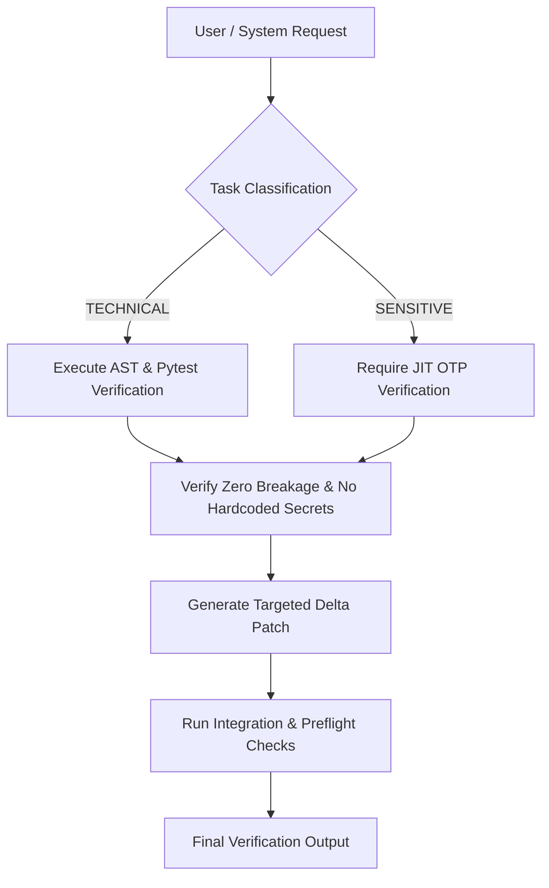

# 📜 Project Constitution & Immutable Architectural Laws

> **Status:** ACTIVE & IMMUTABLE  
> **Target System:** SupremeAI 2.0  
> **Audience:** Human Engineers & Autonomous AI Systems  

---

## 🏛️ SECTION 1: Core Commandments (The Non-Negotiables)

1. **Zero Cost Operation (ZCO Mandate)**
   - All external infrastructure, LLM endpoints, and database usage must target 100% free-tier resources across Cloudflare, Render, Vercel, Firebase, and multi-provider AI endpoints. Paid gateways or resources are strictly forbidden.

2. **Zero Hardcoded Secrets & Real-time Sync**
   - No API keys, JWT secrets, or tokens may exist in the codebase. All environment changes in `.env` must be instantly propagated to all platforms (GitHub Actions, Render, Vercel, Infisical) using `python scripts/sync_all_platforms_env.py`.

3. **AutonoGuard & On-spot JIT OTP Defense**
   - High-privilege actions (user deletion, database flush, secret rotation, system config update) MUST require On-spot Just-In-Time (JIT) OTP verification to insulate against local session hijack or malware infection.

4. **Self-Healing & Circuit Breaker Engine**
   - System failures (429 Rate Limits, API downgrades, network glitches) must trigger automated fallback mechanisms without exposing internal technical traces to end users.

5. **Universal Anti-Loop & Root-Cause First Execution**
   - If any script, command, code patch, or deployment fails twice consecutively, the system MUST HALT immediately, diagnose the root cause from raw logs, and report to human leads.

---

## 🏛️ SECTION 2: Behavioral Rules for Autonomous AI Agents

### 1. Zero Exaggeration Rule
- Agents must never claim "100% test pass" or "all errors fixed" without providing concrete empirical test execution logs.

### 2. Bengali Language Excellence (BLE Rules)
- When communicating in Bengali, responses MUST use respectful "আপনি" (you) and never use "Banglish". Code comments must be in clear Bengali.

### 3. Direct Root-Cause Alignment
- Always perform `git diff` against `origin/main` before making architectural commits.

---

## 🏛️ SECTION 3: System Verification Checklist

- [x] Zero hardcoded API keys verified via AST scanner.
- [x] Multi-cloud sync verified via `scripts/sync_all_platforms_env.py`.
- [x] Circuit breaker fallback verified across Moonshot, DeepSeek, and Together AI.
- [x] JIT OTP flow enforced on all `/api/v1/admin/*` sensitive endpoints.
