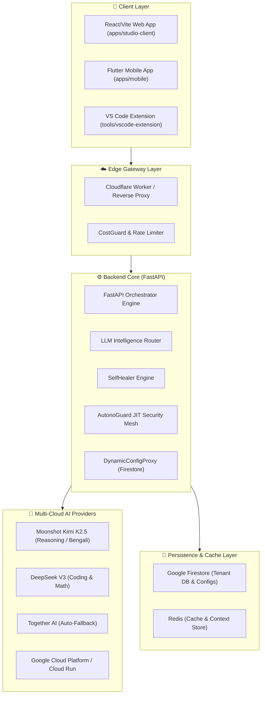
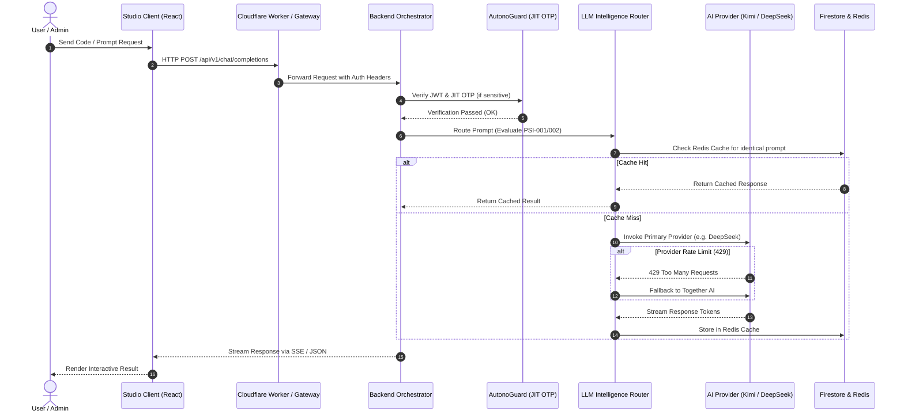

# 🧬 SupremeAI 2.0 — System Genome & Complete Architecture Blueprint

> **Knowledge Card:** `SYSTEM_GENOME`  
> **Responsibility:** Defines the holistic system architecture, module topology, data flow mesh, and inter-service dependencies.

---

## 🏛️ High-Level Enterprise Topology

---

## 🔬 Component Breakdown & Responsibility Matrix

| Component | Path | Primary Purpose | Key Dependencies | Used By | Failure Mode & Recovery |
|---|---|---|---|---|---|
| **FastAPI Core** | `backend/` | Central REST, SSE, & WS orchestrator | `poetry`, `pydantic`, `uvicorn` | All Clients | Auto-restarted by Cloud Run / Render |
| **LLM Router** | `backend/core/llm_router/` | Provider Selection Intelligence (PSI-001 ~ PSI-005) | Provider API Keys | FastAPI Core | Falls back to Together AI on rate limits |
| **AutonoGuard Mesh** | `backend/core/security/` | On-spot JIT OTP & AST auditing | Redis, Firestore | Sensitive Admin APIs | Rejects request; triggers OTP alert |
| **DynamicConfigProxy** | `backend/core/config/` | Database-driven runtime settings | Firestore NoSQL | Entire Backend | Falls back to local default settings |
| **Studio Client** | `apps/studio-client/` | React/Vite web application & God Mode | Vite, React, React Query | End Users / Admins | Served statically via Vercel |

---

## 📊 End-to-End Request Sequence Diagram

