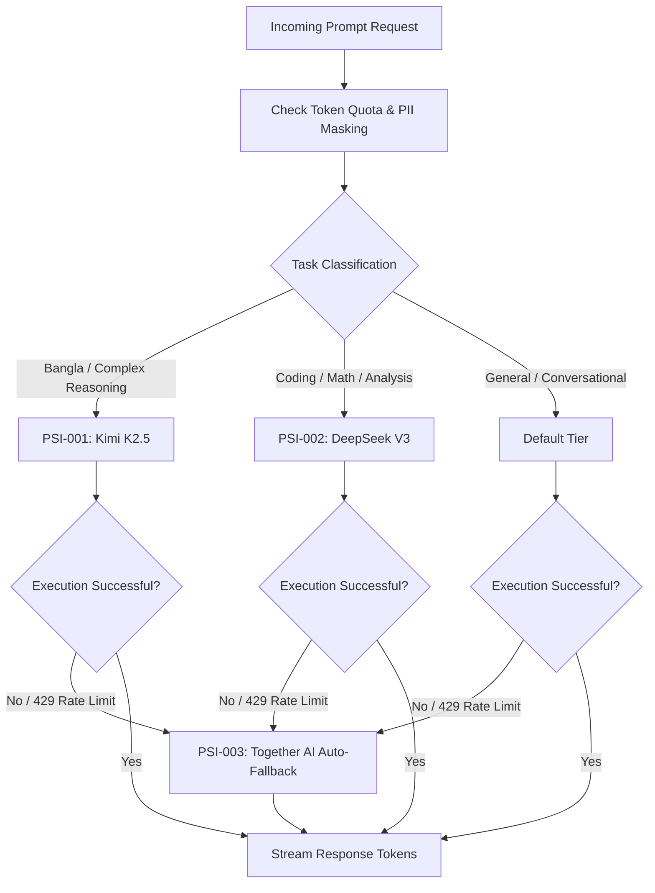

# 🧠 LLM Router & Provider Selection Intelligence (PSI) Specification

> **Knowledge Card:** `LLM_ROUTER_INTELLIGENCE`  
> **Location:** `backend/core/llm_router/`  
> **Responsibility:** Multi-provider AI dynamic routing, zero-cost token optimization, and automatic circuit-breaker fallback.

---

## 🏛️ Routing Rules Engine (PSI-001 ~ PSI-005)

The LLM Router enforces five core intelligence rules to optimize performance, accuracy, and zero-cost constraints:

### Rule Definitions:

1. **PSI-001 (Bengali & Complex Reasoning):**
   - **Target Model:** Kimi K2.5 (Moonshot AI)
   - **Trigger:** Bengali language inputs, high-complexity system reasoning, or structured architectural planning.

2. **PSI-002 (Coding & Mathematical Analysis):**
   - **Target Model:** DeepSeek V3 / Pro
   - **Trigger:** Technical coding prompts, AST analysis, math calculations, or static code reviews.

3. **PSI-003 (Silent Circuit Breaker & Fallback):**
   - **Target Model:** Together AI / Open-Source Fallback Stack
   - **Trigger:** Any 429 Rate Limit, 50x Internal Server Error, or network timeout on primary providers. Fallback is executed silently without exposing errors to users.

4. **PSI-004 (Privacy & PII Masking):**
   - **Action:** Before transmitting prompt context to remote endpoints, sensitive user PII (phone numbers, email addresses, plain-text credentials) is masked dynamically.

5. **PSI-005 (80% Daily Quota Cap):**
   - **Action:** If any free-tier provider reaches 80% of its daily token allocation, new incoming traffic is routed away from that provider to prevent sudden lockout.

---

## 📊 Provider Fallback Matrix

| Primary Provider | Target Model | Primary Task | Fallback Model | Fallback Provider | Latency SLA |
|---|---|---|---|---|---|
| **Moonshot AI** | Kimi K2.5 | Bengali / Reasoning | Llama-3-70B-Instruct | Together AI | < 1500ms |
| **DeepSeek** | DeepSeek V3 | Code / Math / AST | Qwen-2.5-Coder-32B | Together AI | < 1200ms |
| **Google Cloud** | Gemini 1.5 Flash | General / Analysis | DeepSeek V3 | Direct Cloud Run | < 1000ms |
