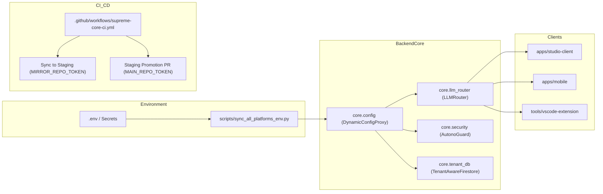

# 🕸️ Living Impact Analysis & Dependency Blast Radius Graph

> **Knowledge Card:** `LIVING_IMPACT_GRAPH`  
> **Location:** `docs/kb/12-genome-and-impact-graphs/`  
> **Responsibility:** Maps component change blast radius, breaking change impacts, and required verification steps across SupremeAI 2.0.

---

## 🗺️ System Component Dependency Graph

---

## ⚡ Change Blast Radius & Impact Matrix

When making modifications to key core files, consult this table to determine what must be tested, updated, or verified:

| Modified Component | Files Changed | High-Risk Impact / Potential Breakage | Required Verification Steps | Related Knowledge Cards |
|---|---|---|---|---|
| **Environment Secrets** | `.env`, `core/config.py` | Cloud Run, Render, Vercel authentication failure | Run `python scripts/sync_all_platforms_env.py` | `ENVIRONMENT_AND_CONFIG_MATRIX` |
| **LLM Router Intelligence** | `backend/core/llm_router/` | Provider routing failure, 429 rate-limit loops | Run `pytest backend/tests/test_llm_router.py` | `LLM_ROUTER_AND_PROVIDER_INTELLIGENCE` |
| **Monorepo CI Workflows** | `.github/workflows/supreme-core-ci.yml` | Mirror sync failure, PR creation block | Validate workflow syntax & test PR dispatch | `DEPLOYMENT_AND_SYNC_INFRASTRUCTURE` |
| **JIT OTP & Auth Mesh** | `backend/core/security/` | Admin lockdown, HTTP 403 authorization failure | Run auth test suite & test JIT OTP endpoint | `SECURITY_JIT_AND_AUTH_MATRIX` |
| **Studio Client UI** | `apps/studio-client/` | Frontend build crash, broken routing | Run `npx tsc --noEmit` & `npx vite build` | `FRONTEND_REACT_VITE_DEEP_DIVE` |

---

## 🛡️ Emergency Rollback & Mitigation Protocol

1. **Secrets Sync Rollback:** If credentials break across platforms, restore known good `.env` and immediately execute `python scripts/sync_all_platforms_env.py`.
2. **CI/CD Pipeline Failure:** If staging promotion PR stalls, verify `MAIN_REPO_TOKEN` validity under GitHub Actions secrets.
3. **Provider Outage:** If primary providers fail, verify Together AI fallback routing in `LLMRouter`.
