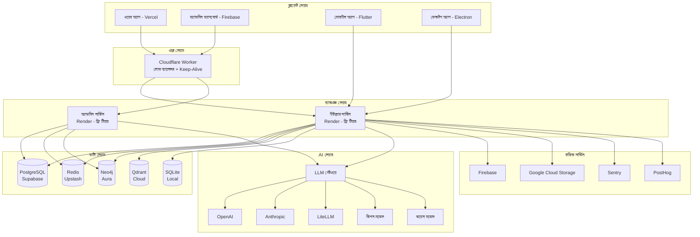
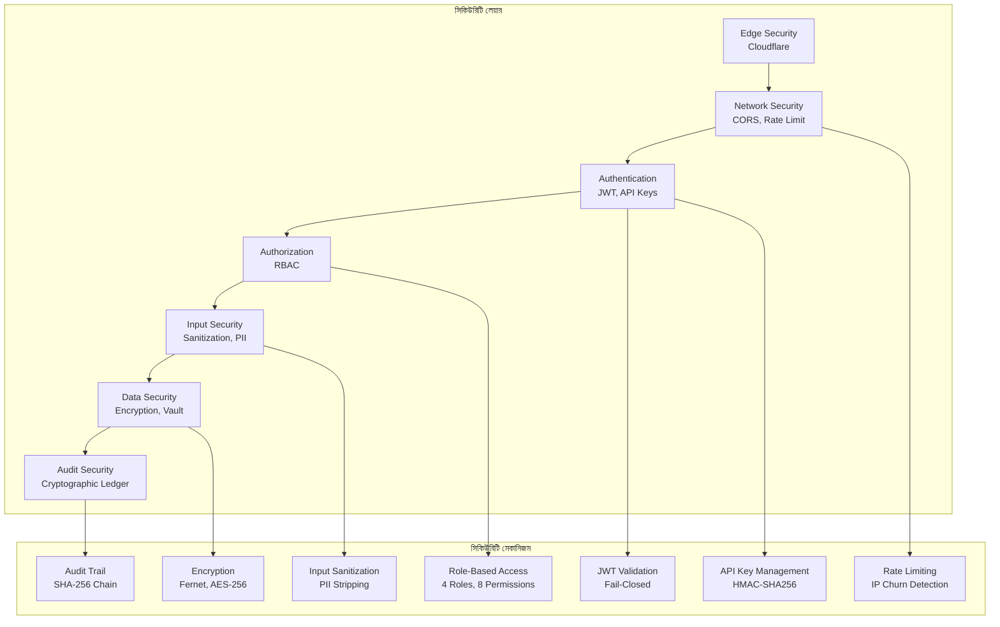
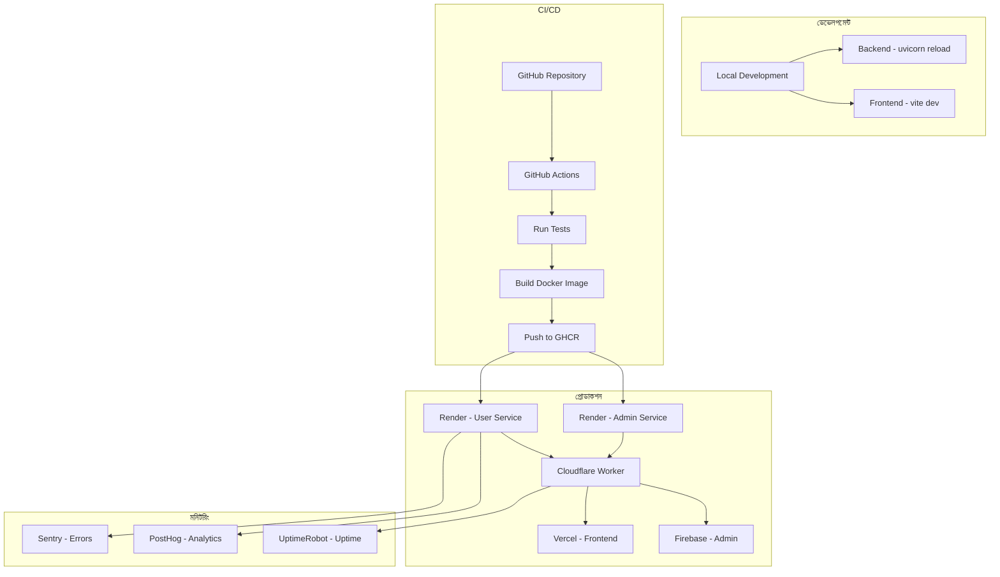

# সুপ্রিম AI 2.0 — সিস্টেম আর্কিটেকচার

**ভার্সন**: 2.0.0  
**শেষ আপডেট**: 2025-01-04  
**স্ট্যাটাস**: লিভিং ডকুমেন্ট  
**ক্লাসিফিকেশন**: ইন্টার্নাল  

---

## 📐 আর্কিটেকচার ওভারভিউ

সুপ্রিম AI 2.0 একটি **মাইক্রোসার্ভিস-ইনস্পায়ার্ড মনোরেপো আর্কিটেকচার** অনুসরণ করে, যা ক্লিয়ার সেপারেশন অফ কনসার্ন, রোল-বেসড সার্ভিস আইসোলেশন এবং পলিগ্লট পেরসিস্টেন্সের সাথে ডিজাইন করা হয়েছে। সিস্টেমটি জিরো-কস্ট অপারেশন বজায় রাখতে এন্টারপ্রাইজ-গ্রেড রিলায়াবিলিটি এবং সিকিউরিটি প্রদান করে।

### আর্কিটেকচার নীতিমালা

1. **সেপারেশন অফ কনসার্ন**: প্রতিটি কম্পোনেন্টের একটি সিঙ্গেল, সুলক্ষিত দায়িত্ব
2. **রোল-বেসড আইসোলেশন**: USER এবং ADMIN সার্ভিস স্বাধীনভাবে চলে সিকিউরিটির জন্য
3. **পলিগ্লট পেরসিস্টেন্স**: প্রতিটি নির্দিষ্ট ব্যবহারের ক্ষেত্রে সেরা ডাটাবেস ব্যবহার করুন
4. **ফেইল-ক্লোজড সিকিউরিটি**: সিকিউরিটি মেকানিজম সুরক্ষিতভাবে ফেইল করে, কখনও অনুমতি দিয়ে না
5. **জিরো-কস্ট ডিজাইন**: ফাংশনালিটি কম্প্রোমাইজ না করে ফ্রি-টিয়ার সার্ভিসের জন্য অপ্টিমাইজ
6. **সেলফ-হিলিং**: স্বয়ংক্রিয় ত্রুটি সনাক্তকরণ এবং পুনরুত্থান
7. **অবজারভেবিলিটি**: ব্যাপক লগিং, মেট্রিক্স এবং ট্রেসিং
8. **এক্সটেনসিবিলিটি**: টুল এবং স্কিলের জন্য প্লাগইন-বেসড আর্কিটেকচার

---

## 🏛️ হাই-লেভেল আর্কিটেকচার



---

## 🔄 সিস্টেম লেয়ার

### 1. ক্লায়েন্ট লেয়ার

**উদ্দেশ্য**: প্ল্যাটফর্মের সাথে ইন্টারঅ্যাক্ট করার জন্য ইউজার ইন্টারফেস

**কম্পোনেন্ট**:

#### ওয়েব অ্যাপ্লিকেশন (Vercel)
- **টেকনোলজি**: React 19, TypeScript, Vite
- **পোর্টাল**: ইউজার-ফেসিং ইন্টারফেস
- **ফিচার**:
  - AI এজেন্ট ডেভেলপমেন্ট IDE
  - ভিজুয়াল পাইপলাইন বিল্ডার
  - Monaco কোড এডিটর
  - ইন্টিগ্রেটেড টার্মিনাল
  - রিয়েল-টাইম কলাবোরেশন
- **ডিপ্লয়মেন্ট**: Vercel (ফ্রি টিয়ার)
- **URL**: https://tiny-stroopwafel-2d981c.netlify.app

#### অ্যাডমিন ড্যাশবোর্ড (Firebase)
- **টেকনোলজি**: React, TypeScript, Vite
- **পোর্টাল**: অ্যাডমিন-অনলি ইন্টারফেস
- **ফিচার**:
  - ইউজার ম্যানেজমেন্ট
  - সিস্টেম মনিটরিং
  - অ্যানালিটিক্স ড্যাশবোর্ড
  - কনফিগারেশন ম্যানেজমেন্ট
- **ডিপ্লয়মেন্ট**: Firebase Hosting (ফ্রি টিয়ার)
- **URL**: https://supremeai-admin.web.app

#### মোবাইল অ্যাপ (Flutter)
- **টেকনোলজি**: Flutter, Dart
- **প্ল্যাটফর্ম**: iOS, Android
- **ফিচার**:
  - চ্যাট ইন্টারফেস
  - সিস্টেম মনিটরিং
  - পুশ নোটিফিকেশন
  - অফলাইন ক্যাপাবিলিটি
- **ডিপ্লয়মেন্ট**: App Store, Google Play
- **স্ট্যাটাস**: ডেভেলপমেন্ট চলছে

#### ডেস্কটপ অ্যাপ (Electron)
- **টেকনোলজি**: Electron, React, TypeScript
- **প্ল্যাটফর্ম**: Windows, macOS, Linux
- **ফিচার**:
  - নেটিভ ডেস্কটপ এক্সপেরিয়েন্স
  - অফলাইন ক্যাপাবিলিটি
  - সিস্টেম ইন্টিগ্রেশন
  - অটো-আপডেট
- **ডিপ্লয়মেন্ট**: Electron Builder
- **স্ট্যাটাস**: ডেভেলপমেন্ট চলছে

---

### 2. এজ লেয়ার

**উদ্দেশ্য**: লোড ব্যালেন্সিং, হেলথ মনিটরিং এবং কস্ট অপ্টিমাইজেশন

**কম্পোনেন্ট**: Cloudflare Worker

**দায়িত্ব**:
- **লোড ব্যালেন্সিং**: ট্রাফিক ইউজার এবং অ্যাডমিন সার্ভিসের মধ্যে বণ্টন
- **কিপ-অ্যালাইভ পিং**: Render ফ্রি টিয়ার স্লিপ প্রতিরোধ (প্রতি ১০ মিনিট পিং)
- **হেলথ চেক অ্যাগ্রিগেশন**: সার্ভিস হেল্থ মনিটরিং
- **জিরো-কস্ট HA**: পেইড লোড ব্যালেন্সার ছাড়া স্বয়ংক্রিয় ফেইলওভার
- **রেট লিমিটিং**: DDoS প্রটেকশনের জন্য এজ-লেভেল রেট লিমিটিং

**টেকনোলজি**:
- রানটাইম: Cloudflare Workers
- ল্যাঙ্গুয়েজ: TypeScript/JavaScript
- ফ্রি টিয়ার: ১০০,০০০ রিকোয়েস্ট/দিন

**অবস্থান**: `cloudflare-worker/`

**মূল ফিচার**:
```typescript
// লোড ব্যালেন্সিং স্ট্র্যাটেজি
- প্রাইমারি: ইউজার সার্ভিস (Render)
- সেকেন্ডারি: অ্যাডমিন সার্ভিস (Render)
- ফলব্যাক: ডিরেক্ট কানেকশন
- হেলথ চেক: /health এন্ডপয়েন্ট
- টাইমআউট: ৫ সেকেন্ড
- রিট্রাই: এক্সপোনেনশিয়াল ব্যাকঅফ সহ ৩ atteম্পট
```

---

### 3. ব্যাকএন্ড লেয়ার

**উদ্দেশ্য**: কোর বিজনেস লজিক, AI অর্কেস্ট্রেশন এবং API সার্ভিস

**আর্কিটেকচার**: রোল-বেসড সার্ভিস আইসোলেশন

#### ইউজার সার্ভিস
- **রোল**: USER
- **পোর্ট**: ৮০০০ (কনফিগারেবল)
- **এন্ডপয়েন্ট**: ৭৫+ API রুট
- **ফিচার**:
  - AI এজেন্ট অপারেশন
  - ইউজার ম্যানেজমেন্ট
  - টুল এক্সিকিউশন
  - মেমরি ম্যানেজমেন্ট
  - নলেজベース
- **ডিপ্লয়মেন্ট**: Render (ফ্রি টিয়ার, ৭৫০h/মাস)
- **অটো-স্লিপ**: হ্যাঁ (Cloudflare Worker দ্বারা ওকোন)

#### অ্যাডমিন সার্ভিস
- **রোল**: ADMIN
- **পোর্ট**: ৮০০০ (কনফিগারেবল)
- **এন্ডপয়েন্ট**: ১৬ অ্যাডমিন-অনলি রুট
- **ফিচার**:
  - সিস্টেম অ্যাডমিনিস্ট্রেশন
  - ইউজার ম্যানেজমেন্ট
  - অ্যানালিটিক্স
  - কনফিগারেশন
  - মনিটরিং
- **ডিপ্লয়মেন্ট**: Render (ফ্রি টিয়ার, ৭৫০h/মাস)
- **অটো-স্লিপ**: হ্যাঁ (Cloudflare Worker দ্বারা ওকোন)

**শেয়ারড কম্পোনেন্ট**:
- উভয় সার্ভিস একই কোডবেস শেয়ার করে
- ভিন্ন এন্ট্রি পয়েন্ট: `core.app_user` বনাম `core.app_admin`
- ভিন্ন রাউটার কনফিগারেশন
- একই ডাটাবেস, ভিন্ন অ্যাক্সেস প্যাটার্ন

**টেকনোলজি স্ট্যাক**:
- ফ্রেমওয়ার্ক: FastAPI 0.136.0
- ল্যাঙ্গুয়েজ: Python 3.11+
- ASGI: Uvicorn 0.51.0
- প্যাকেজ ম্যানেজার: Poetry + uv
- টেস্টিং: Pytest 8.0

**অবস্থান**: `backend/`

---

### 4. ডাটা লেয়ার

**উদ্দেশ্য**: পারসিস্টেন্ট স্টোরেজ, ক্যাচিং এবং ডাটা প্রসেসিং

**আর্কিটেকচার**: পলিগ্লট পেরসিস্টেন্স - প্রতিটি নির্দিষ্ট ব্যবহারের ক্ষেত্রে সেরা ডাটাবেস ব্যবহার করুন

#### PostgreSQL (Supabase)
- **উদ্দেশ্য**: প্রাইমারি রিলেশনাল ডাটাবেস
- **ব্যবহারের ক্ষেত্র**:
  - ইউজার ডাটা
  - এজেন্ট কনফিগারেশন
  - এক্সিকিউশন লগ
  - অডিট ট্রেইল
  - মেটাডেটা
- **ফিচার**:
  - JSONB ফর ফ্লেক্সিবল স্কিমা
  - UUIDv7 ফর IDs
  - pgvector ফর embeddings (১৫৩৬ ডাইমেনশন)
  - রো-লেভেল সিকিউরিটি
  - কানেকশন পুলিং (PgBouncer)
- **ফ্রি টিয়ার**: ৫০০MB স্টোরেজ
- **কানেকশন**: `postgresql+asyncpg://` অ্যাসিঙ্ক ড্রাইভার সহ

#### Redis (Upstash)
- **উদ্দেশ্য**: ক্যাচিং, সেশন, রেট লিমিটিং
- **ব্যবহারের ক্ষেত্র**:
  - সেশন স্টোরেজ
  - রেট লিমিটিং কাউন্টার
  - কুয়ারি রেজাল্ট ক্যাচিং
  - ফিচার ফ্ল্যাগ
  - ডিস্ট্রিবিউটেড লক
- **ফিচার**:
  - TTL-বেসড এক্সপায়ারেশন
  - অ্যাটমিক অপারেশন
  - Pub/sub ফর ইভেন্ট
- **ফ্রি টিয়ার**: ১০,০০০ রিকোয়েস্ট/দিন

#### Neo4j (Aura)
- **উদ্দেশ্য**: নলেজ গ্রাফের জন্য গ্রাফ ডাটাবেস
- **ব্যবহারের ক্ষেত্র**:
  - নলেজ রিলেশনশিপ
  - এজেন্ট কলাবোরেশন গ্রাফ
  - ডিপেন্ডেন্সি ম্যাপিং
  - পাথ ফাইন্ডিং
- **ফিচার**:
  - Cypher কুয়ারি ল্যাঙ্গুয়েজ
  - গ্রাফ অ্যালগরিদম
  - রিলেশনশিপ ট্রাভার্সাল
- **ফ্রি টিয়ার**: ১০,০০০ নোড

#### Qdrant (Cloud)
- **উদ্দেশ্য**: এমবেডিংসের জন্য ভেক্টর ডাটাবেস
- **ব্যবহারের ক্ষেত্র**:
  - সিমান্টিক সার্চ
  - RAG (রিট্রieval-Augmented Generation)
  - সিমিলারিটি ম্যাচিং
  - মেমরি রিট্রieval
- **ফিচার**:
  - ১৫৩৬-ডাইমেনশনাল ভেক্টর
  - Cosine সিমিলারিটি
  - পেলোড ফিল্টারিং
  - হরিজন্টাল স্কেলিং
- **ফ্রি টিয়ার**: ১GB স্টোরেজ

#### SQLite (Local)
- **উদ্দেশ্য**: লোকাল টাস্ক কিউ এবং ফলব্যাক
- **ব্যবহারের ক্ষেত্র**:
  - পেন্ডিং টাস্ক কিউ
  - অফলাইন অপারেশন
  - PostgreSQL অনুপলব্ধ হলে ফলব্যাক
- **ফিচার**:
  - ফাইল-বেসড
  - নেটওয়ার্ক প্রয়োজন নেই
  - ACID কমপ্লায়েন্ট
- **অবস্থান**: `backend/data/pending_tasks.db`

---

### 5. AI লেয়ার

**উদ্দেশ্য**: LLM অর্কেস্ট্রেশন, মাল্টি-মোডাল প্রসেসিং এবং AI সার্ভিস

#### LLM গেটওয়ে
- **উদ্দেশ্য**: মাল্টিপল LLM প্রোভাইডারকে ইউনিফাইড ইন্টারফেস
- **ফিচার**:
  - প্রোভাইডার রাউটিং
  - লোড ব্যালেন্সিং
  - ফলব্যাক স্ট্র্যাটেজি
  - কস্ট অপ্টিমাইজেশন
  - রেট লিমিটিং
  - রেসপন্স ক্যাচিং
- **প্রোভাইডার**:
  - OpenAI (GPT-4, GPT-3.5)
  - Anthropic (Claude 3)
  - LiteLLM (ইউনিফাইড ইন্টারফেস)
  - লোকাল মডেল (অপশনাল)

#### AI সার্ভিস

**মেমরি সার্ভিস**:
- ভেক্টর এমবেডিংস SentenceTransformer সহ
- ক্যাসকেড মেমরি (শর্ট-টার্ম, লং-টার্ম)
- এক্সপেরিয়েন্স ডাটাবেস
- কনটেক্সট ম্যানেজমেন্ট

**নলেজ QA সার্ভিস**:
- ChromaDB সহ RAG সিস্টেম
- টেনেন্ট আইসোলেশন
- সিটেশন ট্র্যাকিং
- অডিট লগিং

**ভিশন সার্ভিস**:
- ইমেজ অ্যানালিসিস
- UI কম্পোনেন্ট এক্সট্র্যাকশন
- ডায়াগ্রাম পার্সিং
- OCR

**ভয়েস সার্ভিস**:
- স্পিচ-টু-টেক্সট (Whisper)
- টেক্সট-টু-স্পিচ (বাংলা TTS)
- ল্যাঙ্গুয়েজ ডিটেকশন

**ভিডিও টু কোড পাইপলাইন**:
- ফ্রেম এক্সট্র্যাকশন (ffmpeg)
- UI অ্যানালিসিস
- কোড জেনারেশন

**ডায়াগ্রাম পার্সার**:
- Mermaid, PlantUML, Draw.io
- কম্পোনেন্ট এক্সট্র্যাকশন
- IaC কোড জেনারেশন

**অবস্থান**: `backend/services/`

---

## 🔐 সিকিউরিটি আর্কিটেকচার



---

## 🔄 ডিপ্লয়মেন্ট আর্কিটেকচার



---

## 📊 আর্কিটেকচার ডেসিশন

### ADR-001: Monorepo আর্কিটেকচার

**ডেসিশন**: pnpm এবং Turborepo সহ মনোরেপো ব্যবহার করুন

**রেশনাল**:
- ফ্রন্টএন্ড এবং ব্যাকএন্ডের মধ্যে শেয়ার্ড কোড
- সার্ভিসের অcross অ্যাটমিক কমিট
- সিমপ্লিফাইড ডিপেন্ডেন্সি ম্যানেজমেন্ট
- কনসিসটেন্ট টুলিং

**বিকল্পগুলি বিবেচনা করা হয়েছে**:
- মাল্টি-রেপো: আরও জটিল, বজায় রাখতে কঠিন
- সিঙ্গেল রেপো: অত্যন্ত কাপলড, স্কেল করতে কঠিন

**পরিণতি**:
- ✅ সহজ ডেভেলপমেন্ট
- ✅ বেটার কোড শেয়ারিং
- ⚠️ বৃহত্তর রিপোজিটরি সাইজ
- ⚠️ আরও জটিল CI/CD

---

### ADR-002: রোল-বেসড সার্ভিস আইসোলেশন

**ডেসিশন**: আলাদা USER এবং ADMIN সার্ভিস

**রেশনাল**:
- সিকিউরিটি: অ্যাডমিন এন্ডপয়েন্ট ইউজার সার্ভিসে এক্সপোজ করা হয় না
- স্কেলেবিলিটি: স্বাধীন স্কেলিং
- রিলায়াবিলিটি: অ্যাডমিন সার্ভিস ইউজার লোড দ্বারা প্রভাবিত হয় না
- কমপ্লায়েন্স: ডিউটি সেপারেশন

**বিকল্পগুলি বিবেচনা করা হয়েছে**:
- সিঙ্গেল সার্ভিস মিডলওয়ার সহ: আরও জটিল, সিকিউর করা কঠিন
- আলাদা রেপো: অত্যন্ত ডুপ্লিকেশন

**পরিণতি**:
- ✅ বেটার সিকিউরিটি
- ✅ স্বাধীন ডিপ্লয়মেন্ট
- ⚠️ কোড ডুপ্লিকেশন
- ⚠️ আরও ইনফ্রাস্ট্রাকচার

---

### ADR-003: পলিগ্লট পেরসিস্টেন্স

**ডেসিশন**: মাল্টিপল ডাটাবেস ব্যবহার করুন (PostgreSQL, Redis, Neo4j, Qdrant)

**রেশনাল**:
- প্রতিটি কাজের জন্য সেরা টুল
- বেটার পারফরম্যান্স
- বিশেষায়িত ফিচার
- ভবিষ্যত-প্রুফ

**বিকল্পগুলি বিবেচনা করা হয়েছে**:
- কেবল PostgreSQL: সীমিত ফিচার, পারফরম্যান্স সমস্যা
- সিঙ্গল NoSQL: রিলেশনাল ক্যাপাবিলিটির ক্ষতি

**পরিণতি**:
- ✅ অপ্টিমাল পারফরম্যান্স
- ✅ রিচ ফিচার
- ⚠️ আরও জটিলতা
- ⚠️ আরও ইনফ্রাস্ট্রাকচার

---

### ADR-004: জিরো-কস্ট ইনফ্রাস্ট্রাকচার

**ডেসিশন**: সম্পূর্ণভাবে ফ্রি-টিয়ার সার্ভিসে চালান

**রেশনাল**:
- AI অ্যাক্সেস ডেমocratize করুন
- কোনো আর্থিক বাধা নেই
- ভিয়াবিলিটি প্রমাণ
- কমিউনিটি বিল্ডিং

**বিকল্পগুলি বিবেচনা করা হয়েছে**:
- পেইড সার্ভিস: বেটার রিলায়াবিলিটি, কিন্তু কস্ট
- সেলফ-হোস্টেড: আরও কন্ট্রোল, কিন্তু জটিলতা

**পরিণতি**:
- ✅ জিরো কস্ট
- ✅ সবাই অ্যাক্সেসযোগ্য
- ⚠️ রিলায়াবিলিটি চ্যালেঞ্জ (অটো-স্লিপ)
- ⚠️ সীমিত রিসোর্স

---

### ADR-005: FastAPI ব্যাকএন্ড

**ডেসিশন**: ব্যাকএন্ডের জন্য FastAPI ব্যবহার করুন

**রেশনাল**:
- হাই পারফরম্যান্স (অ্যাসিঙ্ক)
- অটো-জেনারেটেড OpenAPI ডক্স
- Pydantic সহ টাইপ সেফটি
- আধুনিক Python ফিচার
- গ্রেট ইকোসিস্টেম

**বিকল্পগুলি বিবেচনা করা হয়েছে**:
- Django: অত্যন্ত ভারী, ধীর
- Flask: অত্যন্ত ন্যূনতম, আরও বয়লারপ্লেট
- Node.js: Python-এ টিম এক্সপার্টিজ

**পরিণতি**:
- ✅ ফাস্ট ডেভেলপমেন্ট
- ✅ গ্রেট পারফরম্যান্স
- ✅ অটো-ডকুমেন্টেশন
- ⚠️ Python ইকোসিস্টেম মাত্র

---

## 🔗 সম্পর্কিত ডকুমেন্ট

- [04-FOLDER_STRUCTURE_bn.md](04-FOLDER_STRUCTURE_bn.md) - ডিরেক্টরি সংগঠন
- [05-MODULE_DOCUMENTATION_bn.md](05-MODULE_DOCUMENTATION_bn.md) - মডুল বিবরণ
- [10-DATABASE_DOCUMENTATION_bn.md](10-DATABASE_DOCUMENTATION_bn.md) - ডাটা লেয়ার
- [11-API_DOCUMENTATION_bn.md](11-API_DOCUMENTATION_bn.md) - API লেয়ার
- [14-AI_SYSTEM_DOCUMENTATION_bn.md](14-AI_SYSTEM_DOCUMENTATION_bn.md) - AI লেয়ার
- [21-DEPLOYMENT_DOCUMENTATION_bn.md](21-DEPLOYMENT_DOCUMENTATION_bn.md) - ডিপ্লয়মেন্ট
- [23-SECURITY_DOCUMENTATION_bn.md](23-SECURITY_DOCUMENTATION_bn.md) - সিকিউরিটি

---

## ✅ আর্কিটেকচার ভেরিফিকেশন

**আর্কিটেকচার ভেরিফাই করার উপায়**:

1. **সার্ভিস হেল্থ চেক**:
   ```bash
   curl https://supremeai-backend-08zd.onrender.com/health
   curl https://supremeai-backend-secondary.onrender.com/health
   ```

2. **ডাটাবেস কানেকশন ভেরিফাই**:
   ```bash
   # PostgreSQL চেক
   curl https://supremeai-backend-08zd.onrender.com/api/v1/health/database
   
   # Redis চেক
   curl https://supremeai-backend-08zd.onrender.com/api/v1/health/redis
   ```

3. **AI সার্ভিস টেস্ট**:
   ```bash
   # LLM গেটওয়ে টেস্ট
   curl -X POST https://supremeai-backend-08zd.onrender.com/api/v1/llm/test \
     -H "Authorization: Bearer $TOKEN" \
     -H "Content-Type: application/json" \
     -d '{"prompt": "Hello"}'
   ```

4. **এজ লেয়ার ভেরিফাই**:
   ```bash
   # Cloudflare Worker চেক
   curl https://supremeai-backend-08zd.onrender.com/health \
     -H "CF-Worker: true"
   ```

---

**ডকুমেন্ট স্ট্যাটাস**: ✅ সম্পূর্ণ এবং ভেরিফাইড  
**পরবর্তী রিভিউ**: 2025-02-04  
**অনার**: আর্কিটেকচার টিম  
**ক্লাসিফিকেশন**: ইন্টার্নাল