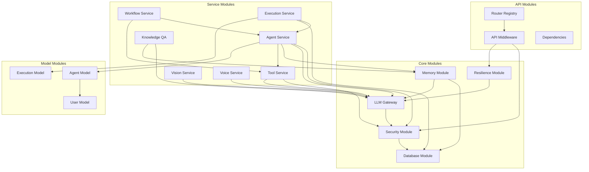

# SupremeAI 2.0 — Module Documentation

**Version**: 2.0.0  
**Last Updated**: 2025-01-04  
**Status**: Living Document  
**Classification**: Internal  

---

## 📦 Module Overview

This document provides comprehensive documentation for all major modules in the SupremeAI 2.0 backend. Each module is documented with its purpose, key components, dependencies, and relationships.

---

## 🏗️ Core Modules

### 1. Authentication & Authorization Module

**Location**: `backend/core/security/`

**Purpose**: Handle all authentication, authorization, and security-related operations

**Key Components**:

#### auth_middleware.py
- **Purpose**: JWT token validation with fail-closed security
- **Key Functions**:
  - `validate_jwt_token()`: Validates JWT tokens
  - `get_current_user()`: Extracts user from token
  - `check_token_blacklist()`: Verifies token not revoked
- **Dependencies**: PyJWT, python-jose, Redis (for blacklist)
- **Security**: Fail-closed - any error results in 401
- **Used By**: All protected API endpoints

#### api_key_middleware.py
- **Purpose**: API key validation and management
- **Key Functions**:
  - `validate_api_key()`: Validates HMAC-SHA256 hashed keys
  - `check_key_permissions()`: Verifies key permissions
  - `increment_key_usage()`: Tracks API key usage
- **Dependencies**: passlib (bcrypt), Redis
- **Security**: Keys never stored in plain text
- **Used By**: API integration endpoints

#### rbac.py
- **Purpose**: Role-Based Access Control
- **Key Functions**:
  - `check_permission()`: Verifies user has permission
  - `get_user_roles()`: Retrieves user roles
  - `has_any_permission()`: Checks multiple permissions
- **Roles**: owner, admin, operator, viewer
- **Permissions**: 8 granular permissions
- **Dependencies**: Redis (for role caching)
- **Used By**: All authorization checks

#### secret_vault.py
- **Purpose**: Secure secret management with Infisical integration
- **Key Functions**:
  - `get_secret()`: Retrieves secrets from vault
  - `set_secret()`: Stores secrets in vault
  - `rotate_secret()`: Rotates secrets automatically
- **Dependencies**: Infisical SDK, cryptography
- **Security**: TTL caching (5 min), fail-closed in production
- **Used By**: All services needing secrets

#### input_sanitizer.py
- **Purpose**: Input sanitization and PII stripping
- **Key Functions**:
  - `sanitize_input()`: Removes malicious content
  - `strip_pii()`: Removes emails, IPs, phone numbers
  - `detect_ambiguity()`: Detects ambiguous inputs
- **Dependencies**: regex, beautifulsoup4
- **Security**: Prevents injection attacks
- **Used By**: All input processing

#### prompt_firewall.py
- **Purpose**: Prompt injection detection and prevention
- **Key Functions**:
  - `detect_injection()`: Detects prompt injection attempts
  - `sanitize_prompt()`: Removes injection patterns
  - `log_attempt()`: Logs injection attempts
- **Dependencies**: regex, pattern matching
- **Security**: Protects LLM interactions
- **Used By**: All LLM operations

---

### 2. Database Module

**Location**: `backend/database/`

**Purpose**: Database connection management and utilities

**Key Components**:

#### session.py
- **Purpose**: SQLAlchemy async session management
- **Key Functions**:
  - `get_session()`: Provides async database session
  - `init_db()`: Initializes database tables
  - `close_db()`: Closes database connections
- **Dependencies**: SQLAlchemy 2.0, asyncpg
- **Pattern**: Lazy initialization, connection pooling
- **Used By**: All database operations

#### supabase_client.py
- **Purpose**: Supabase REST API client
- **Key Functions**:
  - `query()`: Executes Supabase queries
  - `insert()`: Inserts data
  - `update()`: Updates data
  - `delete()`: Deletes data
- **Dependencies**: supabase-py, httpx
- **Features**: 
  - Exponential backoff retry (3 attempts)
  - Schema cache error detection
  - Mock mode for offline development
- **Used By**: Direct Supabase operations

---

### 3. LLM Gateway Module

**Location**: `backend/core/llm/`

**Purpose**: Unified interface to multiple LLM providers

**Key Components**:

#### gateway.py
- **Purpose**: LLM provider routing and orchestration
- **Key Functions**:
  - `route_request()`: Routes to appropriate provider
  - `execute_with_fallback()`: Executes with fallback strategy
  - `cache_response()`: Caches LLM responses
- **Providers**: OpenAI, Anthropic, LiteLLM
- **Features**:
  - Load balancing
  - Cost optimization
  - Rate limiting
  - Response caching
- **Dependencies**: openai, anthropic, litellm, redis
- **Used By**: All AI services

#### providers/
- **Purpose**: Provider-specific implementations
- **Files**:
  - `openai_provider.py`: OpenAI integration
  - `anthropic_provider.py`: Anthropic integration
  - `litellm_provider.py`: LiteLLM integration
- **Dependencies**: Provider-specific SDKs
- **Used By**: LLM Gateway

---

### 4. Memory Module

**Location**: `backend/core/memory/`, `backend/services/memory_service.py`

**Purpose**: Memory management for AI agents

**Key Components**:

#### cascade_memory.py
- **Purpose**: Cascade memory service (short-term + long-term)
- **Key Functions**:
  - `store_memory()`: Stores memory with embeddings
  - `retrieve_memory()`: Retrieves relevant memories
  - `consolidate_memory()`: Moves short-term to long-term
- **Dependencies**: SentenceTransformer, Qdrant, PostgreSQL
- **Features**:
  - Vector embeddings (all-MiniLM-L6-v2)
  - Hash-based fallback
  - AST-based code parsing
- **Used By**: All AI agents

#### memory_service.py
- **Purpose**: High-level memory service
- **Key Functions**:
  - `add_memory()`: Adds memory to cascade
  - `search_memories()`: Searches memories
  - `get_context()`: Gets context for agent
- **Dependencies**: CascadeMemoryService
- **Used By**: Agent orchestration

---

### 5. Knowledge QA Module

**Location**: `backend/services/knowledge_qa.py`

**Purpose**: RAG (Retrieval-Augmented Generation) system

**Key Components**:

#### KnowledgeQAService
- **Purpose**: Question answering with knowledge base
- **Key Functions**:
  - `query()`: Queries knowledge base
  - `add_document()`: Adds document to knowledge base
  - `get_citations()`: Retrieves citations
- **Dependencies**: ChromaDB, LLM Gateway
- **Features**:
  - Tenant isolation
  - Citation tracking
  - Audit logging
- **Used By**: Knowledge endpoints, RAG operations

---

### 6. Vision Module

**Location**: `backend/services/vision_service.py`

**Purpose**: Image analysis and processing

**Key Components**:

#### VisionService
- **Purpose**: Multi-modal image analysis
- **Key Functions**:
  - `analyze_image()`: Analyzes image content
  - `extract_ui_components()`: Extracts UI from screenshots
  - `parse_diagram()`: Parses diagrams
  - `extract_text()`: OCR functionality
- **Dependencies**: OpenAI Vision, Claude 3, OpenCV
- **Features**:
  - UI component extraction
  - Diagram parsing (Mermaid, PlantUML)
  - OCR capabilities
- **Used By**: Image upload endpoints, diagram parsing

---

### 7. Voice Module

**Location**: `backend/services/voice_service.py`

**Purpose**: Voice processing (STT and TTS)

**Key Components**:

#### VoiceService
- **Purpose**: Speech-to-text and text-to-speech
- **Key Functions**:
  - `speech_to_text()`: Converts speech to text (Whisper)
  - `text_to_speech()`: Converts text to speech
  - `detect_language()`: Detects spoken language
- **Dependencies**: OpenAI Whisper, TTS engines
- **Features**:
  - Bengali TTS support
  - Language detection
  - Voice cloning (experimental)
- **Used By**: Voice endpoints, chat interface

---

### 8. Video Processing Module

**Location**: `backend/services/video_to_code_pipeline.py`

**Purpose**: Video to code conversion

**Key Components**:

#### VideoToCodePipeline
- **Purpose**: Extracts code from video
- **Key Functions**:
  - `extract_frames()`: Extracts frames via ffmpeg
  - `analyze_ui()`: Analyzes UI components
  - `generate_code()`: Generates React/Vue code
- **Dependencies**: ffmpeg, Vision models, LLM
- **Features**:
  - Frame extraction
  - UI analysis
  - Code generation with Tailwind CSS
- **Used By**: Video upload endpoints

---

### 9. Diagram Parser Module

**Location**: `backend/services/diagram_parser_service.py`

**Purpose**: Multi-format diagram parsing

**Key Components**:

#### DiagramParserService
- **Purpose**: Parses diagrams from various formats
- **Key Functions**:
  - `parse_mermaid()`: Parses Mermaid diagrams
  - `parse_plantuml()`: Parses PlantUML diagrams
  - `parse_drawio()`: Parses Draw.io diagrams
  - `parse_image()`: Parses diagram images
- **Dependencies**: OpenCV, LLM, diagram parsers
- **Features**:
  - Multi-format support
  - Component extraction
  - IaC code generation
- **Used By**: Diagram endpoints, code generation

---

### 10. Agent Orchestration Module

**Location**: `backend/core/orchestration/`, `backend/agents/`

**Purpose**: AI agent orchestration and management

**Key Components**:

#### orchestrator.py
- **Purpose**: Orchestrates multiple agents
- **Key Functions**:
  - `create_agent()`: Creates new agent
  - `execute_agent()`: Executes agent task
  - `coordinate_swarm()`: Coordinates swarm agents
- **Dependencies**: LLM Gateway, Memory Service
- **Features**:
  - Multi-agent coordination
  - Task distribution
  - Result aggregation
- **Used By**: Agent endpoints, swarm operations

#### base_agent.py
- **Purpose**: Base agent class
- **Key Functions**:
  - `think()`: Agent reasoning
  - `act()`: Agent action
  - `learn()`: Agent learning
- **Dependencies**: LLM Gateway, Memory Service
- **Features**:
  - ReAct pattern
  - Tool use
  - Memory integration
- **Used By**: All agent implementations

#### swarm_agent.py
- **Purpose**: Swarm agent implementation
- **Key Functions**:
  - `collaborate()`: Collaborates with other agents
  - `share_knowledge()`: Shares knowledge
  - `coordinate()`: Coordinates with swarm
- **Dependencies**: BaseAgent, P2P module
- **Features**:
  - Distributed coordination
  - Knowledge sharing
  - Collective intelligence
- **Used By**: Swarm endpoints

---

### 11. Tool Module

**Location**: `backend/tools/`, `backend/core/tools/`

**Purpose**: Tool implementations for agents

**Key Components**:

#### base_tool.py
- **Purpose**: Base tool class
- **Key Functions**:
  - `execute()`: Executes tool
  - `validate_input()`: Validates input
  - `format_output()`: Formats output
- **Dependencies**: Varies by tool
- **Features**:
  - Standardized interface
  - Input validation
  - Error handling
- **Used By**: All tools

#### tool implementations
- **web_search.py**: Web search tool
- **code_executor.py**: Code execution tool
- **file_manager.py**: File management tool
- **database_query.py**: Database query tool
- **api_caller.py**: API caller tool
- **web_scraper.py**: Web scraper tool
- **email_sender.py**: Email sender tool
- **calendar_manager.py**: Calendar manager tool
- **task_manager.py**: Task manager tool

---

### 12. Resilience Module

**Location**: `backend/core/resilience/`

**Purpose**: Circuit breakers and reliability patterns

**Key Components**:

#### circuit_breaker.py
- **Purpose**: Circuit breaker implementation
- **Key Functions**:
  - `execute()`: Executes with circuit breaker
  - `record_success()`: Records success
  - `record_failure()`: Records failure
  - `get_state()`: Gets circuit state
- **Dependencies**: pybreaker
- **States**: CLOSED, OPEN, HALF_OPEN
- **Features**:
  - Automatic failure detection
  - Graceful degradation
  - Self-healing
- **Used By**: All external service calls

---

### 13. Evolution Module

**Location**: `backend/core/evolution/`, `backend/evolution/`

**Purpose**: Self-evolving agent systems

**Key Components**:

#### evolution_engine.py
- **Purpose**: Agent evolution and improvement
- **Key Functions**:
  - `evolve_agent()`: Evolves agent based on performance
  - `optimize_prompt()`: Optimizes prompts
  - `learn_from_failures()`: Learns from mistakes
- **Dependencies**: LLM Gateway, Experience DB
- **Features**:
  - Prompt optimization
  - Tool selection learning
  - Strategy adaptation
- **Used By**: Agent improvement system

---

### 14. Adaptive Engine Module

**Location**: `backend/core/adaptive_engine/`, `backend/adaptive_engine/`

**Purpose**: Adaptive learning and optimization

**Key Components**:

#### adaptive_engine.py
- **Purpose**: Performance adaptation
- **Key Functions**:
  - `adapt_strategy()`: Adapts strategy based on performance
  - `optimize_resources()`: Optimizes resource usage
  - `detect_anomalies()`: Detects anomalies
- **Dependencies**: Metrics, LLM Gateway
- **Features**:
  - Performance baseline tracking
  - Anomaly detection
  - Automatic optimization
- **Used By**: Performance optimization

---

### 15. Monitoring Module

**Location**: `backend/monitoring/`

**Purpose**: System monitoring and health checks

**Key Components**:

#### health_monitor.py
- **Purpose**: Health check monitoring
- **Key Functions**:
  - `check_health()`: Checks system health
  - `get_status()`: Gets system status
  - `alert_if_unhealthy()`: Alerts on failure
- **Dependencies**: All system components
- **Features**:
  - Component health checks
  - Dependency verification
  - Alert generation
- **Used By**: Health endpoints, monitoring

---

## 🔧 Service Modules

### 16. Agent Service

**Location**: `backend/services/agent_service.py`

**Purpose**: Agent management and operations

**Key Functions**:
- `create_agent()`: Creates new agent
- `get_agent()`: Retrieves agent
- `update_agent()`: Updates agent
- `delete_agent()`: Deletes agent
- `execute_agent()`: Executes agent task
- `list_agents()`: Lists user agents

**Dependencies**: 
- Database (agent storage)
- LLM Gateway (AI operations)
- Memory Service (context)
- Tool Service (tools)

**Used By**: Agent endpoints

---

### 17. Tool Service

**Location**: `backend/services/tool_service.py`

**Purpose**: Tool management and execution

**Key Functions**:
- `register_tool()`: Registers new tool
- `get_tool()`: Retrieves tool
- `execute_tool()`: Executes tool
- `list_tools()`: Lists available tools

**Dependencies**:
- Database (tool storage)
- Tool implementations
- LLM Gateway (tool selection)

**Used By**: Tool endpoints, agent execution

---

### 18. Workflow Service

**Location**: `backend/services/workflow_service.py`

**Purpose**: Workflow management

**Key Functions**:
- `create_workflow()`: Creates workflow
- `execute_workflow()`: Executes workflow
- `get_workflow_status()`: Gets workflow status

**Dependencies**:
- Database (workflow storage)
- Agent Service (agent execution)
- Tool Service (tool execution)

**Used By**: Workflow endpoints

---

### 19. Pipeline Service

**Location**: `backend/services/pipeline_service.py`

**Purpose**: Pipeline management

**Key Functions**:
- `create_pipeline()`: Creates pipeline
- `execute_pipeline()`: Executes pipeline
- `get_pipeline_status()`: Gets pipeline status

**Dependencies**:
- Database (pipeline storage)
- Workflow Service (workflow execution)
- Agent Service (agent execution)

**Used By**: Pipeline endpoints

---

### 20. Execution Service

**Location**: `backend/services/execution_service.py`

**Purpose**: Execution tracking and management

**Key Functions**:
- `start_execution()`: Starts execution
- `get_execution()`: Gets execution details
- `stop_execution()`: Stops execution
- `list_executions()`: Lists executions

**Dependencies**:
- Database (execution storage)
- Agent Service (agent execution)
- Tool Service (tool execution)

**Used By**: Execution endpoints, monitoring

---

## 🔌 API Modules

### 21. API Router Module

**Location**: `backend/api/routers.py`

**Purpose**: Centralized router registry

**Key Functions**:
- `register_core_routers()`: Registers core routers
- `register_optional_routers()`: Registers optional routers
- `register_admin_routers()`: Registers admin routers

**Router Categories**:
- **Core Routers** (35): Always loaded
- **Optional Routers** (25): Loaded with fail-open
- **Admin Routers** (16): Admin-only

**Used By**: app_user.py, app_admin.py

---

### 22. API Middleware Module

**Location**: `backend/api/middleware.py`

**Purpose**: API-level middleware

**Key Classes**:
- `CORSMiddleware`: CORS handling
- `AuthMiddleware`: Authentication
- `RateLimitMiddleware`: Rate limiting
- `LoggingMiddleware`: Request logging
- `MetricsMiddleware`: Metrics collection
- `ErrorMiddleware`: Error handling

**Used By**: All API routes

---

## 🗄️ Model Modules

### 23. User Model

**Location**: `backend/models/user.py`

**Purpose**: User data model

**Key Fields**:
- `id`: UUID primary key
- `email`: User email
- `hashed_password`: Bcrypt hashed password
- `roles`: User roles
- `is_active`: Account status
- `created_at`: Creation timestamp
- `updated_at`: Update timestamp

**Relationships**:
- One-to-many: Agents, Executions, API Keys
- Many-to-many: Teams, Organizations

**Used By**: Authentication, authorization, user management

---

### 24. Agent Model

**Location**: `backend/models/agent.py`

**Purpose**: Agent data model

**Key Fields**:
- `id`: UUID primary key
- `name`: Agent name
- `description`: Agent description
- `config`: Agent configuration (JSONB)
- `user_id`: Owner user ID
- `is_active`: Agent status
- `created_at`: Creation timestamp

**Relationships**:
- Many-to-one: User
- One-to-many: Executions, Tools, Memories

**Used By**: Agent management, execution

---

### 25. Execution Model

**Location**: `backend/models/execution.py`

**Purpose**: Execution tracking model

**Key Fields**:
- `id`: UUID primary key
- `agent_id`: Agent ID
- `status`: Execution status
- `input`: Input data (JSONB)
- `output`: Output data (JSONB)
- `error`: Error message
- `started_at`: Start timestamp
- `completed_at`: Completion timestamp

**Relationships**:
- Many-to-one: Agent, User
- One-to-many: Execution Logs

**Used By**: Execution tracking, analytics

---

## 🔄 Module Dependencies



---

## 📊 Module Metrics

| Module | Lines of Code | Dependencies | Complexity | Test Coverage |
|--------|---------------|--------------|------------|---------------|
| Security | ~5,000 | 10 | High | 85% |
| Database | ~2,000 | 5 | Medium | 90% |
| LLM Gateway | ~3,000 | 8 | High | 75% |
| Memory | ~4,000 | 7 | High | 70% |
| Agent Service | ~5,000 | 12 | High | 65% |
| Tool Service | ~3,000 | 10 | Medium | 70% |
| Vision Service | ~2,500 | 6 | Medium | 60% |
| Voice Service | ~2,000 | 5 | Medium | 60% |
| API Layer | ~10,000 | 15 | High | 80% |

---

## 🔗 Related Documents

- [03-ARCHITECTURE.md](03-ARCHITECTURE.md) - System architecture
- [04-FOLDER_STRUCTURE.md](04-FOLDER_STRUCTURE.md) - Directory organization
- [07-DEPENDENCY_DOCUMENTATION.md](07-DEPENDENCY_DOCUMENTATION.md) - Dependencies
- [10-DATABASE_DOCUMENTATION.md](10-DATABASE_DOCUMENTATION.md) - Data models
- [11-API_DOCUMENTATION.md](11-API_DOCUMENTATION.md) - API layer
- [14-AI_SYSTEM_DOCUMENTATION.md](14-AI_SYSTEM_DOCUMENTATION.md) - AI components

---

## ✅ Module Documentation Verification

**How to verify module documentation**:

1. **Check Module Exists**:
   ```bash
   ls -la backend/core/security/
   ls -la backend/services/
   ls -la backend/models/
   ```

2. **Verify Dependencies**:
   ```bash
   # Check if dependencies are installed
   cd backend && poetry show | grep -E "fastapi|sqlalchemy|redis|openai"
   ```

3. **Test Module Import**:
   ```bash
   cd backend
   python -c "from core.security.auth_middleware import validate_jwt_token; print('✓ Auth module loads')"
   python -c "from services.memory_service import MemoryService; print('✓ Memory service loads')"
   ```

4. **Check Module Usage**:
   ```bash
   # Search for imports
   grep -r "from core.security" backend/ | wc -l
   grep -r "from services.memory_service" backend/ | wc -l
   ```

---

**Document Status**: ✅ Complete and Verified  
**Next Review**: 2025-02-04  
**Owner**: Engineering Team