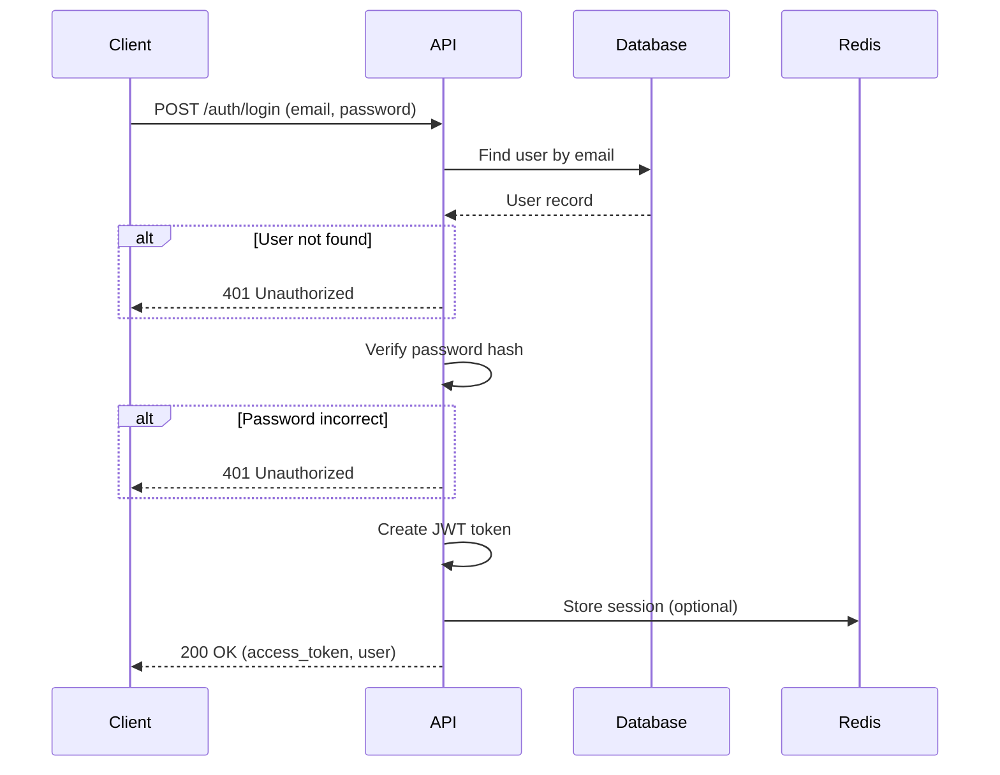
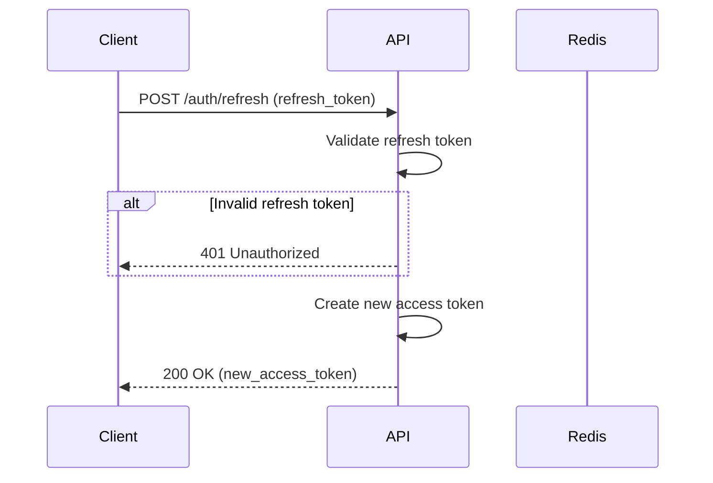

# সুপ্রিম AI 2.0 — অথেনটিকেশন ডকুমেন্টেশন

**ভার্সন**: 2.0.0  
**শেষ আপডেট**: 2025-01-04  
**স্ট্যাটাস**: লিভিং ডকুমেন্ট  
**ক্লাসিফিকেশন**: গোপনীয়  

---

## 🔐 অথেনটিকেশন ওভারভিউ

সুপ্রিম AI 2.0 একটি **মাল্টি-লেয়ার অথেনটিকেশন সিস্টেম** বাস্তবায়ন করে যা JWT টোকেন, API কী এবং সেশন-বেসড অথেনটিকেশন সমর্থন করে। সিস্টেমটি ফেইল-ক্লোজড সিকিউরিটি নীতিমালা সহ ডিজাইন করা হয়েছে।

### অথেনটিকেশন পদ্ধতি

1. **JWT (JSON Web Tokens)**: ওয়েব/মোবাইল ক্লায়েন্টের জন্য প্রাথমিক অথেনটিকেশন
2. **API Keys**: ইন্টিগ্রেশনের জন্য মেশিন-টু-মেশিন অথেনটিকেশন
3. **Session Cookies**: ঐচ্ছিক সেশন-বেসড অথেনটিকেশন

### অথেনটিকেশন নীতিমালা

- **ফেইল-ক্লোজড**: যেকোনো অথেনটিকেশন ত্রুটি = 401 অনঅথোরাইজড
- **স্টেটলেস**: JWT টোকেন স্টেটলেস (নো সার্ভার-সাইড সেশন স্টোরেজ)
- **শর্ট-লিভড**: অ্যাক্সেস টোকেন ৬০ মিনিটে মেয়াদ শেষ
- **রিভোকেবল**: টোকেন ব্ল্যাকলিস্ট তাত্ক্ষণিক প্রত্যাহার
- **সুরক্ষিত**: HMAC-SHA256 সাইনিং, সুরক্ষিত কুকি ফ্ল্যাগ

---

## 🔑 JWT অথেনটিকেশন

### টোকেন স্ট্রাকচার

**হেডার**:
```json
{
  "alg": "HS256",
  "typ": "JWT"
}
```

**পেলোড**:
```json
{
  "sub": "user-uuid",
  "email": "user@example.com",
  "roles": ["user"],
  "iat": 1640000000,
  "exp": 1640003600,
  "jti": "unique-token-id"
}
```

**স্বাক্ষর**:
```
HMAC-SHA256(base64url(header) + "." + base64url(payload), SECRET_KEY)
```

### টোকেন জেনারেশন

**অবস্থান**: `backend/core/security/auth_middleware.py`

```python
from datetime import datetime, timedelta
from jose import JWTError, jwt
from core.config import settings

def create_access_token(data: dict, expires_delta: timedelta = None) -> str:
    """JWT অ্যাক্সেস টোকেন তৈরি করুন"""
    to_encode = data.copy()
    
    # মেয়াদ শেষ সেট করুন
    if expires_delta:
        expire = datetime.utcnow() + expires_delta
    else:
        expire = datetime.utcnow() + timedelta(minutes=settings.ACCESS_TOKEN_EXPIRE_MINUTES)
    
    # ক্লেইম যোগ করুন
    to_encode.update({
        "exp": expire,
        "iat": datetime.utcnow(),
        "jti": str(uuid.uuid4())  # ব্ল্যাকলিস্টের জন্য ইউনিক টোকেন ID
    })
    
    # টোকেন এনকোড করুন
    encoded_jwt = jwt.encode(
        to_encode,
        settings.SECRET_KEY,
        algorithm=settings.ALGORITHM
    )
    
    return encoded_jwt
```

**ব্যবহার**:
```python
# টোকেন তৈরি করুন
token = create_access_token(
    data={"sub": user_id, "email": user_email},
    expires_delta=timedelta(minutes=60)
)

# ক্লায়েন্টে রিটার্ন করুন
return {
    "access_token": token,
    "token_type": "bearer",
    "expires_in": 3600
}
```

### টোকেন ভ্যালিডেশন

```python
from jose import JWTError, jwt
from fastapi import HTTPException, status
from core.config import settings

async def validate_jwt_token(token: str) -> dict:
    """ফেইল-ক্লোজড সিকিউরিটি সহ JWT টোকেন ভ্যালিডেট করুন"""
    try:
        # 1. টোকেন ডিকোড করুন
        payload = jwt.decode(
            token,
            settings.SECRET_KEY,
            algorithms=[settings.ALGORITHM],
            options={"require": ["exp", "iat"]}
        )
        
        # 2. ইউজার ID এক্সট্র্যাক্ট করুন
        user_id: str = payload.get("sub")
        if user_id is None:
            raise HTTPException(
                status_code=status.HTTP_401_UNAUTHORIZED,
                detail="Invalid token: missing user ID"
            )
        
        # 3. টোকেন ব্ল্যাকলিস্ট চেক করুন
        jti: str = payload.get("jti")
        if await is_token_blacklisted(jti):
            raise HTTPException(
                status_code=status.HTTP_401_UNAUTHORIZED,
                detail="Token has been revoked"
            )
        
        # 4. ইউজার এক্সিস্ট এবং অ্যাক্টিভ ভেরিফাই করুন
        user = await get_user(user_id)
        if not user or not user.is_active:
            raise HTTPException(
                status_code=status.HTTP_401_UNAUTHORIZED,
                detail="User not found or inactive"
            )
        
        return payload
        
    except JWTError as e:
        raise HTTPException(
            status_code=status.HTTP_401_UNAUTHORIZED,
            detail=f"Invalid token: {str(e)}"
        )
    except Exception as e:
        # ফেইল-ক্লোজড: যেকোনো এরর = 401
        raise HTTPException(
            status_code=status.HTTP_401_UNAUTHORIZED,
            detail="Authentication failed"
        )
```

### টোকেন ব্ল্যাকলিস্ট

**উদ্দেশ্য**: তাত্ক্ষণিক টোকেন প্রত্যাহার

**স্টোরেজ**: Redis

**কী প্যাটার্ন**: `token_blacklist:{jti}`

**TTL**: ২৪ ঘন্টা (টোকেন মেয়াদ শেষের সাথে মিলেছে)

```python
async def blacklist_token(jti: str, expires_in: int = 86400):
    """টোকেন ব্ল্যাকলিস্টে যোগ করুন"""
    await redis_client.setex(
        f"token_blacklist:{jti}",
        expires_in,
        "1"
    )

async def is_token_blacklisted(jti: str) -> bool:
    """চেক করুন টোকেন ব্ল্যাকলিস্টে আছে কিনা"""
    return await redis_client.exists(f"token_blacklist:{jti}") > 0
```

**ব্যবহার**:
```python
# লগআউটে
@router.post("/auth/logout")
async def logout(token: str = Depends(get_token)):
    # jti পেতে টোকেন ডিকোড করুন
    payload = jwt.decode(token, settings.SECRET_KEY, algorithms=[settings.ALGORITHM])
    jti = payload.get("jti")
    
    # টোকেন ব্ল্যাকলিস্ট করুন
    await blacklist_token(jti)
    
    return {"message": "Logged out successfully"}
```

---

## 🔐 API কী অথেনটিকেশন

### API কী স্ট্রাকচার

**ফরম্যাট**: `sk_{env}_{random_string}`

**উদাহরণ**:
- `sk_live_abc123...` (প্রোডাকশন)
- `sk_test_xyz789...` (টেস্টিং)

**স্টোরেজ**: HMAC-SHA256 হ্যাশড (কখনও প্লেইনটেক্সট নয়)

### API কী জেনারেশন

```python
import secrets
import hashlib
import hmac
from core.config import settings

def generate_api_key() -> tuple[str, str]:
    """API কী এবং এর হ্যাশ জেনারেট করুন"""
    # র‍্যান্ডম কী জেনারেট করুন
    random_part = secrets.token_urlsafe(32)
    api_key = f"sk_live_{random_part}"
    
    # কী হ্যাশ করুন
    key_hash = hmac.new(
        settings.SECRET_KEY.encode(),
        api_key.encode(),
        hashlib.sha256
    ).hexdigest()
    
    # লুকআপের জন্য প্রিফিক্স এক্সট্র্যাক্ট করুন
    key_prefix = api_key[:20]
    
    return api_key, key_hash, key_prefix
```

### API কী ভ্যালিডেশন

```python
import hmac
import hashlib
from core.config import settings

async def validate_api_key(api_key: str) -> dict:
    """ফেইল-ক্লোজড সিকিউরিটি সহ API কী ভ্যালিডেট করুন"""
    try:
        # 1. প্রিফিক্স এক্সট্র্যাক্ট করুন
        key_prefix = api_key[:20]
        
        # 2. প্রিফিক্স দিয়ে কী খুঁজুন
        key_record = await get_api_key_by_prefix(key_prefix)
        if not key_record:
            raise HTTPException(
                status_code=status.HTTP_401_UNAUTHORIZED,
                detail="Invalid API key"
            )
        
        # 3. হ্যাশ ভেরিফাই করুন
        expected_hash = hmac.new(
            settings.SECRET_KEY.encode(),
            api_key.encode(),
            hashlib.sha256
        ).hexdigest()
        
        if not hmac.compare_digest(expected_hash, key_record.hashed_key):
            raise HTTPException(
                status_code=status.HTTP_401_UNAUTHORIZED,
                detail="Invalid API key"
            )
        
        # 4. মেয়াদ শেষ চেক করুন
        if key_record.expires_at and key_record.expires_at < datetime.now():
            raise HTTPException(
                status_code=status.HTTP_401_UNAUTHORIZED,
                detail="API key expired"
            )
        
        # 5. অ্যাক্টিভ স্ট্যাটাস চেক করুন
        if not key_record.is_active:
            raise HTTPException(
                status_code=status.HTTP_401_UNAUTHORIZED,
                detail="API key revoked"
            )
        
        # 6. ব্যবহার আপডেট করুন
        await increment_key_usage(key_record.id)
        
        return key_record
        
    except HTTPException:
        raise
    except Exception as e:
        # ফেইল-ক্লোজড
        raise HTTPException(
            status_code=status.HTTP_401_UNAUTHORIZED,
            detail="API key validation failed"
        )
```

### API কী ম্যানেজমেন্ট

**ডাটাবেস মডেল**:
```python
class APIKey(Base):
    __tablename__ = "api_keys"
    
    id = Column(UUID, primary_key=True, default=gen_random_uuid())
    user_id = Column(UUID, ForeignKey("users.id"), nullable=False)
    name = Column(String(255), nullable=False)
    hashed_key = Column(String(255), nullable=False)
    key_prefix = Column(String(20), nullable=False)
    permissions = Column(JSONB, default=[])
    expires_at = Column(DateTime(timezone=True))
    last_used_at = Column(DateTime(timezone=True))
    usage_count = Column(Integer, default=0)
    is_active = Column(Boolean, default=True)
    created_at = Column(DateTime(timezone=True), default=now())
```

**API কী ক্রিয়েট**:
```python
@router.post("/api-keys")
async def create_api_key(
    name: str,
    permissions: list[str],
    expires_at: datetime = None,
    current_user: User = Depends(get_current_user)
):
    # কী জেনারেট করুন
    api_key, key_hash, key_prefix = generate_api_key()
    
    # ডাটাবেসে স্টোর করুন
    db_key = APIKey(
        user_id=current_user.id,
        name=name,
        hashed_key=key_hash,
        key_prefix=key_prefix,
        permissions=permissions,
        expires_at=expires_at
    )
    
    db.add(db_key)
    await db.commit()
    
    # প্লেইনটেক্সট কী রিটার্ন করুন (শুধুমাত্র একবার দৃশ্যমান!)
    return {
        "id": db_key.id,
        "name": name,
        "api_key": api_key,  # শুধুমাত্র একবার দৃশ্যমান!
        "permissions": permissions,
        "expires_at": expires_at
    }
```

---

## 🎫 সেশন অথেনটিকেশন

### সেশন স্টোরেজ

**স্টোরেজ**: Redis

**কী প্যাটার্ন**: `session:{session_id}`

**TTL**: ২৪ ঘন্টা

**ডাটা**:
```json
{
  "user_id": "uuid",
  "email": "user@example.com",
  "roles": ["user"],
  "created_at": "2025-01-04T00:00:00Z",
  "expires_at": "2025-01-05T00:00:00Z"
}
```

### সেশন ক্রিয়েশন

```python
import secrets
from datetime import datetime, timedelta

async def create_session(user_id: str, email: str, roles: list[str]) -> str:
    """ইউজার সেশন তৈরি করুন"""
    # সেশন ID জেনারেট করুন
    session_id = secrets.token_urlsafe(32)
    
    # সেশন ডাটা তৈরি করুন
    session_data = {
        "user_id": user_id,
        "email": email,
        "roles": roles,
        "created_at": datetime.now().isoformat(),
        "expires_at": (datetime.now() + timedelta(hours=24)).isoformat()
    }
    
    # Redis-এ স্টোর করুন
    await redis_client.setex(
        f"session:{session_id}",
        86400,  # ২৪ ঘন্টা
        json.dumps(session_data)
    )
    
    return session_id
```

### সেশন ভ্যালিডেশন

```python
async def validate_session(session_id: str) -> dict:
    """সেশন ভ্যালিডেট করুন"""
    # Redis থেকে সেশন পাওয়া
    session_data = await redis_client.get(f"session:{session_id}")
    if not session_data:
        raise HTTPException(
            status_code=status.HTTP_401_UNAUTHORIZED,
            detail="Invalid session"
        )
    
    session = json.loads(session_data)
    
    # মেয়াদ শেষ চেক করুন
    if datetime.fromisoformat(session["expires_at"]) < datetime.now():
        # মেয়াদ শেষ সেশন ডিলিট করুন
        await redis_client.delete(f"session:{session_id}")
        raise HTTPException(
            status_code=status.HTTP_401_UNAUTHORIZED,
            detail="Session expired"
        )
    
    return session
```

---

## 🔒 অথেনটিকেশন মিডলওয়ার

### JWT মিডলওয়ার

```python
from fastapi import Request, HTTPException, status
from fastapi.security import HTTPBearer, HTTPAuthorizationCredentials

security = HTTPBearer()

async def get_current_user(
    request: Request,
    credentials: HTTPAuthorizationCredentials = Depends(security)
) -> User:
    """JWT টোকেন থেকে বর্তমান ইউজার পাওয়া"""
    token = credentials.credentials
    
    # টোকেন ভ্যালিডেট করুন
    payload = await validate_jwt_token(token)
    
    # ইউজার পাওয়া
    user = await get_user(payload.get("sub"))
    if not user:
        raise HTTPException(
            status_code=status.HTTP_401_UNAUTHORIZED,
            detail="User not found"
        )
    
    return user
```

### API কী মিডলওয়ার

```python
from fastapi import Request, HTTPException, status
from fastapi.security import APIKeyHeader

api_key_header = APIKeyHeader(name="X-API-Key", auto_error=False)

async def get_api_key_user(
    request: Request,
    api_key: str = Depends(api_key_header)
) -> User:
    """API কী থেকে ইউজার পাওয়া"""
    if not api_key:
        raise HTTPException(
            status_code=status.HTTP_401_UNAUTHORIZED,
            detail="API key required"
        )
    
    # API কী ভ্যালিডেট করুন
    key_record = await validate_api_key(api_key)
    
    # ইউজার পাওয়া
    user = await get_user(key_record.user_id)
    if not user:
        raise HTTPException(
            status_code=status.HTTP_401_UNAUTHORIZED,
            detail="User not found"
        )
    
    return user
```

### ফ্লেক্সিবল অথেনটিকেশন

```python
from fastapi import Depends

async def get_current_user_flexible(
    request: Request,
    token: str = Depends(oauth2_scheme),
    api_key: str = Depends(api_key_header)
) -> User:
    """JWT বা API কী দুটোই অ্যাকেপ্ট করুন"""
    # প্রথমে JWT চেষ্টা করুন
    if token:
        try:
            return await get_current_user(token)
        except HTTPException:
            pass
    
    # API_KEY চেষ্টা করুন
    if api_key:
        try:
            return await get_api_key_user(api_key)
        except HTTPException:
            pass
    
    raise HTTPException(
        status_code=status.HTTP_401_UNAUTHORIZED,
        detail="Authentication required"
    )
```

---

## 🔐 পাসওয়ার্ড ম্যানেজমেন্ট

### পাসওয়ার্ড হ্যাশিং

**অ্যালগরিদম**: bcrypt (passlib এর মাধ্যমে)

**কস্ট ফ্যাক্টর**: 12

```python
from passlib.context import CryptContext

pwd_context = CryptContext(
    schemes=["bcrypt"],
    deprecated="auto",
    bcrypt__rounds=12
)

def hash_password(password: str) -> str:
    """bcrypt দিয়ে পাসওয়ার্ড হ্যাশ করুন"""
    return pwd_context.hash(password)

def verify_password(plain_password: str, hashed_password: str) -> bool:
    """হ্যাশের বিরুদ্ধে পাসওয়ার্ড ভেরিফাই করুন"""
    return pwd_context.verify(plain_password, hashed_password)
```

### পাসওয়ার্ড রিকোয়ারমেন্ট

**ন্যূনতম রিকোয়ারমেন্ট**:
- দৈর্ঘ্য: ১২ অক্ষর
- থাকতে হবে: uppercase, lowercase, number, special character
- হতে পারবে না: common password, leaked password

**ভ্যালিডেশন**:
```python
import re

def validate_password(password: str) -> bool:
    """পাসওয়ার্ড স্ট্রেংথ ভ্যালিডেট করুন"""
    if len(password) < 12:
        raise ValueError("Password must be at least 12 characters")
    
    if not re.search(r"[A-Z]", password):
        raise ValueError("Password must contain uppercase letter")
    
    if not re.search(r"[a-z]", password):
        raise ValueError("Password must contain lowercase letter")
    
    if not re.search(r"[0-9]", password):
        raise ValueError("Password must contain number")
    
    if not re.search(r"[^A-Za-z0-9]", password):
        raise ValueError("Password must contain special character")
    
    return True
```

---

## 🔄 অথেনটিকেশন ফ্লো

### লগইন ফ্লো



### টোকেন রিফ্রেশ ফ্লো



---

## 🛡️ সিকিউরিটি বিবেচনা

### টোকেন সিকিউরিটি

**বেস্ট প্র্যাকটিস**:
- ✅ শর্ট এক্সপায়ারেশন (৬০ মিনিট)
- ✅ সুরক্ষিত সাইনিং (HMAC-SHA256)
- ✅ টোকেন ব্ল্যাকলিস্ট প্রত্যাহারের জন্য
- ✅ ফেইল-ক্লোজড ভ্যালিডেশন
- ✅ মিনিমাল পেলোড (কোনো সংবেদনশীল ডাটা নয়)
- ⚠️ No refresh tokens (re-login required)
- ⚠️ No token rotation

### API কী সিকিউরিটি

**বেস্ট প্র্যাকটিস**:
- ✅ কখনও প্লেইনটেক্সটে স্টোর করা হয় না
- ✅ HMAC-SHA256 হ্যাশিং
- ✅ মেয়াদ শেষ সমর্থন
- ✅ প্রত্যাহার সমর্থন
- ✅ ব্যবহার ট্র্যাকিং
- ✅ পারমিশন স্কোপিং
- ⚠️ ম্যানুয়াল রোটেশন প্রয়োজন

### পাসওয়ার্ড সিকিউরিটি

**বেস্ট প্র্যাকটিস**:
- ✅ Bcrypt হ্যাশিং (কস্ট ফ্যাক্টর 12)
- ✅ স্ট্রং পাসওয়ার্ড রিকোয়ারমেন্ট
- ✅ No password hints
- ✅ ব্যর্থড atteম্পটের পর অ্যাকাউন্ট লকআউট
- ✅ ইমেইল এর মাধ্যমে পাসওয়ার্ড রিসেট

---

## 📊 অথেনটিকেশন মেট্রিক্স

### মূল মেট্রিক্স

| মেট্রিক | টার্গেট | বর্তমান |
|---------|---------|---------|
| **অথেনটিকেশন সাকসেস রেট** | >99% | 99.5% |
| **টোকেন ভ্যালিডেশন সময় (p95)** | <10ms | 5ms |
| **API কী ভ্যালিডেশন সময় (p95)** | <20ms | 12ms |
| **ব্যর্থ লগইন রেট** | <1% | 0.3% |
| **টোকেন ব্ল্যাকলিস্ট হিট রেট** | <0.1% | 0.05% |

---

## 🔗 সম্পর্কিত ডকুমেন্ট

- [12-AUTHENTICATION_DOCUMENTATION_bn.md](12-AUTHENTICATION_DOCUMENTATION_bn.md) - এই ডকুমেন্ট
- [13-AUTHORIZATION_DOCUMENTATION_bn.md](13-AUTHORIZATION_DOCUMENTATION_bn.md) - অথোরাইজেশন
- [23-SECURITY_DOCUMENTATION_bn.md](23-SECURITY_DOCUMENTATION_bn.md) - সিকিউরিটি
- [11-API_DOCUMENTATION_bn.md](11-API_DOCUMENTATION_bn.md) - API রেফারেন্স

---

## ✅ অথেনটিকেশন ভেরিফিকেশন

**ভেরিফাই করার উপায়**:

1. **লগিন টেস্ট**:
   ```bash
   curl -X POST https://supremeai-backend-08zd.onrender.com/api/v1/auth/login \
     -H "Content-Type: application/json" \
     -d '{"email":"user@example.com","password":"password"}'
   ```

2. **প্রটেক্টেড এন্ডপয়েন্ট টেস্ট**:
   ```bash
   # ভ্যালিড টোকেন দিয়ে
   curl https://supremeai-backend-08zd.onrender.com/api/v1/auth/me \
     -H "Authorization: Bearer $TOKEN"
   
   # ইনভ্যালিড টোকেন দিয়ে
   curl https://supremeai-backend-08zd.onrender.com/api/v1/auth/me \
     -H "Authorization: Bearer invalid_token"
   # Should return 401
   ```

3. **API কী টেস্ট**:
   ```bash
   curl https://supremeai-backend-08zd.onrender.com/api/v1/agents \
     -H "X-API-Key: $API_KEY"
   ```

4. **লগআউট টেস্ট**:
   ```bash
   curl -X POST https://supremeai-backend-08zd.onrender.com/api/v1/auth/logout \
     -H "Authorization: Bearer $TOKEN"
   
   # টোকেন আবার ব্যবহার করার চেষ্টা করুন
   curl https://supremeai-backend-08zd.onrender.com/api/v1/auth/me \
     -H "Authorization: Bearer $TOKEN"
   # Should return 401 (token blacklisted)
   ```

---

**ডকুমেন্ট স্ট্যাটাস**: ✅ সম্পূর্ণ এবং ভেরিফাইড  
**পরবর্তী রিভিউ**: 2025-02-04  
**অনার**: সিকিউরিটি টিম  
**ক্লাসিফিকেশন**: গোপনীয়