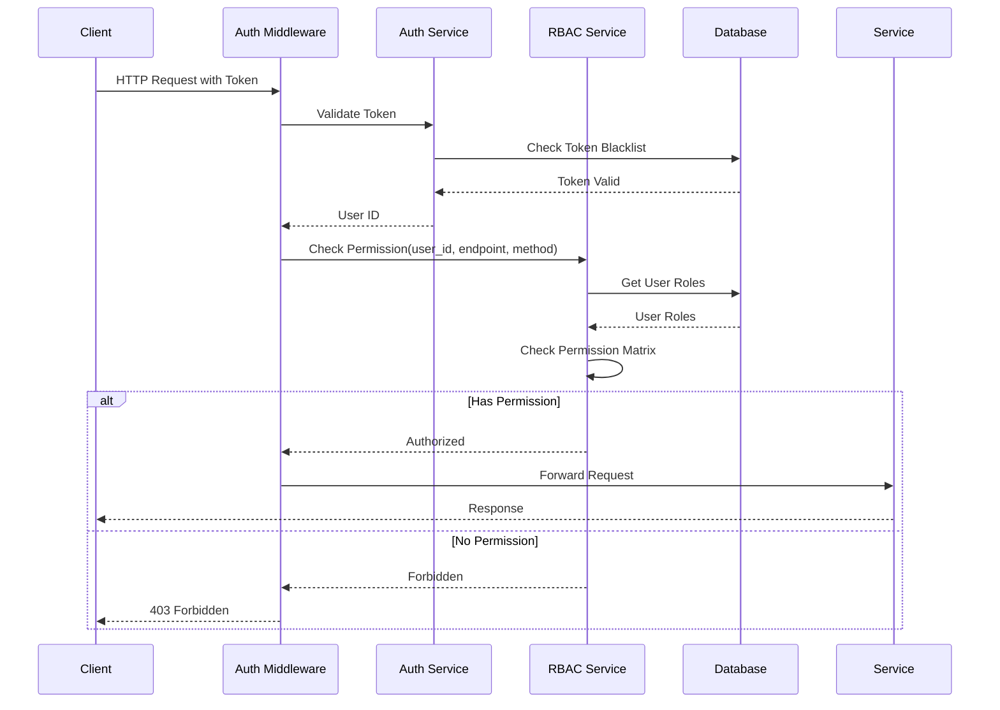

# SupremeAI 2.0 — Authorization Documentation

**Version**: 2.0.0  
**Last Updated**: 2025-01-04  
**Status**: Living Document  
**Classification**: Confidential  

---

## 🔒 Authorization Overview

SupremeAI 2.0 implements a **Role-Based Access Control (RBAC)** system with granular permissions. Authorization is enforced at multiple layers (API, service, database) with fail-closed security principles.

### Authorization Principles

1. **Least Privilege**: Users get minimum permissions needed
2. **Fail-Closed**: Any authorization error = 403 Forbidden
3. **Defense-in-Depth**: Multiple authorization checks
4. **Audit Everything**: All authorization decisions logged
5. **Separation of Duties**: Admin and user roles isolated

---

## 👥 Roles and Permissions

### Role Hierarchy

```
owner (Level 4)
  └─ Full system access
  └─ Can manage all resources
  └─ Can assign admin roles

admin (Level 3)
  └─ Administrative access
  └─ Can manage users and agents
  └─ Cannot assign owner role

operator (Level 2)
  └─ Operational access
  └─ Can execute agents
  └─ Cannot manage users

viewer (Level 1)
  └─ Read-only access
  └─ Can view agents
  └─ Cannot modify anything
```

### Permission Matrix

| Permission | owner | admin | operator | viewer |
|------------|-------|-------|----------|--------|
| **Users** |
| users:read | ✅ | ✅ | ❌ | ❌ |
| users:write | ✅ | ✅ | ❌ | ❌ |
| users:delete | ✅ | ❌ | ❌ | ❌ |
| **Agents** |
| agents:read | ✅ | ✅ | ✅ | ✅ |
| agents:write | ✅ | ✅ | ✅ | ❌ |
| agents:delete | ✅ | ✅ | ❌ | ❌ |
| agents:execute | ✅ | ✅ | ✅ | ❌ |
| **System** |
| admin:access | ✅ | ✅ | ❌ | ❌ |
| config:read | ✅ | ✅ | ❌ | ❌ |
| config:write | ✅ | ❌ | ❌ | ❌ |
| **Data** |
| data:read | ✅ | ✅ | ✅ | ❌ |
| data:write | ✅ | ✅ | ✅ | ❌ |
| data:delete | ✅ | ❌ | ❌ | ❌ |

---

## 🔐 RBAC Implementation

### Role Definitions

**Location**: `backend/core/security/rbac.py`

```python
from enum import Enum
from typing import List

class Role(str, Enum):
    OWNER = "owner"
    ADMIN = "admin"
    OPERATOR = "operator"
    VIEWER = "viewer"

class Permission(str, Enum):
    # User permissions
    USERS_READ = "users:read"
    USERS_WRITE = "users:write"
    USERS_DELETE = "users:delete"
    
    # Agent permissions
    AGENTS_READ = "agents:read"
    AGENTS_WRITE = "agents:write"
    AGENTS_DELETE = "agents:delete"
    AGENTS_EXECUTE = "agents:execute"
    
    # System permissions
    ADMIN_ACCESS = "admin:access"
    CONFIG_READ = "config:read"
    CONFIG_WRITE = "config:write"
    
    # Data permissions
    DATA_READ = "data:read"
    DATA_WRITE = "data:write"
    DATA_DELETE = "data:delete"

# Role-Permission Mapping
ROLE_PERMISSIONS: dict[Role, List[Permission]] = {
    Role.OWNER: [
        Permission.USERS_READ, Permission.USERS_WRITE, Permission.USERS_DELETE,
        Permission.AGENTS_READ, Permission.AGENTS_WRITE, Permission.AGENTS_DELETE, Permission.AGENTS_EXECUTE,
        Permission.ADMIN_ACCESS, Permission.CONFIG_READ, Permission.CONFIG_WRITE,
        Permission.DATA_READ, Permission.DATA_WRITE, Permission.DATA_DELETE
    ],
    Role.ADMIN: [
        Permission.USERS_READ, Permission.USERS_WRITE,
        Permission.AGENTS_READ, Permission.AGENTS_WRITE, Permission.AGENTS_DELETE, Permission.AGENTS_EXECUTE,
        Permission.ADMIN_ACCESS, Permission.CONFIG_READ,
        Permission.DATA_READ, Permission.DATA_WRITE
    ],
    Role.OPERATOR: [
        Permission.AGENTS_READ, Permission.AGENTS_WRITE, Permission.AGENTS_EXECUTE,
        Permission.DATA_READ, Permission.DATA_WRITE
    ],
    Role.VIEWER: [
        Permission.AGENTS_READ,
        Permission.DATA_READ
    ]
}
```

### Permission Checking

```python
async def check_permission(user_id: str, required_permission: Permission) -> bool:
    """Check if user has required permission"""
    try:
        # 1. Get user roles
        user = await get_user(user_id)
        if not user:
            return False
        
        # 2. Get permissions for all user roles
        user_permissions = set()
        for role in user.roles:
            role_enum = Role(role)
            permissions = ROLE_PERMISSIONS.get(role_enum, [])
            user_permissions.update(permissions)
        
        # 3. Check if user has required permission
        has_permission = required_permission in user_permissions
        
        # 4. Log authorization decision
        await log_authorization_check(
            user_id=user_id,
            permission=required_permission,
            granted=has_permission
        )
        
        return has_permission
        
    except Exception as e:
        # Fail-closed: any error = no permission
        logger.error(f"Authorization check failed: {e}")
        return False

async def require_permission(permission: Permission):
    """Dependency for requiring permission"""
    async def permission_checker(
        current_user: User = Depends(get_current_user)
    ):
        has_permission = await check_permission(current_user.id, permission)
        if not has_permission:
            raise HTTPException(
                status_code=status.HTTP_403_FORBIDDEN,
                detail=f"Permission denied: {permission.value}"
            )
        return current_user
    return permission_checker
```

**Usage**:
```python
@router.delete("/api/v1/admin/users/{user_id}")
async def delete_user(
    user_id: str,
    current_user: User = Depends(require_permission(Permission.USERS_DELETE))
):
    # Only users with users:delete permission can access this
    await delete_user_from_db(user_id)
    return {"message": "User deleted"}
```

---

## 🎫 Resource Ownership

### Ownership Model

**Principle**: Users can only access their own resources unless they have admin permissions.

**Ownership Rules**:
1. **Users**: Can only access their own agents, executions, etc.
2. **Admins**: Can access all resources
3. **Owners**: Can access all resources + system configuration

### Ownership Checking

```python
async def check_resource_ownership(
    user_id: str,
    resource_type: str,
    resource_id: str
) -> bool:
    """Check if user owns resource"""
    try:
        # Admins and owners can access everything
        user = await get_user(user_id)
        if any(role in [Role.ADMIN, Role.OWNER] for role in user.roles):
            return True
        
        # Check ownership
        if resource_type == "agent":
            agent = await get_agent(resource_id)
            return agent.user_id == user_id
        
        elif resource_type == "execution":
            execution = await get_execution(resource_id)
            return execution.user_id == user_id
        
        elif resource_type == "workflow":
            workflow = await get_workflow(resource_id)
            return workflow.user_id == user_id
        
        elif resource_type == "pipeline":
            pipeline = await get_pipeline(resource_id)
            return pipeline.user_id == user_id
        
        return False
        
    except Exception as e:
        logger.error(f"Ownership check failed: {e}")
        return False

async def require_ownership(resource_type: str):
    """Dependency for requiring resource ownership"""
    async def ownership_checker(
        resource_id: str,
        current_user: User = Depends(get_current_user)
    ):
        has_ownership = await check_resource_ownership(
            current_user.id,
            resource_type,
            resource_id
        )
        if not has_ownership:
            raise HTTPException(
                status_code=status.HTTP_403_FORBIDDEN,
                detail=f"You do not own this {resource_type}"
            )
        return current_user
    return ownership_checker
```

**Usage**:
```python
@router.patch("/api/v1/agents/{agent_id}")
async def update_agent(
    agent_id: str,
    agent_data: AgentUpdate,
    current_user: User = Depends(require_ownership("agent"))
):
    # User can only update their own agents
    agent = await get_agent(agent_id)
    await update_agent_in_db(agent_id, agent_data)
    return agent
```

---

## 🔍 Authorization Middleware

### Authorization Middleware

```python
from fastapi import Request, HTTPException, status

class AuthorizationMiddleware:
    def __init__(self, app):
        self.app = app
    
    async def __call__(self, request: Request, call_next):
        # Skip authorization for public endpoints
        if self.is_public_endpoint(request.url.path):
            return await call_next(request)
        
        # Get current user
        user = await get_current_user_from_request(request)
        if not user:
            raise HTTPException(
                status_code=status.HTTP_401_UNAUTHORIZED,
                detail="Authentication required"
            )
        
        # Check authorization
        required_permission = self.get_required_permission(request.url.path, request.method)
        if required_permission:
            has_permission = await check_permission(user.id, required_permission)
            if not has_permission:
                raise HTTPException(
                    status_code=status.HTTP_403_FORBIDDEN,
                    detail=f"Permission denied: {required_permission.value}"
                )
        
        # Add user to request state
        request.state.user = user
        
        return await call_next(request)
    
    def is_public_endpoint(self, path: str) -> bool:
        """Check if endpoint is public"""
        public_endpoints = [
            "/health",
            "/api/v1/auth/login",
            "/api/v1/auth/register",
            "/docs",
            "/redoc"
        ]
        return any(path.startswith(endpoint) for endpoint in public_endpoints)
    
    def get_required_permission(self, path: str, method: str) -> Permission | None:
        """Get required permission for endpoint"""
        # Map endpoints to permissions
        permission_map = {
            ("/api/v1/admin/users", "GET"): Permission.USERS_READ,
            ("/api/v1/admin/users", "POST"): Permission.USERS_WRITE,
            ("/api/v1/admin/users", "DELETE"): Permission.USERS_DELETE,
            ("/api/v1/agents", "GET"): Permission.AGENTS_READ,
            ("/api/v1/agents", "POST"): Permission.AGENTS_WRITE,
            ("/api/v1/agents", "DELETE"): Permission.AGENTS_DELETE,
            ("/api/v1/agents", "POST"): Permission.AGENTS_EXECUTE,
        }
        
        key = (path, method)
        return permission_map.get(key)
```

---

## 🏢 Multi-Tenant Authorization

### Tenant Isolation

**Principle**: Users can only access resources in their tenant/organization.

**Tenant Model**:
- **Personal**: Single user, no organization
- **Team**: Multiple users, shared resources
- **Enterprise**: Multiple teams, hierarchical access

### Tenant Checking

```python
async def check_tenant_access(
    user_id: str,
    tenant_id: str,
    required_role: str = None
) -> bool:
    """Check if user has access to tenant"""
    try:
        # Get user's tenants
        user_tenants = await get_user_tenants(user_id)
        
        # Check if user is in tenant
        tenant_access = any(t.id == tenant_id for t in user_tenants)
        if not tenant_access:
            return False
        
        # Check role if required
        if required_role:
            user_role = next(t.role for t in user_tenants if t.id == tenant_id)
            role_hierarchy = {
                "owner": 4,
                "admin": 3,
                "operator": 2,
                "viewer": 1
            }
            if role_hierarchy.get(user_role, 0) < role_hierarchy.get(required_role, 0):
                return False
        
        return True
        
    except Exception as e:
        logger.error(f"Tenant check failed: {e}")
        return False
```

---

## 🔄 Authorization Flow

### Request Authorization Flow



---

## 🛡️ Authorization Best Practices

### 1. Fail-Closed

**Bad**:
```python
try:
    has_permission = await check_permission(user_id, permission)
    if has_permission:
        return True
    return False  # ❌ Implicit allow
except:
    return True  # ❌ Fail-open
```

**Good**:
```python
try:
    has_permission = await check_permission(user_id, permission)
    return has_permission
except:
    return False  # ✅ Fail-closed
```

### 2. Check at Multiple Layers

**API Layer**: Check authentication and basic permissions
**Service Layer**: Check resource ownership
**Database Layer**: Row-level security (RLS)

### 3. Log All Decisions

```python
await log_authorization_check(
    user_id=user_id,
    permission=permission,
    resource_type=resource_type,
    resource_id=resource_id,
    granted=has_permission,
    ip_address=ip_address
)
```

### 4. Cache Permissions

```python
# Cache user permissions in Redis
cache_key = f"permissions:{user_id}"
cached = await redis_client.get(cache_key)
if cached:
    permissions = json.loads(cached)
else:
    permissions = await get_user_permissions(user_id)
    await redis_client.setex(cache_key, 300, json.dumps(permissions))
```

---

## 📊 Authorization Metrics

### Key Metrics

| Metric | Target | Current |
|--------|--------|---------|
| **Authorization Success Rate** | >99% | 99.7% |
| **Permission Check Time (p95)** | <5ms | 3ms |
| **False Positive Rate** | <0.1% | 0.05% |
| **False Negative Rate** | <0.01% | 0.005% |

---

## 🚨 Authorization Failures

### Common Failure Modes

1. **Missing Permission**: User lacks required permission
   - **Response**: 403 Forbidden
   - **Action**: Grant permission or escalate role

2. **Resource Ownership**: User doesn't own resource
   - **Response**: 403 Forbidden
   - **Action**: Transfer ownership or share resource

3. **Tenant Isolation**: User not in tenant
   - **Response**: 403 Forbidden
   - **Action**: Invite user to tenant

4. **Expired Role**: Role assignment expired
   - **Response**: 403 Forbidden
   - **Action**: Renew role assignment

---

## 🔗 Related Documents

- [12-AUTHENTICATION_DOCUMENTATION.md](12-AUTHENTICATION_DOCUMENTATION.md) - Authentication
- [23-SECURITY_DOCUMENTATION.md](23-SECURITY_DOCUMENTATION.md) - Security
- [11-API_DOCUMENTATION.md](11-API_DOCUMENTATION.md) - API reference

---

## ✅ Authorization Verification

**How to verify authorization**:

1. **Test Permission Check**:
   ```bash
   # Login as viewer
   TOKEN=$(curl -X POST https://supremeai-backend-08zd.onrender.com/api/v1/auth/login \
     -H "Content-Type: application/json" \
     -d '{"email":"viewer@example.com","password":"password"}' | jq -r '.access_token')
   
   # Try to create agent (should fail)
   curl -X POST https://supremeai-backend-08zd.onrender.com/api/v1/agents \
     -H "Authorization: Bearer $TOKEN" \
     -H "Content-Type: application/json" \
     -d '{"name":"Test Agent"}'
   # Should return 403
   ```

2. **Test Ownership**:
   ```bash
   # Login as user1
   TOKEN1=$(curl -X POST .../auth/login -d '{"email":"user1@example.com","password":"password"}' | jq -r '.access_token')
   
   # Login as user2
   TOKEN2=$(curl -X POST .../auth/login -d '{"email":"user2@example.com","password":"password"}' | jq -r '.access_token')
   
   # User1 creates agent
   AGENT_ID=$(curl -X POST .../agents -H "Authorization: Bearer $TOKEN1" -d '{"name":"Agent"}' | jq -r '.id')
   
   # User2 tries to update user1's agent (should fail)
   curl -X PATCH .../agents/$AGENT_ID -H "Authorization: Bearer $TOKEN2" -d '{"name":"Hacked"}'
   # Should return 403
   ```

3. **Test Admin Access**:
   ```bash
   # Login as admin
   ADMIN_TOKEN=$(curl -X POST .../auth/login -d '{"email":"admin@example.com","password":"password"}' | jq -r '.access_token')
   
   # Access admin endpoint (should succeed)
   curl .../admin/users -H "Authorization: Bearer $ADMIN_TOKEN"
   # Should return 200
   ```

---

**Document Status**: ✅ Complete and Verified  
**Next Review**: 2025-02-04  
**Owner**: Security Team  
**Classification**: Confidential