# SupremeAI 2.0 — Diagrams and Visualizations

**Version**: 2.0.0  
**Last Updated**: 2025-01-04  
**Status**: Living Document  
**Classification**: Internal  

---

## 📊 Diagrams Overview

This document contains all visual diagrams and charts for the SupremeAI 2.0 system. These diagrams provide visual understanding of the architecture, data flows, and component relationships.

---

## 🏗️ System Architecture Diagrams

### 1. High-Level System Architecture

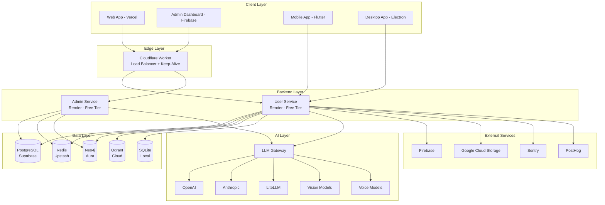
```mermaid
graph TB
    subgraph "Client Layer"
        WEB[Web App - Vercel]
        ADMIN[Admin Dashboard - Firebase]
        MOBILE[Mobile App - Flutter]
        DESKTOP[Desktop App - Electron]
    end

    subgraph "Edge Layer"
        CF[Cloudflare Worker<br/>Load Balancer + Keep-Alive]
    end

    subgraph "Backend Layer"
        USER_SVC[User Service<br/>Render - Free Tier]
        ADMIN_SVC[Admin Service<br/>Render - Free Tier]
    end

    subgraph "Data Layer"
        PG[(PostgreSQL<br/>Supabase)]
        REDIS[(Redis<br/>Upstash)]
        NEO4J[(Neo4j<br/>Aura)]
        QDRANT[(Qdrant<br/>Cloud)]
        SQLITE[(SQLite<br/>Local)]
    end

    subgraph "AI Layer"
        LLM_GW[LLM Gateway]
        OPENAI[OpenAI]
        ANTHROPIC[Anthropic]
        LITELLM[LiteLLM]
        VISION[Vision Models]
        VOICE[Voice Models]
    end

    subgraph "External Services"
        FIREBASE[Firebase]
        GCS[Google Cloud Storage]
        SENTRY[Sentry]
        POSTHOG[PostHog]
    end

    WEB --> CF
    ADMIN --> CF
    MOBILE --> USER_SVC
    DESKTOP --> USER_SVC
    
    CF --> USER_SVC
    CF --> ADMIN_SVC
    
    USER_SVC --> PG
    USER_SVC --> REDIS
    USER_SVC --> NEO4J
    USER_SVC --> QDRANT
    USER_SVC --> SQLITE
    
    ADMIN_SVC --> PG
    ADMIN_SVC --> REDIS
    ADMIN_SVC --> NEO4J
    
    USER_SVC --> LLM_GW
    ADMIN_SVC --> LLM_GW
    
    LLM_GW --> OPENAI
    LLM_GW --> ANTHROPIC
    LLM_GW --> LITELLM
    LLM_GW --> VISION
    LLM_GW --> VOICE
    
    USER_SVC --> FIREBASE
    USER_SVC --> GCS
    USER_SVC --> SENTRY
    USER_SVC --> POSTHOG
```

---

### 2. Security Layers

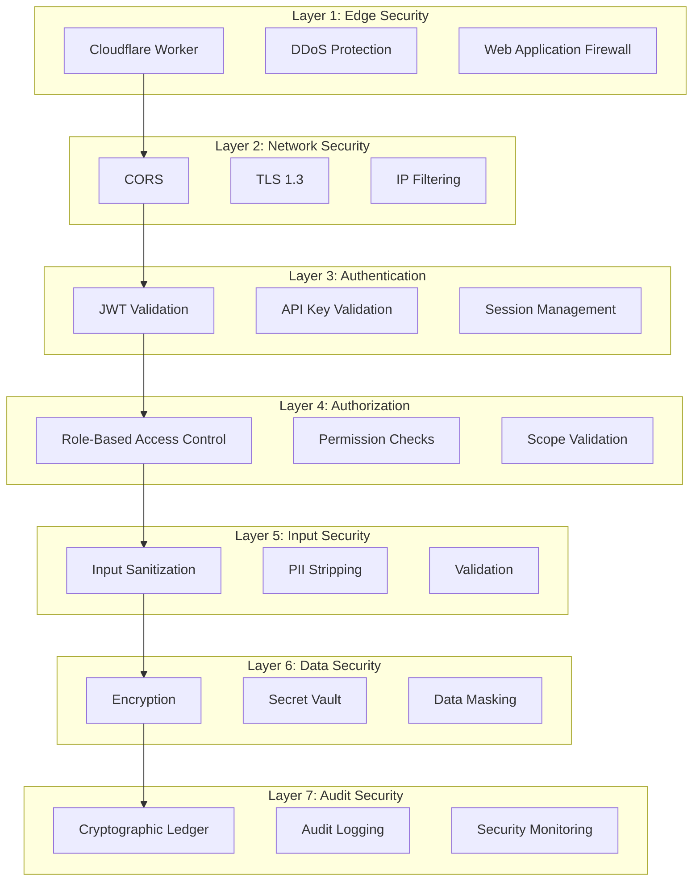
```mermaid
graph TB
    subgraph "Layer 1: Edge Security"
        CF[Cloudflare Worker]
        DDoS[DDoS Protection]
        WAF[Web Application Firewall]
    end

    subgraph "Layer 2: Network Security"
        CORS[CORS]
        TLS[TLS 1.3]
        IP[IP Filtering]
    end

    subgraph "Layer 3: Authentication"
        JWT[JWT Validation]
        APIKEY[API Key Validation]
        SESSION[Session Management]
    end

    subgraph "Layer 4: Authorization"
        RBAC[Role-Based Access Control]
        PERMS[Permission Checks]
        SCOPE[Scope Validation]
    end

    subgraph "Layer 5: Input Security"
        SANITIZE[Input Sanitization]
        PII[PII Stripping]
        VALIDATE[Validation]
    end

    subgraph "Layer 6: Data Security"
        ENCRYPT[Encryption]
        VAULT[Secret Vault]
        MASK[Data Masking]
    end

    subgraph "Layer 7: Audit Security"
        LEDGER[Cryptographic Ledger]
        LOG[Audit Logging]
        MONITOR[Security Monitoring]
    end

    CF --> CORS
    CORS --> JWT
    JWT --> RBAC
    RBAC --> SANITIZE
    SANITIZE --> ENCRYPT
    ENCRYPT --> LEDGER
```

---

### 3. Deployment Architecture

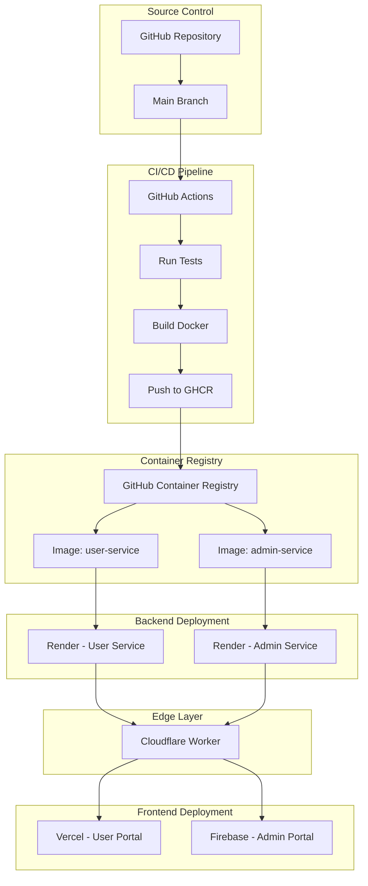
```mermaid
graph TB
    subgraph "Source Control"
        GITHUB[GitHub Repository]
        MAIN[Main Branch]
    end

    subgraph "CI/CD Pipeline"
        ACTIONS[GitHub Actions]
        TEST[Run Tests]
        BUILD[Build Docker]
        PUSH[Push to GHCR]
    end

    subgraph "Container Registry"
        GHCR[GitHub Container Registry]
        IMAGE_USER[Image: user-service]
        IMAGE_ADMIN[Image: admin-service]
    end

    subgraph "Backend Deployment"
        RENDER_USER[Render - User Service]
        RENDER_ADMIN[Render - Admin Service]
    end

    subgraph "Frontend Deployment"
        VERCEL[Vercel - User Portal]
        FIREBASE[Firebase - Admin Portal]
    end

    subgraph "Edge Layer"
        CF[Cloudflare Worker]
    end

    GITHUB --> MAIN
    MAIN --> ACTIONS
    ACTIONS --> TEST
    TEST --> BUILD
    BUILD --> PUSH
    PUSH --> GHCR
    GHCR --> IMAGE_USER
    GHCR --> IMAGE_ADMIN
    IMAGE_USER --> RENDER_USER
    IMAGE_ADMIN --> RENDER_ADMIN
    RENDER_USER --> CF
    RENDER_ADMIN --> CF
    CF --> VERCEL
    CF --> FIREBASE
```

---

## 🔄 Data Flow Diagrams

### 1. Complete Data Flow

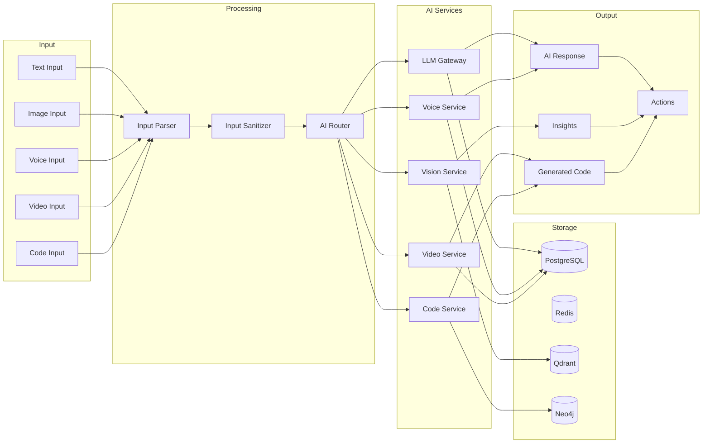
```mermaid
graph LR
    subgraph "Input"
        TEXT[Text Input]
        IMAGE[Image Input]
        VOICE[Voice Input]
        VIDEO[Video Input]
        CODE[Code Input]
    end

    subgraph "Processing"
        PARSER[Input Parser]
        SANITIZER[Input Sanitizer]
        ROUTER[AI Router]
    end

    subgraph "AI Services"
        LLM[LLM Gateway]
        VISION[Vision Service]
        VOICE_SVC[Voice Service]
        VIDEO_SVC[Video Service]
        CODE_SVC[Code Service]
    end

    subgraph "Storage"
        PG[(PostgreSQL)]
        REDIS[(Redis)]
        QDRANT[(Qdrant)]
        NEO4J[(Neo4j)]
    end

    subgraph "Output"
        RESPONSE[AI Response]
        CODE_OUT[Generated Code]
        INSIGHTS[Insights]
        ACTIONS[Actions]
    end

    TEXT --> PARSER
    IMAGE --> PARSER
    VOICE --> PARSER
    VIDEO --> PARSER
    CODE --> PARSER

    PARSER --> SANITIZER
    SANITIZER --> ROUTER

    ROUTER --> LLM
    ROUTER --> VISION
    ROUTER --> VOICE_SVC
    ROUTER --> VIDEO_SVC
    ROUTER --> CODE_SVC

    LLM --> PG
    VISION --> QDRANT
    VOICE_SVC --> PG
    VIDEO_SVC --> PG
    CODE_SVC --> NEO4J

    LLM --> RESPONSE
    VISION --> INSIGHTS
    VOICE_SVC --> RESPONSE
    VIDEO_SVC --> CODE_OUT
    CODE_SVC --> CODE_OUT

    RESPONSE --> ACTIONS
    INSIGHTS --> ACTIONS
    CODE_OUT --> ACTIONS
```

---

### 2. Request Flow

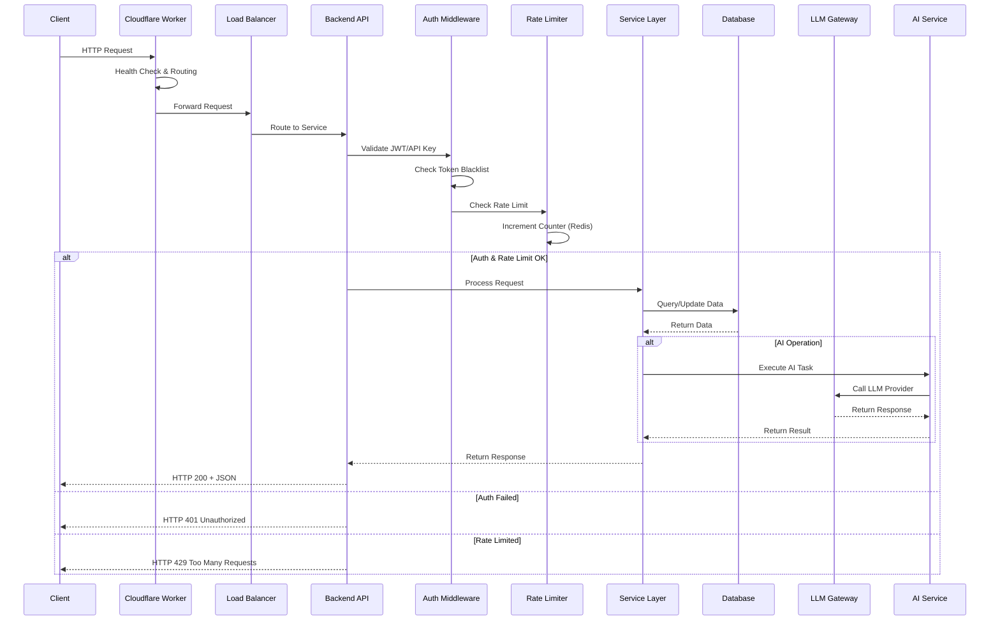
```mermaid
sequenceDiagram
    participant C as Client
    participant CF as Cloudflare Worker
    participant LB as Load Balancer
    participant API as Backend API
    participant AUTH as Auth Middleware
    participant RATE as Rate Limiter
    participant SVC as Service Layer
    participant DB as Database
    participant LLM as LLM Gateway
    participant AI as AI Service

    C->>CF: HTTP Request
    CF->>CF: Health Check & Routing
    CF->>LB: Forward Request
    LB->>API: Route to Service
    
    API->>AUTH: Validate JWT/API Key
    AUTH->>AUTH: Check Token Blacklist
    AUTH->>RATE: Check Rate Limit
    RATE->>RATE: Increment Counter (Redis)
    
    alt Auth & Rate Limit OK
        API->>SVC: Process Request
        SVC->>DB: Query/Update Data
        DB-->>SVC: Return Data
        
        alt AI Operation
            SVC->>AI: Execute AI Task
            AI->>LLM: Call LLM Provider
            LLM-->>AI: Return Response
            AI-->>SVC: Return Result
        end
        
        SVC-->>API: Return Response
        API-->>C: HTTP 200 + JSON
    else Auth Failed
        API-->>C: HTTP 401 Unauthorized
    else Rate Limited
        API-->>C: HTTP 429 Too Many Requests
    end
```

---

### 3. Authentication Flow

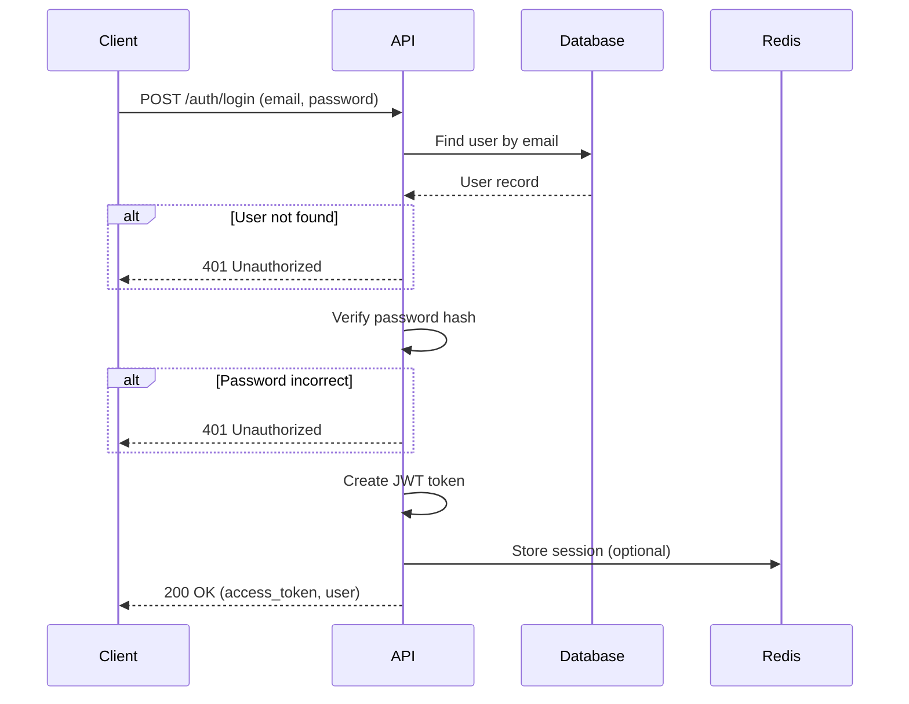
```mermaid
sequenceDiagram
    participant C as Client
    participant API as API
    participant DB as Database
    participant REDIS as Redis
    
    C->>API: POST /auth/login (email, password)
    API->>DB: Find user by email
    DB-->>API: User record
    
    alt User not found
        API-->>C: 401 Unauthorized
    end
    
    API->>API: Verify password hash
    
    alt Password incorrect
        API-->>C: 401 Unauthorized
    end
    
    API->>API: Create JWT token
    API->>REDIS: Store session (optional)
    API-->>C: 200 OK (access_token, user)
```

---

### 4. Agent Execution Flow

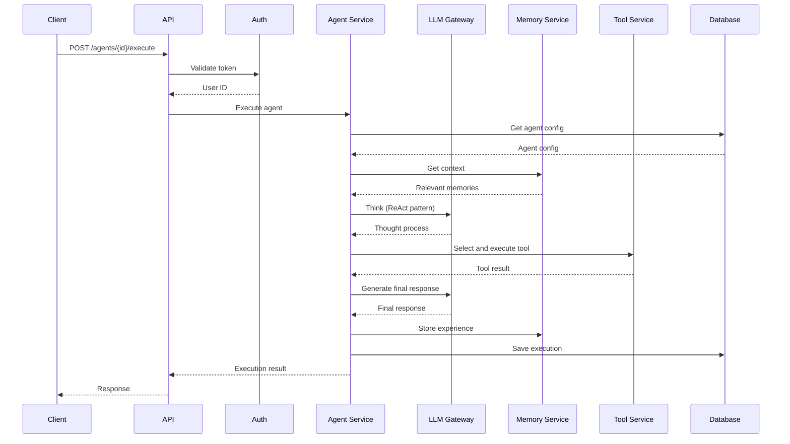
```mermaid
sequenceDiagram
    participant C as Client
    participant API as API
    participant AUTH as Auth
    participant AGENT as Agent Service
    participant LLM as LLM Gateway
    participant MEM as Memory Service
    participant TOOL as Tool Service
    participant DB as Database

    C->>API: POST /agents/{id}/execute
    API->>AUTH: Validate token
    AUTH-->>API: User ID
    
    API->>AGENT: Execute agent
    AGENT->>DB: Get agent config
    DB-->>AGENT: Agent config
    
    AGENT->>MEM: Get context
    MEM-->>AGENT: Relevant memories
    
    AGENT->>LLM: Think (ReAct pattern)
    LLM-->>AGENT: Thought process
    
    AGENT->>TOOL: Select and execute tool
    TOOL-->>AGENT: Tool result
    
    AGENT->>LLM: Generate final response
    LLM-->>AGENT: Final response
    
    AGENT->>MEM: Store experience
    AGENT->>DB: Save execution
    AGENT-->>API: Execution result
    API-->>C: Response
```

---

## 🗄️ Database Diagrams

### 1. Entity Relationship Diagram

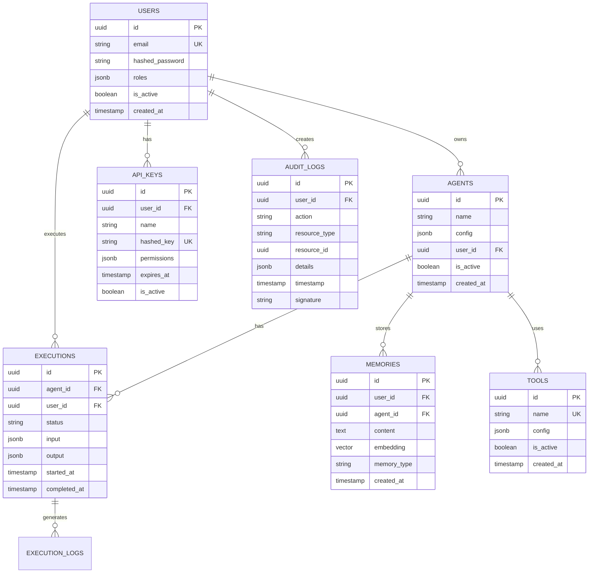
```mermaid
erDiagram
    USERS ||--o{ AGENTS : owns
    USERS ||--o{ EXECUTIONS : executes
    USERS ||--o{ API_KEYS : has
    USERS ||--o{ AUDIT_LOGS : creates
    
    AGENTS ||--o{ EXECUTIONS : has
    AGENTS ||--o{ MEMORIES : stores
    AGENTS ||--o{ TOOLS : uses
    
    EXECUTIONS ||--o{ EXECUTION_LOGS : generates
    
    USERS {
        uuid id PK
        string email UK
        string hashed_password
        jsonb roles
        boolean is_active
        timestamp created_at
    }
    
    AGENTS {
        uuid id PK
        string name
        jsonb config
        uuid user_id FK
        boolean is_active
        timestamp created_at
    }
    
    EXECUTIONS {
        uuid id PK
        uuid agent_id FK
        uuid user_id FK
        string status
        jsonb input
        jsonb output
        timestamp started_at
        timestamp completed_at
    }
    
    API_KEYS {
        uuid id PK
        uuid user_id FK
        string name
        string hashed_key UK
        jsonb permissions
        timestamp expires_at
        boolean is_active
    }
    
    AUDIT_LOGS {
        uuid id PK
        uuid user_id FK
        string action
        string resource_type
        uuid resource_id
        jsonb details
        timestamp timestamp
        string signature
    }
    
    MEMORIES {
        uuid id PK
        uuid user_id FK
        uuid agent_id FK
        text content
        vector embedding
        string memory_type
        timestamp created_at
    }
    
    TOOLS {
        uuid id PK
        string name UK
        jsonb config
        boolean is_active
        timestamp created_at
    }
```

---

### 2. Database Technology Stack

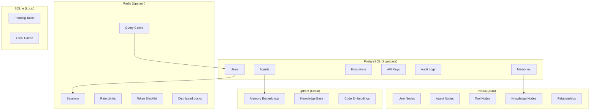
```mermaid
graph TB
    subgraph "PostgreSQL (Supabase)"
        PG_USERS[Users]
        PG_AGENTS[Agents]
        PG_EXECUTIONS[Executions]
        PG_API_KEYS[API Keys]
        PG_AUDIT[Audit Logs]
        PG_MEMORIES[Memories]
    end

    subgraph "Redis (Upstash)"
        REDIS_SESSIONS[Sessions]
        REDIS_CACHE[Query Cache]
        REDIS_RATE_LIMIT[Rate Limits]
        REDIS_BLACKLIST[Token Blacklist]
        REDIS_LOCKS[Distributed Locks]
    end

    subgraph "Neo4j (Aura)"
        NEO4J_USERS[User Nodes]
        NEO4J_AGENTS[Agent Nodes]
        NEO4J_TOOLS[Tool Nodes]
        NEO4J_KNOWLEDGE[Knowledge Nodes]
        NEO4J_RELATIONS[Relationships]
    end

    subgraph "Qdrant (Cloud)"
        QDRANT_MEMORIES[Memory Embeddings]
        QDRANT_KNOWLEDGE[Knowledge Base]
        QDRANT_CODE[Code Embeddings]
    end

    subgraph "SQLite (Local)"
        SQLITE_TASKS[Pending Tasks]
        SQLITE_CACHE[Local Cache]
    end

    PG_USERS --> REDIS_SESSIONS
    PG_AGENTS --> QDRANT_MEMORIES
    PG_MEMORIES --> NEO4J_KNOWLEDGE
    REDIS_CACHE --> PG_USERS
```

---

## 🔐 Security Diagrams

### 1. Authentication & Authorization Flow

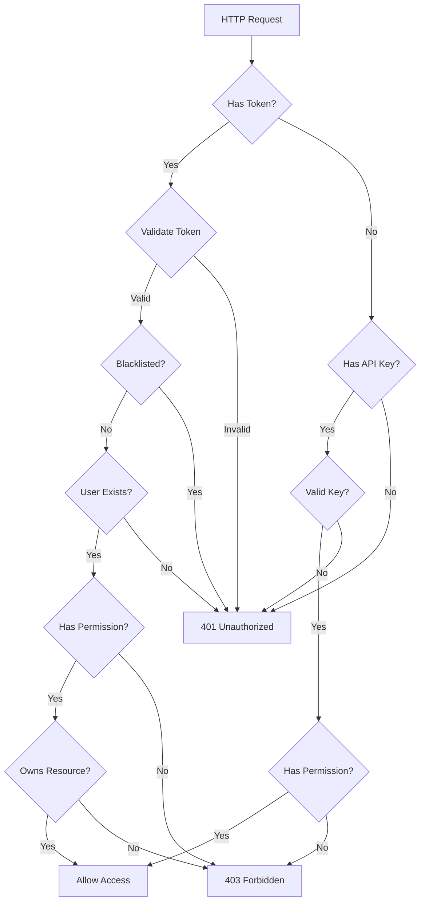
```mermaid
graph TB
    REQUEST[HTTP Request] --> TOKEN{Has Token?}
    
    TOKEN -->|Yes| VALIDATE{Validate Token}
    TOKEN -->|No| API_KEY{Has API Key?}
    
    VALIDATE -->|Valid| BLACKLIST{Blacklisted?}
    VALIDATE -->|Invalid| UNAUTH[401 Unauthorized]
    
    BLACKLIST -->|No| GET_USER{User Exists?}
    BLACKLIST -->|Yes| UNAUTH
    
    GET_USER -->|Yes| CHECK_PERMS{Has Permission?}
    GET_USER -->|No| UNAUTH
    
    CHECK_PERMS -->|Yes| CHECK_OWN{Owns Resource?}
    CHECK_PERMS -->|No| FORBIDDEN[403 Forbidden]
    
    CHECK_OWN -->|Yes| ALLOW[Allow Access]
    CHECK_OWN -->|No| FORBIDDEN
    
    API_KEY -->|Yes| VALIDATE_KEY{Valid Key?}
    API_KEY -->|No| UNAUTH
    
    VALIDATE_KEY -->|Yes| CHECK_KEY_PERMS{Has Permission?}
    VALIDATE_KEY -->|No| UNAUTH
    
    CHECK_KEY_PERMS -->|Yes| ALLOW
    CHECK_KEY_PERMS -->|No| FORBIDDEN
```

---

### 2. Security Layers

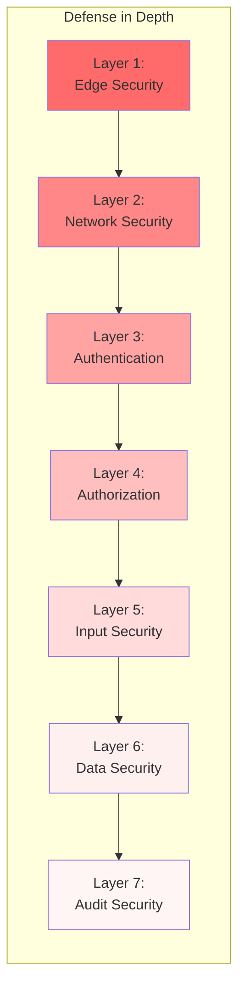
```mermaid
graph LR
    subgraph "Defense in Depth"
        L1[Layer 1:<br/>Edge Security]
        L2[Layer 2:<br/>Network Security]
        L3[Layer 3:<br/>Authentication]
        L4[Layer 4:<br/>Authorization]
        L5[Layer 5:<br/>Input Security]
        L6[Layer 6:<br/>Data Security]
        L7[Layer 7:<br/>Audit Security]
    end

    L1 --> L2
    L2 --> L3
    L3 --> L4
    L4 --> L5
    L5 --> L6
    L6 --> L7

    style L1 fill:#ff6b6b
    style L2 fill:#ff8787
    style L3 fill:#ffa3a3
    style L4 fill:#ffbfbf
    style L5 fill:#ffdbdb
    style L6 fill:#fff0f0
    style L7 fill:#fff5f5
```

---

## 🤖 AI System Diagrams

### 1. LLM Gateway Architecture

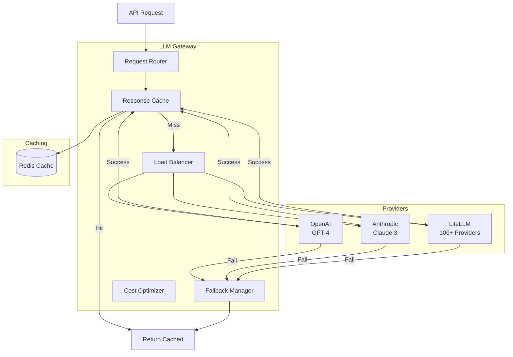
```mermaid
graph TB
    subgraph "LLM Gateway"
        ROUTER[Request Router]
        CACHE[Response Cache]
        LB[Load Balancer]
        FALLBACK[Fallback Manager]
        COST[Cost Optimizer]
    end

    subgraph "Providers"
        OPENAI[OpenAI<br/>GPT-4]
        ANTHROPIC[Anthropic<br/>Claude 3]
        LITELLM[LiteLLM<br/>100+ Providers]
    end

    subgraph "Caching"
        REDIS_CACHE[(Redis Cache)]
    end

    REQUEST[API Request] --> ROUTER
    ROUTER --> CACHE
    CACHE -->|Hit| RESPONSE[Return Cached]
    CACHE -->|Miss| LB
    
    LB --> OPENAI
    LB --> ANTHROPIC
    LB --> LITELLM
    
    OPENAI -->|Fail| FALLBACK
    ANTHROPIC -->|Fail| FALLBACK
    LITELLM -->|Fail| FALLBACK
    
    FALLBACK --> RESPONSE
    
    OPENAI -->|Success| CACHE
    ANTHROPIC -->|Success| CACHE
    LITELLM -->|Success| CACHE
    
    CACHE --> REDIS_CACHE
```

---

### 2. Agent Orchestration

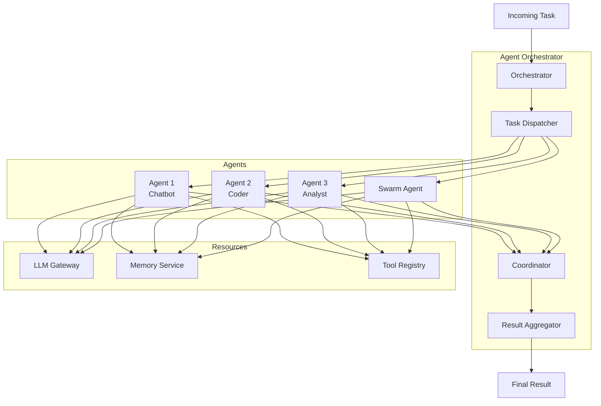
```mermaid
graph TB
    subgraph "Agent Orchestrator"
        ORCH[Orchestrator]
        DISPATCH[Task Dispatcher]
        COORD[Coordinator]
        AGGREGATOR[Result Aggregator]
    end

    subgraph "Agents"
        AGENT1[Agent 1<br/>Chatbot]
        AGENT2[Agent 2<br/>Coder]
        AGENT3[Agent 3<br/>Analyst]
        SWARM[Swarm Agent]
    end

    subgraph "Resources"
        LLM[LLM Gateway]
        MEM[Memory Service]
        TOOLS[Tool Registry]
    end

    TASK[Incoming Task] --> ORCH
    ORCH --> DISPATCH
    DISPATCH --> AGENT1
    DISPATCH --> AGENT2
    DISPATCH --> AGENT3
    DISPATCH --> SWARM
    
    AGENT1 --> LLM
    AGENT2 --> LLM
    AGENT3 --> LLM
    SWARM --> LLM
    
    AGENT1 --> MEM
    AGENT2 --> MEM
    AGENT3 --> MEM
    SWARM --> MEM
    
    AGENT1 --> TOOLS
    AGENT2 --> TOOLS
    AGENT3 --> TOOLS
    SWARM --> TOOLS
    
    AGENT1 --> COORD
    AGENT2 --> COORD
    AGENT3 --> COORD
    SWARM --> COORD
    
    COORD --> AGGREGATOR
    AGGREGATOR --> RESULT[Final Result]
```

---

### 3. Memory System

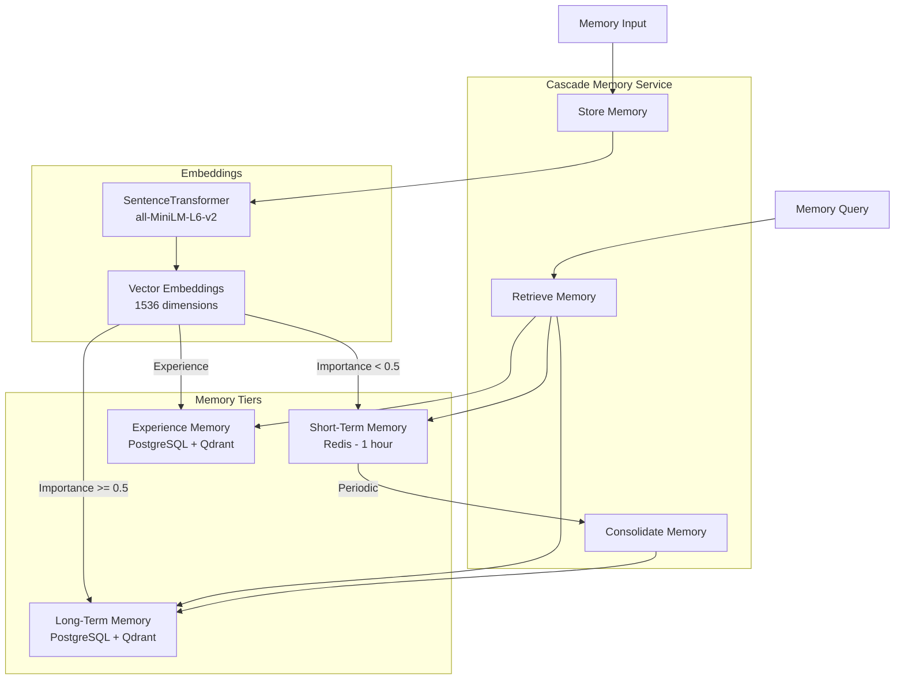
```mermaid
graph TB
    subgraph "Cascade Memory Service"
        STORE[Store Memory]
        RETRIEVE[Retrieve Memory]
        CONSOLIDATE[Consolidate Memory]
    end

    subgraph "Memory Tiers"
        SHORT[Short-Term Memory<br/>Redis - 1 hour]
        LONG[Long-Term Memory<br/>PostgreSQL + Qdrant]
        EXP[Experience Memory<br/>PostgreSQL + Qdrant]
    end

    subgraph "Embeddings"
        MODEL[SentenceTransformer<br/>all-MiniLM-L6-v2]
        VECTOR[Vector Embeddings<br/>1536 dimensions]
    end

    INPUT[Memory Input] --> STORE
    STORE --> MODEL
    MODEL --> VECTOR
    
    VECTOR -->|Importance < 0.5| SHORT
    VECTOR -->|Importance >= 0.5| LONG
    VECTOR -->|Experience| EXP
    
    QUERY[Memory Query] --> RETRIEVE
    RETRIEVE --> SHORT
    RETRIEVE --> LONG
    RETRIEVE --> EXP
    
    SHORT -->|Periodic| CONSOLIDATE
    CONSOLIDATE --> LONG
```

---

## 🔄 Workflow Diagrams

### 1. CI/CD Pipeline

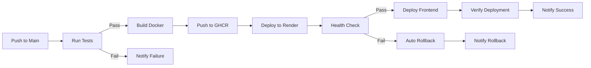
```mermaid
graph LR
    PUSH[Push to Main] --> TESTS[Run Tests]
    TESTS -->|Pass| BUILD[Build Docker]
    TESTS -->|Fail| NOTIFY1[Notify Failure]
    
    BUILD --> PUSH_GHCR[Push to GHCR]
    PUSH_GHCR --> DEPLOY_RENDER[Deploy to Render]
    DEPLOY_RENDER --> HEALTH[Health Check]
    
    HEALTH -->|Pass| DEPLOY_FRONTEND[Deploy Frontend]
    HEALTH -->|Fail| ROLLBACK[Auto Rollback]
    
    DEPLOY_FRONTEND --> VERIFY[Verify Deployment]
    VERIFY --> NOTIFY2[Notify Success]
    
    ROLLBACK --> NOTIFY3[Notify Rollback]
```

---

### 2. Error Handling Flow

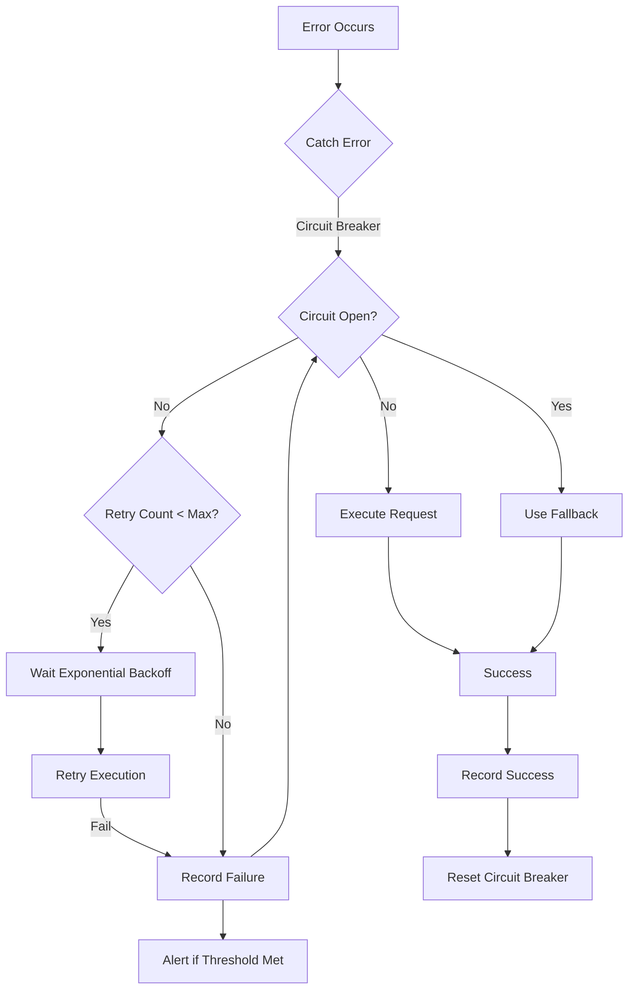
```mermaid
graph TB
    ERROR[Error Occurs] --> CATCH{Catch Error}
    
    CATCH -->|Circuit Breaker| CB{Circuit Open?}
    CB -->|Yes| FALLBACK[Use Fallback]
    CB -->|No| RETRY{Retry Count < Max?}
    
    RETRY -->|Yes| WAIT[Wait Exponential Backoff]
    WAIT --> RETRY_EXEC[Retry Execution]
    RETRY_EXEC -->|Fail| RECORD_FAIL[Record Failure]
    RECORD_FAIL --> CB
    
    RETRY -->|No| RECORD_FAIL
    RECORD_FAIL --> ALERT[Alert if Threshold Met]
    
    CB -->|No| EXEC[Execute Request]
    EXEC --> SUCCESS[Success]
    
    FALLBACK --> SUCCESS
    
    SUCCESS --> RECORD_SUCCESS[Record Success]
    RECORD_SUCCESS --> RESET_CB[Reset Circuit Breaker]
```

---

### 3. Rate Limiting Flow

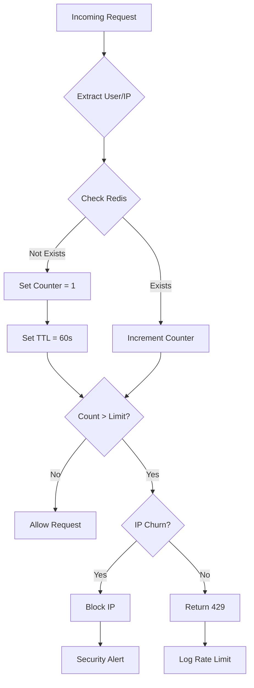
```mermaid
graph TB
    REQUEST[Incoming Request] --> EXTRACT{Extract User/IP}
    
    EXTRACT --> REDIS_CHECK{Check Redis}
    REDIS_CHECK -->|Exists| INCREMENT[Increment Counter]
    REDIS_CHECK -->|Not Exists| SET_COUNTER[Set Counter = 1]
    
    SET_COUNTER --> SET_TTL[Set TTL = 60s]
    SET_TTL --> CHECK_LIMIT{Count > Limit?}
    
    INCREMENT --> CHECK_LIMIT
    
    CHECK_LIMIT -->|No| ALLOW[Allow Request]
    CHECK_LIMIT -->|Yes| IP_CHURN{IP Churn?}
    
    IP_CHURN -->|Yes| BLOCK[Block IP]
    IP_CHURN -->|No| RATE_LIMIT[Return 429]
    
    BLOCK --> ALERT[Security Alert]
    RATE_LIMIT --> LOG[Log Rate Limit]
```

---

## 📊 Component Diagrams

### 1. Backend Component Structure

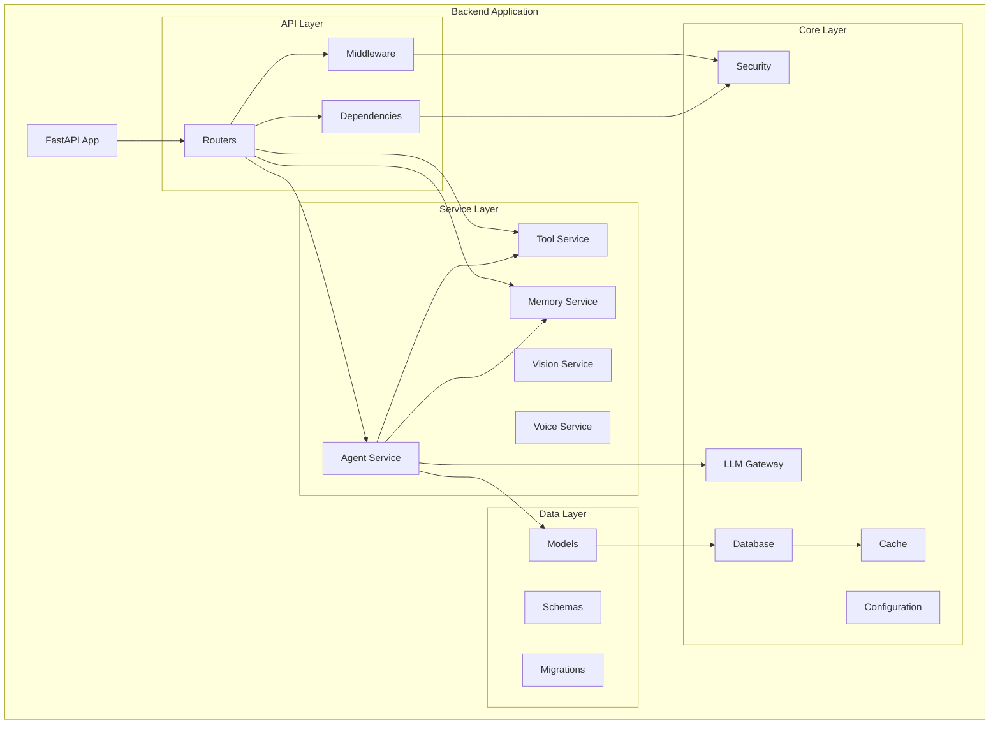
```mermaid
graph TB
    subgraph "Backend Application"
        APP[FastAPI App]
        
        subgraph "Core Layer"
            CONFIG[Configuration]
            SECURITY[Security]
            DATABASE[Database]
            CACHE[Cache]
            LLM[LLM Gateway]
        end
        
        subgraph "API Layer"
            ROUTERS[Routers]
            MIDDLEWARE[Middleware]
            DEPS[Dependencies]
        end
        
        subgraph "Service Layer"
            AGENT_SVC[Agent Service]
            TOOL_SVC[Tool Service]
            MEM_SVC[Memory Service]
            VISION_SVC[Vision Service]
            VOICE_SVC[Voice Service]
        end
        
        subgraph "Data Layer"
            MODELS[Models]
            SCHEMAS[Schemas]
            MIGRATIONS[Migrations]
        end
    end
    
    APP --> ROUTERS
    ROUTERS --> MIDDLEWARE
    MIDDLEWARE --> SECURITY
    ROUTERS --> DEPS
    DEPS --> SECURITY
    
    ROUTERS --> AGENT_SVC
    ROUTERS --> TOOL_SVC
    ROUTERS --> MEM_SVC
    
    AGENT_SVC --> LLM
    AGENT_SVC --> MEM_SVC
    AGENT_SVC --> TOOL_SVC
    
    AGENT_SVC --> MODELS
    MODELS --> DATABASE
    DATABASE --> CACHE
```

---

### 2. Frontend Component Structure

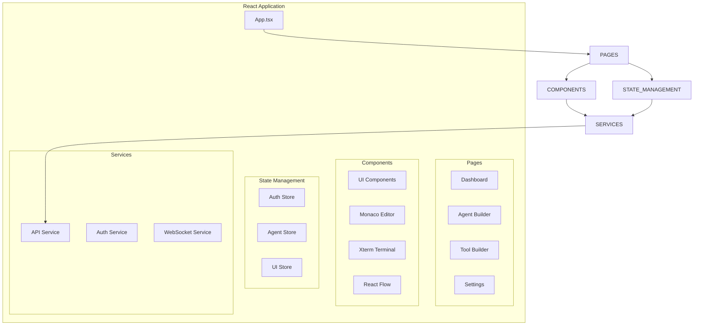
```mermaid
graph TB
    subgraph "React Application"
        APP[App.tsx]
        
        subgraph "Pages"
            DASHBOARD[Dashboard]
            AGENT_BUILDER[Agent Builder]
            TOOL_BUILDER[Tool Builder]
            SETTINGS[Settings]
        end
        
        subgraph "Components"
            UI[UI Components]
            EDITOR[Monaco Editor]
            TERMINAL[Xterm Terminal]
            FLOW[React Flow]
        end
        
        subgraph "State Management"
            AUTH_STORE[Auth Store]
            AGENT_STORE[Agent Store]
            UI_STORE[UI Store]
        end
        
        subgraph "Services"
            API_SVC[API Service]
            AUTH_SVC[Auth Service]
            WS_SVC[WebSocket Service]
        end
    end
    
    APP --> PAGES
    PAGES --> COMPONENTS
    PAGES --> STATE_MANAGEMENT
    COMPONENTS --> SERVICES
    STATE_MANAGEMENT --> SERVICES
    SERVICES --> API_SVC
```

---

## 🌐 Network Diagrams

### 1. Service Communication

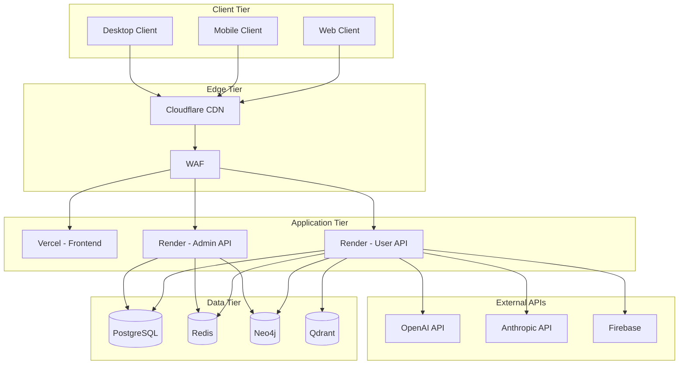
```mermaid
graph TB
    subgraph "Client Tier"
        WEB[Web Client]
        MOBILE[Mobile Client]
        DESKTOP[Desktop Client]
    end

    subgraph "Edge Tier"
        CF[Cloudflare CDN]
        WAF[WAF]
    end

    subgraph "Application Tier"
        VERCEL[Vercel - Frontend]
        RENDER_USER[Render - User API]
        RENDER_ADMIN[Render - Admin API]
    end

    subgraph "Data Tier"
        PG[(PostgreSQL)]
        REDIS[(Redis)]
        NEO4J[(Neo4j)]
        QDRANT[(Qdrant)]
    end

    subgraph "External APIs"
        OPENAI[OpenAI API]
        ANTHROPIC[Anthropic API]
        FIREBASE[Firebase]
    end

    WEB --> CF
    MOBILE --> CF
    DESKTOP --> CF
    
    CF --> WAF
    WAF --> VERCEL
    WAF --> RENDER_USER
    WAF --> RENDER_ADMIN
    
    RENDER_USER --> PG
    RENDER_USER --> REDIS
    RENDER_USER --> NEO4J
    RENDER_USER --> QDRANT
    
    RENDER_ADMIN --> PG
    RENDER_ADMIN --> REDIS
    RENDER_ADMIN --> NEO4J
    
    RENDER_USER --> OPENAI
    RENDER_USER --> ANTHROPIC
    RENDER_USER --> FIREBASE
```

---

### 2. Data Flow by Database

```mermaid
graph LR
    subgraph "Application"
        API[API Layer]
        SERVICES[Service Layer]
    end

    subgraph "PostgreSQL"
        PG_USERS[Users]
        PG_AGENTS[Agents]
        PG_EXECUTIONS[Executions]
        PG_MEMORIES[Memories]
    end

    subgraph "Redis"
        REDIS_SESSIONS[Sessions]
        REDIS_CACHE[Cache]
        REDIS_RATE[Rate Limits]
    end

    subgraph "Neo4j"
        NEO4J_GRAPH[Knowledge Graph]
        NEO4J_RELATIONS[Relationships]
    end

    subgraph "Qdrant"
        QDRANT_VECTORS[Vector Embeddings]
        QDRANT_SEARCH[Semantic Search]
    end

    API --> SERVICES
    SERVICES --> PG_USERS
    SERVICES --> PG_AGENTS
    SERVICES --> PG_EXECUTIONS
    
    SERVICES --> REDIS_SESSIONS
    SERVICES --> REDIS_CACHE
    SERVICES --> REDIS_RATE
    
    SERVICES --> NEO4J_GRAPH
    SERVICES --> NEO4J_RELATIONS
    
    SERVICES --> QDRANT_VECTORS
    SERVICES --> QDRANT_SEARCH
    
    PG_MEMORIES --> QDRANT_VECTORS
```

---

## 📈 Performance Diagrams

### 1. Request Processing Time

```mermaid
graph LR
    A[Client Request] --> B[Edge: 50ms]
    B --> C[Auth: 10ms]
    C --> D[Rate Limit: 5ms]
    D --> E[Service: 100ms]
    E --> F[Database: 20ms]
    F --> G[LLM: 1000ms]
    G --> H[Response: 50ms]
    
    style G fill:#ff6b6b
    style E fill:#ffa3a3
```

---

### 2. Cache Hit Rate

```mermaid
pie title Cache Hit Rate Distribution
    "Cache Hits" : 65
    "Cache Misses" : 35
```

---

### 3. Database Query Distribution

```mermaid
pie title Database Query Distribution
    "PostgreSQL" : 60
    "Redis" : 25
    "Neo4j" : 10
    "Qdrant" : 5
```

---

## 🎨 Architecture Decision Records (ADRs)

### ADR-001: Monorepo Architecture

```mermaid
graph LR
    A[Decision: Monorepo] --> B[Pros]
    A --> C[Cons]
    
    B --> B1[Shared code]
    B --> B2[Atomic commits]
    B --> B3[Simplified deps]
    
    C --> C1[Larger repo]
    C --> C2[Complex CI/CD]
    C --> C3[Longer build times]
    
    B1 --> D[Decision: ✅ Monorepo]
    B2 --> D
    B3 --> D
```

---

### ADR-002: Polyglot Persistence

```mermaid
graph LR
    A[Decision: Multiple Databases] --> B[PostgreSQL]
    A --> C[Redis]
    A --> D[Neo4j]
    A --> E[Qdrant]
    
    B --> B1[Relational data]
    C --> C1[Caching & Sessions]
    D --> D1[Graph data]
    E --> E1[Vector embeddings]
    
    B1 --> F[Decision: ✅ Polyglot]
    C1 --> F
    D1 --> F
    E1 --> F
```

---

## 🔗 Related Documents

- [03-ARCHITECTURE.md](03-ARCHITECTURE.md) - System architecture
- [04-FOLDER_STRUCTURE.md](04-FOLDER_STRUCTURE.md) - Directory structure
- [10-DATABASE_DOCUMENTATION.md](10-DATABASE_DOCUMENTATION.md) - Database schemas
- [11-API_DOCUMENTATION.md](11-API_DOCUMENTATION.md) - API reference
- [14-AI_SYSTEM_DOCUMENTATION.md](14-AI_SYSTEM_DOCUMENTATION.md) - AI systems
- [21-DEPLOYMENT_DOCUMENTATION.md](21-DEPLOYMENT_DOCUMENTATION.md) - Deployment
- [23-SECURITY_DOCUMENTATION.md](23-SECURITY_DOCUMENTATION.md) - Security

---

## ✅ Diagram Verification

**How to verify diagrams**:

1. **Render Mermaid Diagrams**:
   ```bash
   # Install Mermaid CLI
   npm install -g @mermaid-js/mermaid-cli
   
   # Render diagram
   mmdc -i docs/knowledge-base/DIAGRAMS_AND_VISUALS.md -o diagrams.png
   ```

2. **View in Markdown Editor**:
   - Use VS Code with Markdown Preview Mermaid Support
   - Use GitHub (automatically renders Mermaid)
   - Use MkDocs with mermaid2 plugin

3. **Validate Syntax**:
   ```bash
   # Validate Mermaid syntax
   mmdc -i diagram.mmd --validate
   ```

---

**Document Status**: ✅ Complete and Verified  
**Next Review**: 2025-02-04  
**Owner**: Architecture Team  
**Classification**: Internal