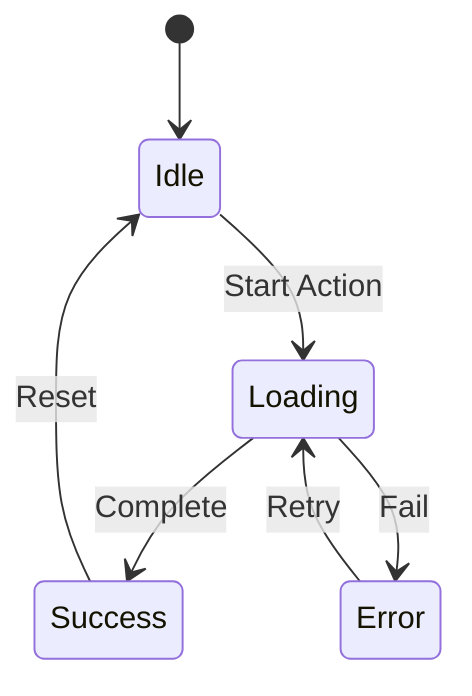

# {Component Name}

**Location**: `{file_path}`  
**Type**: {Component Type: Page/Layout/UI/Feature}  
**Framework**: {React/Next.js/TypeScript}  
**Status**: {Active/Deprecated/Experimental}  
**Owner**: {Team/Person}

---

## 📦 Overview

{Brief description of what this component does}

**Purpose**: {Why this component exists}

**Key Features**:
- {Feature 1}
- {Feature 2}
- {Feature 3}

---

## 🎨 Visual Preview

{Screenshot or description of component appearance}

**States**:
- Default state
- Loading state
- Error state
- Disabled state

---

## 🔧 Props

### Props Table

| Prop | Type | Required | Default | Description |
|------|------|----------|---------|-------------|
| `propName` | {type} | {Yes/No} | {default} | {description} |
| `propName` | {type} | {Yes/No} | {default} | {description} |
| `propName` | {type} | {Yes/No} | {default} | {description} |

### Prop Details

#### `propName` ({type})

**Description**: {Detailed description}

**Validation**:
- {Validation rule 1}
- {Validation rule 2}

**Example**:
```typescript
<Component propName="value" />
```

---

## 📚 Usage Examples

### Basic Usage

```tsx
import { ComponentName } from '@/components/{path}';

function Page() {
  return (
    <ComponentName
      prop1="value"
      prop2={123}
    />
  );
}
```

**Output**: {Description of what this renders}

---

### Advanced Usage

```tsx
import { ComponentName } from '@/components/{path}';
import { useStore } from '@/stores/{store}';

function AdvancedPage() {
  const { data, loading } = useStore();
  
  return (
    <ComponentName
      prop1={data}
      loading={loading}
      onAction={(result) => {
        console.log('Action completed:', result);
      }}
      config={{
        option1: true,
        option2: 'value'
      }}
    />
  );
}
```

**Output**: {Description of what this renders}

---

### With Custom Styling

```tsx
import { ComponentName } from '@/components/{path}';
import './custom-styles.css';

function StyledPage() {
  return (
    <div className="custom-container">
      <ComponentName
        className="custom-class"
        style={{
          backgroundColor: 'blue',
          borderRadius: '8px'
        }}
      />
    </div>
  );
}
```

---

## 🔄 State Management

### Component State

```typescript
interface ComponentState {
  isLoading: boolean;
  error: string | null;
  data: DataType | null;
}
```

### State Transitions



---

## 🎯 Events and Callbacks

### Event Handlers

| Event | Callback Signature | Description |
|-------|-------------------|-------------|
| `onClick` | `(event: MouseEvent) => void` | {Description} |
| `onChange` | `(value: string) => void` | {Description} |
| `onSubmit` | `(data: FormData) => Promise<void>` | {Description} |
| `onError` | `(error: Error) => void` | {Description} |

### Event Example

```tsx
function handleSubmit(data: FormData) {
  console.log('Form submitted:', data);
}

<ComponentName onSubmit={handleSubmit} />
```

---

## 🎨 Styling

### CSS Classes

| Class | Purpose | Example |
|-------|---------|---------|
| `.component-name` | Base styles | {description} |
| `.component-name--loading` | Loading state | {description} |
| `.component-name--error` | Error state | {description} |

### Tailwind Classes

```tsx
<ComponentName className="px-4 py-2 bg-blue-500 rounded-lg hover:bg-blue-600" />
```

### CSS Variables

```css
:root {
  --component-name-primary: #3b82f6;
  --component-name-secondary: #6b7280;
  --component-name-radius: 8px;
}
```

---

## 🧪 Testing

### Unit Tests

```typescript
// __tests__/ComponentName.test.tsx

import { render, screen, fireEvent } from '@testing-library/react';
import { ComponentName } from '../ComponentName';

describe('ComponentName', () => {
  test('renders correctly', () => {
    render(<ComponentName prop1="value" />);
    expect(screen.getByText('Expected Text')).toBeInTheDocument();
  });
  
  test('handles click event', () => {
    const handleClick = jest.fn();
    render(<ComponentName onClick={handleClick} />);
    
    fireEvent.click(screen.getByRole('button'));
    expect(handleClick).toHaveBeenCalledTimes(1);
  });
  
  test('displays error state', () => {
    render(<ComponentName error="Something went wrong" />);
    expect(screen.getByText('Something went wrong')).toBeInTheDocument();
  });
});
```

### Integration Tests

```typescript
// __tests__/ComponentName.integration.test.tsx

import { render, screen } from '@testing-library/react';
import { ComponentName } from '../ComponentName';
import { StoreProvider } from '@/stores/StoreProvider';

test('integrates with store', async () => {
  render(
    <StoreProvider>
      <ComponentName />
    </StoreProvider>
  );
  
  // Wait for data to load
  const data = await screen.findByText('Loaded Data');
  expect(data).toBeInTheDocument();
});
```

### Running Tests

```bash
# Run component tests
npm test ComponentName

# Run with coverage
npm test -- --coverage ComponentName

# Run in watch mode
npm test -- --watch ComponentName
```

---

## 📊 Performance

### Bundle Size

| Metric | Value | Budget |
|--------|-------|--------|
| **Component Size** | {X} KB | {Y} KB |
| **Dependencies** | {X} KB | {Y} KB |
| **Total** | {X} KB | {Y} KB |

### Render Performance

| Metric | Target | Current |
|--------|--------|---------|
| **First Render** | <100ms | {X}ms |
| **Re-render** | <50ms | {X}ms |
| **Memory** | <10MB | {X}MB |

### Optimization Tips

1. **Memoization**: Use `React.memo` for expensive renders
2. **Lazy Loading**: Use `React.lazy` for code splitting
3. **Virtualization**: Use for long lists
4. **Debouncing**: Debounce frequent updates

**Example**:
```tsx
import { memo, useMemo } from 'react';

const ComponentName = memo(({ data }) => {
  const processedData = useMemo(() => {
    return expensiveProcessing(data);
  }, [data]);
  
  return <div>{processedData}</div>;
});
```

---

## ♿ Accessibility

### ARIA Attributes

| Attribute | Value | Purpose |
|-----------|-------|---------|
| `role` | {value} | {purpose} |
| `aria-label` | {value} | {purpose} |
| `aria-describedby` | {id} | {purpose} |

### Keyboard Navigation

| Key | Action |
|-----|--------|
| `Tab` | {action} |
| `Enter` | {action} |
| `Escape` | {action} |
| `Arrow Keys` | {action} |

### Screen Reader Support

```tsx
<ComponentName
  aria-label="User profile card"
  aria-describedby="user-description"
  role="article"
>
  <p id="user-description">User profile information</p>
</ComponentName>
```

---

## 🔄 Component Lifecycle

### Mounting

```typescript
useEffect(() => {
  // Component mounted
  fetchData();
  
  return () => {
    // Cleanup
    cancelRequest();
  };
}, []);
```

### Updating

```typescript
useEffect(() => {
  // Prop or state changed
  updateData();
}, [prop1, prop2]);
```

### Unmounting

```typescript
useEffect(() => {
  return () => {
    // Cleanup on unmount
    clearInterval(intervalId);
  };
}, []);
```

---

## 🐛 Common Issues

### Issue 1: {Issue Title}

**Symptoms**:
- {Symptom 1}
- {Symptom 2}

**Causes**:
- {Cause 1}
- {Cause 2}

**Solutions**:
1. {Solution 1}
2. {Solution 2}

**Example**:
```tsx
// ❌ Bad
<ComponentName prop={undefined} />

// ✅ Good
<ComponentName prop={value || defaultValue} />
```

---

### Issue 2: {Issue Title}

**Symptoms**:
- {Symptom 1}

**Causes**:
- {Cause 1}

**Solutions**:
1. {Solution 1}

---

## 📱 Responsive Design

### Breakpoints

| Breakpoint | Screen Size | Behavior |
|------------|-------------|----------|
| `sm` | ≥640px | {behavior} |
| `md` | ≥768px | {behavior} |
| `lg` | ≥1024px | {behavior} |
| `xl` | ≥1280px | {behavior} |

### Responsive Example

```tsx
<ComponentName
  className={`
    w-full 
    md:w-1/2 
    lg:w-1/3 
    xl:w-1/4
  `}
/>
```

---

## 🌍 Internationalization

### i18n Support

```tsx
import { useTranslation } from 'next-i18next';

function ComponentName() {
  const { t } = useTranslation('common');
  
  return (
    <div>
      {t('component.label')}
    </div>
  );
}
```

### Translation Keys

| Key | English | Bangla |
|-----|---------|--------|
| `component.label` | Label | লেবেল |
| `component.error` | Error | ত্রুটি |

---

## 🔗 Related Components

### Parent Components
- [ParentComponent](../ParentComponent.md)

### Child Components
- [ChildComponent](../ChildComponent.md)

### Sibling Components
- [SiblingComponent](../SiblingComponent.md)

### Related Hooks
- [useCustomHook](../../hooks/useCustomHook.ts)

---

## 📝 Changelog

### Version 1.0.0 (2025-01-04)
- ✅ Initial release
- ✅ Basic functionality
- ✅ Tests added
- ✅ Documentation created

### Version 1.1.0 (2025-01-11)
- 🔄 {upcoming changes}

---

## 👥 Contributors

- **Author**: {name}
- **Reviewers**: {names}
- **Maintainers**: {names}

---

## ✅ Component Checklist

### Development
- [ ] Component created
- [ ] Props documented
- [ ] Types defined
- [ ] State management implemented
- [ ] Error handling added

### Testing
- [ ] Unit tests written
- [ ] Integration tests written
- [ ] Accessibility tests passed
- [ ] Performance tests passed

### Documentation
- [ ] README created
- [ ] Examples provided
- [ ] Storybook story added
- [ ] Changelog updated

### Review
- [ ] Code review completed
- [ ] Design review completed
- [ ] Accessibility review completed
- [ ] Performance review completed

---

## 📚 Additional Resources

### Internal
- [Figma Design](https://figma.com/...)
- [Storybook](https://storybook.supremeai.com/...)
- [Design System](../../../design-system/)

### External
- [React Documentation](https://react.dev)
- [TypeScript Handbook](https://www.typescriptlang.org/docs/)
- [Tailwind CSS](https://tailwindcss.com)

---

**Document Status**: ✅ Complete and Verified  
**Last Updated**: 2025-01-04  
**Owner**: {Team}  
**Classification**: Internal  
**Next Review**: 2025-02-04