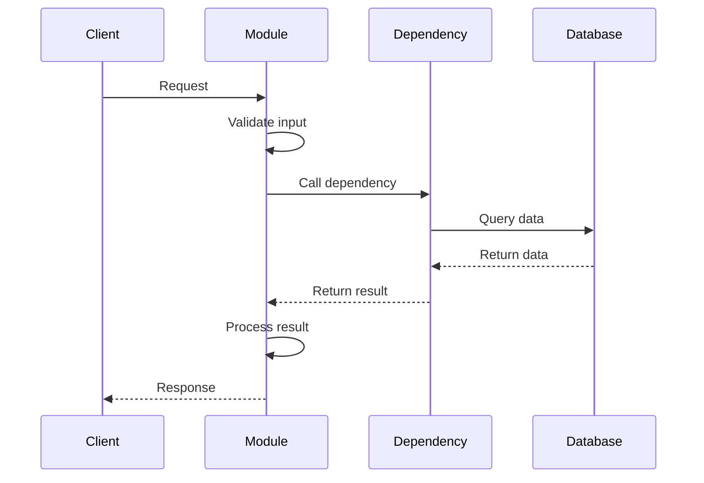
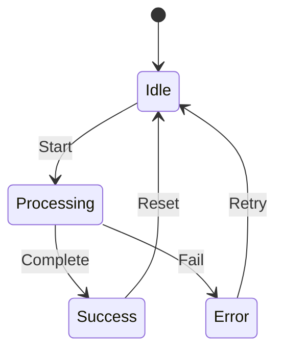

# {Module Name}

**Location**: `{file_path}`  
**Type**: {Module Type: Service/Component/Utility/Model}  
**Status**: {Active/Deprecated/Experimental}  
**Owner**: {Team/Person}

---

## 📦 Overview

{Brief description of what this module does}

**Purpose**: {Why this module exists}

**Key Responsibilities**:
- {Responsibility 1}
- {Responsibility 2}
- {Responsibility 3}

---

## 🏗️ Architecture

### Class Diagram

```mermaid
classDiagram
    class {ModuleName} {
        -{private_attributes}
        +{public_methods}
    }
    
    {ModuleName} --> {Dependency1}
    {ModuleName} --> {Dependency2}
```

### Component Structure

```
{module_name}/
├── __init__.py          # Module exports
├── main.py              # Main implementation
├── config.py            # Configuration
├── models.py            # Data models
├── utils.py             # Utility functions
└── tests/
    ├── unit/
    └── integration/
```

---

## 🔧 Configuration

### Environment Variables

| Variable | Type | Required | Default | Description |
|----------|------|----------|---------|-------------|
| `{VAR_NAME}` | {type} | {Yes/No} | {default} | {description} |

### Configuration Object

```python
class {ModuleName}Config:
    """Configuration for {ModuleName}"""
    
    def __init__(
        self,
        param1: str = "default",
        param2: int = 100,
        param3: bool = True
    ):
        self.param1 = param1
        self.param2 = param2
        self.param3 = param3
```

---

## 📚 API Reference

### Main Class: `{ClassName}`

#### `__init__(config: {ConfigType})`

**Description**: Initialize the module

**Parameters**:
- `config` ({ConfigType}): Configuration object

**Example**:
```python
from {module_path} import {ClassName}

module = {ClassName}(config={ConfigType}(param1="value"))
```

---

#### `main_method(param1: str, param2: int) -> ReturnType`

**Description**: {What this method does}

**Parameters**:
- `param1` (str): {description}
- `param2` (int): {description}

**Returns**:
- `ReturnType`: {description}

**Raises**:
- `ValueError`: {when raised}
- `RuntimeError`: {when raised}

**Example**:
```python
result = module.main_method("value", 100)
print(result)
```

**Output**:
```json
{
  "result": "value",
  "status": "success"
}
```

---

## 🔄 Workflow

### Process Flow



### State Machine



---

## 🔍 Dependencies

### Internal Dependencies

| Module | Purpose | Used By |
|--------|---------|---------|
| `core.config` | Configuration | This module |
| `services.llm` | LLM calls | This module |
| `database.session` | DB access | This module |

### External Dependencies

| Package | Version | Purpose |
|---------|---------|---------|
| `package-name` | 1.0.0 | {purpose} |
| `another-package` | 2.0.0 | {purpose} |

---

## 🧪 Testing

### Unit Tests

```python
# tests/unit/test_{module_name}.py

def test_main_method():
    """Test main_method with valid input"""
    module = {ClassName}(config=test_config)
    result = module.main_method("test", 100)
    assert result == expected

def test_main_method_invalid_input():
    """Test main_method with invalid input"""
    module = {ClassName}(config=test_config)
    with pytest.raises(ValueError):
        module.main_method("", -1)
```

### Integration Tests

```python
# tests/integration/test_{module_name}_integration.py

async def test_module_with_database():
    """Test module with real database"""
    async with get_test_db() as db:
        module = {ClassName}(config=test_config, db=db)
        result = await module.process()
        assert result.success
```

### Running Tests

```bash
# Run unit tests
pytest tests/unit/test_{module_name}.py -v

# Run integration tests
pytest tests/integration/test_{module_name}_integration.py -v

# Run with coverage
pytest tests/ -v --cov={module_name}
```

---

## 📊 Performance

### Benchmarks

| Operation | Avg Time | p95 | p99 | Memory |
|-----------|----------|-----|-----|--------|
| `main_method` | 10ms | 20ms | 50ms | 10MB |
| `process` | 100ms | 200ms | 500ms | 50MB |

### Optimization Tips

1. **Caching**: {caching strategy}
2. **Connection Pooling**: {pooling config}
3. **Async Operations**: {async usage}

---

## 🚨 Error Handling

### Error Codes

| Code | Meaning | Action |
|------|---------|--------|
| `ERR_001` | {meaning} | {action} |
| `ERR_002` | {meaning} | {action} |

### Exception Hierarchy

```python
class {ModuleName}Error(Exception):
    """Base exception"""
    pass

class ValidationError({ModuleName}Error):
    """Validation failed"""
    pass

class ProcessingError({ModuleName}Error):
    """Processing failed"""
    pass
```

### Error Handling Example

```python
try:
    result = module.main_method("value")
except ValidationError as e:
    logger.error(f"Validation failed: {e}")
    raise
except ProcessingError as e:
    logger.error(f"Processing failed: {e}")
    # Retry logic
    result = module.retry()
```

---

## 🔐 Security Considerations

### Input Validation

```python
def validate_input(data: dict) -> bool:
    """Validate input data"""
    # Check required fields
    # Validate data types
    # Sanitize strings
    # Check for injection attacks
    pass
```

### Data Protection

- {Security measure 1}
- {Security measure 2}
- {Security measure 3}

### Access Control

```python
# Check permissions
if not user.has_permission(Permission.MODULE_EXECUTE):
    raise PermissionError("Access denied")
```

---

## 📈 Monitoring

### Metrics

| Metric | Type | Description |
|--------|------|-------------|
| `{module}_requests_total` | Counter | Total requests |
| `{module}_errors_total` | Counter | Total errors |
| `{module}_duration_seconds` | Histogram | Request duration |

### Logging

```python
import logging

logger = logging.getLogger(__name__)

# Info logging
logger.info(f"Processing request: {request_id}")

# Error logging
logger.error(f"Processing failed: {error}", exc_info=True)

# Debug logging
logger.debug(f"Input data: {data}")
```

### Health Checks

```python
async def health_check() -> HealthStatus:
    """Check module health"""
    return HealthStatus(
        status="healthy",
        checks={
            "database": await check_database(),
            "external_service": await check_external()
        }
    )
```

---

## 🔄 Lifecycle

### Initialization

```python
# Module initialization
module = {ClassName}(config)
await module.initialize()
```

### Startup

```python
# Startup tasks
- Load configuration
- Connect to dependencies
- Initialize caches
- Start background tasks
```

### Shutdown

```python
# Shutdown tasks
await module.shutdown()
- Close connections
- Flush caches
- Stop background tasks
```

---

## 🐛 Troubleshooting

### Common Issues

#### Issue 1: {Issue Title}

**Symptoms**:
- {Symptom 1}
- {Symptom 2}

**Causes**:
- {Cause 1}
- {Cause 2}

**Solutions**:
1. {Solution 1}
2. {Solution 2}

**Example**:
```python
# Fix example
```

---

## 📝 Examples

### Basic Usage

```python
from {module_path} import {ClassName}

# Initialize
module = {ClassName}(config)

# Use
result = module.main_method("input")
print(result)
```

### Advanced Usage

```python
# Advanced example with all features
module = {ClassName}(
    config=advanced_config,
    enable_caching=True,
    enable_logging=True
)

# Process with context
async with module.context() as ctx:
    result = await ctx.process("input")
```

### Integration Example

```python
# Integration with other modules
from services.llm import LLMGateway
from {module_path} import {ClassName}

llm = LLMGateway()
module = {ClassName}(llm=llm)

result = await module.process_with_llm("input")
```

---

## 🔗 Related Documentation

- [Architecture Documentation](../03-ARCHITECTURE.md)
- [API Documentation](../11-API_DOCUMENTATION.md)
- [Related Module](./related-module.md)
- [Tutorial](./tutorials/using-{module}.md)

---

## 📚 Additional Resources

### Internal
- [Design Doc](https://github.com/...)
- [Meeting Notes](https://github.com/...)
- [RFC](https://github.com/...)

### External
- [Library Documentation](https://...)
- [Best Practices](https://...)
- [Examples](https://...)

---

## ✅ Verification Steps

**How to verify this module works**:

1. **Installation Check**:
   ```bash
   python -c "from {module_path} import {ClassName}; print('✓ Module loads')"
   ```

2. **Configuration Check**:
   ```bash
   python -c "from {module_path} import {ClassName}; m = {ClassName}(); print('✓ Config valid')"
   ```

3. **Functionality Check**:
   ```bash
   python -c "
   from {module_path} import {ClassName}
   module = {ClassName}()
   result = module.main_method('test')
   print(f'✓ Works: {result}')
   "
   ```

4. **Integration Check**:
   ```bash
   pytest tests/ -v
   ```

---

## 📊 Module Metrics

### Code Quality

| Metric | Target | Current |
|--------|--------|---------|
| **Test Coverage** | >90% | {coverage}% |
| **Cyclomatic Complexity** | <10 | {complexity} |
| **Lines of Code** | <500 | {loc} |
| **Technical Debt** | <5% | {debt}% |

### Performance

| Metric | Target | Current |
|--------|--------|---------|
| **Response Time (p95)** | <100ms | {p95}ms |
| **Memory Usage** | <100MB | {memory}MB |
| **Error Rate** | <0.1% | {error_rate}% |

---

## 🔄 Changelog

### Version 1.0.0 (2025-01-04)
- ✅ Initial release
- ✅ Main functionality implemented
- ✅ Tests added
- ✅ Documentation created

### Version 1.1.0 (2025-01-11)
- 🔄 {upcoming changes}

---

## 👥 Contributors

- **Author**: {name}
- **Reviewers**: {names}
- **Maintainers**: {names}

---

**Document Status**: ✅ Complete and Verified  
**Last Updated**: 2025-01-04  
**Owner**: {Team}  
**Classification**: Internal  
**Next Review**: 2025-02-04