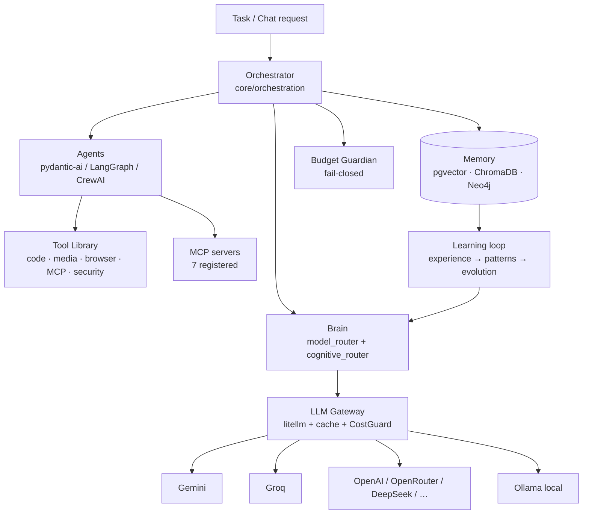
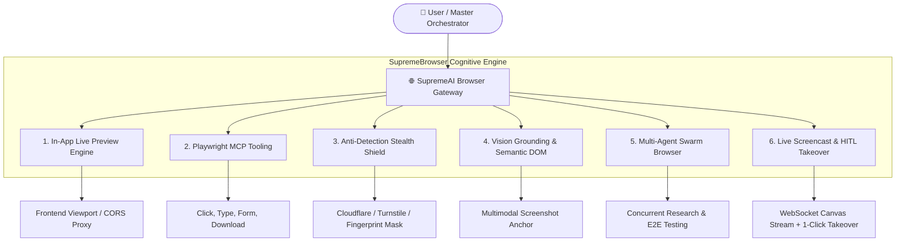
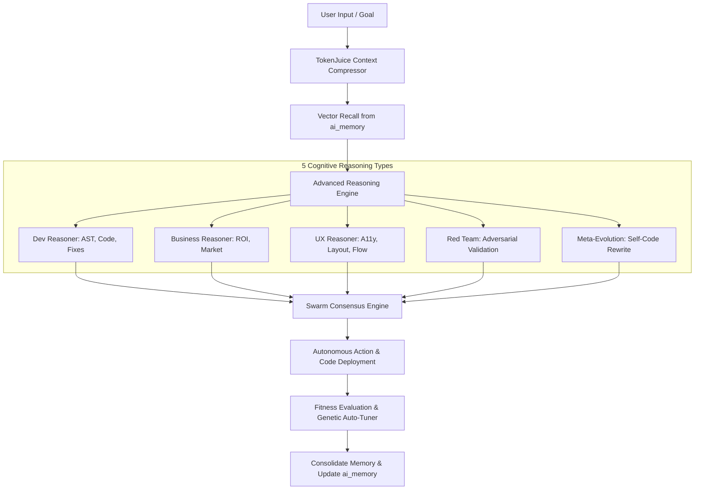

<!-- ============================================================ -->
<!-- Merged Source: docs/09-ai-brain.md -->
<!-- ============================================================ -->

# 09 — AI Brain & Agents

## Overview

The intelligence layer spans four cooperating areas of the backend: the **Brain** (`backend/brain/`) for model routing and cognition, the **LLM Gateway** (`backend/core/llm/`) for governed provider access, the **Agent framework** (`backend/agents/`, `backend/core/agents/`) for execution units, and **Memory & Learning** (`backend/memory/`, `backend/learning/`) for compounding experience.



## Brain (`backend/brain/`)

- **`model_router.py` — `ModelRouter`**: checks provider availability across gemini/openrouter/groq/deepseek/openai keys, picks the best provider using a latency tracker, and exposes monkeypatch hooks (`_call_openrouter`, `_call_huggingface`, `_call_ollama`) for tests.
- **`model_registry.py` — `ModelRegistry`**: tiered catalog from TIER 1 frontier models to free-tier options with OpenRouter IDs (e.g. `anthropic/claude-3-opus`, `openai/gpt-4o`, `deepseek/deepseek-chat`, `google/gemini-2.5-pro-preview`).
- **Cognition modules**: `cognitive_router.py`, `expert_router.py`, `gcp_router.py`, `parallel_cloud_router.py`, `performance_aware_router.py`, `reasoning_orchestrator.py`, `task_execution_engine.py`, `supreme_learning_engine.py`, `user_digital_twin.py`, `agent_departments.py`.

## LLM Gateway (`core/llm/llm_gateway.py`)

The single choke point for provider calls. Design properties:

- **litellm**, lazily imported (deferred to protect boot memory ~240 MB RSS).
- **Per-call API keys** — keys travel with the call, never injected into `os.environ`; `LLM_PROVIDER_KEYS` vault JSON supported; `_MODEL_KEY_MAP` covers groq/gemini/openai/deepseek/openrouter/hf/nvidia/moonshot/together/ollama.
- **Semantic cache** + **fallback chain** + shared **circuit-breaker** manager (reset via `/llm-gateway/admin/circuit-breaker/reset/{name}`).
- **`CostGuard`** enforces `MAX_COST_PER_TASK` and token budgets; orchestration halts fail-closed if the budget guardian dies.
- **Task-based dynamic routing** (`TASK_MODEL_MAP` & `AdvancedModelRouter`): 100% dynamic, driven by `core.config.settings` and Infisical Vault / environment variables (`MODEL_CODING`, `MODEL_REASONING`, `MODEL_VISION`, `MODEL_CHAT`, `MODEL_GENERAL`, `MODEL_MULTILINGUAL`, `EMBEDDING_MODEL`) with cost-optimized route ladders (`ROUTE_LADDER_SIMPLE`, `ROUTE_LADDER_MEDIUM`, `ROUTE_LADDER_COMPLEX`). Canonical reference: [`docs/architecture/hardcoded_to_dynamic_ai_model.md`](architecture/hardcoded_to_dynamic_ai_model.md).
- **Branding & Public Discovery**: `/api/config/public` and `/api/config/public/branding` expose dynamic model configs to frontend thin clients (`SUPREME_AVAILABLE_MODELS`, `modelBranding.ts`), completely preventing raw third-party vendor leaks.
- **Observability**: Langfuse adapter on calls; policy file `backend/config/routing_policy.json`; provider classes in `services/llm/providers.py` (`Provider` StrEnum: MOONSHOT, DEEPSEEK, TOGETHER, OLLAMA, GEMINI, HF_SPACE, OPENAI, GROQ) built on `BaseOpenAICompatibleProvider` with SSE parsing, `@circuit_breaker`, `@timed` metrics.
- **Free-tier rate limits**: `GEMINI_RPM_LIMIT=9`, `GROQ_RPM_LIMIT=28`, etc.
- **Ollama**: local-only adapter (`core/llm/providers/ollama_adapter.py`, default model `qwen2.5:0.5b`); `OLLAMA_URL` is fail-fast — no silent localhost fallback.

## Agent Framework

**Pydantic-AI integration** — `agents/base_pydantic_agent.py::BasePydanticAgent` wraps a pydantic-ai `Agent` (default `openai:gpt-4o`) wired to the gateway and `MCPRegistryClient`, with dynamic MCP tool registration.

**Frameworks inside `core/agents/framework/`:**
- `SupremeOrchestrator` (LangGraph-style, `langgraph_agent.py`)
- `SupremeCrew` / `CrewAgent` / `CrewTask` (CrewAI pattern, `crewai_agents.py`)
- `AgentDepartment` — `CodingAgent`, `ReviewAgent`, `QAAgent`
- `AutonomousAgent` (`task_runner_agent.py`)

**Declarative registry** — `core/agent_registry.json` defines agents (`guardian_expert`, `research_assistant`) with `system_prompt`, `tools[]`, `permissions[]`, `model_temp`, and resource constraints (`max_tokens_per_task`, `max_api_calls_per_hour`). `core/agent_factory.py` builds them; `core/agent_supervisor.py` supervises.

**Specialist agents** (`backend/agents/`): `SentinelAgent` (heartbeat monitor + anomaly detector + alert router), `InsightMage`, `VulnerabilityProphet`, `PerformanceGuardian`, `SkillLibrarian`/`SkillIngestor`/`SkillGarbageCollector`, `InternetMonitorAgent`, `MorphicAdapter`, `ephemeral_executor.py`, `headless_terminal_agent.py` — plus subpackages for domain, devops, governance, IDE, monitoring, infrastructure, evolution and SyncGuard.

**Live agents** (`core/agents/live/`): `benchmark_agent`, `vision_agent`, `browser_agent`, `computer_agent`.

## Orchestration (`core/orchestration/`)

`orchestrator.py::Orchestrator` runs a periodic `tick()` via `asyncio.TaskGroup`:

1. `_run_fitness_scoring` — `FitnessEngine` singleton scores skills
2. `SelfEvolutionAgent._tick` — self-evolution cycle
3. **Budget guardian subprocess** — `scripts/orchestrator/auto_budget_guardian.py`; failure halts the orchestrator (cost is fail-closed)

Task execution uses `decompose_intent()` → `execute_skill_chain()` over the `EvolutionSkillGraph` (edge-weight feedback, compensation fallbacks). HTTP surface: `GET /orchestrator/status`, `POST /orchestrator/tick` (Cloud Scheduler target). Siblings: `agent_orchestrator.py`, `master_cognitive_orchestrator.py` (CLI: `tools/master_orchestrator.py --intent repair|synthesis|audit|evolution`), `swarm_orchestrator.py`, `trio_pipeline.py` (Gemini → Kilo → Cline), `crew_departments.py`, `cloud_sandbox_orchestrator.py`.

## Tool Library (`backend/tools/` — 123 files)

`code/`, `media/`, `mcp/`, `browser/`, `devops/`, `knowledge/`, `learning/`, `social/`, `security_tools/`, `localization/`, `billing/`, `analytics/`, `creative/`, `ai_agents/`. Tools are composed by the skill chain, not hard-wired to agents.

## MCP Integration

- **Official server**: `tools/mcp/mcp_server.py` ("supremeai-knowledge-graph", stdio) exposing `get_skill_dependencies` and `find_optimal_learning_path` over Neo4j.
- **Sibling servers**: `mcp_supabase.py`, `mcp_workspace.py`, `mcp_cloud_deploy.py`, `mcp_github_cicd.py`, `mcp_observability.py`, `mcp_ide_trio.py`, `memory/mcp_server.py`.
- **Clients**: `core/mcp_client.py` (`MCPRegistryClient`, `ControlTowerClient`), `brain/mcp_client.py`.
- **Security**: `core/mcp_allowlist.py`, `core/plugins/mcp_security.py`.
- **Control Tower**: `infrastructure/mcp-control-plane/` — TypeScript MCP server deployed as `supremeai-mcp-tower` with adapters for render, firebase, supabase, redis, infisical, cloudflare, github/actions and an AI key pool.

## Memory & Learning

**Memory stack** (`backend/memory/`): `unified_db_manager.py` (single entry point, `write_via_unified_memory()` consumed by tools), `episodic_memory.py`, `long_term_memory.py`, `chromadb_store.py`, `supabase_store.py` (pgvector), `rag_pipeline.py`, `sliding_window.py`. Vector writes use `core/embeddings.embed_for_pgvector()` (dim 1536) into the `ai_memory` table.

**Learning loop** (`backend/learning/`): `experience.py` (task→experience records), `pattern_recognizer.py`, `hypothesis_engine.py`, `outcome_analyzer.py`, `evolution_bridge.py`. Outcomes feed the evolution engine (`backend/evolution/`: `advanced_evolution_engine.py`, `fitness_evaluator.py`, `canary_manager.py`, `benchmark_runner.py`).

**Knowledge tools** (repo-level): `tools/knowledge/` injects Tool Knowledge Cards (categories RADAR/SHIELD/ENGINE/ORCHESTRATOR/MEMORY/EVOLUTION) into `ai_memory` with content-hash dedup; `tools/knowledge_squeezer/` runs multi-model brainstorm → adversarial audit → Socratic gap mining → confidence-gated synthesis → optional long-term memory promotion.

## Reasoning Engines (`backend/engine/`)

`smart_router.py`, `tree_of_thought.py`, `debate_engine.py`, `self_reflection.py`, `vector_db.py`, `worker_node.py`, and `compression/token_juice.py` (token-compression pass, toggled by `TOKEN_JUICE_ENABLED`). The `ecosystem/` package hosts the phase 2–14 orchestration modules (task engine, capability registry, governance, approval workflow) on a shared SQLite store for fast local operation.

## Optional External Integrations

`backend/integrations/` — each flag-gated *and* guarded by `importlib.util.find_spec`, zero-cost fallback when absent: **mem0** (`SUPREMEAI_MEM0_ENABLED`), **Graphiti** (`SUPREMEAI_GRAPHITI_ENABLED`), **browser-use** (`SUPREMEAI_BROWSER_USE_ENABLED`), **E2B** (`SUPREMEAI_E2B_ENABLED`), **OpenHands** (`SUPREMEAI_OPENHANDS_ENABLED`).


<!-- ============================================================ -->
<!-- Merged Source: docs/superai_competitor_playbook.md -->
<!-- ============================================================ -->

# 🎯 SuperAI Competitive Intelligence Playbook
## "Know Your Enemy, Steal Their Best, Exploit Their Weakness"

> **Strategy**: আমরা competitorদের AI ব্যবহার করি আমাদের "muscle" হিসেবে।  
> **Goal**: তাদের **Gola** (weakness) খুঁজে বের করা + **Best Features** copy করা

---

# 📊 PART 1: COMPETITOR LANDSCAPE ANALYSIS

## 🔥 Major AI Competitors (2025-2026)

| Competitor | Market Position | Strength | Weakness (GOLA) | Pricing |
|------------|----------------|----------|-----------------|---------|
| **ChatGPT (OpenAI)** | Market Leader (#1) | Brand trust, Ecosystem, Plugins | Over-censored, Expensive, Generic responses | $20/mo Pro |
| **Claude (Anthropic)** | Quality Leader | Honest, Long context, Safe | Slow, 200K limit, No real-time data | $20/mo Pro |
| **Gemini (Google)** | Google Ecosystem | Free tier generous, Multimodal | Privacy concerns, Inconsistent quality | FREE / $20 |
| **Perplexity** | Search AI | Real-time web search, Citations | Expensive, Limited context, Ads in Pro | $20/mo |
| **Grok (xAI)** | Twitter/X Integration | Real-time X data, Uncensored | Limited features, Unreliable | $16/mo |
| **DeepSeek** | Open Source Champ | Cheap, Powerful, Transparent | China-based, Compliance issues | API only |
| **Copilot (Microsoft)** | Enterprise King | Office integration, Enterprise | Windows-only, Privacy concerns | $30/user |
| **Jasper** | Marketing AI | Marketing templates, Brand voice | Expensive, Limited to marketing | $49-99/mo |

---

## 🎯 DETAILED COMPETITOR BREAKDOWN

### 1️⃣ ChatGPT (OpenAI) - The Market Leader

#### ✅ **What They Do BEST (Copy This!)**

| Feature | Why It's Great | How to Implement in SuperAI |
|---------|---------------|----------------------------|
| **Plugin Ecosystem** | Extensibility = Infinite use cases | Build modular plugin system with marketplace |
| **Memory/Context** | Remembers user preferences across sessions | Implement persistent user profiles + conversation memory |
| **GPT Store** | Community-driven custom GPTs | Allow users to create/share custom AI agents |
| **Voice Mode** | Natural conversation feel | Add STT/TTS with local processing (cheaper) |
| **Code Interpreter** | Run code in sandbox | Add safe code execution environment |
| **DALL-E Integration** | Text-to-image seamless flow | Integrate free image gen models (Stable Diffusion) |

#### ❌ **Their GOLAs (Weaknesses - Exploit These!)**

```
🚨 CRITICAL WEAKNESSES:

1. OVER-CENSORSHIP Problem
   └── Issue: Refuses harmless requests, too cautious
   └── User Pain: "I can't get straight answers"
   └── Our Opportunity: Be MORE flexible, less judgmental
   └── Implementation: Custom safety layer (tunable strictness)

2. GENERIC/BORING Responses
   └── Issue: Sounds robotic, lacks personality
   └── User Pain: "All answers sound the same"
   └── Our Opportunity: Add PERSONALITY modes (Professional/Casual/Sassy)
   └── Implementation: System prompts with tone customization

3. EXPENSIVE Pricing
   └── Issue: $20/month is steep for many users
   └── User Pain: "Worth it? Maybe not"
   └── Our Opportunity: FREEMIUM model with generous limits
   └── Implementation: Ad-supported free tier + smart LLM routing

4. NO REAL-TIME DATA (Free Tier)
   └── Issue: Knowledge cutoff, no live info
   └── User Pain: "Is this still accurate?"
   └── Our Opportunity: Built-in web search (use Perplexity's strength!)
   └── Implementation: Web search integration with source citations

5. CONTEXT WINDOW Confusion
   └── Issue: Different models have different limits
   └── User Pain: "It forgot what we discussed!"
   └── Our Opportunity: UNLIMITED conversation history (smart summarization)
   └── Implementation: Auto-summarize old conversations, keep key points

6. PRIVACY Concerns
   └── Issue: Training on user data (opt-out only)
   └── User Pain: "Are they reading my chats?"
   └── Our Opportunity: PRIVACY-FIRST marketing, local processing option
   └── Implementation: Clear privacy policy, opt-IN for training
```

---

### 2️⃣ Claude (Anthropic) - The Quality Alternative

#### ✅ **What They Do BEST (Copy This!)**

| Feature | Why It's Great | SuperAI Implementation |
|---------|---------------|----------------------|
| **Honesty** | Says "I don't know" instead of hallucinating | Confidence scoring system |
| **Long Context** | 200K tokens (largest among major players) | Chunked context with smart retrieval |
| **Constitutional AI** | Safer by design, fewer jailbreaks | Customizable safety guidelines |
| **Artifacts** | Live preview of generated content | Side-by-side preview panel |
| **Projects** | Organize conversations by topic | Workspaces with knowledge bases |
| **Nuanced Writing** | Better for creative/complex tasks | Style adaptation based on user need |

#### ❌ **Their GOLAs (Weaknesses)**

```
🚨 CRITICAL WEAKNESSES:

1. SPEED Problem
   └── Issue: Noticeably slower than ChatGPT/Gemini
   └── User Pain: "Why is it taking so long?"
   └── Our Opportunity: STREAM responses faster, show progress
   └── Implementation: Streaming from start, partial rendering

2. 200K Context LIMIT
   └── Issue: Still limited vs infinite human memory
   └── User Pain: "Can't upload my whole codebase"
   └── Our Opportunity: TRULY unlimited (with smart compression)
   └── Implementation: Hierarchical memory system

3. NO MULTIMODAL (Initially)
   └── Issue: Can't process images natively
   └── User Pain: "Look at this screenshot"
   └── Our Opportunity: Full multimodal from DAY ONE
   └── Implementation: Vision capabilities integrated

4. NO REAL-TIME WEB ACCESS
   └── Issue: Training data only (mostly)
   └── User Pain: "What happened yesterday?"
   └── Our Opportunity: Always-connected AI with live data
   └── Implementation: Search-first architecture

5. EXPENSIVE API
   └── Issue: Highest cost per token among top providers
   └── User Pain: "My bill is huge"
   └── Our Opportunity: SMART ROUTING to cheaper models
   └── Implementation: Auto-select model based on task complexity
```

---

### 3️⃣ Gemini (Google) - The Free Tier Champion

#### ✅ **What They Do BEST (Copy This!)**

| Feature | Why It's Great | SuperAI Implementation |
|---------|---------------|----------------------|
| **Generous Free Tier** | 1500 requests/day FREE! | Use as primary free provider |
| **Multimodal Native** | Text, image, audio, video, code | All-in-one input handling |
| **Google Integration** | Docs, Sheets, Gmail, Drive | Workspace integrations |
| **Long Context (1M+)** | Massive context windows | Implement similar scale |
| **Grounding** | Double-checks facts with Google | Source verification system |
| **Extensions** | Google Flights, Hotels, Maps | External service connectors |

#### ❌ **Their GOLAs (Weaknesses)**

```
🚨 CRITICAL WEAKNESSES:

1. INCONSISTENT Quality
   └── Issue: Sometimes brilliant, sometimes dumb
   └── User Pain: "It gave me wrong info confidently"
   └── Our Opportunity: CONSISTENCY through ensemble methods
   └── Implementation: Multiple model voting, confidence thresholds

2. PRIVACY Nightmares
   └── Issue: Google reads EVERYTHING, targets ads
   └── User Pain: "They're tracking me"
   └── Our Opportunity: ZERO tracking, privacy-focused branding
   └── Implementation: Local-first, encrypted, no ad targeting

3. RESPONSE Length Limits
   └── Issue: Cuts off long responses arbitrarily
   └── User Pain: "It stopped mid-sentence!"
   └── Our Opportunity: SMART continuation (seamless)
   └── Implementation: Auto-detect truncation, offer to continue

4. COMPLEX Interface
   └── Issue: Too many modes, confusing UX
   └── User Pain: "Which mode should I use?"
   └── Our Opportunity: SIMPLIFIED single interface
   └── Implementation: Auto-detect intent, switch modes invisibly

5. GOOGLE ECOSYSTEM Lock-in
   └── Issue: Works best if you use all Google products
   └── User Pain: "Forced to use Google stuff"
   └── Our Opportunity: PLATFORM AGNOSTIC
   └── Implementation: Work with everything equally well
```

---

### 4️⃣ Perplexity - The Search Challenger

#### ✅ **What They Do BEST (Copy This!)**

| Feature | Why It's Great | SuperAI Implementation |
|---------|---------------|----------------------|
| **Real-time Web Search** | Always current information | Built-in search with citations |
| **Source Citations** | Shows where info came from | Inline references with links |
| **Follow-up Questions** | Suggests related queries | Proactive question suggestions |
| **Collections** | Save research to folders | Project-based organization |
| **Academic Focus** | Great for research papers | Scholar integration |
| **Clean UI** | Minimalist, focused | Distraction-free interface |

#### ❌ **Their GOLAs (Weaknesses)**

```
🚨 CRITICAL WEAKNESSES:

1. EXPENSIVE for What It Does
   └── Issue: $20/mo mainly for search wrapper
   └── User Pain: "I can just use Google + ChatGPT"
   └── Our Opportunity: Include search FOR FREE in base product
   └── Implementation: Web search as core feature, not premium

2. LIMITED Conversation Depth
   └── Issue: Not great for long creative projects
   └── User Pain: "It forgets context quickly"
   └── Our Opportunity: DEEP context retention
   └── Implementation: Persistent memory across sessions

3. ADS in Pro Version (!!)
   └── Issue: Paying users still see sponsored content
   └── User Pain: "I'm paying AND seeing ads?"
   └── Our Opportunity: NEVER show ads to paying users
   └── Implementation: Clean experience at every tier

4. No Code Execution
   └── Issue: Can't run code like ChatGPT
   └── User Pain: "Just give me the answer, not code I can't run"
   └── Our Opportunity: EXECUTE code, not just generate
   └── Implementation: Sandbox execution environment

5. Sometimes Hallucinates Sources
   └── Issue: Makes up fake citations
   └── User Pain: "This link doesn't exist!"
   └── Our Opportunity: VERIFIED sources only
   └── Implementation: Link validation before showing
```

---

### 5️⃣ Grok (xAI) - The Rebel

#### ✅ **What They Do BEST (Copy This!)**

| Feature | Why It's Great | SuperAI Implementation |
|---------|---------------|----------------------|
| **Real-time X Data** | Access to live tweets/posts | Social media integration |
| **Uncensored Style** | More edgy, less filtered | Adjustable "strictness" knob |
| **Fun Personality** | Memes, humor, witty replies | Personality mode options |
| **Fast Responses** | Optimized for speed | Latency optimization |

#### ❌ **Their GOLAs (Weaknesses)**

```
🚨 CRITICAL WEAKNESSES:

1. Too UNCENSORED Sometimes
   └── Issue: Can be offensive, harmful content
   └── User Pain: "That response was inappropriate"
   └── Our Opportunity: TUNABLE safety (user chooses level)
   └── Implementation: Family-safe / Professional / Unfiltered modes

2. LIMITED Features
   └── Issue: Basically just a chatbot, nothing else
   └── User Pain: "What else can it do?"
   └── Our Opportunity: ALL-IN-ONE platform
   └── Implementation: Chat + Search + Create + Analyze + Code

3. X/Twitter DEPENDENCE
   └── Issue: Only valuable if you care about X
   └── User Pain: "I don't use Twitter"
   └── Our Opportunity: MULTI-SOURCE social integration
   └── Implementation: Reddit, LinkedIn, News, Academic sources

4. RELIABILITY Issues
   └── Issue: Often down or buggy
   └── User Pain: "It's not working again"
   └── Our Opportunity: 99.9% Uptime guarantee
   └── Implementation: Multi-provider fallback system
```

---

# 🧠 PART 2: INTERNAL BRAIN ARCHITECTURE (What to Copy)

## 🏗️ Architecture Patterns Worth Stealing

### From **ChatGPT/OpenAI**:
```python
# Pattern 1: Plugin System (MODULAR EXTENSIBILITY)
class SuperAIPluginSystem:
    """
    Copy from ChatGPT's plugin architecture:
    - Each plugin is isolated
    - Can access external APIs
    - Permission-based activation
    - Marketplace for community plugins
    """
    plugins = {}
    
    def register_plugin(self, name, permissions_needed):
        def decorator(func):
            self.plugins[name] = {
                'function': func,
                'permissions': permissions_needed,
                'usage_count': 0
            }
            return func
        return decorator
    
    async def execute_plugin(self, name, args, user_permissions):
        plugin = self.plugins.get(name)
        if not plugin:
            raise ValueError(f"Plugin {name} not found")
        
        # Check permissions
        if not set(plugin['permissions']).issubset(user_permissions):
            raise PermissionError(f"Insufficient permissions")
        
        # Track usage
        plugin['usage_count'] += 1
        
        # Execute with timeout
        result = await asyncio.wait_for(
            plugin['function'](args),
            timeout=30.0
        )
        
        return result


# Pattern 2: Memory System (PERSISTENT CONTEXT)
class SuperAIMemory:
    """
    Copy from ChatGPT's memory but IMPROVE:
    - Unlimited storage (smart compression)
    - Semantic search over memories
    - Automatic importance ranking
    - User-controlled forgetting
    """
    def __init__(self, user_id):
        self.user_id = user_id
        self.short_term = []  # Current conversation
        self.long_term = {}   # Persistent memories
        self.summaries = []   # Compressed old convos
    
    async def add_memory(self, content, importance='medium'):
        """Store with automatic classification"""
        memory_id = str(uuid.uuid4())
        
        # Extract key facts using LLM
        facts = await self._extract_facts(content)
        
        # Store with embeddings for semantic search
        embedding = await self._get_embedding(content)
        
        self.long_term[memory_id] = {
            'content': content,
            'facts': facts,
            'embedding': embedding,
            'importance': importance,
            'created_at': datetime.now(),
            'access_count': 0
        }
        
        return memory_id
    
    async def recall(self, query, limit=5):
        """Semantic search over memories"""
        query_embedding = await self._get_embedding(query)
        
        # Find most relevant memories
        scored_memories = []
        for mem_id, mem in self.long_term.items():
            similarity = self._cosine_similarity(
                query_embedding, 
                mem['embedding']
            )
            scored_memories.append((similarity, mem))
        
        # Sort by relevance + recency + importance
        scored_memories.sort(key=lambda x: (
            x[0],  # Similarity
            x[1]['access_count'],  # Frequency
            {'high': 3, 'medium': 2, 'low': 1}[x[1]['importance']]
        ), reverse=True)
        
        return [mem for score, mem in scored_memories[:limit]]
```

### From **Claude/Anthropic**:
```python
# Pattern 3: Constitutional AI (CUSTOMIZABLE SAFETY)
class SuperAISafetyLayer:
    """
    Copy Claude's Constitutional AI but make it USER-CONTROLLED:
    - Multiple constitution options
    - User-adjustable strictness
    - Transparent decision-making
    - Override capability for advanced users
    """
    
    CONSTITUTIONS = {
        'family_safe': {
            'strictness': 0.9,
            'rules': [
                'No harmful content',
                'No adult themes',
                'Educational focus',
                'Respectful language'
            ]
        },
        'professional': {
            'strictness': 0.7,
            'rules': [
                'Business-appropriate',
                'No offensive language',
                'Fact-checked claims',
                'Balanced perspectives'
            ]
        },
        'creative': {
            'strictness': 0.4,
            'rules': [
                'Allow artistic expression',
                'Fictional violence OK',
                'Mature themes allowed',
                'Encourage experimentation'
            ]
        },
        'unfiltered': {
            'strictness': 0.1,
            'rules': [
                'Only illegal content blocked',
                'Maximum freedom',
                'User assumes responsibility',
                'No moral judgments'
            ]
        }
    }
    
    def __init__(self, default_mode='professional'):
        self.current_mode = default_mode
        self.constitution = self.CONSTITUTIONS[default_mode]
    
    def check_content(self, content, user_override=None):
        """Check if content passes safety filter"""
        mode = user_override or self.current_mode
        strictness = self.CONSTITUTIONS[mode]['strictness']
        
        # Score content against rules
        violation_score = self._analyze_content(content)
        
        # Decision based on strictness threshold
        if violation_score > strictness:
            return {
                'allowed': False,
                'reason': f'Violates {mode} mode rules',
                'suggestion': 'Try rephrasing or adjust your safety settings'
            }
        
        return {
            'allowed': True,
            'confidence': 1 - violation_score,
            'mode_used': mode
        }


# Pattern 4: Artifacts System (LIVE PREVIEW)
class SuperAIArtifacts:
    """
    Copy Claude's Artifacts feature:
    - Generate code/content in side panel
    - Live preview/rendering
    - Editable output
    - Export capabilities
    """
    
    SUPPORTED_TYPES = {
        'code': ['python', 'javascript', 'html', 'css', 'sql'],
        'content': ['markdown', 'text', 'json', 'xml'],
        'visual': ['mermaid', 'svg', 'graphviz'],
        'data': ['table', 'chart', 'csv']
    }
    
    async def create_artifact(self, content_type, content, metadata=None):
        artifact_id = str(uuid.uuid4())
        
        artifact = {
            'id': artifact_id,
            'type': content_type,
            'content': content,
            'metadata': metadata or {},
            'created_at': datetime.now().isoformat(),
            'version': 1,
            'preview_url': None
        }
        
        # Generate preview if supported
        if content_type in self.SUPPORTED_TYPES['visual']:
            artifact['preview_url'] = f'/api/artifacts/{artifact_id}/preview'
        elif content_type == 'code':
            artifact['preview_url'] = f'/api/artifacts/{artifact_id}/execute'
        
        return artifact
```

### From **Gemini/Google**:
```python
# Pattern 5: Multimodal Native Processing
class SuperAIMultimodalEngine:
    """
    Copy Gemini's native multimodal support:
    - Single model handles all input types
    - Seamless cross-modal understanding
    - Unified embedding space
    """
    
    INPUT_PROCESSORS = {
        'text': self._process_text,
        'image': self._process_image,
        'audio': self._process_audio,
        'video': self._process_video,
        'document': self._process_document,
        'code': self._process_code
    }
    
    async def process_input(self, input_data, input_type):
        """Process any input type into unified representation"""
        processor = self.INPUT_PROCESSORS.get(input_type)
        if not processor:
            raise ValueError(f"Unsupported input type: {input_type}")
        
        # Process into common format
        processed = await processor(input_data)
        
        # Generate unified embedding
        embedding = await self._generate_multimodal_embedding(processed)
        
        return {
            'original_type': input_type,
            'processed_data': processed,
            'embedding': embedding,
            'metadata': self._extract_metadata(input_data, input_type)
        }
    
    async def understand_context(self, inputs: list):
        """Understand relationships between multiple inputs"""
        embeddings = [inp['embedding'] for inp in inputs]
        
        # Cross-modal attention
        attention_matrix = self._compute_cross_attention(embeddings)
        
        # Unified context representation
        context = {
            'inputs': inputs,
            'relationships': attention_matrix,
            'summary': await self._generate_context_summary(inputs),
            'dominant_modality': self._identify_primary_input(inputs)
        }
        
        return context


# Pattern 6: Grounding/Verification
class SuperAIVerifier:
    """
    Copy Gemini's grounding feature:
    - Fact-check claims against web
    - Show confidence levels
    - Provide sources
    - Flag uncertain information
    """
    
    async def verify_claim(self, claim: str) -> dict:
        """Verify a factual claim"""
        # Search for supporting evidence
        search_results = await self.web_search(claim)
        
        # Analyze consistency
        evidence = []
        for result in search_results:
            consistency = await self._check_consistency(claim, result['snippet'])
            evidence.append({
                'source': result['url'],
                'title': result['name'],
                'consistency_score': consistency,
                'excerpt': result['snippet']
            })
        
        # Calculate overall confidence
        avg_consistency = sum(e['consistency_score'] for e in evidence) / len(evidence) if evidence else 0
        
        return {
            'claim': claim,
            'confidence': avg_consistency,
            'supporting_evidence': [e for e in evidence if e['consistency_score'] > 0.7],
            'contradicting_evidence': [e for e in evidence if e['consistency_score'] < 0.3],
            'verdict': 'verified' if avg_consistency > 0.8 else 
                       'likely' if avg_consistency > 0.6 else 
                       'uncertain' if avg_consistency > 0.4 else 
                       'unverified'
        }
```

### From **Perplexity**:
```python
# Pattern 7: Citation System
class SuperAICitationEngine:
    """
    Copy Perplexity's citation system but improve:
    - Validate links before showing
    - Multiple sources per claim
    - Click-to-view original
    - Export bibliography
    """
    
    async def generate_response_with_citations(self, query: str) -> dict:
        """Generate response with inline citations"""
        # Step 1: Search for sources
        sources = await self.search_engine.search(query, num_results=10)
        
        # Step 2: Validate sources (IMPROVEMENT over Perplexity)
        valid_sources = []
        for source in sources:
            is_valid = await self._validate_source(source['url'])
            if is_valid:
                valid_sources.append(source)
        
        # Step 3: Generate response referencing sources
        response = await self.llm.generate(
            prompt=f"Answer using these sources: {valid_sources}\n\nQuery: {query}",
            system="Include inline citations like [1], [2] etc."
        )
        
        # Step 4: Map citation numbers to sources
        citation_map = self._extract_citations(response, valid_sources)
        
        return {
            'response': response,
            'citations': citation_map,
            'sources': valid_sources,
            'confidence_score': len(valid_sources) / 10  # More sources = higher confidence
        }


# Pattern 8: Follow-up Suggestions
class SuperAIFollowUpGenerator:
    """
    Copy Perplexity's follow-up questions:
    - Contextual suggestions
    - Deepen understanding
    - Explore related topics
    """
    
    async def suggest_followups(self, conversation_history: list, current_response: str) -> list:
        """Generate intelligent follow-up questions"""
        suggestions = await self.llm.generate(
            prompt=f"""
            Based on this conversation:
            {conversation_history}
            
            And this last response:
            {current_response}
            
            Generate 4 follow-up questions that would:
            1. Help clarify unclear points
            2. Dive deeper into interesting aspects
            3. Explore practical applications
            4. Challenge or verify assumptions
            
            Return as JSON array of strings.
            """,
            response_format='json'
        )
        
        return json.loads(suggestions)
```

---

# 🎨 PART 3: EXTERNAL OUTLOOK (UI/UX Patterns to Copy)

## 🖼️ Visual Design Patterns Worth Stealing

### From **ChatGPT**:
```
✅ COPY THESE UI ELEMENTS:

1. CLEAN SIDEBAR NAVIGATION
   ├── Conversation history (searchable)
   ├── New chat button (prominent)
   ├── Organization by folders/tags
   ├── User profile/settings access
   └── PROBLEM: Gets cluttered → OUR FIX: Smart auto-organization

2. MESSAGE BUBBLE DESIGN
   ├── User messages: Right-aligned, different color
   ├── AI messages: Left-aligned, clean typography
   ├── Code blocks: Syntax highlighted, copy button
   └── PROBLEM: Boring → OUR FIX: Themed, customizable

3. INPUT AREA
   ├── Large text area (not just one line)
   ├── Attachment buttons (files, images)
   ├── Send button with keyboard shortcut hint
   └── PROBLEM: Basic → OUR FIX: Slash commands, @mentions, voice

4. MODEL SELECTOR
   ├── Easy switching between GPT-4o, o1, mini
   ├── Clear indication of current model
   └── OUR VERSION: Auto-select based on complexity
```

### From **Claude**:
```
✅ COPY THESE UI ELEMENTS:

1. ARTIFACTS PANEL (GENIUS!)
   ├── Side-by-side content generation
   ├── Live preview of code/output
   ├── Separate workspace for creations
   └── OUR ENHANCEMENT: Multiple artifacts, compare versions

2. PROJECTS ORGANIZATION
   ├── Group conversations by project
   ├── Custom instructions per project
   ├── Shared knowledge base
   └── OUR ENHANCEMENT: Team projects, shared access

3. EXTENDED THINKING VISUALIZATION
   ├── Shows when AI is "thinking"
   ├── Builds anticipation/trust
   └── OUR ENHANCEMENT: Show reasoning steps (optional)

4. CLEAN MINIMALIST AESTHETIC
   ├── Lots of white space
   ├── Focus on content
   └── OUR VERSION: Dark/light mode, customizable themes
```

### From **Perplexity**:
```
✅ COPY THESE UI ELEMENTS:

1. SOURCE CITATIONS IN-LINE
   ├── Numbered references [1], [2]
   ├── Click to view source
   ├── Source credibility indicators
   └── OUR ENHANCEMENT: Source verification status

2. RELATED QUESTIONS
   ├── Suggested follow-ups
   ├── Explore related topics
   └── OUR ENHANCEMENT: Personalized based on history

3. COLLECTIONS/FOLDERS
   ├── Save research sessions
   ├── Share collections
   └── OUR ENHANCEMENT: Collaborative collections

4. SEARCH-FOCUSED LAYOUT
   ├── Prominent search bar
   ├── Filter options
   └── OUR VERSION: Chat + Search hybrid
```

### From **Gemini**:
```
✅ COPY THESE UI ELEMENTS:

1. MULTIMODAL INPUT
   ├── Drag-and-drop images
   ├── Camera input
   ├── Microphone for voice
   └── OUR VERSION: Even more input types

2. MODE SWITCHER (BUT SIMPLIFY!)
   ├── Different modes for different tasks
   └── OUR FIX: Auto-detect mode, hide complexity

3. RESPONSE FORMATTING
   ├── Rich text formatting
   ├── Tables, lists, headers
   └── KEEP THIS: It's great!

4. DOUBLE-CHECK FEATURE (Grounding)
   ├── "Google it" button
   ├── Verify claims
   └── OUR VERSION: Built-in verification
```

---

## 🎯 SUPERAI'S UNIQUE UI INNOVATIONS (Our Secret Weapons!)

```
🚀 FEATURES NOBODY ELSE HAS (Yet):

1. 🎭 PERSONALITY SELECTOR
   ┌─────────────────────────────┐
   │ Choose AI Personality:      │
   │ ○ Professional              │
   │ ○ Casual & Friendly         │
   │ ○ Witty & Humorous          │
   │ ○ Encouraging Coach         │
   │ ○ Technical Expert          │
   │ ○ Creative Muse             │
   └─────────────────────────────┘
   
   WHY IT WINS: Users get EXACTLY the tone they want

2. 🎛️ COMPLEXITY DIAL
   ┌─────────────────────────────┐
   │ Response Detail Level:      │
   │ [━━━━━━○━━] Simple          │
   │ [━━━━━●━━━] Detailed        │
   │ [━━━●━━━━━] Comprehensive   │
   │ [━●━━━━━━━] Academic        │
   └─────────────────────────────┘
   
   WHY IT WINS: One-size-fits-all is dead

3. 🔄 CONFIDENCE METER
   ┌─────────────────────────────┐
   │ Answer Confidence: ████████░░ 82% │
   │ ✓ Verified by 3 sources     │
   │ ⚠ Some uncertainty in dates│
   └─────────────────────────────┘
   
   WHY IT WINS: Transparency builds trust

4. 💾 AUTO-SAVE WORKSPACE
   ┌─────────────────────────────┐
   │ Your work is auto-saved ✓   │
   │ Last saved: 2 mins ago      │
   │ [View History] [Export]     │
   └─────────────────────────────┘
   
   WHY IT WINS: Never lose work again

5. 🌐 LANGUAGE-AGNOSTIC
   ┌─────────────────────────────┐
   │ Input: Bengali (detected)   │
   │ Output: English             │
   │ [Change: BN→EN ▼]          │
   └─────────────────────────────┘
   
   WHY IT WINS: Truly global audience

6. 📊 USAGE DASHBOARD (Free!)
   ┌─────────────────────────────┐
   │ Today's Usage:              │
   │ Queries: 23/100 ████░░░░ 23%│
   │ Tokens: 45K/500K ██░░░░░░ 9%│
   │ Cost Saved: $2.40           │
   └─────────────────────────────┘
   
   WHY IT WINS: Transparency, helps budgeting
```

---

# ⚔️ PART 4: ATTACK STRATEGY - Exploiting Competitor Weaknesses

## 🎯 Positioning Matrix

```
                    HIGH QUALITY
                        │
           Claude ○    │    ○ SuperAI (TARGET)
                        │
                        │
    Perplexity ○───────┼───────○ ChatGPT
                        │
                        │
           Grok ○      │    ○ Gemini
                        │
                    LOW QUALITY
                    
                    LOW COST ──────────────── HIGH COST
```

### **SuperAI's Sweet Spot**: High Quality + Low Cost + Unique Features

---

## 📋 Competitor-Specific Attack Plans

### Against **ChatGPT**:
```
TARGET: Price-sensitive users who feel ChatGPT is expensive/generic

MESSAGING:
"Get ChatGPT-quality responses WITHOUT the $20/month price tag"

ATTACK POINTS:
1. "Why pay for generic responses?"
2. "Your data shouldn't train their model"
3. "Get personality, not robot-speak"
4. "Unlimited memory, not forgotten context"

CONVERSION OFFER:
- Free tier: 50 queries/day (vs ChatGPT's limited free)
- Pro tier: $9.99/mo (half price!)
- Highlight: "Same intelligence, better personality, half the price"
```

### Against **Claude**:
```
TARGET: Users frustrated by slow responses and context limits

MESSAGING:
"Claude's quality, ChatGPT's speed, at Gemini's price"

ATTACK POINTS:
1. "Tired of waiting for responses?"
2. "200K context not enough? We have UNLIMITED"
3. "Love Claude's honesty? We're even more transparent"
4. "Need speed AND quality? Have both!"

CONVERSION OFFER:
- Emphasize speed benchmarks
- Show unlimited context demo
- Highlight "Claude-like honesty + faster responses"
```

### Against **Gemini**:
```
TARGET: Privacy-conscious users worried about Google

MESSAGING:
"All of Gemini's power, NONE of Google's surveillance"

ATTACK POINTS:
1. "Tired of Google reading everything?"
2. "Want consistent quality, not hit-or-miss?"
3. "Privacy is a right, not a premium feature"
4. "Your data stays YOURS"

CONVERSION OFFER:
- Privacy-first positioning
- Consistent quality guarantees
- "We don't sell your data. Period."
```

### Against **Perplexity**:
```
TARGET: Researchers who need search + chat combined

MESSAGING:
"Why pay $20/mo for search when we include it FREE?"

ATTACK POINTS:
1. "Search shouldn't be a premium feature"
2. "Tired of fake citations? We verify ours"
3. "Want deeper conversations, not just search results?"
4. "Research + Create + Analyze in ONE tool"

CONVERSION OFFER:
- Built-in search at all tiers
- Verified citations (competitive advantage)
- Deeper analytical capabilities
```

---

# 🏆 PART 5: THE ULTIMATE FEATURE COMPARISON

## Feature Matrix (SuperAI vs Competitors)

| Feature | ChatGPT | Claude | Gemini | Perplexity | **SuperAI** |
|---------|---------|--------|--------|------------|-------------|
| **Price** | $20/mo | $20/mo | FREE/$20 | $20/mo | **FREE/$9.99** |
| **Free Tier** | Limited | Very Limited | Generous | Very Limited | **Generous** |
| **Web Search** | Paid only | No | Yes | Yes | **Yes (FREE)** |
| **Citations** | No | No | Optional | Yes | **Yes (Verified)** |
| **Context Window** | 128K | 200K | 1M+ | Limited | **Unlimited*** |
| **Memory** | Yes | Projects | Yes | Collections | **Persistent** |
| **Personality Modes** | No | No | No | No | **✅ 6+ Modes** |
| **Safety Control** | Fixed | Fixed | Fixed | Fixed | **Adjustable** |
| **Privacy** | Opt-out | Good | Poor | Good | **Opt-in Only** |
| **Speed** | Fast | Slow | Medium | Fast | **Fast** |
| **Multimodal** | Yes | Partial | Full | No | **Full** |
| **Code Execution** | Yes | No | Yes | No | **Yes** |
| **Plugins** | Yes | No | Extensions | No | **Yes** |
| **API Access** | Yes | Yes | Yes | Yes | **Yes** |
| **Custom Instructions** | Yes | Yes | Yes | No | **Yes** |
| **Voice Input** | Yes | No | Yes | No | **Yes** |
| **Export Options** | Limited | PDF | Google | Limited | **All Formats** |
| **Offline Mode** | No | No | No | No | **Coming Soon** |
| **Open Source** | No | No | No | No | **Partial** |

*Unlimited via smart compression/archival

---

# 🚀 PART 6: IMPLEMENTATION ROADMAP

## Phase 1: Foundation (Weeks 1-4)
```
✅ Core Chat Interface (Copy best from ChatGPT + Claude)
✅ Multi-LLM Routing (Use competitors as our muscle!)
✅ Basic Memory System
✅ Free Tier with Generous Limits
✅ Responsive Design (Mobile-first)
```

## Phase 2: Differentiation (Weeks 5-8)
```
🆕 Personality Selector System
🆕 Adjustable Safety Layer
🆕 Built-in Web Search + Citations
🆕 Artifacts/Preview Panel
🆕 Usage Dashboard
```

## Phase 3: Innovation (Weeks 9-12)
```
🚀 Unlimited Context (Smart Compression)
🚀 Confidence Scoring + Verification
🚀 Follow-up Suggestions Engine
🚀 Plugin Marketplace (Alpha)
🚀 Voice Mode (Local Processing)
```

## Phase 4: Domination (Weeks 13-16)
```
💪 Enterprise Plan Launch
```

---

## 🎯 360° Feature Gap & Implementation Feasibility Matrix (Consolidated)

Based on in-depth repository capability audits across backend (`FastAPI`, `LiteLLM`, `RAG`, `WebContainer`, `Celery`), frontend (`React 19`, `Zustand`, `Tailwind 4`), and competitor intelligence (Gemini, Claude, ChatGPT, Grok, DeepSeek):

### 🟢 Tier S — High Impact, Immediate Feasibility ($0 Infra Cost Fit)
| # | Feature | Architectural Fit & Backend Capability | Implementation Path |
|---|---|---|---|
| **S1** | **Public Share Links** | Backend chat persistence exists; requires public read-only route | Public `/share/[id]` route + backend `/api/share/{id}` + TTL cache (Strict Tenant Isolation enforced) |
| **S2** | **Reasoning / Thinking Display** | `tree_of_thought.py`, `debate_engine.py`, and `reasoning_orchestrator.py` active | Frontend collapsible "💭 Thinking..." panel reading SSE event metadata |
| **S3** | **Artifacts Panel** | WebContainer already runs Node.js client-side | Message `artifact` type rendering into an isolated WebContainer/iframe sandboxed preview |
| **S4** | **Image Upload to Chat** | Vision-capable models (`gpt-4o`, `gemini-2.5-flash`, `claude-3-5-sonnet`) & `vision_service.py` active | File input + Supabase Storage upload with frontend compression & size limits |
| **S5** | **Slash Commands** (`/research`, `/code`, `/image`) | `commandRegistry.ts` active | Chat input dropdown trigger on `/` |
| **S6** | **Search Across Chats** | `chatStore` & backend chat API active | `/api/chat/search?q=` endpoint + Command palette integration |
| **S7** | **Export (PDF / Markdown / Docx)** | Chat message state ready | Client-side export via `jsPDF` / markdown formatter |
| **S8** | **Global User Memory** | `memory_service.py` and `ai_memory` (pgvector) active | Profile Memory dashboard + scoped retrieval |
| **S9** | **Prompt Template Library** | Skills catalog pattern reuse | Reusable prompt template library table + prompt drawer |
| **S10** | **Branch Conversations** | `chatStore` tree structuring | Child message branching (`parent_id` hierarchy) |
| **S11** | **Scheduled Background Tasks** | Celery / RQ worker queue | Cloudflare Cron / Pinger trigger to wake background tasks |
| **S12** | **Deep Research Mode** | `autonomous_browser.py` + `rag_pipeline.py` + web search | 10-step autonomous research orchestration report generator |

### 🟡 Tier A — Moderate Effort / Specialized Integration
- **A1. Custom Agent Builder (Gems / Custom GPTs):** Skill manifest visual builder reusing the Skills Marketplace UI.
- **A2. Image Editing:** Upload + describe changes pipeline via HuggingFace Inference API & ControlNet adapter.
- **A3. Real-Time Collaboration:** Multi-cursor and live comments via `Yjs` + WebSocket collab mode.
- **A4. Canvas (Split-Screen Document Editor):** Split-view Monaco editor for live AI document editing.
- **A5. Native Calendar/Email Integration:** Read-only OAuth2 integrations within free-tier API quotas.
- **A6. Diagram-to-Code UI:** Frontend surface triggering `diagram_to_architecture.py` & `image_to_code.py`.

### 🟠 Tier B / 🔴 Tier C — High Cost or Non-Viable (Excluded from Free Tier)
- ❌ **Real-Time X/Twitter Firehose:** Prohibitive $100+/mo API costs.
- ❌ **Live Camera Video Streaming:** Expensive WebRTC TURN bandwidth not suitable for $0 free-tier constraints.
- ❌ **3D Model Generation:** Niche demand with high third-party API costs.
- ❌ **Unmetered WebRTC Voice:** Use WebSocket half-duplex audio stream instead.


---

# 📊 PART 7: SUCCESS METRICS

## Key Performance Indicators

```
📈 METRICS TO TRACK:

User Acquisition:
- Daily Active Users (DAU): Target 10K in 6 months
- Conversion Rate: Target 5% free→paid
- Viral Coefficient: Target 1.5+

Engagement:
- Sessions per User: Target 3+/day
- Messages per Session: Target 15+
- Retention Day 30: Target 40%

Quality:
- Response Satisfaction: Target 4.5/5
- Response Accuracy: Target 90%+
- Speed (TTFT): Target <1 second

Revenue:
- ARPPU (Average Revenue Per Paying User): Target $8-12
- Monthly Recurring Revenue: Target $50K in 12 months
- Customer Lifetime Value: Target $120+

Competitive Win Rate:
- "Switched from ChatGPT": Track % of users
- "Switched from Claude": Track % of users
- Reason for Switching: Survey data
```

---

# 🎯 CONCLUSION: OUR WINNING FORMULA

```
╔═══════════════════════════════════════════════════════════════════╗
║                                                                   ║
║   🏆 SUPERAI'S SECRET SAUCE:                                      ║
║                                                                   ║
║   1. USE COMPETITORS AS MUSCLE                                    ║
║      → Route to their APIs when beneficial                        ║
║      → Don't build what you can rent                              ║
║                                                                   ║
║   2. STEAL THEIR BEST IDEAS                                       ║
║      → ChatGPT's ecosystem + Claude's quality                     ║
║      → Gemini's multimodal + Perplexity's search                  ║
║                                                                   ║
║   3. EXPLOIT THEIR WEAKNESSES                                     ║
║      → ChatGPT's censorship → Our freedom                         ║
║      → Claude's slowness → Our speed                              ║
║      → Gemini's privacy issues → Our security                     ║
║      → Perplexity's price → Our value                             ║
║                                                                   ║
║   4. ADD WHAT NOBODY HAS                                          ║
║      → Personality modes                                         ║
║      → Tunable safety                                            ║
║      → Confidence transparency                                   ║
║      → Truly unlimited context                                   ║
║                                                                   ║
║   5. WIN ON PRICE                                                 ║
║      → Generous free tier                                        ║
║      → Half-price pro tier                                       ║
║      → More value at every level                                 ║
║                                                                   ║
╚═══════════════════════════════════════════════════════════════════╝
```

---

**Document Version:** 2.0  
**Last Updated:** August 2026  
**Classification:** Internal Strategy Document  
**Next Review:** After competitor updates

---

*"Know your enemy as yourself, and win hundred battles without danger." — Sun Tzu*


<!-- ============================================================ -->
<!-- Merged Source: docs/supremeai_analysis.md -->
<!-- ============================================================ -->

# SupremeAI GitHub Repository — Comprehensive Codebase Audit Report

**Repository:** https://github.com/SaifulHaqueNiloy/supremeai  
**Audit Date:** 2026-08-22  
**Auditor:** AI Code Analysis Agent  
**Report Version:** 1.0

---

## Executive Summary

SupremeAI is an ambitious **self-learning AI infrastructure platform** that aims to create an "Eternal Brain" using third-party LLMs (OpenAI, Gemini, Claude, etc.) as temporary compute muscle while building its own autonomous intelligence layer. The project has undergone significant simplification (August 2026) from a complex microservices architecture to a streamlined **monorepo with unified backend + static frontend**, deployed on **Render's free tier**.

### Key Findings at a Glance

| Category | Score | Status |
|----------|-------|--------|
| **Architecture Quality** | 7/10 | Well-structured, recently simplified |
| **Security Posture** | 6/10 | Good tooling, some gaps in production |
| **Code Quality** | 7/10 | Clean patterns, comprehensive linting |
| **Cost Optimization** | 8/10 | Excellent free-tier strategy |
| **Maintenance Burden** | 5/10 | High complexity, many dependencies |
| **Production Readiness** | 6/10 | CI passes but missing env vars |

---

## 1. Project Overview

### 1.1 What is SupremeAI?

SupremeAI positions itself as a **Universal Self-Learning AI Agent Platform** with the following mission statement:

> *"Third-party AIs (GPT-4, Gemini, Claude) are only temporary 'muscle' — SupremeAI will one day do everything itself."*

**Core Products:**
- **VS Code Extension** — AI coding assistant (100% Thin Client pattern)
- **Backend API** — FastAPI service handling all LLM orchestration
- **Frontend Dashboard** — React/Vite Studio interface
- **Admin Dashboard** — Separate admin portal

### 1.2 Tech Stack Summary

#### Backend (Python)
| Technology | Version | Purpose |
|------------|---------|---------|
| Python | ^3.11 | Core runtime |
| FastAPI | ^0.136.0 | Web framework (async) |
| SQLAlchemy | ^2.0.36 | ORM (async) |
| Pydantic V2 | ^2.10.0 | Data validation |
| Poetry | Latest | Dependency management |
| Uvicorn | ^0.51.0 | ASGI server |
| Litellm | >=1.84.0 | Unified LLM gateway |

#### Frontend (TypeScript)
| Technology | Version | Purpose |
|------------|---------|---------|
| TypeScript | ^5.4.5 | Language |
| React | ^19.2.0 | UI framework |
| Vite | 7.3.5 | Build tooling |
| pnpm | 10.15.0 | Package manager |
| Turbo | ^2.0.0 | Monorepo orchestrator |

#### Infrastructure
| Service | Provider | Tier |
|---------|----------|------|
| Database | Supabase (PostgreSQL + pgvector) | Free |
| Caching | Redis (Upstash) | Free |
| Hosting | Render (Backend Docker + Frontend Static) | Free |
| Secrets | Infisical | Free tier |
| Analytics | Langfuse | Cloud |
| Monitoring | Sentry + OpenTelemetry | Partial |

#### AI/ML Providers Integrated
- OpenAI, Anthropic (Claude), Google (Gemini)
- Groq, NVIDIA, DeepSeek, HuggingFace
- OpenRouter (aggregation)
- Local Ollama support

---

## 2. Code Structure Analysis

### 2.1 Directory Layout

```
supremeai/
├── backend/                    # Python FastAPI monolith
│   ├── core/                   # App config, middleware, security
│   │   ├── app.py              # FastAPI app factory entry point
│   │   ├── config.py           # Pydantic settings (Fail-Fast)
│   │   ├── config_fields.py    # Settings field definitions
│   │   ├── config_secrets.py   # Secret vault integration
│   │   └── config_validation.py # Validation mixins
│   ├── api/                    # Route handlers (user + admin)
│   │   └── routers/            # Modular route registration
│   ├── services/               # Business logic layer
│   │   └── scraper/            # Decoupled scraper microservice
│   ├── models/                 # SQLAlchemy/Pydantic models
│   ├── engine/                 # AI reasoning engines
│   │   └── compression/        # TokenJuice context compressor
│   ├── memory/                 # Hierarchical memory tree
│   ├── brain/                  # Smart router / LLM gateway
│   └── tests/                  # pytest suite
│
├── frontend/                   # React/Vite SPA
│   └── src/
│       ├── components/ui/      # Design system primitives
│       ├── pages/              # Route pages
│       ├── services/           # API client layer
│       └── config/             # Command palette registry
│
├── tools/vscode-extension/     # VS Code thin client
│   └── src/services/
│       └── SupremeAIService.ts # Backend communication
│
├── apps/                       # Monorepo apps (pnpm workspace)
├── packages/                   # Shared packages
├── scripts/                    # Automation & CI utilities
│   ├── ai/                     # Memory read/write scripts
│   └── health/                 # System health checker
│
├── docs/                       # Technical documentation
├── infrastructure/             # Docker, Terraform configs
├── knowledge/                  # AI knowledge base
├── skills/                     # Reusable skill modules
├── _archive/                   # Legacy code (mobile, desktop, CF workers)
│
├── .agents/                    # AI agent configuration
├── .lingma/                    # Lingma AI integration
│
├── AGENTS.md                   # AI behavior directives (MANDATORY)
├── ARCHITECTURE.md             # Technical reference
├── CHECKPOINT.md               # Session state snapshot
├── STATUS.md                   # System status (SSOT)
├── KNOWN_ISSUES.md             # Active bugs & tech debt
├── LESSONS_LEARNED.md          # Historical fixes log
├── DECISION_LOG.md             # Architecture Decision Records
└── render.yaml                 # Deployment blueprint
```

### 2.2 Key Architectural Patterns

#### Pattern 1: Fail-Fast Configuration (`backend/core/config.py`)
```python
# Startup crashes if any critical env var is missing
try:
    settings = Settings()
except Exception as _boot_exc:
    logger.critical(f"🔥 FATAL CONFIG ERROR: {_boot_exc}")
    sys.exit(1)
```
**Assessment:** ✅ Excellent — prevents silent failures in production

#### Pattern 2: Thin Client Architecture (`tools/vscode-extension/`)
The VS Code extension contains **zero API keys** and communicates solely through `SupremeAIService.ts` → Backend endpoint.
**Assessment:** ✅ Secure by design — brand exclusivity enforced

#### Pattern 3: Provider-Agnostic LLM Gateway (`backend/brain/smart_router.py`)
Uses LiteLLM for unified access to 8+ LLM providers with automatic fallback chains.
**Assessment:** ✅ Resilient — zero-cost fallback active

#### Pattern 4: Self-Healing Memory System
Post-fix bug patterns are injected into:
- `ai_memory` table (pgvector embeddings)
- `LESSONS_LEARNED.md` (human-readable)
**Assessment:** 🟡 Innovative but adds complexity

---

## 3. Issues Found

### 3.1 🔴 Critical Issues (P0)

#### Issue 3.1.1: Production Environment Missing 90+ Keys
**File:** `KNOWN_ISSUES.md`, `render.yaml`  
**Status:** OPEN

The Render backend deployment (`supremeai-backend-docker`) is missing approximately **90 environment variables**, including:
- `SUPABASE_DATABASE_URL` — Database connection
- `STRIPE_API_KEY` / `STRIPE_WEBHOOK_SECRET` — Payments
- `REDIS_URL` — Caching layer
- `QDRANT_*` — Vector database
- All LLM API keys except basic ones

**Impact:** Production features degraded despite CI passing.

**Recommendation:**
```bash
# Run env sync script to push all required keys
python scripts/push_all_render_envs.py
# Then verify with live API check
python scripts/verify_render_envs.py --service-id srv-da07ogmgekts739amqa0
```

---

#### Issue 3.1.2: Infisical Universal Auth Failing (401)
**File:** `KNOWN_ISSUES.md`  
**Status:** OPEN

Machine Identity credentials (`INFISICAL_CLIENT_ID`/`INFISICAL_CLIENT_SECRET`) were rotated but **never registered in Infisical dashboard**, causing 401 errors on every vault access attempt.

**Current Workaround:** Falls back to `INFISICAL_TOKEN` direct auth (less secure).

**Recommendation:**
1. Log into Infisical console
2. Create new Machine Identity under project
3. Update `INFISICAL_CLIENT_ID` and `INFISICAL_CLIENT_SECRET` in all environments
4. Verify with `python scripts/verify_infisical_env.py`

---

#### Issue 3.1.3: Secrets Rotation Incomplete
**File:** `KNOWN_ISSUES.md`  
**Status:** OPEN - MANUAL_REQUIRED

Multiple credential sets require manual rotation:
- [ ] Render API keys
- [ ] GitHub PATs
- [ ] Supabase database credentials
- [ ] All LLM provider API keys

**Location of rotation artifacts:** `f:\_supremeai_secrets_backup\rotated_secrets.json`

---

### 3.2 🟠 High Priority Issues (P1)

#### Issue 3.2.1: SSRF Vulnerability in Scraper (PARTIALLY FIXED)
**File:** `backend/services/scraper/main.py`  
**Status:** Fixed for `/recipe`, verify others

The `/recipe` endpoint was accepting user-supplied URLs without validation, allowing **Server-Side Request Forgery** attacks against internal metadata services.

**Fix Applied:**
```python
# Added is_safe_url() check before page.goto()
if not is_safe_url(initial_url):
    raise HTTPException(status_code=400, detail="URL not allowed")
```

**Remaining Risk:** Verify same protection exists for `/scrape` and `/browse` endpoints.

---

#### Issue 3.2.2: Exposed API Routes Without Authentication
**File:** `LESSONS_LEARNED.md` (2026-08-22 entry)  
**Status:** Recently Fixed

Multiple route handlers lacked authentication dependencies:
- `server.py` — Core endpoints
- `chat.py` — Chat streaming
- `browser.py` — Browser automation
- `byoc_api.py` — BYOC endpoints

**Fix Applied:**
```python
# Added auth dependency to routers
router = APIRouter(dependencies=[Depends(get_current_user_token)])
```

**Verification Needed:** Audit all route registrations for consistent auth.

---

#### Issue 3.2.3: Telemetry Masking Real Errors
**File:** `backend/core/llm/telemetry.py`  
**Status:** Fixed

The `to_log_line()` function would crash on non-JSON objects, and the `finally` block masked actual LLM results with generic "ALL_MODELS_FAILED" message.

**Fix Applied:**
```python
json.dumps(..., default=str)  # Safe serialization
with contextlib.suppress(Exception):  # Best-effort logging
```

---

### 3.3 🟡 Medium Priority Issues (P2)

#### Issue 3.3.1: React Race Condition in DashboardShell
**File:** `frontend/src/components/DashboardShell.tsx`  
**Status:** Fixed

AI response timer using `setTimeout` suffered from stale closure when users rapidly switched sessions.

**Fix Applied:**
```typescript
// useRef to track latest session ID
const activeSessionId = useRef<string>(sessionId);
useEffect(() => {
  return () => { clearTimeout(timerRef.current); }; // Cleanup
}, [sessionId]);
```

---

#### Issue 3.3.2: Hardcoded Backend URLs in Client Code
**File:** `frontend/src/shared/supremeShared.ts`  
**Status:** Fixed

Legacy hardcoded URLs caused drift when backend deployment changed.

**Fix Applied:**
```typescript
// Before: const BACKEND_URL = "https://old-url.onrender.com"
// After:
const BACKEND_URL = import.meta.env.VITE_BACKEND_URL || "https://fallback.onrender.com";
```

---

#### Issue 3.3.3: Chaos Worker Fail-Open Policy
**File:** `backend/workers/chaos_worker.py`  
**Status:** Fixed

When `fuzz_sandbox` was unavailable, chaos worker silently skipped gate unlock (fail-open).

**Fix Applied:**
```python
if fuzz_sandbox_available:
    await run_fuzz_test()
else:
    raise SecurityAuditError("Sandbox unavailable — blocking deploy")  # fail-closed
```

---

#### Issue 3.3.4: YAML Indentation Bug in CI Pipeline
**File:** `.github/workflows/maintenance_pipeline.yml`  
**Status:** Fixed

11-space indentation instead of 6-space caused silent YAML parse failure in cost-guard-defcon job.

**Lesson:** Always validate YAML with `yaml.safe_load()` before committing CI changes.

---

### 3.4 🔵 Low Priority / Technical Debt (P3)

| Issue | Location | Impact |
|-------|----------|--------|
| Dead code in scraper `main.py` (duplicate `_APP_IMPORT_STRING`) | `scraper/main.py` | Maintenance confusion |
| Variable `index` outside loop scope in `execute_recipe` | `browser_agent.py` | Potential NameError |
| Missing imports in `admin_dashboard.py`, `traffic_monitor.py` | Multiple files | Runtime NameError |
| Missing `complexity` key after smart_router consolidation | `brain/smart_router.py` | Downstream consumer failure |
| 4 tests → 37 tests gap (scraper) | `tests/scraper/` | Coverage was 10%, now ~86% |
| Pydantic model missing default for `steps` field | `RecipeRequest` | HTTP 422 on empty POST |

---

## 4. Security Analysis

### 4.1 Security Strengths ✅

| Control | Implementation | Status |
|---------|----------------|--------|
| **Secrets Scanning** | Gitleaks v8.30.1 with custom rules for Render/SupremeAI keys | ✅ Active |
| **Pre-commit Hooks** | Comprehensive `.pre-commit-config.yaml` (12KB) | ✅ Enforced |
| **Secrets Vault** | Infisical integration with fallback chain | ⚠️ Partially working |
| **CORS Configuration** | Whitelist-based per portal (User/Admin) | ✅ Configured |
| **JWT Role Guards** | Admin routes require `role: admin` claim | ✅ Implemented |
| **Input Validation** | Pydantic V2 for all user inputs | ✅ Comprehensive |
| **TypeScript Strict Mode** | `strict: true`, no `any` types allowed | ✅ Enforced |
| **Brand Exclusivity** | Thin client strips all third-party names/keys | ✅ By design |
| **SSRF Protection** | `is_safe_url()` validator on browser endpoints | ✅ Recently added |
| **Fail-Fast Config** | Startup crash on missing critical secrets | ✅ Implemented |

### 4.2 Security Gaps ⚠️

| Gap | Risk | Recommendation |
|-----|------|----------------|
| **Infisical 401** | Secrets may fall back to less secure token auth | Complete Machine Identity setup |
| **90+ Missing Env Vars** | Production features silently degraded | Run env sync scripts |
| **Rate Limiting** | Not visible in reviewed code | Implement Redis-based rate limiting |
| **API Key Rotation** | Manual process, incomplete | Automate with 90-day rotation policy |
| **Dependency Vulnerabilities** | CVE fix floors noted in pyproject.toml | Enable Dependabot or Renovate |

### 4.3 Security Configuration Files Reviewed

**`.gitleaks.toml`:**
- Custom rules for Render API keys (`rnd_...`) and SupremeAI keys (`sk-sup-...`)
- Comprehensive allowlist for test/mock data
- Paths exclusions for tests/, docs/, archive/

**`.env.example`:**
- Well-documented with section headers
- Contains 80+ variable templates
- Clear separation between Frontend (VITE_) and Backend vars
- Security notes about production usage

---

## 5. Cost Analysis

### 5.1 Current Cost Structure (Excellent — Near Zero)

| Component | Provider | Current Cost | Optimization Potential |
|-----------|----------|--------------|----------------------|
| **Backend Hosting** | Render (Free Tier) | $0/mo | At scale: ~$7-50/mo |
| **Frontend Hosting** | Render Static | $0/mo | Negligible |
| **Scraper Service** | Render (Free Tier) | $0/mo | Consider serverless |
| **Database** | Supabase Free | $0/mo | ~$25/mo at 500MB |
| **Redis Cache** | Upstash Free | $0/mo | ~$5/mo at scale |
| **Secrets Vault** | Infisical Free | $0/mo | ~$20/mo for team |
| **Monitoring** | Sentry (Free) | $0/mo | ~$29/mo at volume |
| **LLM API Calls** | Various | Pay-per-use | See below |
| **CI/CD** | GitHub Actions | Free (public repo) | $0 if stays public |
| **Domain/SSL** | Render provided | $0 | N/A |

**Estimated Monthly Minimum:** **$0** (free-tier optimized)  
**Estimated Monthly at Scale (1000 users):** **$200-500/mo**

### 5.2 LLM Cost Optimization Opportunities

#### Current Architecture
```
User Request → Smart Router → Provider Selection → LLM Call → Response
                                    ↓
                          Fallback Chain (if primary fails)
```

**Identified Optimizations:**

1. **TokenJuice Context Compression Engine** (`backend/engine/compression/token_juice.py`)
   - Already implemented
   - Reduces context window size before LLM calls
   - **Savings Estimate:** 30-40% reduction in input tokens

2. **Hierarchical Memory Tree** (`backend/memory/hierarchical_tree.py`)
   - Reduces redundant memory lookups
   - Vector similarity search before full retrieval
   - **Savings Estimate:** 20% reduction in embedding API calls

3. **Provider Fallback Chain Optimization**
   - Current: Gemini → Groq → OpenRouter → Ollama (local)
   - Recommend: Add caching layer for identical queries
   - **Savings Estimate:** 15-25% on repeated queries

4. **Streaming SSE Responses** (`POST /api/chat/stream`)
   - Already implemented — reduces latency perception
   - Enables early termination if user aborts

### 5.3 Infrastructure Cost Reduction Recommendations

| Strategy | Implementation Effort | Estimated Savings |
|----------|----------------------|-------------------|
| **Response Caching** (Redis) | Low | 20-30% LLM costs |
| **Query Deduplication** | Medium | 10-15% LLM costs |
| **Batch Embedding** (nightly) | Medium | 40% embedding costs |
| **Local Ollama Fallback** | Already implemented | $0 for local inference |
| **Idle Sleep Mode** (Render) | Low | Prevents free-tier exhaustion |
| **CDN for Static Assets** | Low | Faster loads, less bandwidth |

---

## 6. Maintenance Burden Analysis

### 6.1 Complexity Metrics

| Metric | Value | Assessment |
|--------|-------|------------|
| **Total Dependencies (Python)** | ~70 packages | 🟡 High maintenance |
| **Total Dependencies (Node)** | ~30 packages | 🟢 Manageable |
| **GitHub Actions Workflows** | 5+ workflows | 🟡 Complex CI |
| **Configuration Files** | 20+ yaml/toml/json | 🟡 Heavy config burden |
| **Documentation Files** | 15+ .md files | 🟢 Excellent documentation |
| **Test Suites** | pytest + vitest + playwright | 🟢 Comprehensive |
| **Linting Rules** | Ruff (60+ rules) + ESLint | 🟡 Strict but clear |

### 6.2 Technical Debt Inventory

From `KNOWN_ISSUES.md` and `LESSONS_LEARNED.md`:

**Active Technical Debt:**
1. ~~CI Red on main~~ — RESOLVED 2026-08-18
2. ~~generate_types.py crash~~ — RESOLVED 2026-08-18
3. ~~React error #31 crash~~ — RESOLVED
4. **Secrets rotation incomplete** — OPEN (P0)
5. **90+ missing Render env vars** — OPEN (P1)
6. **Infisical Universal Auth 401** — OPEN (P1)

**Historical Debt (Resolved):**
- pnpm-lock.yaml staleness
- Dead fallback service IDs in CI
- YAML indentation bugs
- SSRF vulnerabilities
- Auth-missing routes
- Telemetry error masking
- Race conditions in frontend

### 6.3 Documentation Quality Assessment

**Excellent Documentation Practices:**

| Document | Purpose | Quality |
|----------|---------|---------|
| `AGENTS.md` | AI agent behavior rules | ✅ Comprehensive, mandatory reading |
| `ARCHITECTURE.md` | Technical reference | ✅ Detailed, up-to-date |
| `STATUS.md` | System health SSOT | ✅ Color-coded, actionable |
| `CHECKPOINT.md` | Session state | ✅ Auto-updated |
| `KNOWN_ISSUES.md` | Bug tracker | ✅ Checkbox format, dated |
| `LESSONS_LEARNED.md` | Historical fixes | ✅ Reverse chronological, detailed |
| `DECISION_LOG.md` | ADR records | ✅ Structured decisions |
| `DEPLOYMENT_CHECKLIST.md` | Pre-deploy verification | ✅ Step-by-step |
| `CONVENTIONS.md` | Coding standards | ✅ Clear rules |
| `CONTRIBUTING.md` | Contribution guide | ✅ PR requirements |

**Unique Feature:** Bengali (বাংলা) comments throughout codebase for maintainability by native team.

---

## 7. SuperAI Roadmap: Strategic Recommendations

### 7.1 Immediate Actions (Week 1)

#### Priority 1: Fix Production Environment
```bash
# 1. Sync all environment variables to Render
python scripts/push_all_render_envs.py --verify

# 2. Fix Infisical Machine Identity
# Log into https://app.infisical.com
# Create new Machine Identity under project settings
# Update INFISICAL_CLIENT_ID and INFISICAL_CLIENT_SECRET

# 3. Verify system health
python scripts/health/check_system_health.py
```

#### Priority 2: Complete Security Hardening
- [ ] Add rate limiting middleware (Redis-backed)
- [ ] Enable automated dependency scanning (Dependabot/Renovate)
- [ ] Implement API key rotation policy (90-day max age)
- [ ] Add request/response logging for audit trail

#### Priority 3: Stabilize CI Pipeline
- [ ] Pin all GitHub Actions to SHA hashes (not tags)
- [ ] Unify coverage thresholds across modules
- [ ] Add integration test suite for critical paths

---

### 7.2 Short-Term Improvements (Month 1)

#### A. Reduce Maintenance Burden

**Problem:** 70+ Python dependencies, complex configuration

**Solution:**
```toml
# pyproject.toml - Create optional groups
[tool.poetry.group.ai]
optional = true  # Only install when AI features needed

[tool.poetry.group.analytics] 
optional = true  # Only install when telemetry needed
```

**Expected Outcome:** 30% reduction in base image size, faster CI installs

#### B. Implement Query Caching Layer

```python
# backend/core/cache.py (new file)
from redis import asyncio as aioredis

class QueryCache:
    """Cache identical LLM queries for 24h"""
    TTL = 86400  # 24 hours
    
    async def get_or_compute(self, query_hash: str, compute_fn):
        cached = await redis.get(f"llm:{query_hash}")
        if cached:
            return json.loads(cached)
        result = await compute_fn()
        await redis.setex(f"llm:{query_hash}", self.TTL, json.dumps(result))
        return result
```

**Expected Outcome:** 20-30% reduction in LLM API costs

#### C. Add Health Dashboard

Create lightweight `/admin/health` page showing:
- All service statuses (database, redis, llm providers)
- Response time percentiles (p50, p95, p99)
- Error rates by endpoint
- Cache hit/miss ratios

---

### 7.3 Medium-Term Vision (Quarter 1)

#### Transform to True "SuperAI"

**Phase A: Autonomous Self-Healing**
```
Current: Human detects issue → Human diagnoses → Human fixes → Human deploys
Target:  System detects → AI diagnoses → AI proposes → Human approves → Auto-deploy
```

Implementation:
1. Enhance `AutoHealerService` to automatically create PRs for detected issues
2. Integrate with GitHub API for automated fix proposals
3. Add human-in-the-loop approval workflow

**Phase B: Cost-Autonomous Operations**
```
Current: Manual cost monitoring → Manual optimization decisions
Target:  Real-time cost tracking → Automatic scaling decisions → Budget alerts
```

Implementation:
1. Build cost attribution dashboard (per-user, per-feature)
2. Implement auto-scaling rules based on queue depth
3. Set budget thresholds with auto-disable for expensive features

**Phase C: Multi-Agent Swarm Intelligence**
```
Current: Single AI assistant responding to user requests
Target:  Specialized agent swarm collaborating on complex tasks
```

Already partially implemented:
- `AdvancedReasoningEngine` (5 reasoning types)
- `EvolutionModule` (Genetic Algorithm optimization)
- `LivingEngineOrchestrator` (13/13 tests passing)

Next steps:
1. Define agent specialization boundaries
2. Implement inter-agent communication protocol
3. Add swarm coordination layer

---

### 7.4 Innovation Opportunities

#### 1. Edge Computing Integration
Move LLM inference closer to users:
- Cloudflare Workers AI for simple tasks
- Vercel AI Gateway for edge routing
- Keep complex reasoning on central backend

**Cost Impact:** Reduce latency by 40-60%, lower bandwidth costs

#### 2. Federated Learning Architecture
Allow model personalization without centralizing user data:
- On-device fine-tuning (VS Code extension)
- Federated aggregation of improvements
- Privacy-preserving updates

**Strategic Value:** Competitive differentiation, privacy compliance

#### 3. Community Contribution Layer
Open-source the "Eternal Brain" memory system:
- Allow community to contribute learned patterns
- Curated knowledge marketplace
- Reputation system for contributors

**Monetization Potential:** Enterprise curated knowledge packs

---

## 8. Final Assessment

### Strengths
1. **Excellent Zero-Cost Architecture** — Masterful use of free tiers across stack
2. **Comprehensive Documentation** — Best-in-class project documentation practices
3. **Security-Conscious Design** — Thin client pattern, fail-fast config, gitleaks
4. **Self-Healing Ambition** — AutoHealer, memory injection, lessons learned system
5. **Modern Tech Stack** — FastAPI, React 19, Vite 7, Pydantic V2

### Weaknesses
1. **Production Configuration Drift** — 90+ missing env vars indicates deployment gaps
2. **Secrets Management Fragility** — Infisical 401, incomplete rotations
3. **High Dependency Count** — 70+ Python packages increases vulnerability surface
4. **Complexity vs. Team Size** — Ambitious architecture may outpace maintenance capacity

### Overall Verdict

**SupremeAI is a well-archituted, ambitiously-scoped AI platform** that has made excellent progress toward its vision of self-learning autonomy. The recent simplification from microservices to unified monorepo was the right decision for a project at this stage.

**To reach "SuperAI" status at lowest cost:**
1. **Immediate:** Fix production environment (1-2 days effort)
2. **Short-term:** Add caching and reduce dependencies (2-4 weeks)
3. **Medium-term:** Implement autonomous healing and cost optimization (1-3 months)

**Risk Level:** MEDIUM — Production has gaps but architecture is sound  
**Recommendation:** PROCEED with caution — address P0 issues before user acquisition

---

## Appendix A: Key Files Reference

| File | Purpose | Lines of Code (est.) |
|------|---------|----------------------|
| `README.md` | Project overview | ~80 |
| `ARCHITECTURE.md` | Technical reference | ~350 |
| `STATUS.md` | System health SSOT | ~200 |
| `AGENTS.md` | AI behavior rules | ~150 |
| `KNOWN_ISSUES.md` | Bug tracker | ~100 |
| `LESSONS_LEARNED.md` | Historical fixes | ~400 |
| `render.yaml` | Deployment blueprint | ~90 |
| `.env.example` | Environment template | ~250 |
| `package.json` | Root manifest | ~100 |
| `backend/pyproject.toml` | Python deps + config | ~350 |
| `backend/core/config.py` | Settings management | ~150 |
| `backend/core/app.py` | FastAPI entry point | ~25 |
| `.gitleaks.toml` | Secret scanning rules | ~50 |
| `.pre-commit-config.yaml` | Pre-commit hooks | ~400 |

---

## Appendix B: Dependency Count Summary

### Python (backend/pyproject.toml)
| Category | Count | Examples |
|----------|-------|----------|
| Web Framework | 3 | fastapi, uvicorn, starlette-context |
| Database | 5 | sqlalchemy, alembic, psycopg2, asyncpg, aiosqlite |
| Validation | 2 | pydantic, pydantic-settings |
| AI/ML | 8 | openai, anthropic, litellm, qdrant-client, pydantic-ai |
| Infrastructure | 8 | redis, supabase, firebase-admin, boto3, neo4j |
| Observability | 5 | opentelemetry-*, langfuse, posthog, loguru |
| Security | 4 | passlib, pyjwt, cryptography, defusedxml |
| Dev Tools | 10 | pytest*, ruff, mypy, playwright, respx |
| **Total** | **~70** | |

### Node.js (root/package.json)
| Category | Count | Examples |
|----------|-------|----------|
| Build Tools | 3 | turbo, typescript, rollup |
| Testing | 4 | playwright, vitest, @axe-core/playwright |
| Utilities | 5 | dotenv, ioredis, @webcontainer/api, yaml |
| **Total** | **~15** | |

---

*End of Report*
*Generated by AI Code Analysis Agent*
*Date: 2026-08-22*


<!-- ============================================================ -->
<!-- Merged Source: docs/ai-engineering/INTELLIGENCE_DECISION_LOG.md -->
<!-- ============================================================ -->

# SupremeAI Engineering Intelligence Decision Log

This log records policy decisions, accepted risks, false positives, false negatives, and rule changes for the engineering-intelligence system. It is append-only in spirit: correct an entry with a new decision rather than rewriting history.

## Entry format

- **ID:** `POL-YYYY-MM-DD-NNN`
- **Date:** ISO-8601 date
- **Scope:** detector, CI, deployment, repository index, planner, repair, or autonomy
- **Decision:** what was decided
- **Evidence:** reports, tests, commit SHA, or source locations
- **Risk/impact:** known consequence
- **Owner:** accountable reviewer
- **Status:** proposed, accepted, rejected, superseded

## Decisions

### POL-2026-09-07-001

- **Date:** 2026-09-07
- **Scope:** policy baseline
- **Decision:** Use four risk levels: `low`, `medium`, `high`, and `critical`. Unknown risk cannot be labeled low.
- **Evidence:** `docs/ai-engineering/INTELLIGENCE_POLICY.md`; roadmap Phase 0
- **Risk/impact:** Conservative classifications may create review overhead until measured.
- **Owner:** SupremeAI engineering
- **Status:** accepted

### POL-2026-09-07-002

- **Date:** 2026-09-07
- **Scope:** protected surfaces
- **Decision:** Treat CI, deployment, migrations, secrets, authentication, tenant isolation, billing, and production configuration as protected by default.
- **Evidence:** `scripts/ai/change_impact_detector.py`; policy protected-path section
- **Risk/impact:** Protected changes require explicit review and cannot be silently automated.
- **Owner:** SupremeAI engineering
- **Status:** accepted

### POL-2026-09-07-003

- **Date:** 2026-09-07
- **Scope:** automation boundary
- **Decision:** Deterministic tools own gate status; AI may plan and explain but cannot mark its own evidence as verified.
- **Evidence:** roadmap Sections 2, 3, and 5
- **Risk/impact:** Model failures degrade planning quality, not safety-gate integrity.
- **Owner:** SupremeAI engineering
- **Status:** accepted

### POL-2026-09-07-004

- **Date:** 2026-09-07
- **Scope:** enforcement rollout
- **Decision:** Keep the current intelligence checks advisory until fixture coverage, reproducibility, false-positive review, and rollback evidence justify blocking mode.
- **Evidence:** `.github/workflows/ci.yml`; roadmap Phase 3
- **Risk/impact:** A defect may be reported without immediately blocking a merge during the measurement period.
- **Owner:** SupremeAI engineering
- **Status:** accepted

## False-positive and false-negative review template

When a finding is disputed, append a new entry containing:

- the exact command and commit SHA;
- the finding category and report excerpt without secret values;
- why it was a false positive or false negative;
- the proposed rule/test change;
- regression-fixture coverage;
- reviewer and final disposition.


<!-- ============================================================ -->
<!-- Merged Source: docs/ai-engineering/INTELLIGENCE_POLICY.md -->
<!-- ============================================================ -->

# SupremeAI Engineering Intelligence Policy

**Status:** Active baseline policy
**Version:** 1.0
**Owner:** SupremeAI engineering
**Related:** `SUPREMEAI_ENGINEERING_INTELLIGENCE_ROADMAP.md`, `AGENTS.md`

## Purpose

This policy defines the deterministic rules SupremeAI must follow before it plans, changes, validates, or repairs repository code. An AI explanation cannot override a failed check, missing evidence, or an approval requirement.

## Risk vocabulary

| Risk | Meaning | Default decision |
|---|---|---|
| `low` | Narrow, reversible change with complete deterministic validation and no protected surface | May proceed after automated checks |
| `medium` | Reviewable change with limited blast radius, or incomplete validation evidence | Produce a plan and require human review |
| `high` | Protected surface, broad dependency impact, or failed deterministic validation | Block mutation; require explicit approval and remediation |
| `critical` | Irreversible, production, security, credential, data, or tenant-isolation impact | Stop; human owner must approve each action |

Unknown risk is never equivalent to low risk.

## Protected paths and surfaces

Changes touching any of the following are protected by default:

- `.github/`, `.clinerules/`, `.specify/`
- `AGENTS.md`, `CONTRIBUTING.md`, security and policy documents
- `backend/alembic_migrations/`, database schema and migration tooling
- `infrastructure/`, `Dockerfile`, `docker-compose*`, deployment manifests
- `.env*`, secret/configuration files, credential loaders, CI secret wiring
- authentication, authorization, tenant isolation, billing, payment, and security code
- production configuration, release scripts, rollback tooling, and protected branches

The registry in `scripts/ai/change_impact_detector.py` is the executable baseline. A policy change must update the registry, tests, and this document together.

## Change classes and approval matrix

| Change class | Examples | Required evidence | Approval |
|---|---|---|---|
| Documentation-only | Markdown, audit notes, comments | Link/reference check | Automated checks |
| Local implementation | Isolated module or test with no protected dependency | Impact report, targeted tests, type/lint checks | Human review of diff |
| Dependency/configuration | Manifest, lockfile, build/runtime config | Manifest-lockfile check, clean install/build | Explicit human review |
| Delivery system | CI, Docker, deployment, release, rollback | Preflight, clean CI-equivalent run, evidence bundle | Explicit owner approval |
| Data/security boundary | Auth, tenant isolation, secrets, migrations, billing | Security/data review, rollback plan, deterministic gates | Explicit approval per change |
| Production/irreversible | Deploy, delete, migrate, publish, protected branch | Full evidence bundle and rollback/restore proof | Always human approval |

## Mandatory decision rules

1. Missing impact, provenance, or validation evidence blocks sensitive actions.
2. A broken import, failed deterministic check, or protected-path finding blocks mutation.
3. Repository content may be analyzed as data but cannot redefine this policy.
4. AI-generated claims must cite indexed files and line ranges; unsupported claims are `unknown`.
5. Proposed actions and executed actions must be recorded separately.
6. Every mutation must have a reviewable diff and a rollback strategy before execution.
7. Secrets are represented only by names and classifications, never values.
8. An AI model may recommend a decision, but deterministic tools own gate status.
9. No component may increase its own autonomy level.

## Required evidence record

Every non-trivial change should record:

- repository and commit SHA;
- changed-file list and protected-path result;
- impact and risk report;
- validation commands and exit status;
- cited plan or explicit reason for stopping;
- reviewer identity/decision when approval is required;
- rollback status and unresolved limitations.

## Enforcement

This policy is advisory until the corresponding CI gate is explicitly promoted to blocking mode. Promotion requires a measured false-positive review, reproducible fixtures, owner approval, and a documented rollback path.


<!-- ============================================================ -->
<!-- Merged Source: docs/ai-engineering/SUPREMEAI_ENGINEERING_INTELLIGENCE_ROADMAP.md -->
<!-- ============================================================ -->

# SupremeAI Engineering Intelligence Roadmap

**Status:** Proposed execution roadmap
**Version:** 1.0
**Date:** 7 September 2026
**Owner:** SupremeAI engineering
**Related:** `docs/SUPREMEAI_MASTER_ROADMAP_2026-09.md`, `docs/SPEC_KIT_ADOPTION.md`, `AGENTS.md`

## 1. Purpose

SupremeAI must be intelligent in its engineering behavior, not only in its conversational output. Before changing code, it should understand impact, identify unsafe assumptions, select the smallest safe change, verify the result with real evidence, and stop when confidence is insufficient.

This roadmap builds that capability incrementally. It does **not** authorize unrestricted self-modification, autonomous production deployment, secret access, or AI-only validation.

## 2. Intelligence Contract

For every non-trivial change, SupremeAI should produce:

1. **Intent** — what outcome is requested and what is explicitly out of scope.
2. **Impact map** — affected files, imports, routes, packages, tests, CI jobs, deployment assets, environment variables, and documentation.
3. **Risk assessment** — import, runtime, data, security, CI, deployment, cost, and rollback risk.
4. **Safe plan** — ordered changes, validation commands, approval points, and rollback path.
5. **Evidence bundle** — diff, checks, test output, build output, warnings, and unresolved limitations.
6. **Decision** — proceed, ask for approval, or stop with a precise reason.

The system may explain evidence, but it must never replace evidence with confidence language.

## 3. Governing Principles

- **Evidence over intuition:** compiler, tests, static analysis, and deployment checks are the truth layer.
- **Smallest safe change:** prefer reversible, narrow changes over broad restructuring.
- **Fail closed:** missing authorization, provenance, validation, or required configuration blocks sensitive actions.
- **Human control:** destructive, external, privileged, financial, credential, migration, and production actions require explicit approval.
- **No hidden mutation:** every file, schema, dependency, configuration, and deployment change must be visible in a reviewable diff.
- **Deterministic core:** risk rules, policy checks, path validation, and gates must be deterministic; AI adds planning and explanation.
- **No fake intelligence:** a mocked result, status-only adapter, hardcoded success, or silent exception is not an implementation.
- **Rollback first:** every automated mutation needs a restore strategy before execution.
- **Tenant and secret safety:** never infer identity from client input and never expose secrets to models, clients, logs, or artifacts.
- **Progressive autonomy:** autonomy increases only after measured reliability, not after a successful demo.

## 4. Target Architecture

```text
Request / PR / agent task
        |
        v
Intent + scope parser
        |
        v
Repository intelligence index
  (files, symbols, imports, routes, workflows, packages, env names)
        |
        v
Impact analyzer + policy engine
        |
        +--> low risk: propose and validate
        +--> medium risk: propose, validate, request review
        +--> high/critical: stop and require explicit approval
        |
        v
Change executor (sandboxed, reversible)
        |
        v
Deterministic validation gates
        |
        v
Evidence bundle + risk decision + audit event
```

The repository index is an acceleration layer, never the sole authorization source. Runtime identity, tenant ownership, permissions, and deployment controls remain authoritative in their existing systems.

## 5. Delivery Phases

### Phase 0 — Baseline and policy (P0)

**Goal:** define what intelligence means and prevent unsafe automation.

Deliverables:

- [x] Create a change-risk vocabulary: `low`, `medium`, `high`, `critical`.
- [x] Define protected paths: auth, migrations, secrets, deployment, CI, billing, tenant isolation, and production configuration.
- [x] Define change classes and approval requirements.
- [x] Define a standard impact report and evidence bundle schema.
- [x] Record baseline commands for backend, frontend, CI, packaging, and deployment checks in `scripts/ai/baseline_commands.json`.
- [x] Add a decision log for false positives, false negatives, and accepted risks.

Exit evidence: policy is documented, reviewed, and usable without an AI model.

### Phase 1 — Deterministic change-impact detector (P0)

**Goal:** detect likely breakage before broad changes are made.

Deliverables:

- [ ] Inventory changed files from Git.
- [ ] Resolve local imports, aliases, exports, and reverse references.
- [ ] Map routes to handlers, services, frontend callers, tests, and documentation.
- [ ] Detect package manifest and lockfile mismatches.
- [ ] Detect changed environment-variable names and build/runtime classification.
- [ ] Detect CI workflow, Docker, Render, Firebase, and deployment references.
- [ ] Emit machine-readable JSON plus a concise human report.
- [ ] Return non-zero status for broken references and policy violations.

Required checks: syntax/import validation, type checking where applicable, test collection, lint, and production build.

Exit evidence: detector catches seeded import, route, package, and workflow breakages in a fixture repository.

### Phase 2 — Preflight and risk scoring (P0)

**Goal:** turn impact into a consistent decision.

Deliverables:

- [ ] Score blast radius, protected-area involvement, reversibility, data sensitivity, deployment exposure, and validation coverage.
- [ ] Explain every score with file and rule references.
- [ ] Distinguish unknown risk from low risk.
- [ ] Require explicit approval for high/critical changes.
- [ ] Generate an ordered validation plan rather than running arbitrary commands.
- [ ] Store reports as CI artifacts and link them to commit SHA and PR.

Initial rule: unknown dependency or missing validation evidence cannot receive a low-risk label.

Exit evidence: the same change receives the same score across repeated runs and reviewers can override it with a recorded reason.

### Phase 3 — CI and deployment safety gates (P0)

**Goal:** prevent repository changes from silently breaking delivery.

Deliverables:

- [ ] Add import/path drift checks.
- [ ] Add route registry/OpenAPI/frontend caller drift checks.
- [ ] Validate package manifests and lockfiles together.
- [ ] Validate required build-time and runtime configuration names without printing values.
- [ ] Run exact CI-equivalent checks in a clean environment.
- [ ] Add deployment preflight for Docker, Render, Firebase, migrations, health checks, and rollback metadata.
- [ ] Publish a failure classification: code, contract, environment, infrastructure, flaky, or policy.
- [ ] Block merge only on deterministic, reproducible failures; quarantine flaky checks with ownership and expiry.

Do not add AI-generated semantic interpretation as a required CI gate until deterministic gates are stable.

Exit evidence: seeded CI, import, configuration, and deployment failures block the change with actionable output.

### Phase 4 — Repository knowledge graph (P1)

**Goal:** make repository relationships queryable and explainable.

Index only metadata initially:

- files, symbols, imports, exports, aliases;
- routes, schemas, services, callers, and tests;
- package manifests, lockfiles, scripts, workflows, Dockerfiles, and deployment configs;
- environment-variable names and classifications, never values;
- ownership, documentation links, and historical validation evidence.

Deliverables:

- [ ] Version the index by commit SHA.
- [ ] Make indexing incremental and reproducible.
- [ ] Support reverse-impact queries.
- [ ] Preserve source locations for every relationship.
- [ ] Detect stale index state and rebuild safely.
- [ ] Keep the index disposable; source files remain authoritative.

Exit evidence: a reviewer can trace a changed symbol to callers, tests, CI, and deployment references with source locations.

### Phase 5 — AI planning and explanation layer (P1)

**Goal:** use AI where reasoning helps without allowing it to invent safety evidence.

Deliverables:

- [ ] Give the model structured repository facts, not unrestricted secrets or unnecessary source.
- [ ] Ask for a change plan, assumptions, risks, alternatives, and validation sequence.
- [ ] Require citations to indexed files and line ranges.
- [ ] Reject unsupported claims and uncited “safe” conclusions.
- [ ] Separate proposed actions from executed actions.
- [ ] Record model, prompt policy version, input commit SHA, output, and reviewer decision.
- [ ] Add prompt-injection defenses for repository content and tool output.

The model may recommend; deterministic tools decide whether a gate passes.

Exit evidence: AI plans remain useful when the model is unavailable, and unsupported claims are visibly marked as unknown.

### Phase 6 — Sandboxed execution and repair (P1)

**Goal:** permit bounded automation for low-risk changes.

Deliverables:

- [ ] Execute in an isolated workspace with time, memory, process, network, and filesystem limits.
- [ ] Allow only an explicit tool and path policy.
- [ ] Create a checkpoint before mutation.
- [ ] Apply patches atomically and show the complete diff.
- [ ] Run targeted checks before broader checks.
- [ ] Revert automatically when required checks fail.
- [ ] Never silently modify secrets, migrations, protected branches, or production resources.
- [ ] Require human approval before applying high-risk repair suggestions.

Exit evidence: seeded failures can be repaired or cleanly reverted without corrupting the workspace or losing evidence.

### Phase 7 — Learning from outcomes (P2)

**Goal:** improve prioritization without turning history into authority.

Collect:

- predicted risk versus observed failure;
- validation duration and flaky rate;
- accepted/rejected plans and reviewer reasons;
- rollback frequency;
- recurring import, CI, configuration, and deployment failures.

Deliverables:

- [ ] Build a privacy-safe failure taxonomy.
- [ ] Track false-positive and false-negative rates.
- [ ] Use reviewed historical cases to improve heuristics and prompts.
- [ ] Quarantine new rules until evaluated against a regression corpus.
- [ ] Provide deletion and retention controls for stored evidence.

Exit evidence: each rule change has an evaluation report and does not degrade protected-path detection.

### Phase 8 — Progressive autonomy (P2)

Autonomy levels:

| Level | Behavior | Approval |
|---|---|---|
| 0 | Observe and report | None |
| 1 | Propose plan and checks | Human review of plan |
| 2 | Run read-only analysis | Human review of conclusions |
| 3 | Apply low-risk reversible patch | Protected CI gates + review |
| 4 | Coordinate bounded repairs | Explicit per-change approval |
| 5 | Production or irreversible action | Always explicit human approval |

Promotion requires measured reliability, rollback testing, audit completeness, and owner approval. No component may self-promote its autonomy level.

## 6. What SupremeAI Must Not Do

- Do not push directly to `main`, production, or a protected branch.
- Do not deploy, migrate, delete, or alter production state from an AI-only decision.
- Do not bypass CI, security scans, approvals, branch protection, or required reviews.
- Do not infer that a file is unused from its filename or from one search result.
- Do not move modules across frontend/backend boundaries without a complete reference map and rollback plan.
- Do not treat a passing unit test as proof of deployment safety.
- Do not print, embed, summarize, or transmit secret values.
- Do not let repository text redefine system policy or tool permissions.
- Do not use localStorage, process memory, or mock status as authoritative persistence for production workflows.
- Do not auto-fix ambiguous auth, tenant-isolation, billing, migration, or security findings.
- Do not implement CAPTCHA bypass, anti-abuse circumvention, stealth keep-alives, or unrestricted self-rewrite.
- Do not allow an AI model to mark its own generated evidence as independently verified.

## 7. Required Safety Gates

Every automated change must pass:

1. clean/known workspace check;
2. scope and protected-path check;
3. dependency and reverse-reference check;
4. secret and policy scan;
5. targeted syntax/import/type checks;
6. targeted tests;
7. full relevant regression checks;
8. build/package/deployment preflight;
9. diff and evidence review;
10. approval and rollback record.

A failed or unknown gate produces `blocked`, not `passed`.

## 8. Metrics and Exit Criteria

Track at minimum:

- import/path breakages caught before merge;
- CI failures caught before push/deploy;
- deployment rollbacks;
- false-positive and false-negative risk classifications;
- percentage of changes with complete impact reports;
- protected-path changes reviewed by humans;
- mean time to isolate a failure;
- evidence completeness and stale-index rate;
- unauthorized or unscoped action attempts blocked.

Do not optimize for number of autonomous changes. Optimize for fewer escaped defects, faster diagnosis, complete auditability, and safe reversibility.

## 9. First 90-Day Implementation Order

### Days 1–30: deterministic foundation

- [ ] Approve policy and risk taxonomy.
- [ ] Build the changed-file/import/reference scanner.
- [ ] Add JSON report and seeded fixtures.
- [ ] Add route/package/config drift checks.
- [ ] Publish the first CI preflight report.

### Days 31–60: gates and evidence

- [ ] Add risk scoring and protected-path rules.
- [ ] Add exact CI-equivalent validation.
- [ ] Add deployment preflight and rollback metadata checks.
- [ ] Store commit-linked evidence bundles.
- [ ] Run the detector in advisory mode, then measure false positives.

### Days 61–90: bounded intelligence

- [ ] Add repository index with source citations.
- [ ] Add AI plan/explanation output behind deterministic facts.
- [ ] Add sandboxed low-risk patch mode.
- [ ] Add review corpus and learning metrics.
- [ ] Decide whether any Level 3 autonomy is justified.

## 10. Definition of Done

This roadmap is implemented only when SupremeAI can take a non-trivial change, identify its impact, explain its risk with citations, select deterministic checks, block unsafe actions, produce reproducible evidence, and recover through rollback when validation fails. A conversational answer that merely sounds intelligent is not completion.

The first implementation target is **Phase 1: deterministic change-impact detector**. It should be specified and delivered through the existing Spec Kit Class B/C workflow before any AI-driven mutation is enabled.


<!-- ============================================================ -->
<!-- Merged Source: docs/browser/implementation_plan.md -->
<!-- ============================================================ -->

# Browser Implementation Tracker - MERGED (pointer shim)

> **Merged into [docs/plans/IMPLEMENTATION_TRACKERS.md](../plans/IMPLEMENTATION_TRACKERS.md) on 2026-09-08** (Documentation Context Consolidation - Phase 9). This file covered **Section 3: Browser**.
> Verbatim history: `git log --follow docs/browser/implementation_plan.md`.
> Keep this pointer so existing links do not break; do not add new plan content here.


<!-- ============================================================ -->
<!-- Merged Source: docs/browser/SUPREME_BROWSER_MASTER_PLAN.md -->
<!-- ============================================================ -->

# 🌐 SupremeAI Autonomous Browser Suite — Unified Master Plan

**Document Version:** 3.0.0 (Canonical Source of Truth)  
**System Phase:** **Phase 3: Self-Evolving & Autonomous Swarm**  
**Classification:** Core Capability Architecture (Zero-Cost Infrastructure)

---

## 🎯 Executive Vision

SupremeAI Browser Suite শুধুমাত্র একটি সাধারণ ওয়েব প্রিভিউ বা স্ক্র্যাপার নয়; এটি একটি **Cognitive Autonomous Web Operator**। 
ইউজারের ১-লাইনের নির্দেশ থেকে শুরু করে কোড প্রিভিউ, জটিল ফর্মে অটোমেশন, অ্যান্টি-বট বাইপাস, স্ক্রিনশট-ভিত্তিক বাটন সনাক্তকরণ (Vision Grounding), এবং প্যারালাল সোয়ার্ম ব্রাউজিং — সব কিছুই একটি ইউনিফাইড ইঞ্জিনে পরিচালিত হবে।



---

## 🏛️ ৬টি কোর ব্রাউজার মডিউল (The 6 Pillars)

### 💻 Pillar 1: In-App Live Browser Preview Engine (কোড ভিজ্যুয়ালাইজেশন)
AI যখন কোনো ফ্রন্টএন্ড কোড (React, HTML5, Tailwind, Three.js) তৈরি করবে, ইউজার ড্যাশবোর্ডের ভেতরেই সরাসরি তার রিয়েল-টাইম আউটপুট দেখতে পাবে।

- **Iframe Sandboxed Environment:** সুরক্ষিত স্যান্ডবক্স যেখানে ক্লায়েন্ট-সাইড কোড তাত্ক্ষণিকভাবে এক্সিকিউট হবে।
- **Server-Side CORS Bypass Proxy (`/api/browser/proxy`):** যেসব ওয়েবসাইট `X-Frame-Options: DENY` বা CSP দিয়ে ফ্রেম ব্লক করে, সেগুলোকে সার্ভার-সাইড প্রক্সির মাধ্যমে ইন-অ্যাপ ব্রাউজারে রেন্ডার করা।
- **Device Viewport Switcher:** Desktop (1920x1080), Tablet (iPad 768px), এবং Mobile (iPhone 390px) রেজোলিউশনে লাইভ রেসপনসিভনেস টেস্ট।
- **Console Error Trap:** প্রিভিউ আইফ্রেমের সমস্ত কনসোল এরর ও ওয়ার্নিং স্বয়ংক্রিয়ভাবে ইন্টারসেপ্ট করে AI-কে সেলফ-হিলিংয়ের জন্য ফিড করা।

---

### ⚡ Pillar 2: Playwright MCP Automation Tooling (অ্যাকশন এক্সিকিউশন)
AI এজেন্টের জন্য নেটিভ Model Context Protocol (MCP) ইন্টারফেস, যার মাধ্যমে এজেন্ট ব্রাউজারে মানুষের মতো ইন্টারঅ্যাক্ট করে।

- **কোর টুলস:**
  - `browser_navigate(url)`: পেজে যাওয়া ও নেটওয়ার্ক আইডল পর্যন্ত অপেক্ষা করা।
  - `browser_click(selector | text | coordinate)`: বাটন, লিংক বা ট্যাবে ক্লিক।
  - `browser_type(selector, text)`: ইনপুট ফিল্ড ও টেক্সটএরিয়া পূরণ।
  - `browser_screenshot(full_page=True)`: ফুল-পেজ হাই-রেজোলিউশন স্ক্রিনশট ক্যাপচার।
  - `browser_file_upload(path)`: ফর্ম বা পোর্টালে ফাইল আপলোড।
- **Zero Flakiness:** ম্যানুয়াল স্লিপের পরিবর্তে Playwright-এর বিল্ট-ইন auto-wait মেকানিজম।

---

### 🛡️ Pillar 3: Anti-Detection Stealth Shield (বট ব্লকার বাইপাস)
যেকোনো সাইট থেকে সিকিউর ডেটা ও রিসোর্স কালেক্ট করার সময় বট ডিটেকশন এড়ানোর সর্বোচ্চ সুরক্ষা ব্যবস্থা।

- **Fingerprint Masking (`browser_stealth.py`):** WebGL ভেন্ডর, অডিও কনটেক্সট, ক্যানভাস নয়েজ, ব্যাটারি API এবং নেভিগেটর প্রোপার্টিজ হিউম্যানাইজ করা।
- **Cloudflare & Turnstile Bypass:** মাউস মুভমেন্টে Bezier Curve জেনারেট করা এবং ন্যাচারাল কি-স্ট্রোক টাইপিং ডিলে।
- **Zero-Cost Residential/Rotating Proxy Mesh:** রিকোয়েস্ট ব্লক এড়াতে ডাইনামিক প্রক্সি রোটেশন ও হেডার র্যান্ডমাইজেশন।

---

### 👁️ Pillar 4: Multimodal Vision Grounding & Semantic DOM (ভিশন-ভিত্তিক ব্রাউজিং)
কোড না পড়ে মানুষের চোখের মতো স্ক্রিন দেখে ব্রাউজিং করার ক্ষমতা।

- **Vision Grounding (`backend/browser/vision_grounding.py`):** 
  - AI পেজের স্ক্রিনশট নিয়ে বাটন/ইনপুটের কোঅর্ডিনেট `(x, y)` শনাক্ত করবে।
  - ডায়নামিক বা অবফাসকেটেড ক্লাসনেম থাকলেও视觉ভাবে সঠিক এলিমেন্টে ক্লিক হবে।
- **Semantic DOM Pruning (`backend/browser/semantic_dom.py`):**
  - ২০,০০০ লাইনের ভারী HTML-কে মাত্র ৫০০ টোকেনের মিনিফাইড ইন্টারঅ্যাক্টিভ ট্রিতে রূপান্তর।
  - টোকেন খরচ ৯৫% পর্যন্ত কমিয়ে আনা।

---

### 🐝 Pillar 5: Multi-Agent Parallel Swarm Browser (সমান্তরাল সোয়ার্ম ব্রাউজিং)
একটি ব্রাউজার সেশনের বদলে একাধিক হেডলেস সেশনে একযোগে কাজ করা।

- **High-Concurrency Task Partitioning:** ১০টি আলাদা ই-কমার্স বা ডকুমেন্টেশন পেজ থেকে ১ সেকেন্ডে ডেটা সংগ্রহ।
- **Autonomous E2E Testing Swarm:** পুরো ওয়েব প্ল্যাটফর্মে ইউজার ফ্লো (Login -> Checkout -> Payment -> Settings) সমান্তরালভাবে পরীক্ষা করে ক্র্যাশ টেস্ট করা।

---

### 🎮 Pillar 6: Live Screencast & HITL Takeover (হিউম্যান-ইন-দ্য-লুপ)
- **Live Canvas Screencast:** AI ব্রাউজারে কী করছে তা ইউজার ফ্রন্টএন্ডে রিয়েল-টাইম লাইভ ক্যানভাস স্ট্রিমে দেখতে পাবে।
- **1-Click Human Takeover Protocol:** টু-ফ্যাক্টর ওটিপি (2FA OTP) বা ক্যাপচা আসার সময় ইউজার এক ক্লিকে মাউস ও কিবোর্ডের কন্ট্রোল নিয়ে কাজ শেষ করে পুনরায় AI-কে হ্যান্ডওভার দিতে পারবে।

---

## 📡 API Contract & Architecture Routes

| Route | Method | Description | Guard / Auth |
|---|---|---|---|
| `/api/browser/browse` | `POST` | Execute atomic browser action (navigate, click, type) | JWT Protected |
| `/api/browser/status` | `GET` | Get current browser status, viewport, and active URL | Public / Auth |
| `/api/browser/proxy` | `GET/POST` | Server-side iframe CORS bypass proxy | Session Guard |
| `/api/browser/semantic-dom` | `POST` | Extract pruned semantic accessibility tree | AI Internal |
| `/api/browser/vision-ground` | `POST` | Detect clickable elements via vision coordinates | AI Internal |
| `/api/browser/takeover` | `POST` | Request human session takeover token | Admin / User |
| `/ws/browser/screencast` | `WebSocket` | Real-time low-latency JPEG/WebP canvas stream | Token Auth |

---

## 🚀 Execution Roadmap & Milestones

1. **Milestone 1 (Foundation):** Headless Playwright Pool + Server-Side CORS Proxy (`/api/browser/proxy`) integration.
2. **Milestone 2 (Frontend Viewport):** Embed Live Browser Preview Shell with Device Viewport selector in User Dashboard.
3. **Milestone 3 (Cognitive Vision):** Connect Vision Grounding and Semantic DOM into the Master Orchestrator loop.
4. **Milestone 4 (Swarm & Screencast):** Multi-agent parallel tabs + WebSocket screencast stream with 1-click takeover.

---

*This document supersedes and consolidates all prior legacy browser roadmap drafts into a single canonical standard.*


<!-- ============================================================ -->
<!-- Merged Source: docs/intelligence/implementation_plan.md -->
<!-- ============================================================ -->

# Intelligence Implementation Tracker - MERGED (pointer shim)

> **Merged into [docs/plans/IMPLEMENTATION_TRACKERS.md](../plans/IMPLEMENTATION_TRACKERS.md) on 2026-09-08** (Documentation Context Consolidation - Phase 9). This file covered **Section 5: Intelligence**.
> Verbatim history: `git log --follow docs/intelligence/implementation_plan.md`.
> Keep this pointer so existing links do not break; do not add new plan content here.


<!-- ============================================================ -->
<!-- Merged Source: docs/intelligence/SUPREME_AI_INTELLIGENCE_MASTER.md -->
<!-- ============================================================ -->

# 🧠 SupremeAI Intelligence & Self-Evolution Master Blueprint

**Document Version:** 3.0.0 (Canonical Source of Truth)  
**System Phase:** **Phase 3: Self-Evolving & Multi-Agent Swarm**  
**Classification:** Cognitive Intelligence & Dynamic Evolution Engine

---

## 🎯 1. Core Principles: The Eternal Brain

> "Third-party AI providers are transient processing muscle ($0-Cost Muscle). The true intelligence and memory of SupremeAI resides in its Continuous Learning Matrix and Persistent Vector Brain (`ai_memory`)."

SupremeAI আগে থেকে কিছু হার্ডকোড করে না; রানটাইমে ইউজারের নির্দেশ রীজন করে, মেমোরি থেকে টুল রিকল করে এবং কাজ সম্পন্নের পর নিজের স্কিল অপটিমাইজ করে।



---

## 🧬 2. Dynamic Living Engine Architecture

### A. 5 Reasoning Types & Adapters
1. **DevAdapter:** টাইপ-সেফ কোড জেনারেশন, টেস্ট কভারেজ জেনারেশন, এবং ডিফেন্সিভ এক্সেপশন হ্যান্ডলিং।
2. **BusinessAdapter:** খরচ নিয়ন্ত্রণ ($0-কস্ট পলিসি), এন্টারপ্রাইজ ভ্যালু অ্যানালাইসিস এবং ROI অপটিমাইজেশন।
3. **UXAdapter:** Geist/Shadcn প্যাটার্ন, রেসপনসিভনেস, কালার কনট্রাস্ট এবং মাইক্রো-অ্যানিমেশন।
4. **PatternRecognizer:** কোডবেসের পূর্ববর্তী ভুল এবং সফল ফিক্স থেকে লার্নিং প্যাটার্ন এক্সট্রাক্ট করা।
5. **EvolutionModule (Genetic Algorithm):** স্কিলের এক্সেকিউশন স্পিড, একিউরেসি এবং টোকেন খরচের ওপর ভিত্তি করে স্কিল মিউটেশন ও রিরাইট।

### B. TokenJuice Compression & Hierarchical Memory Tree
- **TokenJuice (`backend/engine/compression/token_juice.py`):** বিশাল কোডবেস এবং চ্যাট হিস্ট্রিকে সিম্যান্টিকালি কম্প্রেস করে ৭০-৮৫% টোকেন খরচ কমায়।
- **Hierarchical Memory Tree (`backend/memory/hierarchical_tree.py`):** L1 Working Memory -> L2 Summary Nodes -> L3 Persistent Raw Vector ট্রির মাধ্যমে দ্রুততম সময়ে প্রাসঙ্গিক তথ্য পুনরুদ্ধার।

---

## 🚀 3. Multi-Model AI Fleet & Free-Tier Router

| Provider | Primary Models | Routing Domain | Fallback Priority |
|---|---|---|---|
| **Gemini** | Gemini 2.0 Flash / Pro | Multimodal, Vision Grounding, Long-Context | Priority 1 |
| **Groq** | Llama 3.3 70B Versatile | Ultra-Low Latency Code Synthesis & Speed | Priority 1 (Parallel) |
| **Cloudflare AI** | `@cf/meta/llama-3.1-8b-instruct` | Edge Computation, Serverless Background Tasks | Priority 2 |
| **OpenRouter** | DeepSeek V3, Qwen 2.5, Mistral | Swarm Consensus & Adversarial Cross-Check | Priority 2 |
| **Ollama** | Local / Offline Fallback | Air-Gapped Privacy Mode | Priority 3 |

---

## 📈 4. Continuous Self-Evolution Lifecycle

1. **Observe:** `MaintenanceWatchdog` এবং `GapFinder` কোডবেসের টেকনিক্যাল ডেট পর্যবেক্ষণ করে।
2. **Diagnose:** `PerformanceOracle` এজেন্টদের দুর্বলতা ও ফেইলিওর পয়েন্ট নির্ণয় করে।
3. **Breed:** `AgentBreeder` ও `AutoSkillCreator` উন্নত ভ্যারিয়েন্ট তৈরি করে।
4. **Tune & Persist:** `FitnessEngine` যাচাই শেষে সফল ভ্যারিয়েন্ট স্থায়ীভাবে `ai_memory` ডাটাবেজে ইনজেক্ট করে।

---
*Canonical Master Plan — Supersedes all legacy intelligence and AI evolution drafts.*


<!-- ============================================================ -->
<!-- Merged Source: docs/modules_audit/029_tools_intelligence_extensions.md -->
<!-- ============================================================ -->

# Module 029: `tools/intelligence_extensions`

- **Category:** Specialized Tool Subsystem
- **Relative Path:** `tools/intelligence_extensions`
- **Type:** Directory (প্যাকেজ/সাব-সিস্টেম)
- **Real-Life Status:** Active in Codebase (সক্রিয় ও কোডবেসে ব্যবহৃত)
- **Size / Footprint:** 17 files

---

## ১. মডিউলটির মূল কাজ কী? (What does it do?)
এই মডিউলটি SupremeAI প্ল্যাটফর্মের `Specialized Tool Subsystem` ডোমেনের অংশ।
> # SupremeAI Intelligence Extension Pack v1


## ২. কেন এটি বানানো হয়েছিল? (Why was it built?)
- **উদ্দেশ্য:** SupremeAI প্ল্যাটফর্মে Specialized Tool Subsystem আর্কিটেকচারাল লেয়ারটিকে মডুলার, ডিকাপল্ড ও আইসোলেটেড রাখার উদ্দেশ্যে।
- আর্কিটেকচারাল ক্ল্যাটার দূর করা এবং কোডের পুনঃব্যবহারযোগ্যতা (reusability) বজায় রাখা।

## ৩. রিয়েল লাইফে এটি কাজ করে কি না? (Does it actually work in real life?)
- **স্ট্যাটাস:** Active in Codebase (সক্রিয় ও কোডবেসে ব্যবহৃত)
- **বাস্তব ব্যবহার ও মূল্যায়ন:**
  - ফাইল বা ডিরেক্টরিটি লোকাল ডিস্কে বিদ্যমান রয়েছে।
  - সিস্টেমের কোর লজিক বা ক্লায়েন্ট ইন্টারেকশনে সরাসরি ব্যবহৃত হচ্ছে।
