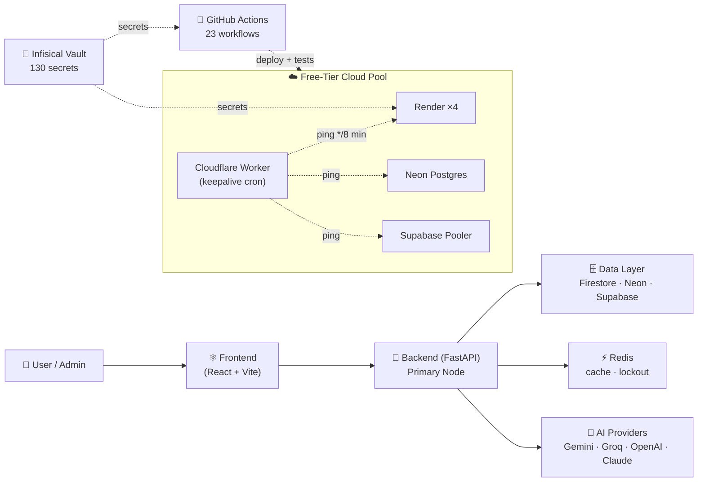
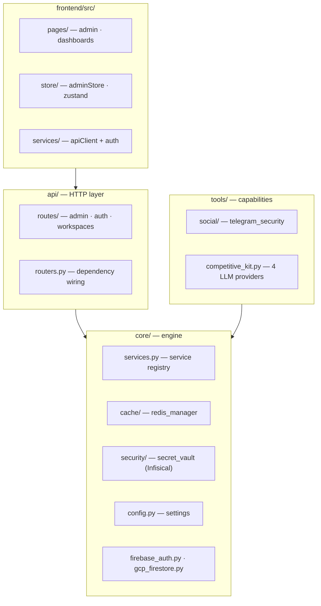
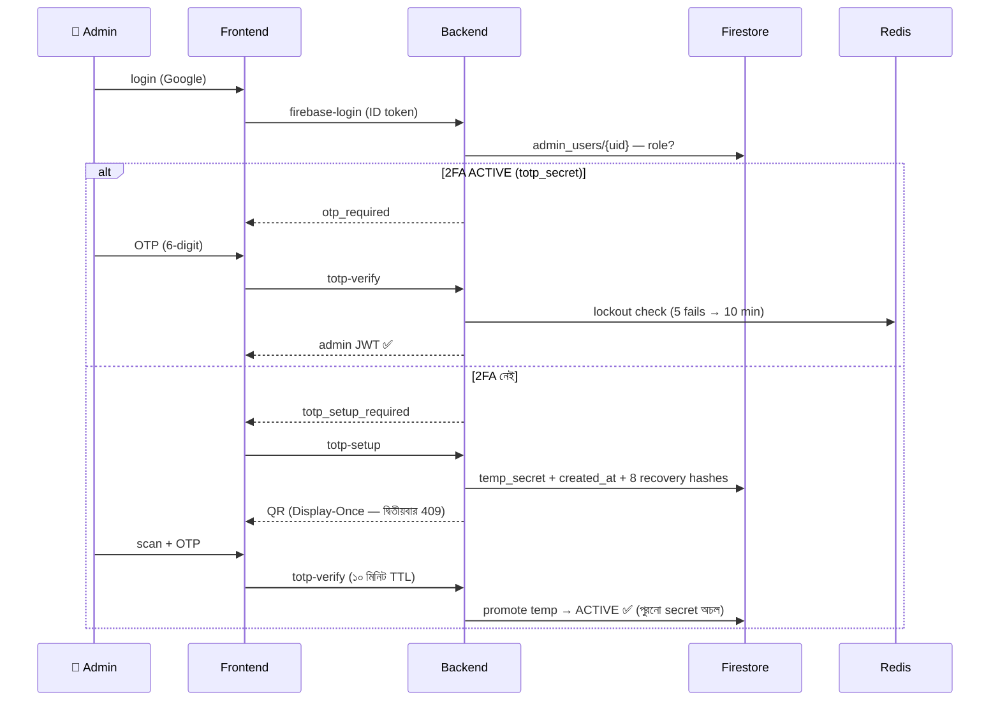
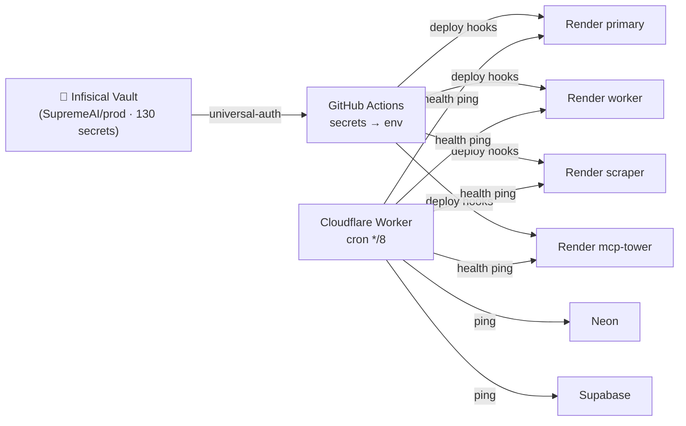

# ARCH-06 — Modules & 3rd-Party Providers Map (Diagram-First)

> **উদ্দেশ্য:** পুরো SupremeAI সিস্টেমের মডিউল ও প্রতিটি 3rd-party provider-এর কাজ **এক নজরে** বোঝা।
> **উৎস:** `docs/generated/module_capability_matrix.json` (194 modules), `backend/core/competitive_kit.py`, `infrastructure/wrangler.toml`, `.github/workflows/`, `scripts/deploy/`

## 1️⃣ পুরো সিস্টেম — এক নজরে

## 2️⃣ Backend Module Domains (194 modules)

**স্ট্যাটাস (module_capability_matrix):** 127 operational · 63 partially-wired · 3 env-dependent · 1 broken — বিস্তারিত `MODULES_LIST.md`।

## 3️⃣ 3rd-Party Providers — কে কী করে

| Provider | কাজ | কোথায় ব্যবহৃত | Key config |
|---|---|---|---|
| **Render** ×4 | হোস্টিং: primary API · worker · scraper · MCP-tower | 4 আলাদা অ্যাকাউন্ট pool (free-tier) | `RENDER_API_KEY_1..4` |
| **Cloudflare Workers** | `supremeai-worker` — cron `*/8` মিনিটে 4 Render + Neon + Supabase জিইয়ে রাখে (sleep ঠেকায়) | `infrastructure/wrangler.toml` | `[triggers] crons` |
| **Firebase Auth** | Admin/user identity (ID token) | `core/firebase_auth.py` | Firebase Admin SDK |
| **Firestore** | Admin users, TOTP state (`totp_secret`, `temp_totp_created_at`, recovery hashes), app data | `core/gcp_firestore.py` | `admin_users/{uid}` |
| **Redis** | Cache + TOTP brute-force lockout (5 → 10 min) + trusted browsers | `core/cache/redis_manager.py` | `REDIS_URL` |
| **Neon Postgres** | Primary relational DB (writer) | `DATABASE_URL` / warmup ping | keepalive PR #824 |
| **Supabase** | DB pooler (writer pool) | `SUPABASE_DATABASE_URL_POOLER/WRITER` | keepalive PR #827 |
| **Infisical** | Secrets vault — 130 secrets (project `SupremeAI`, env prod) | `core/security/secret_vault.py`, CI, `scripts/deploy/` | Universal Auth identity |
| **GitHub Actions** | 23 workflows — CI/CD · PR Helper · deploy · keepalive · audit | `.github/workflows/` | Admin PAT (vault) |
| **Gemini / Groq / OpenAI / Claude** | LLM capability pool (competitive router) | `core/competitive_kit.py` `PROVIDERS` | free-tier limits |

## 4️⃣ Admin Auth Flow — Firebase + TOTP State-Lock (PR #829)

**State rules:** setup → `400` যদি ACTIVE থাকে (re-enroll = recovery code) · pending ১০ মিনিটে মরে · production-এ env fallback secret **fail-closed**।

## 5️⃣ Secrets & Keepalive Flow

## 6️⃣ CI Workflow Family (গুরুত্বপূর্ণগুলো)

| Workflow / Runbook | কাজ |
|---|---|
| `ci.yml` | Main gate — dynamic backend matrix, coverage, security |
| `pr-helper.yml` | **5-Step PR lifecycle** (দেখুন [`OPS-05-PR-HELPER-LIFECYCLE.md`](OPS-05-PR-HELPER-LIFECYCLE.md)) |
| Multi-Agent Lifecycle | **Ephemeral branching & mutex locking** (দেখুন [`OPS-06-MULTI-AGENT-BRANCHING-LIFECYCLE.md`](OPS-06-MULTI-AGENT-BRANCHING-LIFECYCLE.md)) |
| External AI Dev Lifecycle | **বাহ্যিক কোডিং এআই ডেভেলপমেন্ট প্রটোকল** (দেখুন [`OPS-07-DEVELOPER-AGENT-LIFECYCLE.md`](OPS-07-DEVELOPER-AGENT-LIFECYCLE.md)) |
| SupremeAI Runtime Process | **প্ল্যাটফর্মের অভ্যন্তরীণ অটোনোমাস রানটাইম ইঞ্জিন** (দেখুন [`OPS-08-SUPREMEAI-RUNTIME-WORK-PROCESS.md`](OPS-08-SUPREMEAI-RUNTIME-WORK-PROCESS.md)) |
| `ci-doctor.yml` | Reusable failure-engine — CI ব্যর্থতার রুট কারণ বের করে |
| `audit-release.yml` | Release center (⚠️ `cancel-in-progress` fix pending) |
| `keepalive/08/09-*` | Pre-deploy preflight + post-deploy smoke |
| `dast-zap.yml` | DAST security scan |

## 🔧 কাস্টমাইজ করা

- নতুন provider যোগ: `core/competitive_kit.py` → `PROVIDERS` dict + env key + এই টেবিলে সারি।
- মডিউল ম্যাট্রিক্স regenerate: `docs/generated/` scripts দেখুন।
