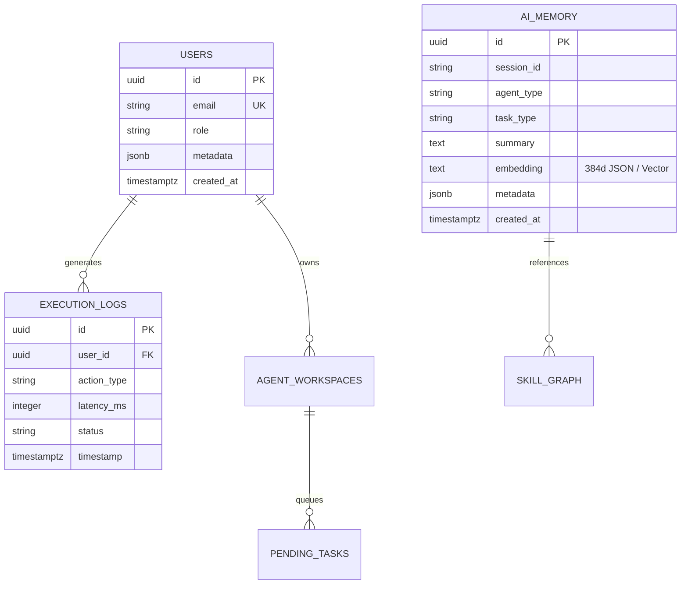

<!-- ============================================================ -->
<!-- Merged Source: docs/05-backend.md -->
<!-- ============================================================ -->

# 05 — Backend

The backend (`backend/`) is a Poetry project named `supremeai-backend` v2.0.0 — "SupremeAI 2.0 Backend - Autonomous AI Agent Platform". It is a modular FastAPI monolith that can split into role-scoped services via `SUPREMEAI_SERVICE_ROLE`.

## Entry Point & Boot

`backend/main.py` does the environment bootstrap **before any heavy import** (detects `RENDER` → forces `ENV=production`), installs the intelligent silent catcher, registers SIGTERM/SIGINT handlers that defer to uvicorn teardown, and calls `run_server()` → `uvicorn.run("core.app:app", ...)`. Reload is enabled only when `settings.env == "local"`; production **exits if `UVICORN_WORKERS > 1`** (512 MB constraint). Sentry receives boot failures when `SENTRY_DSN` is set. The `app` object is re-exported lazily via module-level `__getattr__` to avoid building the app twice at import time.

## Module Map (verified file counts)

| Module | Files | Purpose |
|--------|-------|---------|
| `core/` | 352 | The heart: config, middleware, security, orchestration, LLM gateway, agents, cache, queue, messaging, resilience, self-evolution, observability, plugins, skills, RAG, telemetry, storage, automation |
| `tests/` | 376 | Pytest suite (api, core, agents, brain, e2e, integration, security, load, llm, rag, orchestration, p2p…) |
| `api/` | 139 | ~115 route modules under `api/routes/`, central registry `api/routers.py`, `api/deps.py`, `api/middleware.py` |
| `tools/` | 123 | Agent tool library: `code/`, `media/`, `mcp/`, `browser/`, `devops/`, `knowledge/`, `learning/`, `social/`, `security_tools/`, `localization/`, `billing/`, `analytics/`, `creative/`, `ai_agents/` |
| `services/` | 62 | Domain services + microservices `scraper/`, `browser/`, `worker/` (each with own Dockerfile) + `dynamic_ai/`, `llm/`, `hitl/`, `ide_trio/`, `storage/`, `email/`, `billing/`, `ingestion/` |
| `agents/` | 47 | `SentinelAgent`, `InsightMage`, `VulnerabilityProphet`, `PerformanceGuardian`, `SkillLibrarian`, `MorphicAdapter`, `autonomous_agent.py`, `base_pydantic_agent.py` + subpackages (domain, devops, governance, ide, monitoring, infrastructure, evolution_agents, syncguard) |
| `core/tests` + `pyerrorfix/` | 37 | Standalone Python error-detection / auto-fix engine (CI + library) |
| `models/` | 35 | SQLAlchemy 2.0 async ORM models |
| `alembic_migrations/` | 22 | Alembic env + versions |
| `brain/` | 22 | `model_router.py`, `model_registry.py`, `cognitive_router.py`, `expert_router.py`, `reasoning_orchestrator.py`, `task_execution_engine.py`, `supreme_learning_engine.py`, `user_digital_twin.py` |
| `adaptive_engine/` | 18 | Self-improving platform adaptation: registry, learning loop, approval workflow, Supabase vector backend |
| `ecosystem/` | 17 | Phase 2–14 orchestration on a shared SQLite store: `task_engine`, `capability_registry`, `governance`, `mcp_skeleton`, `learning_loop`, `approval_workflow` |
| `engine/` | 16 | Reasoning engines: `smart_router.py`, `tree_of_thought.py`, `debate_engine.py`, `self_reflection.py`, `vector_db.py`, `worker_node.py`, `compression/token_juice.py` |
| `memory/` | 16 | `unified_db_manager.py`, `episodic_memory.py`, `long_term_memory.py`, `chromadb_store.py`, `supabase_store.py`, `rag_pipeline.py`, `sliding_window.py`, own `mcp_server.py` |
| `database/` | 23 | `session.py` (async engine), `supabase_client.py` (`db` singleton), `pgbouncer_pool.py`, `multi_db_router.py`, `tenant_db.py`, 14 raw-SQL migrations |
| `evolution/` | 12 | Re-exports `core.self_evolution` + `advanced_evolution_engine.py`, `canary_manager.py`, `fitness_evaluator.py`, `benchmark_runner.py` |
| `learning/` | 8 | Continual learning: `experience.py`, `pattern_recognizer.py`, `hypothesis_engine.py`, `outcome_analyzer.py`, `evolution_bridge.py` |
| `middleware/` | 8 | `rate_limiter.py`, `idempotency_middleware.py`, `chaos_injector.py`, `anti_hacking.py`, `cors_policy.py`, `tenant_rate_limiter.py` |
| `monitoring/` | 8 | `init_observability`, `metrics.py`, `causal_debugger.py`, `behavioral_guard.py`, `log_batcher.py` |
| `integrations/` | 7 | Flag-guarded adapters: mem0, Graphiti, browser-use, E2B, OpenHands |
| `browser/` | 5 | `AutonomousBrowserAgent`, `SwarmBrowser`, `SemanticDOM`, `VisionGrounding`, `BrowsingMemory` |
| Others | 1–29 each | `skills/`, `config/` (JSON policies), `sandbox/`, `pipelines/`, `scout/`, `byoc/`, `p2p/`, `ws/` (`command_center.py`), `workers/` (Celery), `admin/`, `adapters/`, `runtime/`, `verification/`, `scaling/`, `storage/`, `scripts/` |

## Router Registry & Role Filtering

`api/routers.py` holds a declarative `ALL_ROUTERS` list (~90 entries with `{path, prefix, is_admin, is_critical}`). Registration is **role-filtered**: `monolith` loads everything; `core` skips scraper/browser routes; `scraper` loads only scraper/browser + health; `worker` loads only health. Admin routers automatically get `Depends(get_current_user_token)`. The BYOC router only registers when `ENCRYPTION_KEY` is present. Tier-S routes (`api/routes/tier_s_routes.py`) register 12 additional routers (share, reasoning, artifacts, chat-upload, slash-commands, chat-search, chat-export, global-memory, prompt-templates, branch-conversations, scheduled-tasks, deep-research).

Full endpoint inventory: see [07 — API Reference](07-api-reference.md).

## Key Subsystems

### LLM Gateway (`core/llm/llm_gateway.py`)
Lazy-imports **litellm** (deferred to protect boot memory). Per-call API keys (never injected into `os.environ`), semantic cache, fallback chain, `CostGuard`, shared circuit-breaker manager, Langfuse tracing, and routing from `config/routing_policy.json`. `TASK_MODEL_MAP` defaults: coding → `groq/llama-3.3-70b-versatile`; reasoning → `openrouter/meta-llama/llama-3.3-70b-instruct`; vision/chat/general → `gemini/gemini-2.0-flash`. Provider classes in `services/llm/providers.py` are `BaseOpenAICompatibleProvider` subclasses with SSE parsing, `@circuit_breaker` and `@timed` metrics.

### Orchestration (`core/orchestration/orchestrator.py`)
A periodic `tick()` (via `asyncio.TaskGroup`) runs fitness scoring, the `SelfEvolutionAgent` tick, and the **budget guardian subprocess** (`scripts/orchestrator/auto_budget_guardian.py`) — a guardian failure halts the orchestrator (fail-closed on cost). Intent decomposition (`decompose_intent()`) + `execute_skill_chain()` operate over the `EvolutionSkillGraph` with edge-weight feedback and compensation fallbacks. Siblings: `agent_orchestrator.py`, `master_cognitive_orchestrator.py`, `swarm_orchestrator.py`, `trio_pipeline.py`, `crew_departments.py`, `cloud_sandbox_orchestrator.py`. Exposes `/orchestrator/status` and `POST /orchestrator/tick` (Cloud Scheduler webhook target).

### Agent Framework
- `agents/base_pydantic_agent.py` wraps **pydantic-ai `Agent`** (default model `openai:gpt-4o`) wired to the LLM gateway and `MCPRegistryClient` with dynamic MCP tool registration.
- `core/agents/framework/`: `SupremeOrchestrator` (LangGraph-style), `SupremeCrew` (CrewAI pattern), `AgentDepartment` with `CodingAgent`/`ReviewAgent`/`QAAgent`.
- `core/agent_registry.json`: declarative agent specs (system prompt, tools, permissions, temperature, resource constraints like `max_tokens_per_task`, `max_api_calls_per_hour`).
- `core/agent_factory.py` + `core/agent_supervisor.py` handle creation and supervision.

### Background Work & Queues
Celery app lives in `core/queue/task_queue_enhanced.py` (re-exported by `workers/celery_app.py`). On Render free tier, `worker_service.py` is a FastAPI HTTP wrapper on `$PORT` that supervises a Celery subprocess best-effort and reports **degraded** status when Celery/Redis are absent — honesty over green checks. Queue backend priority: `asyncio → redis → celery → pubsub`; messaging adapters exist for GCP Pub/Sub, Upstash Redis and NATS (`core/messaging/`).

### Microservices (`services/`)
| Service | Entry | Role |
|---------|-------|------|
| `services/scraper/` | FastAPI `main.py` (:8082) | `GET /health`, `POST /scrape|/browse|/recipe` — Playwright/Chromium isolated from the core image |
| `services/browser/` | aiohttp app | Browser automation microservice |
| `services/worker/` | Redis-queue consumer | Needs `CORE_API_URL` in production |

Each has its own `Dockerfile` and `requirements.txt`; CI publishes scraper/worker images separately (worker image = core image digest re-tagged).

### Sandbox & BYOC
`backend/sandbox/` (`docker_sandbox.py`, `file_isolation_gate.py`) plus gVisor/Firecracker hooks via env paths; `backend/byoc/` ("Bring Your Own Cloud": `cloud_connector`, `resource_manager`, `container_orchestrator`) exposes `/api/byoc/credentials|deploy|status/{job_id}` gated on `ENCRYPTION_KEY`, with limits in `config/byoc_limits.json`.

## Dependencies (verified from `pyproject.toml`)

Core stack: `fastapi ^0.136.0`, `uvicorn[standard] ^0.51.0`, `pydantic ^2.10.0`, `pydantic-settings ^2.14.2`, `sqlalchemy ^2.0.36`, `alembic ^1.14.0`, `asyncpg ^0.30.0`, `psycopg2-binary ^2.9.9`, `aiosqlite ^0.20.0`, `redis[hiredis] ^5.2.0`, `httpx ^0.28.1`. AI: `openai >=1.54.0`, `anthropic ^0.120.0`, `litellm >=1.84.0,<2.0.0`, `pydantic-ai ^2.31.0`, `mcp ^1.28.1`. Data/vector: `supabase ^2.11.0`, `qdrant-client ^1.12.1`, `neo4j ^6.2.0`. Platform: `stripe ^15.3.1`, `firebase-admin ^6.5.0`, `pyjwt[crypto] ^2.10.1`, `docker ^7.1.0`, `infisical-python 2.3.5`, `pybreaker ^1.4.1`. Observability: `prometheus-client ^0.26.0`, `opentelemetry-sdk ^1.44.0`, `langfuse ^4.14.4`, `posthog ^7.29.0`, `loguru ^0.7.3`, `sse-starlette ^2.1.3`. Optional groups: `browser` (playwright ^1.62.0), `ml` (torch ^2.5.0, sentence-transformers ^3.3.0, pandas, plotly, scipy).

## Observability

- **Sentry** initialized in `app_builder._init_sentry` (boot failures + runtime errors).
- **OpenTelemetry**: `FastAPIInstrumentor.instrument_app(app)` with OTLP gRPC exporter.
- **Prometheus**: `GET /metrics` registered when `MONITORING_DETAILED`; scrape config in `infrastructure/monitoring/prometheus/`.
- **Langfuse** on every LLM call through the gateway; **PostHog** product analytics.
- **Health checks**: `database` (async `SELECT 1`) and `memory` (psutil < 90%) registered at startup; global exception handler includes open circuit-breaker states.
- **Auto-healer**: `services.auto_healer.get_healer().start_monitoring()` when `AUTO_HEALING_ENABLED`.


<!-- ============================================================ -->
<!-- Merged Source: docs/07-api-reference.md -->
<!-- ============================================================ -->

# 07 — API Reference

The authoritative machine-readable contract is the checked-in **`backend/openapi.json`** (title *SupremeAI 2.0*): **398 paths** — 198 under `/api`, 96 under `/api/v1`, 54 unprefixed, 38 under `/admin-api`, 7 under `/admin`, 5 under `/health`. Live docs: `/docs` (Swagger) and `/redoc` when the server runs. This page groups the surface by domain with real paths; it is a map, not an exhaustive dump.

## Authentication Model

- **User auth**: JWT bearer tokens from `/api/v1/auth/*` — the React app sends `Authorization: Bearer <token>` plus `X-CSRF-Token` and a device-fingerprint header (`frontend/src/services/apiClient.ts`).
- **Admin auth**: Firebase login (`POST /api/admin/firebase-login`) → OTP/TOTP step-up → admin JWT (`supreme_admin_jwt` client-side); every `/admin-api/*` and `/admin/*` router is registered with `Depends(get_current_user_token)` (`api/routers.py`).
- **API keys**: `APIKeyAuthMiddleware` + `api_key_limiter` for machine clients; WebSocket endpoints authenticate within a strict window (`WS_AUTH_WINDOW_SECONDS`) with attempt caps.
- **Test bypasses** (`ALLOW_TEST_AUTH_BYPASS`, `ALLOW_TEST_ORIGIN_BYPASS`) are hard-disabled in production.

## Health & Meta

| Method & Path | Purpose |
|---|---|
| `GET /` | Welcome payload |
| `GET /health`, `/health/live`, `/health/ready`, `/health/full`, `/health/aggregated` | Liveness/readiness/deep checks (also mounted under `/api/v1/health`) |
| `GET /api/v1/health/live` | **Docker HEALTHCHECK + keep-alive ping target** |
| `GET /metrics` | Prometheus (when `MONITORING_DETAILED`) |
| `GET /api/v1/openapi.json` | OpenAPI schema |
| `GET /health/aggregated` | `health_checker.check_all()` — DB + memory + circuit breakers |
| `GET /admin/free-tier-status` | Free-tier resource posture (from `core/admin_routes.py`) |

## Auth (`api/routes/auth.py`, prefix `/api/v1/auth`)

`POST /login` · `POST /register` · `POST /refresh` · `POST /logout` · `GET /me` · `GET /verify`. Role resolution happens server-side only — the frontend's `authStore` trusts `/api/v1/auth/*` responses, never client-side role guessing.

## Chat, Tasks & Streaming

| Endpoint | Notes |
|---|---|
| `POST /api/chat/completion` | Blocking completion |
| `POST /api/chat/stream` | **Primary chat path** — SSE stream (`data:` chunks, `[DONE]` sentinel); consumed by both `chatService.ts` and `useChat.ts` |
| `WS /ws/chat` | "Neural Engine Stream" websocket with SSE shim `stream_chat_sse` |
| `POST /api/task/execute` · `GET /api/task/stream` | Task execution + SSE task stream |
| `WS /ws/command-center` | Command-center channel (`ws/command_center.py`) |
| `WS /ws/hitl` (+ SSE shim) | Human-in-the-loop approvals |
| `WS /voice` (+ SSE shim) | Voice sessions |
| `WS /agent/terminal-stream` | Agent terminal output |
| `WS /ws/dashboard`, `/ws/session/{id}/takeover`, `/dashboard`, `/health-stream` | Admin/ops realtime |

## Agents & Orchestration

`GET /api/agents/` (list) · `POST /api/agents/research/search|summarize|cite` · `POST /api/v1/agent/execute` · `POST /api/v1/agent/action` · `GET /orchestrator/status` · `POST /orchestrator/tick` (Cloud Scheduler webhook) · swarm/trio pipeline endpoints backing the VS Code extension's `POST {swarmBackendUrl}/api/v1/ide-trio/execute` (Gemini → Kilo → Cline chain).

## Knowledge, Memory & Skills

`POST /api/knowledge/ask|ask-scribe|search|seed` · `POST /api/memory/checkpoint` · `GET /api/memory/conversations` · `POST /unified-memory/long-term/store` · `POST /unified-memory/long-term/query` · `GET /api/skills/catalog`. Backed by pgvector (`ai_memory` table), ChromaDB, and the RAG pipeline (`memory/rag_pipeline.py`).

## Billing & Payments

`GET /api/billing/plans` · `POST /api/billing/checkout` · `GET /api/billing/history` · `POST /api/billing/add-funds` · `POST /api/billing/webhook/stripe` · `POST /api/billing/webhook/sslcommerz` · `POST /payments/checkout|webhook`. Stripe idempotency is enforced (per recent hardening commit); `user_wallets` + `transaction_ledger` tables underpin balances.

## Dev Tooling

`POST /github/connect|discover|implement|push` (GitHub automation) · `/api/ci/*` (+ `CI` webhook receivers) · `POST /tools/image-to-code` · `/api/deep-research/*` · `POST /api/tts/synthesize` · `GET /api/v1/media/generate-upload-url` (R2 pre-signed uploads). Infra webhooks: `n8n_webhooks`, `cdc_webhooks`, `webhooks_ai`.

## BYOC (gated on `ENCRYPTION_KEY`)

`POST /api/byoc/credentials` · `POST /api/byoc/deploy` · `GET /api/byoc/status/{job_id}` — bring-your-own-cloud deploys via `byoc/` (cloud connector, resource manager, container orchestrator), limits in `backend/config/byoc_limits.json`.

## LLM Gateway Admin

`GET /llm-gateway/health` · `GET /llm-gateway/admin/gateway/state` · `POST /llm-gateway/admin/circuit-breaker/reset/{name}` — operational control of the litellm gateway, its cache and breakers.

## Admin API (`/admin-api/*`, 38 paths)

User management (`/users` list/create/delete), backups, costs, feature flags, model router control, swarm control, deploy gate + emergency deploy, health map, audit logs, consent matrix. Consumed by `frontend/src/services/adminService.ts`, `useAdminApi` hooks and the AETHEL Command Center.

Representative panels → endpoints mapping lives in `frontend/src/components/admin/` and `src/commandcenter/data/hooks.ts` (React Query: `useMetrics` 15 s refresh, `useHealthMap` 45 s).

## Tier-S Feature Routes (`api/routes/tier_s_routes.py`)

| Tier | Feature | Router |
|------|---------|--------|
| S1 | Share conversations | `share` |
| S2 | Reasoning steps | `reasoning` |
| S3 | Artifacts | `artifacts` |
| S4 | Chat image upload | `chat-upload` |
| S5 | Slash commands | `slash-commands` |
| S6 | Chat search | `chat-search` |
| S7 | Chat export | `chat-export` |
| S8 | Global memory | `global-memory` |
| S9 | Prompt templates | `prompt-templates` |
| S10 | Branch conversations | `branch-conversations` |
| S11 | Scheduled tasks | `scheduled-tasks` |
| S12 | Deep research | `deep-research` |

## Core Admin Routes (boot-mounted)

From `core/admin_routes.py`: `POST /api/admin/firebase-login`, `GET /admin/free-tier-status`, plus platform ops endpoints. Memory-aware middleware (`core/memory_manager.py`) protects the process under free-tier pressure.

## Cross-Cutting Response & Error Contract

- `ResponseStandardizationMiddleware` normalizes success/error envelopes; the shared `ApiResponse<T>` zod schema in `packages/shared-types/src/conversation.ts` (`{ success, data?, error{code,message,details?}, requestId? }`) mirrors it.
- The global exception handler **includes open circuit-breaker states** in error payloads so clients can see degraded dependencies.
- Idempotency middleware (`IdempotencyMiddleware`) plus the `add_idempotency` migration protect POST replays.
- Rate limiting is Redis-backed with a simplified local fallback (`RATE_LIMIT_USE_SIMPLIFIED` forced off in production).

## Versioning

Routes are grouped under `/api` (current) and `/api/v1` (versioned subset — auth, health, media, telemetry). The registry in `api/routers.py` is the single place a new router is attached; `scripts/ci/validate_router_imports.py` (pre-commit `router-smoke-test`) fails fast on dead imports, and `scripts/advanced_analysis/orphan_route_finder.py` flags routes no client calls.


<!-- ============================================================ -->
<!-- Merged Source: docs/api/versioning/API_VERSIONING_STRATEGY.md -->
<!-- ============================================================ -->

# SupremeAI - API Versioning Strategy
## Production-Ready Versioning Guidelines

---

## Table of Contents

1. [Versioning Philosophy](#versioning-philosophy)
2. [Versioning Scheme](#versioning-scheme)
3. [URL Structure](#url-structure)
4. [Version Lifecycle](#version-lifecycle)
5. [Deprecation Process](#deprecation-process)
6. [Breaking vs Non-Breaking Changes](#breaking-vs-non-breaking-changes)
7. [Implementation Guide](#implementation-guide)
8. [Client Migration Path](#client-migration-path)

---

## Versioning Philosophy

SupremeAI follows **semantic versioning** principles adapted for REST APIs:

- **MAJOR version**: Breaking changes (v1 → v2)
- **MINOR version**: New features, backward compatible (within major version via feature flags)
- **PATCH version**: Bug fixes (transparent to clients)

### Core Principles

1. **Backward Compatibility**: New versions must not break existing clients
2. **Clear Communication**: Deprecation warnings 6+ months before removal
3. **Grace Period**: Support old versions for at least 12 months after deprecation
4. **Documentation**: All versions documented with migration guides

---

## Versioning Scheme

### URL-Based Versioning (Primary Method)

```
Base URL: https://api.supremeai.com/api/v{major_version}/
```

**Examples:**
```bash
# v1 (Current Stable)
GET /api/v1/agents
POST /api/v1/conversations/{id}/messages

# v2 (Future)
GET /api/v2/agents
POST /api/v2/conversations/{id}/messages
```

### Why URL-Based Over Other Methods?

| Method | Pros | Cons | SupremeAI Choice |
|--------|------|------|------------------|
| **URL Path** | Clear, cacheable, proxy-friendly | URL changes | ✅ **PRIMARY** |
| Header | Clean URLs | Harder to debug, caching issues | ❌ |
| Query Param | Simple | Not cacheable, messy | ❌ |
| Content Negotiation | Flexible | Complex implementation | ❌ |

---

## URL Structure

### Complete URL Pattern

```
https://{environment}.supremeapi.com/api/v{version}/{resource}/{identifier}/{sub-resource}
```

### Resource Naming Conventions

| Convention | Rule | Example |
|------------|------|---------|
| **Nouns only** | Use nouns, not verbs | `/agents` not `/getAgents` |
| **Plural** | Collections are plural | `/agents`, `/conversations` |
| **kebab-case** | Multi-word resources | `/hitl-approvals` not `/hitlApprovals` |
| **Lowercase** | Always lowercase | `/api-keys` not `/API_Keys` |

### Endpoint Categories by Domain

#### Authentication & Users (`/auth`, `/users`)
```bash
POST   /api/v1/auth/register
POST   /api/v1/auth/login
POST   /api/v1/auth/refresh
POST   /api/v1/auth/logout
GET    /api/v1/auth/me
PUT    /api/v1/users/{id}
DELETE /api/v1/users/{id}
```

#### Agents (`/agents`)
```bash
GET    /api/v1/agents                    # List agents
POST   /api/v1/agents                    # Create agent
GET    /api/v1/agents/{id}               # Get agent details
PUT    /api/v1/agents/{id}               # Update agent
DELETE /api/v1/agents/{id}               # Delete agent
POST   /api/v1/agents/{id}/activate      # Activate agent
POST   /api/v1/agents/{id}/pause         # Pause agent
GET    /api/v1/agents/{id}/stats         # Agent statistics
GET    /api/v1/agents/{id}/config        # Get configuration
PUT    /api/v1/agents/{id}/config        # Update configuration
```

#### Conversations (`/conversations`)
```bash
GET    /api/v1/conversations             # List conversations
POST   /api/v1/conversations             # Create conversation
GET    /api/v1/conversations/{id}        # Get conversation
DELETE /api/v1/conversations/{id}        # Delete conversation
POST   /api/v1/conversations/{id}/messages     # Send message
GET    /api/v1/conversations/{id}/messages      # Get messages
PUT    /api/v1/conversations/{id}/title         # Update title
POST   /api/v1/conversations/{id}/summarize     # Trigger summary
```

#### Memory Service (`/memory`)
```bash
POST   /api/v1/memory/store              # Store memory
GET    /api/v1/memory/search             # Semantic search
DELETE /api/v1/memory/{id}               # Delete memory
GET    /api/v1/memory/stats              # Memory statistics
POST   /api/v1/memory/import             # Bulk import
GET    /api/v1/memory/export             # Export memories
```

#### HITL Engine (`/hitl`)
```bash
GET    /api/v1/hitl/approvals            # List pending approvals
GET    /api/v1/hitl/approvals/{id}       # Get approval detail
POST   /api/v1/hitl/approvals/{id}/approve    # Approve request
POST   /api/v1/hitl/approvals/{id}/reject     # Reject request
POST   /api/v1/hitl/approvals/{id}/escalate   # Escalate request
GET    /api/v1/hitl/my-approvals         # My pending reviews
GET    /api/v1/hitl/stats                # HITL statistics
```

#### Tool Execution (`/tools`)
```bash
GET    /api/v1/tools                     # Available tools
GET    /api/v1/tools/{name}              # Tool schema
POST   /api/v1/tools/{name}/execute      # Execute tool
GET    /api/v1/tools/executions          # Execution history
GET    /api/v1/tools/executions/{id}     # Execution detail
```

#### Admin Endpoints (`/admin`)
```bash
GET    /api/v1/admin/users               # User management
GET    /api/v1/admin/stats               # Platform statistics
GET    /api/v1/admin/audit-logs          # Audit trail
POST   /api/v1/admin/maintenance         # Maintenance mode
GET    /api/v1/admin/health              # Health check
```

---

## Version Lifecycle

### Version States

```
┌──────────┐    ┌───────────┐    ┌────────────┐    ┌──────────┐
│  ALPHA   │───►│   BETA    │───►│  STABLE    │───►│DEPRECATED│
│ (dev)    │    │ (testing) │    │(production)│    │ (sunset) │
└──────────┘    └───────────┘    └────────────┘    └──────────┘
                      │                                  │
                      ▼                                  ▼
                 ┌──────────┐                    ┌──────────┐
                 │  CANARY  │                    │RETIRED   │
                 │ (limited)│                    │(removed) │
                 └──────────┘                    └──────────┘
```

### Timeline Example: v1 Lifecycle

| Phase | Date | Status | Notes |
|-------|------|--------|-------|
| Alpha | Jan 2024 | Internal testing | Feature development |
| Beta | Mar 2024 | Early adopters | Limited rollout |
| Stable | Jun 2024 | General availability | Full production support |
| Deprecated | Dec 2025 | No new users | Migration required |
| Retired | Jun 2026 | Removed | End of life |

---

## Deprecation Process

### Deprecation Headers

When an endpoint is deprecated, include these headers:

```http
HTTP/1.1 200 OK
Content-Type: application/json
Deprecation: true
Sunset: Sat, 01 Jun 2026 00:00:00 GMT
Link: </api/v2/agents>; rel="successor-version"
```

### Response Body for Deprecated Endpoints

```json
{
  "data": { ... },
  "deprecation_notice": {
    "deprecated": true,
    "deprecated_since": "2025-01-01",
    "sunset_date": "2026-06-01",
    "migration_guide": "https://docs.supremeai.com/migration-v1-to-v2",
    "successor_endpoint": "/api/v2/agents"
  }
}
```

### Deprecation Timeline

| Phase | Duration | Actions |
|-------|----------|---------|
| **Announcement** | Day 0 | Blog post, email, changelog |
| **Warning Period** | 0-6 months | Headers + response warnings |
| **Soft Enforcement** | 6-9 months | Rate limiting on old version |
| **Hard Enforcement** | 9-12 months | Errors pointing to new version |
| **Removal** | 12+ months | Endpoint returns 410 Gone |

---

## Breaking vs Non-Breaking Changes

### Non-Breaking Changes (Same Version)

These changes do NOT require a new major version:

✅ **Adding** new endpoints  
✅ **Adding** optional request parameters  
✅ **Adding** new response fields  
✅ **Adding** new enum values  
✅ **Changing** error messages  
✅ **Fixing** bugs that return correct data  

### Breaking Changes (Require New Major Version)

These changes DO require a new major version:

❌ **Removing** or renaming endpoints  
❌ **Removing** or renaming request/response fields  
❌ **Changing** field types  
❌ **Making** optional fields required  
❌ **Changing** authentication method  
❌ **Changing** error response format  
❌ **Changing** pagination structure  
❌ **Removing** enum values  

---

## Implementation Guide

### FastAPI Router Setup

```python
# app/api/v1/router.py
from fastapi import APIRouter

router = APIRouter(
    prefix="/api/v1",
    tags=["v1"],
    deprecated=False,  # Set True when deprecating this version
)

# Import and include sub-routers
from app.api.v1.endpoints import auth, agents, conversations, memory, hitl

router.include_router(auth.router, prefix="/auth", tags=["authentication"])
router.include_router(agents.router, prefix="/agents", tags=["agents"])
router.include_router(conversations.router, prefix="/conversations", tags=["conversations"])
router.include_router(memory.router, prefix="/memory", tags=["memory"])
router.include_router(hitl.router, prefix="/hitl", tags=["hitl"])

# Version-specific middleware
@router.middleware("http")
async def add_version_headers(request: Request, call_next):
    response = await call_next(request)
    response.headers["X-API-Version"] = "v1"
    response.headers["X-API-Support-Until"] = "2026-06-01"
    return response
```

### Version Detection Middleware

```python
# app/middleware/version.py
from fastapi import Request, Response
from starlette.middleware.base import BaseHTTPMiddleware
import logging

logger = logging.getLogger(__name__)

SUPPORTED_VERSIONS = {
    "v1": {"status": "stable", "deprecated": False},
    "v2": {"status": "beta", "deprecated": False},
}

class VersionMiddleware(BaseHTTPMiddleware):
    async def dispatch(self, request: Request, call_next):
        # Extract version from path
        path_parts = request.url.path.split("/")
        
        # Find version segment (e.g., 'v1', 'v2')
        api_index = None
        for i, part in enumerate(path_parts):
            if part == "api" and i + 1 < len(path_parts):
                api_index = i + 1
                break
        
        if api_index:
            version = path_parts[api_index]
            
            if version not in SUPPORTED_VERSIONS:
                return JSONResponse(
                    status_code=400,
                    content={
                        "error": {
                            "code": "UNSUPPORTED_API_VERSION",
                            "message": f"API version '{version}' is not supported",
                            "supported_versions": list(SUPPORTED_VERSIONS.keys())
                        }
                    }
                )
            
            version_info = SUPPORTED_VERSIONS[version]
            
            if version_info["deprecated"]:
                logger.warning(f"Deprecated API version used: {version}")
                
            # Add version info to request state for downstream use
            request.state.api_version = version
            request.state.version_status = version_info["status"]
        
        response = await call_next(request)
        return response
```

### Versioned Response Models

```python
# app/schemas/v1/agent.py
from pydantic import BaseModel, Field
from typing import Optional
from datetime import datetime

class AgentResponseV1(BaseModel):
    """V1 Agent Response Schema"""
    
    id: str
    name: str
    type: str
    status: str
    created_at: datetime
    
    class Config:
        json_schema_extra = {
            "example": {
                "id": "uuid-here",
                "name": "Research Assistant",
                "type": "task_agent",
                "status": "active",
                "created_at": "2024-01-15T10:30:00Z"
            }
        }

# V2 might have additional fields
class AgentResponseV2(AgentResponseV1):
    """V2 Agent Response Schema (extends V1)"""
    
    capabilities: list[str] = []
    health_score: Optional[float] = None
    last_execution_summary: Optional[dict] = None
    
    class Config:
        json_schema_extra = {
            "example": {
                "id": "uuid-here",
                "name": "Research Assistant",
                "type": "task_agent",
                "status": "active",
                "created_at": "2024-01-15T10:30:00Z",
                "capabilities": ["web_search", "code_analysis"],
                "health_score": 0.95,
                "last_execution_summary": {
                    "duration_seconds": 12.5,
                    "tokens_used": 1500,
                    "success": True
                }
            }
        }
```

---

## Client Migration Path

### Migration Checklist for Clients

1. **Update Base URL**: Change from `/api/v1/` to `/api/v2/`
2. **Review Breaking Changes**: Check changelog for removed/changed fields
3. **Update Request Models**: Add newly required fields
4. **Update Response Handling**: Handle new response fields
5. **Test in Staging**: Validate against staging environment
6. **Monitor Deprecation Warnings**: Log and address warnings
7. **Plan Cutover**: Schedule migration before hard enforcement

### Client-Side Version Handling

```typescript
// TypeScript example for handling multiple API versions
interface ApiClientConfig {
  baseUrl: string;
  version: 'v1' | 'v2';
  onDeprecated?: (notice: DeprecationNotice) => void;
}

class SupremeAIClient {
  private config: ApiClientConfig;
  
  constructor(config: ApiClientConfig) {
    this.config = config;
  }
  
  async request<T>(endpoint: string, options?: RequestInit): Promise<T> {
    const url = `${this.config.baseUrl}/api/${this.config.version}${endpoint}`;
    
    const response = await fetch(url, {
      ...options,
      headers: {
        'Content-Type': 'application/json',
        'Accept': 'application/json',
        'X-API-Version': this.config.version,
        ...options?.headers,
      },
    });
    
    // Check for deprecation notice
    const deprecation = response.headers.get('Deprecation');
    if (deprecation === 'true' && this.config.onDeprecated) {
      const sunset = response.headers.get('Sunset');
      const successor = response.headers.get('Link')?.match(/<([^>]+)>/)?.[1];
      
      this.config.onDeprecated({
        deprecated: true,
        sunsetDate: sunset || '',
        successorEndpoint: successor || '',
      });
    }
    
    // Handle 410 Gone for retired endpoints
    if (response.status === 410) {
      throw new Error('This API version has been retired. Please upgrade.');
    }
    
    return response.json();
  }
}
```

---

## Quick Reference Card

| Aspect | Decision |
|--------|----------|
| **Versioning Method** | URL Path (`/api/v1/`) |
| **Current Version** | v1 (Stable) |
| **Next Version** | v2 (Beta - Planned) |
| **Deprecation Notice** | `Deprecation` header + response field |
| **Sunset Timeline** | 12+ months after deprecation |
| **Backward Compatibility** | Guaranteed within major version |
| **Documentation** | Per-version docs at `docs.supremeai.com/v1/` |
| **Migration Support** | Guides, SDK updates, grace period |

---

*Document Version: 1.0.0*
*Last Updated: 2024*
*Maintained by: SupremeAI Platform Team*


<!-- ============================================================ -->
<!-- Merged Source: docs/api-database/SUPREME_API_DATABASE_SPEC.md -->
<!-- ============================================================ -->

# 💾 SupremeAI API, Database & Storage Specification

> ⚠️ **HISTORICAL / PARTIALLY SUPERSEDED — DO NOT USE ALONE TO INFER THE LIVE PRODUCTION SCHEMA.**
> This document has drifted from the actual production database (verified 2026-08-30, e.g.
> `ai_memory.embedding` type and several documented tables/columns no longer match production).
> The authoritative, CI-enforced production database contract is:
> **`backend/database/contracts/schema_contract.yaml`**
> (checked live by `scripts/ci/check_database_schema.py`, job `db-schema-check`).
> Update that file — not just this document — when the schema changes.

**Document Version:** 3.0.0 (⚠️ superseded as canonical — see notice above)  
**System Phase:** **Phase 3: Self-Evolving & Multi-Agent Swarm**  
**Classification:** Core API Endpoints, Database Schema & State Contracts

---

## 🎯 1. Core Database Architecture (PostgreSQL + pgvector)

SupremeAI ডাটাবেজ লেয়ারে **PostgreSQL 16+** এবং `pgvector` এক্সটেনশন ব্যবহার করে। একই সাথে হাই-পারফরম্যান্স রিলেশনাল ট্রানজ্যাকশন এবং সিম্যান্টিক ভেক্টর কুয়েরি পরিচালিত হয়।



---

## 🗄️ 2. Core Tables & Indexing Schema

```sql
-- 1. AI Memory Vector Table (pgvector supported)
CREATE TABLE IF NOT EXISTS ai_memory (
    id UUID PRIMARY KEY DEFAULT gen_random_uuid(),
    session_id TEXT,
    agent_type TEXT,
    task_type TEXT,
    summary TEXT,
    embedding TEXT, -- 384-dimensional vector string
    metadata JSONB DEFAULT '{}',
    created_at TIMESTAMPTZ DEFAULT NOW()
);
CREATE INDEX IF NOT EXISTS idx_ai_memory_agent_task ON ai_memory(agent_type, task_type);
CREATE INDEX IF NOT EXISTS idx_ai_memory_metadata_gin ON ai_memory USING GIN(metadata);

-- 2. Pending Tasks Queue Table
CREATE TABLE IF NOT EXISTS pending_tasks (
    id UUID PRIMARY KEY DEFAULT gen_random_uuid(),
    status TEXT NOT NULL DEFAULT 'pending',
    priority INT DEFAULT 0,
    payload JSONB NOT NULL,
    created_at TIMESTAMPTZ DEFAULT NOW()
);
CREATE INDEX IF NOT EXISTS idx_pending_status_time ON pending_tasks(status, created_at);

-- 3. Execution Telemetry Logs (Range Partitioned by Time)
CREATE TABLE IF NOT EXISTS execution_logs (
    id UUID PRIMARY KEY DEFAULT gen_random_uuid(),
    user_id UUID,
    action_type TEXT NOT NULL,
    latency_ms INT,
    status TEXT NOT NULL,
    created_at TIMESTAMPTZ DEFAULT NOW()
);
```

---

## 🌐 3. Core API Endpoint Groups

| Group | Prefix | Key Endpoints | Description |
|---|---|---|---|
| **Auth & Users** | `/api/v1/auth` | `POST /login`, `POST /register`, `GET /me` | JWT auth, session management, RBAC verification. |
| **Agent Swarm** | `/api/v1/agents` | `POST /execute`, `POST /decompose`, `GET /swarm` | Task dispatch to multi-agent swarm, DAG compiler. |
| **Browser Suite** | `/api/browser` | `POST /browse`, `POST /proxy`, `POST /vision-ground` | Live iframe preview, Playwright actions, vision clicks. |
| **Living Engine** | `/api/v1/living` | `POST /reason`, `POST /evolve`, `POST /heal` | 5 reasoning types, genetic skill tuning, auto-healer. |
| **Memory Vector** | `/api/v1/memory` | `POST /query`, `POST /store`, `DELETE /prune` | Semantic vector search across `ai_memory`. |
| **Admin & Health** | `/health`, `/admin-api` | `GET /live`, `GET /ready`, `POST /deploy` | System health score, zero-downtime deploy triggers. |

---

## ⚡ 4. Redis Key Map & TTL Strategy

| Key Pattern | Data Structure | TTL | Purpose |
|---|---|---|---|
| `rate:ip:{ip}` | Integer Counter | 60s | Sliding window rate limiting. |
| `cache:model:{hash}` | JSON String | 3600s | AI prompt response deduplication cache. |
| `stream:events:{channel}` | Stream / PubSub | In-Memory | Real-time SSE / WebSocket event broadcast. |
| `lock:task:{task_id}` | String Flag | 30s | Distributed task execution lock. |

---
*Canonical Master Plan — Supersedes all legacy database and API documentation drafts.*


<!-- ============================================================ -->
<!-- Merged Source: docs/modules_audit/007_backend_services_billing.md -->
<!-- ============================================================ -->

# Module 007: `backend/services/billing`

- **Category:** Backend Core Service
- **Relative Path:** `backend/services/billing`
- **Type:** Directory (প্যাকেজ/সাব-সিস্টেম)
- **Real-Life Status:** Active in Codebase (সক্রিয় ও কোডবেসে ব্যবহৃত)
- **Size / Footprint:** 2 files

---

## ১. মডিউলটির মূল কাজ কী? (What does it do?)
এই মডিউলটি SupremeAI প্ল্যাটফর্মের `Backend Core Service` ডোমেনের অংশ।
- `billing` মূলত সংশ্লিষ্ট সাব-সিস্টেমের স্পেসিফিক কার্যকারিতা সম্পাদন করে।

## ২. কেন এটি বানানো হয়েছিল? (Why was it built?)
- **উদ্দেশ্য:** SupremeAI প্ল্যাটফর্মে Backend Core Service আর্কিটেকচারাল লেয়ারটিকে মডুলার, ডিকাপল্ড ও আইসোলেটেড রাখার উদ্দেশ্যে।
- আর্কিটেকচারাল ক্ল্যাটার দূর করা এবং কোডের পুনঃব্যবহারযোগ্যতা (reusability) বজায় রাখা।

## ৩. রিয়েল লাইফে এটি কাজ করে কি না? (Does it actually work in real life?)
- **স্ট্যাটাস:** Active in Codebase (সক্রিয় ও কোডবেসে ব্যবহৃত)
- **বাস্তব ব্যবহার ও মূল্যায়ন:**
  - ফাইল বা ডিরেক্টরিটি লোকাল ডিস্কে বিদ্যমান রয়েছে।
  - সিস্টেমের কোর লজিক বা ক্লায়েন্ট ইন্টারেকশনে সরাসরি ব্যবহৃত হচ্ছে।


<!-- ============================================================ -->
<!-- Merged Source: docs/modules_audit/008_backend_services_browser.md -->
<!-- ============================================================ -->

# Module 008: `backend/services/browser`

- **Category:** Backend Core Service
- **Relative Path:** `backend/services/browser`
- **Type:** Directory (প্যাকেজ/সাব-সিস্টেম)
- **Real-Life Status:** Active in Codebase (সক্রিয় ও কোডবেসে ব্যবহৃত)
- **Size / Footprint:** 3 files

---

## ১. মডিউলটির মূল কাজ কী? (What does it do?)
এই মডিউলটি SupremeAI প্ল্যাটফর্মের `Backend Core Service` ডোমেনের অংশ।
> """SupremeAI Browser Service — Phase 11 (ROADMAP §33).
> """
> """Phase 11 — scrape a URL (ROADMAP §33)."""


## ২. কেন এটি বানানো হয়েছিল? (Why was it built?)
- **উদ্দেশ্য:** SupremeAI প্ল্যাটফর্মে Backend Core Service আর্কিটেকচারাল লেয়ারটিকে মডুলার, ডিকাপল্ড ও আইসোলেটেড রাখার উদ্দেশ্যে।
- আর্কিটেকচারাল ক্ল্যাটার দূর করা এবং কোডের পুনঃব্যবহারযোগ্যতা (reusability) বজায় রাখা।

## ৩. রিয়েল লাইফে এটি কাজ করে কি না? (Does it actually work in real life?)
- **স্ট্যাটাস:** Active in Codebase (সক্রিয় ও কোডবেসে ব্যবহৃত)
- **বাস্তব ব্যবহার ও মূল্যায়ন:**
  - ফাইল বা ডিরেক্টরিটি লোকাল ডিস্কে বিদ্যমান রয়েছে।
  - সিস্টেমের কোর লজিক বা ক্লায়েন্ট ইন্টারেকশনে সরাসরি ব্যবহৃত হচ্ছে।


<!-- ============================================================ -->
<!-- Merged Source: docs/modules_audit/009_backend_services_data.md -->
<!-- ============================================================ -->

# Module 009: `backend/services/data`

- **Category:** Backend Core Service
- **Relative Path:** `backend/services/data`
- **Type:** Directory (প্যাকেজ/সাব-সিস্টেম)
- **Real-Life Status:** Active in Codebase (সক্রিয় ও কোডবেসে ব্যবহৃত)
- **Size / Footprint:** 1 files

---

## ১. মডিউলটির মূল কাজ কী? (What does it do?)
এই মডিউলটি SupremeAI প্ল্যাটফর্মের `Backend Core Service` ডোমেনের অংশ।
- `data` মূলত সংশ্লিষ্ট সাব-সিস্টেমের স্পেসিফিক কার্যকারিতা সম্পাদন করে।

## ২. কেন এটি বানানো হয়েছিল? (Why was it built?)
- **উদ্দেশ্য:** SupremeAI প্ল্যাটফর্মে Backend Core Service আর্কিটেকচারাল লেয়ারটিকে মডুলার, ডিকাপল্ড ও আইসোলেটেড রাখার উদ্দেশ্যে।
- আর্কিটেকচারাল ক্ল্যাটার দূর করা এবং কোডের পুনঃব্যবহারযোগ্যতা (reusability) বজায় রাখা।

## ৩. রিয়েল লাইফে এটি কাজ করে কি না? (Does it actually work in real life?)
- **স্ট্যাটাস:** Active in Codebase (সক্রিয় ও কোডবেসে ব্যবহৃত)
- **বাস্তব ব্যবহার ও মূল্যায়ন:**
  - ফাইল বা ডিরেক্টরিটি লোকাল ডিস্কে বিদ্যমান রয়েছে।
  - সিস্টেমের কোর লজিক বা ক্লায়েন্ট ইন্টারেকশনে সরাসরি ব্যবহৃত হচ্ছে।


<!-- ============================================================ -->
<!-- Merged Source: docs/modules_audit/010_backend_services_dynamic_ai.md -->
<!-- ============================================================ -->

# Module 010: `backend/services/dynamic_ai`

- **Category:** Backend Core Service
- **Relative Path:** `backend/services/dynamic_ai`
- **Type:** Directory (প্যাকেজ/সাব-সিস্টেম)
- **Real-Life Status:** Active in Codebase (সক্রিয় ও কোডবেসে ব্যবহৃত)
- **Size / Footprint:** 6 files

---

## ১. মডিউলটির মূল কাজ কী? (What does it do?)
এই মডিউলটি SupremeAI প্ল্যাটফর্মের `Backend Core Service` ডোমেনের অংশ।
> """Dynamic AI Architecture v5.0 Package"""


## ২. কেন এটি বানানো হয়েছিল? (Why was it built?)
- **উদ্দেশ্য:** SupremeAI প্ল্যাটফর্মে Backend Core Service আর্কিটেকচারাল লেয়ারটিকে মডুলার, ডিকাপল্ড ও আইসোলেটেড রাখার উদ্দেশ্যে।
- আর্কিটেকচারাল ক্ল্যাটার দূর করা এবং কোডের পুনঃব্যবহারযোগ্যতা (reusability) বজায় রাখা।

## ৩. রিয়েল লাইফে এটি কাজ করে কি না? (Does it actually work in real life?)
- **স্ট্যাটাস:** Active in Codebase (সক্রিয় ও কোডবেসে ব্যবহৃত)
- **বাস্তব ব্যবহার ও মূল্যায়ন:**
  - ফাইল বা ডিরেক্টরিটি লোকাল ডিস্কে বিদ্যমান রয়েছে।
  - সিস্টেমের কোর লজিক বা ক্লায়েন্ট ইন্টারেকশনে সরাসরি ব্যবহৃত হচ্ছে।


<!-- ============================================================ -->
<!-- Merged Source: docs/modules_audit/011_backend_services_email.md -->
<!-- ============================================================ -->

# Module 011: `backend/services/email`

- **Category:** Backend Core Service
- **Relative Path:** `backend/services/email`
- **Type:** Directory (প্যাকেজ/সাব-সিস্টেম)
- **Real-Life Status:** Active in Codebase (সক্রিয় ও কোডবেসে ব্যবহৃত)
- **Size / Footprint:** 2 files

---

## ১. মডিউলটির মূল কাজ কী? (What does it do?)
এই মডিউলটি SupremeAI প্ল্যাটফর্মের `Backend Core Service` ডোমেনের অংশ।
- `email` মূলত সংশ্লিষ্ট সাব-সিস্টেমের স্পেসিফিক কার্যকারিতা সম্পাদন করে।

## ২. কেন এটি বানানো হয়েছিল? (Why was it built?)
- **উদ্দেশ্য:** SupremeAI প্ল্যাটফর্মে Backend Core Service আর্কিটেকচারাল লেয়ারটিকে মডুলার, ডিকাপল্ড ও আইসোলেটেড রাখার উদ্দেশ্যে।
- আর্কিটেকচারাল ক্ল্যাটার দূর করা এবং কোডের পুনঃব্যবহারযোগ্যতা (reusability) বজায় রাখা।

## ৩. রিয়েল লাইফে এটি কাজ করে কি না? (Does it actually work in real life?)
- **স্ট্যাটাস:** Active in Codebase (সক্রিয় ও কোডবেসে ব্যবহৃত)
- **বাস্তব ব্যবহার ও মূল্যায়ন:**
  - ফাইল বা ডিরেক্টরিটি লোকাল ডিস্কে বিদ্যমান রয়েছে।
  - সিস্টেমের কোর লজিক বা ক্লায়েন্ট ইন্টারেকশনে সরাসরি ব্যবহৃত হচ্ছে।


<!-- ============================================================ -->
<!-- Merged Source: docs/modules_audit/012_backend_services_hitl.md -->
<!-- ============================================================ -->

# Module 012: `backend/services/hitl`

- **Category:** Backend Core Service
- **Relative Path:** `backend/services/hitl`
- **Type:** Directory (প্যাকেজ/সাব-সিস্টেম)
- **Real-Life Status:** Active in Codebase (সক্রিয় ও কোডবেসে ব্যবহৃত)
- **Size / Footprint:** 3 files

---

## ১. মডিউলটির মূল কাজ কী? (What does it do?)
এই মডিউলটি SupremeAI প্ল্যাটফর্মের `Backend Core Service` ডোমেনের অংশ।
- `hitl` মূলত সংশ্লিষ্ট সাব-সিস্টেমের স্পেসিফিক কার্যকারিতা সম্পাদন করে।

## ২. কেন এটি বানানো হয়েছিল? (Why was it built?)
- **উদ্দেশ্য:** SupremeAI প্ল্যাটফর্মে Backend Core Service আর্কিটেকচারাল লেয়ারটিকে মডুলার, ডিকাপল্ড ও আইসোলেটেড রাখার উদ্দেশ্যে।
- আর্কিটেকচারাল ক্ল্যাটার দূর করা এবং কোডের পুনঃব্যবহারযোগ্যতা (reusability) বজায় রাখা।

## ৩. রিয়েল লাইফে এটি কাজ করে কি না? (Does it actually work in real life?)
- **স্ট্যাটাস:** Active in Codebase (সক্রিয় ও কোডবেসে ব্যবহৃত)
- **বাস্তব ব্যবহার ও মূল্যায়ন:**
  - ফাইল বা ডিরেক্টরিটি লোকাল ডিস্কে বিদ্যমান রয়েছে।
  - সিস্টেমের কোর লজিক বা ক্লায়েন্ট ইন্টারেকশনে সরাসরি ব্যবহৃত হচ্ছে।


<!-- ============================================================ -->
<!-- Merged Source: docs/modules_audit/013_backend_services_ide_trio.md -->
<!-- ============================================================ -->

# Module 013: `backend/services/ide_trio`

- **Category:** Backend Core Service
- **Relative Path:** `backend/services/ide_trio`
- **Type:** Directory (প্যাকেজ/সাব-সিস্টেম)
- **Real-Life Status:** Active in Codebase (সক্রিয় ও কোডবেসে ব্যবহৃত)
- **Size / Footprint:** 4 files

---

## ১. মডিউলটির মূল কাজ কী? (What does it do?)
এই মডিউলটি SupremeAI প্ল্যাটফর্মের `Backend Core Service` ডোমেনের অংশ।
> """
> """


## ২. কেন এটি বানানো হয়েছিল? (Why was it built?)
- **উদ্দেশ্য:** SupremeAI প্ল্যাটফর্মে Backend Core Service আর্কিটেকচারাল লেয়ারটিকে মডুলার, ডিকাপল্ড ও আইসোলেটেড রাখার উদ্দেশ্যে।
- আর্কিটেকচারাল ক্ল্যাটার দূর করা এবং কোডের পুনঃব্যবহারযোগ্যতা (reusability) বজায় রাখা।

## ৩. রিয়েল লাইফে এটি কাজ করে কি না? (Does it actually work in real life?)
- **স্ট্যাটাস:** Active in Codebase (সক্রিয় ও কোডবেসে ব্যবহৃত)
- **বাস্তব ব্যবহার ও মূল্যায়ন:**
  - ফাইল বা ডিরেক্টরিটি লোকাল ডিস্কে বিদ্যমান রয়েছে।
  - সিস্টেমের কোর লজিক বা ক্লায়েন্ট ইন্টারেকশনে সরাসরি ব্যবহৃত হচ্ছে।


<!-- ============================================================ -->
<!-- Merged Source: docs/modules_audit/014_backend_services_ingestion.md -->
<!-- ============================================================ -->

# Module 014: `backend/services/ingestion`

- **Category:** Backend Core Service
- **Relative Path:** `backend/services/ingestion`
- **Type:** Directory (প্যাকেজ/সাব-সিস্টেম)
- **Real-Life Status:** Active in Codebase (সক্রিয় ও কোডবেসে ব্যবহৃত)
- **Size / Footprint:** 3 files

---

## ১. মডিউলটির মূল কাজ কী? (What does it do?)
এই মডিউলটি SupremeAI প্ল্যাটফর্মের `Backend Core Service` ডোমেনের অংশ।
> """Context ingestion services package."""
> # FIX: original used 'from backend.services.ingestion.context_collector import ...'
> # which only works when CWD is the project root. Use relative import.


## ২. কেন এটি বানানো হয়েছিল? (Why was it built?)
- **উদ্দেশ্য:** SupremeAI প্ল্যাটফর্মে Backend Core Service আর্কিটেকচারাল লেয়ারটিকে মডুলার, ডিকাপল্ড ও আইসোলেটেড রাখার উদ্দেশ্যে।
- আর্কিটেকচারাল ক্ল্যাটার দূর করা এবং কোডের পুনঃব্যবহারযোগ্যতা (reusability) বজায় রাখা।

## ৩. রিয়েল লাইফে এটি কাজ করে কি না? (Does it actually work in real life?)
- **স্ট্যাটাস:** Active in Codebase (সক্রিয় ও কোডবেসে ব্যবহৃত)
- **বাস্তব ব্যবহার ও মূল্যায়ন:**
  - ফাইল বা ডিরেক্টরিটি লোকাল ডিস্কে বিদ্যমান রয়েছে।
  - সিস্টেমের কোর লজিক বা ক্লায়েন্ট ইন্টারেকশনে সরাসরি ব্যবহৃত হচ্ছে।


<!-- ============================================================ -->
<!-- Merged Source: docs/modules_audit/015_backend_services_llm.md -->
<!-- ============================================================ -->

# Module 015: `backend/services/llm`

- **Category:** Backend Core Service
- **Relative Path:** `backend/services/llm`
- **Type:** Directory (প্যাকেজ/সাব-সিস্টেম)
- **Real-Life Status:** Active in Codebase (সক্রিয় ও কোডবেসে ব্যবহৃত)
- **Size / Footprint:** 4 files

---

## ১. মডিউলটির মূল কাজ কী? (What does it do?)
এই মডিউলটি SupremeAI প্ল্যাটফর্মের `Backend Core Service` ডোমেনের অংশ।
- `llm` মূলত সংশ্লিষ্ট সাব-সিস্টেমের স্পেসিফিক কার্যকারিতা সম্পাদন করে।

## ২. কেন এটি বানানো হয়েছিল? (Why was it built?)
- **উদ্দেশ্য:** SupremeAI প্ল্যাটফর্মে Backend Core Service আর্কিটেকচারাল লেয়ারটিকে মডুলার, ডিকাপল্ড ও আইসোলেটেড রাখার উদ্দেশ্যে।
- আর্কিটেকচারাল ক্ল্যাটার দূর করা এবং কোডের পুনঃব্যবহারযোগ্যতা (reusability) বজায় রাখা।

## ৩. রিয়েল লাইফে এটি কাজ করে কি না? (Does it actually work in real life?)
- **স্ট্যাটাস:** Active in Codebase (সক্রিয় ও কোডবেসে ব্যবহৃত)
- **বাস্তব ব্যবহার ও মূল্যায়ন:**
  - ফাইল বা ডিরেক্টরিটি লোকাল ডিস্কে বিদ্যমান রয়েছে।
  - সিস্টেমের কোর লজিক বা ক্লায়েন্ট ইন্টারেকশনে সরাসরি ব্যবহৃত হচ্ছে।


<!-- ============================================================ -->
<!-- Merged Source: docs/modules_audit/016_backend_services_scraper.md -->
<!-- ============================================================ -->

# Module 016: `backend/services/scraper`

- **Category:** Backend Core Service
- **Relative Path:** `backend/services/scraper`
- **Type:** Directory (প্যাকেজ/সাব-সিস্টেম)
- **Real-Life Status:** Active in Codebase (সক্রিয় ও কোডবেসে ব্যবহৃত)
- **Size / Footprint:** 520 files

---

## ১. মডিউলটির মূল কাজ কী? (What does it do?)
এই মডিউলটি SupremeAI প্ল্যাটফর্মের `Backend Core Service` ডোমেনের অংশ।
> """SupremeAI Scraper Microservice — decoupled browser automation service.
> """


## ২. কেন এটি বানানো হয়েছিল? (Why was it built?)
- **উদ্দেশ্য:** SupremeAI প্ল্যাটফর্মে Backend Core Service আর্কিটেকচারাল লেয়ারটিকে মডুলার, ডিকাপল্ড ও আইসোলেটেড রাখার উদ্দেশ্যে।
- আর্কিটেকচারাল ক্ল্যাটার দূর করা এবং কোডের পুনঃব্যবহারযোগ্যতা (reusability) বজায় রাখা।

## ৩. রিয়েল লাইফে এটি কাজ করে কি না? (Does it actually work in real life?)
- **স্ট্যাটাস:** Active in Codebase (সক্রিয় ও কোডবেসে ব্যবহৃত)
- **বাস্তব ব্যবহার ও মূল্যায়ন:**
  - ফাইল বা ডিরেক্টরিটি লোকাল ডিস্কে বিদ্যমান রয়েছে।
  - সিস্টেমের কোর লজিক বা ক্লায়েন্ট ইন্টারেকশনে সরাসরি ব্যবহৃত হচ্ছে।


<!-- ============================================================ -->
<!-- Merged Source: docs/modules_audit/017_backend_services_storage.md -->
<!-- ============================================================ -->

# Module 017: `backend/services/storage`

- **Category:** Backend Core Service
- **Relative Path:** `backend/services/storage`
- **Type:** Directory (প্যাকেজ/সাব-সিস্টেম)
- **Real-Life Status:** Active in Codebase (সক্রিয় ও কোডবেসে ব্যবহৃত)
- **Size / Footprint:** 3 files

---

## ১. মডিউলটির মূল কাজ কী? (What does it do?)
এই মডিউলটি SupremeAI প্ল্যাটফর্মের `Backend Core Service` ডোমেনের অংশ।
- `storage` মূলত সংশ্লিষ্ট সাব-সিস্টেমের স্পেসিফিক কার্যকারিতা সম্পাদন করে।

## ২. কেন এটি বানানো হয়েছিল? (Why was it built?)
- **উদ্দেশ্য:** SupremeAI প্ল্যাটফর্মে Backend Core Service আর্কিটেকচারাল লেয়ারটিকে মডুলার, ডিকাপল্ড ও আইসোলেটেড রাখার উদ্দেশ্যে।
- আর্কিটেকচারাল ক্ল্যাটার দূর করা এবং কোডের পুনঃব্যবহারযোগ্যতা (reusability) বজায় রাখা।

## ৩. রিয়েল লাইফে এটি কাজ করে কি না? (Does it actually work in real life?)
- **স্ট্যাটাস:** Active in Codebase (সক্রিয় ও কোডবেসে ব্যবহৃত)
- **বাস্তব ব্যবহার ও মূল্যায়ন:**
  - ফাইল বা ডিরেক্টরিটি লোকাল ডিস্কে বিদ্যমান রয়েছে।
  - সিস্টেমের কোর লজিক বা ক্লায়েন্ট ইন্টারেকশনে সরাসরি ব্যবহৃত হচ্ছে।


<!-- ============================================================ -->
<!-- Merged Source: docs/modules_audit/018_backend_services_worker.md -->
<!-- ============================================================ -->

# Module 018: `backend/services/worker`

- **Category:** Backend Core Service
- **Relative Path:** `backend/services/worker`
- **Type:** Directory (প্যাকেজ/সাব-সিস্টেম)
- **Real-Life Status:** Active in Codebase (সক্রিয় ও কোডবেসে ব্যবহৃত)
- **Size / Footprint:** 3 files

---

## ১. মডিউলটির মূল কাজ কী? (What does it do?)
এই মডিউলটি SupremeAI প্ল্যাটফর্মের `Backend Core Service` ডোমেনের অংশ।
> """SupremeAI Worker — Render Service 2 (Phase 10, ROADMAP §32).
> """


## ২. কেন এটি বানানো হয়েছিল? (Why was it built?)
- **উদ্দেশ্য:** SupremeAI প্ল্যাটফর্মে Backend Core Service আর্কিটেকচারাল লেয়ারটিকে মডুলার, ডিকাপল্ড ও আইসোলেটেড রাখার উদ্দেশ্যে।
- আর্কিটেকচারাল ক্ল্যাটার দূর করা এবং কোডের পুনঃব্যবহারযোগ্যতা (reusability) বজায় রাখা।

## ৩. রিয়েল লাইফে এটি কাজ করে কি না? (Does it actually work in real life?)
- **স্ট্যাটাস:** Active in Codebase (সক্রিয় ও কোডবেসে ব্যবহৃত)
- **বাস্তব ব্যবহার ও মূল্যায়ন:**
  - ফাইল বা ডিরেক্টরিটি লোকাল ডিস্কে বিদ্যমান রয়েছে।
  - সিস্টেমের কোর লজিক বা ক্লায়েন্ট ইন্টারেকশনে সরাসরি ব্যবহৃত হচ্ছে।


<!-- ============================================================ -->
<!-- Merged Source: docs/modules_audit/034_backend_tools_mcp_mcp_cloud_deploy_py.md -->
<!-- ============================================================ -->

# Module 034: `backend/tools/mcp/mcp_cloud_deploy.py`

- **Category:** MCP Server / Tool
- **Relative Path:** `backend/tools/mcp/mcp_cloud_deploy.py`
- **Type:** Source File (কোড ফাইল)
- **Real-Life Status:** Active in Codebase (সক্রিয় ও কোডবেসে ব্যবহৃত)
- **Size / Footprint:** 415 lines of code

---

## ১. মডিউলটির মূল কাজ কী? (What does it do?)
এই মডিউলটি SupremeAI প্ল্যাটফর্মের `MCP Server / Tool` ডোমেনের অংশ।
> """
> """
> # বাংলা মন্তব্য: পরিবেশের ভেরিয়েবল চেক করার জন্য os মডিউল ইমপোর্ট করা হলো
> # শেয়ার্ড ইউটিলিটি — ডুপ্লিকেট কোড দূর করতে কেন্দ্রীয় মডিউল থেকে ইম্পোর্ট


## ২. কেন এটি বানানো হয়েছিল? (Why was it built?)
- **উদ্দেশ্য:** SupremeAI প্ল্যাটফর্মে MCP Server / Tool আর্কিটেকচারাল লেয়ারটিকে মডুলার, ডিকাপল্ড ও আইসোলেটেড রাখার উদ্দেশ্যে।
- আর্কিটেকচারাল ক্ল্যাটার দূর করা এবং কোডের পুনঃব্যবহারযোগ্যতা (reusability) বজায় রাখা।

## ৩. রিয়েল লাইফে এটি কাজ করে কি না? (Does it actually work in real life?)
- **স্ট্যাটাস:** Active in Codebase (সক্রিয় ও কোডবেসে ব্যবহৃত)
- **বাস্তব ব্যবহার ও মূল্যায়ন:**
  - ফাইল বা ডিরেক্টরিটি লোকাল ডিস্কে বিদ্যমান রয়েছে।
  - সিস্টেমের কোর লজিক বা ক্লায়েন্ট ইন্টারেকশনে সরাসরি ব্যবহৃত হচ্ছে।


<!-- ============================================================ -->
<!-- Merged Source: docs/modules_audit/035_backend_tools_mcp_mcp_github_cicd_py.md -->
<!-- ============================================================ -->

# Module 035: `backend/tools/mcp/mcp_github_cicd.py`

- **Category:** MCP Server / Tool
- **Relative Path:** `backend/tools/mcp/mcp_github_cicd.py`
- **Type:** Source File (কোড ফাইল)
- **Real-Life Status:** Active in Codebase (সক্রিয় ও কোডবেসে ব্যবহৃত)
- **Size / Footprint:** 491 lines of code

---

## ১. মডিউলটির মূল কাজ কী? (What does it do?)
এই মডিউলটি SupremeAI প্ল্যাটফর্মের `MCP Server / Tool` ডোমেনের অংশ।
> """
> """
> # বাংলা মন্তব্য: পরিবেশের ভেরিয়েবল চেক করার জন্য os মডিউল ইমপোর্ট করা হলো
> # শেয়ার্ড ইউটিলিটি — ডুপ্লিকেট কোড দূর করতে কেন্দ্রীয় মডিউল থেকে ইম্পোর্ট


## ২. কেন এটি বানানো হয়েছিল? (Why was it built?)
- **উদ্দেশ্য:** SupremeAI প্ল্যাটফর্মে MCP Server / Tool আর্কিটেকচারাল লেয়ারটিকে মডুলার, ডিকাপল্ড ও আইসোলেটেড রাখার উদ্দেশ্যে।
- আর্কিটেকচারাল ক্ল্যাটার দূর করা এবং কোডের পুনঃব্যবহারযোগ্যতা (reusability) বজায় রাখা।

## ৩. রিয়েল লাইফে এটি কাজ করে কি না? (Does it actually work in real life?)
- **স্ট্যাটাস:** Active in Codebase (সক্রিয় ও কোডবেসে ব্যবহৃত)
- **বাস্তব ব্যবহার ও মূল্যায়ন:**
  - ফাইল বা ডিরেক্টরিটি লোকাল ডিস্কে বিদ্যমান রয়েছে।
  - সিস্টেমের কোর লজিক বা ক্লায়েন্ট ইন্টারেকশনে সরাসরি ব্যবহৃত হচ্ছে।


<!-- ============================================================ -->
<!-- Merged Source: docs/modules_audit/036_backend_tools_mcp_mcp_ide_trio_py.md -->
<!-- ============================================================ -->

# Module 036: `backend/tools/mcp/mcp_ide_trio.py`

- **Category:** MCP Server / Tool
- **Relative Path:** `backend/tools/mcp/mcp_ide_trio.py`
- **Type:** Source File (কোড ফাইল)
- **Real-Life Status:** Active in Codebase (সক্রিয় ও কোডবেসে ব্যবহৃত)
- **Size / Footprint:** 127 lines of code

---

## ১. মডিউলটির মূল কাজ কী? (What does it do?)
এই মডিউলটি SupremeAI প্ল্যাটফর্মের `MCP Server / Tool` ডোমেনের অংশ।
> """
> """
> # Lazy import of the pipeline so MCP server can still start even if


## ২. কেন এটি বানানো হয়েছিল? (Why was it built?)
- **উদ্দেশ্য:** SupremeAI প্ল্যাটফর্মে MCP Server / Tool আর্কিটেকচারাল লেয়ারটিকে মডুলার, ডিকাপল্ড ও আইসোলেটেড রাখার উদ্দেশ্যে।
- আর্কিটেকচারাল ক্ল্যাটার দূর করা এবং কোডের পুনঃব্যবহারযোগ্যতা (reusability) বজায় রাখা।

## ৩. রিয়েল লাইফে এটি কাজ করে কি না? (Does it actually work in real life?)
- **স্ট্যাটাস:** Active in Codebase (সক্রিয় ও কোডবেসে ব্যবহৃত)
- **বাস্তব ব্যবহার ও মূল্যায়ন:**
  - ফাইল বা ডিরেক্টরিটি লোকাল ডিস্কে বিদ্যমান রয়েছে।
  - সিস্টেমের কোর লজিক বা ক্লায়েন্ট ইন্টারেকশনে সরাসরি ব্যবহৃত হচ্ছে।


<!-- ============================================================ -->
<!-- Merged Source: docs/modules_audit/037_backend_tools_mcp_mcp_neon_py.md -->
<!-- ============================================================ -->

# Module 037: `backend/tools/mcp/mcp_neon.py`

- **Category:** MCP Server / Tool
- **Relative Path:** `backend/tools/mcp/mcp_neon.py`
- **Type:** Source File (কোড ফাইল)
- **Real-Life Status:** Active in Codebase (সক্রিয় ও কোডবেসে ব্যবহৃত)
- **Size / Footprint:** 363 lines of code

---

## ১. মডিউলটির মূল কাজ কী? (What does it do?)
এই মডিউলটি SupremeAI প্ল্যাটফর্মের `MCP Server / Tool` ডোমেনের অংশ।
> """
> """


## ২. কেন এটি বানানো হয়েছিল? (Why was it built?)
- **উদ্দেশ্য:** SupremeAI প্ল্যাটফর্মে MCP Server / Tool আর্কিটেকচারাল লেয়ারটিকে মডুলার, ডিকাপল্ড ও আইসোলেটেড রাখার উদ্দেশ্যে।
- আর্কিটেকচারাল ক্ল্যাটার দূর করা এবং কোডের পুনঃব্যবহারযোগ্যতা (reusability) বজায় রাখা।

## ৩. রিয়েল লাইফে এটি কাজ করে কি না? (Does it actually work in real life?)
- **স্ট্যাটাস:** Active in Codebase (সক্রিয় ও কোডবেসে ব্যবহৃত)
- **বাস্তব ব্যবহার ও মূল্যায়ন:**
  - ফাইল বা ডিরেক্টরিটি লোকাল ডিস্কে বিদ্যমান রয়েছে।
  - সিস্টেমের কোর লজিক বা ক্লায়েন্ট ইন্টারেকশনে সরাসরি ব্যবহৃত হচ্ছে।


<!-- ============================================================ -->
<!-- Merged Source: docs/modules_audit/038_backend_tools_mcp_mcp_observability_py.md -->
<!-- ============================================================ -->

# Module 038: `backend/tools/mcp/mcp_observability.py`

- **Category:** MCP Server / Tool
- **Relative Path:** `backend/tools/mcp/mcp_observability.py`
- **Type:** Source File (কোড ফাইল)
- **Real-Life Status:** Active in Codebase (সক্রিয় ও কোডবেসে ব্যবহৃত)
- **Size / Footprint:** 146 lines of code

---

## ১. মডিউলটির মূল কাজ কী? (What does it do?)
এই মডিউলটি SupremeAI প্ল্যাটফর্মের `MCP Server / Tool` ডোমেনের অংশ।
> """
> """
> """Sentry এরর ইস্যু খোঁজার জন্য ইনপুট।"""


## ২. কেন এটি বানানো হয়েছিল? (Why was it built?)
- **উদ্দেশ্য:** SupremeAI প্ল্যাটফর্মে MCP Server / Tool আর্কিটেকচারাল লেয়ারটিকে মডুলার, ডিকাপল্ড ও আইসোলেটেড রাখার উদ্দেশ্যে।
- আর্কিটেকচারাল ক্ল্যাটার দূর করা এবং কোডের পুনঃব্যবহারযোগ্যতা (reusability) বজায় রাখা।

## ৩. রিয়েল লাইফে এটি কাজ করে কি না? (Does it actually work in real life?)
- **স্ট্যাটাস:** Active in Codebase (সক্রিয় ও কোডবেসে ব্যবহৃত)
- **বাস্তব ব্যবহার ও মূল্যায়ন:**
  - ফাইল বা ডিরেক্টরিটি লোকাল ডিস্কে বিদ্যমান রয়েছে।
  - সিস্টেমের কোর লজিক বা ক্লায়েন্ট ইন্টারেকশনে সরাসরি ব্যবহৃত হচ্ছে।


<!-- ============================================================ -->
<!-- Merged Source: docs/modules_audit/039_backend_tools_mcp_mcp_server_py.md -->
<!-- ============================================================ -->

# Module 039: `backend/tools/mcp/mcp_server.py`

- **Category:** MCP Server / Tool
- **Relative Path:** `backend/tools/mcp/mcp_server.py`
- **Type:** Source File (কোড ফাইল)
- **Real-Life Status:** Active in Codebase (সক্রিয় ও কোডবেসে ব্যবহৃত)
- **Size / Footprint:** 209 lines of code

---

## ১. মডিউলটির মূল কাজ কী? (What does it do?)
এই মডিউলটি SupremeAI প্ল্যাটফর্মের `MCP Server / Tool` ডোমেনের অংশ।
> # backend/tools/mcp_server.py
> # বাংলা মন্তব্য: নলেজ গ্রাফের জন্য একটি অফিসিয়াল MCP সার্ভার ইনিশিয়ালাইজ করা হচ্ছে
> """Evaluate policy for a tool call. Returns None if allowed, or a dict with denial info."""


## ২. কেন এটি বানানো হয়েছিল? (Why was it built?)
- **উদ্দেশ্য:** SupremeAI প্ল্যাটফর্মে MCP Server / Tool আর্কিটেকচারাল লেয়ারটিকে মডুলার, ডিকাপল্ড ও আইসোলেটেড রাখার উদ্দেশ্যে।
- আর্কিটেকচারাল ক্ল্যাটার দূর করা এবং কোডের পুনঃব্যবহারযোগ্যতা (reusability) বজায় রাখা।

## ৩. রিয়েল লাইফে এটি কাজ করে কি না? (Does it actually work in real life?)
- **স্ট্যাটাস:** Active in Codebase (সক্রিয় ও কোডবেসে ব্যবহৃত)
- **বাস্তব ব্যবহার ও মূল্যায়ন:**
  - ফাইল বা ডিরেক্টরিটি লোকাল ডিস্কে বিদ্যমান রয়েছে।
  - সিস্টেমের কোর লজিক বা ক্লায়েন্ট ইন্টারেকশনে সরাসরি ব্যবহৃত হচ্ছে।


<!-- ============================================================ -->
<!-- Merged Source: docs/modules_audit/040_backend_tools_mcp_mcp_supabase_py.md -->
<!-- ============================================================ -->

# Module 040: `backend/tools/mcp/mcp_supabase.py`

- **Category:** MCP Server / Tool
- **Relative Path:** `backend/tools/mcp/mcp_supabase.py`
- **Type:** Source File (কোড ফাইল)
- **Real-Life Status:** Active in Codebase (সক্রিয় ও কোডবেসে ব্যবহৃত)
- **Size / Footprint:** 594 lines of code

---

## ১. মডিউলটির মূল কাজ কী? (What does it do?)
এই মডিউলটি SupremeAI প্ল্যাটফর্মের `MCP Server / Tool` ডোমেনের অংশ।
> """
> """
> # বাংলা মন্তব্য: পরিবেশের ভেরিয়েবল চেক করার জন্য os মডিউল ইমপোর্ট করা হলো


## ২. কেন এটি বানানো হয়েছিল? (Why was it built?)
- **উদ্দেশ্য:** SupremeAI প্ল্যাটফর্মে MCP Server / Tool আর্কিটেকচারাল লেয়ারটিকে মডুলার, ডিকাপল্ড ও আইসোলেটেড রাখার উদ্দেশ্যে।
- আর্কিটেকচারাল ক্ল্যাটার দূর করা এবং কোডের পুনঃব্যবহারযোগ্যতা (reusability) বজায় রাখা।

## ৩. রিয়েল লাইফে এটি কাজ করে কি না? (Does it actually work in real life?)
- **স্ট্যাটাস:** Active in Codebase (সক্রিয় ও কোডবেসে ব্যবহৃত)
- **বাস্তব ব্যবহার ও মূল্যায়ন:**
  - ফাইল বা ডিরেক্টরিটি লোকাল ডিস্কে বিদ্যমান রয়েছে।
  - সিস্টেমের কোর লজিক বা ক্লায়েন্ট ইন্টারেকশনে সরাসরি ব্যবহৃত হচ্ছে।


<!-- ============================================================ -->
<!-- Merged Source: docs/modules_audit/041_backend_tools_mcp_mcp_telegram_py.md -->
<!-- ============================================================ -->

# Module 041: `backend/tools/mcp/mcp_telegram.py`

- **Category:** MCP Server / Tool
- **Relative Path:** `backend/tools/mcp/mcp_telegram.py`
- **Type:** Source File (কোড ফাইল)
- **Real-Life Status:** Active in Codebase (সক্রিয় ও কোডবেসে ব্যবহৃত)
- **Size / Footprint:** 212 lines of code

---

## ১. মডিউলটির মূল কাজ কী? (What does it do?)
এই মডিউলটি SupremeAI প্ল্যাটফর্মের `MCP Server / Tool` ডোমেনের অংশ।
> """
> """


## ২. কেন এটি বানানো হয়েছিল? (Why was it built?)
- **উদ্দেশ্য:** SupremeAI প্ল্যাটফর্মে MCP Server / Tool আর্কিটেকচারাল লেয়ারটিকে মডুলার, ডিকাপল্ড ও আইসোলেটেড রাখার উদ্দেশ্যে।
- আর্কিটেকচারাল ক্ল্যাটার দূর করা এবং কোডের পুনঃব্যবহারযোগ্যতা (reusability) বজায় রাখা।

## ৩. রিয়েল লাইফে এটি কাজ করে কি না? (Does it actually work in real life?)
- **স্ট্যাটাস:** Active in Codebase (সক্রিয় ও কোডবেসে ব্যবহৃত)
- **বাস্তব ব্যবহার ও মূল্যায়ন:**
  - ফাইল বা ডিরেক্টরিটি লোকাল ডিস্কে বিদ্যমান রয়েছে।
  - সিস্টেমের কোর লজিক বা ক্লায়েন্ট ইন্টারেকশনে সরাসরি ব্যবহৃত হচ্ছে।


<!-- ============================================================ -->
<!-- Merged Source: docs/modules_audit/042_backend_tools_mcp_mcp_workspace_py.md -->
<!-- ============================================================ -->

# Module 042: `backend/tools/mcp/mcp_workspace.py`

- **Category:** MCP Server / Tool
- **Relative Path:** `backend/tools/mcp/mcp_workspace.py`
- **Type:** Source File (কোড ফাইল)
- **Real-Life Status:** Active in Codebase (সক্রিয় ও কোডবেসে ব্যবহৃত)
- **Size / Footprint:** 519 lines of code

---

## ১. মডিউলটির মূল কাজ কী? (What does it do?)
এই মডিউলটি SupremeAI প্ল্যাটফর্মের `MCP Server / Tool` ডোমেনের অংশ।
> """
> """


## ২. কেন এটি বানানো হয়েছিল? (Why was it built?)
- **উদ্দেশ্য:** SupremeAI প্ল্যাটফর্মে MCP Server / Tool আর্কিটেকচারাল লেয়ারটিকে মডুলার, ডিকাপল্ড ও আইসোলেটেড রাখার উদ্দেশ্যে।
- আর্কিটেকচারাল ক্ল্যাটার দূর করা এবং কোডের পুনঃব্যবহারযোগ্যতা (reusability) বজায় রাখা।

## ৩. রিয়েল লাইফে এটি কাজ করে কি না? (Does it actually work in real life?)
- **স্ট্যাটাস:** Active in Codebase (সক্রিয় ও কোডবেসে ব্যবহৃত)
- **বাস্তব ব্যবহার ও মূল্যায়ন:**
  - ফাইল বা ডিরেক্টরিটি লোকাল ডিস্কে বিদ্যমান রয়েছে।
  - সিস্টেমের কোর লজিক বা ক্লায়েন্ট ইন্টারেকশনে সরাসরি ব্যবহৃত হচ্ছে।


<!-- ============================================================ -->
<!-- Merged Source: docs/modules_audit/043_backend_tools__bootstrap_py.md -->
<!-- ============================================================ -->

# Module 043: `backend/tools/_bootstrap.py`

- **Category:** Backend Tool / Utility
- **Relative Path:** `backend/tools/_bootstrap.py`
- **Type:** Source File (কোড ফাইল)
- **Real-Life Status:** Active in Codebase (সক্রিয় ও কোডবেসে ব্যবহৃত)
- **Size / Footprint:** 16 lines of code

---

## ১. মডিউলটির মূল কাজ কী? (What does it do?)
এই মডিউলটি SupremeAI প্ল্যাটফর্মের `Backend Tool / Utility` ডোমেনের অংশ।
> """Ensure project paths are available for direct script execution."""


## ২. কেন এটি বানানো হয়েছিল? (Why was it built?)
- **উদ্দেশ্য:** SupremeAI প্ল্যাটফর্মে Backend Tool / Utility আর্কিটেকচারাল লেয়ারটিকে মডুলার, ডিকাপল্ড ও আইসোলেটেড রাখার উদ্দেশ্যে।
- আর্কিটেকচারাল ক্ল্যাটার দূর করা এবং কোডের পুনঃব্যবহারযোগ্যতা (reusability) বজায় রাখা।

## ৩. রিয়েল লাইফে এটি কাজ করে কি না? (Does it actually work in real life?)
- **স্ট্যাটাস:** Active in Codebase (সক্রিয় ও কোডবেসে ব্যবহৃত)
- **বাস্তব ব্যবহার ও মূল্যায়ন:**
  - ফাইল বা ডিরেক্টরিটি লোকাল ডিস্কে বিদ্যমান রয়েছে।
  - সিস্টেমের কোর লজিক বা ক্লায়েন্ট ইন্টারেকশনে সরাসরি ব্যবহৃত হচ্ছে।


<!-- ============================================================ -->
<!-- Merged Source: docs/modules_audit/044_backend_tools_agent_tools_py.md -->
<!-- ============================================================ -->

# Module 044: `backend/tools/agent_tools.py`

- **Category:** Backend Tool / Utility
- **Relative Path:** `backend/tools/agent_tools.py`
- **Type:** Source File (কোড ফাইল)
- **Real-Life Status:** Active in Codebase (সক্রিয় ও কোডবেসে ব্যবহৃত)
- **Size / Footprint:** 212 lines of code

---

## ১. মডিউলটির মূল কাজ কী? (What does it do?)
এই মডিউলটি SupremeAI প্ল্যাটফর্মের `Backend Tool / Utility` ডোমেনের অংশ।
> """
> """
> # ━━━━━━━━━━━━━━━━━━━━━━━━━━━━━━━━━━━━━━━━━━━━━━━━━
> # ১. Database Search Tool — Supabase REST API
> # ━━━━━━━━━━━━━━━━━━━━━━━━━━━━━━━━━━━━━━━━━━━━━━━━━
> """
> """


## ২. কেন এটি বানানো হয়েছিল? (Why was it built?)
- **উদ্দেশ্য:** SupremeAI প্ল্যাটফর্মে Backend Tool / Utility আর্কিটেকচারাল লেয়ারটিকে মডুলার, ডিকাপল্ড ও আইসোলেটেড রাখার উদ্দেশ্যে।
- আর্কিটেকচারাল ক্ল্যাটার দূর করা এবং কোডের পুনঃব্যবহারযোগ্যতা (reusability) বজায় রাখা।

## ৩. রিয়েল লাইফে এটি কাজ করে কি না? (Does it actually work in real life?)
- **স্ট্যাটাস:** Active in Codebase (সক্রিয় ও কোডবেসে ব্যবহৃত)
- **বাস্তব ব্যবহার ও মূল্যায়ন:**
  - ফাইল বা ডিরেক্টরিটি লোকাল ডিস্কে বিদ্যমান রয়েছে।
  - সিস্টেমের কোর লজিক বা ক্লায়েন্ট ইন্টারেকশনে সরাসরি ব্যবহৃত হচ্ছে।


<!-- ============================================================ -->
<!-- Merged Source: docs/modules_audit/045_backend_tools_ai_federation_protocol_py.md -->
<!-- ============================================================ -->

# Module 045: `backend/tools/ai_federation_protocol.py`

- **Category:** Backend Tool / Utility
- **Relative Path:** `backend/tools/ai_federation_protocol.py`
- **Type:** Source File (কোড ফাইল)
- **Real-Life Status:** Active in Codebase (সক্রিয় ও কোডবেসে ব্যবহৃত)
- **Size / Footprint:** 77 lines of code

---

## ১. মডিউলটির মূল কাজ কী? (What does it do?)
এই মডিউলটি SupremeAI প্ল্যাটফর্মের `Backend Tool / Utility` ডোমেনের অংশ।
> """
> """


## ২. কেন এটি বানানো হয়েছিল? (Why was it built?)
- **উদ্দেশ্য:** SupremeAI প্ল্যাটফর্মে Backend Tool / Utility আর্কিটেকচারাল লেয়ারটিকে মডুলার, ডিকাপল্ড ও আইসোলেটেড রাখার উদ্দেশ্যে।
- আর্কিটেকচারাল ক্ল্যাটার দূর করা এবং কোডের পুনঃব্যবহারযোগ্যতা (reusability) বজায় রাখা।

## ৩. রিয়েল লাইফে এটি কাজ করে কি না? (Does it actually work in real life?)
- **স্ট্যাটাস:** Active in Codebase (সক্রিয় ও কোডবেসে ব্যবহৃত)
- **বাস্তব ব্যবহার ও মূল্যায়ন:**
  - ফাইল বা ডিরেক্টরিটি লোকাল ডিস্কে বিদ্যমান রয়েছে।
  - সিস্টেমের কোর লজিক বা ক্লায়েন্ট ইন্টারেকশনে সরাসরি ব্যবহৃত হচ্ছে।


<!-- ============================================================ -->
<!-- Merged Source: docs/modules_audit/046_backend_tools_api_gateway_py.md -->
<!-- ============================================================ -->

# Module 046: `backend/tools/api_gateway.py`

- **Category:** Backend Tool / Utility
- **Relative Path:** `backend/tools/api_gateway.py`
- **Type:** Source File (কোড ফাইল)
- **Real-Life Status:** Active in Codebase (সক্রিয় ও কোডবেসে ব্যবহৃত)
- **Size / Footprint:** 230 lines of code

---

## ১. মডিউলটির মূল কাজ কী? (What does it do?)
এই মডিউলটি SupremeAI প্ল্যাটফর্মের `Backend Tool / Utility` ডোমেনের অংশ।
- `api_gateway.py` মূলত সংশ্লিষ্ট সাব-সিস্টেমের স্পেসিফিক কার্যকারিতা সম্পাদন করে।

## ২. কেন এটি বানানো হয়েছিল? (Why was it built?)
- **উদ্দেশ্য:** SupremeAI প্ল্যাটফর্মে Backend Tool / Utility আর্কিটেকচারাল লেয়ারটিকে মডুলার, ডিকাপল্ড ও আইসোলেটেড রাখার উদ্দেশ্যে।
- আর্কিটেকচারাল ক্ল্যাটার দূর করা এবং কোডের পুনঃব্যবহারযোগ্যতা (reusability) বজায় রাখা।

## ৩. রিয়েল লাইফে এটি কাজ করে কি না? (Does it actually work in real life?)
- **স্ট্যাটাস:** Active in Codebase (সক্রিয় ও কোডবেসে ব্যবহৃত)
- **বাস্তব ব্যবহার ও মূল্যায়ন:**
  - ফাইল বা ডিরেক্টরিটি লোকাল ডিস্কে বিদ্যমান রয়েছে।
  - সিস্টেমের কোর লজিক বা ক্লায়েন্ট ইন্টারেকশনে সরাসরি ব্যবহৃত হচ্ছে।


<!-- ============================================================ -->
<!-- Merged Source: docs/modules_audit/047_backend_tools_bandwidth_optimizer_py.md -->
<!-- ============================================================ -->

# Module 047: `backend/tools/bandwidth_optimizer.py`

- **Category:** Backend Tool / Utility
- **Relative Path:** `backend/tools/bandwidth_optimizer.py`
- **Type:** Source File (কোড ফাইল)
- **Real-Life Status:** Active in Codebase (সক্রিয় ও কোডবেসে ব্যবহৃত)
- **Size / Footprint:** 47 lines of code

---

## ১. মডিউলটির মূল কাজ কী? (What does it do?)
এই মডিউলটি SupremeAI প্ল্যাটফর্মের `Backend Tool / Utility` ডোমেনের অংশ।
- `bandwidth_optimizer.py` মূলত সংশ্লিষ্ট সাব-সিস্টেমের স্পেসিফিক কার্যকারিতা সম্পাদন করে।

## ২. কেন এটি বানানো হয়েছিল? (Why was it built?)
- **উদ্দেশ্য:** SupremeAI প্ল্যাটফর্মে Backend Tool / Utility আর্কিটেকচারাল লেয়ারটিকে মডুলার, ডিকাপল্ড ও আইসোলেটেড রাখার উদ্দেশ্যে।
- আর্কিটেকচারাল ক্ল্যাটার দূর করা এবং কোডের পুনঃব্যবহারযোগ্যতা (reusability) বজায় রাখা।

## ৩. রিয়েল লাইফে এটি কাজ করে কি না? (Does it actually work in real life?)
- **স্ট্যাটাস:** Active in Codebase (সক্রিয় ও কোডবেসে ব্যবহৃত)
- **বাস্তব ব্যবহার ও মূল্যায়ন:**
  - ফাইল বা ডিরেক্টরিটি লোকাল ডিস্কে বিদ্যমান রয়েছে।
  - সিস্টেমের কোর লজিক বা ক্লায়েন্ট ইন্টারেকশনে সরাসরি ব্যবহৃত হচ্ছে।


<!-- ============================================================ -->
<!-- Merged Source: docs/modules_audit/048_backend_tools_checkpoint_manager_py.md -->
<!-- ============================================================ -->

# Module 048: `backend/tools/checkpoint_manager.py`

- **Category:** Backend Tool / Utility
- **Relative Path:** `backend/tools/checkpoint_manager.py`
- **Type:** Source File (কোড ফাইল)
- **Real-Life Status:** Active in Codebase (সক্রিয় ও কোডবেসে ব্যবহৃত)
- **Size / Footprint:** 415 lines of code

---

## ১. মডিউলটির মূল কাজ কী? (What does it do?)
এই মডিউলটি SupremeAI প্ল্যাটফর্মের `Backend Tool / Utility` ডোমেনের অংশ।
> # শেয়ার্ড ইউটিলিটি — Firestore ও টেস্ট এনভায়রনমেন্ট চেক কেন্দ্রীভূত
> """


## ২. কেন এটি বানানো হয়েছিল? (Why was it built?)
- **উদ্দেশ্য:** SupremeAI প্ল্যাটফর্মে Backend Tool / Utility আর্কিটেকচারাল লেয়ারটিকে মডুলার, ডিকাপল্ড ও আইসোলেটেড রাখার উদ্দেশ্যে।
- আর্কিটেকচারাল ক্ল্যাটার দূর করা এবং কোডের পুনঃব্যবহারযোগ্যতা (reusability) বজায় রাখা।

## ৩. রিয়েল লাইফে এটি কাজ করে কি না? (Does it actually work in real life?)
- **স্ট্যাটাস:** Active in Codebase (সক্রিয় ও কোডবেসে ব্যবহৃত)
- **বাস্তব ব্যবহার ও মূল্যায়ন:**
  - ফাইল বা ডিরেক্টরিটি লোকাল ডিস্কে বিদ্যমান রয়েছে।
  - সিস্টেমের কোর লজিক বা ক্লায়েন্ট ইন্টারেকশনে সরাসরি ব্যবহৃত হচ্ছে।


<!-- ============================================================ -->
<!-- Merged Source: docs/modules_audit/049_backend_tools_cli_py.md -->
<!-- ============================================================ -->

# Module 049: `backend/tools/cli.py`

- **Category:** Backend Tool / Utility
- **Relative Path:** `backend/tools/cli.py`
- **Type:** Source File (কোড ফাইল)
- **Real-Life Status:** Active in Codebase (সক্রিয় ও কোডবেসে ব্যবহৃত)
- **Size / Footprint:** 121 lines of code

---

## ১. মডিউলটির মূল কাজ কী? (What does it do?)
এই মডিউলটি SupremeAI প্ল্যাটফর্মের `Backend Tool / Utility` ডোমেনের অংশ।
> # backend/tools/cli.py
> # Production Headless Zero-Cost Terminal AI Agent for SupremeAI 2.0
> # বাংলা মন্তব্য: ইন্টারঅ্যাক্টিভ হেডলেস টার্মিনাল মোড ও ফ্রি-টিয়ার মডেল ফলব্যাক কমান্ড হ্যান্ডলার।
> # Add project root to sys path


## ২. কেন এটি বানানো হয়েছিল? (Why was it built?)
- **উদ্দেশ্য:** SupremeAI প্ল্যাটফর্মে Backend Tool / Utility আর্কিটেকচারাল লেয়ারটিকে মডুলার, ডিকাপল্ড ও আইসোলেটেড রাখার উদ্দেশ্যে।
- আর্কিটেকচারাল ক্ল্যাটার দূর করা এবং কোডের পুনঃব্যবহারযোগ্যতা (reusability) বজায় রাখা।

## ৩. রিয়েল লাইফে এটি কাজ করে কি না? (Does it actually work in real life?)
- **স্ট্যাটাস:** Active in Codebase (সক্রিয় ও কোডবেসে ব্যবহৃত)
- **বাস্তব ব্যবহার ও মূল্যায়ন:**
  - ফাইল বা ডিরেক্টরিটি লোকাল ডিস্কে বিদ্যমান রয়েছে।
  - সিস্টেমের কোর লজিক বা ক্লায়েন্ট ইন্টারেকশনে সরাসরি ব্যবহৃত হচ্ছে।


<!-- ============================================================ -->
<!-- Merged Source: docs/modules_audit/050_backend_tools_cli_process_delegator_py.md -->
<!-- ============================================================ -->

# Module 050: `backend/tools/cli_process_delegator.py`

- **Category:** Backend Tool / Utility
- **Relative Path:** `backend/tools/cli_process_delegator.py`
- **Type:** Source File (কোড ফাইল)
- **Real-Life Status:** Active in Codebase (সক্রিয় ও কোডবেসে ব্যবহৃত)
- **Size / Footprint:** 33 lines of code

---

## ১. মডিউলটির মূল কাজ কী? (What does it do?)
এই মডিউলটি SupremeAI প্ল্যাটফর্মের `Backend Tool / Utility` ডোমেনের অংশ।
> """বাংলা মন্তব্য: Cohesion আপগ্রেড — এক্সটার্নাল CLI সাবপ্রসেস ও প্রসেস ডেলিগেশনের একক দায়িত্ব।"""
> *command_args,


## ২. কেন এটি বানানো হয়েছিল? (Why was it built?)
- **উদ্দেশ্য:** SupremeAI প্ল্যাটফর্মে Backend Tool / Utility আর্কিটেকচারাল লেয়ারটিকে মডুলার, ডিকাপল্ড ও আইসোলেটেড রাখার উদ্দেশ্যে।
- আর্কিটেকচারাল ক্ল্যাটার দূর করা এবং কোডের পুনঃব্যবহারযোগ্যতা (reusability) বজায় রাখা।

## ৩. রিয়েল লাইফে এটি কাজ করে কি না? (Does it actually work in real life?)
- **স্ট্যাটাস:** Active in Codebase (সক্রিয় ও কোডবেসে ব্যবহৃত)
- **বাস্তব ব্যবহার ও মূল্যায়ন:**
  - ফাইল বা ডিরেক্টরিটি লোকাল ডিস্কে বিদ্যমান রয়েছে।
  - সিস্টেমের কোর লজিক বা ক্লায়েন্ট ইন্টারেকশনে সরাসরি ব্যবহৃত হচ্ছে।


<!-- ============================================================ -->
<!-- Merged Source: docs/modules_audit/051_backend_tools_collaborative_editor_py.md -->
<!-- ============================================================ -->

# Module 051: `backend/tools/collaborative_editor.py`

- **Category:** Backend Tool / Utility
- **Relative Path:** `backend/tools/collaborative_editor.py`
- **Type:** Source File (কোড ফাইল)
- **Real-Life Status:** Active in Codebase (সক্রিয় ও কোডবেসে ব্যবহৃত)
- **Size / Footprint:** 286 lines of code

---

## ১. মডিউলটির মূল কাজ কী? (What does it do?)
এই মডিউলটি SupremeAI প্ল্যাটফর্মের `Backend Tool / Utility` ডোমেনের অংশ।
> # বাংলা মন্তব্য: লোকাল কন্টেইনারে কানেক্ট হওয়া সকেট এবং তাদের ব্যাকগ্রাউন্ড লিসেনার টাস্ক ট্র্যাক করার ডিকশনারি
> # বাংলা মন্তব্য: Redis কানেকশন সেটআপ (Upstash, Local, বা CI Mock)
> # Production-এ REDIS_URL সেট না থাকলে বা ফর্ম্যাট ভুল থাকলে সাইলেন্টলি localhost-এ ফলব্যাক না করে এরর লগ করা হয়।


## ২. কেন এটি বানানো হয়েছিল? (Why was it built?)
- **উদ্দেশ্য:** SupremeAI প্ল্যাটফর্মে Backend Tool / Utility আর্কিটেকচারাল লেয়ারটিকে মডুলার, ডিকাপল্ড ও আইসোলেটেড রাখার উদ্দেশ্যে।
- আর্কিটেকচারাল ক্ল্যাটার দূর করা এবং কোডের পুনঃব্যবহারযোগ্যতা (reusability) বজায় রাখা।

## ৩. রিয়েল লাইফে এটি কাজ করে কি না? (Does it actually work in real life?)
- **স্ট্যাটাস:** Active in Codebase (সক্রিয় ও কোডবেসে ব্যবহৃত)
- **বাস্তব ব্যবহার ও মূল্যায়ন:**
  - ফাইল বা ডিরেক্টরিটি লোকাল ডিস্কে বিদ্যমান রয়েছে।
  - সিস্টেমের কোর লজিক বা ক্লায়েন্ট ইন্টারেকশনে সরাসরি ব্যবহৃত হচ্ছে।


<!-- ============================================================ -->
<!-- Merged Source: docs/modules_audit/052_backend_tools_comment_thread_ai_py.md -->
<!-- ============================================================ -->

# Module 052: `backend/tools/comment_thread_ai.py`

- **Category:** Backend Tool / Utility
- **Relative Path:** `backend/tools/comment_thread_ai.py`
- **Type:** Source File (কোড ফাইল)
- **Real-Life Status:** Active in Codebase (সক্রিয় ও কোডবেসে ব্যবহৃত)
- **Size / Footprint:** 413 lines of code

---

## ১. মডিউলটির মূল কাজ কী? (What does it do?)
এই মডিউলটি SupremeAI প্ল্যাটফর্মের `Backend Tool / Utility` ডোমেনের অংশ।
> """
> """


## ২. কেন এটি বানানো হয়েছিল? (Why was it built?)
- **উদ্দেশ্য:** SupremeAI প্ল্যাটফর্মে Backend Tool / Utility আর্কিটেকচারাল লেয়ারটিকে মডুলার, ডিকাপল্ড ও আইসোলেটেড রাখার উদ্দেশ্যে।
- আর্কিটেকচারাল ক্ল্যাটার দূর করা এবং কোডের পুনঃব্যবহারযোগ্যতা (reusability) বজায় রাখা।

## ৩. রিয়েল লাইফে এটি কাজ করে কি না? (Does it actually work in real life?)
- **স্ট্যাটাস:** Active in Codebase (সক্রিয় ও কোডবেসে ব্যবহৃত)
- **বাস্তব ব্যবহার ও মূল্যায়ন:**
  - ফাইল বা ডিরেক্টরিটি লোকাল ডিস্কে বিদ্যমান রয়েছে।
  - সিস্টেমের কোর লজিক বা ক্লায়েন্ট ইন্টারেকশনে সরাসরি ব্যবহৃত হচ্ছে।


<!-- ============================================================ -->
<!-- Merged Source: docs/modules_audit/053_backend_tools_conversation_manager_py.md -->
<!-- ============================================================ -->

# Module 053: `backend/tools/conversation_manager.py`

- **Category:** Backend Tool / Utility
- **Relative Path:** `backend/tools/conversation_manager.py`
- **Type:** Source File (কোড ফাইল)
- **Real-Life Status:** Active in Codebase (সক্রিয় ও কোডবেসে ব্যবহৃত)
- **Size / Footprint:** 74 lines of code

---

## ১. মডিউলটির মূল কাজ কী? (What does it do?)
এই মডিউলটি SupremeAI প্ল্যাটফর্মের `Backend Tool / Utility` ডোমেনের অংশ।
- `conversation_manager.py` মূলত সংশ্লিষ্ট সাব-সিস্টেমের স্পেসিফিক কার্যকারিতা সম্পাদন করে।

## ২. কেন এটি বানানো হয়েছিল? (Why was it built?)
- **উদ্দেশ্য:** SupremeAI প্ল্যাটফর্মে Backend Tool / Utility আর্কিটেকচারাল লেয়ারটিকে মডুলার, ডিকাপল্ড ও আইসোলেটেড রাখার উদ্দেশ্যে।
- আর্কিটেকচারাল ক্ল্যাটার দূর করা এবং কোডের পুনঃব্যবহারযোগ্যতা (reusability) বজায় রাখা।

## ৩. রিয়েল লাইফে এটি কাজ করে কি না? (Does it actually work in real life?)
- **স্ট্যাটাস:** Active in Codebase (সক্রিয় ও কোডবেসে ব্যবহৃত)
- **বাস্তব ব্যবহার ও মূল্যায়ন:**
  - ফাইল বা ডিরেক্টরিটি লোকাল ডিস্কে বিদ্যমান রয়েছে।
  - সিস্টেমের কোর লজিক বা ক্লায়েন্ট ইন্টারেকশনে সরাসরি ব্যবহৃত হচ্ছে।


<!-- ============================================================ -->
<!-- Merged Source: docs/modules_audit/054_backend_tools_ensemble_router_py.md -->
<!-- ============================================================ -->

# Module 054: `backend/tools/ensemble_router.py`

- **Category:** Backend Tool / Utility
- **Relative Path:** `backend/tools/ensemble_router.py`
- **Type:** Source File (কোড ফাইল)
- **Real-Life Status:** Active in Codebase (সক্রিয় ও কোডবেসে ব্যবহৃত)
- **Size / Footprint:** 85 lines of code

---

## ১. মডিউলটির মূল কাজ কী? (What does it do?)
এই মডিউলটি SupremeAI প্ল্যাটফর্মের `Backend Tool / Utility` ডোমেনের অংশ।
> # backend/tools/ensemble_router.py
> # SupremeAI 2.0 — Provider Selection Intelligence (PSI) Ensemble Router
> # ======================================================================
> # বাংলা মন্তব্য: জিরো-কস্ট গ্যারান্টি সহ সার্কিট ব্রেকার ও অটো-রোটেশন রউটার।
> # PSI-001: বাংলা/জটিল চিন্তায় Moonshot Kimi K2.5
> # PSI-002: কোডিং ও গণিতে DeepSeek V3
> # PSI-003: রেট-লিমিট বা কোটা ফেইল করলে Together AI অটো-ফলব্যাক
> # PSI-004: অফলাইন বা সিক্রেট ক্ষেত্রে Ollama (Local)


## ২. কেন এটি বানানো হয়েছিল? (Why was it built?)
- **উদ্দেশ্য:** SupremeAI প্ল্যাটফর্মে Backend Tool / Utility আর্কিটেকচারাল লেয়ারটিকে মডুলার, ডিকাপল্ড ও আইসোলেটেড রাখার উদ্দেশ্যে।
- আর্কিটেকচারাল ক্ল্যাটার দূর করা এবং কোডের পুনঃব্যবহারযোগ্যতা (reusability) বজায় রাখা।

## ৩. রিয়েল লাইফে এটি কাজ করে কি না? (Does it actually work in real life?)
- **স্ট্যাটাস:** Active in Codebase (সক্রিয় ও কোডবেসে ব্যবহৃত)
- **বাস্তব ব্যবহার ও মূল্যায়ন:**
  - ফাইল বা ডিরেক্টরিটি লোকাল ডিস্কে বিদ্যমান রয়েছে।
  - সিস্টেমের কোর লজিক বা ক্লায়েন্ট ইন্টারেকশনে সরাসরি ব্যবহৃত হচ্ছে।


<!-- ============================================================ -->
<!-- Merged Source: docs/modules_audit/055_backend_tools_freebuff_client_py.md -->
<!-- ============================================================ -->

# Module 055: `backend/tools/freebuff_client.py`

- **Category:** Backend Tool / Utility
- **Relative Path:** `backend/tools/freebuff_client.py`
- **Type:** Source File (কোড ফাইল)
- **Real-Life Status:** Active in Codebase (সক্রিয় ও কোডবেসে ব্যবহৃত)
- **Size / Footprint:** 14 lines of code

---

## ১. মডিউলটির মূল কাজ কী? (What does it do?)
এই মডিউলটি SupremeAI প্ল্যাটফর্মের `Backend Tool / Utility` ডোমেনের অংশ।
> """
> """


## ২. কেন এটি বানানো হয়েছিল? (Why was it built?)
- **উদ্দেশ্য:** SupremeAI প্ল্যাটফর্মে Backend Tool / Utility আর্কিটেকচারাল লেয়ারটিকে মডুলার, ডিকাপল্ড ও আইসোলেটেড রাখার উদ্দেশ্যে।
- আর্কিটেকচারাল ক্ল্যাটার দূর করা এবং কোডের পুনঃব্যবহারযোগ্যতা (reusability) বজায় রাখা।

## ৩. রিয়েল লাইফে এটি কাজ করে কি না? (Does it actually work in real life?)
- **স্ট্যাটাস:** Active in Codebase (সক্রিয় ও কোডবেসে ব্যবহৃত)
- **বাস্তব ব্যবহার ও মূল্যায়ন:**
  - ফাইল বা ডিরেক্টরিটি লোকাল ডিস্কে বিদ্যমান রয়েছে।
  - সিস্টেমের কোর লজিক বা ক্লায়েন্ট ইন্টারেকশনে সরাসরি ব্যবহৃত হচ্ছে।


<!-- ============================================================ -->
<!-- Merged Source: docs/modules_audit/056_backend_tools_graph_service_py.md -->
<!-- ============================================================ -->

# Module 056: `backend/tools/graph_service.py`

- **Category:** Backend Tool / Utility
- **Relative Path:** `backend/tools/graph_service.py`
- **Type:** Source File (কোড ফাইল)
- **Real-Life Status:** Active in Codebase (সক্রিয় ও কোডবেসে ব্যবহৃত)
- **Size / Footprint:** 82 lines of code

---

## ১. মডিউলটির মূল কাজ কী? (What does it do?)
এই মডিউলটি SupremeAI প্ল্যাটফর্মের `Backend Tool / Utility` ডোমেনের অংশ।
> # বাংলা মন্তব্য: স্কিল ইন্টিগ্রেশন এবং নলেজ গ্রাফ ম্যাপিং করার সার্ভিস লেয়ার।
> # বাংলা মন্তব্য: Neo4j Aura (ফ্রি টিয়ার) এর ক্রেডেনশিয়াল
> # বাংলা মন্তব্য: যদি পাসওয়ার্ড না থাকে, অথবা টেস্ট এনভায়রনমেন্টে মক সিক্রেট থাকে (যেমন: 'mock_NEO4J_URI'), তবে ড্রাই-রান মোড চালু হবে।


## ২. কেন এটি বানানো হয়েছিল? (Why was it built?)
- **উদ্দেশ্য:** SupremeAI প্ল্যাটফর্মে Backend Tool / Utility আর্কিটেকচারাল লেয়ারটিকে মডুলার, ডিকাপল্ড ও আইসোলেটেড রাখার উদ্দেশ্যে।
- আর্কিটেকচারাল ক্ল্যাটার দূর করা এবং কোডের পুনঃব্যবহারযোগ্যতা (reusability) বজায় রাখা।

## ৩. রিয়েল লাইফে এটি কাজ করে কি না? (Does it actually work in real life?)
- **স্ট্যাটাস:** Active in Codebase (সক্রিয় ও কোডবেসে ব্যবহৃত)
- **বাস্তব ব্যবহার ও মূল্যায়ন:**
  - ফাইল বা ডিরেক্টরিটি লোকাল ডিস্কে বিদ্যমান রয়েছে।
  - সিস্টেমের কোর লজিক বা ক্লায়েন্ট ইন্টারেকশনে সরাসরি ব্যবহৃত হচ্ছে।


<!-- ============================================================ -->
<!-- Merged Source: docs/modules_audit/057_backend_tools_headless_agent_registry_py.md -->
<!-- ============================================================ -->

# Module 057: `backend/tools/headless_agent_registry.py`

- **Category:** Backend Tool / Utility
- **Relative Path:** `backend/tools/headless_agent_registry.py`
- **Type:** Source File (কোড ফাইল)
- **Real-Life Status:** Active in Codebase (সক্রিয় ও কোডবেসে ব্যবহৃত)
- **Size / Footprint:** 256 lines of code

---

## ১. মডিউলটির মূল কাজ কী? (What does it do?)
এই মডিউলটি SupremeAI প্ল্যাটফর্মের `Backend Tool / Utility` ডোমেনের অংশ।
> # backend/tools/headless_agent_registry.py
> """
> """
> """বাংলা মন্তব্য: সব হেডলেস এজেন্টের কনফিগারেশন রিটার্ন করে। (ডাটাবেস থেকে)"""


## ২. কেন এটি বানানো হয়েছিল? (Why was it built?)
- **উদ্দেশ্য:** SupremeAI প্ল্যাটফর্মে Backend Tool / Utility আর্কিটেকচারাল লেয়ারটিকে মডুলার, ডিকাপল্ড ও আইসোলেটেড রাখার উদ্দেশ্যে।
- আর্কিটেকচারাল ক্ল্যাটার দূর করা এবং কোডের পুনঃব্যবহারযোগ্যতা (reusability) বজায় রাখা।

## ৩. রিয়েল লাইফে এটি কাজ করে কি না? (Does it actually work in real life?)
- **স্ট্যাটাস:** Active in Codebase (সক্রিয় ও কোডবেসে ব্যবহৃত)
- **বাস্তব ব্যবহার ও মূল্যায়ন:**
  - ফাইল বা ডিরেক্টরিটি লোকাল ডিস্কে বিদ্যমান রয়েছে।
  - সিস্টেমের কোর লজিক বা ক্লায়েন্ট ইন্টারেকশনে সরাসরি ব্যবহৃত হচ্ছে।


<!-- ============================================================ -->
<!-- Merged Source: docs/modules_audit/058_backend_tools_health_checker_py.md -->
<!-- ============================================================ -->

# Module 058: `backend/tools/health_checker.py`

- **Category:** Backend Tool / Utility
- **Relative Path:** `backend/tools/health_checker.py`
- **Type:** Source File (কোড ফাইল)
- **Real-Life Status:** Active in Codebase (সক্রিয় ও কোডবেসে ব্যবহৃত)
- **Size / Footprint:** 170 lines of code

---

## ১. মডিউলটির মূল কাজ কী? (What does it do?)
এই মডিউলটি SupremeAI প্ল্যাটফর্মের `Backend Tool / Utility` ডোমেনের অংশ।
- `health_checker.py` মূলত সংশ্লিষ্ট সাব-সিস্টেমের স্পেসিফিক কার্যকারিতা সম্পাদন করে।

## ২. কেন এটি বানানো হয়েছিল? (Why was it built?)
- **উদ্দেশ্য:** SupremeAI প্ল্যাটফর্মে Backend Tool / Utility আর্কিটেকচারাল লেয়ারটিকে মডুলার, ডিকাপল্ড ও আইসোলেটেড রাখার উদ্দেশ্যে।
- আর্কিটেকচারাল ক্ল্যাটার দূর করা এবং কোডের পুনঃব্যবহারযোগ্যতা (reusability) বজায় রাখা।

## ৩. রিয়েল লাইফে এটি কাজ করে কি না? (Does it actually work in real life?)
- **স্ট্যাটাস:** Active in Codebase (সক্রিয় ও কোডবেসে ব্যবহৃত)
- **বাস্তব ব্যবহার ও মূল্যায়ন:**
  - ফাইল বা ডিরেক্টরিটি লোকাল ডিস্কে বিদ্যমান রয়েছে।
  - সিস্টেমের কোর লজিক বা ক্লায়েন্ট ইন্টারেকশনে সরাসরি ব্যবহৃত হচ্ছে।


<!-- ============================================================ -->
<!-- Merged Source: docs/modules_audit/059_backend_tools_langchain_agent_example_py.md -->
<!-- ============================================================ -->

# Module 059: `backend/tools/langchain_agent_example.py`

- **Category:** Backend Tool / Utility
- **Relative Path:** `backend/tools/langchain_agent_example.py`
- **Type:** Source File (কোড ফাইল)
- **Real-Life Status:** Active in Codebase (সক্রিয় ও কোডবেসে ব্যবহৃত)
- **Size / Footprint:** 14 lines of code

---

## ১. মডিউলটির মূল কাজ কী? (What does it do?)
এই মডিউলটি SupremeAI প্ল্যাটফর্মের `Backend Tool / Utility` ডোমেনের অংশ।
> """
> """


## ২. কেন এটি বানানো হয়েছিল? (Why was it built?)
- **উদ্দেশ্য:** SupremeAI প্ল্যাটফর্মে Backend Tool / Utility আর্কিটেকচারাল লেয়ারটিকে মডুলার, ডিকাপল্ড ও আইসোলেটেড রাখার উদ্দেশ্যে।
- আর্কিটেকচারাল ক্ল্যাটার দূর করা এবং কোডের পুনঃব্যবহারযোগ্যতা (reusability) বজায় রাখা।

## ৩. রিয়েল লাইফে এটি কাজ করে কি না? (Does it actually work in real life?)
- **স্ট্যাটাস:** Active in Codebase (সক্রিয় ও কোডবেসে ব্যবহৃত)
- **বাস্তব ব্যবহার ও মূল্যায়ন:**
  - ফাইল বা ডিরেক্টরিটি লোকাল ডিস্কে বিদ্যমান রয়েছে।
  - সিস্টেমের কোর লজিক বা ক্লায়েন্ট ইন্টারেকশনে সরাসরি ব্যবহৃত হচ্ছে।


<!-- ============================================================ -->
<!-- Merged Source: docs/modules_audit/060_backend_tools_launchdarkly_agent_adapter_py.md -->
<!-- ============================================================ -->

# Module 060: `backend/tools/launchdarkly_agent_adapter.py`

- **Category:** Backend Tool / Utility
- **Relative Path:** `backend/tools/launchdarkly_agent_adapter.py`
- **Type:** Source File (কোড ফাইল)
- **Real-Life Status:** Active in Codebase (সক্রিয় ও কোডবেসে ব্যবহৃত)
- **Size / Footprint:** 145 lines of code

---

## ১. মডিউলটির মূল কাজ কী? (What does it do?)
এই মডিউলটি SupremeAI প্ল্যাটফর্মের `Backend Tool / Utility` ডোমেনের অংশ।
> # LaunchDarkly AgentControl and LangChain Production Adapter
> # বাংলা মন্তব্য: লঞ্চডার্কলি এজেন্টস কন্ট্রোল এবং ল্যাংচেইন ইন্টিগ্রেশনের একটি পূর্ণাঙ্গ ও কার্যকরী উদাহরণ
> # Add backend directory to sys.path


## ২. কেন এটি বানানো হয়েছিল? (Why was it built?)
- **উদ্দেশ্য:** SupremeAI প্ল্যাটফর্মে Backend Tool / Utility আর্কিটেকচারাল লেয়ারটিকে মডুলার, ডিকাপল্ড ও আইসোলেটেড রাখার উদ্দেশ্যে।
- আর্কিটেকচারাল ক্ল্যাটার দূর করা এবং কোডের পুনঃব্যবহারযোগ্যতা (reusability) বজায় রাখা।

## ৩. রিয়েল লাইফে এটি কাজ করে কি না? (Does it actually work in real life?)
- **স্ট্যাটাস:** Active in Codebase (সক্রিয় ও কোডবেসে ব্যবহৃত)
- **বাস্তব ব্যবহার ও মূল্যায়ন:**
  - ফাইল বা ডিরেক্টরিটি লোকাল ডিস্কে বিদ্যমান রয়েছে।
  - সিস্টেমের কোর লজিক বা ক্লায়েন্ট ইন্টারেকশনে সরাসরি ব্যবহৃত হচ্ছে।


<!-- ============================================================ -->
<!-- Merged Source: docs/modules_audit/061_backend_tools_meta_architect_py.md -->
<!-- ============================================================ -->

# Module 061: `backend/tools/meta_architect.py`

- **Category:** Backend Tool / Utility
- **Relative Path:** `backend/tools/meta_architect.py`
- **Type:** Source File (কোড ফাইল)
- **Real-Life Status:** Active in Codebase (সক্রিয় ও কোডবেসে ব্যবহৃত)
- **Size / Footprint:** 181 lines of code

---

## ১. মডিউলটির মূল কাজ কী? (What does it do?)
এই মডিউলটি SupremeAI প্ল্যাটফর্মের `Backend Tool / Utility` ডোমেনের অংশ।
> """
> """
> # Load strategic context if provided


## ২. কেন এটি বানানো হয়েছিল? (Why was it built?)
- **উদ্দেশ্য:** SupremeAI প্ল্যাটফর্মে Backend Tool / Utility আর্কিটেকচারাল লেয়ারটিকে মডুলার, ডিকাপল্ড ও আইসোলেটেড রাখার উদ্দেশ্যে।
- আর্কিটেকচারাল ক্ল্যাটার দূর করা এবং কোডের পুনঃব্যবহারযোগ্যতা (reusability) বজায় রাখা।

## ৩. রিয়েল লাইফে এটি কাজ করে কি না? (Does it actually work in real life?)
- **স্ট্যাটাস:** Active in Codebase (সক্রিয় ও কোডবেসে ব্যবহৃত)
- **বাস্তব ব্যবহার ও মূল্যায়ন:**
  - ফাইল বা ডিরেক্টরিটি লোকাল ডিস্কে বিদ্যমান রয়েছে।
  - সিস্টেমের কোর লজিক বা ক্লায়েন্ট ইন্টারেকশনে সরাসরি ব্যবহৃত হচ্ছে।


<!-- ============================================================ -->
<!-- Merged Source: docs/modules_audit/062_backend_tools_offline_mode_py.md -->
<!-- ============================================================ -->

# Module 062: `backend/tools/offline_mode.py`

- **Category:** Backend Tool / Utility
- **Relative Path:** `backend/tools/offline_mode.py`
- **Type:** Source File (কোড ফাইল)
- **Real-Life Status:** Active in Codebase (সক্রিয় ও কোডবেসে ব্যবহৃত)
- **Size / Footprint:** 97 lines of code

---

## ১. মডিউলটির মূল কাজ কী? (What does it do?)
এই মডিউলটি SupremeAI প্ল্যাটফর্মের `Backend Tool / Utility` ডোমেনের অংশ।
> """
> """


## ২. কেন এটি বানানো হয়েছিল? (Why was it built?)
- **উদ্দেশ্য:** SupremeAI প্ল্যাটফর্মে Backend Tool / Utility আর্কিটেকচারাল লেয়ারটিকে মডুলার, ডিকাপল্ড ও আইসোলেটেড রাখার উদ্দেশ্যে।
- আর্কিটেকচারাল ক্ল্যাটার দূর করা এবং কোডের পুনঃব্যবহারযোগ্যতা (reusability) বজায় রাখা।

## ৩. রিয়েল লাইফে এটি কাজ করে কি না? (Does it actually work in real life?)
- **স্ট্যাটাস:** Active in Codebase (সক্রিয় ও কোডবেসে ব্যবহৃত)
- **বাস্তব ব্যবহার ও মূল্যায়ন:**
  - ফাইল বা ডিরেক্টরিটি লোকাল ডিস্কে বিদ্যমান রয়েছে।
  - সিস্টেমের কোর লজিক বা ক্লায়েন্ট ইন্টারেকশনে সরাসরি ব্যবহৃত হচ্ছে।


<!-- ============================================================ -->
<!-- Merged Source: docs/modules_audit/063_backend_tools_parallel_agent_executor_py.md -->
<!-- ============================================================ -->

# Module 063: `backend/tools/parallel_agent_executor.py`

- **Category:** Backend Tool / Utility
- **Relative Path:** `backend/tools/parallel_agent_executor.py`
- **Type:** Source File (কোড ফাইল)
- **Real-Life Status:** Active in Codebase (সক্রিয় ও কোডবেসে ব্যবহৃত)
- **Size / Footprint:** 374 lines of code

---

## ১. মডিউলটির মূল কাজ কী? (What does it do?)
এই মডিউলটি SupremeAI প্ল্যাটফর্মের `Backend Tool / Utility` ডোমেনের অংশ।
> """
> """
> # বাংলা মন্তব্য: সমান্তরাল এক্সিকিউশনের জন্য সর্বোচ্চ টাস্ক লিমিট এবং গ্রুপ আইডি সেট করা হচ্ছে।


## ২. কেন এটি বানানো হয়েছিল? (Why was it built?)
- **উদ্দেশ্য:** SupremeAI প্ল্যাটফর্মে Backend Tool / Utility আর্কিটেকচারাল লেয়ারটিকে মডুলার, ডিকাপল্ড ও আইসোলেটেড রাখার উদ্দেশ্যে।
- আর্কিটেকচারাল ক্ল্যাটার দূর করা এবং কোডের পুনঃব্যবহারযোগ্যতা (reusability) বজায় রাখা।

## ৩. রিয়েল লাইফে এটি কাজ করে কি না? (Does it actually work in real life?)
- **স্ট্যাটাস:** Active in Codebase (সক্রিয় ও কোডবেসে ব্যবহৃত)
- **বাস্তব ব্যবহার ও মূল্যায়ন:**
  - ফাইল বা ডিরেক্টরিটি লোকাল ডিস্কে বিদ্যমান রয়েছে।
  - সিস্টেমের কোর লজিক বা ক্লায়েন্ট ইন্টারেকশনে সরাসরি ব্যবহৃত হচ্ছে।


<!-- ============================================================ -->
<!-- Merged Source: docs/modules_audit/064_backend_tools_plan_sorter_py.md -->
<!-- ============================================================ -->

# Module 064: `backend/tools/plan_sorter.py`

- **Category:** Backend Tool / Utility
- **Relative Path:** `backend/tools/plan_sorter.py`
- **Type:** Source File (কোড ফাইল)
- **Real-Life Status:** Active in Codebase (সক্রিয় ও কোডবেসে ব্যবহৃত)
- **Size / Footprint:** 56 lines of code

---

## ১. মডিউলটির মূল কাজ কী? (What does it do?)
এই মডিউলটি SupremeAI প্ল্যাটফর্মের `Backend Tool / Utility` ডোমেনের অংশ।
> """Scans the inbox folder and categorizes plans based on keywords."""


## ২. কেন এটি বানানো হয়েছিল? (Why was it built?)
- **উদ্দেশ্য:** SupremeAI প্ল্যাটফর্মে Backend Tool / Utility আর্কিটেকচারাল লেয়ারটিকে মডুলার, ডিকাপল্ড ও আইসোলেটেড রাখার উদ্দেশ্যে।
- আর্কিটেকচারাল ক্ল্যাটার দূর করা এবং কোডের পুনঃব্যবহারযোগ্যতা (reusability) বজায় রাখা।

## ৩. রিয়েল লাইফে এটি কাজ করে কি না? (Does it actually work in real life?)
- **স্ট্যাটাস:** Active in Codebase (সক্রিয় ও কোডবেসে ব্যবহৃত)
- **বাস্তব ব্যবহার ও মূল্যায়ন:**
  - ফাইল বা ডিরেক্টরিটি লোকাল ডিস্কে বিদ্যমান রয়েছে।
  - সিস্টেমের কোর লজিক বা ক্লায়েন্ট ইন্টারেকশনে সরাসরি ব্যবহৃত হচ্ছে।


<!-- ============================================================ -->
<!-- Merged Source: docs/modules_audit/065_backend_tools_preference_memory_py.md -->
<!-- ============================================================ -->

# Module 065: `backend/tools/preference_memory.py`

- **Category:** Backend Tool / Utility
- **Relative Path:** `backend/tools/preference_memory.py`
- **Type:** Source File (কোড ফাইল)
- **Real-Life Status:** Active in Codebase (সক্রিয় ও কোডবেসে ব্যবহৃত)
- **Size / Footprint:** 68 lines of code

---

## ১. মডিউলটির মূল কাজ কী? (What does it do?)
এই মডিউলটি SupremeAI প্ল্যাটফর্মের `Backend Tool / Utility` ডোমেনের অংশ।
> """
> """
> """Loads preferences for a specific user."""


## ২. কেন এটি বানানো হয়েছিল? (Why was it built?)
- **উদ্দেশ্য:** SupremeAI প্ল্যাটফর্মে Backend Tool / Utility আর্কিটেকচারাল লেয়ারটিকে মডুলার, ডিকাপল্ড ও আইসোলেটেড রাখার উদ্দেশ্যে।
- আর্কিটেকচারাল ক্ল্যাটার দূর করা এবং কোডের পুনঃব্যবহারযোগ্যতা (reusability) বজায় রাখা।

## ৩. রিয়েল লাইফে এটি কাজ করে কি না? (Does it actually work in real life?)
- **স্ট্যাটাস:** Active in Codebase (সক্রিয় ও কোডবেসে ব্যবহৃত)
- **বাস্তব ব্যবহার ও মূল্যায়ন:**
  - ফাইল বা ডিরেক্টরিটি লোকাল ডিস্কে বিদ্যমান রয়েছে।
  - সিস্টেমের কোর লজিক বা ক্লায়েন্ট ইন্টারেকশনে সরাসরি ব্যবহৃত হচ্ছে।


<!-- ============================================================ -->
<!-- Merged Source: docs/modules_audit/066_backend_tools_repo_discovery_agent_py.md -->
<!-- ============================================================ -->

# Module 066: `backend/tools/repo_discovery_agent.py`

- **Category:** Backend Tool / Utility
- **Relative Path:** `backend/tools/repo_discovery_agent.py`
- **Type:** Source File (কোড ফাইল)
- **Real-Life Status:** Active in Codebase (সক্রিয় ও কোডবেসে ব্যবহৃত)
- **Size / Footprint:** 149 lines of code

---

## ১. মডিউলটির মূল কাজ কী? (What does it do?)
এই মডিউলটি SupremeAI প্ল্যাটফর্মের `Backend Tool / Utility` ডোমেনের অংশ।
> """
> """


## ২. কেন এটি বানানো হয়েছিল? (Why was it built?)
- **উদ্দেশ্য:** SupremeAI প্ল্যাটফর্মে Backend Tool / Utility আর্কিটেকচারাল লেয়ারটিকে মডুলার, ডিকাপল্ড ও আইসোলেটেড রাখার উদ্দেশ্যে।
- আর্কিটেকচারাল ক্ল্যাটার দূর করা এবং কোডের পুনঃব্যবহারযোগ্যতা (reusability) বজায় রাখা।

## ৩. রিয়েল লাইফে এটি কাজ করে কি না? (Does it actually work in real life?)
- **স্ট্যাটাস:** Active in Codebase (সক্রিয় ও কোডবেসে ব্যবহৃত)
- **বাস্তব ব্যবহার ও মূল্যায়ন:**
  - ফাইল বা ডিরেক্টরিটি লোকাল ডিস্কে বিদ্যমান রয়েছে।
  - সিস্টেমের কোর লজিক বা ক্লায়েন্ট ইন্টারেকশনে সরাসরি ব্যবহৃত হচ্ছে।


<!-- ============================================================ -->
<!-- Merged Source: docs/modules_audit/067_backend_tools_resource_catalog_py.md -->
<!-- ============================================================ -->

# Module 067: `backend/tools/resource_catalog.py`

- **Category:** Backend Tool / Utility
- **Relative Path:** `backend/tools/resource_catalog.py`
- **Type:** Source File (কোড ফাইল)
- **Real-Life Status:** Active in Codebase (সক্রিয় ও কোডবেসে ব্যবহৃত)
- **Size / Footprint:** 222 lines of code

---

## ১. মডিউলটির মূল কাজ কী? (What does it do?)
এই মডিউলটি SupremeAI প্ল্যাটফর্মের `Backend Tool / Utility` ডোমেনের অংশ।
> """Searches open-source resource catalogs for external tool entries."""


## ২. কেন এটি বানানো হয়েছিল? (Why was it built?)
- **উদ্দেশ্য:** SupremeAI প্ল্যাটফর্মে Backend Tool / Utility আর্কিটেকচারাল লেয়ারটিকে মডুলার, ডিকাপল্ড ও আইসোলেটেড রাখার উদ্দেশ্যে।
- আর্কিটেকচারাল ক্ল্যাটার দূর করা এবং কোডের পুনঃব্যবহারযোগ্যতা (reusability) বজায় রাখা।

## ৩. রিয়েল লাইফে এটি কাজ করে কি না? (Does it actually work in real life?)
- **স্ট্যাটাস:** Active in Codebase (সক্রিয় ও কোডবেসে ব্যবহৃত)
- **বাস্তব ব্যবহার ও মূল্যায়ন:**
  - ফাইল বা ডিরেক্টরিটি লোকাল ডিস্কে বিদ্যমান রয়েছে।
  - সিস্টেমের কোর লজিক বা ক্লায়েন্ট ইন্টারেকশনে সরাসরি ব্যবহৃত হচ্ছে।


<!-- ============================================================ -->
<!-- Merged Source: docs/modules_audit/068_backend_tools_seed_database_py.md -->
<!-- ============================================================ -->

# Module 068: `backend/tools/seed_database.py`

- **Category:** Backend Tool / Utility
- **Relative Path:** `backend/tools/seed_database.py`
- **Type:** Source File (কোড ফাইল)
- **Real-Life Status:** Active in Codebase (সক্রিয় ও কোডবেসে ব্যবহৃত)
- **Size / Footprint:** 29 lines of code

---

## ১. মডিউলটির মূল কাজ কী? (What does it do?)
এই মডিউলটি SupremeAI প্ল্যাটফর্মের `Backend Tool / Utility` ডোমেনের অংশ।
> """
> """
> # Add project root to sys.path so scripts can be imported cleanly


## ২. কেন এটি বানানো হয়েছিল? (Why was it built?)
- **উদ্দেশ্য:** SupremeAI প্ল্যাটফর্মে Backend Tool / Utility আর্কিটেকচারাল লেয়ারটিকে মডুলার, ডিকাপল্ড ও আইসোলেটেড রাখার উদ্দেশ্যে।
- আর্কিটেকচারাল ক্ল্যাটার দূর করা এবং কোডের পুনঃব্যবহারযোগ্যতা (reusability) বজায় রাখা।

## ৩. রিয়েল লাইফে এটি কাজ করে কি না? (Does it actually work in real life?)
- **স্ট্যাটাস:** Active in Codebase (সক্রিয় ও কোডবেসে ব্যবহৃত)
- **বাস্তব ব্যবহার ও মূল্যায়ন:**
  - ফাইল বা ডিরেক্টরিটি লোকাল ডিস্কে বিদ্যমান রয়েছে।
  - সিস্টেমের কোর লজিক বা ক্লায়েন্ট ইন্টারেকশনে সরাসরি ব্যবহৃত হচ্ছে।


<!-- ============================================================ -->
<!-- Merged Source: docs/modules_audit/069_backend_tools_self_planner_py.md -->
<!-- ============================================================ -->

# Module 069: `backend/tools/self_planner.py`

- **Category:** Backend Tool / Utility
- **Relative Path:** `backend/tools/self_planner.py`
- **Type:** Source File (কোড ফাইল)
- **Real-Life Status:** Active in Codebase (সক্রিয় ও কোডবেসে ব্যবহৃত)
- **Size / Footprint:** 266 lines of code

---

## ১. মডিউলটির মূল কাজ কী? (What does it do?)
এই মডিউলটি SupremeAI প্ল্যাটফর্মের `Backend Tool / Utility` ডোমেনের অংশ।
- `self_planner.py` মূলত সংশ্লিষ্ট সাব-সিস্টেমের স্পেসিফিক কার্যকারিতা সম্পাদন করে।

## ২. কেন এটি বানানো হয়েছিল? (Why was it built?)
- **উদ্দেশ্য:** SupremeAI প্ল্যাটফর্মে Backend Tool / Utility আর্কিটেকচারাল লেয়ারটিকে মডুলার, ডিকাপল্ড ও আইসোলেটেড রাখার উদ্দেশ্যে।
- আর্কিটেকচারাল ক্ল্যাটার দূর করা এবং কোডের পুনঃব্যবহারযোগ্যতা (reusability) বজায় রাখা।

## ৩. রিয়েল লাইফে এটি কাজ করে কি না? (Does it actually work in real life?)
- **স্ট্যাটাস:** Active in Codebase (সক্রিয় ও কোডবেসে ব্যবহৃত)
- **বাস্তব ব্যবহার ও মূল্যায়ন:**
  - ফাইল বা ডিরেক্টরিটি লোকাল ডিস্কে বিদ্যমান রয়েছে।
  - সিস্টেমের কোর লজিক বা ক্লায়েন্ট ইন্টারেকশনে সরাসরি ব্যবহৃত হচ্ছে।


<!-- ============================================================ -->
<!-- Merged Source: docs/modules_audit/070_backend_tools_sso_integrator_py.md -->
<!-- ============================================================ -->

# Module 070: `backend/tools/sso_integrator.py`

- **Category:** Backend Tool / Utility
- **Relative Path:** `backend/tools/sso_integrator.py`
- **Type:** Source File (কোড ফাইল)
- **Real-Life Status:** Active in Codebase (সক্রিয় ও কোডবেসে ব্যবহৃত)
- **Size / Footprint:** 523 lines of code

---

## ১. মডিউলটির মূল কাজ কী? (What does it do?)
এই মডিউলটি SupremeAI প্ল্যাটফর্মের `Backend Tool / Utility` ডোমেনের অংশ।
- `sso_integrator.py` মূলত সংশ্লিষ্ট সাব-সিস্টেমের স্পেসিফিক কার্যকারিতা সম্পাদন করে।

## ২. কেন এটি বানানো হয়েছিল? (Why was it built?)
- **উদ্দেশ্য:** SupremeAI প্ল্যাটফর্মে Backend Tool / Utility আর্কিটেকচারাল লেয়ারটিকে মডুলার, ডিকাপল্ড ও আইসোলেটেড রাখার উদ্দেশ্যে।
- আর্কিটেকচারাল ক্ল্যাটার দূর করা এবং কোডের পুনঃব্যবহারযোগ্যতা (reusability) বজায় রাখা।

## ৩. রিয়েল লাইফে এটি কাজ করে কি না? (Does it actually work in real life?)
- **স্ট্যাটাস:** Active in Codebase (সক্রিয় ও কোডবেসে ব্যবহৃত)
- **বাস্তব ব্যবহার ও মূল্যায়ন:**
  - ফাইল বা ডিরেক্টরিটি লোকাল ডিস্কে বিদ্যমান রয়েছে।
  - সিস্টেমের কোর লজিক বা ক্লায়েন্ট ইন্টারেকশনে সরাসরি ব্যবহৃত হচ্ছে।


<!-- ============================================================ -->
<!-- Merged Source: docs/modules_audit/071_backend_tools_tenant_rate_limiter_py.md -->
<!-- ============================================================ -->

# Module 071: `backend/tools/tenant_rate_limiter.py`

- **Category:** Backend Tool / Utility
- **Relative Path:** `backend/tools/tenant_rate_limiter.py`
- **Type:** Source File (কোড ফাইল)
- **Real-Life Status:** Active in Codebase (সক্রিয় ও কোডবেসে ব্যবহৃত)
- **Size / Footprint:** 316 lines of code

---

## ১. মডিউলটির মূল কাজ কী? (What does it do?)
এই মডিউলটি SupremeAI প্ল্যাটফর্মের `Backend Tool / Utility` ডোমেনের অংশ।
> """
> """
> # বাংলা মন্তব্য: যদি কনস্ট্রাক্টরে নির্দিষ্ট কোনো redis_client দেওয়া থাকে (যেমন টেস্টে), তবে সেটিকেই অগ্রাধিকার দেওয়া হলো


## ২. কেন এটি বানানো হয়েছিল? (Why was it built?)
- **উদ্দেশ্য:** SupremeAI প্ল্যাটফর্মে Backend Tool / Utility আর্কিটেকচারাল লেয়ারটিকে মডুলার, ডিকাপল্ড ও আইসোলেটেড রাখার উদ্দেশ্যে।
- আর্কিটেকচারাল ক্ল্যাটার দূর করা এবং কোডের পুনঃব্যবহারযোগ্যতা (reusability) বজায় রাখা।

## ৩. রিয়েল লাইফে এটি কাজ করে কি না? (Does it actually work in real life?)
- **স্ট্যাটাস:** Active in Codebase (সক্রিয় ও কোডবেসে ব্যবহৃত)
- **বাস্তব ব্যবহার ও মূল্যায়ন:**
  - ফাইল বা ডিরেক্টরিটি লোকাল ডিস্কে বিদ্যমান রয়েছে।
  - সিস্টেমের কোর লজিক বা ক্লায়েন্ট ইন্টারেকশনে সরাসরি ব্যবহৃত হচ্ছে।


<!-- ============================================================ -->
<!-- Merged Source: docs/modules_audit/072_backend_tools_ai_agents_browser_agent_py.md -->
<!-- ============================================================ -->

# Module 072: `backend/tools/ai_agents/browser_agent.py`

- **Category:** Backend Tool / Utility
- **Relative Path:** `backend/tools/ai_agents/browser_agent.py`
- **Type:** Source File (কোড ফাইল)
- **Real-Life Status:** Active in Codebase (সক্রিয় ও কোডবেসে ব্যবহৃত)
- **Size / Footprint:** 3 lines of code

---

## ১. মডিউলটির মূল কাজ কী? (What does it do?)
এই মডিউলটি SupremeAI প্ল্যাটফর্মের `Backend Tool / Utility` ডোমেনের অংশ।
> """Facade — canonical implementation moved to core.agents.live.browser_agent (Phase 1 consolidation, 2026-08-25)."""


## ২. কেন এটি বানানো হয়েছিল? (Why was it built?)
- **উদ্দেশ্য:** SupremeAI প্ল্যাটফর্মে Backend Tool / Utility আর্কিটেকচারাল লেয়ারটিকে মডুলার, ডিকাপল্ড ও আইসোলেটেড রাখার উদ্দেশ্যে।
- আর্কিটেকচারাল ক্ল্যাটার দূর করা এবং কোডের পুনঃব্যবহারযোগ্যতা (reusability) বজায় রাখা।

## ৩. রিয়েল লাইফে এটি কাজ করে কি না? (Does it actually work in real life?)
- **স্ট্যাটাস:** Active in Codebase (সক্রিয় ও কোডবেসে ব্যবহৃত)
- **বাস্তব ব্যবহার ও মূল্যায়ন:**
  - ফাইল বা ডিরেক্টরিটি লোকাল ডিস্কে বিদ্যমান রয়েছে।
  - সিস্টেমের কোর লজিক বা ক্লায়েন্ট ইন্টারেকশনে সরাসরি ব্যবহৃত হচ্ছে।


<!-- ============================================================ -->
<!-- Merged Source: docs/modules_audit/073_backend_tools_ai_agents_vision_agent_py.md -->
<!-- ============================================================ -->

# Module 073: `backend/tools/ai_agents/vision_agent.py`

- **Category:** Backend Tool / Utility
- **Relative Path:** `backend/tools/ai_agents/vision_agent.py`
- **Type:** Source File (কোড ফাইল)
- **Real-Life Status:** Active in Codebase (সক্রিয় ও কোডবেসে ব্যবহৃত)
- **Size / Footprint:** 3 lines of code

---

## ১. মডিউলটির মূল কাজ কী? (What does it do?)
এই মডিউলটি SupremeAI প্ল্যাটফর্মের `Backend Tool / Utility` ডোমেনের অংশ।
> """Facade — canonical implementation moved to core.agents.live.vision_agent (Phase 1 consolidation, 2026-08-25)."""


## ২. কেন এটি বানানো হয়েছিল? (Why was it built?)
- **উদ্দেশ্য:** SupremeAI প্ল্যাটফর্মে Backend Tool / Utility আর্কিটেকচারাল লেয়ারটিকে মডুলার, ডিকাপল্ড ও আইসোলেটেড রাখার উদ্দেশ্যে।
- আর্কিটেকচারাল ক্ল্যাটার দূর করা এবং কোডের পুনঃব্যবহারযোগ্যতা (reusability) বজায় রাখা।

## ৩. রিয়েল লাইফে এটি কাজ করে কি না? (Does it actually work in real life?)
- **স্ট্যাটাস:** Active in Codebase (সক্রিয় ও কোডবেসে ব্যবহৃত)
- **বাস্তব ব্যবহার ও মূল্যায়ন:**
  - ফাইল বা ডিরেক্টরিটি লোকাল ডিস্কে বিদ্যমান রয়েছে।
  - সিস্টেমের কোর লজিক বা ক্লায়েন্ট ইন্টারেকশনে সরাসরি ব্যবহৃত হচ্ছে।


<!-- ============================================================ -->
<!-- Merged Source: docs/modules_audit/074_backend_tools_analytics_churn_prophet_py.md -->
<!-- ============================================================ -->

# Module 074: `backend/tools/analytics/churn_prophet.py`

- **Category:** Backend Tool / Utility
- **Relative Path:** `backend/tools/analytics/churn_prophet.py`
- **Type:** Source File (কোড ফাইল)
- **Real-Life Status:** Active in Codebase (সক্রিয় ও কোডবেসে ব্যবহৃত)
- **Size / Footprint:** 25 lines of code

---

## ১. মডিউলটির মূল কাজ কী? (What does it do?)
এই মডিউলটি SupremeAI প্ল্যাটফর্মের `Backend Tool / Utility` ডোমেনের অংশ।
> """ChurnProphet compatibility wrapper pointing to agents/churn_prophet.py."""
> # বাংলা মন্তব্য: চুরন-প্রফেট — কোড ডুপ্লিকেশন এড়াতে agents/churn_prophet.py এর মূল ইম্প্লিমেন্টেশন ইম্পোর্ট করা হলো।


## ২. কেন এটি বানানো হয়েছিল? (Why was it built?)
- **উদ্দেশ্য:** SupremeAI প্ল্যাটফর্মে Backend Tool / Utility আর্কিটেকচারাল লেয়ারটিকে মডুলার, ডিকাপল্ড ও আইসোলেটেড রাখার উদ্দেশ্যে।
- আর্কিটেকচারাল ক্ল্যাটার দূর করা এবং কোডের পুনঃব্যবহারযোগ্যতা (reusability) বজায় রাখা।

## ৩. রিয়েল লাইফে এটি কাজ করে কি না? (Does it actually work in real life?)
- **স্ট্যাটাস:** Active in Codebase (সক্রিয় ও কোডবেসে ব্যবহৃত)
- **বাস্তব ব্যবহার ও মূল্যায়ন:**
  - ফাইল বা ডিরেক্টরিটি লোকাল ডিস্কে বিদ্যমান রয়েছে।
  - সিস্টেমের কোর লজিক বা ক্লায়েন্ট ইন্টারেকশনে সরাসরি ব্যবহৃত হচ্ছে।


<!-- ============================================================ -->
<!-- Merged Source: docs/modules_audit/075_backend_tools_analytics_insight_mage_py.md -->
<!-- ============================================================ -->

# Module 075: `backend/tools/analytics/insight_mage.py`

- **Category:** Backend Tool / Utility
- **Relative Path:** `backend/tools/analytics/insight_mage.py`
- **Type:** Source File (কোড ফাইল)
- **Real-Life Status:** Active in Codebase (সক্রিয় ও কোডবেসে ব্যবহৃত)
- **Size / Footprint:** 25 lines of code

---

## ১. মডিউলটির মূল কাজ কী? (What does it do?)
এই মডিউলটি SupremeAI প্ল্যাটফর্মের `Backend Tool / Utility` ডোমেনের অংশ।
> """InsightMage compatibility wrapper pointing to agents/insight_mage.py."""
> # বাংলা মন্তব্য: ইনসাইট-মেজ — কোড ডুপ্লিকেশন এড়াতে agents/insight_mage.py এর মূল ইম্প্লিমেন্টেশন ইম্পোর্ট করা হলো।


## ২. কেন এটি বানানো হয়েছিল? (Why was it built?)
- **উদ্দেশ্য:** SupremeAI প্ল্যাটফর্মে Backend Tool / Utility আর্কিটেকচারাল লেয়ারটিকে মডুলার, ডিকাপল্ড ও আইসোলেটেড রাখার উদ্দেশ্যে।
- আর্কিটেকচারাল ক্ল্যাটার দূর করা এবং কোডের পুনঃব্যবহারযোগ্যতা (reusability) বজায় রাখা।

## ৩. রিয়েল লাইফে এটি কাজ করে কি না? (Does it actually work in real life?)
- **স্ট্যাটাস:** Active in Codebase (সক্রিয় ও কোডবেসে ব্যবহৃত)
- **বাস্তব ব্যবহার ও মূল্যায়ন:**
  - ফাইল বা ডিরেক্টরিটি লোকাল ডিস্কে বিদ্যমান রয়েছে।
  - সিস্টেমের কোর লজিক বা ক্লায়েন্ট ইন্টারেকশনে সরাসরি ব্যবহৃত হচ্ছে।


<!-- ============================================================ -->
<!-- Merged Source: docs/modules_audit/076_backend_tools_billing_cost_auditor_py.md -->
<!-- ============================================================ -->

# Module 076: `backend/tools/billing/cost_auditor.py`

- **Category:** Backend Tool / Utility
- **Relative Path:** `backend/tools/billing/cost_auditor.py`
- **Type:** Source File (কোড ফাইল)
- **Real-Life Status:** Active in Codebase (সক্রিয় ও কোডবেসে ব্যবহৃত)
- **Size / Footprint:** 64 lines of code

---

## ১. মডিউলটির মূল কাজ কী? (What does it do?)
এই মডিউলটি SupremeAI প্ল্যাটফর্মের `Backend Tool / Utility` ডোমেনের অংশ।
- `cost_auditor.py` মূলত সংশ্লিষ্ট সাব-সিস্টেমের স্পেসিফিক কার্যকারিতা সম্পাদন করে।

## ২. কেন এটি বানানো হয়েছিল? (Why was it built?)
- **উদ্দেশ্য:** SupremeAI প্ল্যাটফর্মে Backend Tool / Utility আর্কিটেকচারাল লেয়ারটিকে মডুলার, ডিকাপল্ড ও আইসোলেটেড রাখার উদ্দেশ্যে।
- আর্কিটেকচারাল ক্ল্যাটার দূর করা এবং কোডের পুনঃব্যবহারযোগ্যতা (reusability) বজায় রাখা।

## ৩. রিয়েল লাইফে এটি কাজ করে কি না? (Does it actually work in real life?)
- **স্ট্যাটাস:** Active in Codebase (সক্রিয় ও কোডবেসে ব্যবহৃত)
- **বাস্তব ব্যবহার ও মূল্যায়ন:**
  - ফাইল বা ডিরেক্টরিটি লোকাল ডিস্কে বিদ্যমান রয়েছে।
  - সিস্টেমের কোর লজিক বা ক্লায়েন্ট ইন্টারেকশনে সরাসরি ব্যবহৃত হচ্ছে।


<!-- ============================================================ -->
<!-- Merged Source: docs/modules_audit/077_backend_tools_billing_monthly_cost_reporter_py.md -->
<!-- ============================================================ -->

# Module 077: `backend/tools/billing/monthly_cost_reporter.py`

- **Category:** Backend Tool / Utility
- **Relative Path:** `backend/tools/billing/monthly_cost_reporter.py`
- **Type:** Source File (কোড ফাইল)
- **Real-Life Status:** Active in Codebase (সক্রিয় ও কোডবেসে ব্যবহৃত)
- **Size / Footprint:** 80 lines of code

---

## ১. মডিউলটির মূল কাজ কী? (What does it do?)
এই মডিউলটি SupremeAI প্ল্যাটফর্মের `Backend Tool / Utility` ডোমেনের অংশ।
- `monthly_cost_reporter.py` মূলত সংশ্লিষ্ট সাব-সিস্টেমের স্পেসিফিক কার্যকারিতা সম্পাদন করে।

## ২. কেন এটি বানানো হয়েছিল? (Why was it built?)
- **উদ্দেশ্য:** SupremeAI প্ল্যাটফর্মে Backend Tool / Utility আর্কিটেকচারাল লেয়ারটিকে মডুলার, ডিকাপল্ড ও আইসোলেটেড রাখার উদ্দেশ্যে।
- আর্কিটেকচারাল ক্ল্যাটার দূর করা এবং কোডের পুনঃব্যবহারযোগ্যতা (reusability) বজায় রাখা।

## ৩. রিয়েল লাইফে এটি কাজ করে কি না? (Does it actually work in real life?)
- **স্ট্যাটাস:** Active in Codebase (সক্রিয় ও কোডবেসে ব্যবহৃত)
- **বাস্তব ব্যবহার ও মূল্যায়ন:**
  - ফাইল বা ডিরেক্টরিটি লোকাল ডিস্কে বিদ্যমান রয়েছে।
  - সিস্টেমের কোর লজিক বা ক্লায়েন্ট ইন্টারেকশনে সরাসরি ব্যবহৃত হচ্ছে।


<!-- ============================================================ -->
<!-- Merged Source: docs/modules_audit/078_backend_tools_browser_ai_web_extractor_py.md -->
<!-- ============================================================ -->

# Module 078: `backend/tools/browser/ai_web_extractor.py`

- **Category:** Backend Tool / Utility
- **Relative Path:** `backend/tools/browser/ai_web_extractor.py`
- **Type:** Source File (কোড ফাইল)
- **Real-Life Status:** Active in Codebase (সক্রিয় ও কোডবেসে ব্যবহৃত)
- **Size / Footprint:** 38 lines of code

---

## ১. মডিউলটির মূল কাজ কী? (What does it do?)
এই মডিউলটি SupremeAI প্ল্যাটফর্মের `Backend Tool / Utility` ডোমেনের অংশ।
> """Fetch page and use AI to extract structured data."""


## ২. কেন এটি বানানো হয়েছিল? (Why was it built?)
- **উদ্দেশ্য:** SupremeAI প্ল্যাটফর্মে Backend Tool / Utility আর্কিটেকচারাল লেয়ারটিকে মডুলার, ডিকাপল্ড ও আইসোলেটেড রাখার উদ্দেশ্যে।
- আর্কিটেকচারাল ক্ল্যাটার দূর করা এবং কোডের পুনঃব্যবহারযোগ্যতা (reusability) বজায় রাখা।

## ৩. রিয়েল লাইফে এটি কাজ করে কি না? (Does it actually work in real life?)
- **স্ট্যাটাস:** Active in Codebase (সক্রিয় ও কোডবেসে ব্যবহৃত)
- **বাস্তব ব্যবহার ও মূল্যায়ন:**
  - ফাইল বা ডিরেক্টরিটি লোকাল ডিস্কে বিদ্যমান রয়েছে।
  - সিস্টেমের কোর লজিক বা ক্লায়েন্ট ইন্টারেকশনে সরাসরি ব্যবহৃত হচ্ছে।


<!-- ============================================================ -->
<!-- Merged Source: docs/modules_audit/079_backend_tools_browser_browser_stealth_py.md -->
<!-- ============================================================ -->

# Module 079: `backend/tools/browser/browser_stealth.py`

- **Category:** Backend Tool / Utility
- **Relative Path:** `backend/tools/browser/browser_stealth.py`
- **Type:** Source File (কোড ফাইল)
- **Real-Life Status:** Active in Codebase (সক্রিয় ও কোডবেসে ব্যবহৃত)
- **Size / Footprint:** 169 lines of code

---

## ১. মডিউলটির মূল কাজ কী? (What does it do?)
এই মডিউলটি SupremeAI প্ল্যাটফর্মের `Backend Tool / Utility` ডোমেনের অংশ।
> # A list of modern, realistic user agents to rotate through


## ২. কেন এটি বানানো হয়েছিল? (Why was it built?)
- **উদ্দেশ্য:** SupremeAI প্ল্যাটফর্মে Backend Tool / Utility আর্কিটেকচারাল লেয়ারটিকে মডুলার, ডিকাপল্ড ও আইসোলেটেড রাখার উদ্দেশ্যে।
- আর্কিটেকচারাল ক্ল্যাটার দূর করা এবং কোডের পুনঃব্যবহারযোগ্যতা (reusability) বজায় রাখা।

## ৩. রিয়েল লাইফে এটি কাজ করে কি না? (Does it actually work in real life?)
- **স্ট্যাটাস:** Active in Codebase (সক্রিয় ও কোডবেসে ব্যবহৃত)
- **বাস্তব ব্যবহার ও মূল্যায়ন:**
  - ফাইল বা ডিরেক্টরিটি লোকাল ডিস্কে বিদ্যমান রয়েছে।
  - সিস্টেমের কোর লজিক বা ক্লায়েন্ট ইন্টারেকশনে সরাসরি ব্যবহৃত হচ্ছে।


<!-- ============================================================ -->
<!-- Merged Source: docs/modules_audit/080_backend_tools_browser_mcp_tools_py.md -->
<!-- ============================================================ -->

# Module 080: `backend/tools/browser/mcp_tools.py`

- **Category:** Backend Tool / Utility
- **Relative Path:** `backend/tools/browser/mcp_tools.py`
- **Type:** Source File (কোড ফাইল)
- **Real-Life Status:** Active in Codebase (সক্রিয় ও কোডবেসে ব্যবহৃত)
- **Size / Footprint:** 172 lines of code

---

## ১. মডিউলটির মূল কাজ কী? (What does it do?)
এই মডিউলটি SupremeAI প্ল্যাটফর্মের `Backend Tool / Utility` ডোমেনের অংশ।
> """Standard MCP tool names as per Master Plan specification"""
> """MCP Tool definition schema"""


## ২. কেন এটি বানানো হয়েছিল? (Why was it built?)
- **উদ্দেশ্য:** SupremeAI প্ল্যাটফর্মে Backend Tool / Utility আর্কিটেকচারাল লেয়ারটিকে মডুলার, ডিকাপল্ড ও আইসোলেটেড রাখার উদ্দেশ্যে।
- আর্কিটেকচারাল ক্ল্যাটার দূর করা এবং কোডের পুনঃব্যবহারযোগ্যতা (reusability) বজায় রাখা।

## ৩. রিয়েল লাইফে এটি কাজ করে কি না? (Does it actually work in real life?)
- **স্ট্যাটাস:** Active in Codebase (সক্রিয় ও কোডবেসে ব্যবহৃত)
- **বাস্তব ব্যবহার ও মূল্যায়ন:**
  - ফাইল বা ডিরেক্টরিটি লোকাল ডিস্কে বিদ্যমান রয়েছে।
  - সিস্টেমের কোর লজিক বা ক্লায়েন্ট ইন্টারেকশনে সরাসরি ব্যবহৃত হচ্ছে।


<!-- ============================================================ -->
<!-- Merged Source: docs/modules_audit/081_backend_tools_browser_playwright_browser_agent_py.md -->
<!-- ============================================================ -->

# Module 081: `backend/tools/browser/playwright_browser_agent.py`

- **Category:** Backend Tool / Utility
- **Relative Path:** `backend/tools/browser/playwright_browser_agent.py`
- **Type:** Source File (কোড ফাইল)
- **Real-Life Status:** Active in Codebase (সক্রিয় ও কোডবেসে ব্যবহৃত)
- **Size / Footprint:** 646 lines of code

---

## ১. মডিউলটির মূল কাজ কী? (What does it do?)
এই মডিউলটি SupremeAI প্ল্যাটফর্মের `Backend Tool / Utility` ডোমেনের অংশ।
> # বাংলা মন্তব্য (DEP-AUDIT): playwright এখন optional `browser` group-এ।
> # Core image-এ না থাকলে module import ক্র্যাশ না করে Any-তে fallback হয়।


## ২. কেন এটি বানানো হয়েছিল? (Why was it built?)
- **উদ্দেশ্য:** SupremeAI প্ল্যাটফর্মে Backend Tool / Utility আর্কিটেকচারাল লেয়ারটিকে মডুলার, ডিকাপল্ড ও আইসোলেটেড রাখার উদ্দেশ্যে।
- আর্কিটেকচারাল ক্ল্যাটার দূর করা এবং কোডের পুনঃব্যবহারযোগ্যতা (reusability) বজায় রাখা।

## ৩. রিয়েল লাইফে এটি কাজ করে কি না? (Does it actually work in real life?)
- **স্ট্যাটাস:** Active in Codebase (সক্রিয় ও কোডবেসে ব্যবহৃত)
- **বাস্তব ব্যবহার ও মূল্যায়ন:**
  - ফাইল বা ডিরেক্টরিটি লোকাল ডিস্কে বিদ্যমান রয়েছে।
  - সিস্টেমের কোর লজিক বা ক্লায়েন্ট ইন্টারেকশনে সরাসরি ব্যবহৃত হচ্ছে।


<!-- ============================================================ -->
<!-- Merged Source: docs/modules_audit/082_backend_tools_browser_stealth_http_client_py.md -->
<!-- ============================================================ -->

# Module 082: `backend/tools/browser/stealth_http_client.py`

- **Category:** Backend Tool / Utility
- **Relative Path:** `backend/tools/browser/stealth_http_client.py`
- **Type:** Source File (কোড ফাইল)
- **Real-Life Status:** Active in Codebase (সক্রিয় ও কোডবেসে ব্যবহৃত)
- **Size / Footprint:** 78 lines of code

---

## ১. মডিউলটির মূল কাজ কী? (What does it do?)
এই মডিউলটি SupremeAI প্ল্যাটফর্মের `Backend Tool / Utility` ডোমেনের অংশ।
> # List of typical browser User-Agents for stealth scraping emulation
> """
> """


## ২. কেন এটি বানানো হয়েছিল? (Why was it built?)
- **উদ্দেশ্য:** SupremeAI প্ল্যাটফর্মে Backend Tool / Utility আর্কিটেকচারাল লেয়ারটিকে মডুলার, ডিকাপল্ড ও আইসোলেটেড রাখার উদ্দেশ্যে।
- আর্কিটেকচারাল ক্ল্যাটার দূর করা এবং কোডের পুনঃব্যবহারযোগ্যতা (reusability) বজায় রাখা।

## ৩. রিয়েল লাইফে এটি কাজ করে কি না? (Does it actually work in real life?)
- **স্ট্যাটাস:** Active in Codebase (সক্রিয় ও কোডবেসে ব্যবহৃত)
- **বাস্তব ব্যবহার ও মূল্যায়ন:**
  - ফাইল বা ডিরেক্টরিটি লোকাল ডিস্কে বিদ্যমান রয়েছে।
  - সিস্টেমের কোর লজিক বা ক্লায়েন্ট ইন্টারেকশনে সরাসরি ব্যবহৃত হচ্ছে।


<!-- ============================================================ -->
<!-- Merged Source: docs/modules_audit/083_backend_tools_browser_web_fallback_agent_py.md -->
<!-- ============================================================ -->

# Module 083: `backend/tools/browser/web_fallback_agent.py`

- **Category:** Backend Tool / Utility
- **Relative Path:** `backend/tools/browser/web_fallback_agent.py`
- **Type:** Source File (কোড ফাইল)
- **Real-Life Status:** Active in Codebase (সক্রিয় ও কোডবেসে ব্যবহৃত)
- **Size / Footprint:** 156 lines of code

---

## ১. মডিউলটির মূল কাজ কী? (What does it do?)
এই মডিউলটি SupremeAI প্ল্যাটফর্মের `Backend Tool / Utility` ডোমেনের অংশ।
> """
> """
> """
> """


## ২. কেন এটি বানানো হয়েছিল? (Why was it built?)
- **উদ্দেশ্য:** SupremeAI প্ল্যাটফর্মে Backend Tool / Utility আর্কিটেকচারাল লেয়ারটিকে মডুলার, ডিকাপল্ড ও আইসোলেটেড রাখার উদ্দেশ্যে।
- আর্কিটেকচারাল ক্ল্যাটার দূর করা এবং কোডের পুনঃব্যবহারযোগ্যতা (reusability) বজায় রাখা।

## ৩. রিয়েল লাইফে এটি কাজ করে কি না? (Does it actually work in real life?)
- **স্ট্যাটাস:** Active in Codebase (সক্রিয় ও কোডবেসে ব্যবহৃত)
- **বাস্তব ব্যবহার ও মূল্যায়ন:**
  - ফাইল বা ডিরেক্টরিটি লোকাল ডিস্কে বিদ্যমান রয়েছে।
  - সিস্টেমের কোর লজিক বা ক্লায়েন্ট ইন্টারেকশনে সরাসরি ব্যবহৃত হচ্ছে।


<!-- ============================================================ -->
<!-- Merged Source: docs/modules_audit/084_backend_tools_browser_web_scraper_py.md -->
<!-- ============================================================ -->

# Module 084: `backend/tools/browser/web_scraper.py`

- **Category:** Backend Tool / Utility
- **Relative Path:** `backend/tools/browser/web_scraper.py`
- **Type:** Source File (কোড ফাইল)
- **Real-Life Status:** Active in Codebase (সক্রিয় ও কোডবেসে ব্যবহৃত)
- **Size / Footprint:** 41 lines of code

---

## ১. মডিউলটির মূল কাজ কী? (What does it do?)
এই মডিউলটি SupremeAI প্ল্যাটফর্মের `Backend Tool / Utility` ডোমেনের অংশ।
- `web_scraper.py` মূলত সংশ্লিষ্ট সাব-সিস্টেমের স্পেসিফিক কার্যকারিতা সম্পাদন করে।

## ২. কেন এটি বানানো হয়েছিল? (Why was it built?)
- **উদ্দেশ্য:** SupremeAI প্ল্যাটফর্মে Backend Tool / Utility আর্কিটেকচারাল লেয়ারটিকে মডুলার, ডিকাপল্ড ও আইসোলেটেড রাখার উদ্দেশ্যে।
- আর্কিটেকচারাল ক্ল্যাটার দূর করা এবং কোডের পুনঃব্যবহারযোগ্যতা (reusability) বজায় রাখা।

## ৩. রিয়েল লাইফে এটি কাজ করে কি না? (Does it actually work in real life?)
- **স্ট্যাটাস:** Active in Codebase (সক্রিয় ও কোডবেসে ব্যবহৃত)
- **বাস্তব ব্যবহার ও মূল্যায়ন:**
  - ফাইল বা ডিরেক্টরিটি লোকাল ডিস্কে বিদ্যমান রয়েছে।
  - সিস্টেমের কোর লজিক বা ক্লায়েন্ট ইন্টারেকশনে সরাসরি ব্যবহৃত হচ্ছে।


<!-- ============================================================ -->
<!-- Merged Source: docs/modules_audit/085_backend_tools_code_ai_pair_programmer_py.md -->
<!-- ============================================================ -->

# Module 085: `backend/tools/code/ai_pair_programmer.py`

- **Category:** Backend Tool / Utility
- **Relative Path:** `backend/tools/code/ai_pair_programmer.py`
- **Type:** Source File (কোড ফাইল)
- **Real-Life Status:** Active in Codebase (সক্রিয় ও কোডবেসে ব্যবহৃত)
- **Size / Footprint:** 150 lines of code

---

## ১. মডিউলটির মূল কাজ কী? (What does it do?)
এই মডিউলটি SupremeAI প্ল্যাটফর্মের `Backend Tool / Utility` ডোমেনের অংশ।
- `ai_pair_programmer.py` মূলত সংশ্লিষ্ট সাব-সিস্টেমের স্পেসিফিক কার্যকারিতা সম্পাদন করে।

## ২. কেন এটি বানানো হয়েছিল? (Why was it built?)
- **উদ্দেশ্য:** SupremeAI প্ল্যাটফর্মে Backend Tool / Utility আর্কিটেকচারাল লেয়ারটিকে মডুলার, ডিকাপল্ড ও আইসোলেটেড রাখার উদ্দেশ্যে।
- আর্কিটেকচারাল ক্ল্যাটার দূর করা এবং কোডের পুনঃব্যবহারযোগ্যতা (reusability) বজায় রাখা।

## ৩. রিয়েল লাইফে এটি কাজ করে কি না? (Does it actually work in real life?)
- **স্ট্যাটাস:** Active in Codebase (সক্রিয় ও কোডবেসে ব্যবহৃত)
- **বাস্তব ব্যবহার ও মূল্যায়ন:**
  - ফাইল বা ডিরেক্টরিটি লোকাল ডিস্কে বিদ্যমান রয়েছে।
  - সিস্টেমের কোর লজিক বা ক্লায়েন্ট ইন্টারেকশনে সরাসরি ব্যবহৃত হচ্ছে।


<!-- ============================================================ -->
<!-- Merged Source: docs/modules_audit/086_backend_tools_code_auto_pr_pipeline_py.md -->
<!-- ============================================================ -->

# Module 086: `backend/tools/code/auto_pr_pipeline.py`

- **Category:** Backend Tool / Utility
- **Relative Path:** `backend/tools/code/auto_pr_pipeline.py`
- **Type:** Source File (কোড ফাইল)
- **Real-Life Status:** Active in Codebase (সক্রিয় ও কোডবেসে ব্যবহৃত)
- **Size / Footprint:** 109 lines of code

---

## ১. মডিউলটির মূল কাজ কী? (What does it do?)
এই মডিউলটি SupremeAI প্ল্যাটফর্মের `Backend Tool / Utility` ডোমেনের অংশ।
> # backend/tools/code/auto_pr_pipeline.py
> """
> """
> """
> """
> # বাংলা মন্তব্য: আগে "mock-token" ছিল fallback — এখন token না থাকলে প্রোডাকশনে ব্যর্থ হবে


## ২. কেন এটি বানানো হয়েছিল? (Why was it built?)
- **উদ্দেশ্য:** SupremeAI প্ল্যাটফর্মে Backend Tool / Utility আর্কিটেকচারাল লেয়ারটিকে মডুলার, ডিকাপল্ড ও আইসোলেটেড রাখার উদ্দেশ্যে।
- আর্কিটেকচারাল ক্ল্যাটার দূর করা এবং কোডের পুনঃব্যবহারযোগ্যতা (reusability) বজায় রাখা।

## ৩. রিয়েল লাইফে এটি কাজ করে কি না? (Does it actually work in real life?)
- **স্ট্যাটাস:** Active in Codebase (সক্রিয় ও কোডবেসে ব্যবহৃত)
- **বাস্তব ব্যবহার ও মূল্যায়ন:**
  - ফাইল বা ডিরেক্টরিটি লোকাল ডিস্কে বিদ্যমান রয়েছে।
  - সিস্টেমের কোর লজিক বা ক্লায়েন্ট ইন্টারেকশনে সরাসরি ব্যবহৃত হচ্ছে।


<!-- ============================================================ -->
<!-- Merged Source: docs/modules_audit/087_backend_tools_code_auto_test_generator_py.md -->
<!-- ============================================================ -->

# Module 087: `backend/tools/code/auto_test_generator.py`

- **Category:** Backend Tool / Utility
- **Relative Path:** `backend/tools/code/auto_test_generator.py`
- **Type:** Source File (কোড ফাইল)
- **Real-Life Status:** Automated Test Suite (স্বয়ংক্রিয় টেস্ট সুইট - CI/CD তে রান হয়)
- **Size / Footprint:** 471 lines of code

---

## ১. মডিউলটির মূল কাজ কী? (What does it do?)
এই মডিউলটি SupremeAI প্ল্যাটফর্মের `Backend Tool / Utility` ডোমেনের অংশ।
> """
> """


## ২. কেন এটি বানানো হয়েছিল? (Why was it built?)
- **উদ্দেশ্য:** সংশ্লিষ্ট মডিউলটির নির্ভুলতা ও ফাংশনালিটি টেস্ট স্যুট দিয়ে যাচাই (automated testing) করার জন্য।
- আর্কিটেকচারাল ক্ল্যাটার দূর করা এবং কোডের পুনঃব্যবহারযোগ্যতা (reusability) বজায় রাখা।

## ৩. রিয়েল লাইফে এটি কাজ করে কি না? (Does it actually work in real life?)
- **স্ট্যাটাস:** Automated Test Suite (স্বয়ংক্রিয় টেস্ট সুইট - CI/CD তে রান হয়)
- **বাস্তব ব্যবহার ও মূল্যায়ন:**
  - ফাইল বা ডিরেক্টরিটি লোকাল ডিস্কে বিদ্যমান রয়েছে।
  - টেস্ট রানার (Vitest / Pytest) দ্বারা স্বয়ংক্রিয় পাইপলাইনে ব্যবহৃত হয়।


<!-- ============================================================ -->
<!-- Merged Source: docs/modules_audit/088_backend_tools_code_code_smell_detector_py.md -->
<!-- ============================================================ -->

# Module 088: `backend/tools/code/code_smell_detector.py`

- **Category:** Backend Tool / Utility
- **Relative Path:** `backend/tools/code/code_smell_detector.py`
- **Type:** Source File (কোড ফাইল)
- **Real-Life Status:** Active in Codebase (সক্রিয় ও কোডবেসে ব্যবহৃত)
- **Size / Footprint:** 693 lines of code

---

## ১. মডিউলটির মূল কাজ কী? (What does it do?)
এই মডিউলটি SupremeAI প্ল্যাটফর্মের `Backend Tool / Utility` ডোমেনের অংশ।
> """
> """


## ২. কেন এটি বানানো হয়েছিল? (Why was it built?)
- **উদ্দেশ্য:** SupremeAI প্ল্যাটফর্মে Backend Tool / Utility আর্কিটেকচারাল লেয়ারটিকে মডুলার, ডিকাপল্ড ও আইসোলেটেড রাখার উদ্দেশ্যে।
- আর্কিটেকচারাল ক্ল্যাটার দূর করা এবং কোডের পুনঃব্যবহারযোগ্যতা (reusability) বজায় রাখা।

## ৩. রিয়েল লাইফে এটি কাজ করে কি না? (Does it actually work in real life?)
- **স্ট্যাটাস:** Active in Codebase (সক্রিয় ও কোডবেসে ব্যবহৃত)
- **বাস্তব ব্যবহার ও মূল্যায়ন:**
  - ফাইল বা ডিরেক্টরিটি লোকাল ডিস্কে বিদ্যমান রয়েছে।
  - সিস্টেমের কোর লজিক বা ক্লায়েন্ট ইন্টারেকশনে সরাসরি ব্যবহৃত হচ্ছে।


<!-- ============================================================ -->
<!-- Merged Source: docs/modules_audit/089_backend_tools_code_cot_reasoner_py.md -->
<!-- ============================================================ -->

# Module 089: `backend/tools/code/cot_reasoner.py`

- **Category:** Backend Tool / Utility
- **Relative Path:** `backend/tools/code/cot_reasoner.py`
- **Type:** Source File (কোড ফাইল)
- **Real-Life Status:** Active in Codebase (সক্রিয় ও কোডবেসে ব্যবহৃত)
- **Size / Footprint:** 376 lines of code

---

## ১. মডিউলটির মূল কাজ কী? (What does it do?)
এই মডিউলটি SupremeAI প্ল্যাটফর্মের `Backend Tool / Utility` ডোমেনের অংশ।
- `cot_reasoner.py` মূলত সংশ্লিষ্ট সাব-সিস্টেমের স্পেসিফিক কার্যকারিতা সম্পাদন করে।

## ২. কেন এটি বানানো হয়েছিল? (Why was it built?)
- **উদ্দেশ্য:** SupremeAI প্ল্যাটফর্মে Backend Tool / Utility আর্কিটেকচারাল লেয়ারটিকে মডুলার, ডিকাপল্ড ও আইসোলেটেড রাখার উদ্দেশ্যে।
- আর্কিটেকচারাল ক্ল্যাটার দূর করা এবং কোডের পুনঃব্যবহারযোগ্যতা (reusability) বজায় রাখা।

## ৩. রিয়েল লাইফে এটি কাজ করে কি না? (Does it actually work in real life?)
- **স্ট্যাটাস:** Active in Codebase (সক্রিয় ও কোডবেসে ব্যবহৃত)
- **বাস্তব ব্যবহার ও মূল্যায়ন:**
  - ফাইল বা ডিরেক্টরিটি লোকাল ডিস্কে বিদ্যমান রয়েছে।
  - সিস্টেমের কোর লজিক বা ক্লায়েন্ট ইন্টারেকশনে সরাসরি ব্যবহৃত হচ্ছে।


<!-- ============================================================ -->
<!-- Merged Source: docs/modules_audit/090_backend_tools_code_dependency_manager_agent_py.md -->
<!-- ============================================================ -->

# Module 090: `backend/tools/code/dependency_manager_agent.py`

- **Category:** Backend Tool / Utility
- **Relative Path:** `backend/tools/code/dependency_manager_agent.py`
- **Type:** Source File (কোড ফাইল)
- **Real-Life Status:** Active in Codebase (সক্রিয় ও কোডবেসে ব্যবহৃত)
- **Size / Footprint:** 283 lines of code

---

## ১. মডিউলটির মূল কাজ কী? (What does it do?)
এই মডিউলটি SupremeAI প্ল্যাটফর্মের `Backend Tool / Utility` ডোমেনের অংশ।
> """
> """


## ২. কেন এটি বানানো হয়েছিল? (Why was it built?)
- **উদ্দেশ্য:** SupremeAI প্ল্যাটফর্মে Backend Tool / Utility আর্কিটেকচারাল লেয়ারটিকে মডুলার, ডিকাপল্ড ও আইসোলেটেড রাখার উদ্দেশ্যে।
- আর্কিটেকচারাল ক্ল্যাটার দূর করা এবং কোডের পুনঃব্যবহারযোগ্যতা (reusability) বজায় রাখা।

## ৩. রিয়েল লাইফে এটি কাজ করে কি না? (Does it actually work in real life?)
- **স্ট্যাটাস:** Active in Codebase (সক্রিয় ও কোডবেসে ব্যবহৃত)
- **বাস্তব ব্যবহার ও মূল্যায়ন:**
  - ফাইল বা ডিরেক্টরিটি লোকাল ডিস্কে বিদ্যমান রয়েছে।
  - সিস্টেমের কোর লজিক বা ক্লায়েন্ট ইন্টারেকশনে সরাসরি ব্যবহৃত হচ্ছে।


<!-- ============================================================ -->
<!-- Merged Source: docs/modules_audit/092_backend_tools_code_fuzz_sandbox_py.md -->
<!-- ============================================================ -->

# Module 092: `backend/tools/code/fuzz_sandbox.py`

- **Category:** Backend Tool / Utility
- **Relative Path:** `backend/tools/code/fuzz_sandbox.py`
- **Type:** Source File (কোড ফাইল)
- **Real-Life Status:** Active in Codebase (সক্রিয় ও কোডবেসে ব্যবহৃত)
- **Size / Footprint:** 230 lines of code

---

## ১. মডিউলটির মূল কাজ কী? (What does it do?)
এই মডিউলটি SupremeAI প্ল্যাটফর্মের `Backend Tool / Utility` ডোমেনের অংশ।
> # Testing Suite Color Codes
> """
> """
> # P0 (Task 9-c2): ban list extended beyond the process/exec crowd to also
> # cover network access (requests/urllib/http), code-loading primitives
> # (importlib/runpy/marshal), FFI (ctypes) and deserialization (pickle).


## ২. কেন এটি বানানো হয়েছিল? (Why was it built?)
- **উদ্দেশ্য:** SupremeAI প্ল্যাটফর্মে Backend Tool / Utility আর্কিটেকচারাল লেয়ারটিকে মডুলার, ডিকাপল্ড ও আইসোলেটেড রাখার উদ্দেশ্যে।
- আর্কিটেকচারাল ক্ল্যাটার দূর করা এবং কোডের পুনঃব্যবহারযোগ্যতা (reusability) বজায় রাখা।

## ৩. রিয়েল লাইফে এটি কাজ করে কি না? (Does it actually work in real life?)
- **স্ট্যাটাস:** Active in Codebase (সক্রিয় ও কোডবেসে ব্যবহৃত)
- **বাস্তব ব্যবহার ও মূল্যায়ন:**
  - ফাইল বা ডিরেক্টরিটি লোকাল ডিস্কে বিদ্যমান রয়েছে।
  - সিস্টেমের কোর লজিক বা ক্লায়েন্ট ইন্টারেকশনে সরাসরি ব্যবহৃত হচ্ছে।


<!-- ============================================================ -->
<!-- Merged Source: docs/modules_audit/093_backend_tools_code_image_to_code_py.md -->
<!-- ============================================================ -->

# Module 093: `backend/tools/code/image_to_code.py`

- **Category:** Backend Tool / Utility
- **Relative Path:** `backend/tools/code/image_to_code.py`
- **Type:** Source File (কোড ফাইল)
- **Real-Life Status:** Active in Codebase (সক্রিয় ও কোডবেসে ব্যবহৃত)
- **Size / Footprint:** 321 lines of code

---

## ১. মডিউলটির মূল কাজ কী? (What does it do?)
এই মডিউলটি SupremeAI প্ল্যাটফর্মের `Backend Tool / Utility` ডোমেনের অংশ।
> # বাংলা মন্তব্য: কম্পোনেন্ট কোড, কালার থিম ও কম্পোনেন্ট হায়ারার্কির জন্য ডেটাক্লাস-সদৃশ টাইপ।


## ২. কেন এটি বানানো হয়েছিল? (Why was it built?)
- **উদ্দেশ্য:** SupremeAI প্ল্যাটফর্মে Backend Tool / Utility আর্কিটেকচারাল লেয়ারটিকে মডুলার, ডিকাপল্ড ও আইসোলেটেড রাখার উদ্দেশ্যে।
- আর্কিটেকচারাল ক্ল্যাটার দূর করা এবং কোডের পুনঃব্যবহারযোগ্যতা (reusability) বজায় রাখা।

## ৩. রিয়েল লাইফে এটি কাজ করে কি না? (Does it actually work in real life?)
- **স্ট্যাটাস:** Active in Codebase (সক্রিয় ও কোডবেসে ব্যবহৃত)
- **বাস্তব ব্যবহার ও মূল্যায়ন:**
  - ফাইল বা ডিরেক্টরিটি লোকাল ডিস্কে বিদ্যমান রয়েছে।
  - সিস্টেমের কোর লজিক বা ক্লায়েন্ট ইন্টারেকশনে সরাসরি ব্যবহৃত হচ্ছে।


<!-- ============================================================ -->
<!-- Merged Source: docs/modules_audit/094_backend_tools_code_local_code_executor_py.md -->
<!-- ============================================================ -->

# Module 094: `backend/tools/code/local_code_executor.py`

- **Category:** Backend Tool / Utility
- **Relative Path:** `backend/tools/code/local_code_executor.py`
- **Type:** Source File (কোড ফাইল)
- **Real-Life Status:** Active in Codebase (সক্রিয় ও কোডবেসে ব্যবহৃত)
- **Size / Footprint:** 75 lines of code

---

## ১. মডিউলটির মূল কাজ কী? (What does it do?)
এই মডিউলটি SupremeAI প্ল্যাটফর্মের `Backend Tool / Utility` ডোমেনের অংশ।
> """বাংলা মন্তব্য: Cohesion আপগ্রেড — লোকাল ডকার ও সাবপ্রসেস এক্সিকিউশনের একক দায়িত্ব।"""


## ২. কেন এটি বানানো হয়েছিল? (Why was it built?)
- **উদ্দেশ্য:** SupremeAI প্ল্যাটফর্মে Backend Tool / Utility আর্কিটেকচারাল লেয়ারটিকে মডুলার, ডিকাপল্ড ও আইসোলেটেড রাখার উদ্দেশ্যে।
- আর্কিটেকচারাল ক্ল্যাটার দূর করা এবং কোডের পুনঃব্যবহারযোগ্যতা (reusability) বজায় রাখা।

## ৩. রিয়েল লাইফে এটি কাজ করে কি না? (Does it actually work in real life?)
- **স্ট্যাটাস:** Active in Codebase (সক্রিয় ও কোডবেসে ব্যবহৃত)
- **বাস্তব ব্যবহার ও মূল্যায়ন:**
  - ফাইল বা ডিরেক্টরিটি লোকাল ডিস্কে বিদ্যমান রয়েছে।
  - সিস্টেমের কোর লজিক বা ক্লায়েন্ট ইন্টারেকশনে সরাসরি ব্যবহৃত হচ্ছে।


<!-- ============================================================ -->
<!-- Merged Source: docs/modules_audit/095_backend_tools_code_lsp_bridge_py.md -->
<!-- ============================================================ -->

# Module 095: `backend/tools/code/lsp_bridge.py`

- **Category:** Backend Tool / Utility
- **Relative Path:** `backend/tools/code/lsp_bridge.py`
- **Type:** Source File (কোড ফাইল)
- **Real-Life Status:** Active in Codebase (সক্রিয় ও কোডবেসে ব্যবহৃত)
- **Size / Footprint:** 59 lines of code

---

## ১. মডিউলটির মূল কাজ কী? (What does it do?)
এই মডিউলটি SupremeAI প্ল্যাটফর্মের `Backend Tool / Utility` ডোমেনের অংশ।
> # বাংলা মন্তব্য: VS Code এক্সটেনশনের জন্য Language Server Protocol (LSP) Bridge।
> # এই মডিউলটি ইউজারের টাইপ করা কোডের আগের ও পরের কনটেক্সট পড়ে
> # GitHub Copilot-এর মত ডাইনামিক ইনলাইন কোড কমপ্লিশন জেনারেট করে।
> """
> """


## ২. কেন এটি বানানো হয়েছিল? (Why was it built?)
- **উদ্দেশ্য:** SupremeAI প্ল্যাটফর্মে Backend Tool / Utility আর্কিটেকচারাল লেয়ারটিকে মডুলার, ডিকাপল্ড ও আইসোলেটেড রাখার উদ্দেশ্যে।
- আর্কিটেকচারাল ক্ল্যাটার দূর করা এবং কোডের পুনঃব্যবহারযোগ্যতা (reusability) বজায় রাখা।

## ৩. রিয়েল লাইফে এটি কাজ করে কি না? (Does it actually work in real life?)
- **স্ট্যাটাস:** Active in Codebase (সক্রিয় ও কোডবেসে ব্যবহৃত)
- **বাস্তব ব্যবহার ও মূল্যায়ন:**
  - ফাইল বা ডিরেক্টরিটি লোকাল ডিস্কে বিদ্যমান রয়েছে।
  - সিস্টেমের কোর লজিক বা ক্লায়েন্ট ইন্টারেকশনে সরাসরি ব্যবহৃত হচ্ছে।


<!-- ============================================================ -->
<!-- Merged Source: docs/modules_audit/096_backend_tools_code_pr_reviewer_py.md -->
<!-- ============================================================ -->

# Module 096: `backend/tools/code/pr_reviewer.py`

- **Category:** Backend Tool / Utility
- **Relative Path:** `backend/tools/code/pr_reviewer.py`
- **Type:** Source File (কোড ফাইল)
- **Real-Life Status:** Active in Codebase (সক্রিয় ও কোডবেসে ব্যবহৃত)
- **Size / Footprint:** 295 lines of code

---

## ১. মডিউলটির মূল কাজ কী? (What does it do?)
এই মডিউলটি SupremeAI প্ল্যাটফর্মের `Backend Tool / Utility` ডোমেনের অংশ।
> """


## ২. কেন এটি বানানো হয়েছিল? (Why was it built?)
- **উদ্দেশ্য:** SupremeAI প্ল্যাটফর্মে Backend Tool / Utility আর্কিটেকচারাল লেয়ারটিকে মডুলার, ডিকাপল্ড ও আইসোলেটেড রাখার উদ্দেশ্যে।
- আর্কিটেকচারাল ক্ল্যাটার দূর করা এবং কোডের পুনঃব্যবহারযোগ্যতা (reusability) বজায় রাখা।

## ৩. রিয়েল লাইফে এটি কাজ করে কি না? (Does it actually work in real life?)
- **স্ট্যাটাস:** Active in Codebase (সক্রিয় ও কোডবেসে ব্যবহৃত)
- **বাস্তব ব্যবহার ও মূল্যায়ন:**
  - ফাইল বা ডিরেক্টরিটি লোকাল ডিস্কে বিদ্যমান রয়েছে।
  - সিস্টেমের কোর লজিক বা ক্লায়েন্ট ইন্টারেকশনে সরাসরি ব্যবহৃত হচ্ছে।


<!-- ============================================================ -->
<!-- Merged Source: docs/modules_audit/097_backend_tools_code_pre_commit_ai_py.md -->
<!-- ============================================================ -->

# Module 097: `backend/tools/code/pre_commit_ai.py`

- **Category:** Backend Tool / Utility
- **Relative Path:** `backend/tools/code/pre_commit_ai.py`
- **Type:** Source File (কোড ফাইল)
- **Real-Life Status:** Active in Codebase (সক্রিয় ও কোডবেসে ব্যবহৃত)
- **Size / Footprint:** 307 lines of code

---

## ১. মডিউলটির মূল কাজ কী? (What does it do?)
এই মডিউলটি SupremeAI প্ল্যাটফর্মের `Backend Tool / Utility` ডোমেনের অংশ।
> """
> """


## ২. কেন এটি বানানো হয়েছিল? (Why was it built?)
- **উদ্দেশ্য:** SupremeAI প্ল্যাটফর্মে Backend Tool / Utility আর্কিটেকচারাল লেয়ারটিকে মডুলার, ডিকাপল্ড ও আইসোলেটেড রাখার উদ্দেশ্যে।
- আর্কিটেকচারাল ক্ল্যাটার দূর করা এবং কোডের পুনঃব্যবহারযোগ্যতা (reusability) বজায় রাখা।

## ৩. রিয়েল লাইফে এটি কাজ করে কি না? (Does it actually work in real life?)
- **স্ট্যাটাস:** Active in Codebase (সক্রিয় ও কোডবেসে ব্যবহৃত)
- **বাস্তব ব্যবহার ও মূল্যায়ন:**
  - ফাইল বা ডিরেক্টরিটি লোকাল ডিস্কে বিদ্যমান রয়েছে।
  - সিস্টেমের কোর লজিক বা ক্লায়েন্ট ইন্টারেকশনে সরাসরি ব্যবহৃত হচ্ছে।


<!-- ============================================================ -->
<!-- Merged Source: docs/modules_audit/098_backend_tools_code_safe_executor_py.md -->
<!-- ============================================================ -->

# Module 098: `backend/tools/code/safe_executor.py`

- **Category:** Backend Tool / Utility
- **Relative Path:** `backend/tools/code/safe_executor.py`
- **Type:** Source File (কোড ফাইল)
- **Real-Life Status:** Active in Codebase (সক্রিয় ও কোডবেসে ব্যবহৃত)
- **Size / Footprint:** 172 lines of code

---

## ১. মডিউলটির মূল কাজ কী? (What does it do?)
এই মডিউলটি SupremeAI প্ল্যাটফর্মের `Backend Tool / Utility` ডোমেনের অংশ।
> """backend.tools.safe_executor
> """
> # Define a minimal safe builtins whitelist. Adjust as needed for the
> # application – currently only ``range`` and ``len`` are allowed because the
> # CoT reasoner does not rely on any other built‑ins.


## ২. কেন এটি বানানো হয়েছিল? (Why was it built?)
- **উদ্দেশ্য:** SupremeAI প্ল্যাটফর্মে Backend Tool / Utility আর্কিটেকচারাল লেয়ারটিকে মডুলার, ডিকাপল্ড ও আইসোলেটেড রাখার উদ্দেশ্যে।
- আর্কিটেকচারাল ক্ল্যাটার দূর করা এবং কোডের পুনঃব্যবহারযোগ্যতা (reusability) বজায় রাখা।

## ৩. রিয়েল লাইফে এটি কাজ করে কি না? (Does it actually work in real life?)
- **স্ট্যাটাস:** Active in Codebase (সক্রিয় ও কোডবেসে ব্যবহৃত)
- **বাস্তব ব্যবহার ও মূল্যায়ন:**
  - ফাইল বা ডিরেক্টরিটি লোকাল ডিস্কে বিদ্যমান রয়েছে।
  - সিস্টেমের কোর লজিক বা ক্লায়েন্ট ইন্টারেকশনে সরাসরি ব্যবহৃত হচ্ছে।


<!-- ============================================================ -->
<!-- Merged Source: docs/modules_audit/099_backend_tools_code_voice_coder_py.md -->
<!-- ============================================================ -->

# Module 099: `backend/tools/code/voice_coder.py`

- **Category:** Backend Tool / Utility
- **Relative Path:** `backend/tools/code/voice_coder.py`
- **Type:** Source File (কোড ফাইল)
- **Real-Life Status:** Active in Codebase (সক্রিয় ও কোডবেসে ব্যবহৃত)
- **Size / Footprint:** 152 lines of code

---

## ১. মডিউলটির মূল কাজ কী? (What does it do?)
এই মডিউলটি SupremeAI প্ল্যাটফর্মের `Backend Tool / Utility` ডোমেনের অংশ।
- `voice_coder.py` মূলত সংশ্লিষ্ট সাব-সিস্টেমের স্পেসিফিক কার্যকারিতা সম্পাদন করে।

## ২. কেন এটি বানানো হয়েছিল? (Why was it built?)
- **উদ্দেশ্য:** SupremeAI প্ল্যাটফর্মে Backend Tool / Utility আর্কিটেকচারাল লেয়ারটিকে মডুলার, ডিকাপল্ড ও আইসোলেটেড রাখার উদ্দেশ্যে।
- আর্কিটেকচারাল ক্ল্যাটার দূর করা এবং কোডের পুনঃব্যবহারযোগ্যতা (reusability) বজায় রাখা।

## ৩. রিয়েল লাইফে এটি কাজ করে কি না? (Does it actually work in real life?)
- **স্ট্যাটাস:** Active in Codebase (সক্রিয় ও কোডবেসে ব্যবহৃত)
- **বাস্তব ব্যবহার ও মূল্যায়ন:**
  - ফাইল বা ডিরেক্টরিটি লোকাল ডিস্কে বিদ্যমান রয়েছে।
  - সিস্টেমের কোর লজিক বা ক্লায়েন্ট ইন্টারেকশনে সরাসরি ব্যবহৃত হচ্ছে।


<!-- ============================================================ -->
<!-- Merged Source: docs/modules_audit/100_backend_tools_creative_audio_engineering_agent_py.md -->
<!-- ============================================================ -->

# Module 100: `backend/tools/creative/audio_engineering_agent.py`

- **Category:** Backend Tool / Utility
- **Relative Path:** `backend/tools/creative/audio_engineering_agent.py`
- **Type:** Source File (কোড ফাইল)
- **Real-Life Status:** Active in Codebase (সক্রিয় ও কোডবেসে ব্যবহৃত)
- **Size / Footprint:** 105 lines of code

---

## ১. মডিউলটির মূল কাজ কী? (What does it do?)
এই মডিউলটি SupremeAI প্ল্যাটফর্মের `Backend Tool / Utility` ডোমেনের অংশ।
> """SupremeAI 2.0 — Audio Engineering Agent (Tier 7: Creative).
> """
> # বাংলা মন্তব্য: অডিও ইঞ্জিনিয়ারিং এজেন্টের জন্য কোড। এটি অডিও মিক্সিং এবং মাস্টারিং জব অর্কেস্ট্রেট করে।


## ২. কেন এটি বানানো হয়েছিল? (Why was it built?)
- **উদ্দেশ্য:** SupremeAI প্ল্যাটফর্মে Backend Tool / Utility আর্কিটেকচারাল লেয়ারটিকে মডুলার, ডিকাপল্ড ও আইসোলেটেড রাখার উদ্দেশ্যে।
- আর্কিটেকচারাল ক্ল্যাটার দূর করা এবং কোডের পুনঃব্যবহারযোগ্যতা (reusability) বজায় রাখা।

## ৩. রিয়েল লাইফে এটি কাজ করে কি না? (Does it actually work in real life?)
- **স্ট্যাটাস:** Active in Codebase (সক্রিয় ও কোডবেসে ব্যবহৃত)
- **বাস্তব ব্যবহার ও মূল্যায়ন:**
  - ফাইল বা ডিরেক্টরিটি লোকাল ডিস্কে বিদ্যমান রয়েছে।
  - সিস্টেমের কোর লজিক বা ক্লায়েন্ট ইন্টারেকশনে সরাসরি ব্যবহৃত হচ্ছে।


<!-- ============================================================ -->
<!-- Merged Source: docs/modules_audit/101_backend_tools_creative_brand_identity_agent_py.md -->
<!-- ============================================================ -->

# Module 101: `backend/tools/creative/brand_identity_agent.py`

- **Category:** Backend Tool / Utility
- **Relative Path:** `backend/tools/creative/brand_identity_agent.py`
- **Type:** Source File (কোড ফাইল)
- **Real-Life Status:** Active in Codebase (সক্রিয় ও কোডবেসে ব্যবহৃত)
- **Size / Footprint:** 105 lines of code

---

## ১. মডিউলটির মূল কাজ কী? (What does it do?)
এই মডিউলটি SupremeAI প্ল্যাটফর্মের `Backend Tool / Utility` ডোমেনের অংশ।
> """SupremeAI 2.0 — Brand Identity Agent (Tier 7: Creative).
> """
> # বাংলা মন্তব্য: ব্র্যান্ড আইডেন্টিটি এজেন্টের জন্য কোড। এটি লোগো এবং ব্র্যান্ডিং কিট তৈরির প্রসেস নিয়ন্ত্রণ করে।


## ২. কেন এটি বানানো হয়েছিল? (Why was it built?)
- **উদ্দেশ্য:** SupremeAI প্ল্যাটফর্মে Backend Tool / Utility আর্কিটেকচারাল লেয়ারটিকে মডুলার, ডিকাপল্ড ও আইসোলেটেড রাখার উদ্দেশ্যে।
- আর্কিটেকচারাল ক্ল্যাটার দূর করা এবং কোডের পুনঃব্যবহারযোগ্যতা (reusability) বজায় রাখা।

## ৩. রিয়েল লাইফে এটি কাজ করে কি না? (Does it actually work in real life?)
- **স্ট্যাটাস:** Active in Codebase (সক্রিয় ও কোডবেসে ব্যবহৃত)
- **বাস্তব ব্যবহার ও মূল্যায়ন:**
  - ফাইল বা ডিরেক্টরিটি লোকাল ডিস্কে বিদ্যমান রয়েছে।
  - সিস্টেমের কোর লজিক বা ক্লায়েন্ট ইন্টারেকশনে সরাসরি ব্যবহৃত হচ্ছে।


<!-- ============================================================ -->
<!-- Merged Source: docs/modules_audit/102_backend_tools_creative_creative_agents_registry_py.md -->
<!-- ============================================================ -->

# Module 102: `backend/tools/creative/creative_agents_registry.py`

- **Category:** Backend Tool / Utility
- **Relative Path:** `backend/tools/creative/creative_agents_registry.py`
- **Type:** Source File (কোড ফাইল)
- **Real-Life Status:** Active in Codebase (সক্রিয় ও কোডবেসে ব্যবহৃত)
- **Size / Footprint:** 52 lines of code

---

## ১. মডিউলটির মূল কাজ কী? (What does it do?)
এই মডিউলটি SupremeAI প্ল্যাটফর্মের `Backend Tool / Utility` ডোমেনের অংশ।
> """SupremeAI 2.0 — Tier 7 Creative Agents Registration.
> """
> # বাংলা মন্তব্য: Tier-7 ক্রিয়েটিভ এজেন্টগুলোকে স্কিল রেজিস্ট্রিতে রেজিস্টার করার মডিউল।


## ২. কেন এটি বানানো হয়েছিল? (Why was it built?)
- **উদ্দেশ্য:** SupremeAI প্ল্যাটফর্মে Backend Tool / Utility আর্কিটেকচারাল লেয়ারটিকে মডুলার, ডিকাপল্ড ও আইসোলেটেড রাখার উদ্দেশ্যে।
- আর্কিটেকচারাল ক্ল্যাটার দূর করা এবং কোডের পুনঃব্যবহারযোগ্যতা (reusability) বজায় রাখা।

## ৩. রিয়েল লাইফে এটি কাজ করে কি না? (Does it actually work in real life?)
- **স্ট্যাটাস:** Active in Codebase (সক্রিয় ও কোডবেসে ব্যবহৃত)
- **বাস্তব ব্যবহার ও মূল্যায়ন:**
  - ফাইল বা ডিরেক্টরিটি লোকাল ডিস্কে বিদ্যমান রয়েছে।
  - সিস্টেমের কোর লজিক বা ক্লায়েন্ট ইন্টারেকশনে সরাসরি ব্যবহৃত হচ্ছে।


<!-- ============================================================ -->
<!-- Merged Source: docs/modules_audit/103_backend_tools_creative_game_design_agent_py.md -->
<!-- ============================================================ -->

# Module 103: `backend/tools/creative/game_design_agent.py`

- **Category:** Backend Tool / Utility
- **Relative Path:** `backend/tools/creative/game_design_agent.py`
- **Type:** Source File (কোড ফাইল)
- **Real-Life Status:** Active in Codebase (সক্রিয় ও কোডবেসে ব্যবহৃত)
- **Size / Footprint:** 105 lines of code

---

## ১. মডিউলটির মূল কাজ কী? (What does it do?)
এই মডিউলটি SupremeAI প্ল্যাটফর্মের `Backend Tool / Utility` ডোমেনের অংশ।
> """SupremeAI 2.0 — Game Design Agent (Tier 7: Creative).
> """
> # বাংলা মন্তব্য: গেম ডিজাইন এজেন্টের জন্য কোড। এটি গেম মেকানিক্স ও কনসেপ্টের ডিজাইন ডকুমেন্ট তৈরি করে।


## ২. কেন এটি বানানো হয়েছিল? (Why was it built?)
- **উদ্দেশ্য:** SupremeAI প্ল্যাটফর্মে Backend Tool / Utility আর্কিটেকচারাল লেয়ারটিকে মডুলার, ডিকাপল্ড ও আইসোলেটেড রাখার উদ্দেশ্যে।
- আর্কিটেকচারাল ক্ল্যাটার দূর করা এবং কোডের পুনঃব্যবহারযোগ্যতা (reusability) বজায় রাখা।

## ৩. রিয়েল লাইফে এটি কাজ করে কি না? (Does it actually work in real life?)
- **স্ট্যাটাস:** Active in Codebase (সক্রিয় ও কোডবেসে ব্যবহৃত)
- **বাস্তব ব্যবহার ও মূল্যায়ন:**
  - ফাইল বা ডিরেক্টরিটি লোকাল ডিস্কে বিদ্যমান রয়েছে।
  - সিস্টেমের কোর লজিক বা ক্লায়েন্ট ইন্টারেকশনে সরাসরি ব্যবহৃত হচ্ছে।


<!-- ============================================================ -->
<!-- Merged Source: docs/modules_audit/104_backend_tools_creative_video_production_agent_py.md -->
<!-- ============================================================ -->

# Module 104: `backend/tools/creative/video_production_agent.py`

- **Category:** Backend Tool / Utility
- **Relative Path:** `backend/tools/creative/video_production_agent.py`
- **Type:** Source File (কোড ফাইল)
- **Real-Life Status:** Active in Codebase (সক্রিয় ও কোডবেসে ব্যবহৃত)
- **Size / Footprint:** 107 lines of code

---

## ১. মডিউলটির মূল কাজ কী? (What does it do?)
এই মডিউলটি SupremeAI প্ল্যাটফর্মের `Backend Tool / Utility` ডোমেনের অংশ।
> """SupremeAI 2.0 — Video Production Agent (Tier 7: Creative).
> """
> # বাংলা মন্তব্য: ভিডিও প্রোডাকশন এজেন্টের জন্য কোড। এটি মূলত ব্যাকগ্রাউন্ড ওয়ার্কারদের কাছে টাস্ক ডেলিগেট করে।


## ২. কেন এটি বানানো হয়েছিল? (Why was it built?)
- **উদ্দেশ্য:** SupremeAI প্ল্যাটফর্মে Backend Tool / Utility আর্কিটেকচারাল লেয়ারটিকে মডুলার, ডিকাপল্ড ও আইসোলেটেড রাখার উদ্দেশ্যে।
- আর্কিটেকচারাল ক্ল্যাটার দূর করা এবং কোডের পুনঃব্যবহারযোগ্যতা (reusability) বজায় রাখা।

## ৩. রিয়েল লাইফে এটি কাজ করে কি না? (Does it actually work in real life?)
- **স্ট্যাটাস:** Active in Codebase (সক্রিয় ও কোডবেসে ব্যবহৃত)
- **বাস্তব ব্যবহার ও মূল্যায়ন:**
  - ফাইল বা ডিরেক্টরিটি লোকাল ডিস্কে বিদ্যমান রয়েছে।
  - সিস্টেমের কোর লজিক বা ক্লায়েন্ট ইন্টারেকশনে সরাসরি ব্যবহৃত হচ্ছে।


<!-- ============================================================ -->
<!-- Merged Source: docs/modules_audit/105_backend_tools_devops_auto_coverage_improver_py.md -->
<!-- ============================================================ -->

# Module 105: `backend/tools/devops/auto_coverage_improver.py`

- **Category:** Backend Tool / Utility
- **Relative Path:** `backend/tools/devops/auto_coverage_improver.py`
- **Type:** Source File (কোড ফাইল)
- **Real-Life Status:** Active in Codebase (সক্রিয় ও কোডবেসে ব্যবহৃত)
- **Size / Footprint:** 103 lines of code

---

## ১. মডিউলটির মূল কাজ কী? (What does it do?)
এই মডিউলটি SupremeAI প্ল্যাটফর্মের `Backend Tool / Utility` ডোমেনের অংশ।
> """
> """


## ২. কেন এটি বানানো হয়েছিল? (Why was it built?)
- **উদ্দেশ্য:** SupremeAI প্ল্যাটফর্মে Backend Tool / Utility আর্কিটেকচারাল লেয়ারটিকে মডুলার, ডিকাপল্ড ও আইসোলেটেড রাখার উদ্দেশ্যে।
- আর্কিটেকচারাল ক্ল্যাটার দূর করা এবং কোডের পুনঃব্যবহারযোগ্যতা (reusability) বজায় রাখা।

## ৩. রিয়েল লাইফে এটি কাজ করে কি না? (Does it actually work in real life?)
- **স্ট্যাটাস:** Active in Codebase (সক্রিয় ও কোডবেসে ব্যবহৃত)
- **বাস্তব ব্যবহার ও মূল্যায়ন:**
  - ফাইল বা ডিরেক্টরিটি লোকাল ডিস্কে বিদ্যমান রয়েছে।
  - সিস্টেমের কোর লজিক বা ক্লায়েন্ট ইন্টারেকশনে সরাসরি ব্যবহৃত হচ্ছে।


<!-- ============================================================ -->
<!-- Merged Source: docs/modules_audit/106_backend_tools_devops_coverage_auditor_py.md -->
<!-- ============================================================ -->

# Module 106: `backend/tools/devops/coverage_auditor.py`

- **Category:** Backend Tool / Utility
- **Relative Path:** `backend/tools/devops/coverage_auditor.py`
- **Type:** Source File (কোড ফাইল)
- **Real-Life Status:** Active in Codebase (সক্রিয় ও কোডবেসে ব্যবহৃত)
- **Size / Footprint:** 87 lines of code

---

## ১. মডিউলটির মূল কাজ কী? (What does it do?)
এই মডিউলটি SupremeAI প্ল্যাটফর্মের `Backend Tool / Utility` ডোমেনের অংশ।
- `coverage_auditor.py` মূলত সংশ্লিষ্ট সাব-সিস্টেমের স্পেসিফিক কার্যকারিতা সম্পাদন করে।

## ২. কেন এটি বানানো হয়েছিল? (Why was it built?)
- **উদ্দেশ্য:** SupremeAI প্ল্যাটফর্মে Backend Tool / Utility আর্কিটেকচারাল লেয়ারটিকে মডুলার, ডিকাপল্ড ও আইসোলেটেড রাখার উদ্দেশ্যে।
- আর্কিটেকচারাল ক্ল্যাটার দূর করা এবং কোডের পুনঃব্যবহারযোগ্যতা (reusability) বজায় রাখা।

## ৩. রিয়েল লাইফে এটি কাজ করে কি না? (Does it actually work in real life?)
- **স্ট্যাটাস:** Active in Codebase (সক্রিয় ও কোডবেসে ব্যবহৃত)
- **বাস্তব ব্যবহার ও মূল্যায়ন:**
  - ফাইল বা ডিরেক্টরিটি লোকাল ডিস্কে বিদ্যমান রয়েছে।
  - সিস্টেমের কোর লজিক বা ক্লায়েন্ট ইন্টারেকশনে সরাসরি ব্যবহৃত হচ্ছে।


<!-- ============================================================ -->
<!-- Merged Source: docs/modules_audit/107_backend_tools_devops_docker_sandbox_py.md -->
<!-- ============================================================ -->

# Module 107: `backend/tools/devops/docker_sandbox.py`

- **Category:** Backend Tool / Utility
- **Relative Path:** `backend/tools/devops/docker_sandbox.py`
- **Type:** Source File (কোড ফাইল)
- **Real-Life Status:** Active in Codebase (সক্রিয় ও কোডবেসে ব্যবহৃত)
- **Size / Footprint:** 317 lines of code

---

## ১. মডিউলটির মূল কাজ কী? (What does it do?)
এই মডিউলটি SupremeAI প্ল্যাটফর্মের `Backend Tool / Utility` ডোমেনের অংশ।
> # Check if docker daemon is running


## ২. কেন এটি বানানো হয়েছিল? (Why was it built?)
- **উদ্দেশ্য:** SupremeAI প্ল্যাটফর্মে Backend Tool / Utility আর্কিটেকচারাল লেয়ারটিকে মডুলার, ডিকাপল্ড ও আইসোলেটেড রাখার উদ্দেশ্যে।
- আর্কিটেকচারাল ক্ল্যাটার দূর করা এবং কোডের পুনঃব্যবহারযোগ্যতা (reusability) বজায় রাখা।

## ৩. রিয়েল লাইফে এটি কাজ করে কি না? (Does it actually work in real life?)
- **স্ট্যাটাস:** Active in Codebase (সক্রিয় ও কোডবেসে ব্যবহৃত)
- **বাস্তব ব্যবহার ও মূল্যায়ন:**
  - ফাইল বা ডিরেক্টরিটি লোকাল ডিস্কে বিদ্যমান রয়েছে।
  - সিস্টেমের কোর লজিক বা ক্লায়েন্ট ইন্টারেকশনে সরাসরি ব্যবহৃত হচ্ছে।


<!-- ============================================================ -->
<!-- Merged Source: docs/modules_audit/108_backend_tools_devops_gcp_cloud_functions_py.md -->
<!-- ============================================================ -->

# Module 108: `backend/tools/devops/gcp_cloud_functions.py`

- **Category:** Backend Tool / Utility
- **Relative Path:** `backend/tools/devops/gcp_cloud_functions.py`
- **Type:** Source File (কোড ফাইল)
- **Real-Life Status:** Active in Codebase (সক্রিয় ও কোডবেসে ব্যবহৃত)
- **Size / Footprint:** 129 lines of code

---

## ১. মডিউলটির মূল কাজ কী? (What does it do?)
এই মডিউলটি SupremeAI প্ল্যাটফর্মের `Backend Tool / Utility` ডোমেনের অংশ।
> """HTTP trigger client for SupremeAI Google Cloud Functions."""


## ২. কেন এটি বানানো হয়েছিল? (Why was it built?)
- **উদ্দেশ্য:** SupremeAI প্ল্যাটফর্মে Backend Tool / Utility আর্কিটেকচারাল লেয়ারটিকে মডুলার, ডিকাপল্ড ও আইসোলেটেড রাখার উদ্দেশ্যে।
- আর্কিটেকচারাল ক্ল্যাটার দূর করা এবং কোডের পুনঃব্যবহারযোগ্যতা (reusability) বজায় রাখা।

## ৩. রিয়েল লাইফে এটি কাজ করে কি না? (Does it actually work in real life?)
- **স্ট্যাটাস:** Active in Codebase (সক্রিয় ও কোডবেসে ব্যবহৃত)
- **বাস্তব ব্যবহার ও মূল্যায়ন:**
  - ফাইল বা ডিরেক্টরিটি লোকাল ডিস্কে বিদ্যমান রয়েছে।
  - সিস্টেমের কোর লজিক বা ক্লায়েন্ট ইন্টারেকশনে সরাসরি ব্যবহৃত হচ্ছে।


<!-- ============================================================ -->
<!-- Merged Source: docs/modules_audit/109_backend_tools_devops_github_agent_py.md -->
<!-- ============================================================ -->

# Module 109: `backend/tools/devops/github_agent.py`

- **Category:** Backend Tool / Utility
- **Relative Path:** `backend/tools/devops/github_agent.py`
- **Type:** Source File (কোড ফাইল)
- **Real-Life Status:** Active in Codebase (সক্রিয় ও কোডবেসে ব্যবহৃত)
- **Size / Footprint:** 217 lines of code

---

## ১. মডিউলটির মূল কাজ কী? (What does it do?)
এই মডিউলটি SupremeAI প্ল্যাটফর্মের `Backend Tool / Utility` ডোমেনের অংশ।
> """
> """


## ২. কেন এটি বানানো হয়েছিল? (Why was it built?)
- **উদ্দেশ্য:** SupremeAI প্ল্যাটফর্মে Backend Tool / Utility আর্কিটেকচারাল লেয়ারটিকে মডুলার, ডিকাপল্ড ও আইসোলেটেড রাখার উদ্দেশ্যে।
- আর্কিটেকচারাল ক্ল্যাটার দূর করা এবং কোডের পুনঃব্যবহারযোগ্যতা (reusability) বজায় রাখা।

## ৩. রিয়েল লাইফে এটি কাজ করে কি না? (Does it actually work in real life?)
- **স্ট্যাটাস:** Active in Codebase (সক্রিয় ও কোডবেসে ব্যবহৃত)
- **বাস্তব ব্যবহার ও মূল্যায়ন:**
  - ফাইল বা ডিরেক্টরিটি লোকাল ডিস্কে বিদ্যমান রয়েছে।
  - সিস্টেমের কোর লজিক বা ক্লায়েন্ট ইন্টারেকশনে সরাসরি ব্যবহৃত হচ্ছে।


<!-- ============================================================ -->
<!-- Merged Source: docs/modules_audit/110_backend_tools_devops_on_premise_deployer_py.md -->
<!-- ============================================================ -->

# Module 110: `backend/tools/devops/on_premise_deployer.py`

- **Category:** Backend Tool / Utility
- **Relative Path:** `backend/tools/devops/on_premise_deployer.py`
- **Type:** Source File (কোড ফাইল)
- **Real-Life Status:** Active in Codebase (সক্রিয় ও কোডবেসে ব্যবহৃত)
- **Size / Footprint:** 261 lines of code

---

## ১. মডিউলটির মূল কাজ কী? (What does it do?)
এই মডিউলটি SupremeAI প্ল্যাটফর্মের `Backend Tool / Utility` ডোমেনের অংশ।
> """
> """


## ২. কেন এটি বানানো হয়েছিল? (Why was it built?)
- **উদ্দেশ্য:** SupremeAI প্ল্যাটফর্মে Backend Tool / Utility আর্কিটেকচারাল লেয়ারটিকে মডুলার, ডিকাপল্ড ও আইসোলেটেড রাখার উদ্দেশ্যে।
- আর্কিটেকচারাল ক্ল্যাটার দূর করা এবং কোডের পুনঃব্যবহারযোগ্যতা (reusability) বজায় রাখা।

## ৩. রিয়েল লাইফে এটি কাজ করে কি না? (Does it actually work in real life?)
- **স্ট্যাটাস:** Active in Codebase (সক্রিয় ও কোডবেসে ব্যবহৃত)
- **বাস্তব ব্যবহার ও মূল্যায়ন:**
  - ফাইল বা ডিরেক্টরিটি লোকাল ডিস্কে বিদ্যমান রয়েছে।
  - সিস্টেমের কোর লজিক বা ক্লায়েন্ট ইন্টারেকশনে সরাসরি ব্যবহৃত হচ্ছে।


<!-- ============================================================ -->
<!-- Merged Source: docs/modules_audit/111_backend_tools_knowledge_codebase_exporter_py.md -->
<!-- ============================================================ -->

# Module 111: `backend/tools/knowledge/codebase_exporter.py`

- **Category:** Backend Tool / Utility
- **Relative Path:** `backend/tools/knowledge/codebase_exporter.py`
- **Type:** Source File (কোড ফাইল)
- **Real-Life Status:** Active in Codebase (সক্রিয় ও কোডবেসে ব্যবহৃত)
- **Size / Footprint:** 275 lines of code

---

## ১. মডিউলটির মূল কাজ কী? (What does it do?)
এই মডিউলটি SupremeAI প্ল্যাটফর্মের `Backend Tool / Utility` ডোমেনের অংশ।
- `codebase_exporter.py` মূলত সংশ্লিষ্ট সাব-সিস্টেমের স্পেসিফিক কার্যকারিতা সম্পাদন করে।

## ২. কেন এটি বানানো হয়েছিল? (Why was it built?)
- **উদ্দেশ্য:** SupremeAI প্ল্যাটফর্মে Backend Tool / Utility আর্কিটেকচারাল লেয়ারটিকে মডুলার, ডিকাপল্ড ও আইসোলেটেড রাখার উদ্দেশ্যে।
- আর্কিটেকচারাল ক্ল্যাটার দূর করা এবং কোডের পুনঃব্যবহারযোগ্যতা (reusability) বজায় রাখা।

## ৩. রিয়েল লাইফে এটি কাজ করে কি না? (Does it actually work in real life?)
- **স্ট্যাটাস:** Active in Codebase (সক্রিয় ও কোডবেসে ব্যবহৃত)
- **বাস্তব ব্যবহার ও মূল্যায়ন:**
  - ফাইল বা ডিরেক্টরিটি লোকাল ডিস্কে বিদ্যমান রয়েছে।
  - সিস্টেমের কোর লজিক বা ক্লায়েন্ট ইন্টারেকশনে সরাসরি ব্যবহৃত হচ্ছে।


<!-- ============================================================ -->
<!-- Merged Source: docs/modules_audit/112_backend_tools_knowledge_git_knowledge_extractor_py.md -->
<!-- ============================================================ -->

# Module 112: `backend/tools/knowledge/git_knowledge_extractor.py`

- **Category:** Backend Tool / Utility
- **Relative Path:** `backend/tools/knowledge/git_knowledge_extractor.py`
- **Type:** Source File (কোড ফাইল)
- **Real-Life Status:** Active in Codebase (সক্রিয় ও কোডবেসে ব্যবহৃত)
- **Size / Footprint:** 128 lines of code

---

## ১. মডিউলটির মূল কাজ কী? (What does it do?)
এই মডিউলটি SupremeAI প্ল্যাটফর্মের `Backend Tool / Utility` ডোমেনের অংশ।
> """
> """
> """
> """


## ২. কেন এটি বানানো হয়েছিল? (Why was it built?)
- **উদ্দেশ্য:** SupremeAI প্ল্যাটফর্মে Backend Tool / Utility আর্কিটেকচারাল লেয়ারটিকে মডুলার, ডিকাপল্ড ও আইসোলেটেড রাখার উদ্দেশ্যে।
- আর্কিটেকচারাল ক্ল্যাটার দূর করা এবং কোডের পুনঃব্যবহারযোগ্যতা (reusability) বজায় রাখা।

## ৩. রিয়েল লাইফে এটি কাজ করে কি না? (Does it actually work in real life?)
- **স্ট্যাটাস:** Active in Codebase (সক্রিয় ও কোডবেসে ব্যবহৃত)
- **বাস্তব ব্যবহার ও মূল্যায়ন:**
  - ফাইল বা ডিরেক্টরিটি লোকাল ডিস্কে বিদ্যমান রয়েছে।
  - সিস্টেমের কোর লজিক বা ক্লায়েন্ট ইন্টারেকশনে সরাসরি ব্যবহৃত হচ্ছে।


<!-- ============================================================ -->
<!-- Merged Source: docs/modules_audit/113_backend_tools_knowledge_knowledge_base_indexer_py.md -->
<!-- ============================================================ -->

# Module 113: `backend/tools/knowledge/knowledge_base_indexer.py`

- **Category:** Backend Tool / Utility
- **Relative Path:** `backend/tools/knowledge/knowledge_base_indexer.py`
- **Type:** Source File (কোড ফাইল)
- **Real-Life Status:** Active in Codebase (সক্রিয় ও কোডবেসে ব্যবহৃত)
- **Size / Footprint:** 427 lines of code

---

## ১. মডিউলটির মূল কাজ কী? (What does it do?)
এই মডিউলটি SupremeAI প্ল্যাটফর্মের `Backend Tool / Utility` ডোমেনের অংশ।
> """
> """
> """
> """


## ২. কেন এটি বানানো হয়েছিল? (Why was it built?)
- **উদ্দেশ্য:** SupremeAI প্ল্যাটফর্মে Backend Tool / Utility আর্কিটেকচারাল লেয়ারটিকে মডুলার, ডিকাপল্ড ও আইসোলেটেড রাখার উদ্দেশ্যে।
- আর্কিটেকচারাল ক্ল্যাটার দূর করা এবং কোডের পুনঃব্যবহারযোগ্যতা (reusability) বজায় রাখা।

## ৩. রিয়েল লাইফে এটি কাজ করে কি না? (Does it actually work in real life?)
- **স্ট্যাটাস:** Active in Codebase (সক্রিয় ও কোডবেসে ব্যবহৃত)
- **বাস্তব ব্যবহার ও মূল্যায়ন:**
  - ফাইল বা ডিরেক্টরিটি লোকাল ডিস্কে বিদ্যমান রয়েছে।
  - সিস্টেমের কোর লজিক বা ক্লায়েন্ট ইন্টারেকশনে সরাসরি ব্যবহৃত হচ্ছে।


<!-- ============================================================ -->
<!-- Merged Source: docs/modules_audit/114_backend_tools_knowledge_local_search_rag_py.md -->
<!-- ============================================================ -->

# Module 114: `backend/tools/knowledge/local_search_rag.py`

- **Category:** Backend Tool / Utility
- **Relative Path:** `backend/tools/knowledge/local_search_rag.py`
- **Type:** Source File (কোড ফাইল)
- **Real-Life Status:** Active in Codebase (সক্রিয় ও কোডবেসে ব্যবহৃত)
- **Size / Footprint:** 355 lines of code

---

## ১. মডিউলটির মূল কাজ কী? (What does it do?)
এই মডিউলটি SupremeAI প্ল্যাটফর্মের `Backend Tool / Utility` ডোমেনের অংশ।
> """Provides a local Retrieval Augmented Generation (RAG) system for AI agents.
> # Import BrowserAgent here to handle it separately


## ২. কেন এটি বানানো হয়েছিল? (Why was it built?)
- **উদ্দেশ্য:** SupremeAI প্ল্যাটফর্মে Backend Tool / Utility আর্কিটেকচারাল লেয়ারটিকে মডুলার, ডিকাপল্ড ও আইসোলেটেড রাখার উদ্দেশ্যে।
- আর্কিটেকচারাল ক্ল্যাটার দূর করা এবং কোডের পুনঃব্যবহারযোগ্যতা (reusability) বজায় রাখা।

## ৩. রিয়েল লাইফে এটি কাজ করে কি না? (Does it actually work in real life?)
- **স্ট্যাটাস:** Active in Codebase (সক্রিয় ও কোডবেসে ব্যবহৃত)
- **বাস্তব ব্যবহার ও মূল্যায়ন:**
  - ফাইল বা ডিরেক্টরিটি লোকাল ডিস্কে বিদ্যমান রয়েছে।
  - সিস্টেমের কোর লজিক বা ক্লায়েন্ট ইন্টারেকশনে সরাসরি ব্যবহৃত হচ্ছে।


<!-- ============================================================ -->
<!-- Merged Source: docs/modules_audit/115_backend_tools_knowledge_pdf_to_sdk_py.md -->
<!-- ============================================================ -->

# Module 115: `backend/tools/knowledge/pdf_to_sdk.py`

- **Category:** Backend Tool / Utility
- **Relative Path:** `backend/tools/knowledge/pdf_to_sdk.py`
- **Type:** Source File (কোড ফাইল)
- **Real-Life Status:** Active in Codebase (সক্রিয় ও কোডবেসে ব্যবহৃত)
- **Size / Footprint:** 127 lines of code

---

## ১. মডিউলটির মূল কাজ কী? (What does it do?)
এই মডিউলটি SupremeAI প্ল্যাটফর্মের `Backend Tool / Utility` ডোমেনের অংশ।
> """
> """


## ২. কেন এটি বানানো হয়েছিল? (Why was it built?)
- **উদ্দেশ্য:** SupremeAI প্ল্যাটফর্মে Backend Tool / Utility আর্কিটেকচারাল লেয়ারটিকে মডুলার, ডিকাপল্ড ও আইসোলেটেড রাখার উদ্দেশ্যে।
- আর্কিটেকচারাল ক্ল্যাটার দূর করা এবং কোডের পুনঃব্যবহারযোগ্যতা (reusability) বজায় রাখা।

## ৩. রিয়েল লাইফে এটি কাজ করে কি না? (Does it actually work in real life?)
- **স্ট্যাটাস:** Active in Codebase (সক্রিয় ও কোডবেসে ব্যবহৃত)
- **বাস্তব ব্যবহার ও মূল্যায়ন:**
  - ফাইল বা ডিরেক্টরিটি লোকাল ডিস্কে বিদ্যমান রয়েছে।
  - সিস্টেমের কোর লজিক বা ক্লায়েন্ট ইন্টারেকশনে সরাসরি ব্যবহৃত হচ্ছে।


<!-- ============================================================ -->
<!-- Merged Source: docs/modules_audit/116_backend_tools_knowledge_repo_deep_indexer_py.md -->
<!-- ============================================================ -->

# Module 116: `backend/tools/knowledge/repo_deep_indexer.py`

- **Category:** Backend Tool / Utility
- **Relative Path:** `backend/tools/knowledge/repo_deep_indexer.py`
- **Type:** Source File (কোড ফাইল)
- **Real-Life Status:** Active in Codebase (সক্রিয় ও কোডবেসে ব্যবহৃত)
- **Size / Footprint:** 95 lines of code

---

## ১. মডিউলটির মূল কাজ কী? (What does it do?)
এই মডিউলটি SupremeAI প্ল্যাটফর্মের `Backend Tool / Utility` ডোমেনের অংশ।
> """Provides a deep indexing tool for code repositories, extracting structural information and code snippets for storage and semantic search."""


## ২. কেন এটি বানানো হয়েছিল? (Why was it built?)
- **উদ্দেশ্য:** SupremeAI প্ল্যাটফর্মে Backend Tool / Utility আর্কিটেকচারাল লেয়ারটিকে মডুলার, ডিকাপল্ড ও আইসোলেটেড রাখার উদ্দেশ্যে।
- আর্কিটেকচারাল ক্ল্যাটার দূর করা এবং কোডের পুনঃব্যবহারযোগ্যতা (reusability) বজায় রাখা।

## ৩. রিয়েল লাইফে এটি কাজ করে কি না? (Does it actually work in real life?)
- **স্ট্যাটাস:** Active in Codebase (সক্রিয় ও কোডবেসে ব্যবহৃত)
- **বাস্তব ব্যবহার ও মূল্যায়ন:**
  - ফাইল বা ডিরেক্টরিটি লোকাল ডিস্কে বিদ্যমান রয়েছে।
  - সিস্টেমের কোর লজিক বা ক্লায়েন্ট ইন্টারেকশনে সরাসরি ব্যবহৃত হচ্ছে।


<!-- ============================================================ -->
<!-- Merged Source: docs/modules_audit/117_backend_tools_learning_agent_knowledge_store_py.md -->
<!-- ============================================================ -->

# Module 117: `backend/tools/learning/agent_knowledge_store.py`

- **Category:** Backend Tool / Utility
- **Relative Path:** `backend/tools/learning/agent_knowledge_store.py`
- **Type:** Source File (কোড ফাইল)
- **Real-Life Status:** Active in Codebase (সক্রিয় ও কোডবেসে ব্যবহৃত)
- **Size / Footprint:** 56 lines of code

---

## ১. মডিউলটির মূল কাজ কী? (What does it do?)
এই মডিউলটি SupremeAI প্ল্যাটফর্মের `Backend Tool / Utility` ডোমেনের অংশ।
> """
> """


## ২. কেন এটি বানানো হয়েছিল? (Why was it built?)
- **উদ্দেশ্য:** SupremeAI প্ল্যাটফর্মে Backend Tool / Utility আর্কিটেকচারাল লেয়ারটিকে মডুলার, ডিকাপল্ড ও আইসোলেটেড রাখার উদ্দেশ্যে।
- আর্কিটেকচারাল ক্ল্যাটার দূর করা এবং কোডের পুনঃব্যবহারযোগ্যতা (reusability) বজায় রাখা।

## ৩. রিয়েল লাইফে এটি কাজ করে কি না? (Does it actually work in real life?)
- **স্ট্যাটাস:** Active in Codebase (সক্রিয় ও কোডবেসে ব্যবহৃত)
- **বাস্তব ব্যবহার ও মূল্যায়ন:**
  - ফাইল বা ডিরেক্টরিটি লোকাল ডিস্কে বিদ্যমান রয়েছে।
  - সিস্টেমের কোর লজিক বা ক্লায়েন্ট ইন্টারেকশনে সরাসরি ব্যবহৃত হচ্ছে।


<!-- ============================================================ -->
<!-- Merged Source: docs/modules_audit/118_backend_tools_learning_domain_adapter_py.md -->
<!-- ============================================================ -->

# Module 118: `backend/tools/learning/domain_adapter.py`

- **Category:** Backend Tool / Utility
- **Relative Path:** `backend/tools/learning/domain_adapter.py`
- **Type:** Source File (কোড ফাইল)
- **Real-Life Status:** Active in Codebase (সক্রিয় ও কোডবেসে ব্যবহৃত)
- **Size / Footprint:** 158 lines of code

---

## ১. মডিউলটির মূল কাজ কী? (What does it do?)
এই মডিউলটি SupremeAI প্ল্যাটফর্মের `Backend Tool / Utility` ডোমেনের অংশ।
> """
> """


## ২. কেন এটি বানানো হয়েছিল? (Why was it built?)
- **উদ্দেশ্য:** SupremeAI প্ল্যাটফর্মে Backend Tool / Utility আর্কিটেকচারাল লেয়ারটিকে মডুলার, ডিকাপল্ড ও আইসোলেটেড রাখার উদ্দেশ্যে।
- আর্কিটেকচারাল ক্ল্যাটার দূর করা এবং কোডের পুনঃব্যবহারযোগ্যতা (reusability) বজায় রাখা।

## ৩. রিয়েল লাইফে এটি কাজ করে কি না? (Does it actually work in real life?)
- **স্ট্যাটাস:** Active in Codebase (সক্রিয় ও কোডবেসে ব্যবহৃত)
- **বাস্তব ব্যবহার ও মূল্যায়ন:**
  - ফাইল বা ডিরেক্টরিটি লোকাল ডিস্কে বিদ্যমান রয়েছে।
  - সিস্টেমের কোর লজিক বা ক্লায়েন্ট ইন্টারেকশনে সরাসরি ব্যবহৃত হচ্ছে।


<!-- ============================================================ -->
<!-- Merged Source: docs/modules_audit/119_backend_tools_learning_model_trainer_py.md -->
<!-- ============================================================ -->

# Module 119: `backend/tools/learning/model_trainer.py`

- **Category:** Backend Tool / Utility
- **Relative Path:** `backend/tools/learning/model_trainer.py`
- **Type:** Source File (কোড ফাইল)
- **Real-Life Status:** Active in Codebase (সক্রিয় ও কোডবেসে ব্যবহৃত)
- **Size / Footprint:** 169 lines of code

---

## ১. মডিউলটির মূল কাজ কী? (What does it do?)
এই মডিউলটি SupremeAI প্ল্যাটফর্মের `Backend Tool / Utility` ডোমেনের অংশ।
- `model_trainer.py` মূলত সংশ্লিষ্ট সাব-সিস্টেমের স্পেসিফিক কার্যকারিতা সম্পাদন করে।

## ২. কেন এটি বানানো হয়েছিল? (Why was it built?)
- **উদ্দেশ্য:** SupremeAI প্ল্যাটফর্মে Backend Tool / Utility আর্কিটেকচারাল লেয়ারটিকে মডুলার, ডিকাপল্ড ও আইসোলেটেড রাখার উদ্দেশ্যে।
- আর্কিটেকচারাল ক্ল্যাটার দূর করা এবং কোডের পুনঃব্যবহারযোগ্যতা (reusability) বজায় রাখা।

## ৩. রিয়েল লাইফে এটি কাজ করে কি না? (Does it actually work in real life?)
- **স্ট্যাটাস:** Active in Codebase (সক্রিয় ও কোডবেসে ব্যবহৃত)
- **বাস্তব ব্যবহার ও মূল্যায়ন:**
  - ফাইল বা ডিরেক্টরিটি লোকাল ডিস্কে বিদ্যমান রয়েছে।
  - সিস্টেমের কোর লজিক বা ক্লায়েন্ট ইন্টারেকশনে সরাসরি ব্যবহৃত হচ্ছে।


<!-- ============================================================ -->
<!-- Merged Source: docs/modules_audit/120_backend_tools_learning_rlhf_pipeline_py.md -->
<!-- ============================================================ -->

# Module 120: `backend/tools/learning/rlhf_pipeline.py`

- **Category:** Backend Tool / Utility
- **Relative Path:** `backend/tools/learning/rlhf_pipeline.py`
- **Type:** Source File (কোড ফাইল)
- **Real-Life Status:** Active in Codebase (সক্রিয় ও কোডবেসে ব্যবহৃত)
- **Size / Footprint:** 137 lines of code

---

## ১. মডিউলটির মূল কাজ কী? (What does it do?)
এই মডিউলটি SupremeAI প্ল্যাটফর্মের `Backend Tool / Utility` ডোমেনের অংশ।
- `rlhf_pipeline.py` মূলত সংশ্লিষ্ট সাব-সিস্টেমের স্পেসিফিক কার্যকারিতা সম্পাদন করে।

## ২. কেন এটি বানানো হয়েছিল? (Why was it built?)
- **উদ্দেশ্য:** SupremeAI প্ল্যাটফর্মে Backend Tool / Utility আর্কিটেকচারাল লেয়ারটিকে মডুলার, ডিকাপল্ড ও আইসোলেটেড রাখার উদ্দেশ্যে।
- আর্কিটেকচারাল ক্ল্যাটার দূর করা এবং কোডের পুনঃব্যবহারযোগ্যতা (reusability) বজায় রাখা।

## ৩. রিয়েল লাইফে এটি কাজ করে কি না? (Does it actually work in real life?)
- **স্ট্যাটাস:** Active in Codebase (সক্রিয় ও কোডবেসে ব্যবহৃত)
- **বাস্তব ব্যবহার ও মূল্যায়ন:**
  - ফাইল বা ডিরেক্টরিটি লোকাল ডিস্কে বিদ্যমান রয়েছে।
  - সিস্টেমের কোর লজিক বা ক্লায়েন্ট ইন্টারেকশনে সরাসরি ব্যবহৃত হচ্ছে।


<!-- ============================================================ -->
<!-- Merged Source: docs/modules_audit/121_backend_tools_learning_skill_recommender_py.md -->
<!-- ============================================================ -->

# Module 121: `backend/tools/learning/skill_recommender.py`

- **Category:** Backend Tool / Utility
- **Relative Path:** `backend/tools/learning/skill_recommender.py`
- **Type:** Source File (কোড ফাইল)
- **Real-Life Status:** Active in Codebase (সক্রিয় ও কোডবেসে ব্যবহৃত)
- **Size / Footprint:** 589 lines of code

---

## ১. মডিউলটির মূল কাজ কী? (What does it do?)
এই মডিউলটি SupremeAI প্ল্যাটফর্মের `Backend Tool / Utility` ডোমেনের অংশ।
> """
> """


## ২. কেন এটি বানানো হয়েছিল? (Why was it built?)
- **উদ্দেশ্য:** SupremeAI প্ল্যাটফর্মে Backend Tool / Utility আর্কিটেকচারাল লেয়ারটিকে মডুলার, ডিকাপল্ড ও আইসোলেটেড রাখার উদ্দেশ্যে।
- আর্কিটেকচারাল ক্ল্যাটার দূর করা এবং কোডের পুনঃব্যবহারযোগ্যতা (reusability) বজায় রাখা।

## ৩. রিয়েল লাইফে এটি কাজ করে কি না? (Does it actually work in real life?)
- **স্ট্যাটাস:** Active in Codebase (সক্রিয় ও কোডবেসে ব্যবহৃত)
- **বাস্তব ব্যবহার ও মূল্যায়ন:**
  - ফাইল বা ডিরেক্টরিটি লোকাল ডিস্কে বিদ্যমান রয়েছে।
  - সিস্টেমের কোর লজিক বা ক্লায়েন্ট ইন্টারেকশনে সরাসরি ব্যবহৃত হচ্ছে।


<!-- ============================================================ -->
<!-- Merged Source: docs/modules_audit/122_backend_tools_learning_style_learner_py.md -->
<!-- ============================================================ -->

# Module 122: `backend/tools/learning/style_learner.py`

- **Category:** Backend Tool / Utility
- **Relative Path:** `backend/tools/learning/style_learner.py`
- **Type:** Source File (কোড ফাইল)
- **Real-Life Status:** Active in Codebase (সক্রিয় ও কোডবেসে ব্যবহৃত)
- **Size / Footprint:** 327 lines of code

---

## ১. মডিউলটির মূল কাজ কী? (What does it do?)
এই মডিউলটি SupremeAI প্ল্যাটফর্মের `Backend Tool / Utility` ডোমেনের অংশ।
- `style_learner.py` মূলত সংশ্লিষ্ট সাব-সিস্টেমের স্পেসিফিক কার্যকারিতা সম্পাদন করে।

## ২. কেন এটি বানানো হয়েছিল? (Why was it built?)
- **উদ্দেশ্য:** SupremeAI প্ল্যাটফর্মে Backend Tool / Utility আর্কিটেকচারাল লেয়ারটিকে মডুলার, ডিকাপল্ড ও আইসোলেটেড রাখার উদ্দেশ্যে।
- আর্কিটেকচারাল ক্ল্যাটার দূর করা এবং কোডের পুনঃব্যবহারযোগ্যতা (reusability) বজায় রাখা।

## ৩. রিয়েল লাইফে এটি কাজ করে কি না? (Does it actually work in real life?)
- **স্ট্যাটাস:** Active in Codebase (সক্রিয় ও কোডবেসে ব্যবহৃত)
- **বাস্তব ব্যবহার ও মূল্যায়ন:**
  - ফাইল বা ডিরেক্টরিটি লোকাল ডিস্কে বিদ্যমান রয়েছে।
  - সিস্টেমের কোর লজিক বা ক্লায়েন্ট ইন্টারেকশনে সরাসরি ব্যবহৃত হচ্ছে।


<!-- ============================================================ -->
<!-- Merged Source: docs/modules_audit/123_backend_tools_localization_bangla_ai_connector_py.md -->
<!-- ============================================================ -->

# Module 123: `backend/tools/localization/bangla_ai_connector.py`

- **Category:** Backend Tool / Utility
- **Relative Path:** `backend/tools/localization/bangla_ai_connector.py`
- **Type:** Source File (কোড ফাইল)
- **Real-Life Status:** Active in Codebase (সক্রিয় ও কোডবেসে ব্যবহৃত)
- **Size / Footprint:** 53 lines of code

---

## ১. মডিউলটির মূল কাজ কী? (What does it do?)
এই মডিউলটি SupremeAI প্ল্যাটফর্মের `Backend Tool / Utility` ডোমেনের অংশ।
> # Auto-generated connector for bangla_ai
> # Generated: 2026-05-04T23:05:42.197209
> # Auth type: Session-based
> """Auto-generated connector for bangla_ai"""
> """Handle authentication asynchronously"""


## ২. কেন এটি বানানো হয়েছিল? (Why was it built?)
- **উদ্দেশ্য:** SupremeAI প্ল্যাটফর্মে Backend Tool / Utility আর্কিটেকচারাল লেয়ারটিকে মডুলার, ডিকাপল্ড ও আইসোলেটেড রাখার উদ্দেশ্যে।
- আর্কিটেকচারাল ক্ল্যাটার দূর করা এবং কোডের পুনঃব্যবহারযোগ্যতা (reusability) বজায় রাখা।

## ৩. রিয়েল লাইফে এটি কাজ করে কি না? (Does it actually work in real life?)
- **স্ট্যাটাস:** Active in Codebase (সক্রিয় ও কোডবেসে ব্যবহৃত)
- **বাস্তব ব্যবহার ও মূল্যায়ন:**
  - ফাইল বা ডিরেক্টরিটি লোকাল ডিস্কে বিদ্যমান রয়েছে।
  - সিস্টেমের কোর লজিক বা ক্লায়েন্ট ইন্টারেকশনে সরাসরি ব্যবহৃত হচ্ছে।


<!-- ============================================================ -->
<!-- Merged Source: docs/modules_audit/124_backend_tools_localization_bangla_nlp_py.md -->
<!-- ============================================================ -->

# Module 124: `backend/tools/localization/bangla_nlp.py`

- **Category:** Backend Tool / Utility
- **Relative Path:** `backend/tools/localization/bangla_nlp.py`
- **Type:** Source File (কোড ফাইল)
- **Real-Life Status:** Active in Codebase (সক্রিয় ও কোডবেসে ব্যবহৃত)
- **Size / Footprint:** 67 lines of code

---

## ১. মডিউলটির মূল কাজ কী? (What does it do?)
এই মডিউলটি SupremeAI প্ল্যাটফর্মের `Backend Tool / Utility` ডোমেনের অংশ।
- `bangla_nlp.py` মূলত সংশ্লিষ্ট সাব-সিস্টেমের স্পেসিফিক কার্যকারিতা সম্পাদন করে।

## ২. কেন এটি বানানো হয়েছিল? (Why was it built?)
- **উদ্দেশ্য:** SupremeAI প্ল্যাটফর্মে Backend Tool / Utility আর্কিটেকচারাল লেয়ারটিকে মডুলার, ডিকাপল্ড ও আইসোলেটেড রাখার উদ্দেশ্যে।
- আর্কিটেকচারাল ক্ল্যাটার দূর করা এবং কোডের পুনঃব্যবহারযোগ্যতা (reusability) বজায় রাখা।

## ৩. রিয়েল লাইফে এটি কাজ করে কি না? (Does it actually work in real life?)
- **স্ট্যাটাস:** Active in Codebase (সক্রিয় ও কোডবেসে ব্যবহৃত)
- **বাস্তব ব্যবহার ও মূল্যায়ন:**
  - ফাইল বা ডিরেক্টরিটি লোকাল ডিস্কে বিদ্যমান রয়েছে।
  - সিস্টেমের কোর লজিক বা ক্লায়েন্ট ইন্টারেকশনে সরাসরি ব্যবহৃত হচ্ছে।


<!-- ============================================================ -->
<!-- Merged Source: docs/modules_audit/125_backend_tools_localization_bangla_voice_py.md -->
<!-- ============================================================ -->

# Module 125: `backend/tools/localization/bangla_voice.py`

- **Category:** Backend Tool / Utility
- **Relative Path:** `backend/tools/localization/bangla_voice.py`
- **Type:** Source File (কোড ফাইল)
- **Real-Life Status:** Active in Codebase (সক্রিয় ও কোডবেসে ব্যবহৃত)
- **Size / Footprint:** 98 lines of code

---

## ১. মডিউলটির মূল কাজ কী? (What does it do?)
এই মডিউলটি SupremeAI প্ল্যাটফর্মের `Backend Tool / Utility` ডোমেনের অংশ।
- `bangla_voice.py` মূলত সংশ্লিষ্ট সাব-সিস্টেমের স্পেসিফিক কার্যকারিতা সম্পাদন করে।

## ২. কেন এটি বানানো হয়েছিল? (Why was it built?)
- **উদ্দেশ্য:** SupremeAI প্ল্যাটফর্মে Backend Tool / Utility আর্কিটেকচারাল লেয়ারটিকে মডুলার, ডিকাপল্ড ও আইসোলেটেড রাখার উদ্দেশ্যে।
- আর্কিটেকচারাল ক্ল্যাটার দূর করা এবং কোডের পুনঃব্যবহারযোগ্যতা (reusability) বজায় রাখা।

## ৩. রিয়েল লাইফে এটি কাজ করে কি না? (Does it actually work in real life?)
- **স্ট্যাটাস:** Active in Codebase (সক্রিয় ও কোডবেসে ব্যবহৃত)
- **বাস্তব ব্যবহার ও মূল্যায়ন:**
  - ফাইল বা ডিরেক্টরিটি লোকাল ডিস্কে বিদ্যমান রয়েছে।
  - সিস্টেমের কোর লজিক বা ক্লায়েন্ট ইন্টারেকশনে সরাসরি ব্যবহৃত হচ্ছে।


<!-- ============================================================ -->
<!-- Merged Source: docs/modules_audit/126_backend_tools_localization_bengali_ocr_converter_py.md -->
<!-- ============================================================ -->

# Module 126: `backend/tools/localization/bengali_ocr_converter.py`

- **Category:** Backend Tool / Utility
- **Relative Path:** `backend/tools/localization/bengali_ocr_converter.py`
- **Type:** Source File (কোড ফাইল)
- **Real-Life Status:** Active in Codebase (সক্রিয় ও কোডবেসে ব্যবহৃত)
- **Size / Footprint:** 165 lines of code

---

## ১. মডিউলটির মূল কাজ কী? (What does it do?)
এই মডিউলটি SupremeAI প্ল্যাটফর্মের `Backend Tool / Utility` ডোমেনের অংশ।
> """Setup Google Cloud Vision client"""
> # Try to use default credentials
> """Extract text from image using Google Cloud Vision API"""


## ২. কেন এটি বানানো হয়েছিল? (Why was it built?)
- **উদ্দেশ্য:** SupremeAI প্ল্যাটফর্মে Backend Tool / Utility আর্কিটেকচারাল লেয়ারটিকে মডুলার, ডিকাপল্ড ও আইসোলেটেড রাখার উদ্দেশ্যে।
- আর্কিটেকচারাল ক্ল্যাটার দূর করা এবং কোডের পুনঃব্যবহারযোগ্যতা (reusability) বজায় রাখা।

## ৩. রিয়েল লাইফে এটি কাজ করে কি না? (Does it actually work in real life?)
- **স্ট্যাটাস:** Active in Codebase (সক্রিয় ও কোডবেসে ব্যবহৃত)
- **বাস্তব ব্যবহার ও মূল্যায়ন:**
  - ফাইল বা ডিরেক্টরিটি লোকাল ডিস্কে বিদ্যমান রয়েছে।
  - সিস্টেমের কোর লজিক বা ক্লায়েন্ট ইন্টারেকশনে সরাসরি ব্যবহৃত হচ্ছে।


<!-- ============================================================ -->
<!-- Merged Source: docs/modules_audit/127_backend_tools_localization_local_ocr_extractor_py.md -->
<!-- ============================================================ -->

# Module 127: `backend/tools/localization/local_ocr_extractor.py`

- **Category:** Backend Tool / Utility
- **Relative Path:** `backend/tools/localization/local_ocr_extractor.py`
- **Type:** Source File (কোড ফাইল)
- **Real-Life Status:** Active in Codebase (সক্রিয় ও কোডবেসে ব্যবহৃত)
- **Size / Footprint:** 56 lines of code

---

## ১. মডিউলটির মূল কাজ কী? (What does it do?)
এই মডিউলটি SupremeAI প্ল্যাটফর্মের `Backend Tool / Utility` ডোমেনের অংশ।
- `local_ocr_extractor.py` মূলত সংশ্লিষ্ট সাব-সিস্টেমের স্পেসিফিক কার্যকারিতা সম্পাদন করে।

## ২. কেন এটি বানানো হয়েছিল? (Why was it built?)
- **উদ্দেশ্য:** SupremeAI প্ল্যাটফর্মে Backend Tool / Utility আর্কিটেকচারাল লেয়ারটিকে মডুলার, ডিকাপল্ড ও আইসোলেটেড রাখার উদ্দেশ্যে।
- আর্কিটেকচারাল ক্ল্যাটার দূর করা এবং কোডের পুনঃব্যবহারযোগ্যতা (reusability) বজায় রাখা।

## ৩. রিয়েল লাইফে এটি কাজ করে কি না? (Does it actually work in real life?)
- **স্ট্যাটাস:** Active in Codebase (সক্রিয় ও কোডবেসে ব্যবহৃত)
- **বাস্তব ব্যবহার ও মূল্যায়ন:**
  - ফাইল বা ডিরেক্টরিটি লোকাল ডিস্কে বিদ্যমান রয়েছে।
  - সিস্টেমের কোর লজিক বা ক্লায়েন্ট ইন্টারেকশনে সরাসরি ব্যবহৃত হচ্ছে।


<!-- ============================================================ -->
<!-- Merged Source: docs/modules_audit/128_backend_tools_media_image_generator_py.md -->
<!-- ============================================================ -->

# Module 128: `backend/tools/media/image_generator.py`

- **Category:** Backend Tool / Utility
- **Relative Path:** `backend/tools/media/image_generator.py`
- **Type:** Source File (কোড ফাইল)
- **Real-Life Status:** Active in Codebase (সক্রিয় ও কোডবেসে ব্যবহৃত)
- **Size / Footprint:** 73 lines of code

---

## ১. মডিউলটির মূল কাজ কী? (What does it do?)
এই মডিউলটি SupremeAI প্ল্যাটফর্মের `Backend Tool / Utility` ডোমেনের অংশ।
> """
> """
> """


## ২. কেন এটি বানানো হয়েছিল? (Why was it built?)
- **উদ্দেশ্য:** SupremeAI প্ল্যাটফর্মে Backend Tool / Utility আর্কিটেকচারাল লেয়ারটিকে মডুলার, ডিকাপল্ড ও আইসোলেটেড রাখার উদ্দেশ্যে।
- আর্কিটেকচারাল ক্ল্যাটার দূর করা এবং কোডের পুনঃব্যবহারযোগ্যতা (reusability) বজায় রাখা।

## ৩. রিয়েল লাইফে এটি কাজ করে কি না? (Does it actually work in real life?)
- **স্ট্যাটাস:** Active in Codebase (সক্রিয় ও কোডবেসে ব্যবহৃত)
- **বাস্তব ব্যবহার ও মূল্যায়ন:**
  - ফাইল বা ডিরেক্টরিটি লোকাল ডিস্কে বিদ্যমান রয়েছে।
  - সিস্টেমের কোর লজিক বা ক্লায়েন্ট ইন্টারেকশনে সরাসরি ব্যবহৃত হচ্ছে।


<!-- ============================================================ -->
<!-- Merged Source: docs/modules_audit/129_backend_tools_media_multilingual_tts_py.md -->
<!-- ============================================================ -->

# Module 129: `backend/tools/media/multilingual_tts.py`

- **Category:** Backend Tool / Utility
- **Relative Path:** `backend/tools/media/multilingual_tts.py`
- **Type:** Source File (কোড ফাইল)
- **Real-Life Status:** Active in Codebase (সক্রিয় ও কোডবেসে ব্যবহৃত)
- **Size / Footprint:** 526 lines of code

---

## ১. মডিউলটির মূল কাজ কী? (What does it do?)
এই মডিউলটি SupremeAI প্ল্যাটফর্মের `Backend Tool / Utility` ডোমেনের অংশ।
> # ── ElevenLabs: per-language voice IDs ────────────────────────────────────────
> # eleven_multilingual_v2 supports 29 languages with ONE voice
> # Using "Rachel" (neutral, clear) as default for all languages


## ২. কেন এটি বানানো হয়েছিল? (Why was it built?)
- **উদ্দেশ্য:** SupremeAI প্ল্যাটফর্মে Backend Tool / Utility আর্কিটেকচারাল লেয়ারটিকে মডুলার, ডিকাপল্ড ও আইসোলেটেড রাখার উদ্দেশ্যে।
- আর্কিটেকচারাল ক্ল্যাটার দূর করা এবং কোডের পুনঃব্যবহারযোগ্যতা (reusability) বজায় রাখা।

## ৩. রিয়েল লাইফে এটি কাজ করে কি না? (Does it actually work in real life?)
- **স্ট্যাটাস:** Active in Codebase (সক্রিয় ও কোডবেসে ব্যবহৃত)
- **বাস্তব ব্যবহার ও মূল্যায়ন:**
  - ফাইল বা ডিরেক্টরিটি লোকাল ডিস্কে বিদ্যমান রয়েছে।
  - সিস্টেমের কোর লজিক বা ক্লায়েন্ট ইন্টারেকশনে সরাসরি ব্যবহৃত হচ্ছে।


<!-- ============================================================ -->
<!-- Merged Source: docs/modules_audit/130_backend_tools_media_music_generator_py.md -->
<!-- ============================================================ -->

# Module 130: `backend/tools/media/music_generator.py`

- **Category:** Backend Tool / Utility
- **Relative Path:** `backend/tools/media/music_generator.py`
- **Type:** Source File (কোড ফাইল)
- **Real-Life Status:** Active in Codebase (সক্রিয় ও কোডবেসে ব্যবহৃত)
- **Size / Footprint:** 37 lines of code

---

## ১. মডিউলটির মূল কাজ কী? (What does it do?)
এই মডিউলটি SupremeAI প্ল্যাটফর্মের `Backend Tool / Utility` ডোমেনের অংশ।
- `music_generator.py` মূলত সংশ্লিষ্ট সাব-সিস্টেমের স্পেসিফিক কার্যকারিতা সম্পাদন করে।

## ২. কেন এটি বানানো হয়েছিল? (Why was it built?)
- **উদ্দেশ্য:** SupremeAI প্ল্যাটফর্মে Backend Tool / Utility আর্কিটেকচারাল লেয়ারটিকে মডুলার, ডিকাপল্ড ও আইসোলেটেড রাখার উদ্দেশ্যে।
- আর্কিটেকচারাল ক্ল্যাটার দূর করা এবং কোডের পুনঃব্যবহারযোগ্যতা (reusability) বজায় রাখা।

## ৩. রিয়েল লাইফে এটি কাজ করে কি না? (Does it actually work in real life?)
- **স্ট্যাটাস:** Active in Codebase (সক্রিয় ও কোডবেসে ব্যবহৃত)
- **বাস্তব ব্যবহার ও মূল্যায়ন:**
  - ফাইল বা ডিরেক্টরিটি লোকাল ডিস্কে বিদ্যমান রয়েছে।
  - সিস্টেমের কোর লজিক বা ক্লায়েন্ট ইন্টারেকশনে সরাসরি ব্যবহৃত হচ্ছে।


<!-- ============================================================ -->
<!-- Merged Source: docs/modules_audit/131_backend_tools_media_presentation_generator_py.md -->
<!-- ============================================================ -->

# Module 131: `backend/tools/media/presentation_generator.py`

- **Category:** Backend Tool / Utility
- **Relative Path:** `backend/tools/media/presentation_generator.py`
- **Type:** Source File (কোড ফাইল)
- **Real-Life Status:** Active in Codebase (সক্রিয় ও কোডবেসে ব্যবহৃত)
- **Size / Footprint:** 79 lines of code

---

## ১. মডিউলটির মূল কাজ কী? (What does it do?)
এই মডিউলটি SupremeAI প্ল্যাটফর্মের `Backend Tool / Utility` ডোমেনের অংশ।
- `presentation_generator.py` মূলত সংশ্লিষ্ট সাব-সিস্টেমের স্পেসিফিক কার্যকারিতা সম্পাদন করে।

## ২. কেন এটি বানানো হয়েছিল? (Why was it built?)
- **উদ্দেশ্য:** SupremeAI প্ল্যাটফর্মে Backend Tool / Utility আর্কিটেকচারাল লেয়ারটিকে মডুলার, ডিকাপল্ড ও আইসোলেটেড রাখার উদ্দেশ্যে।
- আর্কিটেকচারাল ক্ল্যাটার দূর করা এবং কোডের পুনঃব্যবহারযোগ্যতা (reusability) বজায় রাখা।

## ৩. রিয়েল লাইফে এটি কাজ করে কি না? (Does it actually work in real life?)
- **স্ট্যাটাস:** Active in Codebase (সক্রিয় ও কোডবেসে ব্যবহৃত)
- **বাস্তব ব্যবহার ও মূল্যায়ন:**
  - ফাইল বা ডিরেক্টরিটি লোকাল ডিস্কে বিদ্যমান রয়েছে।
  - সিস্টেমের কোর লজিক বা ক্লায়েন্ট ইন্টারেকশনে সরাসরি ব্যবহৃত হচ্ছে।


<!-- ============================================================ -->
<!-- Merged Source: docs/modules_audit/132_backend_tools_media_threed_model_generator_py.md -->
<!-- ============================================================ -->

# Module 132: `backend/tools/media/threed_model_generator.py`

- **Category:** Backend Tool / Utility
- **Relative Path:** `backend/tools/media/threed_model_generator.py`
- **Type:** Source File (কোড ফাইল)
- **Real-Life Status:** Active in Codebase (সক্রিয় ও কোডবেসে ব্যবহৃত)
- **Size / Footprint:** 37 lines of code

---

## ১. মডিউলটির মূল কাজ কী? (What does it do?)
এই মডিউলটি SupremeAI প্ল্যাটফর্মের `Backend Tool / Utility` ডোমেনের অংশ।
- `threed_model_generator.py` মূলত সংশ্লিষ্ট সাব-সিস্টেমের স্পেসিফিক কার্যকারিতা সম্পাদন করে।

## ২. কেন এটি বানানো হয়েছিল? (Why was it built?)
- **উদ্দেশ্য:** SupremeAI প্ল্যাটফর্মে Backend Tool / Utility আর্কিটেকচারাল লেয়ারটিকে মডুলার, ডিকাপল্ড ও আইসোলেটেড রাখার উদ্দেশ্যে।
- আর্কিটেকচারাল ক্ল্যাটার দূর করা এবং কোডের পুনঃব্যবহারযোগ্যতা (reusability) বজায় রাখা।

## ৩. রিয়েল লাইফে এটি কাজ করে কি না? (Does it actually work in real life?)
- **স্ট্যাটাস:** Active in Codebase (সক্রিয় ও কোডবেসে ব্যবহৃত)
- **বাস্তব ব্যবহার ও মূল্যায়ন:**
  - ফাইল বা ডিরেক্টরিটি লোকাল ডিস্কে বিদ্যমান রয়েছে।
  - সিস্টেমের কোর লজিক বা ক্লায়েন্ট ইন্টারেকশনে সরাসরি ব্যবহৃত হচ্ছে।


<!-- ============================================================ -->
<!-- Merged Source: docs/modules_audit/133_backend_tools_media_video_generator_py.md -->
<!-- ============================================================ -->

# Module 133: `backend/tools/media/video_generator.py`

- **Category:** Backend Tool / Utility
- **Relative Path:** `backend/tools/media/video_generator.py`
- **Type:** Source File (কোড ফাইল)
- **Real-Life Status:** Active in Codebase (সক্রিয় ও কোডবেসে ব্যবহৃত)
- **Size / Footprint:** 142 lines of code

---

## ১. মডিউলটির মূল কাজ কী? (What does it do?)
এই মডিউলটি SupremeAI প্ল্যাটফর্মের `Backend Tool / Utility` ডোমেনের অংশ।
- `video_generator.py` মূলত সংশ্লিষ্ট সাব-সিস্টেমের স্পেসিফিক কার্যকারিতা সম্পাদন করে।

## ২. কেন এটি বানানো হয়েছিল? (Why was it built?)
- **উদ্দেশ্য:** SupremeAI প্ল্যাটফর্মে Backend Tool / Utility আর্কিটেকচারাল লেয়ারটিকে মডুলার, ডিকাপল্ড ও আইসোলেটেড রাখার উদ্দেশ্যে।
- আর্কিটেকচারাল ক্ল্যাটার দূর করা এবং কোডের পুনঃব্যবহারযোগ্যতা (reusability) বজায় রাখা।

## ৩. রিয়েল লাইফে এটি কাজ করে কি না? (Does it actually work in real life?)
- **স্ট্যাটাস:** Active in Codebase (সক্রিয় ও কোডবেসে ব্যবহৃত)
- **বাস্তব ব্যবহার ও মূল্যায়ন:**
  - ফাইল বা ডিরেক্টরিটি লোকাল ডিস্কে বিদ্যমান রয়েছে।
  - সিস্টেমের কোর লজিক বা ক্লায়েন্ট ইন্টারেকশনে সরাসরি ব্যবহৃত হচ্ছে।


<!-- ============================================================ -->
<!-- Merged Source: docs/modules_audit/134_backend_tools_media_voice_py.md -->
<!-- ============================================================ -->

# Module 134: `backend/tools/media/voice.py`

- **Category:** Backend Tool / Utility
- **Relative Path:** `backend/tools/media/voice.py`
- **Type:** Source File (কোড ফাইল)
- **Real-Life Status:** Active in Codebase (সক্রিয় ও কোডবেসে ব্যবহৃত)
- **Size / Footprint:** 154 lines of code

---

## ১. মডিউলটির মূল কাজ কী? (What does it do?)
এই মডিউলটি SupremeAI প্ল্যাটফর্মের `Backend Tool / Utility` ডোমেনের অংশ।
> """
> """


## ২. কেন এটি বানানো হয়েছিল? (Why was it built?)
- **উদ্দেশ্য:** SupremeAI প্ল্যাটফর্মে Backend Tool / Utility আর্কিটেকচারাল লেয়ারটিকে মডুলার, ডিকাপল্ড ও আইসোলেটেড রাখার উদ্দেশ্যে।
- আর্কিটেকচারাল ক্ল্যাটার দূর করা এবং কোডের পুনঃব্যবহারযোগ্যতা (reusability) বজায় রাখা।

## ৩. রিয়েল লাইফে এটি কাজ করে কি না? (Does it actually work in real life?)
- **স্ট্যাটাস:** Active in Codebase (সক্রিয় ও কোডবেসে ব্যবহৃত)
- **বাস্তব ব্যবহার ও মূল্যায়ন:**
  - ফাইল বা ডিরেক্টরিটি লোকাল ডিস্কে বিদ্যমান রয়েছে।
  - সিস্টেমের কোর লজিক বা ক্লায়েন্ট ইন্টারেকশনে সরাসরি ব্যবহৃত হচ্ছে।


<!-- ============================================================ -->
<!-- Merged Source: docs/modules_audit/139_backend_tools_social_email_agent_py.md -->
<!-- ============================================================ -->

# Module 139: `backend/tools/social/email_agent.py`

- **Category:** Backend Tool / Utility
- **Relative Path:** `backend/tools/social/email_agent.py`
- **Type:** Source File (কোড ফাইল)
- **Real-Life Status:** Active in Codebase (সক্রিয় ও কোডবেসে ব্যবহৃত)
- **Size / Footprint:** 174 lines of code

---

## ১. মডিউলটির মূল কাজ কী? (What does it do?)
এই মডিউলটি SupremeAI প্ল্যাটফর্মের `Backend Tool / Utility` ডোমেনের অংশ।
> """
> """


## ২. কেন এটি বানানো হয়েছিল? (Why was it built?)
- **উদ্দেশ্য:** SupremeAI প্ল্যাটফর্মে Backend Tool / Utility আর্কিটেকচারাল লেয়ারটিকে মডুলার, ডিকাপল্ড ও আইসোলেটেড রাখার উদ্দেশ্যে।
- আর্কিটেকচারাল ক্ল্যাটার দূর করা এবং কোডের পুনঃব্যবহারযোগ্যতা (reusability) বজায় রাখা।

## ৩. রিয়েল লাইফে এটি কাজ করে কি না? (Does it actually work in real life?)
- **স্ট্যাটাস:** Active in Codebase (সক্রিয় ও কোডবেসে ব্যবহৃত)
- **বাস্তব ব্যবহার ও মূল্যায়ন:**
  - ফাইল বা ডিরেক্টরিটি লোকাল ডিস্কে বিদ্যমান রয়েছে।
  - সিস্টেমের কোর লজিক বা ক্লায়েন্ট ইন্টারেকশনে সরাসরি ব্যবহৃত হচ্ছে।


<!-- ============================================================ -->
<!-- Merged Source: docs/modules_audit/140_backend_tools_social_marketplace_agent_py.md -->
<!-- ============================================================ -->

# Module 140: `backend/tools/social/marketplace_agent.py`

- **Category:** Backend Tool / Utility
- **Relative Path:** `backend/tools/social/marketplace_agent.py`
- **Type:** Source File (কোড ফাইল)
- **Real-Life Status:** Active in Codebase (সক্রিয় ও কোডবেসে ব্যবহৃত)
- **Size / Footprint:** 183 lines of code

---

## ১. মডিউলটির মূল কাজ কী? (What does it do?)
এই মডিউলটি SupremeAI প্ল্যাটফর্মের `Backend Tool / Utility` ডোমেনের অংশ।
> """
> """
> """
> """


## ২. কেন এটি বানানো হয়েছিল? (Why was it built?)
- **উদ্দেশ্য:** SupremeAI প্ল্যাটফর্মে Backend Tool / Utility আর্কিটেকচারাল লেয়ারটিকে মডুলার, ডিকাপল্ড ও আইসোলেটেড রাখার উদ্দেশ্যে।
- আর্কিটেকচারাল ক্ল্যাটার দূর করা এবং কোডের পুনঃব্যবহারযোগ্যতা (reusability) বজায় রাখা।

## ৩. রিয়েল লাইফে এটি কাজ করে কি না? (Does it actually work in real life?)
- **স্ট্যাটাস:** Active in Codebase (সক্রিয় ও কোডবেসে ব্যবহৃত)
- **বাস্তব ব্যবহার ও মূল্যায়ন:**
  - ফাইল বা ডিরেক্টরিটি লোকাল ডিস্কে বিদ্যমান রয়েছে।
  - সিস্টেমের কোর লজিক বা ক্লায়েন্ট ইন্টারেকশনে সরাসরি ব্যবহৃত হচ্ছে।


<!-- ============================================================ -->
<!-- Merged Source: docs/modules_audit/141_backend_tools_social_teldrive_storage_py.md -->
<!-- ============================================================ -->

# Module 141: `backend/tools/social/teldrive_storage.py`

- **Category:** Backend Tool / Utility
- **Relative Path:** `backend/tools/social/teldrive_storage.py`
- **Type:** Source File (কোড ফাইল)
- **Real-Life Status:** Active in Codebase (সক্রিয় ও কোডবেসে ব্যবহৃত)
- **Size / Footprint:** 213 lines of code

---

## ১. মডিউলটির মূল কাজ কী? (What does it do?)
এই মডিউলটি SupremeAI প্ল্যাটফর্মের `Backend Tool / Utility` ডোমেনের অংশ।
> """
> """
> """Client-Side Zero-Knowledge Encryption Layer."""


## ২. কেন এটি বানানো হয়েছিল? (Why was it built?)
- **উদ্দেশ্য:** SupremeAI প্ল্যাটফর্মে Backend Tool / Utility আর্কিটেকচারাল লেয়ারটিকে মডুলার, ডিকাপল্ড ও আইসোলেটেড রাখার উদ্দেশ্যে।
- আর্কিটেকচারাল ক্ল্যাটার দূর করা এবং কোডের পুনঃব্যবহারযোগ্যতা (reusability) বজায় রাখা।

## ৩. রিয়েল লাইফে এটি কাজ করে কি না? (Does it actually work in real life?)
- **স্ট্যাটাস:** Active in Codebase (সক্রিয় ও কোডবেসে ব্যবহৃত)
- **বাস্তব ব্যবহার ও মূল্যায়ন:**
  - ফাইল বা ডিরেক্টরিটি লোকাল ডিস্কে বিদ্যমান রয়েছে।
  - সিস্টেমের কোর লজিক বা ক্লায়েন্ট ইন্টারেকশনে সরাসরি ব্যবহৃত হচ্ছে।


<!-- ============================================================ -->
<!-- Merged Source: docs/modules_audit/142_backend_tools_social_telegram_bot_py.md -->
<!-- ============================================================ -->

# Module 142: `backend/tools/social/telegram_bot.py`

- **Category:** Backend Tool / Utility
- **Relative Path:** `backend/tools/social/telegram_bot.py`
- **Type:** Source File (কোড ফাইল)
- **Real-Life Status:** Active in Codebase (সক্রিয় ও কোডবেসে ব্যবহৃত)
- **Size / Footprint:** 1483 lines of code

---

## ১. মডিউলটির মূল কাজ কী? (What does it do?)
এই মডিউলটি SupremeAI প্ল্যাটফর্মের `Backend Tool / Utility` ডোমেনের অংশ।
> """
> """
> # বাংলা মন্তব্য: ওএস মডিউল ইম্পোর্ট করা হলো যাতে os.environ ঠিকমত কাজ করে


## ২. কেন এটি বানানো হয়েছিল? (Why was it built?)
- **উদ্দেশ্য:** SupremeAI প্ল্যাটফর্মে Backend Tool / Utility আর্কিটেকচারাল লেয়ারটিকে মডুলার, ডিকাপল্ড ও আইসোলেটেড রাখার উদ্দেশ্যে।
- আর্কিটেকচারাল ক্ল্যাটার দূর করা এবং কোডের পুনঃব্যবহারযোগ্যতা (reusability) বজায় রাখা।

## ৩. রিয়েল লাইফে এটি কাজ করে কি না? (Does it actually work in real life?)
- **স্ট্যাটাস:** Active in Codebase (সক্রিয় ও কোডবেসে ব্যবহৃত)
- **বাস্তব ব্যবহার ও মূল্যায়ন:**
  - ফাইল বা ডিরেক্টরিটি লোকাল ডিস্কে বিদ্যমান রয়েছে।
  - সিস্টেমের কোর লজিক বা ক্লায়েন্ট ইন্টারেকশনে সরাসরি ব্যবহৃত হচ্ছে।


<!-- ============================================================ -->
<!-- Merged Source: docs/modules_audit/144_backend_tools_social_viral_referral_engine_py.md -->
<!-- ============================================================ -->

# Module 144: `backend/tools/social/viral_referral_engine.py`

- **Category:** Backend Tool / Utility
- **Relative Path:** `backend/tools/social/viral_referral_engine.py`
- **Type:** Source File (কোড ফাইল)
- **Real-Life Status:** Active in Codebase (সক্রিয় ও কোডবেসে ব্যবহৃত)
- **Size / Footprint:** 422 lines of code

---

## ১. মডিউলটির মূল কাজ কী? (What does it do?)
এই মডিউলটি SupremeAI প্ল্যাটফর্মের `Backend Tool / Utility` ডোমেনের অংশ।
- `viral_referral_engine.py` মূলত সংশ্লিষ্ট সাব-সিস্টেমের স্পেসিফিক কার্যকারিতা সম্পাদন করে।

## ২. কেন এটি বানানো হয়েছিল? (Why was it built?)
- **উদ্দেশ্য:** SupremeAI প্ল্যাটফর্মে Backend Tool / Utility আর্কিটেকচারাল লেয়ারটিকে মডুলার, ডিকাপল্ড ও আইসোলেটেড রাখার উদ্দেশ্যে।
- আর্কিটেকচারাল ক্ল্যাটার দূর করা এবং কোডের পুনঃব্যবহারযোগ্যতা (reusability) বজায় রাখা।

## ৩. রিয়েল লাইফে এটি কাজ করে কি না? (Does it actually work in real life?)
- **স্ট্যাটাস:** Active in Codebase (সক্রিয় ও কোডবেসে ব্যবহৃত)
- **বাস্তব ব্যবহার ও মূল্যায়ন:**
  - ফাইল বা ডিরেক্টরিটি লোকাল ডিস্কে বিদ্যমান রয়েছে।
  - সিস্টেমের কোর লজিক বা ক্লায়েন্ট ইন্টারেকশনে সরাসরি ব্যবহৃত হচ্ছে।


<!-- ============================================================ -->
<!-- Merged Source: docs/modules_audit/163_frontend_src_services_api.md -->
<!-- ============================================================ -->

# Module 163: `frontend/src/services/api`

- **Category:** Frontend Service Module
- **Relative Path:** `frontend/src/services/api`
- **Type:** Directory (প্যাকেজ/সাব-সিস্টেম)
- **Real-Life Status:** Active in Codebase (সক্রিয় ও কোডবেসে ব্যবহৃত)
- **Size / Footprint:** 2 files

---

## ১. মডিউলটির মূল কাজ কী? (What does it do?)
এই মডিউলটি SupremeAI প্ল্যাটফর্মের `Frontend Service Module` ডোমেনের অংশ।
- `api` মূলত সংশ্লিষ্ট সাব-সিস্টেমের স্পেসিফিক কার্যকারিতা সম্পাদন করে।

## ২. কেন এটি বানানো হয়েছিল? (Why was it built?)
- **উদ্দেশ্য:** SupremeAI প্ল্যাটফর্মে Frontend Service Module আর্কিটেকচারাল লেয়ারটিকে মডুলার, ডিকাপল্ড ও আইসোলেটেড রাখার উদ্দেশ্যে।
- আর্কিটেকচারাল ক্ল্যাটার দূর করা এবং কোডের পুনঃব্যবহারযোগ্যতা (reusability) বজায় রাখা।

## ৩. রিয়েল লাইফে এটি কাজ করে কি না? (Does it actually work in real life?)
- **স্ট্যাটাস:** Active in Codebase (সক্রিয় ও কোডবেসে ব্যবহৃত)
- **বাস্তব ব্যবহার ও মূল্যায়ন:**
  - ফাইল বা ডিরেক্টরিটি লোকাল ডিস্কে বিদ্যমান রয়েছে।
  - সিস্টেমের কোর লজিক বা ক্লায়েন্ট ইন্টারেকশনে সরাসরি ব্যবহৃত হচ্ছে।


<!-- ============================================================ -->
<!-- Merged Source: docs/modules_audit/164_frontend_src_services_apiClient_test_ts.md -->
<!-- ============================================================ -->

# Module 164: `frontend/src/services/apiClient.test.ts`

- **Category:** Frontend Service Module
- **Relative Path:** `frontend/src/services/apiClient.test.ts`
- **Type:** Source File (কোড ফাইল)
- **Real-Life Status:** Automated Test Suite (স্বয়ংক্রিয় টেস্ট সুইট - CI/CD তে রান হয়)
- **Size / Footprint:** 93 lines of code

---

## ১. মডিউলটির মূল কাজ কী? (What does it do?)
এই মডিউলটি SupremeAI প্ল্যাটফর্মের `Frontend Service Module` ডোমেনের অংশ।
> // Mock getApiBaseUrl
> // Mock useAdminStore


## ২. কেন এটি বানানো হয়েছিল? (Why was it built?)
- **উদ্দেশ্য:** সংশ্লিষ্ট মডিউলটির নির্ভুলতা ও ফাংশনালিটি টেস্ট স্যুট দিয়ে যাচাই (automated testing) করার জন্য।
- আর্কিটেকচারাল ক্ল্যাটার দূর করা এবং কোডের পুনঃব্যবহারযোগ্যতা (reusability) বজায় রাখা।

## ৩. রিয়েল লাইফে এটি কাজ করে কি না? (Does it actually work in real life?)
- **স্ট্যাটাস:** Automated Test Suite (স্বয়ংক্রিয় টেস্ট সুইট - CI/CD তে রান হয়)
- **বাস্তব ব্যবহার ও মূল্যায়ন:**
  - ফাইল বা ডিরেক্টরিটি লোকাল ডিস্কে বিদ্যমান রয়েছে।
  - টেস্ট রানার (Vitest / Pytest) দ্বারা স্বয়ংক্রিয় পাইপলাইনে ব্যবহৃত হয়।


<!-- ============================================================ -->
<!-- Merged Source: docs/modules_audit/165_frontend_src_services_apiClient_ts.md -->
<!-- ============================================================ -->

# Module 165: `frontend/src/services/apiClient.ts`

- **Category:** Frontend Service Module
- **Relative Path:** `frontend/src/services/apiClient.ts`
- **Type:** Source File (কোড ফাইল)
- **Real-Life Status:** Active in Codebase (সক্রিয় ও কোডবেসে ব্যবহৃত)
- **Size / Footprint:** 331 lines of code

---

## ১. মডিউলটির মূল কাজ কী? (What does it do?)
এই মডিউলটি SupremeAI প্ল্যাটফর্মের `Frontend Service Module` ডোমেনের অংশ।
> // Centralized API Client for SupremeAI 2.0
> // বাংলা মন্তব্য: এটি অ্যাপ্লিকেশনের সেন্ট্রাল এপিআই ক্লায়েন্ট যা হেডার, টোকেন এবং সিকিউর রেট লিমিট (429) / ভ্যালিডেশন এরর ইন্টারসেপ্ট করে।
> // বাংলা মন্তব্য: কাস্টম এরর ক্লাস — status প্রপার্টি দিয়ে React Query retry ফাংশন সঠিকভাবে 401/403/429 চিহ্নিত করতে পারে
> // Dynamic concurrency queue — env-configurable (VITE_API_CONCURRENCY) with safe default of 3.
> // বাংলা: কনকারেন্সি এখন env var দিয়ে কনফিগারযোগ্য — প্রোডাকশনে আরও বেশি রিকোয়েস্ট সমান্তরালে।


## ২. কেন এটি বানানো হয়েছিল? (Why was it built?)
- **উদ্দেশ্য:** SupremeAI প্ল্যাটফর্মে Frontend Service Module আর্কিটেকচারাল লেয়ারটিকে মডুলার, ডিকাপল্ড ও আইসোলেটেড রাখার উদ্দেশ্যে।
- আর্কিটেকচারাল ক্ল্যাটার দূর করা এবং কোডের পুনঃব্যবহারযোগ্যতা (reusability) বজায় রাখা।

## ৩. রিয়েল লাইফে এটি কাজ করে কি না? (Does it actually work in real life?)
- **স্ট্যাটাস:** Active in Codebase (সক্রিয় ও কোডবেসে ব্যবহৃত)
- **বাস্তব ব্যবহার ও মূল্যায়ন:**
  - ফাইল বা ডিরেক্টরিটি লোকাল ডিস্কে বিদ্যমান রয়েছে।
  - সিস্টেমের কোর লজিক বা ক্লায়েন্ট ইন্টারেকশনে সরাসরি ব্যবহৃত হচ্ছে।
