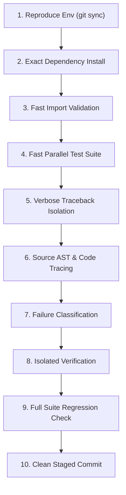
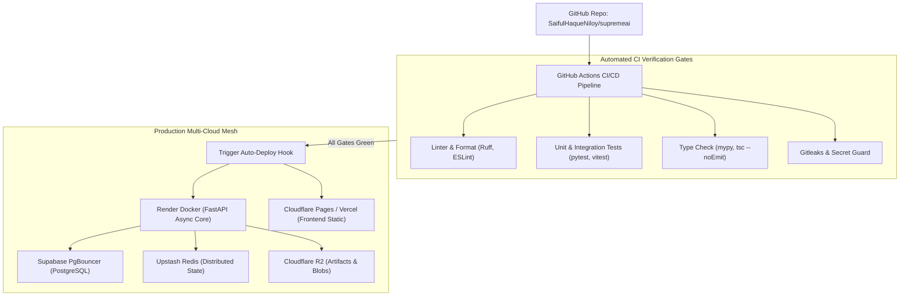

<!-- ============================================================ -->
<!-- Merged Source: docs/13-deployment.md -->
<!-- ============================================================ -->

# 13 — Deployment

## Deployment Topology

| Component | Platform | Identity |
|-----------|----------|----------|
| Backend core | **Render** free tier | `supremeai-primary-node.onrender.com` |
| Worker | Render free tier | `supremeai-worker-node` (`worker_service.py`) |
| Scraper | Render free tier | `supremeai-scraper-node` (Playwright isolated) |
| MCP Control Tower | Render (Blueprint) | `supremeai-mcp-tower` — only service with a `render.yaml` (`infrastructure/mcp-control-plane/render.yaml`) |
| Frontend | **Firebase Hosting** | `https://supremeai-a.web.app` (project `supremeai-a`; `.firebaserc` targets `user`→`supremeai-a`, `admin`→`supremeai-admin`) |
| Keep-alive pinger | **Cloudflare Workers** | `supremeai-worker` (cron `*/8 * * * *`, `infrastructure/wrangler.toml`) |
| Database | **Supabase** | project `xtvkltzmberxekoamala` (Management API used by retention workflow) |
| Secrets | **Infisical** | env slugs `staging`/`prod`, imported at deploy time |

> **Vercel**: no `vercel.json` and no deploy automation exists. Vercel appears only as residual env names, `.env.example` example URLs and a bundle-size limit entry in `check_free_tier_limits.py`. Deploy the frontend via Firebase Hosting, not Vercel.

## CI/CD Pipelines (.github/workflows/)

### `ci.yml` — "CI Pipeline" (main pipeline, 1208 lines)
Triggers: push to `main, develop, feature/*, fix/*`; PRs to `main, develop`; manual dispatch with force flags. Concurrency cancel-in-progress; least-privilege top-level permissions. Env: `NODE_VERSION=24`, `PYTHON_VERSION=3.11`.

**PR jobs:** `changes` (path filter) → `security` (Trivy + secret-in-code) → `registry` (canonical config registry validation) → `build-mcp` (npm ci, build, Trufflehog) → `advanced-checks` (`check_required_secrets.py pre_check` for Infisical/Firebase/GCP/Render/Cloudflare secrets, then ~14 audit scripts from `scripts/advanced_analysis/` + `ci-full-audit.sh` + pip-audit + bandit + trufflehog + gitleaks + actionlint) → `backend-tests` (postgres+redis services; composite action `./.github/actions/setup-backend` — Python 3.11, Poetry 2.4.1 SHA-pinned, lockfile check; ruff; tiered pytest; OpenAPI schema validation; coverage gate; Infisical staging import; canonical startup-command verification) → `integration-test` → `frontend-tests` (`check_single_frontend.py` gate, `tsc --noEmit --strict`, eslint, `vitest run --coverage`, knip) → `build`.

**`main` jobs:** `deploy-frontend` (environment `production`; `generate_firebase_config.py` renders `firebase.template.json` → `firebase.json` with `BACKEND_URL`; `w9jds/firebase-action deploy --only hosting` with `GCP_SA_KEY`) · `publish-core-image` (GHCR `ghcr.io/<repo>/supremeai-core` from `backend/Dockerfile`, **Cosign keyless signing**, Anchore SBOM) · `publish-scraper-image` · `publish-worker-alias` (worker image = core digest re-tagged via `docker buildx imagetools create`) · `deploy-core` / `deploy-worker` / `deploy-scraper` / `deploy-mcp` (Infisical prod import → `scripts/ci/render_trigger_deploy.py` with `RENDER_API_KEY`(+`_2/3/4/_BACKUP`) × service IDs) · `db-schema-check` (live prod DB vs `backend/database/contracts/schema_contract.yaml`) · `deploy-cloudflare-worker` (wrangler) · `notify-failure` (Slack) · `smart-summary`.

### `audit-release.yml` — "Audit & Official Release Center"
Daily deep audit (cron 03:00) · nightly blocking `pip-audit` · weekly self-audit + silent-error scan (Mondays) · scraper CI + health checks (dispatch) · `build-artifacts` matrix on `v*` tags · `create-release` on tags.

### `maintenance.yml` — "Manual Maintenance & Auto-Fix"
Daily cron 02:00 + dispatch with ~15 toggles: 24 h-gap gatekeeper, health check, read-only prod DB schema check, auto-lint-fix, dependency vulnerability scan, codebase docs generation, Cloudflare worker test, performance E2E, CI failure smart summary, outdated-dependency report, auto dependency upgrade, changelog generator, **Upstash FLUSHDB cache purge**, API health check, cost-guard DEFCON, AI DB optimizer, MLOps nightly eval, vulnerability scan, churn analysis, encrypted Telegram backup (`teldrive_backup`).

### `keepalive.yml` — "Free-tier Keep-Alive"
Cron `*/10 * * * *` pinging the four Render services (`/api/v1/health/live` for core & scraper, `/health` for worker & MCP) to defeat Render's ~15-minute idle spin-down. Belt-and-braces: `infrastructure/wrangler.toml` runs a Cloudflare cron `*/8` and notes the "3 separate Render accounts × 750 h free" strategy; `scripts/keepalive.js` is a standalone 5-minute pinger.

### `db-retention.yml` — "DB Retention Prune"
Daily 03:30 — Supabase Management API RPCs `prune_evolution_logs(N)` / `prune_learning_data(N)` (30-day default) to bound free-tier DB growth.

## Docker Images

**`backend/Dockerfile`** (canonical): multi-stage `python:3.11-slim`; builder installs Poetry 2.4.1 and runs `poetry install --only main` (browser/ml groups excluded); runtime creates non-root user `supremeai`, `EXPOSE 8080`, `HEALTHCHECK` → `http://localhost:8080/api/v1/health/live`, `CMD ["python", "main.py"]`.

Other images: `backend/Dockerfile.ci` (torch + whisper for CI), `backend/services/{browser,worker,scraper}/Dockerfile`, `infrastructure/mcp-control-plane/Dockerfile` (node), `frontend/Dockerfile` (node:20-alpine + corepack pnpm builder → `nginx:alpine` with SPA fallback + `/api`, `/admin-api`, `/ws` proxy).

**`docker-compose.yml`** (dev, profile-based): `core` (:8080), `frontend` (:3000), `db` (postgres:16-alpine, profile `local`), `redis` (7-alpine, profile `local`), `worker` (:8081, profile `workers`), `scraper` (:8082, profile `scraper`), `mcp` (:3771, profile `mcp`), everything via `--profile full`.

**`docker-compose.production.yml`**: backend (target `runtime`, healthcheck `/health/live`, limits 2 CPU / 2 GB, Prometheus labels) + `pgvector/pgvector:pg15` (localhost-only, tuned) + redis (password, AOF) + **Prometheus v2.48 + Grafana 10.2.3 + OTel Collector 0.88 + Alertmanager v0.26** with configs from `infrastructure/monitoring/`.

## Deploy Runbook (backend)

```bash
# 1. Pre-deploy gate (9 steps: compile, router imports, boot test, no-requests check,
#    frontend secret scan, migration safety, required secrets, free-tier limits, optional pytest)
bash scripts/pre_deploy_check.sh            # add --quick to skip tests

# 2. Trigger Render deploy for a service
python scripts/deploy/trigger_render_deploy.py    # or scripts/ci/render_trigger_deploy.py (CI path)

# 3. Watch it
python scripts/deploy/check_render.py
python poll_render.py

# 4. Advanced patterns (optional)
python scripts/deploy/blue_green_deploy.py  # blue/green
python scripts/deploy/canary_deploy.py      # canary
python scripts/deploy/disaster_recovery_test.py
python scripts/deploy/infrastructure_as_code_validator.py
```

Frontend deploy: `pnpm deploy:frontend` (= `generate_firebase_config.py && firebase deploy --only hosting`) or push to `main` (auto). Secrets sync: `python scripts/sync_render_secrets.py`, `python scripts/deploy/update_infisical_render.py`.

## Free-Tier Engineering (the defining constraint)

- **Render free instance**: ~512 MB RAM, ~15-min idle sleep. Countermeasures: single-worker enforcement, `LOW_MEMORY_MODE`, `MemoryAwareMiddleware`, four keep-alive mechanisms (above), `worker_service.py` HTTP wrapper so the worker always answers health checks.
- **`scripts/ci/check_free_tier_limits.py`** (pre-commit + nightly): Render ~500 MB deploy context, GitHub Actions 8 GB cache, Vercel 100 MB, Firebase 1 GB, repo 200 MB — auto-fix tiers at 80 % (warn/cleanup) and 95 % (aggressive `git gc`).
- **`scripts/free-tier-health-check.sh`**: exit 0 < 70 % usage, 1 = 70–89 %, 2 ≥ 90 %.
- **`scripts/monitoring/capacity_planner.py`**: "Zero-Cost HA Strategy" — usage estimation, sleep/wake optimization, Telegram alerts, GitHub Step Summary.
- **`scripts/runner/zero_cost_optimizer.sh`**: health-gated docker/pycache prune.
- **Upstash/Redis**: `keepalive` maintenance job can FLUSHDB; `db-retention.yml` bounds Supabase growth.

## Known Stale References (do not follow)

- Root `package.json` `deploy:gcp` → `infrastructure/terraform` (**does not exist**).
- Root `package.json` `docker:build`/`docker:up` → `infrastructure/docker/docker-compose.yml` (**does not exist**; use root compose files).
- Healthcheck path differs: Dockerfile uses `/api/v1/health/live`, production compose overrides to `/health/live`, keep-alive pings both variants — all endpoints exist.
- `supabase-ca.crt` sits at repo root with no code references; the live mechanism is `SUPABASE_DB_CA_CERT`.
- `scripts/security/code-quality.yml` and `dependency-health-check.yml` are workflow-shaped YAML stored outside `.github/workflows/` — not active.


<!-- ============================================================ -->
<!-- Merged Source: docs/devops/CI_DEBUGGING_ROADMAP.md -->
<!-- ============================================================ -->

# 🛠️ CI Failure Root Cause & Resolution Command Roadmap

> **SupremeAI Engineering Standard | Zero-Guesswork CI Triage & Self-Healing Protocol**

This document establishes the canonical 10-step command workflow for diagnosing, isolating, fixing, and verifying CI/CD pipeline failures from scratch.

---

## 🧭 The 10-Step Execution Roadmap



---

### ধাপ ১ — Environment Reproduce করা
সর্বদা লেটেস্ট ক্লিন স্টেটে কাজ নিশ্চিত করা:
```bash
git fetch origin main && git reset --hard origin/main
```

---

### ধাপ ২ — CI-এর Exact Dependency Install Reproduce করা
CI workflow ফাইল অনুযায়ী একদম এক কমান্ডে ডিপেন্ডেন্সি ইনস্টল করা:
```bash
pip install poetry
poetry install --only main --no-root      # CI-এর মূল রানটাইম ডিপেন্ডেন্সি
poetry install --with dev --no-root       # টেস্ট/লিন্ট এক্সট্রাস (গ্রুপ নাম pyproject.toml অনুযায়ী)
```

---

### ধাপ ৩ — Import/Collection-Level Bug দ্রুত ধরা
রানটাইম টেস্টের আগেই ইমপোর্ট ও সিনট্যাক্স এরর সস্তায় এবং তাৎক্ষণিকভাবে ধরা:
```bash
poetry run python scripts/ci/validate_router_imports.py --strict
poetry run pytest --collect-only -q
```

---

### ধাপ ৪ — পুরো Suite রান করে Real Failure List বের করা
কভারেজ ওভারহেড ছাড়া দ্রুত ইটারেশনের মাধ্যমে ফেইলিউর লিস্ট বের করা:
```bash
poetry run pytest -n auto --dist=loadfile --timeout=120 -k "not chaos" -q --no-cov
```
*(দ্রষ্টব্য: `--no-cov` ফাস্ট ইটারেশনের জন্য ব্যবহার করুন; কভারেজ আলাদা ধাপে চেক হবে।)*

---

### ধাপ ৫ — প্রতিটা Failure-এর জন্য Isolated, Verbose Traceback বের করা
লগ নয়েজ বাদ দিয়ে সরাসরি লং ট্রেসব্যাক ফোকাস করা:
```bash
poetry run pytest tests/path/to_test.py::TestClass::test_name -q --no-cov --tb=long -p no:logging
```
*(প্রয়োজনে `-p no:cacheprovider` ব্যবহার করুন।)*

---

### ধাপ ৬ — Traceback থেকে Root File-এ যাওয়া
```bash
grep -n "<failing_function_or_attr>" -r . --include="*.py" | grep -v tests/
```
এর মাধ্যমে স্পষ্ট বোঝা যায় বাগটি প্রোডাকশন কোডে (Real Bug) নাকি কেবল টেস্টের এক্সপেক্টেশন পুরনো (Stale Assertion)।

---

### ধাপ ৭ — Failure Classify করা
1. **Production Code Bug:** মিসিং ইমপোর্ট বা লজিক বাগ → প্রোডাকশন কোড ফিক্স করুন।
2. **Stale Test Contract:** কোড ইচ্ছাকৃতভাবে বিবর্তিত হয়েছে (কমেন্ট/ডকস্ট্রিং যাচাই করুন) → টেস্ট কন্ট্রাক্ট আপডেট করুন।
3. **Flaky / Env-Dependent:** Redis/Network আনঅভেইলেবল → গ্রেসফুল ফলব্যাক বা স্কিপ মার্ক নিশ্চিত করুন।

---

### ধাপ ৮ — Fix করার পর ঠিক সেই Test(s) আবার Isolated রান করে Verify
```bash
poetry run pytest tests/path/to_test.py -q --no-cov
```

---

### ধাপ ৯ — পুরো Suite আবার রান করে Regression চেক
একটি ফিক্স অন্য কিছু ভেঙেছে কিনা তা সম্পূর্ণ স্যুট চালিয়ে নিশ্চিত করা:
```bash
poetry run pytest -n auto --dist=loadfile --timeout=120 -k "not chaos" -q --no-cov
```

---

### ধাপ ১০ — Clean Staged Commit ও Verification
```bash
git status --short
# অবাঞ্ছিত ফাইল (.coverage, pickle, logs) বাদ দিয়ে শুধুমাত্র নির্দিষ্ট ফাইলে git add করুন
```


<!-- ============================================================ -->
<!-- Merged Source: docs/devops/implementation_plan.md -->
<!-- ============================================================ -->

# DevOps Implementation Tracker - MERGED (pointer shim)

> **Merged into [docs/plans/IMPLEMENTATION_TRACKERS.md](../plans/IMPLEMENTATION_TRACKERS.md) on 2026-09-08** (Documentation Context Consolidation - Phase 9). This file covered **Section 4: DevOps**.
> Verbatim history: `git log --follow docs/devops/implementation_plan.md`.
> Keep this pointer so existing links do not break; do not add new plan content here.


<!-- ============================================================ -->
<!-- Merged Source: docs/devops/SUPREME_DEVOPS_DEPLOYMENT.md -->
<!-- ============================================================ -->

# 🚀 SupremeAI DevOps, CI/CD & Deployment Master Plan

**Document Version:** 3.0.0 (Canonical Source of Truth)  
**System Phase:** **Phase 3: Self-Evolving & Multi-Agent Swarm**  
**Classification:** DevOps Pipeline, Cloud Mesh & Zero-Downtime Deployment

---

## 🎯 1. Cloud Mesh & Zero-Cost Free-Tier Topology

SupremeAI এমনভাবে ডিপ্লয় করা হয় যাতে প্রতিটি কম্পোনেন্ট ফ্রি-টিয়ার রিল্যায়াবিলিটির মধ্যে সর্বোচ্চ আপটাইম নিশ্চিত করে:



---

## ⚙️ 2. Automated CI/CD Gates (Non-Negotiable)

প্রতিটি পুল রিকোয়েস্ট বা পুশে নিচের ৪টি গেট **১০০% গ্রিন** হতে হবে:

1. **Python Quality Gate:**
   ```bash
   ruff check backend/
   pytest backend/tests/ --cov=backend --cov-fail-under=80
   ```
2. **Frontend Quality Gate:**
   ```bash
   cd frontend
   npx tsc -p tsconfig.app.json --noEmit
   npm test
   pnpm build
   ```
3. **Secret & Security Gate:**
   - Gitleaks রান করে কোডবেস স্ক্যান করা হয় — কোনো আনএনক্রিপ্টেড কী কমিট হতে দেওয়া হয় না।
4. **Action SHA Pinning:**
   - সমস্ত GitHub Action ওয়ার্কফ্লো ফুল ৪০-ক্যারেক্টার কমিট হ্যাশ দিয়ে পিন করা।

---

## 🔄 3. Zero-Downtime & Rollback Policy

- **Pre-Deploy Health Probe:** ডিপ্লয়মেন্ট সম্পূর্ণ হওয়ার আগে `/health/live` এবং `/health/ready` এন্ডপয়েন্ট পিং করে সার্ভিস রেডি কিনা নিশ্চিত করা হয়।
- **Automatic Rollback Switch:** ডিপ্লয়মেন্টের পর কোনো কনটেইনার ক্র্যাশ বা ডেটাবেজ কানেকশন ফেইলিওর ঘটলে ৩ ট্রাইয়ের মধ্যে স্বয়ংক্রিয়ভাবে পূর্ববর্তী স্টেবল `CHECKPOINT.md` ট্যাগ ভার্সনে রোলব্যাক হয়।
- **One-Click Hot-Patching:** প্রোডাকশন রিস্টার্ট ছাড়া মেমোরি বা স্কিল লেভেলে লাইভ প্যাচ পুশ করার জন্য `OneClickPatch` সার্ভিস ব্যাকগ্রাউন্ডে রেডি থাকে।

---

## 4. MCP Health Truth Contract

- `/health` is liveness-only; `/health/ready` is the bounded dependency readiness probe.
- Every sweep snapshot now includes `checkedAt`, `latencyMs`, explicit evidence kind, consecutive failure count, and dependency impact.
- Provider responses reporting `degraded`, `down`, or `unknown` are preserved rather than being promoted to healthy.
- A timeout is classified separately from a provider error; repeated failures transition to `circuit_open`.
- Synthetic business transactions and durable health history remain required before claiming full production readiness.

## 5. Pipeline Hardening Implemented

- `.github/scripts/validate_workflow_contracts.py` now performs an offline contract audit for workflow YAML validity, explicit permissions, concurrency, full-SHA external actions, execution timeouts, and silent shell failures.
- CI publishes `workflow-contract-report` as an artifact and blocks on critical contract violations.
- Keep-alive retries critical health endpoints with bounded timeouts and fails when any configured production node is not healthy.
- DB retention validates the retention window, requires its secret, validates HTTP 200, and redacts raw API responses from logs.
- Remaining warnings are intentionally visible: legacy audit `|| true` paths and missing per-job timeouts must be migrated incrementally without weakening the existing release gate.

*Canonical Master Plan — Supersedes all legacy devops and operations deployment drafts.*


<!-- ============================================================ -->
<!-- Merged Source: docs/operations/BACKUP_RESTORE_POLICY.md -->
<!-- ============================================================ -->

# Backup & Restore Policy (AUD-5.7)

> Status: tooling exists and is wired; the enforced schedule/retention decision below
> is the recorded policy. The DBA-verified restore drill is a MANUAL step (see
> `audit_reports/supreme-deep-audit-reports/MANUAL_STEPS.md`).

## 1. What is critical persistent data

| Data | Store | Criticality | Backup mechanism |
|---|---|---|---|
| Tenancy data (users, tasks, conversations, artifacts) | Supabase/PostgreSQL (Render runtime) | CRITICAL | Supabase PITR (platform) + `scripts/backup/superai_backup_manager.py` dumps |
| Long-term memory (`ai_memory` incl. pgvector embeddings) | Postgres `ai_memory` | HIGH | included in DB dumps; embeddings are reproducible from source content |
| Skill proposals / evolution artifacts | `~/.supremeai/proposals` + SQLite/Supabase `skill_proposals` | MEDIUM | Supabase copy is canonical; local FS is ephemeral on Render |
| Configuration control plane | Postgres config tables / Infisical | HIGH | Infisical env snapshots + config registry exports |
| Uploaded attachments | Render disk + Supabase | MEDIUM | not durable on free tier; document as best-effort |

## 2. Schedules

1. **Logical dump (daily, automated):** `scripts/backup/superai_backup_manager.py create`
   via nightly `audit-release.yml` maintenance job output → stored off-box (GCS via
   `auto_cross_cloud_replicate.py` when `GCP_*` credentials are configured; otherwise the
   admin backup dump endpoint `api/routes/admin.py` provides on-demand capture).
2. **Platform PITR:** Supabase built-in continuous backup (7-day on current plan) is the
   primary recovery mechanism — **verify plan tier in the Render/Supabase dashboard (manual)**.
3. **Pre-deploy snapshot:** `SafetyRollbackManager` (wired via `core/integration_layer.py`)
   creates gzip+SHA256 in-process backups of files it mutates before any deployment-time
   change.

## 3. Retention

- Nightly logical dumps: **30 days** rolling.
- Pre-deploy snapshots: **7 days** rolling.
- Supabase PITR: per platform plan.

## 4. Restore expectations (RTO/RPO)

| Scenario | RPO | RTO | Procedure |
|---|---|---|---|
| Accidental data loss (table/row) | ≤ 24 h (nightly dump) or ≤ minutes (PITR) | ≤ 2 h | Supabase PITR restore to timestamp → verify row counts → repoint service |
| Full instance loss | ≤ 24 h | ≤ 4 h | Restore latest dump into fresh Supabase project → update `DATABASE_URL` → redeploy image → run `/api/v1/health/full` |
| Bad autonomous/self-evolution change | 0 | ≤ 15 min | `SafetyRollbackManager` rollback or Render image rollback |

## 5. Verification drill (must be executed manually, then recorded)

1. Restore the latest nightly dump into a scratch database.
2. Boot the backend against the scratch DB (`ENV=local`, `DATABASE_URL=...scratch`).
3. Assert: login works, one conversation round-trip works, `ai_memory` recall returns rows.
4. Record date/operator/SHA in `audit_reports/supreme-deep-audit-reports/REAL_TESTING_LOG.md`.


<!-- ============================================================ -->
<!-- Merged Source: docs/plans/implementation_plan.md -->
<!-- ============================================================ -->

# docs/plans — Implementation Plan (Master, Reconciled)

> **Purpose:** Consolidated implementation direction for the current SupremeAI codebase.
> **Rule:** Existing plans are historical design inputs; this file records the current execution order where plans overlap or conflict.

---

## 0. Current Architecture Direction

SupremeAI follows:

```text
User Goal
  ↓
Intent / Context
  ↓
Capability + Resource Discovery
  ↓
Reusable Implementation Discovery
  ↓
Cost / Risk / Quality / Authorization evaluation
  ↓
reuse / compose / adapt / delegate / generate
  ↓
execute
  ↓
verify
  ↓
learn + promote safely
```

The system must optimize **work avoided**, not merely infrastructure added.

---

## 1. Bootstrap Brain — Current Priority

Source plans:

- `docs/ADMIN_TASKS/SUPREMEAI_BOOTSTRAP_BRAIN_AND_DECISION_LOGIC_PLAN.md`
- `docs/ADMIN_TASKS/implementation_plan.md`

### Decision

`discover_reusable_implementation` is logically available for **every `dev` task**.

It is tiered:

```text
L1: memory / semantic cache
 ↓ miss
L2: internal code / docs / registered capabilities
 ↓ miss
L3: external GitHub / OSS / official SDK / compatible source
```

L3 is policy- and expected-value-gated. Therefore “always enabled” does **not** mean “always perform an expensive web/GitHub search.”

### Methodology decision

The methodology is selected **after discovery**:

```text
reuse → compose → adapt → delegate → generate_new_code
```

Greenfield code is the fallback.

### Required finishing work

- bootstrap seed
- L1/L2/L3 discovery service
- planner wiring
- resource/authorization discovery
- advisor contract
- brain metrics
- verification + governed promotion

---

## 2. Free-Tier Scaling — Reconciled Direction

Source plans:

- `docs/plans/FREE_TIER_UPGRADE_PLAN.md`
- `docs/FREE_TIER_STORAGE_PLAN.md`
- `docs/plans/FREE_TIER_FEDERATION_MASTER_PLAN_V4.md`
- `docs/plans/FREE_TIER_FEDERATION_PLAN_V3.md`

### Architectural decision

Free tiers are **optimization surfaces**, not correctness dependencies.

Preferred order:

```text
cache
→ deduplicate
→ reuse
→ batch
→ async queue
→ authorized user-owned resource
→ suitable free/low-cost provider
→ paid burst only when necessary
```

### Important correction

The old federation concept must **not** treat account multiplication as an unlimited quota multiplier.

Do not build production correctness around:

- rotating multiple accounts solely to multiply quotas
- stealth keep-alives
- fake browser interaction to defeat idle policies
- CAPTCHA/anti-abuse circumvention
- turning interactive notebook free tiers into hidden permanent worker fleets

Multiple resources are valid when they represent legitimate ownership, tenant, security, environment, or provider-supported separation.

### Provider roles

```text
Firebase / CDN
  → static frontend and delivery

Cloudflare
  → edge routing, cache, validation, lightweight logic

Render
  → lean control plane / API

Supabase
  → durable state and memory

Upstash
  → hot cache, locks, queue/rate limiting where appropriate

GitHub Actions
  → repository-native CI/build/test work

Kaggle
  → optional batch/research workloads

Colab
  → optional interactive/admin research; never a required production worker
```

### Quota rule

All quota values must be treated as **provider-versioned configuration**, not hard-coded architectural guarantees.

---

## 3. Missing Services Integration — Reconciled

Source: `docs/plans/MISSING_SERVICES_INTEGRATION_PLAN_V4.1.md`

The existing plan correctly emphasizes:

- secret management
- Eternal Brain / pgvector
- multi-model routing
- resilience
- observability

But implementation should be driven by current code evidence rather than the plan's historical “missing” label.

Before implementing any listed item:

```text
inspect current code
→ confirm missing
→ check existing equivalent
→ measure need
→ implement only if still required
```

Do not create duplicate services when the capability already exists elsewhere.

---

## 4. Production Upgrade — Reconciled

Source: `docs/plans/PRODUCTION_UPGRADE_PLAN.md` and `docs/PRODUCTION_READINESS_PLAN_V3.md`

Enterprise targets such as 99.99% uptime or sub-100ms P95 are **future targets**, not current guarantees.

Free-tier production work should prioritize:

1. startup correctness
2. authentication/security correctness
3. tenant isolation
4. DB indexes/query efficiency
5. connection pooling where justified
6. websocket/resource caps
7. graceful degradation
8. observability
9. rollback/readiness
10. measured load testing

Kubernetes/microservices should not be introduced merely because an old plan contains them. Introduce them only after measured bottlenecks justify the additional maintenance/cost.

---

## 5. Storage and Memory

Source: `docs/FREE_TIER_STORAGE_PLAN.md`

The Eternal Brain should follow:

```text
hot working state
→ recent episodic state
→ validated semantic/procedural knowledge
→ compressed/archive artifacts
→ delete disposable data
```

Do not store every raw intermediate artifact indefinitely.

The memory system should optimize for:

- retrieval quality
- provenance
- confidence
- verification
- reuse
- storage efficiency

---

## 6. Resource-as-Capability

This is now a first-class architectural rule.

When a user/admin legitimately connects a service, SupremeAI should inspect:

```text
what it can do
what permissions exist
what limits exist
what it costs
what data boundary applies
```

Then register usable capabilities without taking ownership of the user's resource.

Example:

```text
User connects GitHub
   ↓
inspect authorized repo/actions capabilities
   ↓
repository-native task?
   ↓
use GitHub-native execution where appropriate
   ↓
verify
   ↓
return result
```

A user's resource must never silently become shared infrastructure for another tenant.

---

## 7. External Implementation Discovery

For any task requiring new implementation:

```text
Estimate missing capability
   ↓
search internal capability/memory/docs
   ↓
search known implementation registry
   ↓
if worthwhile → external discovery
   ↓
license + provenance + security + compatibility + maintenance review
   ↓
reuse/adapt/compose
   ↓
only then create missing code
```

This is the principal mechanism for reducing greenfield implementation over time.

---

## 8. Cost Intelligence

Every execution path should eventually expose:

```text
estimated_cost
actual_cost
latency
quota_pressure
maintenance_cost
risk
verification_history
```

The cheapest path is **not automatically the path with $0 provider price**.

A free service that requires fragile manual operation or creates unacceptable reliability risk may be more expensive operationally than a small paid burst.

Therefore optimize for:

> **minimum sustainable total cost of ownership.**

---

## 9. Self-Evolution

SupremeAI's learning loop:

```text
real problem
 ↓
capability gap
 ↓
reuse/discovery/delegation analysis
 ↓
execution
 ↓
verification
 ↓
lesson candidate
 ↓
confidence + provenance evaluation
 ↓
quarantine if uncertain
 ↓
governed promotion
 ↓
future reuse
```

A failed execution is data, not automatically knowledge.

---

## 10. Implementation Priority

### P0 — Correctness and security

- verify current production blockers
- tenant isolation
- secret handling
- authentication
- DB integrity
- migration correctness

### P1 — Brain decision loop

- bootstrap brain
- L1/L2 discovery
- discovery-first methodology
- resource/authorization discovery
- verification

### P2 — Efficiency

- semantic cache
- task deduplication
- artifact hashing
- batch execution
- quota-aware admission
- backpressure

### P3 — External capability ecosystem

- MCP capability registry
- GitHub-native workflows
- approved browser delegation
- external provider adapters
- L3 reusable implementation discovery

### P4 — Self-evolution

- lesson promotion
- capability creation
- sandbox validation
- rollback
- routing optimization from historical outcomes

### P5 — Scale validation

- concurrency tests
- queue stress tests
- provider failure tests
- quota exhaustion tests
- cache/reuse measurements
- heavy-task admission tests

---

## 11. Acceptance Criteria

Do not declare this architecture “complete” because the documents exist.

Demonstrate with tests that:

- similar dev tasks increasingly reuse existing capability
- every dev task has access to reusable-implementation discovery
- expensive external discovery is avoided when internal evidence is sufficient
- `generate_new_code` is a fallback
- provider failure does not destroy core task state
- user authorization boundaries are enforced
- repeated work is deduplicated
- queue/backpressure prevents overload
- new knowledge is not promoted without verification
- the system can operate without any single optional provider
- free-tier changes do not require an architectural rewrite

---

## 12. Plan Governance

When a new plan is added to `docs/`:

1. identify which existing plan it supersedes
2. inspect current code before marking work “missing”
3. avoid duplicate implementations
4. record assumptions and external limits
5. define verification criteria
6. assign an owner/status
7. reconcile it into this master plan

This prevents plan sprawl from becoming an architecture problem.


<!-- ============================================================ -->
<!-- Merged Source: docs/plans/IMPLEMENTATION_TRACKERS.md -->
<!-- ============================================================ -->

# SupremeAI Implementation Trackers — Consolidated Single Source

> **Merged 2026-09-08** — Documentation Context Consolidation (Phase 9 of [`docs/architecture/SUPREMEAI_CONSOLIDATION_AND_CLEANUP_PLAN.md`](../architecture/SUPREMEAI_CONSOLIDATION_AND_CLEANUP_PLAN.md)).
> Previously **5 files named `implementation_plan.md`** existed across `docs/`, `docs/architecture/`, `docs/browser/`, `docs/devops/`, `docs/intelligence/`. Content is consolidated here; original paths remain as **pointer shims**; verbatim history: `git log --follow <old-path>`.
> **Canonical implementation plan remains:** [`docs/plans/implementation_plan.md`](implementation_plan.md) (referenced by Master Roadmap §2 authority order and CI).
> **Status-update rule:** update statuses HERE only. Do not recreate per-domain `implementation_plan.md` copies.

## Authority order for planning docs

```text
Runtime code + tests → docs/plans/implementation_plan.md (canonical)
→ this consolidated tracker → domain master plans (browser/devops/intelligence/…)
→ historical inputs (banner-marked)
```

---

## 1. Docs-Root Plans (was `docs/implementation_plan.md`)

### 1.1 `PRODUCTION_READINESS_PLAN_V3.md` — 13 Targeted Bug Fixes

**Goal:** 15 bugs + 10 perf issues + 10 dead-code + 4 capability gaps fix করা।

| Fix | Description | Status |
| --- | --- | --- |
| #1 | `ArtifactType(str, str)` duplicate base | 🔴 Open |
| #2 | `stream_chat_sse` garbage stream | 🔴 Open |
| #3 | 7 missing `await` in tools/ | 🔴 Open |
| #4 | 9 broken imports | 🔴 Open |
| #5 | `time.sleep()` in async retry wrapper | 🔴 Open |
| #6 | WebSocket unbounded (no cap, no heartbeat) | 🔴 Open |
| #7 | `_pref_locks` dict memory leak | 🔴 Open |
| #8 | Per-request `httpx.AsyncClient` (no reuse) | 🔴 Open |
| #9 | Missing DB indexes on user tables | 🔴 Open |
| #10 | Dead file deletion (9 files) | 🔴 Open |
| #11 | `MaintenancePipeline.__new__` skips `__init__` | 🔴 Open |
| #12 | `EvolutionEngine.learn_from_success/failure` not wired | 🔴 Open |
| #13 | Ephemeral ChromaDB/Qdrant (learning lost on restart) | 🔴 Open |

**Batches (verbatim commands in git history, `docs/implementation_plan.md` @ pre-merge):**

- Batch 1 — Critical Crashes (#1,#2,#3,#4,#11): `backend/api/routes/artifacts.py:37`, `backend/api/routes/stream_chat_sse.py:50-76`, missing awaits in `integrations/browser_use_adapter.py:116`, `tools/knowledge/pdf_to_sdk.py:92`, `tools/meta_architect.py:110,157`, `tools/media/*_generator.py:18`, broken imports (`scripts/sync_knowledge.py`), `backend/core/maintenance_pipeline.py:213`.
- Batch 2 — Performance & Memory (#5,#6,#7,#8): `supabase_client.py` sleep→asyncio, WebSocket MAX_CONNECTIONS=50 + heartbeat 30s, `_pref_locks`→LRUCache(1000), `github.py`→global httpx client.
- Batch 3 — Data Integrity (#9,#13): DB index migration via `backend/alembic_migrations/versions/`, ChromaDB `EphemeralClient()`→`PersistentClient(path=EXPERIENCE_DB_PATH)` in `backend/adaptive_engine/experience_db.py`.
- Batch 4 — Self-Evolution (#12) + Cleanup (#10): wire `learn_from_success` in `backend/core/llm/llm_gateway.py`; `git rm` dead files (`backend/scripts/adhoc_archive/`, `backend/services/morphic_refactor.py` 0 bytes, `backend/core/middleware/circuit_breaker_middleware.py` 1 byte) — **requires Rule 20 admin approval before deletion**.

### 1.2 `FREE_TIER_STORAGE_PLAN.md`

**Goal:** Storage $0 রাখতে Supabase Storage + Cloudflare R2 (free tier)।

- Step 1 — `backend/services/storage/` upload/download/delete verify (`pytest tests/services/storage/ -v`)
- Step 2 — `backend/services/storage/r2_adapter.py` (new): >50MB auto-route to R2
- Step 3 — `backend/middleware/storage_guard.py` (new): per-user quota, 1GB free-tier limit

---

## 2. Architecture (was `docs/architecture/implementation_plan.md`)

**Source plans:** `SUPREMEAI_CONSOLIDATION_AND_CLEANUP_PLAN.md`, `THEORY_OF_MIND_AND_DIGITAL_TWIN_DEEP_DIVE.md`, `SUPREME_SYSTEM_ARCHITECTURE.md`

### 2.1 Consolidation & Cleanup — Phase Status

| Phase | Description | Status |
| --- | --- | --- |
| Phase 1 | Dead Code & Router Consolidation | ⚠️ Partial |
| Phase 2 | Agent & Evolution Consolidation | ⚠️ Partial |
| Phase 3 | Route RBAC Audit | 🔴 Not Started |
| Phase 4 | Test Coverage 38% → 80%+ | ⏸️ Deferred |
| Phase 5 | Documentation & Git Push | ✅ Done |
| Phase 6 | Intent Deciphering & Dynamic Planning | ✅ Done |
| Phase 7 | Tool Forge & Dual-Loop Verification | ✅ Done |

**Pending (remaining work):**

- **Phase 1 — Router consolidation:** audit `backend/brain/` routers (`api_router.py`, `expert_router.py`, `gcp_router.py`, `parallel_cloud_router.py`, `performance_aware_router.py`, `cognitive_router.py`); caller graph via grep; 0-caller files → retire (Rule 20 approval); merge active logic into `backend/core/llm/advanced_model_router.py`.
- **Phase 2 — Agent consolidation:** `backend/src/agents/syncguard/` → `backend/agents/syncguard/`; `backend/brain/{autonomous_agent,crewai_agents,langgraph_agent}.py` → `backend/agents/core/`; evolution systems → `backend/core/evolution/`.
- **Phase 3 — Route RBAC (🔴 critical, 48 unguarded routes):** classify Public / User-Protected (`get_current_user_token`) / Admin-Only (`require_admin_token`); fail-closed injection; test `pytest tests/api/test_rbac_coverage.py`.

### 2.2 Digital Twin / Theory of Mind

- ✅ `backend/brain/user_digital_twin.py` exists (6257 bytes)
- Pending: expose methods via `/api/user/twin` (`backend/api/routes/user_twin.py` new); twin recall into `IntentDecipheringService.decipher_intent()`.
- **Governance note:** per Master Roadmap Phase 4, digital twin / ToM is **opt-in controlled research**, not default production behavior.

---

## 3. Browser (was `docs/browser/implementation_plan.md`)

**Source plan:** [`docs/browser/SUPREME_BROWSER_MASTER_PLAN.md`](../browser/SUPREME_BROWSER_MASTER_PLAN.md) — **Goal:** 6-Pillar Cognitive Autonomous Browser Suite সম্পূর্ণ করা।

| Pillar | Description | Status |
| --- | --- | --- |
| 1 | In-App Live Preview Engine | ⚠️ Partial (CORS proxy exists) |
| 2 | Playwright MCP Automation | ✅ Exists (`services/browser/`) |
| 3 | Anti-Detection Stealth Shield | ⚠️ Partial (`browser_stealth.py`) |
| 4 | Vision Grounding & Semantic DOM | ⚠️ Partial (files exist, not wired) |
| 5 | Multi-Agent Swarm Browser | 🔴 Not Started |
| 6 | Live Screencast & HITL Takeover | 🔴 Not Started |

**Pending milestones:**

- M1 Foundation: `/api/browser/proxy` (`backend/api/routes/browser.py`); Playwright pool `backend/services/browser/browser_pool.py` (max 3); unified action executor (`navigate/click/type/screenshot`).
- M2 Frontend viewport: `frontend/src/components/browser/LivePreview.tsx` (sandboxed iframe + device switcher); `ConsoleErrorTrap.ts` → `ai_memory` feed.
- M3 Cognitive vision: wire `backend/browser/vision_grounding.py` → `/api/browser/vision-ground`; `backend/browser/semantic_dom.py` → `/api/browser/semantic-dom` (20K→500 token pruning).
- M4 Swarm & screencast: `/ws/browser/screencast` (500ms JPEG stream, first-message token auth); HITL takeover `POST /api/browser/takeover` (`backend/services/browser/hitl_manager.py` new); Step 10 — Multi-Agent Swarm Partitioner (Pillar 5).
- **Governance note:** CAPTCHA/anti-abuse circumvention will NOT be implemented (Roadmap Phase 5) — pause and request human action where required.

---

## 4. DevOps (was `docs/devops/implementation_plan.md`)

**Source plans:** `CI_DEBUGGING_ROADMAP.md`, `SUPREME_DEVOPS_DEPLOYMENT.md` — **Goal:** CI/CD stability + zero-downtime deploy + self-healing dev workflow.

### 4.1 CI Triage (10-step protocol → automation)

- Step 1 — `backend/scripts/ci/triage.sh` (new): auto git fetch/reset, poetry install, import validation, parallel test run + failure report (`--dry-run` testable).
- Step 2 — `scripts/ci/validate_router_imports.py --strict` (verify existence first).
- Step 3 — GitHub Actions self-healing: failure step → `scripts/ci/report_failure.py` auto-comment on PR.

### 4.2 Deployment

| Component | Status |
| --- | --- |
| Render deployment (`render.yaml`) | ✅ Active |
| Docker container | ✅ (`Dockerfile`) |
| GitHub Actions CI | ✅ (`.github/workflows/`) |
| Alembic migrations | ✅ (`backend/alembic_migrations/`) |

**Pending:** graceful shutdown verify (`backend/core/app.py` lifespan); fill `docs/DEPLOYMENT_CHECKLIST.md` (currently empty) + `backend/scripts/pre_deploy_check.sh`; rollback script `backend/scripts/rollback.sh` (CHECKPOINT.md version integration).

---

## 5. Intelligence (was `docs/intelligence/implementation_plan.md`)

**Source plan:** `docs/intelligence/SUPREME_AI_INTELLIGENCE_MASTER.md` — **Goal:** 5-Pillar Cognitive Intelligence + Continuous Self-Evolution.

| Component | File | Status |
| --- | --- | --- |
| Intent Deciphering Service | `services/intent_deciphering.py` | ✅ Done |
| Dynamic Planning Engine | `services/dynamic_planner.py` | ✅ Done |
| Living Engine Orchestrator | `services/living_engine.py` | ✅ Done |
| DevAdapter / BusinessAdapter / UXAdapter | `adapters/*` | ✅ Done |
| PatternRecognizer | `learning/pattern_recognizer.py` | ✅ Done |
| EvolutionModule (Genetic Algo) | `core/evolution_module.py` | ✅ Done |
| CascadeMemoryService (Eternal Brain) | `services/memory_service.py` | ✅ Done |
| TokenJuice Compressor | `engine/compression/token_juice.py` | ✅ Exists |
| Hierarchical Memory Tree | `memory/hierarchical_tree.py` | ✅ Exists |
| FitnessEngine wire-up | — | ⚠️ Partial |
| TokenJuice → LLM Gateway integration | — | ⚠️ Not wired |
| RedTeam / Adversarial Reasoning | — | 🔴 Missing |
| Meta-Evolution (Self-Code Rewrite) | — | 🔴 Missing |
| Swarm Consensus Engine | — | 🔴 Missing |

**Pending steps:**

1. TokenJuice → `backend/core/llm/llm_gateway.py::acompletion()` (70–85% context compression).
2. FitnessEngine → `EvolutionModule.learn_from_success()` wire-up, gated by `ENABLE_EVOLUTION_LEARNING=true`.
3. Red Team adapter (`backend/adapters/red_team_adapter.py`, optional step in `living_engine.py` loop).
4. Swarm Consensus Engine (`backend/core/swarm_consensus.py`, weighted voting).
5. Meta-Evolution (`backend/core/meta_evolution.py`) — **candidate-only** via `brain/promotion_candidate.py` + HITL approval; never direct self-write.
6. Multi-model parallel swarm routing (`backend/brain/parallel_cloud_router.py` wiring).

**Priority order:** 1 (token cost) → 2 (self-evolution) → remaining steps.

**Governance note:** per Constitution Law 13 ("Learning ≠ Automatic Adoption") and Roadmap Phase 4, evolution learning stays disabled until a real consumer + evaluation dataset exist; self-rewrite is opt-in controlled research.

---

## 6. Merge Log (Rule 20 audit trail)

| Original path | Merged section | Date | Shim in place |
| --- | --- | --- | --- |
| `docs/implementation_plan.md` | §1 | 2026-09-08 | ✅ |
| `docs/architecture/implementation_plan.md` | §2 | 2026-09-08 | ✅ |
| `docs/browser/implementation_plan.md` | §3 | 2026-09-08 | ✅ |
| `docs/devops/implementation_plan.md` | §4 | 2026-09-08 | ✅ |
| `docs/intelligence/implementation_plan.md` | §5 | 2026-09-08 | ✅ |
| `docs/ADMIN_TASKS/implementation_plan.md` | NOT merged (referenced by `docs/plans/implementation_plan.md` + `docs/plans/PLAN_RECONCILIATION_2026-09-03.md`) — kept in place | 2026-09-08 | n/a |


<!-- ============================================================ -->
<!-- Merged Source: docs/plans/SUPREMEAI_FREE_TIER_MULTI_SERVICE_SCALE_MASTER_PLAN.md -->
<!-- ============================================================ -->

# SUPREMEAI FREE-TIER MULTI-SERVICE SCALE MASTER PLAN

**Version:** 1.0 — September 2026
**Purpose:** Combine legitimate free/no-cost service tiers to maximize SupremeAI capacity while keeping the architecture policy-safe, observable, replaceable, and ready for paid escalation.

## 0. Executive Decision

SupremeAI should **not** build a “free cloud supercomputer” by multiplying provider quotas through many accounts.

The durable architecture is:

> **One SupremeAI brain → one capability/policy control plane → many legitimate execution surfaces → aggressive caching/batching/deduplication → queue/backpressure → user-authorized resources → external delegation → paid burst capacity only when genuinely required.**

The uploaded earlier blueprint contains useful service-mapping ideas, but several of its claims must not be production guarantees. Free Colab is explicitly non-guaranteed, dynamic, and intended to prioritize interactive notebook use; Google documents that distributed computing workers and UI-bypass patterns are restricted in free managed runtimes. Google Cloud terms also prohibit quota circumvention through multiple accounts/projects intended to simulate one resource. Therefore the earlier “Colab keep-alive / stealth / relay” and “account multiplication = quota multiplication” patterns are rejected.

The objective is not **“get as much free compute as possible.”** The objective is **“do the most useful work per unit of scarce compute.”**

---

# 1. Scaling Constitution

### Rule 1 — Free tier is an optimization layer, never the correctness foundation

Every provider must sit behind a replaceable adapter. SupremeAI must remain correct if any free quota changes tomorrow.

### Rule 2 — Never confuse accounts with capacity

Multiple legitimate environments are fine when justified by tenancy, ownership, isolation, geography, security, or provider-supported architecture. They must not be used solely to manufacture quota unless the provider explicitly permits it.

### Rule 3 — User-owned resources remain user-owned

A user may connect GitHub, model providers, storage, SaaS, or other authorized resources. SupremeAI can discover and use capabilities within the granted scope, but must not silently turn one user's private resource into shared infrastructure.

### Rule 4 — Optimize work before servers

Priority order:

1. deduplicate
2. cache
3. reuse memory/capabilities
4. compose existing capabilities
5. batch
6. route lightweight work to edge/serverless
7. route heavy work to suitable execution surfaces
8. add capacity only after measurement

### Rule 5 — No provider is a single point of correctness

SupremeAI must degrade gracefully when any single provider sleeps, rate-limits, becomes unavailable, changes pricing, or disappears.

---

# 2. Target Logical Architecture

```text
SUPREMEAI STUDIO
  Firebase / static CDN
          │
          ▼
EDGE LAYER
  Cloudflare Workers / CDN / WAF / cache
          │
          ▼
SUPREMEAI CONTROL PLANE
  Auth • RBAC • Tenant isolation
  Task intake • Planning • Policy
  Capability registry • Resource registry
  Provider registry • Cost/quota model
  HITL • Audit • Evidence
       ├───┴─────────────┬───────────────────────────┐
       ▼                 ▼                           ▼
   Supabase            Upstash              MCP CONTROL TOWER
 durable state       cache/queue/locks    (Node 4: Tool & Universal Data Bridge)
       └────────┬────────┘                           │
                ▼                                    │
       EXECUTION ROUTER ◄────────────────────────────┘
       │       │       │
       ▼       ▼       ▼
     Edge    Core    Async/Batch
                     │
      ┌──────────────┼────────────────┐
      ▼              ▼                ▼
 GitHub Actions   Kaggle*           Colab*
 repo-native      research/batch    interactive
      │              │                │
      └──────────────┴────────────────┘
                     │
                     ▼
          External/paid compute
               when required
                     │
                     ▼
                VERIFY
                     │
                     ▼
             MEMORY / AUDIT
```

`*` Kaggle and Colab are optional execution surfaces, not mandatory production workers.

---

# 3. Service-by-Service Strategy

## 3.1 Firebase Hosting — Frontend Delivery

**Use heavily for:** React/TypeScript assets, SPA delivery, static content, client-side caching, public docs, UI configuration.

**Scaling trick:** avoid making every UI interaction an origin API call.

```text
Browser cache → CDN → edge cache → API only when necessary
```

Firebase documents CDN-backed Hosting and project-level no-cost quotas. citeturn618240search8turn618240search4

**Do not use it as:** the dynamic AI execution layer.

---

## 3.2 Cloudflare Workers — Edge Layer

Current Workers Free limits include **100,000 requests/day**, **10 ms CPU/request**, 50 subrequests/request, and 5 Cron Triggers/account. citeturn618240search7

### Best use

- request normalization
- cache lookup
- rate limiting
- authentication pre-checks
- idempotency
- deduplication
- lightweight MCP dispatch
- routing
- WAF/abuse filtering
- health aggregation
- signed URL validation
- small transforms

### Bad use

- GPU execution
- heavy Python
- Playwright
- long-running agents
- large repository indexing
- arbitrary Docker workloads

Why: free CPU/memory/runtime constraints make it an edge tool, not a compute warehouse. citeturn618240search7

---

## 3.3 Render — Lean Core Control Plane

Render Free web services can spin down after **15 minutes without inbound traffic** and take about a minute to wake; local filesystem state is ephemeral. citeturn618240search5

### Render should own

- FastAPI
- authentication/session orchestration
- task creation
- planning
- policy
- provider selection
- small synchronous operations
- webhooks/status delivery

### Render should not own

- GPU work
- huge repository analysis
- large embedding batches
- video generation
- long-running agents
- unbounded browser jobs

### Sleep strategy

Do not make “keep pinging forever” a correctness dependency. Design:

```text
request → wake → admit task → return job ID → async execution elsewhere
```

Cold start becomes UX latency, not a system failure.

---

---

## 3.3.1 Render Node 4 — MCP Control Tower (Zero-Cost Universal Tool & Context Bridge)

SupremeAI operates a dedicated, isolated Render Free microservice node (supremeai-mcp-tower / Node 4) implementing the **Model Context Protocol (MCP)** specification.

### Purpose and Value

- **Universal Context Bridge:** Aggregates live metadata, state, and resources across 17+ integrated cloud services (Render, Supabase, Firebase Admin SDK, Infisical, GitHub, Upstash Redis, Cloudflare, Resend, Stripe, etc.) through standardized MCP resources (mcp://context/*).
- **Standardized Tool Surface:** Exposes tools (mcp://tools/*) to client agents, IDE extensions, and the core planner without hardcoded bindings or sensitive token leaks to thin clients.
- **Resource & Quota Protection:** Maintains per-tool rate limiting, caching, and circuit breaking before hitting downstream APIs.
- **Zero-Cost Keepalive Integration:** Enrolled in the Cloudflare Edge Worker cron (*/8 * * * *) and GitHub keepalive pipeline alongside the primary, worker, and scraper nodes, ensuring 24/7 readiness at  infrastructure cost.

### MCP Control Tower should own

- Unified MCP server protocol endpoints (/mcp/v1, /health, /sse, /tools/call)
- Dynamic service capability discovery and tool introspection
- Secure credential delegation (mediated strictly through Infisical vault)
- Standardized execution telemetry for tool invocations

### MCP Control Tower should not own

- Long-running heavy batch workloads (delegated to Async/Worker Node)
- Durable relational database storage (delegated to Supabase pgvector)
- Direct user-facing web frontend rendering (delegated to Firebase/Cloudflare)

## 3.4 Supabase — Durable Intelligence Memory

Current Supabase Free lists **500 MB database**, **1 GB file storage**, **5 GB egress**, **50,000 MAU**, and inactivity pausing; only two active free projects are allowed. citeturn618240search6

### Store

- users/tenants
- permissions
- task metadata
- memory metadata
- capabilities
- provider/resource registry
- audit events
- lessons
- important embeddings
- durable configuration

### Do not store forever

- every prompt token
- duplicate API payloads
- every intermediate result
- raw browser pages forever
- huge logs
- temporary artifacts

Use retention classes:

| Class | Example | Retention |
|---|---|---|
| Hot | active task/session | short |
| Warm | recent execution | medium |
| Knowledge | validated capability/lesson | long |
| Archive | compressed artifacts/logs | long/offloaded |
| Disposable | temporary data | delete |

**Memory must become more useful over time, not merely bigger.**

---

## 3.5 Upstash Redis — Scarce Coordination Layer

Current Upstash Redis Free lists **256 MB data** and **500,000 commands/month**; the pricing page also lists a **10 GB bandwidth** limit for Free. citeturn618240search2

### Use for

- short-lived queues
- hot cache
- locks
- leases
- idempotency
- rate limiting
- task fingerprints
- small coordination state

### Do not use for

- primary DB
- permanent history
- large files
- large vectors
- giant queue payloads

### Critical trick

Prefer:

```text
one logical task → few batched Redis operations
```

over a design where every tiny state transition becomes a separate Redis command.

---

## 3.6 GitHub Actions — Repository-Native Compute

GitHub Free currently lists **2,000 Actions minutes/month** and **500 MB artifact storage** for private repositories; standard GitHub-hosted runners on public repositories are free. citeturn618240search0

### Best use

- test
- lint
- build
- packaging
- dependency scanning
- SBOM generation
- release automation
- repository-specific background work

### SupremeAI pattern

```text
SupremeAI
 → user authorization
 → GitHub repository
 → Actions
 → tests/build
 → artifact
 → verify
```

The advantage is not “many accounts = more minutes.” The advantage is **work executes where the repository already lives.**

---

## 3.7 Kaggle — Research / Batch Surface

Kaggle currently documents a weekly GPU quota around **30 hours**, varying with demand/resources, and recommends actively monitoring GPU usage. citeturn757771search2

### Good

- research notebooks
- benchmarks
- model evaluation
- dataset analysis
- reproducible ML experiments
- non-urgent batch work

### Bad

- production API
- permanent queue worker
- SLA-critical customer inference
- hidden worker fleet
- account multiplication for quota pooling

Kaggle also notes that resource/promotion terms can change and misuse can lead to suspension. citeturn757771search3

---

## 3.8 Google Colab — Interactive Research Surface

Google says free Colab limits are dynamic and non-guaranteed; usage, hardware availability, idle periods, and maximum runtime can vary. Free runtimes can run up to 12 hours depending on usage/availability. Google also explicitly restricts distributed computing workers and bypassing the notebook UI in free managed runtimes. citeturn757771search0turn757771search1

### Therefore reject

- stealth keep-alive
- fake mouse activity
- automatic Connect-button clicking to defeat idle policies
- reverse tunnel as a hidden production worker
- CAPTCHA solving to preserve sessions
- relay of multiple accounts for permanent compute

Google's Colab Terms additionally prohibit sharing/access arrangements that provide direct or indirect access to Colab by third parties. citeturn757771search10

### Legitimate role

- admin/developer experiments
- notebook research
- interactive user workflows
- education/tutorial work
- model prototyping

Colab should be optional. SupremeAI must work normally when Colab is absent.

---

# 4. Strongest Scaling Tricks

## 4.1 Work Shaping

The biggest optimization is often to avoid doing work at all.

```text
1,000 equivalent tasks
      ↓
1 canonical computation
      ↓
verified reusable result
      ↓
reuse where privacy/policy permits
```

---

## 4.2 Layered Cache

```text
L0 Browser
L1 CDN/Edge
L2 Redis
L3 Supabase validated knowledge
L4 External provider/model
```

Before an expensive call:

```text
memory?
→ existing capability?
→ cached result?
→ cheaper provider?
→ only then expensive execution
```

---

## 4.3 Content-Hash Artifacts

For deterministic artifacts:

```text
artifact_hash = SHA256(normalized_input)
```

If the same input already has a verified result, reuse it.

Useful for:

- dependency graphs
- SBOMs
- static analysis
- repository indexes
- embeddings
- package metadata

---

## 4.4 Semantic Deduplication

Exact hashes are insufficient for equivalent natural-language tasks.

Use task fingerprints + semantic similarity to detect requests that can share a validated answer/capability.

Never cross tenant boundaries with private user data.

---

## 4.5 Batch Execution

Convert:

```text
100 small embedding jobs
```

to:

```text
1 batched embedding job
```

Especially useful for indexing, evaluation, static analysis, and repository processing.

---

## 4.6 Async UX

Heavy work should not block the HTTP request.

```text
submitted → queued → running → verifying → completed
```

This lets finite compute serve bursts without crashing the API.

---

## 4.7 Backpressure

When capacity is full:

```text
queue
→ estimate wait
→ offer cheaper route
→ offer async completion
→ offer user-owned resource
→ paid burst only when permitted
```

Do not blindly retry.

---

# 5. Intelligent Execution Classes

| Class | Example | Preferred surface |
|---|---|---|
| A: Edge | cache, auth pre-check, dedup | Cloudflare |
| B: Core | planning, policy, task admission | Render (Primary Node) |
| C: Async I/O | webhooks, external waits | queue + lightweight worker (Worker Node) |
| D: Tool & Context | unified 17+ service MCP context & tools | Render Node 4 (supremeai-mcp-tower) |
| E: Repository-native | test/build/security | GitHub Actions |
| F: Research/batch | benchmark/model experiment | Kaggle/Colab where permitted |
| G: Heavy production | GPU, video, large inference | authorized external/paid compute |
---

# 6. Cost- and Quota-Aware Router

Create:

```text
Capability → Execution Class → Candidate Providers
```

Provider score should consider:

```text
fit
+ reliability
+ latency
+ verification history
+ authorization fit
- cost
- quota pressure
- maintenance cost
- risk
```

Example resource model:

```json
{
  "provider": "github",
  "resource": "user-actions",
  "remaining": 1200,
  "reset_at": "...",
  "confidence": 0.92,
  "current_load": 0.31,
  "historical_failure_rate": 0.03
}
```

Never interpret unknown quota as unlimited.

---

# 7. ResourceBudgetGuardian

Create a central budget/capacity service responsible for:

- quota observation
- exhaustion prediction
- reservation of scarce capacity
- waste prevention
- batching
- optional workload deferral
- provider failover
- paid escalation
- capacity warnings

Example policies:

```text
Upstash near limit
 → reduce cache chatter

GitHub Actions near limit
 → defer optional CI

Kaggle budget low
 → move non-urgent evaluation

Supabase storage near limit
 → compress/archive/delete disposable data
```

---

# 8. Retry and Failure Engineering

Use:

```text
bounded retries
+ exponential backoff
+ jitter
+ idempotency
+ circuit breaker
+ error classification
```

Never repeatedly retry permanent failures:

- invalid credentials
- invalid input
- policy rejection
- missing permission
- hard quota exhaustion

Retry selectively for transient failures such as temporary 5xx/network failures.

---

# 9. User-Owned Service Ecosystem

When a user connects a resource:

```text
Connect
 ↓
inspect APIs/capabilities
 ↓
map permission scopes
 ↓
measure limits/cost
 ↓
register capabilities
 ↓
use permitted capability
 ↓
verify
 ↓
learn reusable pattern
```

Example for GitHub:

```text
repository
issues
pull requests
Actions
releases
artifacts
packages
security metadata
```

Model the distinction:

> **Capability != Permission**

A connected service may expose a capability, but SupremeAI must still have explicit authorization to invoke it.

---

# 10. Multi-Tenant Safety

Store user/resource ownership explicitly.

Example:

```json
{
  "resource": "github-account",
  "owner_tenant": "tenant_A",
  "permissions": ["repo", "actions"],
  "capabilities": ["read_repository", "run_action"],
  "cost_model": "user_owned",
  "risk_level": "medium"
}
```

Generic capability knowledge may be reusable; private customer data must not be.

---

# 11. Massive-User Reality

Separate these metrics:

- registered users
- DAU
- concurrent active users
- backend requests
- model calls
- heavy-task concurrency
- external-provider concurrency

For example, 100,000 registered users can still be manageable if most work is:

```text
client/CDN/cache
```

and only a small fraction reaches expensive backend/model execution.

Do not publish “50,000 users guaranteed” or “2,000 heavy users guaranteed” until real load tests and observed workload distributions support it.

---

# 12. Heavy-User Strategy

For thousands of heavy users, do not promise zero-cost unlimited real-time compute.

Use:

```text
admission control
→ cache/reuse
→ batch
→ async queue
→ user-owned execution where available
→ provider distribution
→ paid burst when genuinely necessary
```

The free tier is a cost reducer, not infinite supply.

---

# 13. Optional Client-Side Compute

Use client compute only as an optional accelerator.

Good candidates:

- compression
- small AST parsing
- local document preprocessing
- WebAssembly transforms
- privacy-preserving local transforms

The backend must still work when the client contributes zero compute.

---

# 14. Memory as the Long-Term Scaling Advantage

SupremeAI should retain:

- working memory
- episodic memory
- semantic memory
- procedural memory
- resource memory
- cost memory
- failure memory

Long-term loop:

```text
Task
 ↓
Plan
 ↓
Execute
 ↓
Verify
 ↓
Measure cost/quality
 ↓
Learn
 ↓
Reuse
```

The best “free compute” is computation SupremeAI no longer needs to perform.

---

# 15. Observability

Track:

```text
request/user
cache hit rate
semantic cache hit rate
queue depth
latency
provider failure rate
quota remaining/reset time
Redis commands/task
DB writes/task
bytes/task
AI tokens/task
compute/task
retries/task
verification failures
cost avoided by reuse
```

Important KPI:

### Compute Avoidance Rate

```text
work avoided through cache/reuse
--------------------------------
all requested work
```

---

# 16. Security and Governance

Sensitive actions must follow:

```text
Observe
→ Analyze
→ Risk
→ Permission
→ Approval
→ Act
→ Verify
→ Audit
```

Protect third-party credentials with:

- least-privilege scopes
- short-lived tokens where supported
- encrypted secret storage
- rotation
- per-task authority
- audit trails

Never put provider secrets in frontend source, normal logs, Redis payloads, or generated code.

---

# 17. Failure Matrix

| Failure | Expected behavior |
|---|---|
| Cloudflare unavailable | direct/fallback API path where safe |
| Render asleep | wake + admission; treat delay as latency |
| Upstash unavailable | degraded queue/cache path; no false success |
| Supabase unavailable | pause durable-state operations; preserve truthful state |
| AI provider rate-limited | route to another authorized provider |
| Kaggle unavailable | queue or move batch work |
| Colab unavailable | no core regression |
| GitHub Actions exhausted | defer or use another permitted execution route |

---

# 18. Architecture Invariants

These must remain true regardless of future free-tier changes:

1. SupremeAI works without Kaggle.
2. SupremeAI works without Colab.
3. SupremeAI works without multiple provider accounts.
4. Heavy tasks can degrade to async execution.
5. No quota circumvention is required.
6. Paid escalation does not require an architectural rewrite.
7. User-owned resources remain user-owned.
8. No single provider owns the SupremeAI brain.

---

# 19. Recommended Backend Components

```text
backend/core/routing/
  execution_router.py
  provider_router.py
  quota_router.py
  cost_router.py

backend/core/capacity/
  budget_guardian.py
  admission_controller.py
  scheduler.py
  backpressure.py
  circuit_breaker.py

backend/core/capabilities/
  registry.py
  discovery.py
  composition.py

backend/core/resources/
  registry.py
  capability_harvester.py
  permission_model.py

backend/core/memory/
  semantic_cache.py
  task_fingerprint.py
  artifact_cache.py

backend/core/verification/
  verifier.py
  evidence.py

backend/core/governance/
  policy_engine.py
  risk_engine.py
  approval.py
  audit.py
```

Provider adapters:

```text
providers/
  cloudflare/
  render/
  supabase/
  upstash/
  github/
  kaggle/
  colab/
  model_providers/
  generic_http/
```

---

# 20. Data Model

## `provider_resources`

```text
id
tenant_id
provider
resource_type
external_id
authorization_scope
status
health_score
quota_snapshot
cost_model
created_at
updated_at
```

## `execution_jobs`

```text
id
tenant_id
task_id
capability
priority
execution_class
provider
status
attempt
estimated_cost
actual_cost
started_at
completed_at
```

## `quota_snapshots`

```text
provider
resource
remaining
reset_at
confidence
observed_at
```

## `task_fingerprints`

```text
exact_hash
semantic_hash
result_reference
verification_status
expires_at
```

## `capability_usage`

```text
capability
success_rate
reuse_count
avg_latency
avg_cost
last_verified
```

---

# 21. Implementation Roadmap

## Phase 1 — Correctness

Implement:

- adapter boundaries
- task states
- queue
- idempotency
- retry policy
- circuit breaker
- audit

## Phase 2 — Work Reduction

Implement:

- exact cache
- semantic cache
- task dedup
- artifact hashing
- capability reuse
- result reuse

## Phase 3 — Intelligent Routing

Implement:

- execution classes
- provider health
- cost-aware routing
- quota-aware routing
- fallback paths

## Phase 4 — Resource-as-Capability

Implement:

- resource registry
- capability harvesting
- permission model
- user-owned execution

## Phase 5 — Async/Batch

Implement:

- priority queues
- backpressure
- batch aggregation
- async UX
- progress events

## Phase 6 — Optional External Muscle

Add adapters for:

- GitHub Actions
- Kaggle
- Colab where policy-compliant
- external GPU providers
- paid burst compute

None should be mandatory to keep SupremeAI logically healthy.

## Phase 7 — Self-Optimization

Learn:

```text
workload
→ capability
→ provider
→ cost
→ latency
→ failure rate
```

and feed verified observations back into routing.

---

# 22. Load-Test Plan

Before making capacity claims, run:

### A — 100 identical requests
Expected: high dedup/cache hit rate.

### B — 1,000 read-heavy requests
Expected: majority served by browser/CDN/edge/cache.

### C — 500 heavy queued jobs
Expected: no crash; controlled queue growth; honest progress states.

### D — Redis outage
Expected: graceful degraded mode.

### E — Render sleep
Expected: wake latency but no logical failure.

### F — Provider 429s
Expected: routing/fallback behavior.

### G — Provider quota exhausted
Expected: alternate authorized path or queue/defer.

### H — Revoked user authorization
Expected: capability removed immediately; no unauthorized fallback.

### I — Colab unavailable
Expected: zero core regression.

### J — Supabase storage threshold reached
Expected: retention/archive policy activates.

---

# 23. What Works Best

| Technique | Verdict |
|---|---|
| CDN/static frontend | ✅ Very high value |
| Edge caching | ✅ Very high value |
| Semantic cache | ✅ Very high value |
| Exact deduplication | ✅ Very high value |
| Artifact hashing | ✅ High value |
| Async queues | ✅ Very high value |
| Backpressure | ✅ Mandatory |
| Batch execution | ✅ Very high value |
| Provider adapters | ✅ Mandatory |
| Cost-aware routing | ✅ Very high value |
| User-owned GitHub Actions | ✅ High value |
| User-authorized external APIs | ✅ High value |
| Kaggle for research/batch | ✅ Optional |
| Colab for interactive research | ✅ Optional |
| Multiple legitimate environments | ✅ Where justified |

---

# 24. What Does Not Work Reliably

| Technique | Verdict | Why |
|---|---|---|
| Multiple Colab accounts as permanent GPU cluster | ❌ Reject | not the free service model; distributed workers restricted |
| Stealth Colab keep-alive | ❌ Reject | attempts to defeat service behavior/policy |
| Fake human mouse/DOM activity | ❌ Reject | circumvention |
| CAPTCHA solving to preserve free sessions | ❌ Reject | circumvention |
| Reverse tunnel turning Colab into hidden production worker | ❌ Reject | wrong use model |
| Account multiplication solely to bypass quotas | ❌ Reject | policy/fragility risk |
| Cloudflare for heavy compute | ❌ Reject | free CPU/runtime limits |
| Render as GPU/long-running worker | ❌ Reject | resource profile mismatch |
| Supabase as unlimited raw file dump | ❌ Reject | bounded storage/egress |
| Upstash as permanent database | ❌ Reject | wrong role and bounded command/storage model |
| GitHub Actions as a generic cloud farm | ❌ Reject | quota/workload mismatch |
| “Unlimited users” guarantee | ❌ Reject | user count alone is not a capacity metric |

---

# 25. Current Provider Facts Used in This Plan

- **Cloudflare Workers Free:** 100,000 requests/day and 10 ms CPU/request, with additional limits. citeturn618240search7
- **Render Free:** 15-minute idle spin-down and about one-minute wake time; filesystem is ephemeral. citeturn618240search5
- **Supabase Free:** 500 MB database, 1 GB storage, 5 GB egress, 50,000 MAU; free projects can pause after inactivity. citeturn618240search6
- **Upstash Redis Free:** 256 MB and 500,000 commands/month; current pricing also shows 10 GB bandwidth for Free. citeturn618240search2
- **GitHub Actions Free:** 2,000 minutes/month and 500 MB artifact storage for GitHub Free; public-repo standard runner usage is free. citeturn618240search0
- **Kaggle:** around 30 GPU hours/week, variable with demand/resources. citeturn757771search2
- **Google Colab:** dynamic, non-guaranteed free limits; up to 12-hour runtimes depending on usage/availability; restricted activities include distributed computing workers and UI-bypass patterns. citeturn757771search0turn757771search1
- **Google Cloud Terms:** prohibit quota/fee circumvention via multiple applications/accounts/projects intended to simulate a single resource or evade service-specific quotas. citeturn757771search4
- **Firebase Hosting:** CDN-backed hosting with project-level quotas. citeturn618240search8turn618240search4

---

# 26. Final North Star

SupremeAI should become:

> **A resource-aware autonomous operating system for AI work — not a collection of free servers.**

The canonical loop is:

```text
User Goal
 ↓
Understand
 ↓
Search Memory
 ↓
Find Capability
 ↓
Compose Capability
 ↓
Check User-Owned Resources
 ↓
Check Free/Low-Cost Providers
 ↓
Estimate Cost + Risk + Quota
 ↓
Choose Best Route
 ↓
Execute
 ↓
Verify
 ↓
Cache / Learn / Reuse
 ↓
Improve Future Routing
```

When capacity is scarce:

```text
reduce work
→ reuse work
→ queue work
→ batch work
→ delegate to authorized resources
→ use user-owned resources
→ pay for burst capacity only when justified
```

### The real SupremeAI scaling trick

> **Do not try to own all compute. Make SupremeAI need as little new compute as possible.**

That makes free tiers an accelerator rather than a dependency, which is the safer long-term strategy for a low-maintenance SupremeAI.
