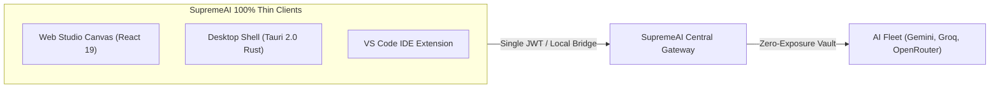

<!-- ============================================================ -->
<!-- Merged Source: docs/clients/SUPREME_CLIENTS_MASTER.md -->
<!-- ============================================================ -->

# 💻 SupremeAI Clients & Thin-Runtime Master Plan

**Document Version:** 3.0.0 (Canonical Source of Truth)  
**System Phase:** **Phase 3: Self-Evolving & Multi-Agent Swarm**  
**Classification:** Desktop (Tauri), VS Code Extension & Thin-Client Runtime

---

## 🎯 1. Thin-Client Philosophy: Brand & Key Immunity

> "All client surfaces (Desktop, VS Code, Web, Mobile) are 100% Thin Clients. No third-party API keys, vendor endpoints, or backend credentials are ever stored or exposed on client machines."

সমস্ত ক্লায়েন্ট শুধুমাত্র একটি নিরাপদ রিলে/গেটওয়ে হিসেবে কাজ করে এবং ব্যাকএন্ড API-র মাধ্যমে কমান্ড পাঠায় ও রিয়েল-টাইম ক্যানভাস স্ট্রিম রিসিভ করে।



---

## 🖥️ 2. Desktop Application (Tauri 2.0 Architecture)

- **Rust Lightweight Core:** ইলেকট্রনের তুলনায় ১০ গুণ কম মেমোরি খরচে (RAM < ৬০ MB) নেটিভ ওয়েবভিউ রেন্ডার করে।
- **Local Workspace Bridge:** ইউজারের লোকাল ফাইলসিস্টেম ও টার্মিনাল নিরাপদে ব্যাকএন্ড AI এজেন্টের সাথে সিঙ্ক করতে লোকাল ব্রিজ ব্যবহার করা হয়।
- **Native OS Integration:** সিস্টেম ট্রে মিনিমাইজেশন, ডার্ক মোড সিনক্রোনাইজেশন, এবং অফলাইন নোটিফিকেশন সিস্টেম।

---

## 🧩 3. VS Code Extension Architecture

- **Context-Aware Coding Companion:** ওপেন থাকা ফাইল, কার্সর পজিশন এবং গিট হিস্ট্রি স্বয়ংক্রিয়ভাবে ব্যাকএন্ড `DevAdapter`-এ পাঠায়।
- **Inline Ghost Autocomplete:** অতি দ্রুত গতিতে (Latency < ১৫০ms) কোড সাজেশন ও ইনলাইন ডিফ রেন্ডার করে।
- **Command Palette Integration:** `Ctrl+Shift+P` থেকে সরাসরি সুপ্রীম কমান্ড প্যালেট অ্যাক্সেস।

---

## 📱 4. Multi-Platform Design System Alignment

- সমস্ত ক্লায়েন্ট `@supremeai/design-tokens` থেকে অটো-জেনারেটেড CSS Variables, JSON এবং Flutter Dart টোকেন ব্যবহার করে, ফলে সব ডিভাইসে অভিন্ন **Dark-Neon (#09090b, #00f3ff, #a855f7)** ইউজার এক্সপেরিয়েন্স বজায় থাকে।

---
*Canonical Master Plan — Supersedes all legacy desktop, client and extension planning drafts.*


<!-- ============================================================ -->
<!-- Merged Source: docs/integration/CONNECTION_EXAMPLES.md -->
<!-- ============================================================ -->

# SupremeAI Connection Examples

These examples describe the user-facing contract. They are not a substitute for provider consent or secret management.

## Remote MCP server

```yaml
connect: https://mcp.example.com/mcp
```

Expected result: SupremeAI discovers the server, registers it for the current tenant, and exposes only policy-approved capabilities.

## REST API

```yaml
connect: https://api.example.com
kind: api
```

Expected result: the HTTP adapter discovers the declared API contract or uses a previously approved adapter profile. Authentication is handled through the secret broker.

## OAuth service

```yaml
connect: https://github.com
kind: oauth
```

Expected result: SupremeAI identifies the connector and opens the provider-required consent path. Tokens remain outside application configuration and logs.

## Local MCP bridge

```yaml
connect: stdio://my-local-mcp
kind: mcp
```

Expected result: a trusted local bridge is registered. Local process configuration remains an operator concern; tenant policy and audit remain SupremeAI concerns.

## Supabase or another data service

```yaml
connect: https://project.example.supabase.co
kind: service
```

Expected result: the service adapter validates the project endpoint and uses provider-managed credentials or an approved secret reference. Database access remains scoped by tenant and service policy.

## Custom tool endpoint

```yaml
connect: https://tools.example.com/manifest
kind: service
```

Expected result: SupremeAI validates the manifest, fingerprints the endpoint, applies safe defaults and publishes only verified tools.

## Administrator authority

```yaml
connection_role: admin
```

This changes the requested connection role only after actor authorization and policy evaluation. It does not grant system authority or bypass approval for high-impact actions.

## Revocation

```yaml
connection_status: revoked
```

Future invocations stop immediately and the audit trail is retained.

## Troubleshooting

| Status | Meaning | Next action |
|---|---|---|
| `pending` | Discovery or provider consent is incomplete | Complete required provider consent or wait for bounded discovery |
| `limited` | Only a safe subset is available | Inspect missing scope or provider capability |
| `error` | Endpoint, auth or protocol failed | Review the correlation ID and retry after correcting the cause |
| `revoked` | Access was intentionally disabled | Reconnect or ask an authorized admin |

Never paste access tokens into a connection line. If an endpoint is private, requires a VPN, or has no supported protocol, the backend must explain that limitation rather than pretending a URL-only connection is possible.


<!-- ============================================================ -->
<!-- Merged Source: docs/integration/MCP_INTEGRATION_HANDBOOK.md -->
<!-- ============================================================ -->

# SupremeAI Zero-Friction Integration Handbook

**Status:** Canonical design and operating guide  
**Audience:** SupremeAI customers, tenant administrators, agents and implementers

## What zero-friction means

Zero-friction belongs to **SupremeAI**, not to MCP alone. MCP, REST APIs, OAuth services and internal tools are different capability transports, but they enter SupremeAI through one governed connection path.

The user-facing promise is intentionally small:

```text
Connect a capability: https://example.com/mcp
```

SupremeAI then discovers the endpoint, registers it for the correct tenant, applies the least-privilege default, and makes approved capabilities available through the central control interface. Backend discovery, retries, credential handling, policy checks and audit logging remain behind the interface.

Zero-friction does not mean zero security. A URL never grants authority by itself. Credentials, provider consent, tenant policy and risk checks still apply.

## Customer path

For an already public, compatible endpoint, the customer supplies one connection line:

```yaml
connect: https://mcp.example.com/mcp
```

Expected behavior:

1. SupremeAI normalizes and validates the URL.
2. The endpoint is discovered and fingerprinted.
3. Supported tools/resources and required authentication are recorded.
4. The connection is registered under the authenticated tenant.
5. The customer receives the least-privilege role allowed by tenant policy.
6. Safe, read-only or otherwise permitted capabilities become queryable everywhere the customer is authorized.

If the provider requires OAuth or a secret, the user completes only that provider-required consent step. SupremeAI must not ask users to expose tokens in chat or configuration files.

## Administrator authority

Basic connection needs no extra permission line. An administrator changes the connection role only when broader authority is intentionally required:

```yaml
connection_role: admin
```

The role change is evaluated against tenant policy, risk and the administrator's own authority, then recorded in the audit trail. It does not bypass approval requirements for destructive, financial, privacy-sensitive or otherwise high-impact actions.

A safer explicit form is available when a tenant wants capability-level control:

```yaml
connection_role: user
allow: [read, search, draft]
```

## One model for every capability

The same SupremeAI entry point applies to:

| Capability | User-facing input | Internal transport |
|---|---|---|
| MCP server | URL | Streamable HTTP, SSE or local bridge |
| REST API | URL | HTTP adapter |
| OAuth service | Service URL or connector ID | OAuth authorization and token broker |
| Internal service | Service identifier or URL | Governed service adapter |
| Browser capability | Approved site URL | Browser worker |

The transport may differ. Tenant scope, policy, permission, risk, observability and lifecycle must not.

## What users should not need to know

Users should not need to understand registry tables, adapter classes, health probes, token rotation, retry policy, circuit breakers, audit event schemas or worker placement. Those are implementation concerns owned by the central SupremeAI control plane.

## Failure behavior

A failed connection becomes an observable lifecycle state, not a silent failure:

- `pending`: accepted and awaiting discovery or consent;
- `active`: discovered, policy-approved and usable;
- `limited`: connected but only a safe subset is available;
- `error`: discovery or provider access failed;
- `revoked`: disabled by the user, admin or policy.

SupremeAI retries transient failures with bounded backoff, preserves the last known safe metadata, and reports a short actionable status. It never reports a capability as active before validation succeeds.

## Security commitments

- Every connection is tenant-scoped and actor-scoped.
- URL validation prevents unsafe redirects, private-network abuse and unsupported protocols.
- Secrets are stored in a secret manager or provider-managed token broker, never in repository files or logs.
- Default access is least privilege; authority is never inferred from a URL.
- High-impact actions still require policy checks and human approval where configured.
- Connect, change, invoke, failure, revoke and delete events are auditable.
- Disconnecting revokes future use while preserving an audit record.

## Canonical principle

> Customers should experience SupremeAI as one simple system. Integration complexity may remain in the backend, but authority, policy, tenant boundaries and verification must remain centralized in SupremeAI.

See [ZERO_FRICTION_BACKEND_SPEC.md](./ZERO_FRICTION_BACKEND_SPEC.md), [PERMISSION_MODEL.md](./PERMISSION_MODEL.md), and [CONNECTION_EXAMPLES.md](./CONNECTION_EXAMPLES.md).

---

## Bengali quick explanation

ব্যবহারকারীর কাজ যতটা সম্ভব এক লাইনে থাকবে: capability-এর URL দিন। SupremeAI নিজে discovery, validation, tenant scope, default permission, audit এবং failure handling করবে। Full authority দরকার হলে admin শুধু role পরিবর্তন করবে; URL নিজে কখনও authority দেবে না।

"Zero-friction SupremeAI" মানে frontend/customer/admin-এর কাছে একটাই সহজ connection model—backend-এর নিরাপত্তা ও governance বাদ দেওয়া নয়।

---

**Related architecture:** [SUPREMEAI_CORE_CONSTITUTION.md](../architecture/SUPREMEAI_CORE_CONSTITUTION.md)

**Version:** 1.0


<!-- ============================================================ -->
<!-- Merged Source: docs/integration/PERMISSION_MODEL.md -->
<!-- ============================================================ -->

# SupremeAI Connection Permission Model

## Principle

Zero-friction means minimal user effort, not automatic authority. A connection URL identifies a capability; it does not authorize actions.

## Effective authority

```text
Effective authority =
  actor role
  ∩ tenant policy
  ∩ connection role
  ∩ capability action policy
  ∩ risk / approval policy
  ∩ provider-granted scope
```

The narrowest applicable boundary wins.

## Roles

| Role | Default use | Meaning |
|---|---|---|
| `user` | Customer connection | Read, search, compose and other explicitly allowed low-risk actions |
| `admin` | Tenant administrator | Broader tenant-scoped management, still subject to risk and approval |
| `system` | Platform automation | Reserved for governed internal automation; never granted by a URL |

Roles are labels for policy evaluation, not unconditional bypasses.

## One-line operations

Default connection:

```yaml
connect: https://example.com/mcp
```

Optional administrator change:

```yaml
connection_role: admin
```

The backend must verify that the actor may make this change. A role change may still require provider consent, re-authentication, human approval or a narrower action allow-list.

## Safe defaults

- deny by default when capability risk is unknown;
- prefer read-only access during discovery;
- do not inherit admin authority from the connector owner unless tenant policy explicitly says so;
- keep provider scopes no broader than the requested capability set;
- revoke immediately for future invocations when a connection is disabled;
- retain an immutable audit record of grants, changes and revocations.

## Sensitive actions

Deletes, external messages, financial actions, data exports, credential changes, code execution and tenant administration require their own policy decision. `admin` does not automatically remove human approval or safety checks.

## Revocation

Revocation should be as simple as:

```yaml
connection_status: revoked
```

Revocation blocks future use, invalidates cached authorization, and records who revoked it and why. Existing provider tokens must also be revoked or expired according to provider support.


<!-- ============================================================ -->
<!-- Merged Source: docs/integration/ZERO_FRICTION_BACKEND_SPEC.md -->
<!-- ============================================================ -->

# Zero-Friction SupremeAI Backend Specification

**Status:** Canonical implementation specification  
**Scope:** All external and internal capability connections

## 1. Objective

Expose one governed connection contract to customers and administrators while keeping transport-specific complexity inside the SupremeAI control plane. Zero-friction is a product and architecture property of SupremeAI; it is not permission to weaken authentication, authorization or verification.

## 2. Canonical connection record

```yaml
Connection:
  id: uuid
  tenant_id: uuid
  created_by: actor_id
  kind: mcp | api | oauth | service | browser
  endpoint: normalized_uri_or_identifier
  display_name: discovered_or_user_supplied
  fingerprint: stable_endpoint_fingerprint
  status: pending | active | limited | error | revoked
  role: user | admin | system
  allowed_actions: capability_policy
  discovered_capabilities: capability_metadata[]
  credential_ref: secret_manager_reference_or_null
  policy_version: string
  last_verified_at: timestamp
  created_at: timestamp
  updated_at: timestamp
```

`tenant_id`, `created_by`, `endpoint`, `kind`, status and policy metadata are mandatory. Secrets, access tokens and raw authorization headers must never be stored in this record or emitted to logs.

## 3. Unified lifecycle

```text
Intent / URL
  → Normalize and validate
  → Resolve tenant and actor
  → Discover or request provider consent
  → Apply policy and least privilege
  → Register centrally
  → Health-check and verify
  → Publish safe capabilities
  → Invoke through policy gateway
  → Audit and learn
```

Every transport uses this lifecycle. Adapters may implement different protocol details but may not create independent permission or audit systems.

## 4. Discovery and validation

The connection service must:

1. accept only supported schemes and endpoint forms;
2. reject malformed, disallowed, private-network and unsafe redirect targets;
3. resolve redirects under an explicit allow policy;
4. identify protocol and provider without trusting display metadata;
5. discover tools/resources/schemas using bounded timeouts and response limits;
6. validate declared capabilities against observed behavior where feasible;
7. detect authentication requirements without collecting credentials in plaintext;
8. store a stable fingerprint to prevent accidental duplicate registration;
9. mark the connection `limited` when discovery is incomplete but safe read-only access is possible;
10. produce an audit event for every state transition.

Discovery metadata is untrusted input. Tool names and descriptions must not override SupremeAI policy or instructions.

## 5. Permission and authority

The default role is the least-privilege role allowed by tenant policy, normally `user`. Role resolution is:

```text
actor authority
  ∩ tenant policy
  ∩ connection policy
  ∩ capability risk
  ∩ provider scope
```

An administrator may submit a one-line role change, but the backend must re-authorize the actor, compute the effective permissions, invalidate stale policy caches, and audit the decision. `system` is never a customer shortcut; it is reserved for explicitly governed platform automation.

See [PERMISSION_MODEL.md](./PERMISSION_MODEL.md) for the normative rules.

## 6. Central registry and control interface

The registry is the source of truth for connection identity, tenant scope, lifecycle, policy version and capability metadata. Chat, Dashboard, agents, workflows and MCP control tools must query the same registry and invoke through the same policy gateway.

The registry may begin as a version-controlled configuration projection, but runtime authority must be held by a transactional, tenant-aware store when connections are mutable. A YAML file must not be treated as a security boundary.

Required operations:

- `connect(endpoint, kind?)`
- `inspect(connection_id)`
- `list(tenant_id, actor_id)`
- `set_role(connection_id, role)`
- `allow(connection_id, actions)`
- `revoke(connection_id)`
- `verify(connection_id)`
- `invoke(connection_id, capability, input)`

All operations require authenticated actor context and produce correlation IDs.

## 7. Tenant isolation

Every read, write, discovery result, credential reference, capability invocation and audit query must be scoped to the tenant. Cross-tenant access is denied by default. Shared platform capabilities must be explicitly marked as platform-owned and still evaluated against the requesting tenant's policy.

## 8. Reliability and graceful degradation

Use bounded timeouts, exponential backoff, circuit breakers and idempotent registration. Provider failure must not erase the last known policy or silently expand access. If a provider is unavailable, mark it `error` or `limited`, preserve evidence, and expose a truthful status.

## 9. Audit events

At minimum record:

```yaml
ConnectionAuditEvent:
  id: uuid
  tenant_id: uuid
  actor_id: uuid
  connection_id: uuid
  action: connect | discover | authorize | role_change | invoke | error | revoke
  result: success | denied | failed | limited
  policy_version: string
  correlation_id: string
  safe_metadata: json
  occurred_at: timestamp
```

Never log secrets, full private payloads or provider tokens. Redact sensitive values before persistence.

## 10. Acceptance criteria

- A supported remote endpoint can be requested using one user-facing connection line.
- No URL alone grants authority.
- Default access is tenant-scoped and least privilege.
- An authorized admin can change a role with one logical configuration line.
- All transports use the same registry, policy gateway and audit model.
- Tenant isolation is enforced at every operation boundary.
- Failed discovery is visible and cannot be mistaken for an active connection.
- High-impact actions remain subject to risk and approval policy.

## 11. Non-goals

This specification does not promise that every provider can be connected without provider consent, credentials or licensing. It does not define a frontend wizard, expose secrets, or replace backend authentication and authorization.
