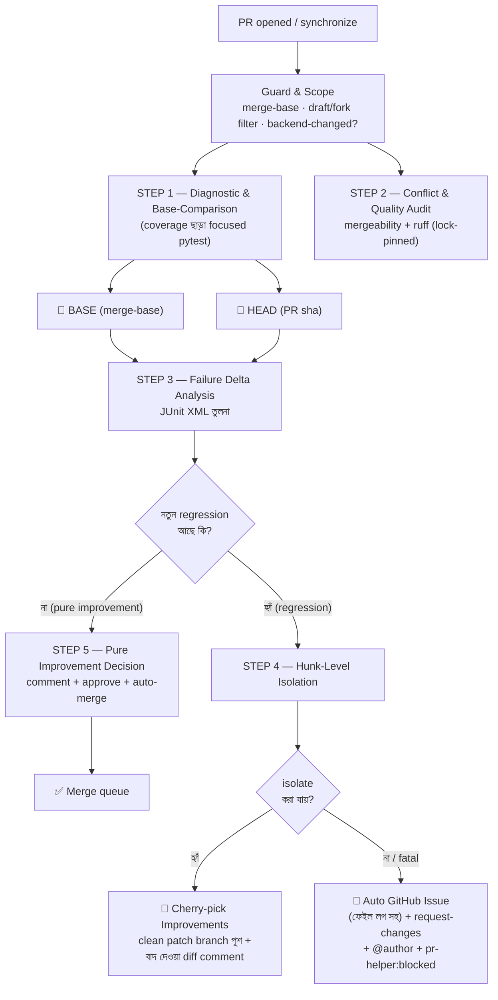
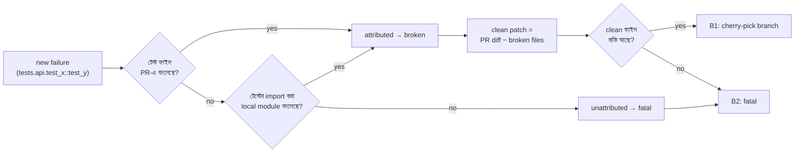
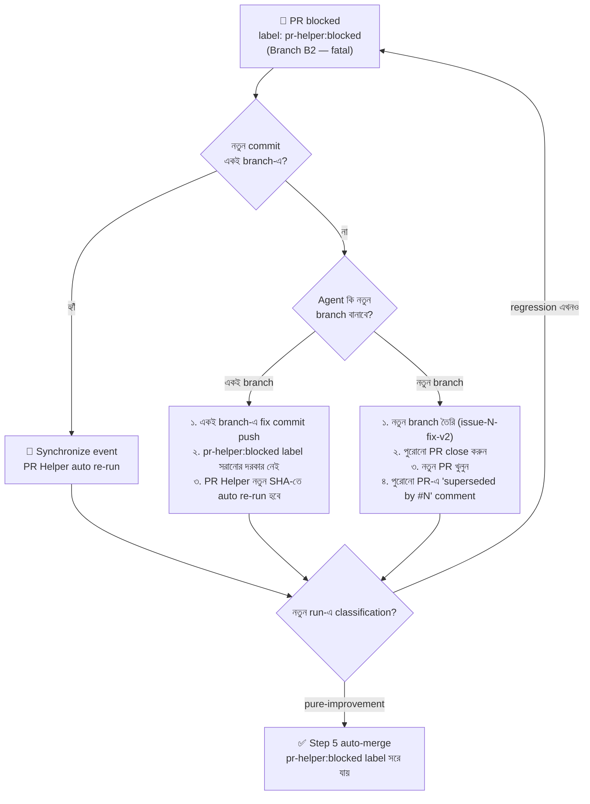

# OPS-05 — PR Helper Lifecycle (State-based Locking)

> ⚠️ **SUPERSEDED (2026-09-24) — OWNER DECISION: AUTOMATIC MERGING REMOVED.**
> The auto-merge / AI-auto-fix / hunk-isolation machinery (former Steps 4, 5, 5.5)
> has been deleted from `.github/workflows/pr-helper.yml`. The helper is now
> **diagnostic-only** (Steps 1–3 below still run and post evidence).
> **Merging is a human decision**: once `Branch Naming Guard` and
> `🚦 Unified PR Gate` are green, the maintainer merges the PR manually.
> The lifecycle description below is retained for historical reference only.

> **Workflow:** `.github/workflows/pr-helper.yml` (Orchestrated by `.github/workflows/pr-pipeline.yml`) · **Scripts:** `.github/scripts/pr_helper/`
> **ফিলসফি:** PR একটি **state machine** — প্রতিটি PR-এর state শুধুমাত্র প্রমাণ (test delta, conflict, quality) দিয়ে নির্ধারিত হয়। GitHub/AWS/Google-এর মতো industry-standard state-based locking lifecycle।

## 🗺️ পূর্ণ Lifecycle Diagram

## 📊 তিন ধরনের Delta (Step 3-এর সিদ্ধান্ত ইঞ্জিন)

| Bucket | অর্থ | Helper-এর প্রতিক্রিয়া |
|---|---|---|
| 🛑 **new_failures** | HEAD-এ ভাঙা, BASE-এ ছিল না → **এই PR-এর অপরাধ** | Branch B (Step 4) |
| 🟡 **pre_existing** | BASE-এও ভাঙা ছিল → PR-এর দোষ নয় | সহনীয় — merge আটকায় না |
| 🟢 **fixed** | BASE-এ ভাঙা ছিল, PR ঠিক করেছে | improvement signal |

**Fail-closed নীতি:** HEAD-এর diagnostic ডেটা না পেলে বা classification অজানা থাকলে কখনোই approve হয় না। BASE ডেটা না থাকলে HEAD-এর সব failure `new` গণ্য হয় (সবচেয়ে conservative)।

## 🔀 দুই Branch-এর সিদ্ধান্ত টেবিল

| Condition | Route | Action |
|---|---|---|
| new = 0 ∧ conflict = none ∧ lint = pass | **Branch A** | Comment + Approve + `gh pr merge --auto --squash` + label `pr-helper:auto-approved` |
| new > 0 ∧ সব failure attributed ∧ clean ফাইল বাকি | **Branch B1** | `pr-helper/clean-pr#N` branch (ভাঙা ফাইল বাদে) + excluded-diff comment + label `pr-helper:isolated` |
| new > 0 ∧ attribution ব্যর্থ / কিছু বাদ দেওয়ার নেই | **Branch B2** | Auto issue (স্নিপেট সহ) + `request-changes` + @author + label `pr-helper:blocked` |

## 🧩 Attribution কীভাবে কাজ করে (Step 4)

Deterministic, stdlib-only (`xml.etree` + `git diff`) — কোনো LLM/শেক-হ্যান্ড নেই, তাই একই ইনপুটে একই সিদ্ধান্ত।

## 💰 খরচ মডেল

| বিষয় | সিদ্ধান্ত |
|---|---|
| Marker set | `critical or important` — fast, merge-blocking subset |
| Coverage | বন্ধ (`-o addopts=...` override) — CI-এর coverage gate আলাদা |
| BASE+HEAD parallel | একই runner time-এ দুটো চলে; `poetry.lock` cache শেয়ার হয় |
| Docs/frontend-only PR | diag জব skip → তাৎক্ষণিক pure-improvement (runner ~০) |
| Full matrix | `ci.yml` আগের মতোই merge gate — helper শুধু decision সহায়ক |

## 🔐 Permission ও নিরাপত্তা

- **ক্যানোনিকাল টোকেন রিকোয়ারমেন্ট (`GITHUB_TOKEN`):**
  PR Helper-এর স্বয়ংক্রিয় একশনগুলোর (Labeling, PR Approve/Merge, Issue Creation) জন্য টোকেনের নিচের পারমিশন থাকা বাধ্যতামূলক:
  - `issues: write` — লেবেল অ্যাসাইন (`pr-helper:auto-approved`, `pr-helper:blocked`), স্ট্যাটাস আপডেট ও ব্লকার ইস্যু তৈরির জন্য।
  - `pull-requests: write` — PR রিভিউ, এপ্রুভাল, কমেন্ট এবং অটো-মার্জ এক্সিকিউশনের জন্য।
  - `contents: write` — আইসোলেটেড প্যাচ ব্রাঞ্চ (`pr-helper/clean-pr#N`) তৈরি ও পুশের জন্য।
- **Fork PR সেফগার্ড:** Fork PR-এ helper চলে না (same-repo guard) — টোকেন শুধু same-repo-তে write করে।
- **Self-Approval Guard:** নিজের PR নিজে approve করা GitHub-এ নিষিদ্ধ — সেক্ষেত্রে approve/auto-merge skip (notice সহ), classification comment থাকে।
- **Non-Destructive Branches:** Push শুধু `pr-helper/clean-pr#N` নামের আলাদা branch-এ — **কখনোই PR branch force-push নয়** (author-এর consent ছাড়া)।
- **স্ক্রিপ্ট চেকাউট স্ট্যাবিলিটি (PR #834 ফিক্স):** Step 3 ও Step 4-এ হেল্পার স্ক্রিপ্টগুলো (`delta_analysis.py`, `hunk_isolation.py`) সর্বদা `base_sha` (`main`) থেকে চেকাউট করা হয়। এর ফলে পুরনো ব্রাঞ্চগুলোতে স্ক্রিপ্ট ডিরেক্টরি অনুপস্থিত থাকলেও `[Errno 2] No such file or directory` সমস্যা তৈরি হয় না।
- সব actions SHA-pinned (repo convention)।

## 🧪 রান করানো

- Automatic: প্রতি PR-এ (opened/synchronize/reopened)।
- Manual: `gh workflow run pr-helper.yml -f pr_number=123`

## 📁 ফাইল ম্যাপ ও সম্পর্কিত স্পেক

| ফাইল | ভূমিকা |
|---|---|
| `.github/workflows/pr-helper.yml` | 6 জব: guard → step1 (matrix base/head) → step2 → step3 → step5 / step4 |
| `.github/scripts/pr_helper/delta_analysis.py` | Step 3: JUnit delta → classification + GitHub outputs |
| `.github/scripts/pr_helper/hunk_isolation.py` | Step 4: attribution → clean patch / fatal |
| Artifacts | `pr-helper-diag-base/head`, `pr-helper-delta`, `pr-helper-isolation` (7-14 দিন retention) |
| [`OPS-06-MULTI-AGENT-BRANCHING-LIFECYCLE.md`](OPS-06-MULTI-AGENT-BRANCHING-LIFECYCLE.md) | মাল্টি-এজেন্ট শর্ট-লিভড ব্রাঞ্চিং, মিউটেক্স লকিং ও রিবেস লাইফসাইকেল |
| [`GITHUB_TOKEN_CANONICALIZATION_PLAN.md`](../security/GITHUB_TOKEN_CANONICALIZATION_PLAN.md) | একক ক্যানোনিকাল GITHUB_TOKEN আর্কিটেকচার ও প্ল্যাটফর্ম ভেরিফিকেশন |

---

## 🔄 GAP-12 Fix: After-Block Recovery Protocol

যখন PR Helper কোনো PR-কে `pr-helper:blocked` লেবেল দেয় (Branch B2 — unattributable regression), তখন Agent কী করবে তার স্পষ্ট protocol নিচে দেওয়া হলো:

### Step-by-Step Recovery Flow

### Recovery Checklist (Agent-এর জন্য)

| ধাপ | করণীয় | স্বয়ংক্রিয়? |
|---|---|---|
| ১ | `pr-helper:blocked` issue comment পড়ে root cause বুঝুন | Manual |
| ২ | প্রয়োজনে `gh run view` দিয়ে Step 3/4 logs পড়ুন | Manual |
| ৩ | ফিক্স করুন (ruff --fix আগে, তারপর manual) | Manual |
| ৪ | একই branch-এ commit push করুন | Manual |
| ৫ | `synchronize` event ট্রিগার হবে → PR Helper auto re-run | ✅ Automatic |
| ৬ | পুরোনো `pr-helper:blocked` label সরানোর দরকার নেই — নতুন run পাস করলে স্বয়ংক্রিয়ভাবে Step 5 মার্জ করবে | ✅ Automatic |
| ৭ | যদি নতুন run-ও block করে → Step ১-এ ফিরে যান | Manual |

### Label Lifecycle

- `pr-helper:blocked` → যখন Step 4 attribution ব্যর্থ (Branch B2)
- `pr-helper:isolated` → যখন Step 4 cherry-pick সফল (Branch B1, নতুন clean branch)
- `pr-helper:auto-approved` → যখন Step 5 pure-improvement (Branch A)
- `pr-helper:self-modification` → যখন PR Helper নিজের ফাইল পরিবর্তন করে (GAP-06, SG-11)

### Important Notes

- **একই branch-এ push করলে synchronize ট্রিগার হয়** — নতুন PR খোলার দরকার নেই।
- **pr-helper:blocked label ম্যানুয়ালি সরাবেন না** — নতুন run পাস করলে স্বয়ংক্রিয়ভাবে Step 5 merge করবে, blocked label থাকলেও নতুন SHA-তে কনফ্লিক্ট নেই।
- **Force-push নিষিদ্ধ** — author-এর consent ছাড়া branch history rewrite করবেন না।
- **নতুন branch বানালে** পুরোনো PR-এ "superseded by #N" comment করুন, যাতে reviewer ট্র্যাক রাখতে পারেন।

---

*GAP-12 fix — সেপ্টেম্বর ২০২৬ · PR Helper Block Recovery Protocol*
