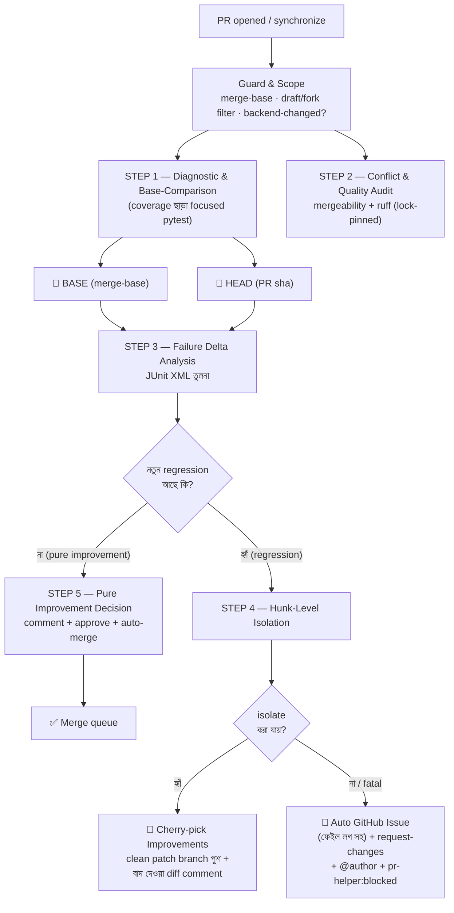
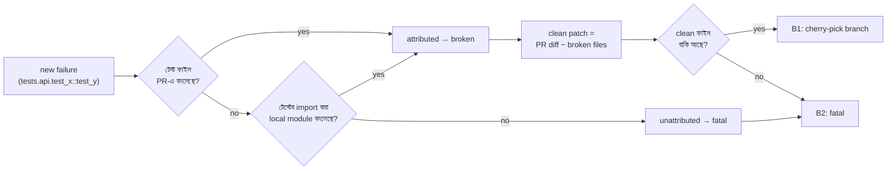

# OPS-05 — PR Helper Lifecycle (State-based Locking)

> **Workflow:** `.github/workflows/pr-helper.yml` · **Scripts:** `.github/scripts/pr_helper/`
> **ফিলসফি:** PR একটি **state machine** — প্রতিটি PR-এর state শুধুমাত্র প্রমাণ (test delta, conflict, quality) দিয়ে নির্ধারিত হয়। GitHub/AWS/Google-এর মতো industry-standard state-based locking lifecycle।

## 🗺️ পূর্ণ Lifecycle Diagram

## 📊 তিন ধরনের Delta (Step 3-এর সিদ্ধান্ত ইঞ্জিন)

| Bucket | অর্থ | Helper-এর প্রতিক্রিয়া |
|---|---|---|
| 🛑 **new_failures** | HEAD-এ ভাঙা, BASE-এ ছিল না → **এই PR-এর অপরাধ** | Branch B (Step 4) |
| 🟡 **pre_existing** | BASE-এও ভাঙা ছিল → PR-এর দোষ নয় | সহনীয় — merge আটকায় না |
| 🟢 **fixed** | BASE-এ ভাঙা ছিল, PR ঠিক করেছে | improvement signal |

**Fail-closed নীতি:** HEAD-এর diagnostic ডেটা না পেলে বা classification অজানা থাকলে কখনোই approve হয় না। BASE ডেটা না থাকলে HEAD-এর সব failure `new` গণ্য হয় (সবচেয়ে conservative)।

## 🔀 দুই Branch-এর সিদ্ধান্ত টেবিল

| Condition | Route | Action |
|---|---|---|
| new = 0 ∧ conflict = none ∧ lint = pass | **Branch A** | Comment + Approve + `gh pr merge --auto --squash` + label `pr-helper:auto-approved` |
| new > 0 ∧ সব failure attributed ∧ clean ফাইল বাকি | **Branch B1** | `pr-helper/clean-pr#N` branch (ভাঙা ফাইল বাদে) + excluded-diff comment + label `pr-helper:isolated` |
| new > 0 ∧ attribution ব্যর্থ / কিছু বাদ দেওয়ার নেই | **Branch B2** | Auto issue (স্নিপেট সহ) + `request-changes` + @author + label `pr-helper:blocked` |

## 🧩 Attribution কীভাবে কাজ করে (Step 4)

Deterministic, stdlib-only (`xml.etree` + `git diff`) — কোনো LLM/শেক-হ্যান্ড নেই, তাই একই ইনপুটে একই সিদ্ধান্ত।

## 💰 খরচ মডেল

| বিষয় | সিদ্ধান্ত |
|---|---|
| Marker set | `critical or important` — fast, merge-blocking subset |
| Coverage | বন্ধ (`-o addopts=...` override) — CI-এর coverage gate আলাদা |
| BASE+HEAD parallel | একই runner time-এ দুটো চলে; `poetry.lock` cache শেয়ার হয় |
| Docs/frontend-only PR | diag জব skip → তাৎক্ষণিক pure-improvement (runner ~০) |
| Full matrix | `ci.yml` আগের মতোই merge gate — helper শুধু decision সহায়ক |

## 🔐 Permission ও নিরাপত্তা

- Fork PR-এ helper চলে না (same-repo guard) — token শুধু same-repo-তে write করে।
- নিজের PR approve করা GitHub-এ নিষিদ্ধ — সেক্ষেত্রে approve/auto-merge skip (notice সহ), classification comment থাকে।
- Push শুধু `pr-helper/clean-pr#N` নামের আলাদা branch-এ — **কখনোই PR branch force-push নয়** (author-এর consent ছাড়া)।
- সব actions SHA-pinned (repo convention)।

## 🧪 রান করানো

- Automatic: প্রতি PR-এ (opened/synchronize/reopened)।
- Manual: `gh workflow run pr-helper.yml -f pr_number=123`

## 📁 ফাইল ম্যাপ

| ফাইল | ভূমিকা |
|---|---|
| `.github/workflows/pr-helper.yml` | 6 জব: guard → step1 (matrix base/head) → step2 → step3 → step5 / step4 |
| `.github/scripts/pr_helper/delta_analysis.py` | Step 3: JUnit delta → classification + GitHub outputs |
| `.github/scripts/pr_helper/hunk_isolation.py` | Step 4: attribution → clean patch / fatal |
| Artifacts | `pr-helper-diag-base/head`, `pr-helper-delta`, `pr-helper-isolation` (7-14 দিন retention) |
