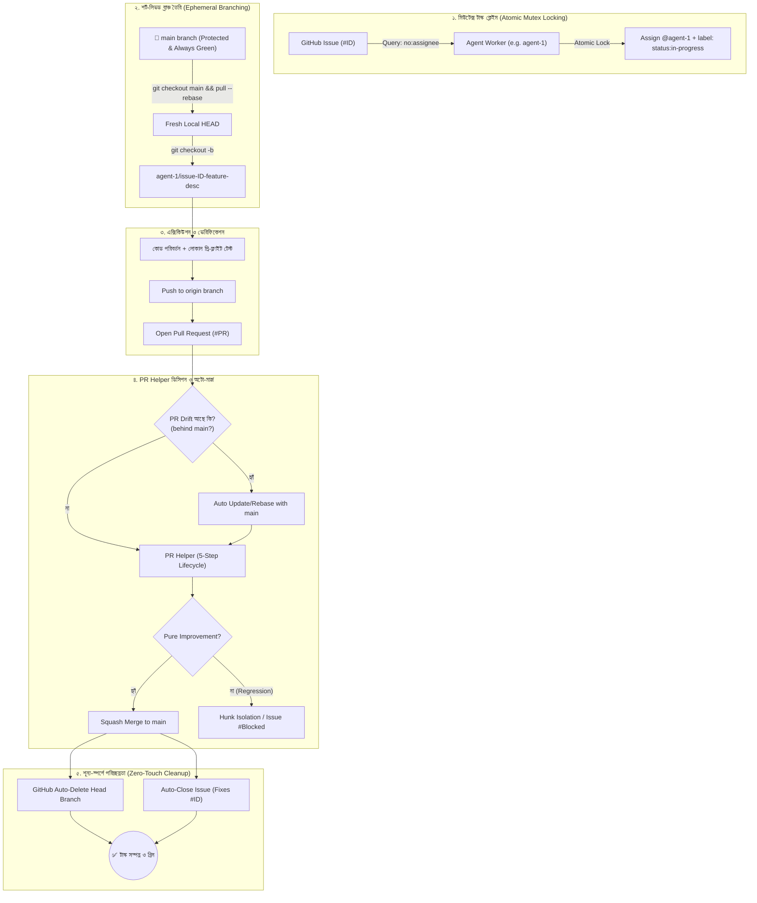
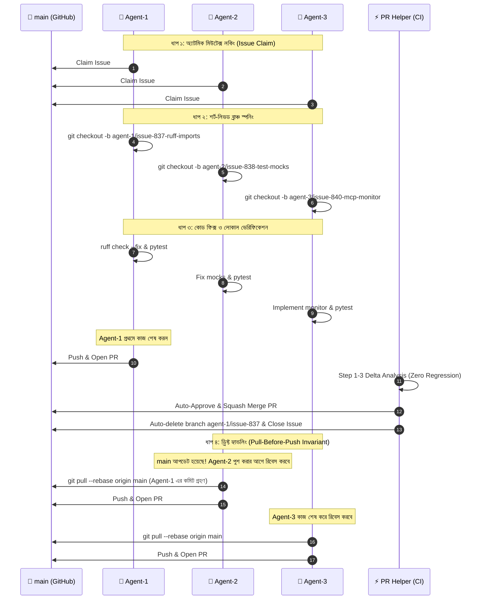

# OPS-06 — Multi-Agent Ephemeral Branching Lifecycle

> **সম্পর্কিত ডকুমেন্ট:** [`OPS-05-PR-HELPER-LIFECYCLE.md`](file:///f:/supremeai/docs/master_docs/OPS-05-PR-HELPER-LIFECYCLE.md) · [`OPS-07-EXTERNAL-AI-DEVELOPER-LIFECYCLE.md`](file:///f:/supremeai/docs/master_docs/OPS-07-EXTERNAL-AI-DEVELOPER-LIFECYCLE.md) · [`OPS-08-SUPREMEAI-RUNTIME-WORK-PROCESS.md`](file:///f:/supremeai/docs/master_docs/OPS-08-SUPREMEAI-RUNTIME-WORK-PROCESS.md) · `AGENTS.md`  
> **উদ্দেশ্য:** সমান্তরালভাবে একাধিক এআই এজেন্ট (`agent-1`, `agent-2`, ..., `agent-N`) যাতে কোনো ধরনের রেস-কন্ডিশন, কোড ওভাররাইট বা ব্রাঞ্চ-ড্রিফ্ট ছাড়া সম্পূর্ণ আইসোলেটেড ও জিরো-কনফ্লিক্ট পরিবেশে কাজ করতে পারে তার প্রমিত ফ্রেমওয়ার্ক।

---

## 🗺️ ১. আর্কিটেকচারাল লাইফসাইকেল ডায়াগ্রাম



---

## 🛡️ ২. চারটি অত্যাবশ্যকীয় সেফগার্ড (Bulletproof Safeguards)

### সেফগার্ড ১: স্টেল ব্রাঞ্চ অটো-রিবেস গার্ড (PR Drift Handling)
* **সমস্যা:** যখন `agent-1` এবং `agent-2` একসাথে ভিন্ন ফিচারে কাজ শুরু করে, `agent-1`-এর PR আগে মার্জ হয়ে গেলে `agent-2`-এর PR সাথে সাথে `main` থেকে পিছিয়ে পড়ে (`out-of-date`)।
* **সমাধান:** 
  1. `PR Helper`-এর শুরুতেই GitHub-এর নেটিভ **Update Branch API** (`PUT /repos/{owner}/{repo}/pulls/{id}/update-branch`) ট্রিগার করা হবে।
  2. কোনো বিপজ্জনক ফোর্স-পুশ (`git push --force`) ছাড়াই গিটহাব নিজে ব্রাঞ্চটিকে রিবেস করে নেবে।
  3. যদি রিবেসে কনফ্লিক্ট দেখা দেয়, PR Helper তাত্ক্ষণিক `conflicts: true` ফ্ল্যাগ করে ডেভেলপার/এজেন্টকে সতর্ক করবে।

### সেফগার্ড ২: শূন্য-স্পর্শে ব্রাঞ্চ রিমুভাল (Auto Branch Deletion)
* **সমস্যা:** ডজন ডজন এজেন্টের ঘনঘন কাজের ফলে কয়েক দিনেই শত শত এতিম (orphaned) ব্রাঞ্চ তৈরি হয়ে রিপোজিটরি অপরচ্ছন্ন হয়ে যায়।
* **সমাধান:** 
  * GitHub Repo Settings (`Settings -> General -> Pull Requests`) থেকে **`Automatically delete head branches`** বাধ্যতামূলক অন রাখা।
  * PR মার্জ হওয়ার সাথে সাথে গিটহাব নিজে থেকেই `agent-<id>/...` ব্রাঞ্চ সার্ভার থেকে ডিলিট করে দেবে।

### সেফগার্ড ৩: অ্যাটমিক মিউটেক্স লকিং (Race Condition Protection)
* **সমস্যা:** দুটি এজেন্ট একই সময়ে একই ইস্যু পিক করলে কাজের পুনরাবৃত্তি ও কনফ্লিক্ট ঘটে।
* **সমাধান:** 
  * এজেন্ট কেবল সেই ইস্যুগুলো ফিল্টার করবে যেগুলোতে কোনো অ্যাসাইনমেন্ট নেই:
    ```bash
    gh issue list --search "no:assignee is:open" --limit 10
    ```
  * টাস্ক শুরুর পূর্বে অ্যাটমিকভাবে ক্লেইম করবে:
    ```bash
    gh issue edit <ISSUE_ID> --add-assignee "agent-1" --add-label "status:in-progress"
    ```
  * কোনো এজেন্ট ইতিমধ্যে অ্যাসাইন করা বা `status:in-progress` থাকা ইস্যুতে হাত দিতে পারবে না।

### সেফগার্ড ৪: ব্রাঞ্চ নেমিং প্যাটার্ন এনফোর্সমেন্ট (Format Guard)
* **পলিসি:** মানব ডেভেলপার ও এআই এজেন্টের ব্রাঞ্চ নাম সুস্পষ্ট ও সুনির্দিষ্ট প্যাটার্ন মেনে চলতে হবে:
  * **এজেন্ট ব্রাঞ্চ:** `agent-<id>/issue-<id>-<short-description>`
  * **হিউম্যান/রিলিজ ব্রাঞ্চ:** `feat/`, `fix/`, `hotfix/`, `perf/`, `chore/`
* **সিআই ভ্যালিডেশন স্ক্রিপ্ট (Regex Check):**
  ```bash
  BRANCH_NAME=$(git rev-parse --abbrev-ref HEAD)
  VALID_PATTERN="^(agent-[0-9]+\/issue-[0-9]+-.+|feat\/|fix\/|hotfix\/|perf\/|chore\/)"

  if [[ ! "$BRANCH_NAME" =~ $VALID_PATTERN ]]; then
    echo "::error::Invalid branch format '$BRANCH_NAME'!"
    echo "Agents must use: agent-<id>/issue-<id>-<description>"
    exit 1
  fi
  ```

---

## 📋 ৩. এজেন্টদের কর্মপদ্ধতি চেকলিস্ট (Agent Execution Protocol)

প্রতিটি এআই এজেন্ট কাজ শুরু করার সময় নিচের ধাপগুলো কঠোরভাবে অনুসরণ করবে (`AGENTS.md` Directives 9, 11, 12, 14):

| ক্রম | ধাপ | নির্দেশিত কমান্ড |
|---|---|---|
| **১** | **Task Claim** | `gh issue edit $ID --add-assignee "agent-$N" --add-label "status:in-progress"` |
| **২** | **Sync Main** | `git checkout main && git pull --rebase origin main` |
| **৩** | **Create Branch** | `git checkout -b agent-$N/issue-$ID-$DESC` |
| **৪** | **Code & Test** | কোড পরিবর্তন এবং সংশ্লিষ্ট টেস্ট চালানো (`pytest`, `vitest`, `ruff`) |
| **৫** | **Pull-Before-Push** | `git pull --rebase origin main` (লোকাল কনফ্লিক্ট গার্ড) |
| **৬** | **Push & PR** | `git push -u origin HEAD` এবং `gh pr create --title "..." --body "Fixes #$ID"` |
| **৭** | **Handoff to PR Helper** | PR তৈরি হলে স্বয়ংক্রিয়ভাবে PR Helper দায়িত্ব নেবে এবং মার্জ সম্পন্ন করবে |

---

## 🔄 ৪. দীর্ঘস্থায়ী বনাম শর্ট-লিভড ব্রাঞ্চের তুলনামূলক চিত্র

| বৈশিষ্ট্য | ❌ স্থায়ী ব্রাঞ্চ (`agent-1`, `agent-2`) | ✅ শর্ট-লিভড টাস্ক ব্রাঞ্চ (`agent-1/issue-838-...`) |
|---|---|---|
| **ব্রাঞ্চ ড্রিফ্ট (Drift)** | মারাত্মক (কয়েক দিনের ব্যবধানে মেইন থেকে দূরে চলে যায়) | **শূন্য** (প্রতিটি কাজ মেইনের সর্বশেষ স্ন্যাপশট থেকে শুরু হয়) |
| **কনফ্লিক্ট রেজোলিউশন** | জটিল ও বড় মাপের মার্জ কনফ্লিক্ট | **সহজ ও বিচ্ছিন্ন** (সর্বোচ্চ ১-২টি ফাইল) |
| **ব্লেম ও ট্রেসেবিলিটি** | কার জন্য টেস্ট ভেঙেছে বোঝা অসম্ভব | **১০০% স্পষ্ট** (নির্দিষ্ট ইস্যু ও PR-এর সাথে যুক্ত) |
| **PR Helper সামঞ্জস্য** | ডেল্টা অ্যানালাইসিস বিভ্রান্ত হয় | **নিখুঁত** (বেস বনাম হেডের ডেল্টা পরিষ্কার থাকে) |
| **কোডবেস স্বাস্থ্য** | ব্রাঞ্চে মৃত কোড জমে থাকে | **সবসময় পরিষ্কার** (মার্জের সাথে সাথে ব্রাঞ্চ ডিলিট) |

---

## 🤖 ৫. প্র্যাকটিক্যাল মাল্টি-এজেন্ট কনকারেন্ট ওয়ার্কফ্লো (Agent-1, Agent-2, Agent-3 সিঙ্ক)

যখন একাধিক এজেন্ট (`Agent-1`, `Agent-2`, `Agent-3` ইত্যাদি) সমান্তরালভাবে ব্যাকলগ থেকে কাজ সম্পাদন করবে, তখন তাদের কর্মপ্রণালী নিম্নরূপ কঠোর প্রটোকলে চলবে:

### ১. কনকারেন্ট এক্সিকিউশন ডায়াগ্রাম (Parallel Agent Timeline)



---

### ২. প্রতিটি এজেন্টের দায়িত্ব ও এক্সিকিউশন স্টেপস

#### 🔹 Agent-1 এর রোল (Task A):
1. **টাস্ক ডিসকভারি ও লক:**
   ```bash
   gh issue list --search "no:assignee is:open" --limit 5
   gh issue edit 837 --add-assignee "agent-1" --add-label "status:in-progress"
   gh issue comment 837 --body "🤖 Agent-1: Claimed task. Starting work on branch."
   ```
2. **ফ্রেশ ব্রাঞ্চ তৈরি:**
   ```bash
   git checkout main && git pull --rebase origin main
   git checkout -b agent-1/issue-837-ruff-imports
   ```
3. **কোড পরিবর্তন ও লোকাল প্রি-ফ্লাইট:**
   ```bash
   ruff check --fix backend/
   pytest backend/tests/ -k "test_imports" -q
   ```
4. **পুশ ও PR সাবমিশন:**
   ```bash
   git add -A && git commit -m "fix(lint): auto-remediate ruff import sorting"
   git pull --rebase origin main
   git push -u origin HEAD
   gh pr create --title "fix(lint): ruff import sorting" --body "Fixes #837\n\nAutomated fix by Agent-1."
   ```

---

#### 🔹 Agent-2 এর রোল (Task B — সমান্তরালভাবে চলছে):
1. **টাস্ক লক (Issue #837 এড়িয়ে #838 নেওয়া):**
   ```bash
   # Issue #837 ইতিমধ্যে agent-1 এর কাছে লকড, তাই Agent-2 নেবে #838
   gh issue edit 838 --add-assignee "agent-2" --add-label "status:in-progress"
   gh issue comment 838 --body "🤖 Agent-2: Claimed task. Starting mock fixes."
   ```
2. **ব্রাঞ্চ তৈরি:**
   ```bash
   git checkout main && git pull --rebase origin main
   git checkout -b agent-2/issue-838-test-mocks
   ```
3. **কোড সমাধান ও টেস্ট:**
   ```bash
   # missing mocks (StorageDispatcher, IntegrationRegistry) তৈরি
   pytest backend/tests/test_storage_dispatcher.py
   ```
4. **রিবেস গার্ড (ইনভ্যারিয়েন্ট ১১):**
   যেহেতু Agent-1 এর PR #841 ইতিমধ্যে `main`-এ মার্জ হয়েছে, Agent-2 পুশ করার আগে অবশ্যই রিবেস করবে:
   ```bash
   git pull --rebase origin main
   ```
5. **PR তৈরি ও হ্যান্ডঅফ:**
   ```bash
   git push -u origin HEAD
   gh pr create --title "fix(tests): restore storage and integration mocks" --body "Fixes #838\n\nAutomated fix by Agent-2."
   ```

---

#### 🔹 Agent-3 এর রোল (Task C — ফিচার/মনিটরিং):
1. **টাস্ক লক (পরবর্তী ফ্রি ইস্যু #840):**
   ```bash
   gh issue edit 840 --add-assignee "agent-3" --add-label "status:in-progress"
   ```
2. **ব্রাঞ্চ ও ডেভ:**
   ```bash
   git checkout main && git pull --rebase origin main
   git checkout -b agent-3/issue-840-mcp-monitor
   # কোড ডেভেলপমেন্ট ও ইউনিট টেস্ট সম্পন্ন
   ```
3. **রিবেস ও PR সাবমিশন:**
   ```bash
   git pull --rebase origin main
   git push -u origin HEAD
   gh pr create --title "feat(mcp): add cluster health telemetry probe" --body "Fixes #840\n\nAutomated PR by Agent-3."
   ```

---

### ৩. কনফ্লিক্ট ও রেস কন্ডিশন রেজোলিউশন ম্যাট্রিক্স

| সম্ভাব্য পরিস্থিতি | কারণ | স্বয়ংক্রিয় সমাধান ব্যবস্থা |
|---|---|---|
| **রেস কন্ডিশন (Mutex Collision)** | Agent-1 এবং Agent-2 একই মিলি-সেকেন্ডে একই ইস্যু পিক করার চেষ্টা করলে | GitHub Issue API লেবেল চেক: প্রথম জনের লেবেল বসবে; দ্বিতীয় এজেন্ট `already assigned` দেখে অবিলম্বে পরবর্তী `no:assignee` ইস্যুতে সুইচ করবে। |
| **ড্রিফ্ট জনিত কনফ্লিক্ট** | Agent-1 এর PR মার্জ হওয়ায় Agent-2 এর লোকাল ব্রাঞ্চ `main` থেকে পিছিয়ে পড়লে | ইনভ্যারিয়েন্ট ১১ (`git pull --rebase origin main`) লোকাল কনফ্লিক্ট তাৎক্ষণিক চিহ্নিত করে সমাধান নিশ্চিত করবে। |
| **একই ফাইলে সমান্তরাল পরিবর্তন** | ভিন্ন ভিন্ন টাস্ক হলেও Agent-1 ও Agent-2 একই কনফিগ ফাইল এডিট করলে | `git pull --rebase` চলাকালে Git 3-way merge ইঞ্জিন নন-ওভারল্যাপিং অংশ অটো-মার্জ করবে। ট্রু কনফ্লিক্ট দেখা দিলে এজেন্ট স্ট্যাশ করে ক্লিন স্টেটে রোলব্যাক করবে। |
| **PR Helper ব্লকেজ** | কোনো এজেন্টের পিআরে নতুন টেস্ট ফেইলিউর দেখা দিলে | PR Helper স্বয়ংক্রিয়ভাবে `pr-helper:blocked` লেবেল দেবে এবং ব্লকার ইস্যু তৈরি করবে। এজেন্ট তখন সমাধান করে নতুন কমিট পুশ করবে। |

---

### ৪. ক্রুশিয়াল নিয়মাবলী (Golden Rules for All Agents)
1. 🛑 **কখনোই লোকাল `main` ব্রাঞ্চে সরাসরি কমিট বা পুশ করবে না।**
2. 🛑 **কখনোই অন্য এজেন্টের চলমান ব্রাঞ্চে হাত দেবে না বা ফোর্স পুশ করবে না।**
3. 🛑 **কখনোই `status:in-progress` লেবেল থাকা ইস্যুতে হাত দেবে না।**
4. ✅ **সর্বদা একক ক্যানোনিকাল `GITHUB_TOKEN` ব্যবহার করবে (যা সকল এজেন্টের জন্য রিড/রাইট পারমিশনযুক্ত)।**
5. ✅ **PR টাইটেলে ও বডিতে অবশ্যই `Fixes #<ID>` উল্লেখ করবে যাতে মার্জ হওয়ার সাথে সাথে ইস্যু স্বয়ংক্রিয়ভাবে ক্লোজ হয়ে যায়।**

---

### ৫. পলিমরফিক এজেন্ট অ্যাসাইনমেন্ট (SupremeAI Self-Developer Capability)

> 👑 **প্রিন্সিপল:** `agent-1`, `agent-2`, ..., `agent-10` ইত্যাদির যেকোনো স্লট বাহ্যিক এআই (External AI) হতে পারে, অথবা **খোদ সুপ্রিমএআই (SupremeAI Himself)** হতে পারে। ইউজার/মেইনটেইনার প্রয়োজন অনুযায়ী যেকোনো স্লটে সুপ্রিমএআই বা অন্য কোনো এআইকে অ্যাসাইন করবেন।

* **ডাইনামিক আইডেন্টিটি ম্যাপিং (Maintainer Assigned):**
  * ইউজার নির্ধারণ করবেন কোন টাস্কে কে কাজ করবে:
    * `agent-1`: Antigravity / Cursor
    * `agent-2`: Claude Code / Cline
    * `agent-10`: **SupremeAI Core (স্বয়ংক্রিয় সেলফ-ইঞ্জিনিয়ারিং)**
* **সমান অধিকার ও সমান সেফগার্ড (Zero Special Privilege):**
  * কোনো এজেন্টই—এমনকি স্বয়ং সুপ্রিমএআই হলেও—কোনো বিশেষ সুযোগ বা ব্যাকডোর পাবে না।
  * সুপ্রিমএআই যখন `agent-10` হিসেবে কোড ফিক্স করবে:
    1. সে `agent-10/issue-$ID-<desc>` ব্রাঞ্চ স্পন করবে।
    2. প্রি-ফ্লাইট টেস্ট চালাবে।
    3. ইনভ্যারিয়েন্ট ১১ অনুযায়ী `git pull --rebase origin main` চালাবে।
    4. PR সাবমিট করবে এবং সিআই-এর **PR Helper (OPS-05)** দ্বারা নিরপেক্ষভাবে ডেল্টা টেস্ট পাস করে তবেই মার্জ হবে।
  * এর ফলে সিস্টেমের ১০০% ট্রেসেবিলিটি এবং নিরাপত্তা অটুট থাকে।

---
*সর্বশেষ সংস্করণ: সেপ্টেম্বর ২০২৬ · সুপ্রিমএআই কোর আর্কিটেকচার টিম*
