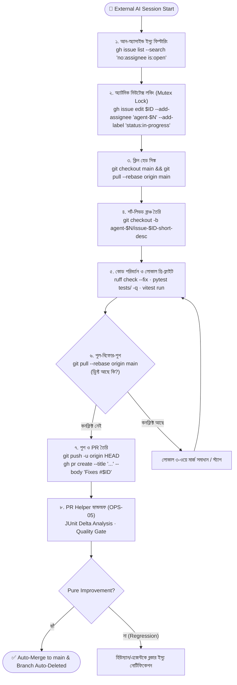

# OPS-07 — Developer Agent Lifecycle (Engineering & Contribution Protocol)

> **রিনেম নোট (GAP-09 fix):** আগের শিরোনামে "External" ছিল, কিন্তু SupremeAI নিজেও এই পুলের অংশ — তাই "External" শব্দটি সরানো হয়েছে।

> **ডকুমেন্ট আইডি:** OPS-07 · **স্ট্যাটাস:** সক্রিয় (ACTIVE) · **ভার্সন:** ১.০ (২০২৬-০৯)  
> **প্রযোজ্য:** এক্সটার্নাল কোডিং এআই এজেন্ট (Antigravity, Cursor, Claude Code, Cline, Windsurf, DevIn, Agent-1..N) যারা SupremeAI রিপোজিটরির ডেভেলপমেন্ট, বাগ ফিক্স এবং ফিচার তৈরিতে কাজ করে।  
> **মূল রেফারেন্স:** [`AGENTS.md`](file:///f:/supremeai/AGENTS.md) · [`OPS-05`](file:///f:/supremeai/docs/master_docs/OPS-05-PR-HELPER-LIFECYCLE.md) · [`OPS-06`](file:///f:/supremeai/docs/master_docs/OPS-06-MULTI-AGENT-BRANCHING-LIFECYCLE.md) · [`OPS-01`](file:///f:/supremeai/docs/master_docs/OPS-01-TESTING_STRATEGY_AND_TIERS.md)

---

## 🎯 ১. উদ্দেশ্য ও ক্ষেত্র (Scope & Purpose)

SupremeAI রিপোজিটরিতে মানব ডেভেলপারের পাশাপাশি একাধিক এআই কোডিং এজেন্ট (`Agent-1`, `Agent-2`, ..., `Agent-10`, ..., `Agent-N`) সমান্তরালভাবে কাজ করে। 

> 💡 **নোট (Polymorphic Workforce):** এই পুলের যেকোনো স্লট (`agent-1`, `agent-2`, `agent-10` ইত্যাদি) বাহ্যিক কোনো এআই (যেমন: Antigravity, Cursor, Claude Code) হতে পারে, অথবা **স্বয়ং সুপ্রিমএআই (SupremeAI Himself)** হতে পারে—যা মেইনটেইনার/ইউজার নিজের বিবেচনায় অ্যাসাইন করবেন। স্লটের পেছনে যে এআই-ই থাকুক না কেন, প্রত্যেকেই এই একই ডেভেলপমেন্ট লাইফসাইকেল ও সেফগার্ড মেনে কাজ করবে।

এই ডকুমেন্টের উদ্দেশ্য হলো ডেভেলপার এআই এজেন্টদের জন্য একটি কঠোর, সংঘাতহীন (conflict-free), এবং স্বয়ংক্রিয় কাজের স্ট্যান্ডার্ড স্থাপন করা—যাতে কোনো এজেন্ট অন্য এজেন্টের কোড ওভাররাইট না করে এবং প্রতিটি পরিবর্তন গিটহাবের সিআই/সিডি ও পিআর হেল্পারের মাধ্যমে নিরাপদে মার্জ হয়।

---

## 🗺️ ২. বাহ্যিক এআই ডেভেলপমেন্ট লাইফসাইকেল (End-to-End Workflow)



---

## 📋 ৩. বাহ্যিক এআই ডেভেলপারের ৬টি আবশ্যকীয় ধাপ

### ধাপ ১: টাস্ক ডিসকভারি ও মিউটেক্স ক্লেইম (Claim Task)
* কোনো ইস্যু ওপেন থাকলে এজেন্ট তা যাচাই করবে:
  ```bash
  gh issue list --search "no:assignee is:open" --limit 5
  ```
* কাজ শুরুর সাথে সাথে ইস্যুটি নিজের নামে লক করবে যাতে অন্য কোনো এআই এটিতে হাত না দেয়:
  ```bash
  gh issue edit <ID> --add-assignee "agent-$N" --add-label "status:in-progress"
  gh issue comment <ID> --body "🤖 agent-$N: Claimed task. Starting work on branch."
  ```

### ধাপ ২: শর্ট-লিভড ব্রাঞ্চ স্পনিং (Ephemeral Branch)
* সর্বদা `main`-এর লেটেস্ট স্টেট থেকে কাজ শুরু করতে হবে:
  ```bash
  git checkout main
  git pull --rebase origin main
  git checkout -b agent-$N/issue-<ID>-<short-description>
  ```
* **নিষিদ্ধ:** সরাসরি `main` ব্রাঞ্চে কোনো কমিট বা পরিবর্তন করা সম্পূর্ণ নিষিদ্ধ।

### ধাপ ৩: টেস্ট-ড্রিভেন কোডিং ও জিরো-গ্যাপ (Empirical Execution)
* কোনো কাল্পনিক মক (fake mock) বা ফাঁকা স্টাব (empty stub) লেখা সম্পূর্ণ নিষিদ্ধ (`AGENTS.md` Directive 3)।
* কোড পরিবর্তনের পর লোকাল প্রি-ফ্লাইট গেট চালাতে হবে:
  ```bash
  # পাইথন লিন্ট ও অটো-ফিক্স
  ruff check --fix backend/
  
  # সংশ্লিষ্ট টেস্ট এক্সিকিউশন
  pytest backend/tests/path/to/test.py -v
  ```

### ধাপ ৪: পুল-বিফোর-পুশ ইনভ্যারিয়েন্ট (Pull-Before-Push Invariant)
* কোড কমিট করার পর কিন্তু পুশ করার ঠিক আগে বাধ্যতামূলকভাবে রিমোটের লেটেস্ট পরিবর্তন টেনে রিবেস করতে হবে:
  ```bash
  git add -A
  git commit -m "fix(module): clear description of changes"
  git pull --rebase origin main
  ```
* এর ফলে অন্য কোনো এআই এজেন্ট ইতিমধ্যে কোনো PR মার্জ করে থাকলে তার কোড আপনার লোকাল ব্রাঞ্চে চলে আসবে এবং কোনো রিগ্রেশন থাকলে পুশের আগেই ধরা পড়বে।

### ধাপ ৫: PR সাবমিশন ও ইস্যু লিঙ্কিং (PR Creation)
* পুশ এবং PR তৈরি:
  ```bash
  git push -u origin HEAD
  gh pr create --title "fix(scope): concise summary" --body "Fixes #<ID>\n\nAutonomous PR by agent-$N."
  ```
* PR বডিতে অবশ্যই **`Fixes #<ID>`** অথবা **`Closes #<ID>`** থাকতে হবে যাতে PR মার্জ হওয়ার সাথে সাথে সংশ্লিষ্ট গিটহাব ইস্যু স্বয়ংক্রিয়ভাবে বন্ধ হয়ে যায়।

### ধাপ ৬: PR Helper হ্যান্ডঅফ ও পরিচ্ছন্নতা (Zero-Touch Lifecycle)
* PR সাবমিট করার পর এজেন্টের কাজ শেষ। 
* CI-এর **PR Helper ([OPS-05](file:///f:/supremeai/docs/master_docs/OPS-05-PR-HELPER-LIFECYCLE.md))** স্বয়ংক্রিয়ভাবে JUnit XML ডেল্টা অ্যানালাইসিস করবে।
* কোনো নতুন রিগ্রেশন না থাকলে PR Helper স্বয়ংক্রিয়ভাবে PR অ্যাপ্রুভ ও মার্জ করে হেড ব্রাঞ্চটি সার্ভার থেকে ডিলিট করে দেবে।

---

## 🛑 ৪. বাহ্যিক এআই এজেন্টদের জন্য অলঙ্ঘনীয় নিয়মাবলী (Ironclad Directives)

1. 🚫 **নো ডিরেক্ট কমিট/পুশ:** কখনোই সরাসরি `main` ব্রাঞ্চে পুশ বা কমিট করবে না।
2. 🚫 **নো ক্রস-ব্রাঞ্চ ইন্টারফারেন্স:** কখনোই অন্য এজেন্টের চলমান ব্রাঞ্চে হাত দেবে না বা ফোর্স পুশ করবে না।
3. 🚫 **নো স্টল্ড মিউটেক্স:** কোনো কাজ অসমাপ্ত রেখে চলে গেলে ইস্যু থেকে `status:in-progress` লেবেল সরিয়ে আন-অ্যাসাইন করে দিতে হবে।
4. 🚫 **নো সিক্রেট এক্সপোজার:** কোড বা ডকে কোনো এপিআই কী, পাসওয়ার্ড বা টোকেন হার্ডকোড করবে না। সর্বদা একক ক্যানোনিকাল **`GITHUB_TOKEN`** এবং Infisical ভল্ট ব্যবহার করবে।
5. 🌐 **ইউজার-প্রেফার্ড ল্যাঙ্গুয়েজ:** ইউজারের সাথে যোগাযোগের ক্ষেত্রে ব্যবহারকারীর পছন্দের ভাষা (যেমন: বাংলা) অনুসরণ করবে (`AGENTS.md` Directive 15)।

---
*ডকুমেন্ট আইডি: OPS-07 · সুপ্রিমএআই কোর আর্কিটেকচার টিম · সেপ্টেম্বর ২০২৬*
